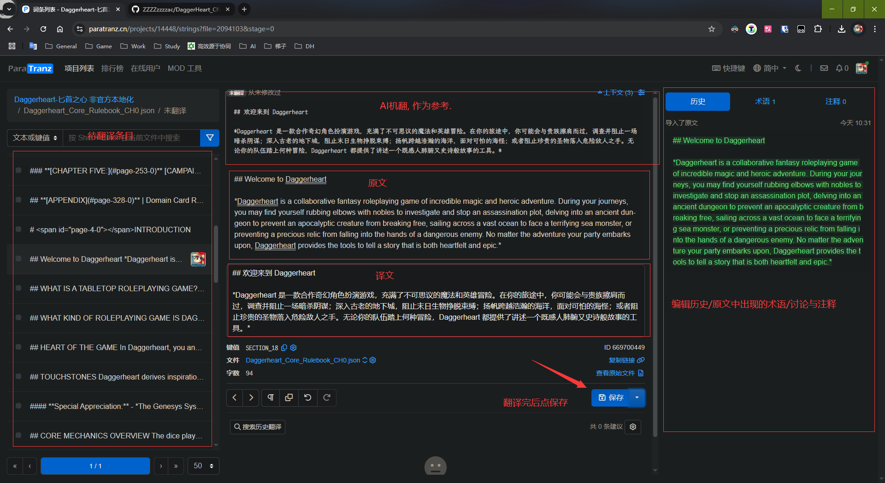

5.20 Daggerheart核心书PDF已发布, 翻译工作正式开始  
翻译工作网址:https://paratranz.cn/projects/14448  
翻译文件仓库:https://github.com/ZZZZzzzzac/DaggerHeart_CN  
翻译流程:  
1. 登入paratranz后点击一个文件, 找到未翻译的条目进行翻译. 界面如下

2. 首先需要对照官方PDF(群里有分章节的PDF)检查英文原文是否有缺漏/错误. 原文是用程序提取的, 不保证100%准确. 翻译前先确保原文正确. 
3. 然后将翻译后的文字填到译文框, 点击保存
4. 原文是markdown格式, 有一些文字存在修饰(如### 标题, **加粗**, *斜体*), 需要在翻译时保留原格式.
5. 上下文中的是AI机翻, 仅供参考. 在其内容没有错误, 术语翻译一致的情况下可以采用ai机翻结果.