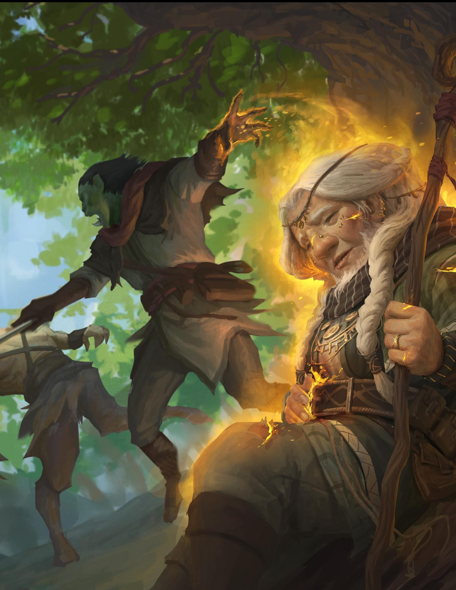
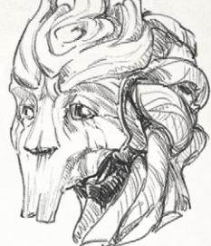
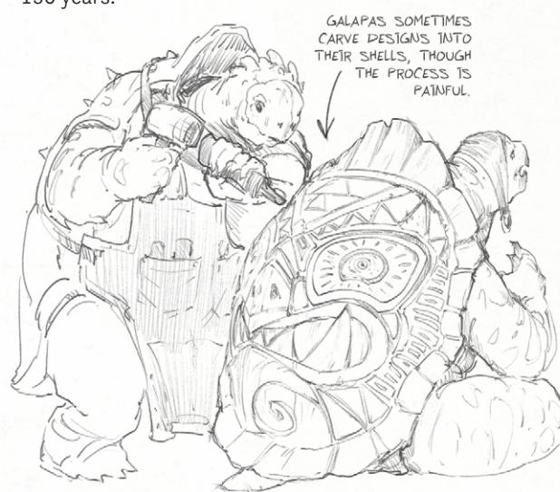
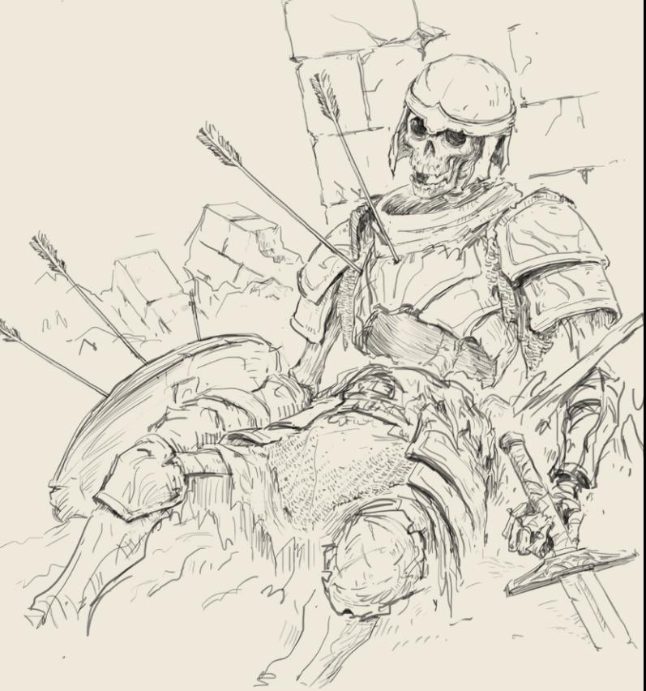
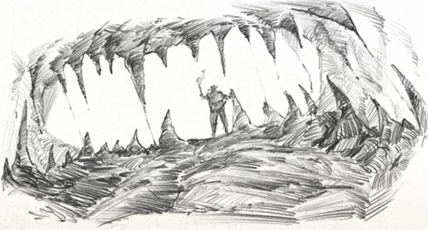
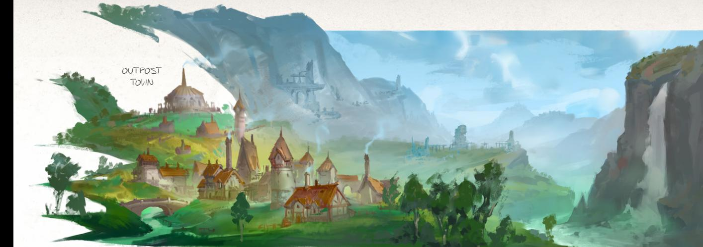
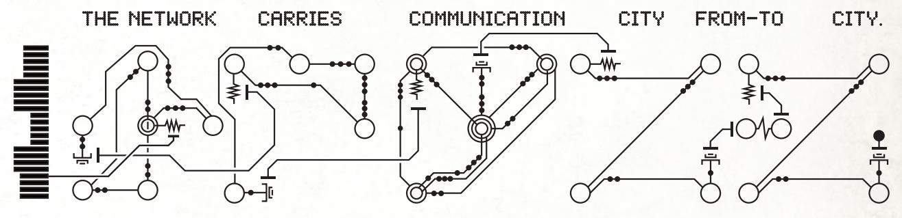
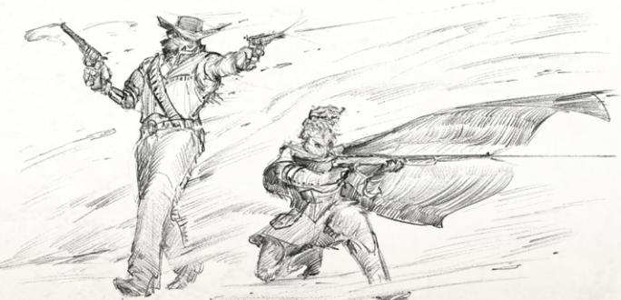

## DAGGERHEART 团队

#### **首席游戏设计师：** Spenser Starke

**其他游戏设计师：** Carlos Cisco, Rowan Hall, John Harper, Matthew Mercer, Alex Uboldi, Mike Underwood

**其他撰稿人：** Layla Adelman, Meguey Baker, Banana Chan, Chris Davidson, Rue Dickey, Felix Isaacs, Erin Roberts, Deven Rue, Rogan Shannon, Mark Thompson, Eugenio Vargas, Chris Willett

**开发编辑：** Laura Hirsbrunner, Amber Litke, Sadie Lowry **其他编辑：** Ashley Michaela "Navigator" Lawson, Scott Gray, Sebastian Yūe

**高级 RPG 制作人：** Elise Rezendes

**初级游戏制作人：** Madigan Hunt, Alex Teplitz

**开发协调员：** Dani Gage

**制作团队：** Robin Ekberg, Lexi McQueen

**其他制作：** Alex Uboldi

**艺术总监：** Anthony Jones

**助理艺术总监：** Leesha Hannigan

**游戏测试项目协调员：** Brieger Creative

**首席平面设计：** Matt Paquette & Co.

**其他平面设计：** John Harper, Vee Hendro

**顾问：** Tom Bloom, Daniel Delgado, Rue Dickey, Marty Elmer, Hank Finnin, Rob Hebert, James Mendez Hodes, David Iezzie, Pam Punzalan, Erin Roberts, Deven Rue, Rogan Shannon, Christine Sandquist, Mark Thompson **首席概念艺术家：** Shaun Ellis

**制图师：** "MarcoMaps" Bernardini

**核心封面：** Mat Wilma

**限量版封面：** Dominik Mayer

#### **卡牌背面：** Simon Pape

**艺术家：** Nick Acuna, Juan Salvador Almencion, Mauro Alocci, Ana Amaral, Anthony Avon, Mike Azevedo, Zoe Badini, Diana Bakieva, Adam Barker, Eliot Baum, Paul Scott Canavan, Carlos Cardona, Edgar Cardona, Kristina Carroll, Stephanie Cost, Luísa Costa, Katya Cyan, Cybercatbug, Daarken, Nikki Dawes, Carlos C. Díaz, Benjamin Ee, Geoffrey Ernault, Letícia Freitas, Bear Frymire, Gaboleps, Laura Galli, Kristina Gehrmann, James Green, Grant Griffin, Arturo Gutiérrez González, Juan Gutierrez, Leesha Hannigan, Rick Hefner, Suzanne Helmigh, Hendry Iwanaga, Jessketchin, Anthony Jones, Jack Jones, KarrahE, Sam Key, Ivan Koltovich, Alex Konstad, Samantha Kung, Linda Lithén, Samantha B. Lucas, Danil Luzin, Dominik Mayer, Julia Metzger, Maxime Minard, Andrea Tentori Montalto, José Muñoz, Reiko Murakami, Laura Marie Neal, Irina Nordsol, Tamara Osborn, Mike Pape, Jen Estirdalin Pattison, Mila Pesic, Henry Peters, Rafater, Andreas Rocha, Ryan Christian Rodero, Joshua Rodriguez, Henrik Rosenborg, Ilya Royz, Allan Santos, Stanislav Sherbakov, Ernanda Souza, Fernanda Suarez, Jenny Tan, Mat Wilma, Maciej Wojtala

#### **游戏准备工具：**

*CATS：* P.R. O'Leary *界线与帷幕：* Ron Edwards *X卡：* John Stavropoulos

*本游戏由一支多元化的团队打造，团队成员来自不同种族、民族、性别、信仰、性取向和身份背景。*

#### **Daggerheart 核心规则书**

ID 529428

首次印刷 2025 标准版 ISBN - 9798991384100 限量版 ISBN - 9798991384117

版权所有 © 2025 Darrington Press LLC。保留所有权利。本书被视为 DRP 已出版内容，并包含 Darrington Press 社区游戏许可 (DPCGL) 中定义的公共游戏内容。此类内容仅可在 DPCGL 允许的范围内使用。

有关如何使用 Daggerheart 创建和销售您自己的冒险、补充内容等，请访问 [www.darringtonpress.com/license](http://www.darringtonpress.com/license)。

出版商联系信息：[www.darringtonpress.com](http://www.darringtonpress.com)，[info@darringtonpress.com](mailto:info%40darringtonpress.com%20?subject=)

中国印刷

## DARRINGTON PRESS 团队

**DARRINGTON PRESS 负责人：** Ivan Van Norman **创意总监：** Travis Willingham

**首席运营官：** Ed Lopez

**高级副总裁 - 市场营销：** Rachel Romero

**高级市场经理：** Darcy Ross

**产品市场经理：** Gary Thomas

**高级游戏设计师：** Spenser Starke

**游戏设计师：** Rowan Hall

**高级 RPG 制作人：** Elise Rezendes

**高级游戏制作人：** Alex Uboldi

**零售合作经理：** Katie Lowther

**采购总监：** Ally De Simone

#### **社区经理：** Alex Hill

**CRITICAL ROLE 员工：** Spencer Aitken, Efrain Alvarez, Sauol Ambriz, Brittney Austin, Leo Baltierrez, Taylor Burke, Diana Jeanne Calalo, Sarah Marie Campbell, Dani Carr, Niki Chi, Adrienne Cho, Shikina Collins, Ally De Simone, Jared Deiro, Shaunette DeTie, Nadia Dilbert, Steve Failows, Maria Flores, Christian Fox, Lana Gotlinskaya, Rowan Hall, Alex Hill, Bryn Hubbard, Maxwell James, Chris Jansen, Megan Karnish, Jade Kirk, Annie Krueger, Will Lamborn, Tal Levitas, Ed Lopez, Chris Lott, Jonathan Lott, Katie Lowther, Sam Maggs, Britton McGrath, Ashley Middlebrook, Aaron Monroy, Khoa Nguyen, Eddie Ochoa, Chyanne Owen, Elia Palacios, Leo Rassool, Elise Rezendes, Jerry Rivas, Richard Romasanta, Rachel Romero, Darcy Ross, Max Schapiro, Eli Schiff, Kyle Shire, Vinnie Singh, Gustin Smith, Spenser Starke, Dylan Steppeler, Gary Thomas, Jordyn Torrence, Alex Uboldi, Ben van der Fluit, Ivan Van Norman, Jen Veloso, Brittany Walloch, Kirby Winslow, Justin Wong, Nicole Yonan

# 目录

## **[引言](#page-4-0)**

| 欢迎来到 Daggerheart |  |  | 4 |  |
|--------------------|--|--|---|--|
| 本书使用指南       |  |  | 7 |  |
| 游戏所需物品       |  |  | 8 |  |
| 玩家原则           |  |  | 9 |  |
| 众生平等的牌桌     |  |  | 9 |  |

## **[第一章：](#page-11-0)** [冒险准备](#page-11-0)

| 世界概览11             |
|------------------------------|
| 角色创建 13     |
| 角色范例22          |
| 领域 24                |
| 职业 27                  |
| 吟游诗人28                       |
| 德鲁伊 30                  |
| 守护者36                   |
| 游侠 38                 |
| 盗贼42                      |
| 炽天使 44                 |
| 术士46                   |
| 战士48                    |
| 法师 50                 |
| 血统 52               |
| 社群 72              |
| 更多玩家指引82 |

## **[第二章：](#page-86-0)**

## [进行一场冒险](#page-86-0)

| 游戏流程 87          |
|---------------------------------|
| 核心机制 89            |
| 聚光灯 89             |
| 你的回合 89              |
| 二元骰 90              |
| 闪避值91                       |
| 生命点与伤害阈值91        |
| 压力 92                    |
| 动作掷骰 92              |
| 动作掷骰范例 95       |
| 故事即结果95          |
| 特殊动作掷骰 96      |
| 伤害掷骰 98              |
| 反应掷骰99                |
| 优势与劣势100     |
| 对抗敌方 100     |
| 领域卡101                 |
| 状态 102               |
| 倒计时 102                   |
| 地图、距离与移动 103      |
| 目标与群组 104         |
| 掩护、视野与黑暗 104 |
| 金币104                         |
| 休息时间 105                 |
| 死亡 106                    |
| 附加规则 107         |
| 玩家最佳实践108        |
| 升级 109              |
| 装备 112                |
| 主要武器表格115        |
| 次要武器表格 124  |
| 护甲表格 126             |
| 战利品 129                     |
| 完整游戏范例 134     |
|                                 |

## **[第三章：](#page-140-0)**

| 进行一场冒险                        |
|---------------------------------------------|
| 引言 140                         |
| 核心指引140                            |
| 核心GM机制 148                    |
| 进行GM掷骰 148                      |
| 要求动作掷骰 148             |
| 执行行动 149                             |
| 恐惧 154                                 |
| 设定掷骰难度 157              |
| 给予优势与 劣势 160 |
| 敌方掷骰 160                      |
| 职业希望特性 161                  |
| 倒计时 162                               |
| 金币、装备与战利品 165            |
| 运行GM控制的NPC166                          |
| 可选GM机制168                    |
| 零会与安全工具 169              |
| 进行一场游戏 173                    |
| 进行一次性游戏 184                   |
| 进行一场战役 185                       |

## **[第四章：](#page-193-0)** [敌方与](#page-193-0) [环境](#page-193-0)

| 使用敌方193           |     |
|--------------------------------|-----|
| 选择敌方 197    |     |
| 敌方属性块 209   |     |
| 使用环境 240      |     |
| 环境属性块 242 |     |
| 战役框架解析       | 253 |
| 枯萎荒原                 | 254 |
| 五旗燃烬。          | 262 |
| 巨兽盛宴。                   | 270 |
| 幽影纪元               | 280 |
| 主板。                   | 290 |
| 干地巨像。      | 308 |

### **[第五章：](#page-253-0)** [战役框架](#page-253-0)

## **[附录](#page-328-0)**

| 领域卡参考 |  |  |  | 328 |
|-----------------------|--|--|--|-----|
| 人物卡343    |  |  |  |     |
| 附加表格344  |  |  |  |     |
| 战役框架地图   |  |  |  | 357 |
| 索引                 |  |  |  | 363 |

▵

# 引言

## 欢迎来到 Daggerheart

*Daggerheart 是一款合作奇幻角色扮演游戏，充满了不可思议的魔法和英雄冒险。在你的旅途中，你可能会与贵族擦肩而过，调查并阻止一场暗杀阴谋；深入古老的地下城，阻止末日生物挣脱束缚；扬帆跨越浩瀚的海洋，面对可怕的海怪；或者阻止珍贵的圣物落入危险敌人之手。无论你的队伍踏上何种冒险，Daggerheart 都提供了讲述一个既感人肺腑又史诗般故事的工具。*

## 什么是桌面角色扮演游戏？

桌面角色扮演游戏，简称 TTRPG，是一种互动式叙事体验，玩家在共享的世界中扮演角色，并合作讲述关于这些角色的故事。Daggerheart 旨在由三到六人组成的小组或桌子进行游戏，其中一人担任游戏主持人（或 GM），而其他人则各自扮演一个角色，称为玩家角色（或 PC）。GM 推动围绕 PC 展开的故事——他们为叙事引入奖励、复杂情况和后果，扮演故事中的其他角色（也称为非玩家角色或 NPC），并帮助故事在每次你们一起游戏时向前发展。

与许多角色扮演游戏一样，Daggerheart 使用骰子来决定某些不确定事件的结果，为你的选择结果提供不可预测的元素。尽管如此，游戏仍然拥抱玩家的主动性和想象力；你选择扮演的角色类型以及你对他们的背景和经历所做的决定将使你在这些骰子掷骰中获得更好（或更差！）的几率。

## Daggerheart 是一款怎样的角色扮演游戏？

Daggerheart 是一款以英雄主义和叙事为核心的游戏体验，其中战斗是游戏的重要组成部分。该系统有助于讲述引人入胜、由玩家主导的故事，并穿插着激动人心的战斗和严峻的挑战。游戏采用“故事优先”的方式，鼓励玩家和 GM 之间真诚互动，专注于他们正在讲述的故事，而不是机制的复杂性。当动作或事件在故事中如何解决不明确时，规则提供了结构。该系统对战斗采取流畅的处理方式，避免因细致的回合而减慢游戏节奏，并且不依赖于网格移动来构建地图和使用微缩模型。这些方面结合起来，创造了一款既能实现以微缩模型为基础的系统所闻名的地形和地图构建，又能为玩家提供流畅叙事体验的游戏。

如果你正在寻找一款以现代机制处理方式讲述英雄奇幻故事的 TTRPG，并且既注重史诗般的战斗，也注重参与战斗的角色的情感叙事，那么你来对地方了。

Daggerheart 还采用了非对称设计，这意味着 GM 和玩家的游戏方式不同。玩家为他们的 PC 的标准行动，包括攻击，掷两个十二面骰。GM 在大多数行动中无需掷骰，但他们会为需要掷骰的敌方行动掷一个二十面骰。这种非对称设计旨在帮助所有参与者为桌旁的每个人创造一次难忘的体验。

## 游戏核心

在 Daggerheart 中，你和你的同伴们轮流描述你们的角色所做的事情。GM 决定这些行动的后果，然后引导小组共同发展叙事，因为这些后果。当规则要求或情况需要时，你将掷骰子来决定接下来发生的事情。根据掷骰的结果，正在进行的故事事件将以新的、出人意料的方式展开。

在 Daggerheart 中，没有传统意义上的“赢”或“输”。游戏是一种合作叙事体验，目标是共同演绎一个精彩的故事。即使角色未能立即实现他们的目标，犯下大错，甚至死亡，他们也从未“输”。如果一个角色死亡，队伍可以寻找方法让他们复活，或者该玩家可以创建一个新角色，让队伍在旅途中遇到。如果小组未能阻止反派实施可怕的计划，他们可能会面临失败的后果并努力弥补。如果他们成功了，他们可能会凯旋而归——或者他们可能会激怒或鼓舞一个更强大的敌人进行报复。无论故事中发生什么，只要你们齐心协力创造一个对每个人来说都充满乐趣和激动人心的叙事，你们就已经赢了。

## 基石

Daggerheart 的灵感来源于多种来源。以下是设计团队在制作此游戏时借鉴的部分媒体列表。

**TTRPGs:** Pelgrane Press 的 *13th Age*，Evil Hat Productions 的 *Apocalypse Keys*，Lumpley Games 的 *Apocalypse World*，Evil Hat Productions 的 *Blades in the Dark*，Son of Oak Game Studio 的 *City of Mist*，Fandom Tabletop 的 *Cortex Prime*，Monte Cook Games 的 *Cypher System*，Modiphius Entertainment 的 *Dishonored*，Wizards of the Coast 的 *Dungeons & Dragons*，MCDM Productions 的 *Flee, Mortals!*，Darrington Press 的 *For the Queen*，Fantasy Flight Games 的 *Genesys*，One Seven Design 的 *Lady Blackbird*，Magpie Games 的 *Masks: A New Generation*，Paizo Publishing 的 *Pathfinder*，Catalyst Game Labs 的 *Shadowrun*，Buried Without Ceremony 的 *The Quiet Year*，Mythopoeia Games Publications 的 *The Wildsea*，Mythopoeia Games Publications 的 *Slugblaster*。

**书籍:** Garth Nix 的 *Sabriel*，George R.R. Martin 的 *A Song of Ice and Fire*，J.R.R. Tolkien 的 *The Lord of the Rings*，Robert Jordan 的 *The Wheel of Time*，Ursula K. Le Guin 的 *A Wizard of Earthsea*。

**电影和电视:** *The Dragon Prince*，*The Legend of Vox Machina*，*The Lord of the Rings*，*The Witcher*，*Guardians of the Galaxy*，*The Dark Crystal*。

**电子游戏:** Gearbox Software 的 *Borderlands*，BioWare 的 *Dragon Age: Inquisition*，Bethesda Game Studios 的 *The Elder Scrolls* 系列，People Can Fly 的 *Outriders*。

#### **特别鸣谢：**

- Fantasy Flight Games 的 *Genesys System* 为二元骰（Duality Dice）的两轴结果提供了重要灵感。
- Monte Cook Games 的 *Cypher System* 及其 GM 入侵（GM Intrusions）为花费恐惧点（Spend Fear）来打断场景铺平了道路。
- 在许多其他方面，Wizards of the Coast 的 *Dungeons & Dragons* 的优势/劣势系统尤其启发了本游戏的骰子机制。
- Pelgrane Press 的 *13th Age* 发展了背景（Backgrounds），极大地启发了经历（Experience）机制。
- Evil Hat Productions 的 *Blades in the Dark* 和 Lumpley Games 的 *Apocalypse World* 帮助塑造了游戏的叙事流程，它们的玩家手册（playbooks）启发了角色卡的大量开发。
- Mythopoeia Games Publications 的 *The Wildsea* 及其关于“区域”（Reaches）的精彩章节为本书的战役框架（Campaign Frames）部分提供了灵感。
- Wizards of the Coast 的 *Dungeons & Dragons* 第四版的设计以及 MCDM Productions 的 *Flee, Mortals!* 中的怪物设计，为敌人类型和管理爪牙的方式提供了参考。
- Buried Without Ceremony 的 *The Quiet Year* 启发了本书战役指南中的地图构建部分。
- Evil Hat Productions 的 *Apocalypse Keys* 为零号会话（session zero）的范例结构提供了参考。

## 核心机制概览

在 Daggerheart 中，玩家使用的骰子主要分为两类——你的二元骰（Duality Dice）和你的伤害骰（damage dice）。你的二元骰是两个颜色不同的十二面骰（或 d12），分别代表希望（Hope）和恐惧（Fear）。这些骰子体现了世界的命运及其对角色成功的影响。你的伤害骰对应你的角色所挥舞的武器或施放的法术，表达了成功攻击的致命程度。

当你掷骰来判定你的角色是否成功完成一项任务或挑战时，你掷出你的二元骰并将它们的结果相加，然后加上你的角色对该行动适用的任何加值。如果总和等于或高于 GM 设定的难度（Difficulty），你的角色就成功了。如果低于，则失败。你还需要告诉 GM 你的希望骰还是恐惧骰点数更高，因为你周围的情况会根据这个结果而改变。我们将在第 2 章的“核心机制”部分更深入地讨论这一点。

## 会话与战役

当 GM 和玩家聚集在一起玩 Daggerheart 时，这场游戏被称为一个会话（session）。每个会话都是一个小故事，如果团队玩更多会话，这些小故事就会成为一个更大叙事的一部分，这个叙事被称为战役（campaign）。较长的战役可以被分解成多个篇章（arcs）——多个会话共同聚焦于故事的某个特定部分。如果推翻腐败统治者是一个战役，那么从邻国招募盟友就是该战役中的一个篇章。

Daggerheart 的设计旨在适应多种故事类型。你们团队可能喜欢玩一个持续数月、开放式的战役，每周见面无限期地延续角色的故事；或者你们可以指定一个固定的会话数，玩一个有明确结束点的战役。你们团队可能喜欢用一组角色进行短暂的十个会话的冒险，然后再创建新角色；或者你们可能只想玩一个会话，这被称为“一次性游戏”（one-shot）。所有这些选择都是很棒的游戏方式——选择最适合你们团队的方式。

## 黄金法则

Daggerheart 最重要的规则是让游戏成为你自己的。本书中包含的规则旨在帮助你在牌桌上享受游戏体验，但每个人对规则的解读和故事的讲述方式都不同。规则绝不应该阻碍你想讲述的故事、你想扮演的角色或你想进行的冒险。只要你的团队同意，一切都可以调整以适应你的游戏风格。如果有一条规则你宁愿忽略或修改，请随意在你的团队同意下进行任何更改。

## 判例优先于规则

在玩 Daggerheart 时，GM 和玩家应始终将判例（rulings）置于规则（rules）之上。本书提供了许多关于游戏的问题解答，但无法解答所有问题。当对规则的应用有疑问时，GM 应根据叙事进行判例。

例如，Daggerheart 中有一种名为抓钩（grappler）的武器，可以让你将目标拉近。如果你试图用它拉动整座城堡，武器文本并没有禁止你这样做——但这在叙事上说不通。相反，GM 可能会判例你只能拉下几块砖头，或者将你自己拉向墙壁。

同样，如果你的角色做了会导致立即死亡的事情——例如在没有保护的情况下跳入活火山——你可能无法进行 Daggerheart 的死亡行动（death moves），通常这些行动能让你在角色生命最后时刻控制他们的命运。这类后果应在行动完成前明确说明，并且应始终遵循世界观的逻辑。作为一款注重叙事的游戏，Daggerheart 不鼓励对规则进行脱离语境的技术性解读。一切都应回归到故事本身，GM 有权力和责任对规则的应用进行判例，以强调故事。

## 如何使用本书

《Daggerheart 核心规则书》分为五个章节。

## 第一章：准备冒险

本章涵盖了你在 Daggerheart 系统中创建角色所需了解的一切。

## 第二章：进行冒险

本章详细介绍了进行游戏所需的核心游戏机制，以及如何升级角色、兼职以获得新的领域，以及使用你在游戏中可能发现的特殊装备。

## 第三章：进行冒险

本章专为 GM 设计，提供了进行游戏和战役所需的工具。除了详细介绍核心 GM 机制外，本章还指导你使用安全工具、进行零号游戏、定制战役地图、规划故事线等。

## 第四章：

## 敌方和环境

本章提供规则和属性块，用于为你的世界填充具有挑战性的敌方和动态环境。你可以使用预生成的敌方和环境属性块，或者遵循本章的指导创建自己的。

## 第五章：战役框架

本章提供了战役框架选项，你可以用来构建长期的游戏。

## 附录

最后，这里可以找到领域卡文本、角色表、角色指南、地图以及游戏的所有其他参考文档。

## 你需要什么来玩？

*玩一局《匕首心》所需的大部分工具都包含在这本书中，但在开始之前，你还需要准备一些额外的组件。*

## **2-5名玩家**

《匕首心》最适合两到五名玩家一起玩，他们渴望合作并共同构建一个故事。如果你扮演的是玩家角色（PC），你的职责是代入你角色的心态，并决定他们做什么。游戏主持人（GM）会提出问题和障碍，而你要想办法以最有趣的方式应对这些挑战。作为一名玩家，你的任务是通过你做出的选择来塑造你角色的故事，并在其他角色也在这次旅程中成长时，让他们成为焦点。

## **一位游戏主持人**

如果你扮演的是GM，你将扮演世界本身，并对PC的行动做出回应。这意味着你将为角色设置令人兴奋的场景，管理故事的流程，并扮演任何非玩家角色（NPC），包括角色将面对的敌人。你还会向玩家提问，推动叙事向前发展。通常，你将是了解规则并能在游戏中回答关于机制问题的人。如果在游戏中需要对规则书之外的规则或机制做出判断，你将是那个做决定的人。

作为GM，重要的是要记住，你不是玩家的对立力量。虽然你是场景中引入危险和复杂情况的人，但你提供的惊险挑战是为了让玩家展示他们角色的优势，并面对他们角色的缺点。成为角色的粉丝，并与你桌旁的玩家成为合作者。

## **游戏用骰**

《匕首心》使用全套多面体骰子：d4、d6、d8、d10、d12、d20 和 d100。当提及单个骰子以外的数量时，游戏会指明数量和类型，例如 2d6（两个六面骰子）或 3d8（三个八面骰子）。玩家需要 2d12 不同颜色的骰子（你的二元骰），以及至少一套多面体骰子供全桌共用。你可能会发现每人一套更方便。随着你的角色升级，你会掷更多骰子来代表这些进步，所以再多带一套或两套可能会有帮助。GM 也需要自己的一套骰子来运行敌方。

## **标记物**

角色标记物是代表你角色外观和感觉的小物件。开始时，每位玩家大约准备七个标记物。随着你的角色升级，你将需要更多——虽然数量取决于角色的构建，但在10级时，你可能不会需要超过十五个标记物。

在玩游戏时，你会使用这些标记物来帮助追踪几件事情：

- 当你掷骰子时，你会添加标记物，以便轻松计算掷骰的修正值。
- 要使用某些特性，你可能需要在卡牌或角色表中放置标记物。

这些标记物不仅使你的掷骰更容易结算，还提供了一个机会来进一步表达你角色的风格和色彩搭配。你可以使用任何小物件（塑料宝石、硬币、纽扣），但我们建议使用不大于一角硬币、可以平稳地放在桌面上而不会滚走的东西。理想情况下，每位玩家的标记物应该在视觉上有所区分，以避免混淆。

GM可以使用标记物来追踪他们积累的“恐惧”（Fear），并作为敌方属性块上的计数器。

## **游戏卡牌**

除了这本规则书，你还需要核心套装中包含的卡牌：血统、社群、子职业和领域卡牌。如果你没有实体卡牌（或者需要额外的副本），你可以在家下载并打印卡牌。附录中的“领域卡牌参考”部分也包含了核心套装中的卡牌文本。

## **角色表和笔记**

附录中包含一张通用角色表和你可以用来构建角色的指南，但为了获得最佳体验，我们建议使用 www.daggerheart.com 上的职业专属角色表。本规则书的其余部分将假设你正在使用职业专属角色表。如果你使用纸笔，你需要将这些材料打印出来。如果你使用数字版本，请确保你有一台笔记本电脑或平板电脑，以便在游戏过程中查看和编辑你的角色表和指南。

我们还建议准备纸和笔（或数字替代品），用于记录 GM 或其他玩家分享的重要细节。

## **可选：地图和微缩模型**

你可以使用地图和微缩模型来表示玩家所面对的场景，尤其是在战斗中，以便更充分地描绘场景，而不是仅仅依靠叙述和描述。在绘制或构建地图时，比例、距离和细节并非总是完美的，但这没关系。地图和微缩模型绝不应限制你的想象力——它们只提供额外的空间背景，以便每个人都能清晰地想象出场景。

## 玩家原则

*我们建议玩家在参与 Daggerheart 游戏时遵循以下原则，以充分体验该系统。*

- → 成为你角色和其旅程的粉丝。
- → 聚焦你的朋友。
- → 面向角色说话，也面向玩家说话。
- → 一起构建世界。
- → 通过游戏来发现会发生什么。
- → 轻柔地把握。

## **成为你角色和其旅程的粉丝**

想方设法展示你角色最擅长和最不擅长的事情。努力做出有趣的选择，并通过游戏更多地了解他们是谁。推动你角色的故事向前发展，让他们随着故事一起成长。

## **聚焦你的朋友**

寻找机会让其他角色成为焦点。为他们提供机会展示他们最擅长的事情，向他们寻求帮助并慷慨地提供你的帮助，并鼓励他们分享更多他们的想法和感受。

## **面向角色说话，也面向玩家说话**

在故事世界中与其他角色对话。依靠你们共同建立的联系，向他们提问，并通过对话和行动共同创造故事。

在故事之外与其他玩家对话。问他们他们的角色可能会做什么，以及他们希望在故事中看到什么发生。在游戏过程中，体谅他们的偏好和愿望。

## **共同构建世界**

在 Daggerheart 中，每个参与者都是故事讲述者，而不仅仅是 GM。Daggerheart 是一款高度协作的游戏，当每个玩家（包括 GM）都共同努力时，它才能发挥最大的潜力。这意味着积极争取你希望看到的故事情节，提供建议以丰富其他玩家角色的弧光，与同桌的其他玩家一起创造世界的一部分，并深入思考你角色的动机。

## **玩下去，看看会发生什么**

你在桌边所做的一切都应该源于故事。倾听你的同伴玩家和 GM——然后对他们的角色所说和所做做出反应，在彼此的创造力基础上共同发现故事。如果你掷了骰子，就让结果引导你接下来会发生什么。以拥抱胜利同样的活力去拥抱复杂情况。

## **温柔地抓住**

即兴故事讲述并不总是完美的，这没关系。温柔地抓住故事——足以让你不丢失重要的部分，但又不要抓得太紧，以免故事没有呼吸的空间。允许自己犯错和做出改变。打磨边缘，使其符合故事。即使故事走向不如你所愿，或者突如其来的转折让你措手不及，也要相信 GM 和你的同伴玩家最终会共同创造出美丽而难忘的作品。

遵循这些原则将帮助你和同伴在桌边一起讲述激动人心、不可预测且富有意义的故事。

## 适合所有人的游戏桌

Daggerheart 是一款适合所有种族、民族、性别、信仰、性取向和身份的玩家的游戏。游戏中的每个玩家都有责任确保你们共享的游戏桌是一个让每个人都感到被赋予力量、受到尊重且安全的地方。

由于角色扮演游戏开放式故事讲述的性质，可能会触及对某些玩家来说困难或敏感的话题。对你来说可能只是一个虚构场景的主题，对其他人来说可能是一个个人或令人不适的现实生活话题。当你们第一次聚在一起玩时，务必讨论一下你们都希望获得什么样的体验，并提出任何你们想避免的主题或话题。每个人都应该遵守这个社会契约，并随时根据需要添加或修改。

第三章的“零会和安全工具”部分提供了你可以用来帮助共同应对困难场景的资源。

# 第一章：准备冒险

*在本章中，你将为你的第一场 Daggerheart 游戏做准备。接下来的章节将描述 Daggerheart 的世界构建基础，然后引导你创建角色，同时提供关于每个职业、领域、血统和社群的信息。*

## 世界概览

Daggerheart 鼓励探索充满强大魔法、奇妙景观、神话野兽、动态派系、激动人心的谜团和强大敌人的世界。虽然你们的游戏桌共同创造的世界将是你们自己的，但 Daggerheart 已经建立了血统、社群、职业、能力和法术——因此一些世界构建方面在每个战役中都会类似地存在。

以下部分描述了核心领域，这些共享细节都源自于此。这些细节总是可以重新设定风味或修改，以匹配你们团队想要玩的游戏风格。在创建你们游戏桌独特的世界时，你们可以使用以下其中一个作为起点：一个你们已经熟悉的现有地点、一本补充设定集、第三章“运行战役”部分中创建自己世界的指南，或者第五章中的一个战役框架。

## 核心领域

**核心领域**是许多 Daggerheart 机制固有的世界构建元素的基础，例如其血统和敌人。

## **凡人领域**

大多数冒险很可能发生在凡人领域。这是陆地、海洋和天空，凡人在其中度过他们的一生——绝大多数物质生命和物体存在的位面。故事说这个领域是由遗忘之神在最早的时代创造的，这些不朽者在上方圣地和这个新位面之间穿梭，就像从梦中醒来一样容易。在此期间，神灵对凡人来说是熟悉的，神圣的行为司空见惯——无论是奇妙的还是可怕的。当遗忘之神被新神推翻时，许多这些古老的神灵被永远困在这个位面。

这个领域也居住着微弱神祇，这些是遗忘之神和新神创造的次等神祇，负责监管凡人领域。许多人被认为相当反复无常，尽管他们的影响范围比创造他们的神灵要小，但他们可以极大地影响凡人的生活。

## **上方圣地**

上方圣地是众神领域的集合，在最早时代末期被新神占领之前，曾属于遗忘之神。由于这个地方与大多数其他领域紧密相连，居住在这里的神灵无需离开他们的领域，就可以看到凡人领域的生物并与之交谈，尽管与神灵交流的那些生物可能会觉得他们的方式奇怪或模糊不清。新神可以通过一些方式离开上方圣地进入其他领域，但在当前时代，他们这样做总是必须牺牲对自己来说重要之物。传闻这种负担是由于他们希望保护圣地免受遗忘之神再次崛起的威胁而必需的，因为遗忘之神（或任何来自凡人领域的存在）也必须付出巨大代价才能进入上方圣地。这些牺牲导致了近千年来凡人领域发生的一些巨大灾难。

## **下方圈层**

下方圈层是低等领域的集合，许多遗忘之神，那些在起义中战斗得最激烈的神，被流放到这里。这些神灵被称为“堕落之神”，他们在最早的时代与新神的圣战中失败了，此后被认为是“玷污魔法的邪恶实践者”。因此，与他们一同被流放的微弱神祇通常被称为“恶魔”，而那些从这些生物繁衍下来的后代也背负着这个称谓的重担。

下方圈层被认为是腐败、毁灭和暴力之地。故事说这个领域是核心领域中最危险的一些生物的家园。大多数其他位面都有针对希望从下方圈层穿越而来的堕落之神的防御措施。在凡人领域，据说在进行大恶之举时使用奥术魔法会打开两个位面之间的临时裂隙，允许堕落之神通过。

## **彼岸领域**

宇宙之中还有许多领域，远不止于此——元素之地、星界领域、死亡之谷以及无数其他领域。从凡人领域进入和穿越这些地方需要专门的知识和艰苦习得的技能。然而，核心领域中的一些存在严密守护着这些秘密，并且可以被说服分享它们——当然，是要付出代价的。

## 魔法与法术

取决于你扮演的角色类型，他们可能拥有或不拥有使用魔法的能力。在《匕首之心》中，魔法既非常强大又极其危险，它渗透在这片土地上，并在人们体内显现。它既是一种内在的力量，可以在你的旅程中帮助你，也是一种外在的力量，影响着世界。

如果你的角色确实拥有施法能力，你将通过特定的武器、法术和其他方式来使用魔法。随着角色的成长，他们能够施展的魔法也会随之增强。每个等级，你都会获得描述他们可以驾驭的新的、强大的魔法以及使用它的具体参数的卡牌。

## 美化你的游戏

如果你的角色机械效果的默认描述不符合他们及其风格，你总可以用符合他们风格的方式来描述它们。这通常被称为“美化”。然而，除非你的游戏桌同意，否则这种美化不应提供超出效果现有描述的任何机械效果。

例如，你可以说你的游荡者的魔法以小工具和发明的形式出现，而不是神奇地创造出一团乌云，他们投掷烟雾弹。或者你的游侠的魔法可能以祖先之灵的形式出现，他们引出自然之力。也许在你的设定中，魔法以一种完全不同的方式运作，你可以解释每个职业的力量是如何来自不同来源的。只要它符合游戏的机制，我们鼓励你美化你的魔法，使其符合你的角色。

你也可以重塑物品。你的角色可能拥有来自他们血脉的独特武器，但它使用长剑的属性。你的法师的盔甲可能以一套强化符文的形式出现，而不是链甲，但它们仍然有护甲槽，你可以花费来减少伤害。在这种情况下，在休息期间“修复”你的盔甲可能意味着补充附魔。“调整能力和法术”一节提供了其他方法，你可以调整你的法术和能力，使其符合你的角色和舒适度。

## 角色创建

*除非你是游戏主持人（GM），否则《匕首之心》的第一步是创建你的角色。除了选择他们的职业、社群和血统，你还需要塑造他们的外貌、个性和过往经历，以及他们与其他角色的关系。其中一些决定纯粹是叙事性的，这意味着它们只通过你的角色扮演出现在游戏中；而另一些则是机械性的选择，会影响你在掷骰时更可能（或更不可能）成功的行动。*

## 入门

在创建你的角色之前，与你的游戏桌成员讨论战役并开始集思广益。

*提示：角色创建部分提及的许多机制将在第二章中详细讲解。*

## **进行一次零号会话**

如果你正准备和你的团队开始一场新的战役，我们建议你们第一次聚会时花时间创建角色并讨论你们将要游玩的世界。这通常被称为零号会话（[参见第 169 页的“零号会话和安全工具”部分](#page-169-0)），是确保每个人对战役的基调和氛围有共识的最佳方式，这样你们就能创建出配合默契的角色。

## **思考角色概念**

在开始角色创建过程之前，回顾资料并构思你想要扮演的角色类型可能会有所帮助。你的概念可以是浅显而笼统的——比如“一个使用魔法的马戏团表演者”或“一个在海上失去船只的船长”——但即使只是一个基本的起点，也能帮助你在接下来的每一步中做出选择。

## 步骤 1：选择你的职业

角色创建的第一步是选择你想要扮演的**职业**。每个职业都是一种基于角色的原型，决定了你在整个战役中能使用哪些能力。例如，如果你想成为团队中的“坦克”，冲锋陷阵，用自己的生命保护他人，你可能会选择扮演一名守护者。如果你想施展独特的法术来解决问题、治疗队友并运用狡猾的战斗魔法，你可能会选择成为一名法师。

选择职业后，你还需要选择一个**子职业**。子职业是每个职业的细分，进一步定义了你的角色原型。

## 职业选项

*核心规则书中包含以下职业和子职业：*

## 吟游诗人

**子职业：** *[吟游诗人](#page-28-0) 或 [文字匠](#page-29-0)*

## 德鲁伊

## **子职业：** *[元素守护者](#page-30-0) 或 [复苏守护者](#page-31-0)*

**如果你想化身** [荒野的自然元素](#page-30-0)，则扮演**元素守护者**。

**如果你想使用强大的** [魔法来治疗你的队伍](#page-31-0)，则扮演**复苏守护者**。

## 守护者

**子职业：** *[坚毅者](#page-36-0) 或 [复仇者](#page-36-0)*

**如果你想承受沉重的** [打击并继续战斗](#page-36-0)，则扮演**坚毅者**。

**如果你想击倒** [伤害你或你盟友的敌人](#page-36-0)，则扮演**复仇者**。

**子职业：** *[野兽羁绊者](#page-38-0) 或 [寻路者](#page-39-0)*

**如果你想与动物盟友建立深厚的** [羁绊](#page-38-0)，则扮演**野兽羁绊者**。

**如果你想狩猎猎物** [并以致命的力量打击](#page-39-0)，则扮演**寻路者**。

## 游荡者

## **子职业：** *[夜行者](#page-42-0) 或 [辛迪加](#page-43-0)*

**如果你想操纵** [阴影以便在环境中穿梭](#page-42-0)，则扮演**夜行者**。

**如果你想在** [所到之处都有一个联系人网络](#page-43-0)，则扮演**辛迪加**。

## 圣天使

## **子职业：** *[神圣使者](#page-44-0) 或 [飞翼哨兵](#page-45-0)*

## 术士

## **子职业：** *[元素起源](#page-46-0) 或 [原始起源](#page-47-0)*

**[选择元素起源](#page-46-0)** 如果你想引导特定元素的原始力量。

用一把传奇武器主宰战场。

**选择神圣使者** [如果你想主宰](#page-46-0)

**选择原始起源** [如果你想以强大的方式](#page-47-0) 扩展你法术的多功能性。

## 战士

## **子职业：** *[勇者之召](#page-48-0) 或 [杀戮者之召](#page-48-0)*

**选择勇者之召** [如果你想利用敌人的力量](#page-48-0) 来增强自己的力量。

**[选择杀戮者之召](#page-48-0)** 如果你想用巨大的力量击倒敌人。

#### 法师 **选择杀戮者之召**

#### **子职业：** *知识学派* 或 *战争学派* 击倒强大的敌人

**[选择战争学派](#page-51-0)** 如果你想利用训练有素的魔法进行暴力。

*你可以在即将到来的“职业”章节中了解更多关于这些职业的信息。*

## **角色表、角色指南和子职业卡**

选择职业后，拿取相应的角色表和角色指南，然后确定一个子职业，并拿取该子职业的基础卡。角色表用于记录角色的详细信息，因此请确保有纸质或电子副本可用。如果是填写纸质副本，请使用铅笔，因为随着角色升级，表上的详细信息会发生变化。你可以在即将到来的“角色示例”章节中找到一份已填好的角色表。

自定义的角色表和角色指南可在 www.daggerheart.com 下载。附录中也提供了通用角色表。

## **记录你的等级**

在 Daggerheart 中，角色从 1 级开始。在角色表顶部的相应部分记录你的等级，并确保每次升级时都进行更改。我们建议从 1 级开始你的战役，但如果 GM 和玩家更喜欢，更有经验的团队可以从更高的等级开始。

## **记录角色详情**

在角色创建过程中的任何时候，都可以随意填写角色的名字和代词在顶行，以及角色指南上的角色描述详情。对于有些人来说，角色的名字和外观是第一位的，而对于另一些人来说，找到合适的需要时间。只要在你的团队完成角色创建时你有了名字和描述，完成这些步骤的顺序并不重要。

## **职业特性**

每个职业都始于一个独特的**职业特性**（或多个）。你不需要写下这些特性——它们列在每个职业角色表的左下方。这些特性仅对你的职业可用。如果你的职业特性要求你在角色创建期间进行选择，请在你的第一次游戏之前完成。

## 步骤 2：选择你的传承

接下来，选择你的角色的**传承**。角色的这一方面包括两个元素——他们的血统和他们的社群。

## **选择你的血统**

角色的**血统**反映了他们的血脉，影响着他们的身体素质并赋予他们两个独特的特性。从以下血统中选择一张卡牌，然后将其名称写在角色表的“传承”栏位中：

| 械灵  | 费尔博格 | 人类   |
|-------|----------|--------|
| 龙人  | 孢菌人   | 恶魔   |
| 矮人  | 龟人     | 猫族   |
| 精灵  | 巨人     | 兽人   |
| 仙灵  | 哥布林   | 蛙裔   |
| 羊蹄人 | 半身人   | 猿族   |

*你可以在接下来的“血统”章节中了解更多关于这些血统的信息。*

## **选择你的社群**

接下来，你将从可用的社群卡牌中选择一个**社群**。你角色的社群受到其物理位置、价值观和目标的影响。它塑造了你角色成长的文化，并可能影响他们的外貌、行为或处理情况的方式。每个社群都带有一个你可以在游戏中使用的特性。从以下社群中选择一张卡牌，然后将其名称写在你的角色表的“传承”栏位中：

| 高城之民 | 山岭之民 | 地下之民  |
|----------|----------|-----------|
| 博识之民 | 滨海之民 | 漂泊之民  |
| 结社之民 | 法外之民 | 荒野之民  |

*你可以在接下来的“社群”章节中了解更多关于这些社群的信息。*

### 语言

在《匕首之心》中，你无需为你的角色选择特定的语言。本游戏假定所有人都讲一种通用语言（这取决于你是通过凡俗手段还是魔法手段来实现），并且手语在各种文化和社群中都被广泛理解。如果你想在你的战役中加入特定的区域语言，可以与你的游戏桌讨论选项。

## 步骤 3：分配角色属性

接下来，你将为角色表上的**角色属性**分配数值。这些数值反映了你在六个核心属性上的天赋或训练能力：敏捷（Agility）、力量（Strength）、灵巧（Finesse）、本能（Instinct）、风度（Presence）和知识（Knowledge）。每个属性都列出了动词（例如冲刺、跳跃和机动），这些动词展示了角色可能执行的涉及该属性的动作类型。这些例子只是灵感——它们不应限制每个属性的使用方式。

## 敏捷（AGILITY）：冲刺、跳跃、机动

高敏捷意味着你步伐迅捷，在崎岖地形上身手敏捷，并能快速应对危险。你会进行敏捷掷骰来攀爬绳索、冲刺寻找掩护，或是在屋顶间跳跃。

## 力量（STRENGTH）：举起、击碎、擒抱

高力量意味着你更擅长考验你体能和耐力的壮举。你会进行力量掷骰来破门而入、举起重物，或是在面对冲锋而来的敌人时坚守阵地。

## 灵巧（FINESSE）：控制、隐藏、摆弄

高灵巧意味着你在需要精准、隐秘或极致控制的任务中技艺高超。你会进行灵巧掷骰来使用精细工具、逃避注意，或是精准打击。

## 本能（INSTINCT）：感知、察觉、导航

高本能意味着你对周围环境有着敏锐的感知和天生的直觉。你会进行本能掷骰来感知危险、注意周围世界的细节，或是追踪一个难以捉摸的敌人。

## 风度（PRESENCE）：魅力、表演、欺骗

高风度意味着你拥有强大的个人魅力和处理社交场合的能力。你会进行风度掷骰来为你申辩、恐吓敌人，或是吸引人群的注意力。

## 知识（KNOWLEDGE）：回想、分析、理解

高知识意味着你了解他人所不知的信息，并懂得如何通过演绎和推理来运用你的思维。你会进行知识掷骰来解读事实、清晰地洞察模式，或是记住重要信息。

## **分配属性修正值**

属性**修正值**是与每个属性相关联的数值。当你使用其中一个属性进行动作掷骰时，该属性的修正值会加到掷骰结果上，以确定最终结果（负修正值则从掷骰结果中减去）。

将以下起始修正值以你希望的任何顺序分配到你的角色属性上：+2、+1、+1、0、0、−1。

分配这些修正值时，考虑你希望你的角色擅长哪些动作，你希望使用哪种武器进行攻击，以及如果你施法的话，会进行哪种类型的施法。武器和法术将在后续章节介绍，但你的职业的角色指南提供了修正值的建议放置方式，如果你想有一个起点的话。你也可以在角色创建过程中以及首次进行几场游戏后根据需要重新安排你的修正值。

如果你需要将你的属性修正值作为数值引用（如果某张卡牌或效果引用了你的敏捷（Agility）、风度（Presence）等属性），+2将被视为2，而−1仍被视为−1。例如，如果一张领域卡（Domain Card）告诉你将等于你角色知识（Knowledge）属性的标记数量放在该卡上，而他的知识（Knowledge）属性是+3，你就会在该卡上放置3个标记。如果他在该属性上有负修正值，则改为在该卡上不放置任何标记（除非另有说明）。

#### **第一章：角色创建** 17

## 步骤4：记录其他角色信息

现在是时候稍作休息，不再做选择，而是填写你角色表中剩余的一些部分了。

## **闪避值**

你角色的**闪避值**反映了敌人有多难击中他们。你职业的起始闪避值会出现在你角色表上闪避值字段的正下方；将这个数字复制到闪避值字段中。当一个敌人对你的角色进行攻击时，GM会对抗他们的闪避值进行掷骰，以查看敌人是否成功。你可以选择你角色的闪避值在叙事中如何体现——一个法师可能通过闪烁的奥术护盾或击退敌人的法术来躲避攻击，而一个游侠则敏捷地闪避攻击，一个战士则招架、格挡和闪避。

你角色的闪避值起初很低，但那是因为它不是他们避免伤害的唯一手段。如果他们被击中，你还有机会使用护甲来减少受到的伤害。

## **生命点与压力点**

你角色的健康状况和良好状态由生命点和压力点来表示。**生命点**（有时简称为HP）抽象地反映了你的身体韧性以及承受刀剑和魔法攻击的能力。每个职业都以一组固定的生命点开始。**压力点**反映了你承受危险情境和精神压力的能力。每个职业都以6点压力开始。

你可以用任何你喜欢的方式来描述你角色的生命点和压力点，但它们通常代表了你的角色被击倒后还能继续战斗的能力。当这些情况发生时，你会标记你角色的生命点和压力点——你标记得越少，情况就越好。

## **希望与恐惧**

**希望**和**恐惧**是玩家和GM使用的货币，代表着命运在游戏中对角色有利或不利的转变。你开始时拥有2点希望；将其标记在你角色表的希望字段中。

任何时候你在二元骰上**骰出希望结果**——意味着你的希望骰点数高于你的恐惧骰——你都会获得1点希望（最多6点）。在游戏中，你可以花费希望来帮助你角色的盟友，将他们的生活经历应用于挑战，并增强他们的法术和能力。

如果你改为在二元骰上**骰出恐惧结果**——意味着你的恐惧骰点数高于你的希望骰——GM会获得1点恐惧，他们可以将其花费在某些效果上。有时，恐惧结果的掷骰会将其他并发症引入场景中（即使你成功地完成了你的掷骰）。

## 步骤 5：选择你的起始装备

接下来，你将为你的角色选择起始的武器、护甲和其他物品。

## **选择你的武器**

你使用**物理武器**攻击敌人——如果你拥有施法特性（例如来自你的子职业），你也可以挥舞**魔法武器**。在创建角色时，你可以选择一把双手**主要武器**，或者一把单手主要武器和一把单手**次要武器**，然后装备它们。

你可以在你的角色指南顶部找到武器建议，但如果你想自己选择，可以在第2章的“主要武器表格”和“次要武器表格”部分找到所有起始（Tier 1）武器。（这些表格也可以从 Daggerheart 网站或附录中打印出来作为单独的表格。）

在1级时，你的**熟练度**为1。这意味着你的武器攻击将骰一个伤害骰。在你的角色表上的“已装备武器”区域，这记录在“熟练度”字段中。

*提示：在你角色表上标有“伤害骰与类型”的区域，将你的伤害骰与已写入的熟练度值一起记录（例如“1d6+3”而不是“d6+3”），以提醒自己要骰多少个武器骰。无论何时你的熟练度提高，你也要增加伤害骰字段中的骰子数量以反映这一变化。例如，当你的熟练度变为2时，你会将其改为“2d6+3”。*

## **选择你的护甲**

你使用**护甲**来降低受到的攻击的严重程度。在创建角色时，你可以选择一套护甲并装备它。你可以在你的角色指南顶部找到护甲建议，但如果你想自己选择，可以在第2章的“护甲表格”部分找到所有起始（Tier 1）护甲。（这些表格也可以从 Daggerheart 网站或附录中打印出来作为单独的表格。）当你的角色装备护甲时，将其详细信息记录在你角色表上的“已装备护甲”字段中。

护甲的**伤害阈值**（显示在“基础阈值”列中）表示角色在标记生命点之前可以承受多少伤害。将你角色的等级加到这两个值上，并将总数记录在相应的字段中。在第2章的“生命点和伤害阈值”部分，你将了解每次角色受到伤害时，要在角色表上标记多少生命点。

然后，在你角色表左上角的护甲字段中，记录你的**护甲值**。这个分数包括护甲的基础值（显示在“基础值”列中）加上你的角色从其他能力获得的任何永久性护甲值加成。当你的角色受到伤害时，你可以在你的护甲值旁边标记一个小的盾牌符号（称为一个**护甲槽**），然后将伤害的严重程度降低一个阈值：从重伤降至损伤，从损伤降至轻伤，或从轻伤降至无。每次攻击你只能标记一个护甲槽，并且你拥有的护甲槽数量等于你的护甲值。

## **选择其他起始物品**

你的**物品栏**包括你的角色携带的所有其他物品。你的角色指南顶部列出了他们所有的起始物品栏物品，其中包括以下内容：

- 火把（用于照亮黑暗房间）
- 50英尺绳索（用于攀爬墙壁或沿悬崖速降）
- 基本补给（帐篷、睡袋、火绒盒、口粮等）
- 一小袋金币（将其记录在你角色表左侧栏的“金币”字段中）
- 选择一个轻微生命药水（清除1d4生命点）或一个轻微体力药水（清除1d4压力点）
- 你的角色指南上的“以及二选一”选项是你的职业特有的。你可能还会被要求选择你用来携带法术的物品。

将这些物品记录在你角色表上的“物品栏”字段中。这些装备可以在队伍冒险期间以任何符合共享故事的方式使用。我们鼓励你创造性地使用物品，只要GM同意并且符合世界的规则即可。

你也可以与你的GM讨论你希望在游戏开始时拥有的其他物品。没有规则限制你的物品栏大小，所以那些不提供机械增益但你的角色持有它们是合理的物品通常是可以的——但最终决定权总是在你的GM手中。

## 步骤6：创建你的背景

接下来，通过回答你的角色指南中的背景问题来探索你的角色的**背景**。提供了几个提示来激发灵感，但你或GM可以修改或替换这些问题，以符合你想要扮演的角色。这些提示是如果你不知道从何开始的一个起点，但它们绝不应限制你的创造力。

你对角色背景做出的决定纯粹是叙述性的，但它们会深刻影响你扮演的角色以及GM为你冒险准备的故事。在角色创建过程中，随着你塑造角色，请随意调整你在前面步骤中做出的机械选择，以便更好地反映这个背景。

如果你计划在一个战役中游戏，你可以在背景问题之后继续发展你的角色，以最适合你的方式进行。只需记住将你的背景故事提供给GM，这样他们就可以将其中任何人物、地点或想法融入到战役中。你也可以选择不再进行任何背景工作，而是在游戏过程中更多地了解你的角色。采用一种对你来说有趣的方式。

## 步骤7：创建你的经历

在 Daggerheart 中，你角色的经历是你在游戏机制中表达其背景故事和专业知识的核心方式之一。**经历**是一个词或短语，用于概括你的角色在其精彩生活中获得的一系列特定技能。

在创建角色时，你的角色以两个经历开始（每个都有 +2 加值），并且在你的冒险过程中会获得更多经历。在创建经历之前，你会想要对你的角色是谁有一个清晰的想法；背景问题对此特别有帮助。当你准备好时，与你的GM一起创建两个塑造了你角色的经历。

没有固定的经历列表可供选择（尽管我们在“经历范例”下提供了选项供参考）。相反，找到一个词或短语来体现你角色的独特之处。每个经历都应该具体。例如，“有天赋的”或“专注的”太宽泛了，因为它们几乎可以应用于任何情况；你可以改用“剑客”或“魔法研究”。此外，你角色的经历不能赋予他们法术或特定的游戏能力。例如，“飞行”或“一击必杀”过于注重机制；你可以考虑改用“飞行员”或“刺客”。

我们也鼓励你为角色的经历增加一些风味，以便在游戏中更广泛地使用。例如，除了“刺客”之外，你可以选择“蓝宝石辛迪加的刺客”。这样的细节能让你的GM将一个令人兴奋的派系融入战役中，也更容易在战斗之外使用这个经历。例如，如果你的角色遇到辛迪加的盟友，他们可能凭借自己的经历特别擅长与该NPC进行谈判。

一旦你决定了角色最初的两个经历，将它们记录在你角色表上的经历字段中，并将 +2 分配给两者。

*提示：如果你不确定要选择哪些经历，考虑你正在进行的战役风格以及你想要执行的行动。在一个标准的、以战斗为重点的战役中，将角色的第一个经历用于对战斗有帮助的事情，而第二个经历用于在战斗之外有用的事情，这永远不是一个坏主意。*

#### 经历范例

**背景：** *刺客、铁匠、保镖、赏金猎人、皇室御厨、马戏团表演者、诈骗犯、堕落君主、战地医生、大祭司、商人、贵族、海盗、政客、逃亡者、学者、雇佣兵、士兵、说书人、小偷、世界旅行者*

**特质：** *和蔼可亲、身经百战、书呆子、迷人、胆怯、四海皆友、乐于助人、令人畏惧的气场、领袖、独行侠、忠诚、观察入微、恶作剧者、能言善辩、妙手空空、固执己见、幸存者、年轻天真*

**专长：** *杂技演员、赌徒、治疗师、发明家、魔法历史学家、制图师、伪装大师、航海家、神射手、生存专家、剑客、战术家*

**技能：** *动物私语者、以物易物、致命瞄准、学习速度快、力量惊人、骗子、步履轻盈、谈判专家、过目不忘、手脚麻利、修理、拾荒者、追踪者*

**短语：** *有本事来抓我、假装直到成功、第一次总是好的、守住阵线、我不会让你失望、我会接住你、我支持你、知识就是力量、大自然的朋友、再也不、不抛弃任何人、挑你同体型的人打、演出必须继续、这不是谈判、披着羊皮的狼*

## **使用经历**

当你角色的某个经历符合当前情况时，你可以使用该经历来展示他们的专业知识。在你进行动作或反应掷骰之前，你可以花费一个希望点，将该经历的加值加到掷骰结果上。有时你角色的多个经历都非常适合当前情况（例如，如果你的角色试图在黑暗中偷偷溜过一名卫兵，你的“我住在阴影中”和“潜行”经历都适用）。如果符合故事，你可以将多个经历的加值加到一次掷骰上，每次花费一个希望点。

## **改变经历**

你的角色有机会随着等级提升获得新的经历。然而，如果你发现你的角色已经不再适合某个旧的经历，或者感觉不再合适，你并不是必须坚持已经选择的那些。例如，你可能会发现你角色的“潜行”经历不再符合他们学会的正面解决问题的方式。或者也许你的团队喜欢先尝试以外交方式解决问题，所以你角色的“出其不意”经历与桌面上的协作故事不太契合。这完全没问题！与你的GM一起寻找更符合你叙事目标以及你的角色擅长行动的经历。

## 步骤 8：选择你的领域卡

**领域**是 Daggerheart 职业的核心构建块。本书包含以下领域：奥术（Arcana）、刀锋（Blade）、骸骨（Bone）、法典（Codex）、优雅（Grace）、午夜（Midnight）、贤者（Sage）、辉煌（Splendor）和英勇（Valor）。每个领域都有一个**领域牌组**——一个包含能力和法术的牌组，围绕一个中心主题或焦点。有关每个领域代表什么以及如何使用你的领域卡的详细信息，请参阅即将到来的“领域”部分。

Daggerheart 中的每个职业都是由两个领域组合而成——例如，战士职业由刀锋和骸骨组成，德鲁伊由奥术和贤者组成，盗贼由午夜和优雅组成。这种组合在每个职业的角色表顶部都有标注，并且颜色和符号可以在子职业基础卡上找到。

首先，查看你职业的两个领域的所有 1 级卡牌，并选择两张卡牌，将其余的放回各自的牌组。你可以从每个领域各选一张，或者从一个领域选择两张，随你喜好。这些卡牌赋予你特殊的法术和能力；每次升级时，你都会选择另一张卡牌。

*提示：[所有领域卡牌文本也可在](#page-328-0)[第 328 页](#page-328-0)找到，以供参考。*

## **共享领域**

每个职业至少与另一个职业共享其领域。例如，刀锋（Blade）由守护者（Guardian）和战士（Warrior）共享，贤者（Sage）由德鲁伊（Druid）和游侠（Ranger）共享，优雅（Grace）由吟游诗人（Bard）和盗贼（Rogue）共享。如果其他玩家的职业与你的职业拥有相同的领域，我们鼓励你与他们协调，并从该领域牌组中选择不同的卡牌（即使你的团队有多套卡牌）。这样，每个玩家都能感到独特，并在将自己独特的能力带入故事时大放异彩。然而，如果GM和玩家同意，也可以例外。当多于一名玩家选择相同职业，或者三名（或更多）玩家共享同一领域时，共享卡牌是很常见的。一如既往，这取决于玩家和GM之间的开放沟通。如果你需要额外的卡牌副本，你可以在家下载并打印。

## 步骤 9：建立你的关联

你几乎已经完成了角色的创建！现在是时候锻造他们的**关联**了。这代表着你的角色与他们的队友之间的关系和个人历史。

当你的团队对他们完成的（或几乎完成的）PC感到满意后，互相总结一下你们的角色。至少要分享他们的名字、代词、角色描述、经历以及背景问题的答案，但也可以随意加入任何你想让其他玩家知道的细节。

然后一起决定你们的角色是如何关联的，以及他们彼此之间的感受。你的角色指南的“关联”部分提供了灵感——我们建议你至少选择一个问题向另一位玩家提出，让他们的角色来回答——但也欢迎你创建新的问题。如果另一位玩家提出的问题或关系不合适，或者你对探索这种关系不感兴趣，你总是可以拒绝。虽然与每个角色建立关联很好，但如果你对其中一些还不确定，这完全没问题——而且你总是可以在游戏中发现你们的关系。这些关联是游戏中进一步发展的起点。

当队伍的关联完成后，你就可以开始游戏了！本章的其余部分包含创建角色时使用的资源，例如关于领域、职业、祖先和社区的信息。然后第二章介绍了你玩 Daggerheart 时将使用的规则。

## 角色范例

本节提供了一个完成的角色表范例。如果你不想经历所有角色创建步骤，可以随意使用此表上的详细信息作为创建自己角色的灵感，更改任何你想要的内容。

*提示：使用附录中或 www.daggerheart.com/downloads 提供的 Sidecar 表来帮助你找到角色表上的不同部分。将其滑到你的角色表下方，并从左侧或右侧拉出以获取指导。*

# 角色指南

建议属性 0 敏捷，−1 力量，+1 灵巧，

+2 本能，+1 风度，0 知识

建议主要武器 双头杖 - 本能 远距离范围 - d6+3 魔法 - 双手

建议护甲 软甲 - 阈值 5/11 - 得分 3 *灵活：*+1 闪避值

巫师 *作为一名巫师，你生来就拥有与生俱来的魔法力量，并且你已经学会了如何运用这种力量来获得你想要的东西。*

拿取：一支火把，50 英尺的绳索，基础补给，以及一把金币

> 然后选择：一瓶小型生命药水 **或** 一瓶小型耐力药水

> > 以及：一个低语宝珠 **或** 一件家族传家宝

#### 物品栏 角色描述

**从每一行中选择一个（或多个），或者写下你自己的描述。** 服装：总是飘动、华丽、不显眼、层次丰富、装饰华丽、紧身 眼睛像：康乃馨、大地、无尽的海洋、火焰、常春藤、丁香花、夜晚、海沫、冬天 身体：宽厚、棱角分明、曲线优美、瘦长、圆润、矮小、敦实、高大、纤细、娇小、健美 皮肤颜色像：灰烬、三叶草、落雪、

细沙、黑曜石、玫瑰、蓝宝石、紫藤 性格像：名人、指挥官、政客、恶作剧者、披着羊皮的狼

#### 背景问题与联系

*向你的同伴玩家提出以下问题之一，让他们回答关于其角色的问题，或者自己创建问题。*

**你为何如此深信我？**

巴纳克 - 他相信我，因为我是他所拥有过最接近母亲的人。

**我做了什么让你对我保持警惕？**

瓦里安 - 他们与国王闹翻了，担心如果到了紧要关头，我可能会选择埃默里斯而不是他们。

**你有一个深藏不露的恐惧。我们为何对共同的过去保密？**

加里克 - 国王不允许他的核心圈子与任何人建立私人关系，担心这会损害我们的工作。
我们多次打破了这个规则。

*然后与 GM 合作，为你的角色生成两个起始经历。*

*回答以下任何背景问题。你也可以创建自己的问题。*

**你做了什么让社区里的人对你心存戒备？**

雅罗，一位为埃默里斯国王效力的大法师，听说了
我造成的破坏并找到了我。他教我如何驾驭魔法。他死后，我成为了国王的得力助手。我很想念他。

在他临终时，雅罗说我是唯一能保护埃默里斯国王免受“哈罗斯”侵害的人。我不知道他们是什么，每次
我向国王提起时，他都拒绝告诉我。我担心在

在我知道自己在做什么之前，我试图驾驭原始魔法，结果摧毁了一个农场，毁掉了那一年的收成。在那之后，我被

**哪位导师教你控制你未驯服的魔法，以及**

#### 第二阶：等级 2-4

**它是什么，为何让你感到恐惧？**

保护我，他正在自我毁灭。

**为何他们无法再引导你？**

被视为弃儿。

*在等级 2 时，获得一个额外的 +2 经历，并获得 +1 熟练加值。*

Daggerheart © Darrington Press 2025

#### 第三阶：等级 5-7 *在等级 5 时，获得一个额外的 +2 经历，并清除所有角色属性上的标记。然后获得 +1 熟练加值。*

从以下列表中选择两个选项，或选择上一阶中的任何选项并标记它们。

- *将两个未标记的角色属性永久提升 +1 并标记它们。*
	- *永久获得一个生命点槽位。永久获得一个压力点槽位。*
- *永久获得两个经历的 +1 加值。*
- *从你可用的领域中选择一张你的等级或更低的额外领域卡（最高等级 7）。*
- *永久获得 +1 闪避加值。获得一张升级的子职业卡。然后划掉本阶的兼职选项。*
	- *熟练提升 +1。*

更新你的等级并相应地调整你的伤害阈值。从你可用的领域中选择一张你的等级或更低的额外领域卡。

#### *经历获得 +2，并清除所有角色属性上的标记。然后你的熟练获得 +1 加值。* 从以下列表中选择两个选项，或选择上一阶中的任何选项并标记它们。 *将两个未标记的角色属性永久提升 +1 并标记它们。永久获得一个生命点槽位。永久获得一个压力点槽位。永久获得两个经历的 +1 加值。从你可用的领域中选择一张你的等级或更低的额外领域卡。永久获得 +1 闪避加值。获得一张升级的子职业卡。然后划掉本阶的兼职选项。熟练提升 +1。兼职：为你的角色选择一个额外的职业，然后划掉本表上一个未使用的“获得一张升级的子职业卡”选项和另一个兼职选项。* 更新你的等级并相应地调整你的伤害阈值。从你可用的领域中选择一张你的等级或更低的额外领域卡。

第四阶：等级 8-10 *在等级 8 时，额外获得一个*

## 领域

*领域是每个职业的核心主题。两个领域的结合构成了每个职业能力和法术的基础，这些能力和法术来自你的领域卡。在角色创建接近尾声时，你将从你选择的职业领域中选取你的第一批卡牌。*

## [奥术](#page-328-0)

[奥术是与生俱来和本能魔法的领域。选择此道的](#page-328-0) [人能够利用国度中原始、神秘的力量来操纵自](#page-328-0) [身的能量和元素。奥术赋予使用者一种不稳定的](#page-328-0) [力量，但在正确引导时却异常强大。](#page-328-0)

## [刀刃](#page-329-0)

[刀刃是武器精通的领域。无论是通过钢铁、弓箭，](#page-329-0) [还是更专业的武器，追随此道的人都拥有缩短他](#page-329-0) [人生命的能力。刀刃的掌握者致力于获得对死亡](#page-329-0) [不可阻挡的力量。](#page-329-0)

# [骨骼](#page-331-0)

[骨骼是战术和身体的领域。此领域的实践者能](#page-331-0) [够不可思议地控制自己的身体能力，并且善于](#page-331-0) [预测他人在战斗中的行为。骨骼的追随者能获](#page-331-0) [得对身体及其运动无与伦比的理解。](#page-331-0)

## [典籍](#page-332-0)

[典籍是深入研究魔法的领域。寻求魔法知识](#page-332-0) [的人会转向记录在书本上、写在卷轴上、刻在](#page-332-0) [墙壁上或纹在身体上的力量方程式。典籍为追](#page-332-0) [求超越常识边界知识的信徒提供了对魔法的](#page-332-0) [掌控和多方面的理解。](#page-332-0)

## [优雅](#page-334-0)

[优雅是魅力的领域。通过令人心醉的讲述、迷人的](#page-334-0) [法术或谎言的迷雾，引导这种力量的人能够定义他](#page-334-0) [们敌人的现实，按照自己的意愿扭曲感知。优雅为](#page-334-0) [其使用者提供了纯粹的魅力和对语言的精通。](#page-334-0)

## [午夜](#page-336-0)

[午夜是阴影与秘密的领域。无论是通过巧妙的](#page-336-0) [诡计、灵巧的魔法还是夜色的掩护，引导这些](#page-336-0) [力量的人都实践着隐匿的艺术，并且能够揭示](#page-336-0) [隐藏的宝藏。午夜赋予实践者控制和制造谜团](#page-336-0) [的力量。](#page-336-0)

## [贤者](#page-338-0)

[贤者是自然世界的领域。走上这条道路的人能够](#page-338-0) [汲取大地及其生灵不受束缚的力量，释放原始的](#page-338-0) [魔法。贤者赋予其信徒盛开花朵的生命力以及饥](#page-338-0) [饿掠食者的凶猛。](#page-338-0)

## [辉光](#page-340-0)

[辉光是生命的领域。通过这种魔法，追随者获得治愈](#page-340-0) [以及在一定程度上控制死亡的能力。辉光赋予其门徒](#page-340-0) [既能赋予生命又能终结生命的非凡能力。](#page-340-0)

## [勇气](#page-341-0)

[勇气是守护的领域。无论是通过攻击还是防御，选择](#page-341-0) [这一学科的人都引导强大的力量在战斗中保护他们](#page-341-0) [的盟友。勇气为那些举起盾牌保护他人的人提供巨](#page-341-0) [大的力量。](#page-341-0)

DAGGERHEART

领域圆环

## 阅读领域卡

在创建角色时以及角色升级时，你会获得越来越强大的**领域卡**，它们提供你在冒险中可以使用的特性。

有些领域卡提供你可以执行的行动，例如独特的攻击或法术。其他领域卡则提供被动效果（当你持有该卡时始终生效）、在休息时间或社交遭遇中可以使用的新能力，甚至是一次性增益。

#### **每张领域卡包含五个要素：**

- **1. 等级：** 卡牌左上角的数字表示卡牌的等级。你只能选择你的等级或更低等级的领域卡。
- **2. 领域：** 卡牌等级下方有一个符号，表示其所属领域。你只能选择你职业领域的卡牌。
- **3. 回想费用：** 卡牌右上角的数字和闪电符号显示其回想费用。这在创建角色时不会影响你，但一旦你达到 5 级，你的装配栏（你的五张激活卡牌组；参见第 [101](#page-101-0) 页的“装配栏和宝库”部分）将没有足够的空间容纳所有卡牌。你通常只能在休息时间将不激活的卡牌从宝库移到装配栏，但你可以标记等于卡牌回想费用的压力点，立即进行交换。
- **4. 类型：** 卡牌的类型列在标题上方居中位置。领域卡有三种类型：能力、法术和魔典。**能力**通常性质普通，而**法术**则具有魔法性质。**魔典**是典籍领域特有的，是捆绑在一起的一系列小型法术的集合。某些游戏机制仅适用于特定类型的卡牌。
- **5. 特性：** 卡牌下半部分的文本描述了其特性，包括使用该卡牌时需要遵循的任何特殊规则。

*本节详细介绍了 Daggerheart 的每个职业。你选择的职业会赋予以下内容：*

**领域：** 每个职业列出了作为其能力基础的两个领域。你在创建角色和升级时可以从这些领域牌库中选择卡牌。

**起始闪避值：** 每个职业都有自己的起始闪避值。

**起始生命点：** 每个职业都有自己的起始生命点。

**职业物品：** 每个职业都有一套独特的起始物品。

**职业特性：** 每个职业都有一个独特的职业特性（或一组特性）。

**职业希望特性：** 每个职业都有一个特殊的行动，可以通过花费 3 点希望来执行。

你选择的**子职业**会赋予以下内容：

**施法属性：** 如果你是施法者，这是你的子职业在进行施法掷骰时使用的角色属性。

**基础特性：** 基础特性是独特的起始特性，它确立了子职业的身份和优势。

**专精特性：** 专精特性是一种更高级的特性（或一组特性），你可以在升级时获得。对于某些子职业，专精特性是一种新能力；对于其他子职业，它扩展了职业或基础特性的能力，使其更加强大。

**精通特性：** 精通特性是你的子职业最强大的特性，你可以在更高级别时获得。对于某些子职业，精通特性解锁了一个非凡的新能力；对于其他子职业，它是其子职业核心特性的令人印象深刻的巅峰。

基础、专精和精通特性都附带一张卡牌，你可以选择将其作为升级的好处之一。卡牌上包含有关特性的信息，以便快速查阅。

以下职业部分提到了第二章中将要教授的许多机制和术语。请根据需要使用索引导航到这些概念。

吟游诗人是所有领域中最具魅力的人。这类职业的成员是魅惑大师，擅长各种表演类型，包括唱歌、演奏乐器、编织故事或讲笑话。无论是在观众面前表演还是与个人交谈，吟游诗人在社交场合都能游刃有余。这个职业的成员在学校或公会中建立联系和训练，但吟游诗人派系的人身上流淌着一股自负的暗流。虽然他们可能是最有可能将人们聚集在一起的职业，但脾气暴躁的吟游诗人也同样容易让队伍分崩离析。

## 领域

恩典与典籍

## 起始闪避值

10

## 起始生命点

5

## 职业物品

一本浪漫小说或一封从未拆开的信

## 吟游诗人的希望特性

*制造场面:* **花费 3 点希望** 来暂时*分散*近距离范围内一个目标的注意力，使其难度值降低 2 点。

## 职业特性

#### **集结**

每场游戏一次，描述你如何集结队伍，并为你自己和你的每个盟友提供一个集结骰。在 1 级时，你的集结骰是 **d6**。PC 可以花费他们的集结骰来掷它，将结果加到他们的动作掷骰、反应掷骰、伤害掷骰中，或者清除等同于结果数值的压力点。在每场游戏结束时，清除所有未使用的集结骰。

在 5 级时，你的集结骰增加到 **d8**。

## 吟游诗人子职业

*选择行吟诗人或文字匠子职业。*

## 行吟诗人

*如果你想通过演奏音乐来鼓舞你的盟友，就扮演行吟诗人。*

## **施法属性**

风度

## **基础特性**

*天赋表演者：* 描述你如何为他人表演。每首歌曲在一次长休中只能演奏一次：

- *放松之歌：* 你和邻近范围内的所有盟友恢复 1 点生命点。
- *史诗之歌：* 使邻近范围内的一个目标暂时变为*脆弱*。
- *心碎之歌：* 你和邻近范围内的所有盟友获得 1 点希望。

## **专精特性**

*大师：* 你的振奋歌曲能坚定听者的勇气。当你给予盟友一个集结骰时，他们可以获得 1 点希望或清除 1 点压力。

## **精通特性**

*艺术大师：* 你是技艺最精湛的匠人之一，你的技巧无与伦比。你的“天赋表演者”特性中的每首歌曲，在一次长休中可以演奏两次，而不是一次。

## 文字匠师

*如果你想用巧妙的文字游戏和吸引人群，就扮演文字匠师。*

## **施法属性**

风度

## **基础特性**

*激昂演说：* 在一次长休中，你可以发表一次发自肺腑、鼓舞人心的演说。极远距离范围内的所有盟友清除 2 点压力。

*诗人之心：* 在你进行动作掷骰以打动、说服或冒犯某人之后，你可以**花费一点希望**，为该掷骰添加一个 **d4**。

## **专精特性**

*雄辩：* 你感人的言语能提升士气。每场游戏一次，当你鼓励一名盟友时，你可以执行以下一项操作：

- 允许他们找到一件他们需要的普通物品或工具。
- 在不花费希望的情况下帮助一名盟友。
- 在他们下一次休息期间，给予他们额外的休息行动。

## **精通特性**

*史诗诗篇：* 你的集结骰增加到 **d10**。此外，当你帮助一名盟友时，你可以像在回忆录中书写他们的英勇故事一样叙述那一刻。当你这样做时，掷一个 **d10** 作为你的优势骰。

## 背景问题

*回答以下任何一个背景问题。你也可以创造自己的问题。*

- 你的社群中，是谁教会了你如此自信？
- 你曾经爱过一个人。你爱慕的是谁，他们又是如何伤害了你？
- 你一直很敬仰另一位吟游诗人。他们是谁，你为何如此崇拜他们？

## 联系

*向你的同伴玩家提出以下一个问题，让他们为自己的角色回答，或者创造你自己的问题。*

- 是什么让你意识到我们会成为如此要好的朋友？
- 我做了什么让你觉得烦恼？
- 为什么你晚上会抓着我的手？

# 德鲁伊

成为一名德鲁伊不仅仅是一种职业，更是那些渴望学习和保护荒野魔法之人的使命。虽然你可能会低估一位温柔的德鲁伊，他们常常默默地耕耘植物，但那些驾驭着狂野自然之力的德鲁伊却令人望而生畏。德鲁伊们通常以小团体形式培养他们的能力，这些团体往往因特定的理念或地域而联系在一起，但也有一些德鲁伊选择独自行动。经过多年的学习和奉献，德鲁伊可以学会变形成野兽，并塑造自然本身。

## 领域

贤者与奥术

## 初始闪避值

10

## 初始生命点

6

## 职业物品

一小袋石头和骨头，或是一个在泥土里找到的奇怪坠饰

## 德鲁伊的希望特性

*进化：* **花费 3 点希望** 变形成兽形，且不标记压力点。当你这样做时，选择一个属性提高 +1，直到你解除兽形。

## 职业特性

### **兽形**

**标记 1 点压力**，即可魔法般变形成兽形列表中的一种生物，其阶层必须低于或等于你的阶层。你可以随时解除此形态。变身后，你无法使用武器或施展领域卡上的法术，但你仍然可以使用你拥有的其他特性或能力。你在变身前施展的法术保持激活状态，并持续其正常持续时间，你也可以正常说话和交流。此外，你获得该兽形的特性，将它们的闪避加值加入你的闪避值，并使用其属性中指定的特性进行攻击。当你处于兽形时，你的护甲成为你身体的一部分，你像往常一样标记护甲槽位；当你解除兽形时，那些标记的护甲槽位仍然标记。如果你标记了最后一个生命点，你将自动解除此形态。

## **荒野触碰**

你可以随意施展涉及自然的无害、微妙效果——比如让花朵快速生长、召唤一阵微风或点燃营火。

## 德鲁伊子职

*选择元素守望者或复苏守望者子职。*

## 元素守望者

*如果你想体现荒野的自然元素，就扮演元素守望者。*

## **施法特性**

本能

## **基础特性**

*元素化身：* **标记 1 点压力**以*引导*以下元素之一，直到你受到重伤或直到你下次休息：

- *火焰：* 当近战范围内的敌方对你造成伤害时，他们受到 **1d10** 点魔法伤害。
- *大地：* 你的伤害阈值获得等同于你熟练度的加值。
- *流水：* 当你对近战范围内的敌方造成伤害时，邻近范围内的所有其他敌方必须标记 1 点压力。
- *疾风：* 你可以悬浮，敏捷掷骰获得优势。

## **专精特性**

*元素灵气：* 每休息一次，当你处于*引导*状态时，你可以进入与你当前元素匹配的灵气状态。该灵气影响近距离范围内的目标，直到你的*引导*结束。

- *火焰：* 当敌方标记 1 点或更多生命点时，他们还必须标记 1 点压力。
- *大地：* 你的盟友力量获得 +1 加值。
- *流水：* 当敌方对你造成伤害时，你可以**标记 1 点压力**，将他们移动到他们当前位置邻近范围内的任意地点。
- *疾风：* 当你或盟友受到近战范围之外的攻击伤害时，伤害减少 **1d8** 点。

## **精通特性**

*元素主宰：* 你进一步具现你的元素。当你处于*引导*状态时，你获得以下益处：

- *火焰：* 你在造成伤害的攻击和法术的熟练度上获得 +1 加值。
- *大地：* 当你将标记生命点时，为每个标记的生命点掷一个 **d6**。每掷出 6 的结果，你标记的生命点数量减少 1 点。
- *流水：* 当针对你的攻击成功时，你可以**标记 1 点压力**，使攻击者暂时处于*脆弱*状态。
- *疾风：* 你的闪避值获得 +1 加值，并且你可以飞行。

## 复苏守卫

*如果你想使用强大的魔法来治疗你的队伍，就选择复苏守卫。*

## **施法属性**

本能

## **基础特性**

*自然澄澈：* 每次长休一次，你可以在近距离范围内创造一个宁静的自然空间。当你在此空间中休息几分钟时，清除等同于你本能值的压力，可以分配给你和你的盟友。

*再生：* 触碰一个生物并**花费 3 点希望**。该生物清除 **1d4** 点生命点。

## **专长特性**

*再生范围：* 你的“再生”特性现在可以以邻近范围内的生物为目标。

*守卫防护：* 每次长休一次，**花费 2 点希望**，清除近距离范围内 **1d4** 个盟友的 2 点生命点。

## **精通特性**

*守护者：* 你的动物形态蕴含着治愈的守护之灵。当你在野兽形态下，且一个近距离范围内的盟友标记 2 点或更多生命点时，你可以**标记 1 点压力**来减少他们标记的生命点数 1 点。

## 背景问题

*回答以下任一背景问题。你也可以创建自己的问题。*

- 你成长的社群为何如此依赖自然及其生物？
- 你第一个与之建立羁绊的野生动物是谁？你们的羁绊为何终结？
- 谁一直在试图追捕你？他们想要从你这里得到什么？

## 羁绊

*询问你的其他玩家以下任一问题，让他们的人物回答，或者创建你自己的问题。*

- 你向我倾诉了什么，让我每次都愿意为你挺身犯险？
- 我说你让我想起了哪种动物？
- 你给我起了什么亲切的绰号？

## 野兽形态选项

当你使用你的“野兽形态”特性时，选择一个与你当前层级相同或更低的生物类别。在GM的裁量下，你可以描述自己变形成任何合理符合该类别的动物。

野兽形态类别按层级划分。每个条目包含以下详细信息：

- **生物类别：** 每个类别的名称描述了该类别中生物的常见角色或行为（例如，敏捷侦察者）。名称后面跟着一些符合该类别的动物示例（在此示例中，狐狸、老鼠和黄鼠狼）。
- **人物属性：** 变形期间，你获得列出属性的加值。例如，当变形成敏捷侦察者时，你的敏捷获得+1加值。当此形态解除时，你失去此加值。
- **攻击掷骰：** 变形期间进行攻击时，你使用该生物列出的射程、属性和伤害骰，但使用你的熟练。例如，作为敏捷侦察者，你可以使用你的敏捷攻击近战范围内的目标。成功时，你使用你的熟练造成 d4 点物理伤害。
- **闪避值：** 变形期间，你将该生物的闪避值加值添加到你的正常闪避值上。例如，如果你的闪避值通常是 8，而你的野兽形态写着“闪避值 +2”，那么你在该形态下时闪避值变为 10。
- **优势：** 你的形态使你特别适合某些行动。当你进行与该生物类别列出的动词相关的行动或反应掷骰时，你在该掷骰上获得优势。例如，敏捷侦察者在潜行、搜索物体或生物以及相关活动上进行的掷骰会获得优势。
- **特性：** 每种形态都包含独特的特性。例如，敏捷侦察者擅长无声、灵巧的移动——但它们也很脆弱，这让你更容易解除野兽形态。

## 层级 1

## **敏捷侦察者**

（狐狸、老鼠、黄鼠狼等）

*敏捷 +1 | 闪避值 +2 近战 敏捷 d4 物理*

**获得优势：** 欺骗，定位，潜行

*敏捷：* 你的移动悄无声息，你可以**花费一个希望**移动至远距离范围，无需掷骰。

*脆弱：* 当你受到损伤或更高的伤害时，你解除野兽形态。

## **家园之友**

（猫、狗、兔子等）

*本能 +1 | 闪避值 +2 近战 本能 d6 物理*

**获得优势：** 攀爬，定位，保护

*同伴：* 当你帮助盟友时，你可以掷一个 **d8** 作为你的优势骰。

*脆弱：* 当你受到损伤或更高的伤害时，你解除野兽形态。

## **敏捷食草者**

（鹿、瞪羚、山羊等）

*敏捷 +1 | 闪避值 +3 近战 敏捷 d6 物理*

**获得优势：** 跳跃，潜行，疾跑

*难以捕捉的猎物：* 当一次针对你的攻击掷骰本应成功时，你可以**标记一点压力**并掷一个 **d4**。将结果加到你对抗这次攻击的闪避值上。

*脆弱：* 当你受到损伤或更高的伤害时，你解除野兽形态。

## **群居掠食者**

（郊狼、鬣狗、狼等）

*力量 +2 | 闪避值 +1 近战 力量 d8+2 物理*

**获得优势：** 攻击，疾跑，追踪

*跛行打击：* 当你成功攻击一个近战范围内的目标时，你可以**标记一点压力**使目标暂时变为*脆弱*。

*群体狩猎：* 当你攻击一个与紧接着在你之前行动的盟友攻击了同一个目标时，将一个 **d8** 加入你的伤害掷骰。

## **水生侦察者**

（鳗鱼、鱼、章鱼等）

*敏捷 +1 | 闪避值 +2 近战 敏捷 d4 物理*

**获得优势：** 导航，潜行，游泳

*水生：* 你可以在水下自然呼吸和移动。

*脆弱：* 当你受到损伤或更高的伤害时，你解除野兽形态。

## **潜行蛛形纲**

（狼蛛，穴居狼蛛等）

*灵巧 +1 | 闪避值 +2 近战 灵巧 d6+1 物理*

**获得优势：** 攻击，攀爬，潜行

*剧毒之咬：* 当你成功攻击一个近战范围内的目标时，目标暂时变为*中毒*。每次*中毒*的生物行动时，都会受到 **1d10** 点直接物理伤害。

*蛛网发射：* 你可以制造坚韧的蛛网材料，可用于冒险和战斗。蛛网足够坚韧，可以支撑一个生物。通过对其进行一次灵巧掷骰成功，你可以暂时*束缚*一个近距离范围内的目标。

## **甲壳哨兵**

（犰狳、穿山甲、海龟等）

*力量 +1 | 闪避值 +1 近战 力量 d8+2 物理*

**获得优势：** 挖掘，定位，保护 *硬化甲壳：* 你坚硬的外壳使你对物理伤害具有抵抗力。此外，**标记一个护甲槽**以缩入壳中。在壳中时，物理伤害会减少一个等于你护甲值（应用抵抗后）的数值，但你无法执行其他行动，除非离开此形态。

*炮弹：* **标记一点压力**允许盟友将你投掷或发射向一名敌方。为此，该盟友对一个近距离范围内的目标进行一次使用敏捷或力量（由其选择）的攻击掷骰。成功时，敌方受到 **d12+2** 点物理伤害，使用投掷者的熟练度。你可以**花费一点希望**来额外指定第一个目标邻近范围内的另一名敌方。第二个目标受到第一个目标所受伤害的一半。

## **强大野兽**

（熊、公牛、驼鹿等）

*力量 +1 | 闪避值 +3 近战 力量 d10+4 物理*

**获得优势：** 导航，保护，恐吓

*狂暴：* 当你在伤害骰上掷出 1 时，你可以掷一个 **d10** 并将结果加到伤害掷骰中。此外，在进行攻击掷骰之前，你可以**标记一点压力**，以获得该攻击的熟练度 +1 加值。

*厚实皮毛：* 你的伤害阈值获得 +2 加值。

## **强力行者**

（骆驼，马，斑马等）

*敏捷 +1 | 闪避值 +2 近战 敏捷 d8+1 物理*

**获得优势：** 跳跃，导航，冲刺

*驮运：* 你移动时可以最多驮运两名愿意的盟友。

*践踏：* **标记一点压力**以沿直线移动至多近距离范围，并对直线近战范围内的所有目标进行攻击。你成功攻击的目标受到 **d8+1** 点物理伤害（使用你的熟练度）并暂时变为*脆弱*。

## **噬咬毒蛇**

（眼镜蛇、响尾蛇、蝰蛇等）

*灵巧 +1 | 闪避值 +2 邻近 灵巧 d8+4 物理*

**获得优势：** 攀爬，欺骗，冲刺

*剧毒噬咬：* 对邻近范围内的任意数量目标进行攻击。成功时，目标暂时变为*中毒*。*中毒*生物每次行动时受到 **1d10** 点物理直接伤害。

*警告嘶声：* **标记一点压力**以迫使近战范围内的任意数量目标后退至邻近范围。

## **扑击掠食者**

（猎豹、狮子、黑豹等）

*本能 +1 | 闪避值 +3 近战 本能 d8+6 物理*

**获得优势：** 攻击，攀爬，潜行

*迅捷：* **花费一点希望**，无需掷骰即可移动至多远距离范围。

*制服：* **标记一点压力**以移动至目标的近战范围并对其进行攻击掷骰。成功时，你的本次攻击熟练度获得 +2 加值，且目标必须标记一点压力。

## **有翼野兽**

（鹰，猫头鹰，渡鸦等）

*灵巧 +1 | 闪避值 +3 近战 灵巧 d4+2 物理*

**获得优势：** 欺骗，定位，恐吓

*鸟瞰视角：* 你可以随意飞行。每次休息期间，当你在空中时，你可以无需掷骰向 GM 询问关于下方场景的一个问题。第一个根据此信息进行行动掷骰的角色，其掷骰获得优势。

*空心骨骼：* 你的伤害阈值受到 −2 惩罚。

## **巨型掠食者**

（恐狼、迅猛龙、剑齿虎等）

*力量 +2 | 闪避值 +2 近战 力量 d12+8 物理*

**获得优势：** 攻击，潜行，冲刺

*载体：* 移动时你可以携带至多两名自愿的盟友。

*凶猛撕咬：* 当你成功攻击一个目标时，你可以**花费一点希望**使其暂时变为*脆弱*，并且你的本次攻击熟练度获得 +1 加值。

## **巨型蜥蜴**

（短吻鳄、鳄鱼、吉拉毒蜥等）

*本能 +2 | 闪避值 +1 近战 本能 d10+7 物理*

**获得优势：** 攻击，潜行，追踪 *物理防御：* 你的伤害阈值获得 +3 加值。

*撕咬攻击：* 当你成功攻击近战范围内的一个目标时，你可以**花费一点希望**用你的颌部咬住该对手，使其暂时变为*束缚*和*脆弱*。

## **巨型有翼野兽**

（巨鹰、猎鹰等）

*灵巧 +2 | 闪避值 +3 近战 灵巧 d8+6 物理*

**获得优势：** 欺骗，分散注意力，定位

*鸟瞰视角：* 你可以随意飞行。每次休息期间，当你在空中时，你可以无需掷骰向 GM 询问关于下方场景的一个问题。第一个根据此信息进行行动掷骰的角色，其掷骰获得优势。

*载体：* 移动时你可以携带至多两名自愿的盟友。

## **水生掠食者**

（海豚、虎鲸、鲨鱼等）

*敏捷 +2 | 闪避值 +4 近战 敏捷 d10+6 物理*

**获得优势：** 攻击，游泳，追踪

*水生：* 你可以在水下自然呼吸和移动。

*凶猛撕咬：* 当你成功攻击一个目标时，你可以**花费一点希望**使其变为*脆弱*，并且你的本次攻击熟练度获得 +1 加值。

## **传奇野兽**

（一级选项升级）

*进化：* 选择一个一级野兽形态选项，并成为该生物更大、更强的版本。处于此形态时，你保留原始形态的所有特性和特征，并获得以下加值：

- 伤害掷骰获得 +6 加值
- 此形态使用的属性获得 +1 加值
- 闪避值获得 +2 加值

## **传奇混血生物**

（狮鹫、斯芬克斯等）

*力量 +2 | 闪避值 +3 近战 力量 d10+8*

*混血特性：* 要变形成此生物，**额外标记一点压力**。从一级至二级野兽形态选项中选择任意两个。从这些选项中总共选择四个优势和两个特性。

## **巨型猛兽**

（大象、猛犸象、犀牛等）

*力量 +3 | 闪避值 +1 近战 力量 d12+12 物理*

**获得优势：** 定位，保护，恐吓，冲刺

*载体：* 移动时，你可以携带至多四名自愿的盟友。

*摧毁：* **花费一点希望**，沿直线移动至多极远距离范围，并对该直线近战范围内的所有目标进行一次攻击。你成功攻击的目标会受到 **d8+10** 点物理伤害（使用你的熟练度），并暂时变为*脆弱*。

*无畏：* 你的所有伤害阈值获得 +2 加值。

## **可怕蜥蜴**

（腕龙、霸王龙等）

*力量 +3 | 闪避值 +2 近战 力量 d12+10 物理*

**获得优势：** 攻击，欺骗，恐吓，追踪

*毁灭打击：* 当你对近战范围内的目标造成重伤时，你可以**标记一点压力**，迫使他们额外标记一点生命点。

*巨大步伐：* 你可以无需掷骰移动至多远距离范围。由于你的体型，你可以无视崎岖地形（由GM决定）。

## **神话空中猎手**

（龙、翼龙、大鹏、双足飞龙等）

*灵巧 +3 | 闪避值 +4 近战 灵巧 d10+11 物理*

**获得优势：** 攻击，欺骗，定位，导航

*载体：* 移动时，你可以携带至多三名自愿的盟友。

*致命猛禽：* 你可以随意飞行，并且作为你的行动的一部分，可以移动至多远距离范围。当你从至少近距离范围直线移动进入目标的近战范围，并在同一行动中对该目标进行攻击时，你可以重掷所有结果低于你熟练度的伤害骰。

## **史诗水生巨兽**

（巨型乌贼、鲸鱼等）

*敏捷 +3 | 闪避值 +3 近战 敏捷 d10+10 物理*

**获得优势：** 定位，保护，恐吓，追踪

*海洋霸主：* 你可以在水下自然呼吸和移动。当你对近战范围内的目标进行攻击并成功时，你可以暂时*束缚*他们。

*不屈：* 当你将要标记一个护甲槽时，掷一个**d6**。结果为5或更高时，将伤害等级降低一个阈值，而无需标记护甲槽。

## **神话巨兽**

（升级版第一级或第二级选项）

*进化：* 选择一个第一级或第二级野兽形态选项，并变成该生物更大、更强大的版本。处于此形态时，你保留原形态的所有属性和特性，并获得以下加成：

- 伤害掷骰获得 +9 加成
- 该形态使用的属性获得 +2 加成
- 闪避值获得 +3 加成
- 你的伤害骰增加一级大小（d6 变为 d8，d8 变为 d10，等等）

## **神话混合兽**

（奇美拉、鸡蛇怪、曼提柯尔等）

*力量 +3 | 闪避值 +2 近战 力量 d12+10 物理*

*混合特性：* 变形为这种生物时，**额外标记 2 点压力**。从第一至第三级中选择任意三个野兽形态选项。从这些选项中总共选择五个优势和三个特性。

# 守护者

守护者这个头衔代表着一系列武术职业，与其说是指他们战斗的方式，不如说是指他们的道德准则和坚不可摧的毅力。虽然许多守护者会为了国家或事业加入军事组织，但他们更倾向于追随他们真正关心的人，哪怕大多数人反对。守护者以即使面对压倒性劣势也能展现出非凡的凶猛战斗而闻名，他们将保护自己的同伴置于一切之上。那些伤害守护者盟友的人将自食其果，因为守护者会以牙还牙。

## 领域

英勇与刀刃

## 初始闪避值

9

## 初始生命点

7

## 职业物品

导师的图腾或一把秘密钥匙

## 卫士的希望特性

*前线肉盾：* **花费 3 点希望**，清除 2 个护甲槽。

## 职业特性

### **势不可挡 (Unstoppable)**

每次长休后，你可以进入 *势不可挡* 状态。你获得一个势不可挡骰。在 1 级时，你的势不可挡骰是 **d4**。将其放在你的角色卡上提供的空间中，起始值为 1 朝上。在你进行造成 1 点或更多生命点伤害的伤害掷骰后，将势不可挡骰的值增加 1。当骰子的值超过其最大值或场景结束时，移除骰子并退出 *势不可挡* 状态。在 5 级时，你的势不可挡骰增加到 **d6**。

处于 *势不可挡* 状态时，你获得以下好处：

- 你将物理伤害的严重程度降低一级阈值（重伤降至损伤，损伤降至轻伤，轻伤降至无）。
- 你将当前势不可挡骰的值添加到你的伤害掷骰中。
- 你不能被 *束缚* 或 *脆弱*。

*提示：如果你的势不可挡骰是 d4，且当前值为 4 朝上，下次你需要增加它时，你将移除骰子。然而，如果你的势不可挡骰已增加到 d6，且当前值为 4 朝上，下次你需要增加它时，你会将其翻到 5。在这种情况下，当你需要将它增加到高于 6 时，你才会移除骰子。*

## 卫士子职业

*选择“坚毅卫士”或“复仇卫士”子职业。*

## 坚毅卫士

*如果你想承受重击并继续战斗，就选择坚毅卫士。*

## **基础特性**

*坚定不移 (Unwavering)*：你的伤害阈值获得永久 +1 加值。

*钢铁意志 (Iron Will)*：当你受到物理伤害时，你可以**额外标记一个护甲槽 (Armor Slot)** 来降低伤害严重程度。

## **专精特性**

*不屈不挠 (Unrelenting)*：你的伤害阈值获得永久 +2 加值。

*并肩作战 (Partners-in-Arms)*：当一个邻近范围内的盟友受到伤害时，你可以**标记一个护甲槽 (Armor Slot)** 将伤害严重程度降低一个阈值。

## **精通特性**

*无畏 (Undaunted)*：你的伤害阈值获得永久 +3 加值。

*忠诚护卫 (Loyal Protector)*：当一个近距离范围内的盟友生命点 (Hit Points) 剩余 2 点或更少且将要受到伤害时，你可以**标记一个压力点 (Stress)** 冲刺到他们身边，由你承受伤害。

## 复仇 (VENGEANCE)

*如果你想击倒伤害你或你的盟友的敌人，就选择复仇 (Vengeance)。*

## **基础特性**

*安逸 (At Ease)*：获得一个额外的压力点 (Stress) 槽位。

*复仇 (Revenge)*：当一个近战范围 (Melee range) 内的敌方对你攻击成功时，你可以**标记 2 个压力点 (Stress)** 迫使攻击者标记 1 个生命点 (Hit Point)。

## **专精特性**

*报复行动 (Act of Reprisal)*：当一个敌方对你近战范围 (Melee range) 内的盟友造成伤害时，你对该敌方进行的下一次成功攻击的熟练值 (Proficiency) 获得 +1 加值。

## **精通特性**

*宿敌 (Nemesis)*：**花费 2 个希望点 (Hope)** 来*优先锁定 (Prioritize)* 一个敌方，直到你下一次休息。当你对你*优先锁定 (Prioritize)* 的敌方进行攻击时，你可以交换你的希望骰 (Hope Dice) 和恐惧骰 (Fear Dice) 的结果。你一次只能*优先锁定 (Prioritize)* 一个敌方。

3

## 背景问题

*回答以下任意背景问题。你也可以创建自己的问题。*

- 在你的社群中，你未能保护谁，为什么你至今仍思念他们？
- 你被赋予了保护某件重要物品并将其送到某个危险之地的任务。那是什么，以及需要送到哪里？
- 你认为自己身上的某个方面是弱点。那是什么，以及它是如何影响你的？

## 关联

*向你的同伴玩家提出以下一个问题，让他们为自己的角色作答，或者创建你自己的问题。*

- 我们第一次见面时，我是如何拯救了你的生命？
- 你送给我的小礼物是什么，你注意到我总是随身带着？
- 你对我说了关于你自己的哪个谎言，而我完全相信了？

# 游侠 (RANGER)

游侠是技艺高超的猎手，尽管他们拥有武艺，却很少为军队效力。通过对身体的精通和对荒野的深刻理解，游侠成为了狡猾的战术家，凭借狡黠和耐心追捕猎物。许多游侠会与他们建立强大精神联系的动物伙伴一起追踪和战斗。通过在野外磨练技能，游侠成为了追踪专家，他们既善于设下陷阱困住敌人，也敢于正面攻击。

## 领域 (DOMAINS)

骨与贤者 (Bone and Sage)

## 初始闪避值

12

## 初始生命点

6

## 职业物品

你第一次狩猎的战利品或一个看似损坏的指南针

## 游侠的希望特性

*牵制他们：*当你用武器攻击成功时，**花费 3 点希望**，可以使用相同的掷骰结果攻击该次攻击范围内额外的两个敌人。

## 职业特性

## **游侠的专注**

**花费一点希望**并对一个目标进行攻击。成功时，造成你攻击的正常伤害，并暂时将攻击目标设为你的*专注*。直到此特性结束或你将另一个生物设为你的*专注*，你对你的*专注*获得以下好处：

- 你精准地知道他们所在的方位。
- 当你对他们造成伤害时，他们必须标记一点压力。
- 当你对他们攻击失败时，你可以结束你的游侠专注特性，重新掷你的二元骰。

## 游侠子职业

*选择野兽羁绊或寻路者子职业之一。*

## 野兽羁绊

*如果你想与动物盟友建立深厚羁绊，请选择野兽羁绊。*

## **施法属性**

敏捷

## **基础特性**

*伙伴：* 你有一个你选择的动物伙伴（由GM决定）。除非你另有指示，否则它会一直待在你身边。

拿取游侠伙伴表。当你提升角色等级时，也从这张表中为你的伙伴选择一个升级选项。

## **专长特性**

*专家训练：* 为你的伙伴额外选择一个升级选项。

*战斗羁绊：* 当一个敌人在你伙伴的近战范围内攻击你时，你对抗该攻击的闪避值获得+2加值。

## **精通特性**

*进阶训练：* 为你的伙伴额外选择两个升级选项。

*忠诚朋友：* 每次长休一次，当一次攻击造成的伤害会标记你伙伴的最后一个压力点或你的最后一个生命点，并且你们彼此在近距离范围内时，你或你的伙伴可以冲到对方身边并代替承受该伤害。

## 探路者

*如果你想狩猎猎物并施以致命一击，就扮演探路者。*

## **施法属性**

敏捷

## **基础特性**

*无情掠食者：* 当你进行伤害掷骰时，你可以**标记一个压力点**以获得+1熟练加值。此外，当你对一个敌方目标造成重伤时，他们必须标记一个压力点。

*前进之路：* 当你前往一个你之前去过的地方，或者你携带有曾在此地出现过的物品时，你可以确定前往目的地的最短、最直接的路径。

## **专精特性**

*难以捉摸的掠食者：* 当你的*焦点*对你进行攻击时，你对抗该攻击的闪避值获得+2加值。

## **精通特性**

*顶级掠食者：* 在你对你的*焦点*进行攻击掷骰之前，你可以**花费一个希望点**。如果攻击成功，你从GM的恐惧点池中移除一个恐惧点。

## 背景问题

*回答以下任意背景问题。你也可以创建自己的问题。*

- 一个可怕的生物伤害了你的社群，你发誓要追捕它们。它们是什么？它们留下了什么独特的踪迹或标记？
- 你的第一次狩猎差点要了你的命。那是什么？那次事件后，你的哪一部分再也回不到从前了？
- 你曾游历过许多危险之地，但有什么地方是你绝不会去的？

## 联系

*向你的同伴玩家提出以下一个问题，让他们的角色来回答，或者创建你自己的问题。*

- 我们之间有什么友好的竞争？
- 为什么我们单独在一起时，你的行为与有他人在场时不同？
- 你让我留意什么威胁？你为什么担心它？

## 游侠伙伴

当你选择野兽羁绊游侠子职业时，拿取一张伙伴表。这张表用于记录你角色伙伴的重要信息，可以放在你的角色表右侧下方以便查看。

## **步骤 1：命名你的伙伴**

与 GM 协商，决定你的伙伴是什么样的动物。给它们起一个名字，并将它们的图片添加到伙伴表上。

## **步骤 2：填写它们的闪避值**

填写它们的闪避值，初始值为 10。

## **步骤 3：选择你的伙伴经历**

根据你的伙伴所受的训练以及你们共同的历史，为你的伙伴创建两个经历。

两个经历都以 +2 开始。每当你获得一个新的经历，你的伙伴也会获得一个。所有新的经历都以 +2 开始。

#### *伙伴经历示例*

大胆干扰者、攀爬专家、取回、友好、森林守卫者、恐怖、威吓者、忠诚至死、导航、敏捷、不抛弃任何人、高度警惕、保护者、皇家伙伴、侦察员、服务型动物、值得信赖的坐骑、警惕、我们总能找到他们、你打不到你看不到的东西

## **步骤 4：选择它们的攻击方式并记录伤害骰**

最后，描述你的伙伴造成伤害的方式（它们的标准攻击）并记录在“攻击与伤害”部分。在 1 级时，你的伙伴的伤害骰是一个 d6，它们的射程是近战。

## 与你的伙伴合作

以下部分将带你了解与你的伙伴合作的基础知识。

## **使用施法掷骰、希望和经历**

进行一次施法掷骰，与你的伙伴建立联系并命令它们采取行动。花费一点希望，将一项适用的伙伴经历加入掷骰中。在希望结果的成功时，如果你的下一次行动是基于它们的成功，则你在掷骰中获得优势。

## **与你的伙伴一同攻击**

当你命令你的伙伴进行攻击时，它们获得通常只适用于你的任何增益（例如“游侠专注”的效果）。在成功时，它们的伤害掷骰使用你的熟练度和它们的伤害骰。

## **将伤害视为压力**

当你的伙伴受到任何数量的伤害时，它们标记一点压力。当它们标记最后一点压力时，它们会退出场景（通过躲藏、逃跑或类似行动）。它们将不可用，直到你下一次长休开始，届时它们将恢复并清除 1 点压力。

当你选择一个可以清除自身压力的休息行动时，你的伙伴也会清除等量的压力。

## **伙伴升级**

当你的角色升级时，从以下列表中选择一个可用的伙伴选项，并将其标记在你的角色卡上。

*聪慧：* 你的伙伴获得一个你选择的伙伴经历的永久 +1 加值。

*黑暗中的光芒：* 可以将其用作你的角色可以标记的一个额外希望槽位。

*生物舒适：* 每休息一次，当你在安静时刻花时间给你的伙伴爱和关注时，你可以获得一个希望，或者你们都可以清除一个压力。

*护甲：* 当你的伙伴受到伤害时，你可以**标记一个你的护甲槽位**，而不是标记它们的一个压力。

*凶猛：* 增加你的伙伴的伤害骰或范围一个等级（d6 变为 d8，近距离变为远距离，等等）。

*坚韧：* 你的伙伴获得一个额外的压力槽位。

*羁绊：* 当你标记最后一个生命点时，你的伙伴会冲到你身边安慰你。掷出等同于它们未标记的压力槽位数量的 **d6**，并标记它们。如果任何骰子掷出 6，你的伙伴会帮助你站起来。清除你的最后一个生命点，然后回到场景中。

*警觉：* 你的伙伴获得对其闪避值的永久 +2 加值。

| ಿ  |  |
|----|--|
|    |  |
|    |  |
| 16 |  |
|    |  |

## 游侠伙伴

*聪慧：* 你的伙伴获得一个你选择的伙伴经历的永久 +1 加值。*黑暗中的光芒：生物舒适：* 每休息一次，当你在安静时刻花时间给你的伙伴爱和关注时，你可以获得一个希望，或者你们都可以清除一个压力。*护甲：* 当你的伙伴受到伤害时，你可以标记一个你的护甲槽位，而不是标记它们的一个压力。*凶猛：* 增加你的伙伴的伤害骰或范围一个等级（d6 变为 d8，近距离变为远距离，等等）。*坚韧：* 你的伙伴获得一个额外的压力槽位。*羁绊：* 当你标记最后一个生命点时，你的伙伴会冲到你身边安慰你。掷出等同于它们未标记的压力槽位数量的 d6，并标记它们。如果任何骰子掷出 6，你的伙伴会帮助你站起来。清除你的最后一个生命点，然后回到场景中。*警觉：* 你的伙伴获得对其闪避值的永久 +2 加值。攻击与伤害 d6 当你命令你的伙伴进行攻击时，它们获得通常只适用于你的任何增益（例如“游侠专注”的效果）。在成功时，它们的伤害掷骰使用你的熟练度和它们的伤害骰。训练 当你的伙伴受到任何数量的伤害时，它们标记一点压力。当它们标记最后一点压力时，它们会退出场景（通过躲藏、逃跑或类似行动）。它们将不可用，直到你下一次长休开始，届时它们将恢复并清除 1 点压力。当你选择一个可以清除自身压力的休息行动时，你的伙伴也会清除等量的压力。当你的角色升级时，从以下列表中选择一个可用的伙伴选项，并将其标记在此处。压力 压力：从 10 开始将其用作你的角色可以标记的一个额外希望槽位。d8 d10 d12 与 GM 合作决定你拥有的动物伙伴类型。给它们命名并在上方空间绘制或附上它们的图片。然后根据它们的训练以及你们共同的历史，为你的伙伴创建两个经历。最后，描述它们的伤害方式（它们的标准攻击）并在“攻击与伤害”部分记录。它们的伤害从 d6 开始，范围从近战开始。**伙伴姓名** 进行一次施法掷骰以与你的伙伴建立联系并命令它们采取行动。花费一个希望以将一个适用的伙伴经历添加到掷骰中。在希望结果的成功时，如果你的下一个行动建立在它们的成功之上，你在掷骰中获得优势。伙伴经历示例 大胆干扰，攀爬专家，取回，友好，森林守护者，令人恐惧，威吓，忠诚至死，导航，敏捷，不抛弃任何人，高度警惕，保护欲强，皇家伙伴，侦察，服务动物，值得信赖的坐骑，警觉，我们总能找到它们，你打不中你找不到的东西 标准攻击范围 从两个经历的 +2 开始。每当你获得一个新的经历，你的伙伴也会获得一个。所有新的经历都从 +2 开始。伙伴经历

Daggerheart © Darrington Press 2025

# 游荡者

游荡者是恶棍，无论是在态度上还是在实践中。他们通常被认为是骗子和小偷，但这个职业中最优秀的人却能匿名地游走于世。他们运用敏锐的智慧和刀刃，既能通过社交操纵欺骗敌人，也能轻松地撬锁、翻窗，或施展阴险的攻击。这些魔法技艺的大师操纵阴影和移动，为他们的技能库增添了一系列有用且致命的工具。游荡者经常建立行会，以结识未来的同伙、承接任务并磨练秘密技能，证明对于知道去哪里寻找的人来说，盗贼之间也存在荣誉。

## 领域

午夜与优雅

## 初始闪避值

12

## 初始生命点

6

## 职业物品

一套伪造工具或一把抓钩

## 游侠的希望特性

*游侠闪避:* **花费 3 点希望**，直到下次攻击成功命中你之前，你的闪避值获得 +2 加值。否则，此加值持续到你下次休息。

## 职业特性

## **隐匿**

任何时候当你处于*隐藏*状态时，你改为处于*隐匿*状态。除了*隐藏*状态的好处之外，当你处于*隐匿*状态时，如果一个敌人移动到通常能看到你的位置时，你保持静止则不会被看到。在你进行攻击或在敌人的视线内结束移动后，你不再处于*隐匿*状态。

## **偷袭**

当你处于*隐匿*状态下攻击成功，或者当一名盟友在你的目标近战范围内时攻击成功，你的伤害掷骰额外增加等同于你阶级的 **d6** 骰子数量。

1级 → 阶级1 2-4级 → 阶级2 5-7级 → 阶级3 8-10级 → 阶级4

## 盗贼子职业

*选择夜行者或辛迪加子职业。*

## 夜行者

*如果你想操纵阴影在环境中穿行，就扮演夜行者。*

## **施法属性**

灵巧

## **基础特性**

*阴影步:* 你可以在阴影之间移动。当你移动到黑暗区域或被其他生物或物体投下的阴影中时，你可以**标记1点压力**，从你当前的位置消失，并在远距离范围内的另一个阴影中重新出现。当你重新出现时，你处于*隐匿*状态。

## **专长特性**

*黑暗云:* 进行一次**施法掷骰 (15)**。成功时，创造一个临时黑暗云，覆盖近距离范围内的任意区域。云中的任何人都无法看到外面，云外的任何人都无法看到里面。对于任何被云阻挡视线的敌方，你都被视为处于*隐匿*状态。

*肾上腺素:* 当你处于*脆弱*状态时，你的伤害掷骰加上你的等级。

## **精通特性**

* fleeting Shadow：你的闪避值永久+1。你可以使用你的“阴影步”特性在极远距离范围内移动。

* Vanishing Act：随时**标记1点压力**来进入*隐匿*状态。通过此特性进入*隐匿*状态时，如果你处于*束缚*状态，则自动移除该状态。你将以这种方式保持*隐匿*状态，直到你骰出恐惧结果或直到你下次休息。

4

## 辛迪加

*如果你想走到哪里都拥有遍布各地的关系网，就扮演辛迪加吧。*

## **施法属性**

灵巧

## **基础特性**

*人脉广泛：* 当你抵达一个重要的城镇或环境时，你知道某个将此地称为家乡的人。给他们起个名字，记下你认为他们可能如何有用，并从以下列表中选择一个事实：

- 他们欠我一个人情，但很难找到。
- 他们会要求一些交换。
- 他们总是惹上大麻烦。
- 我们过去在一起过。说来话长。
- 我们分手时并不愉快。

## **专精特性**

*遍布各地的关系网：* 每场游戏一次，你可以短暂地召唤一名可疑的联系人。选择以下好处之一，并描述是什么让他们此时此地前来帮助你：

- 他们提供1把金币、一件独特的工具，或一个当下情况所需的普通物品。
- 在你下一次的动作掷骰中，他们的帮助会为你希望骰或恐惧骰的结果提供+3的加值。
- 你下一次造成伤害时，他们会从阴影中狙击，为你的伤害掷骰增加 **2d8**。

## **精通特性**

*可靠的后援：* 你每场游戏可以使用三次你的“遍布各地的关系网”特性。当你使用该特性时，以下选项会添加到你可以选择的好处列表中：

- 当你标记1点或更多生命点时，他们可以冲出来为你挡下，减少1点标记的生命点。
- 当你在对话中进行风度掷骰时，他们会支持你。你可以将一个 **d20** 作为你的希望骰来掷骰。

## 背景问题

*回答以下任何背景问题。你也可以创建自己的问题。*

- 你做了什么事被抓到，导致你被逐出家乡社区？
- 你过去曾有过不同的生活，但你试图将其抛在脑后。你过去生活中的谁还在追逐你？
- 你过去生活中最不舍告别的是谁？

## 关系网

*询问你的玩家同伴以下问题之一，让他们的人物来回答，或者创建你自己的问题。*

- 我最近说服你做了什么事，让我们都惹上了麻烦？
- 我发现了你过去有什么秘密，是我对其他人保守的？
- 你认识我过去的谁，他们是如何影响你对我感觉的？

# 炽天使

炽天使是充满神圣使命的神圣战士和治疗者。领域中存在着各种各样的神祇，因此也有许多不同类型的炽天使被这些神祇所任命。他们的信条通常与他们神祇的领域或目标一致，例如保护弱者、复仇、守护一片土地或一件神器，或者维护特定的信仰。有些炽天使会与军队或某个地方结盟，这让他们的统治者非常满意，但其他十字军则会与凡人领域的愚行作斗争。最好成为炽天使的盟友而不是敌人，因为对于那些违抗他们使命的人来说，他们是可怕的对手。

## 领域

光辉与英勇

## 初始闪避值

9

## 初始生命点

7

## 职业物品

一捆祭品或你神祇的印记

## 炽天使的希望特性

*生命支持:* **花费 3 点希望**，清除一个邻近范围内盟友的生命点。

## 职业特性

### **祷言骰**

在每场游戏开始时，掷与你的子职业施法（Spellcast）属性等量的**d4**，并将其放置在你角色表上的指定位置。这些是你的祷言骰。你可以花费任意数量的祷言骰来帮助自己或远距离范围内的盟友。你可以使用花费骰子的数值来减少受到的伤害，在掷骰完成后增加到掷骰结果中，或者获得等同于结果的希望。在每场游戏结束时，清除所有未使用的祷言骰。

## 炽天使子职业

*选择神圣使徒（Divine Wielder）或飞翼哨兵（Winged Sentinel）子职业。*

## 神圣使徒

*如果你想用传奇武器主宰战场，就扮演神圣使徒。*

## **施法属性**

力量

## **基础特性**

*灵体武器：* 当你装备的武器射程为近战或邻近范围时，它可以从你手中飞出，攻击近距离范围内的敌方，然后返回你手中。你可以**标记一点压力**，以相同的攻击掷骰额外攻击范围内的另一名敌方。

*仁慈之触：* 每一次长休后，你可以触碰一个生物，并为其恢复 2 点生命点或移除 2 点压力。

## **专精特性**

*虔诚：* 当你掷出你的祈祷骰时，你可以额外掷一个骰子并舍弃最低的结果。此外，你的“仁慈之触”特性每次长休可以使用两次，而非一次。

## **精通特性**

*神圣共鸣：* 当你为你的“灵体武器”特性掷出伤害骰时，如果任意骰子结果匹配，则每个匹配的骰子数值翻倍。例如，如果你掷出两个 5，它们算作两个 10。

## 有翼哨兵

*如果你想展翅高飞，从空中施展毁灭性的打击，那就选择有翼哨兵。*

## **施法属性**

力量

## **基础特性**

*光之翼：* 你可以飞行。飞行时，你可以执行以下操作：

- **• 标记 1 点压力** 以拾起并携带另一个体型与你相近或更小的自愿生物。
- **• 花费 1 点希望** 以在成功攻击时造成额外的 **1d8** 伤害。

## **专精特性**

*虚幻容貌：* 你超凡脱俗的容貌令人敬畏和恐惧。飞行时，你在风度掷骰上具有优势。当你在风度掷骰上成功并获得希望时，你可以从GM的恐惧池中移除一个恐惧，而不是获得希望。

## **精通特性**

*升腾：* 你的重伤阈值获得永久 +4 加值。

*神之力量：* 飞行时，你的“光之翼”特性会造成额外的 **1d12** 伤害，而不是 1d8。

## 背景问题

*回答以下任意背景问题。你也可以创建自己的问题。*

- 你将自己献给了哪位神祇？在绝望时刻，他们为你完成了什么不可思议的壮举？
- 立下誓言后，你的外貌发生了怎样的变化？
- 你以何种奇异或独特的方式与你的神祇沟通？

## 联系

*向你的其他玩家提出以下一个问题，让他们的人物回答，或者创建你自己的问题。*

- 万一你在战场上阵亡，我答应过你什么承诺？
- 你为什么总是问我关于我的神的问题？
- 你告诉我，要保护我们队伍中的某个人胜过一切，甚至包括你自己。他们是谁，为什么？

# 术士

并非所有天生拥有魔法天赋的人都会选择磨炼技艺，但那些这样做的，都能成为强大的术士。这些施法者的天赋在家族中代代相传，即使家族成员对此一无所知或不愿练习。术士的能力范围从元素到幻术，乃至更广，许多修行者会根据各自的天赋结成团体。成为一名强大的术士，并非是习得力量的过程，而是学习如何培养和控制自身已有的力量。一个误入歧途或缺乏约束的术士所施展的魔法，确实是一种危险的力量。

## 领域

奥术和午夜

## 起始闪避值

10

## 起始生命点

6

## 职业物品

一个低语宝珠或一件家族传家宝

## 术士的希望特性

*不稳定的魔法：* **花费3点希望**来重掷你在一次造成魔法伤害的攻击中任意数量的伤害骰。

## 职业特性

### **奥术感应**

你可以在近距离范围内感知魔法个体和物品的存在。

### **次级幻术**

进行一次**施法掷骰（10）**。成功时，你在近距离范围内创造一个不超过自身大小的次级视觉幻象。对于近距离或更远距离的任何人来说，这个幻象都具有说服力。

## **引导原始力量**

每次长休一次，你可以将一张领域卡从你的配置中放入你的宝库，并选择以下之一：

- 获得等同于卡牌等级的希望点。
- 增强一个造成伤害的法术，你的伤害掷骰获得等同于卡牌等级两倍的加值。

## 术士子职业

*选择元素起源或原始起源子职业。*

## 元素起源

*如果你想引导原始魔法并使其呈现特定元素的形态，则选择元素起源。*

## **施法属性**

本能

## **基础特性**

*元素使：*在角色创建时选择以下元素之一：风、土、火、电、水。

你可以将此元素塑造成无害的效果。此外，**花费一点希望**并描述你对该元素的控制如何帮助你即将进行的动作掷骰，然后获得该掷骰的 +2 加值或该掷骰伤害的 +3 加值。

## **专精特性**

*自然闪避：*你可以唤出你的元素来保护你免受伤害。当一次针对你的攻击掷骰成功时，你可以**标记一点压力**并描述你如何利用你的元素来防御。当你这样做时，掷一个**d6**并将其结果加到你对抗该攻击的闪避值上。

## **精通特性**

*超凡化形：*每次长休后，你可以化身为你的元素的实体显现。当你这样做时，描述你的变身，并选择以下两项益处之一，直到你的下一次休息：

- 你的重伤阈值获得 +4 加值
- 你选择的一个角色属性获得 +1 加值
- 你的熟练度获得 +1 加值
- 你的闪避值获得 +2 加值

## 原始起源

*如果你想以强大的方式扩展你的法术的多样性，请选择原始起源。*

## **施法属性**

本能

## **基础特性**

*操纵魔法：*你的原始起源允许你修改魔法本身的本质。在你施放一个法术或使用一把造成魔法伤害的武器进行攻击后，你可以**标记一点压力**来执行以下一项操作：

- 将法术或攻击的范围延长一级
- 行动掷骰结果获得 +2 加值
- 双倍你选择的一个伤害骰
- 攻击范围内的一个额外目标

## **专精特性**

*附魔援助：* 你可以用你的精华为他人的魔法增效。当你协助盟友进行施法掷骰时，你可以掷一个 **d8** 作为你的优势骰。每次长休一次，在盟友在你的协助下完成施法掷骰后，你可以交换他们的二元骰结果。

## **精通特性**

*奥术充能：* 你可以聚集魔法能量来增强你的能力。当你受到魔法伤害时，你会变成 *充能* 状态。或者，你可以**花费 2 点希望**来变成 *充能* 状态。当你处于 *充能* 状态并成功进行一次造成魔法伤害的攻击时，你可以清除你的 *充能* 状态，以获得伤害掷骰的 +10 加值，或者使法术导致目标进行的反应掷骰难度获得 +3 加值。你在下次长休时停止处于 *充能* 状态。

## 背景问题

*回答以下任意背景问题。你也可以创建自己的问题。*

- 你做了什么事让社区里的人对你心存戒备？
- 哪位导师教会你控制你那不羁的魔法，以及他们为何不再能指导你？
- 你有一个深藏不露的恐惧。那是什么，以及它为何让你害怕？

## 联系

*向你的其他玩家提出以下一个问题让他们的人物回答，或者创建你自己的问题。*

- 你为何如此深地信任我？
- 我做了什么事让你在我身边时保持谨慎？
- 我们为何要对共同的过去保密？

# 战士

成为一名战士需要多年的训练和奉献，通常是一生，才能掌握武器和战斗技巧。虽然许多寻求战斗的人只磨练他们的力量，但战士们明白敏捷的身体和头脑的重要性，这使他们成为各个领域中最受欢迎的战士之一。战士们经常在军队、佣兵团甚至皇家卫队中找到工作，但如果他们无法继续提高和扩展自己的技能，他们的潜力就会被浪费。众所周知，战士们都有自己偏爱的武器；挡在他们和他们的刀刃之间将是一个严重的错误。

## 领域

刀刃与骸骨

## 初始闪避值

11

## 初始生命点

6

## 职业物品

情人的画像或一块磨刀石

## 战士的希望特性

*毫不留情：* **花费 3 点希望**，直到你下次休息前，你的攻击掷骰获得 +1 加值。

## 职业特性

### **借机攻击**

如果近战范围内的敌方试图离开该范围，你可以使用你选择的属性进行一次反应掷骰，对抗其难度。成功时选择一个效果，关键成功时选择两个：

- 他们无法从原地移动。
- 你对他们造成相当于你主要武器伤害的伤害。
- 你与他们一同移动。

### **战斗训练**

装备武器时，你忽略其负重。当你造成物理伤害时，你的伤害掷骰获得等同于你等级的加值。

## 战士子职业

*选择勇敢号召或屠戮号召子职业。*

## 勇敢号召

*如果你想利用敌人的力量来增强自身，就选择勇敢号召。*

## **基础特性**

*勇气：* 当你骰出恐惧结果的失败时，你获得1点希望。

*战斗仪式：* 每长休一次，在你尝试进行极其危险的行动或面对明显强于你的敌人之前，描述你执行的仪式或进行的准备。当你这样做时，清除2点压力并获得2点希望。

## **专精特性**

*迎难而上：* 面对日益增长的危险，你保持警惕。当你的生命点标记少于或等于2点时，你可以将一个 **d20** 作为你的希望骰。

## **精通特性**

*情谊：* 你坚定不移的勇气是盟友的集结点。每场游戏你可以额外发起一次接力掷骰。此外，当盟友与你发起接力掷骰时，他们只需花费2点希望。

## 斩杀者之唤

*如果你想以巨大的力量击倒敌人，就扮演斩杀者之唤。*

## **基础特性**

*斩杀者：* 你获得一个名为斩杀者骰的骰池。当你骰出希望结果时，你可以将一个 **d6** 放在这张卡上，而不是获得希望，将该骰加入骰池中。你可以储存等同于你熟练度的斩杀者骰数量。当你进行攻击掷骰或伤害掷骰时，你可以花费任意数量的斩杀者骰，掷出它们并将结果加到掷骰中。在每场游戏结束时，移除这张卡上所有未使用的斩杀者骰，每移除一个骰获得一点希望。

## **专精特性**

*武器专家：* 你可以轻松自如地挥舞多种武器。当你攻击成功时，你可以**花费一点希望**，将你的副手武器的一个伤害骰加入到伤害掷骰中。此外，每进行一次长休息时，当你掷出你的斩杀者骰，可以将所有结果为1的骰重掷。

## **精通特性**

*武术准备：* 你是所有与你同行者的鼓舞人心的战士。你的队伍可以使用武术准备休息行动。在休息期间使用此行动时，描述你如何指导和训练你的队伍。你和每个选择此休息行动的盟友都会获得一个 **d6** 斩杀者骰。拥有斩杀者骰的PC可以花费它来掷出该骰，并将结果加到他们选择的攻击掷骰或伤害掷骰中。

## 背景问题

*回答以下任意背景问题。你也可以创造自己的问题。*

- 谁教你战斗？你离开家时，他们为什么留下？
- 多年前，有人在战斗中击败你，并将你丢下等死。他是谁？他们是如何背叛你的？
- 你一直想去的传奇之地是哪里？为什么它如此特别？

## 联系

*向你的其他玩家提出以下问题之一，让他们的人物回答，或者创造你自己的问题。*

- 在这个队伍组成很久以前，我们就认识了。怎么认识的？
- 在战场之外，你通常在哪件日常琐事上帮助我？
- 我正在帮助你克服什么恐惧？

# 法师

无论是通过机构还是个人研究，那些被称为法师的人通过多年的学习，利用各种工具，包括书籍、石头、药水和草药，获得并磨练了巨大的魔法力量。一些法师将毕生精力投入到掌握某个特定的魔法学派，而另一些人则从各种不同的学科中学习。许多法师成为他们社区中睿智而强大的人物，为统治者提供建议，提供药物和治疗，甚至领导战争议会。虽然这些法师都朝着收集魔法知识的共同目标努力，但法师们内部往往冲突最多，因为强大秘密的获取、保管和分享是一个激烈辩论的话题，导致了无数死亡。

## 领域

法典与辉煌

## 初始闪避值

11

## 初始生命点

5

## 职业物品

一本你正在尝试翻译的书，或一只无害的小元素生物宠物

## 法师的希望特性

*这次不行：* **花费 3 点希望**，迫使远距离范围内的某个敌方重掷一次攻击或伤害掷骰。

## 职业特性

#### **戏法**

你可以随意施展无害且细微的魔法效果。例如，你可以改变物体的颜色、制造气味、点燃蜡烛、让小物体漂浮、照亮房间或修复小型物体。

#### **奇特模式**

选择一个介于 1 到 12 之间的数字。当你掷出二元骰，结果为该数字时，获得一点希望或清除一点压力。你可以在进行一次长休时改变这个数字。

## 法师子职业

*选择知识学派或战争学派子职业。*

## 知识学派

*如果你渴望对周遭世界有敏锐的洞察力，则选择知识学派。*

## **施法属性**

知识

## **基础特性**

*准备就绪：*从你可用的领域中抽取一张等级等于或低于你等级的额外领域卡。

*熟练：*当你运用一项经历时，你可以**标记1点压力**来代替花费1点希望。如果你这样做，该掷骰的经历修正值翻倍。

## **专精特性**

*博学：*从你可用的领域中抽取一张等级等于或低于你等级的额外领域卡。

*完美回想：*每次休息一次，当你回想宝库中的一张领域卡时，你可以将其回想费用减少1。

## **精通特性**

*辉煌：*从你可用的领域中抽取一张等级等于或低于你等级的额外领域卡。

*磨练的专精：*当你运用一项经历时，掷一个**d6**。结果为5或更高时，你可以使用它而无需花费希望。

## 战争学派

*如果你想利用训练有素的魔法进行暴力活动，就选择战争学派。*

## **施法属性**

知识

## **基础特性**

*战斗法师：*你专注于研究，以成为战场上不可战胜的力量。获得一个额外的生命点槽位。

*直面恐惧：*当你在攻击掷骰中以恐惧结果成功时，你额外造成**1d10**点魔法伤害。

## **专精特性**

*塑能护盾：*你可以维持一层魔法保护屏障。当你的希望点数至少为2点时，你的闪避值加上你的熟练值。

*恐惧为燃料：*你的“直面恐惧”特性所造成的额外魔法伤害增加至**2d10**。

## **精通特性**

*混乱中茁壮成长：*当你攻击成功时，在掷出伤害后，你可以**标记一点压力**，迫使目标额外标记一点生命点。

*无所畏惧：*你的“直面恐惧”特性所造成的额外魔法伤害增加至**3d10**。

## 背景问题

*回答以下任何背景问题。你也可以创造自己的问题。*

- 你的社群曾依赖你承担什么责任？你是如何让他们失望的？
- 你一生都在寻找一本或一件意义重大的书籍或物品。它是什么，为什么对你如此重要？
- 你有一个强大的对手。他们是谁，你为何如此执着于击败他们？

## 关系

*向你的其他玩家提出以下问题之一，让他们扮演的角色来回答，或者创造你自己的问题。*

- 我曾向你求助过什么让你不确定能否完成的忙？
- 我们有什么共同的怪异爱好或奇怪的着迷点？
- 你只向我一个人透露过关于你自己的什么秘密？

## 血统

*血统代表着你的角色的血脉传承，这会影响他们的外貌。以下章节描述了《匕首之心》中的每一种血统，以及该血统成员共有的身体特征。话虽如此，你可以决定你的角色拥有不属于该血统“标准”或“平均”的特征。我们鼓励你从美术作品中寻找灵感，并在塑造角色的外貌时探索不同血统内部的多样性。*

我们希望这一章节能让你一窥《匕首之心》中居住的各种生物的身体形态。当你进行游戏并遇到各种血统的成员时，你将有机会了解他们之间的细微差别和独特品质。你还会注意到，在《匕首之心》的世界中，“人”这个词被用来指代所有血统，因为来自所有血统的个体都拥有独特的特征、文化以及人格。

有些血统用“类人生物”这个词来描述。这并非指该特定血统与《匕首之心》中的独立血统“人类”有任何关联。具体来说，它指的是读者可以从自身解剖结构中识别出的一系列身体特征，例如两足行走、直立姿势、面部布局等等。这些特征因血统和个体而异，尽管“类人生物”仍然能提供一个有用的参考框架。

每种血统都有两个**血统特性**。虽然有些特性（例如飞行能力）直接与血统的解剖结构相关，但最终由你决定角色的身体形态。如果你决定你的仙灵角色从未拥有翅膀或失去了翅膀，你可以与GM协商替换赋予仙灵飞行能力的“翅膀”特性。同样，角色的外貌对他们的故事有多重要也取决于你。

如果你想创造一个结合了多种血统的角色，[请参阅第71页的“混合血统”章节。](#page-71-0)

## 械灵

械灵是具有感知能力的机械生物，由多种材料建造而成，包括金属、木材和石头。它们可以像类人生物、动物，甚至是无生命的物体。就像有机生物一样，它们的身体有各种各样的尺寸。由于其定制化的构造，许多械灵拥有高度专业化的物理配置。例如用于抓握的爪手、用于移动的轮子或内置武器。

许多械灵接受身体改造，既是为了风格也是为了功能，而其他血统的成员也经常求助于械灵工匠来建造定制的移动辅助工具和身体装饰品。其他血统可以创造械灵，甚至可以使用自己的身体特征作为灵感，但械灵之间相互建造也很常见。械灵的寿命只要它们能够获取或制造新部件就能延续，这使得它们的物理形态实际上是不朽的。话虽如此，它们的思维会受到时间的影响，并随着驱动它们的魔法失去效力而衰退。

## **血统特性**

*有目的的设计：*决定是谁制造了你以及出于何种目的。在角色创建时，选择一个最符合此目的的经历，并获得永久 +1 加值。

*高效：*当你进行短休息时，你可以选择一个长休息行动而不是短休息行动。

有各种各样的附件可用，从用于实用目的的工具和附肢，到用于战斗和冒险的武器和防护装备。

古老械灵

械灵可以拥有任何血统的外观，并由各种材料制成，包括金属、木材、粘土、瓷器、石头等。

所有械灵都有某种动力源。这些动力源可以根据预期的用途和特定的构造呈现不同的形状和形式。

动力源可以储存在身体内的任何地方，但常见的位置是头部或胸部。

## 龙人

54 **第一章：血统**

龙人外观类似无翼的龙类，拥有类人形态和强大的元素吐息。所有龙人都拥有厚实的鳞片，提供优异的天然护甲，能抵御攻击和自然力量。它们体型庞大，平均身高在5到7英尺之间，牙齿尖利且长。龙人在其大约350年的生命周期中会不断长出新牙，因此永远不会面临永久性失去门牙的危险。与它们的龙族祖先不同，龙人没有翅膀，没有魔法辅助无法飞行。该血统的成员通过世代传承其吐息的元素，尽管在极少数情况下，龙人的元素力量会与其家族其他成员不同。

## **血统特性**

*鳞片：*你的鳞片提供天然保护。当你受到重伤时，你可以**标记 1 点压力**来少标记 1 点生命点。

*元素吐息：*选择一种元素作为你的吐息（例如电、火或冰）。你可以在邻近范围内的目标或目标群使用此吐息，将其视为一种使用你的熟练度造成 **d8** 点魔法伤害的本能武器。

矮人天生拥有厚实坚韧的皮肤、毛发和指甲。

他们厚实的皮肤能提供额外的保护，抵御轻微危险。这使得矮人能够以多种方式装饰自己的身体，从纹身到穿孔，甚至在皮肤中嵌入宝石。

# 矮人

矮人最容易辨认的特征是身材矮小的类人生物，体格方正，肌肉结实，毛发浓密。他们的平均身高在4到5.5英尺之间，且通常与身高相比体型宽阔。他们的皮肤和指甲含有大量的角蛋白，使其天生具有韧性。这使得矮人可以将宝石嵌入体内，并用纹身或穿孔装饰自己。他们的毛发浓密——通常长在头上，但有些矮人全身也有浓密的毛发。所有性别的矮人都能长胡须，他们经常将胡须打理成精致的样式。通常，矮人能活到250岁，即使到了晚年也能保持肌肉量。

## 血统特性

**厚实皮肤：**当你受到轻伤时，你可以标记 2 点压力，而不是标记 1 点生命点。

**增强坚韧：**花费 3 点希望，将受到的物理伤害减半。

他们的毛发通常浓密且生长迅速。所有性别的矮人经常蓄留胡须进行造型。

由于他们的指甲很厚，可以被磨平和塑形，因此它们通常看起来呈多面状。

成年矮人

成年矮人

年长矮人

精灵的外貌直到晚年才会发生剧烈变化。

随着年龄增长，精灵的耳朵会发生变化。年轻精灵的耳朵向上竖起且坚硬，而年长精灵的耳朵则倾向于向下垂。

神秘形态的精灵可能受到自然或魔法实践中各种方面的影响而塑形，因此受元素影响很常见。有些其他精灵可能受到星星或天体的影响而改变。

# 精灵

精灵通常是身材高挑的类人生物，耳朵尖尖，感官敏锐。他们的耳朵大小和尖形各不相同，随着年龄增长，耳尖会开始下垂。虽然精灵有各种各样的体型，但他们都很高，身高大约在 6 到 6.5 英尺之间。所有精灵都能够进入天体恍惚状态，而不是睡觉。这使得他们能够在短时间内有效休息。

有些精灵拥有所谓的“神秘形态”，当一个精灵全身心投入到对自然世界的研究或保护中，以至于他们的物理形态发生改变时，就会出现这种形态。这些特征可以包括天体雀斑，头发中出现树叶、藤蔓或花朵，眼睛像火焰一样闪烁等等。有时这些特征是父母遗传的，但如果精灵改变他们的环境或魔法侧重，他们的外貌会随着时间而改变。因为精灵可以活到大约 350 年，这些特征在他们的生命周期中可能会不止一次地改变。

血统特性

**快速反应：**标记 1 点压力，在反应掷骰上获得优势。

**天体恍惚：**在休息期间，你可以进入恍惚状态，选择一个额外的休息行动。

年轻精灵

精灵的耳朵可以长或短，薄或宽，但它们总是有一个尖。

成年精灵

## 仙灵

仙灵是长有翅膀的类人生物，具有昆虫特征。这些特征涵盖了从类人到昆虫的广泛范围——有些拥有额外的肢体、复眼、发光器官、几丁质外骨骼或毒刺。由于他们与自然世界的紧密联系，他们也经常拥有能够让他们融入各种植物的属性。仙灵的平均身高范围约为 2 英尺到 5 英尺，但有些仙灵会长到 7 英尺高。所有仙灵都拥有膜状翅膀，并且都会经历一个蜕变过程。这个过程和变化因仙灵而异，但在这种转变期间，每个个体都会显现出他们将在余下约 50 年生命中携带的独特外观。

仙灵的外貌范围从昆虫状到类人状，不同家族之间差异很大。无论他们的形态如何，所有仙灵都有翅膀。

## **血统特性**

*运气操控者：*每场游戏一次，在你或一个邻近范围内的自愿盟友进行动作掷骰后，你可以**花费 3 点希望**重新掷二元骰。

*翅膀：*你可以飞行。飞行时，在敌方对你进行攻击后，你可以**标记 1 点压力**，以在该攻击中获得 +2 点闪避加值。

仙灵可以拥有各种各样的触角，通常与它们最相似的昆虫相匹配。

羊蹄人会以各种方式装饰他们的角、耳朵和头发。

所有羊蹄人都有方形瞳孔，即使他们的脸比山羊更像人类。

羊蹄人

羊蹄人类似于长有弯曲的角、方形瞳孔和分蹄的类人山羊。虽然他们的外貌可能各不相同，但大多数羊蹄人拥有类人的躯干和覆盖着浓密毛发的山羊状下半身。羊蹄人的脸可以更像山羊或更像人类，他们拥有各种各样的耳朵和角形。羊蹄人的角从短而弯曲度最小到更大且有明显的卷曲。普通羊蹄人的身高范围约为 4 英尺到 6.5 英尺，但他们的身高会根据站姿而发生显著变化。大多数羊蹄人无论大小或形状如何，都拥有比例较长的四肢，并以其用分蹄进行强力打击的能力而闻名。羊蹄人寿命约 225 年，随着年龄增长，他们的外貌会越来越像山羊。

血统特性

**山羊跳跃：**你可以像使用正常移动一样跳跃到邻近范围内的任何地方，让你轻松跳过障碍物、跨越缝隙或攀爬障碍。

**踢击：**当你对近战范围内的目标攻击成功时，你可以**标记 1 点压力**将自己从他们身上踢开，造成额外 **2d6** 点伤害，并将你自己或目标击退到邻近范围。

年轻
羊蹄人
战士

成年
羊蹄人

年长
羊蹄人
吟游诗人

羊蹄人出生时，很快就能开始行走和奔跑。

年轻
羊蹄人

羊蹄人可以使用他们强壮的后腿进行强力打击和远距离跳跃。

随着年龄增长，一些羊蹄人可能会变得更像山羊。

年长
羊蹄人

## 费尔博格

费尔博格是牛类人生物，通常以其宽阔的鼻子和长而下垂的耳朵而闻名。有些费尔博格的脸部融合了类人生物和野牛、公牛、奶牛或其他牛科动物的特征。另一些，通常被称为牛头人，则拥有完全类似于牛的头部。他们是高大健壮的生物，身高范围约为 5 英尺到 7 英尺，无论年龄大小都拥有非凡的力量。一些费尔博格以利用这种力量冲撞敌人而闻名，这种行动对于那些拥有该血统中常见的多种角形之一的费尔博格来说尤其有效。尽管他们的独特特征各不相同，但所有费尔博格都全身覆盖毛发，颜色可以是柔和的土色调，也可以是各种柔和的颜色，如淡粉色和蓝色。平均而言，费尔博格的寿命约为 150 年。

## **血统特性**

*冲撞：*当你成功进行一次敏捷掷骰，从远距离或极远距离移动到与一个或多个目标的近战距离时，你可以**标记 1 点压力**，对近战距离内的所有目标造成 **1d12** 点物理伤害。

*坚定不移：*当你本应标记 1 点压力时，掷一个 **d6**。结果为 6 时，不标记。

该血统中常见的多种角形之一的费尔博格来说尤其有效。尽管他们的独特特征各不相同，但所有费尔博格都全身覆盖毛发，颜色可以是柔和的土色调，也可以是各种柔和的颜色，如淡粉色和蓝色。平均而言，费尔博格的寿命约为 150 年。

一些费尔博格拥有类人面孔，而另一些则拥有奶牛、公牛或其他牛科动物的头部。这些被称为牛头人。

成年
费尔博格

进入成年后，一些费尔博格会变得更方正。

年轻
费尔博格

年轻的费尔博格往往具有圆润柔和的特征。

费尔博格的身体覆盖着短毛。他们的毛发有多种颜色，例如：棕色、黑色、灰色和各种柔和色。

长有柔和色毛发的年长费尔博格。

费尔博格具有类人的身体比例，除了他们的面部特征，看起来像牛。

年长
费尔博格

年轻
费尔博格

## 孢菌人

孢菌人类似人形蘑菇。他们的外观可以更像人类，也可以更像真菌，颜色多种多样，从土色调到鲜艳的红色、黄色、紫色和蓝色。孢菌人拥有令人难以置信的身体、面部和肢体多样性，因为他们之间没有单一的共同形态。他们的身高范围甚至从矮小的 2 英尺到惊人的 7 英尺不等。虽然孢菌人的平均寿命约为 300 年，但据报道有些活得更久。他们可以非语言交流，并且许多该血统的成员使用菌丝网络通过化学方式与远距离的其他孢菌人交换信息。

## **血统特性**

*孢菌网络：*进行一次 **本能掷骰 (12)**，使用你的菌丝网络与你的同族进行交流。成功时，你可以在任何距离进行交流。

*死亡连接：*触摸一具最近死亡的尸体时，你可以**标记 1 点压力**，从尸体中提取一个与你选择的特定情绪或感觉相关的记忆。

孢菌人的菌盖在整个生命周期中持续生长，因此他们经常修剪或塑形以求舒适。随着年龄增长，他们的菌盖会失去硬度并可能开始下垂。

蘑菇菌盖
大多数孢菌人的头部和身体上会长出真菌或蘑菇菌盖。这些菌盖可以长成各种样式——有些孢菌人只有一个菌盖，而另一些则有多个。菌盖也可以被改造或培育以长成特定的形状。

受损的菌盖

受损的菌盖经过足够的时间和护理，会自然地重新长回正常形状。

装饰过的菌盖

孢菌人经常用各种饰品装饰他们的菌盖。

装饰过的菌盖

孢菌人经常用各种饰品装饰他们的菌盖。

60 **第一章：血统**

## 龟人

龟人类似拟人化的乌龟，拥有巨大的圆顶龟壳，可以缩入其中。他们的平均身高在 4 英尺到 6 英尺之间，头部和身体形状可以像任何类型的乌龟。龟人有多种土色调——最常见的是绿色和棕色的阴影——并且他们的龟壳上有独特的图案。该血统的成员可以将头部、手臂和腿缩入龟壳中以获得保护，并在需要防御措施时将其用作天然盾牌。有些人通过附加盔甲或雕刻独特的设计来增强龟壳的强度或外观，但这个过程极其痛苦。大多数龟人无论年龄大小都行动缓慢，他们可以活大约 150 年。

## **血统特性**

*龟壳：*你的伤害阈值获得等同于你熟练度的加值。

*缩壳：* **标记 1 点压力**，缩入你的龟壳中。在龟壳中时，你对物理伤害有抵抗力，你的动作掷骰有劣势，并且你无法移动。

- 成年巨人

巨人

巨人是高大的类人生物，肩膀宽阔，手臂修长，拥有一到三只眼睛。成年巨人的身高范围在 6 ½ 到 8 ½ 英尺之间，无论体型如何，他们天生就肌肉发达。他们宽阔的身形以及细长的手臂和颈部很容易辨认。尽管他们最多可以有三只眼睛，但所有巨人出生时都没有眼睛，并且在生命的第一个年头里都是失明的。直到巨人长到 10 岁，他们的特征完全发育成熟之前，他们眼睛的形成可能会波动。只有一只眼睛的巨人通常被称为独眼巨人。巨人的平均寿命约为 75 年。

## **血统特性**

*耐力：*角色创建时获得一个额外的生命点槽位。

*触及：*将任何具有近战范围的武器、能力、法术或其他特性视为具有邻近范围。

## 哥布林

哥布林是体型矮小的人形生物，很容易通过他们的大眼睛和巨大的膜状耳朵来辨认。凭借敏锐的听觉和犀利的视力，他们能够感知远处和黑暗中的细节，从而轻松地在不太理想的环境中穿行。他们的皮肤和眼睛颜色变化多样，无论是鲜艳还是柔和的色调，都没有哪一种比另一种更占优势。典型的哥布林身高在 3 英尺到 4 英尺之间，他们的每只耳朵都和头差不多大。哥布林以使用耳朵位置进行非常具体的非语言交流而闻名。哥布林的寿命大约为 100 年，许多哥布林即使到了高龄也能保持敏锐的听力和视力。

## **血统特性**

*步伐稳健：*你在敏捷掷骰中忽略劣势。

*危险感知：*每次休息时，**标记 1 点压力**，强制一个敌方重掷对你或邻近范围内的盟友的攻击。

年长
哥布林

哥布林可以拥有
多种肤色。

哥布林的眼睛
非常大。
许多哥布林没有
明显的巩膜。

年轻
哥布林

成年
哥布林

## 半身人

半身人是体型矮小的人形生物，有着毛茸茸的大脚和突出的圆形耳朵。平均而言，半身人身高在 3 到 4 英尺之间，他们的耳朵、鼻子和脚相对于身体其他部位来说比例较大。这个血统的成员寿命约为 150 年，即使从成年迈向老年，半身人的外貌也可能保持年轻。半身人天生与凡人领域的磁场相协调，这赋予他们强大的内在罗盘。他们还拥有敏锐的听觉和嗅觉，通常可以通过熟悉的人的行动声音来感知他们。

## **血统特性**

*幸运使者：*每场游戏开始时，你队伍中的每个人获得 1 点希望。

*内在罗盘：*当你掷出希望骰结果为 1 时，你可以重掷。

人类

人类最容易通过他们灵巧的双手、
圆形的耳朵以及为耐力而生的身体来辨认。他们的平均
身高范围从略低于 5 英尺到大约 6 1/2 英尺。他们
体型多样，有的体格健壮，
有的身形苗条，许多人则介于两者之间。
人类身体适应性强，能相对轻松地适应恶劣气候。
通常情况下，人类寿命约为 100 岁，他们的身体在
年轻和年老时期变化巨大。

血统特性

**高耐力：**角色创建时获得一个额外的压力槽。

**适应力：**当你在使用某个经历进行掷骰失败时，你可以**标记**一点压力进行重掷。

成年
人类

年轻
人类

成年
人类

年轻
人类

人类普遍会融合
魔法和机械
工具、配件和
物品来辅助他们的
日常生活和任务。

年长
人类

人类通常会通过着装
来清楚地展示
社会地位、
财富、个人
信仰或审美。

成年
人类

## 恶魔

恶魔是拥有尖锐犬齿、尖耳朵和犄角的人形生物。他们是来自下层界的恶魔后裔。平均而言，恶魔身高范围从 5 英尺到 7 英尺，以长手指和尖指甲而闻名。有些有长而细、光滑的尾巴，末端呈尖状、分叉或箭头状。恶魔通常有两个或四个犄角——尽管有些有许多犄角组成的冠冕，或只有一个。这些犄角也可能不对称地生长，形成独特、通常是弯曲的形状，恶魔会通过雕刻和装饰来加以修饰。他们的皮肤、头发和犄角有各种颜色，包括柔和的蜡笔色、鲜明的色调或鲜艳的色彩，如玫瑰猩红、深紫色和漆黑。

恶魔拥有一种“恐惧面容”，既会不自主地显现，例如当他们经历恐惧或其他强烈情绪时，也会有目的地显现，例如当他们希望恐吓对手时。这种面容可以短暂地以多种方式改变他们的外貌，包括拉长牙齿和指甲、改变眼睛的颜色、扭曲犄角或增加身高。平均而言，恶魔寿命可达 350 年，有些人将此归因于他们的恶魔血统。

## **血统特性**

*无畏：*当你骰出恐惧结果时，你可以**标记 2 点压力**将其改为骰出希望结果。

猫族

猫族是猫科人形生物，拥有可伸缩的爪子、垂直
的瞳孔和高耸的三角形耳朵。他们也可能有小而尖的
犬齿、柔软的皮毛和长长的胡须，以帮助
他们的感知和导航。他们的耳朵可以旋转近
180 度来侦测声音，增强他们敏锐的
感官。猫族的外貌可能更像猫或更像人，带有
猫科动物的特征，如毛发、胡须和口鼻。
大约一半的猫族拥有尾巴。他们的皮肤和
皮毛有各种各样的色调和图案，包括纯色、
三花色、虎斑纹以及各种斑点、斑块、
大理石纹或条纹。他们的身高范围从大约 3
英尺到 6 1/2 英尺，寿命约为 150 年。

血统特性

猫科本能：当你进行敏捷掷骰时，你可以花费
2 点希望来重掷你的希望骰。

伸缩爪：进行一次敏捷掷骰来抓挠近战范围内的目标。成功时，目标暂时变为
脆弱。

有些猫族
是趾行者，
自然地
用脚尖
站立……

猫科特征
猫族的外貌可以
从更像猫到
更像人，带有更微妙的
猫科特征。

猫族总是拥有猫科耳朵，
即使他们的外貌
非常像人。

成年
猫族

所有猫族都有垂直
的瞳孔。

猫族拥有尖锐的
伸缩爪。

……而另一些则是
跖行者，
自然地
用脚跟
平足
站立。

## 兽人

兽人是人形生物，最容易辨认的特征是他们方正的面部和从下颚突出的野猪般獠牙。獠牙尺寸各异，尽管从口中伸出，但并非用于进食。相反，许多兽人选择用重要的装饰品来修饰他们的獠牙。兽人通常寿命为 125 年，除非经过改变，否则他们的獠牙在生命周期内会持续生长。他们的耳朵是尖的，头发和皮肤通常呈现绿色、蓝色、粉色或灰色调。兽人倾向于肌肉发达的体格，平均身高范围从 5 英尺到 6 ½ 英尺。

## **血统特性**

*强壮：*当你剩余 1 点生命值时，针对你的攻击骰有劣势。

*獠牙：*当你对近战范围内的目标攻击成功时，你可以**花费 1 点希望**用獠牙刺击目标，额外造成 **1d6** 点伤害。

兽人可以有多种自然的毛发生长，
从没有毛发到全身大部分被浓密毛发覆盖。

## 蛙裔

蛙裔形似拟人化的青蛙，突出的眼睛和蹼状的手脚是其特征。他们拥有光滑（有时多疣）湿润的皮肤，眼睛位于头部的两侧。有些蛙裔的后腿长度是躯干的两倍多，而另一些则肢体短小。无论体型大小（身高范围从大约 3 英尺到 4 ½ 英尺），蛙裔主要通过跳跃移动。所有蛙裔都拥有蹼状附肢，使他们能轻松游泳。有些蛙裔拥有自然的绿色和棕色伪装，而另一些则色彩鲜艳，图案大胆。无论外表如何，所有蛙裔都从水中产下的卵中孵化，变成蝌蚪，在大约 6 到 7 年后，长成大约 100 年的寿命。

## **血统特性**

*两栖：*你可以在水下自然呼吸和移动。

*长舌：*你可以使用你的长舌抓住近距离范围内的物体。**标记 1 点压力**，将你的舌头用作一把使用你的熟练度造成 **d12** 物理伤害的灵巧近战武器。

年轻的猿族

年长的猿族

他们以其攀爬能力和灵巧的移动而闻名。

成年的猿族

猿族

猿族形似长着长肢和能抓握的脚的拟人化猴子和猿类。虽然他们的外表反映了所有猿类生物，从最大的大猩猩到最小的狨猴，但他们的体型与动物同类并不一致，身高可以在 2 到 6 英尺之间。所有猿族都可以用他们灵巧的脚进行非语言交流、工作和战斗。此外，有些人还拥有能抓握物体或在困难操作中帮助保持平衡的能抓握的尾巴。这些特质赋予该血统的成员独特的敏捷性，帮助他们完成各种体力任务。特别是，猿族是熟练的攀爬者，可以轻松地从双足移动过渡到指节行走和攀爬，然后再回来。平均而言，猿族的寿命约为 100 年。

血统特性

**天生攀爬者：**你在涉及平衡和攀爬的敏捷掷骰中拥有优势。

**敏捷：**在角色创建时获得永久 +1 的闪避值加成。

成年的猿族

有些猿族有尾巴，可以帮助他们抓住东西。他们经常利用他们的脚来完成各种任务，因为他们的脚趾和手指一样强壮和灵巧。

成年的猿族

年长的猿族

## 混血血统

Daggerheart 世界中的家庭与居住在其中的人民和文化一样独特。任何人的外表和技能组合都可能受到血脉、魔法、环境或各种其他因素的影响。

如果你决定你的角色是多种血统的后裔，并且希望在游戏中机械地体现这一点，请使用以下步骤：

## **步骤 1：确定血统组合**

在角色创建时选择一个血统后，在角色卡的“血脉”部分写下你的角色如何认同自己。例如，你的血统可以是“哥布林-兽人”，或者只是“哥布林”（具有兽人血统），或者你选择的一个名字，比如“牙裔”。

## **步骤 2：选择血统特性**

与你的 GM 合作，从你角色血脉中的血统中选择两个特性。

你必须从一个血统中选择第一个特性，从另一个血统中选择第二个特性。将这两个特性写在一张可以放在你其他卡片旁边或角色卡旁边的便笺上。例如，如果你正在创建一个哥布林-兽人，你可能会选择“健步如飞”和“獠牙”特性，或者“强壮”和“危险感知”特性。你不能同时选择“健步如飞”和“强壮”特性。

如果你的角色血脉包含两个以上的血统，你只能选择其中两个血统的特性。你可以通过他们的外表或背景故事来体现额外的血统。

## 社区

*社区代表着你的角色成长的文化或环境。尽管一个角色在成长的过程中可能属于多个社区，但这个选择代表了对他们的个性和当前技能组合影响最大的那个社区。*

与血统一样，描述一个集体的特征是微妙的，因为人们总是通过自己的经验来看待他人。例如，尽管一个海滨水手可能觉得他们自己的社区特别严格，但一个来自秩序都市的角色可能会发现那个群体非常善变。个人与他们社区的关系也创造了各种各样的经历。如果你的角色与塑造他们成长经历的人们闹翻了，他们可能会继续受到这种影响，但也会努力以与他们所受教导不同的方式生活。

当你探索本节中的社区时，想象它们在你的游戏中可能以各种方式体现出来。有些社区卡片提及地点，有些提及精神，有些提及共同目标，但属于同一类别的两个地方绝不相同。如果一个漂泊的商队自愿周游世界，而另一个则被武力驱逐出家园，每个社区的物质条件和他们的人民对其生活方式的感受将截然不同。

在构建角色时，你可以从你选择的社区之外的社区汲取灵感。一如既往，游戏中的这一方面旨在以最适合你的团队的方式加以利用。

每个社区都有一个由他们的社区赋予你的角色的**社区特性**，可以在游戏中利用。高城之民

*提示：每个社区条目都提供了六个形容词，你可以在塑造角色时将其作为灵感来源。如果你愿意，可以选择其中一个或多个词语（或掷一个 d6）来帮助发展你角色的个性、他们与成长环境或同龄人的关系，甚至他们与团队其他成员互动时的举止。*

▵

## 高城之民

成为高城之民社区的一员意味着你习惯了社会上层阶级的优雅、奢华和威望生活。传统上，高城之民社区的成员拥有令人难以置信的物质财富。虽然这根据社区的不同可能采取多种形式——包括黄金和其他矿物、土地，或控制生产资料——但这种地位总是伴随着权力和影响力。高城之民非常重视头衔和财产，在他们的等级中几乎没有社会流动性。高城之民社区的成员通常控制着他们所居住地区的政治和经济地位，因为他们有能力凭借其巨额财富影响人们和经济。居住在这些地区的较低收入人群的健康和安全，往往取决于这个高城之民统治阶级能否将他们臣民的福祉置于利润之上。

*高城之民通常和蔼可亲、坦率、狡猾、有进取心、炫耀和沉着。*

## **社区特性**

*特权：*你在与贵族交际、议价或利用你的声誉来达到目的的掷骰中具有优势。

一些博识之民
社区是
学者的小飞地，
他们共享
一个研究领域。

炼金术士公会
可以通过
向邻居和
路人出售药水
来赚取金币。

## 博识之民

成为博识之民社区的一员意味着你来自一个推崇强大的学术或政治能力的社会。博识之民社区高度重视知识，通常以历史保存、政治进步、科学研究、技能发展或传说与神话编纂的形式体现。这些社区的大多数成员在文明堡垒中建立的机构里进行研究，而少数特立独行的个体则在自然世界中蓬勃发展，收集信息。有些人可能是孤立主义者，在较小的飞地、学校或行会中运作，并遵循自己独特的精神。还有些人则在更大范围内运用他们的知识，在政治格局中进行巧妙的政治操作。

*博识之民通常直率、雄辩、好奇、耐心、热情洋溢和风趣。*

## **社区特性**

*博览群书：*你在涉及某位重要人物或某个地方的历史、文化或政治的掷骰中具有优势。

一个跟踪
星星运动的
天象仪。

属于博识之民社区的人们通常
有一个专门的研究领域。他们开辟空间
以便获取新信息并将其保存
数百年。

## 结社之民

成为结社之民社区的一员意味着你来自一个注重纪律或信仰的集体，并且你秉持一套反映你在其中经历的原则。结社之民通常是周边社区中最强大的一些。通过围绕一个共同的价值或目标——例如一个神、一种教义、一种精神，甚至是一项共同的商业或贸易——将社群成员联合起来，这些飞地的统治机构能够以更少的努力动员更大的人口。虽然结社之民社区形式多样——有些甚至极其和平——但也许最令人畏惧的是那些以军事实力为基础构建自身的社区。在这种情况下，结社之民为其他城市或国家提供雇佣兵的情况并不少见。

*结社之民通常雄心勃勃、仁慈、沉思、谨慎、嘲讽和坚忍。*

## **社区特性**

*专注：*记录三个你的成长经历灌输给你的格言或价值观。每次休息一次，当你描述你如何通过当前行动来体现这些原则之一时，你可以将一个**d20**作为你的希望骰。

▵

## 山岭之民

成为山岭之民社区的一员意味着你曾将崎岖的山峰和陡峭的悬崖视为家园。那些生活在山里的人们常常认为自己比大多数人更坚韧，因为他们在许多大陆所能提供的最危险的地形中茁壮成长。这些群体擅长适应，开发出独特的技术和设备，以便在崎岖的地形上运送人员和货物。因此，山岭之民从小就攀爬翻越，这使他们坚韧而意志坚定。山岭之民的聚居地形式多样——有些城市直接在整面悬崖上开凿，有些则建造石砌城堡，还有更多的则住在风吹山顶的小屋里。外部势力往往难以攻击山岭之民群体，因为山区的少量民兵和大型军队都擅长利用其高地优势。

*山岭之民通常大胆、坚韧、不屈、忠诚、内敛和固执。*

## **社区特性**

*稳健：*你在穿越危险的悬崖和壁架、在恶劣环境中导航以及使用你的生存知识的掷骰上具有优势。

这个山岭之民
社区有一个
关于一位被遗忘的
神的故事
他曾将他的石屋
滚过整个凡人领域
直到它最终
被放置在
一座山顶。

一个山岭之民
社区在
山上开凿了之字形道路
来建造他们的家园。他们的
防御工事
如果他们的敌人从下方
攻击，则极具防御性。

普拉贡，对这座
城市的居民来说是神圣的

## 滨海之民

成为滨海之民社区的一员意味着你生活在大型水域上或附近。滨海之民社区在物质和文化上都围绕着他们称之为家的特定水域而建。其中一些群体居住在海岸线上，为当地人和旅行者建造港口。这些港口是商业中心、旅游景点，甚至只是经过数周旅行后一个安全休息的地方。另一些滨海之民则生活在水上，乘坐小船或大船，“家”的概念包括一艘船及其船员，而不是任何一块陆地。无论确切位置如何，滨海之民社区都与海洋潮汐和栖息其中的生物紧密相连。滨海之民从小学习捕鱼，并从出生起就训练自己即使在最波涛汹涌的水域中也能屏住呼吸和游泳。这些群体中的个体因其航海技能而备受追捧，许多人成为船长，无论是在自己的社区内，为他人工作，甚至掌管强大的海军行动。

*滨海之民通常坦率、合作、热情、凶猛、坚定和饱经风霜。*

## **社区特性**

*知晓潮汐：* 你能感知生命的起伏。当你骰出恐惧结果时，在你的社区卡上放置一个标记。你可以持有的标记数量等于你的等级。在你进行一次动作掷骰之前，你可以花费任意数量的这些标记，每花费一个标记，该掷骰获得 +1 加值。每场游戏结束时，移除所有未使用的标记。

## 法外之民

成为法外之民社区的一员意味着你来自一个在法律之外运作的群体，包括各种罪犯、骗子和江湖术士。法外之民社区的成员因其声名狼藉的目标以及实现这些目标的巧妙手段而聚集在一起。这些社区中的许多人拥有一系列不择手段的技能：伪造、盗窃、走私和暴力。任何社会阶层的人都可以是法外之民，从那些积累了巨额财富和影响力的人，到那些身无分文的人。在外人看来，法外之民可能像是没有忠诚感的恶棍，但这些社区拥有一些最严格的荣誉准则，一旦被打破，违法者可能会面临可怕的结局。

*法外之民通常精于算计、聪明、强大、敏锐、精明且顽强。*

## **社区特性**

*无赖：* 你在与罪犯谈判、侦测谎言或寻找安全藏身之处的掷骰中具有优势。

一座巨大的高塔坐落在
大海中央
海盗们聚集在此——
出售赃物，
招募船员，以及
交易关于未来目标的
信息。

快速
逃离

复杂的配重
滑轮系统
允许居民在
情况需要时
迅速撤退。

狡猾五人组

一款需要欺骗和技巧的纸牌游戏。
作弊并不违反规则，但被
抓住的人会被切掉一根手指——发牌者
选择哪一根。

赌博是许多法外之民
社区中常见的
消遣。赌博的对象可能不只
是金钱：魔法物品、
信息，甚至一个
个体的记忆都可能被
赌掉。

法外之民
市场
允许罪犯
销赃、
买卖
违禁品，以及
收集非法
信息。

洞穴蜘蛛丝可以用来
代替绳索悬挂
这些地下之民的家园，因为它
特别坚固
且轻便。

## 地下之民

成为地下之民社区的一员意味着你来自一个地下社会。许多地下之民生活在其他集体城市和村庄的正下方，而有些则生活得更深。这些社区从居住在洞穴里的小型家庭群体到岩石洞穴中的大型都市应有尽有。在许多地方，地下之民以其令人难以置信的胆识和技能而闻名，这些能力使他们能够实现伟大的建筑和工程壮举。地下之民经常因其勇敢而被雇佣，因为即使是他们中最不胆大的人也可能遇到过强大的地下野兽，而学习如何杀死这些生物是这些社会中的普遍做法。由于他们所处环境的危险性，许多地下之民社区发展出独特的非语言交流方式，这些方式在地表也同样有用。

*地下之民通常沉着、难以捉摸、不屈不挠、富有创新精神、足智多谋且朴实无华。*

## **社区特性**

*低光生活：* 当你在低光或重度阴影区域时，你在该区域内进行隐藏、调查或感知细节的掷骰中具有优势。

## 漂泊之民

成为漂泊之民社区的一员意味着你曾过着游牧生活，放弃了永久的居所，体验了各种各样的文化。与许多由所在地定义的社区不同，漂泊之民是由其旅行的生活方式定义的。由于频繁迁徙，漂泊之民不那么看重物质财富的积累，而更倾向于获取信息、技能和人脉。虽然有些漂泊之民因共同的理念而结盟，比如宗教或一套政治经济价值观，但也有一些是在共同经历悲剧后走到一起的，比如家园或土地的丧失。无论出于何种原因，路途中的危险以及选择共同走下去的决定，都使得漂泊之民以其坚定不移的忠诚而闻名。

*漂泊之民通常难以捉摸、宽宏大量、快乐开朗、可靠、精明且不循规蹈矩。*

## **社区特性**

*游牧行囊：* 在你的物品栏中添加一个游牧行囊。每场游戏一次，你可以**花费一点希望**，从行囊中取出一个对当前情况有用的普通物品。与GM一起决定你取出什么物品。

多户共居
风筝滑翔艇

风筝滑翔艇是为居住在沙漠地区的漂泊之民团体设计的特殊移动房屋，在沙漠中，地面可能过于松软，不适合长途步行。

当社区不旅行时，可以降下风筝和风帆。它们在白天炎热时用作遮阳结构。

## 荒野之民

成为荒野之民社区的一员意味着你居住在森林深处。荒野之民社区的特点在于他们致力于保护家园，许多社区与他们所居住的动物群有着强烈的宗教或文化联系。这催生了独特的建筑和技术进步，它们更注重可持续性而非短期高产的结果。荒野之民社会的一个显著特征是他们的村庄和城市与自然环境融为一体，避免打扰植物和动物的生活。虽然有些将住所建在高高的树枝上，但也有一些将家安在森林冠层下的地面上。荒野之民隐居在林地家园中并不罕见。

*荒野之民通常坚韧、忠诚、善于养育、隐居、睿智且充满活力。*

## **社区特性**

*轻足：* 你的移动天生无声。你在进行不被听见的移动时获得优势。

蘑菇村落

许多荒野之民社区特别关注他们居住在其中或周围的树木的健康状况。除了将这些树木用于食物和住所外，社区还通过魔法和非魔法手段照料它们。

## 玩家额外指导

*本章节为在《匕首之心》中扮演残疾角色提供指导。*

## 调整能力与法术

《匕首之心》中的某些能力和法术指定使用特定的资产和感官，包括视觉、听觉、触觉和移动。像玩家一样，角色可以是盲人、聋人或哑巴，可能存在残疾或肢体差异，或者拥有个体之间存在的任意数量的独特品质。

正如武器战斗没有固定的风格一样，《匕首之心》中也没有固定的施法风格。没有法术需要特定的语言或动作。例如，对于一个 Wordsmith 吟游诗人来说，手语与大声说出的任何话语同样可行。

如果游戏中的说明不适合你角色的能力（例如，一个盲人 PC 的法术影响“一个你可以看到的[target](#page-175-0)”），请与你的 GM 合作调整该效果的要求。例如，你可以选择对规则或战役进行以下调整之一：

- 利用另一种感官（“一个你可以听到的[target](#page-175-0)”）
- 指定机械范围（“在[Close range](#page-175-0)”内）
- 添加叙事性的角色细节（PC 使用辅助工具或魔法手段感知[target](#page-175-0)）
- 通过世界构建来解决（凡人领域对残疾角色是可访问的）

支持桌旁每个人的乐趣意味着根据团队设定的界限和帷幕（[参见第 169 页的“零号会话和安全工具”部分](#page-169-0)），随意修改《匕首之心》的法术、能力和其他方面。我们邀请你根据这些内容调整卡牌的风味。例如，一个玩家可能想让他们的德鲁伊使用 Conjure Swarm 法术，但他们或另一个玩家对虫子感到不适。在这种情况下，他们可以召唤其他物体，例如花瓣、小鸟，甚至是每个人都感到舒适的特定虫子（例如蝴蝶）。所有玩家，包括 GM，都应该遵守为互相迁就而进行的自定义。

## 带着目的和尊重扮演残疾角色

#### *作者：Rue Dickey*

以尊重的方式描绘与自身不同的生活经历（例如残疾）是拓宽视野的有力途径。平等、残疾、可及性和便利设施是奇幻世界构建中富有意义的一部分。对于有兴趣在桌面上探索这些元素的玩家来说，重要的是要小心避免刻板印象，并向残疾人士本身学习。

## **残疾身份**

如同其他边缘化身份——例如种族、性别和性取向——残疾既是一种存在状态，更是一种身份。在扮演残疾角色时，重要的是要记住，残疾是人的一部分，而不是他们可以摘下的面具。不同的个体对自己的残疾有不同的经历，例如他们残疾了多久、社会因此如何对待他们，以及如何处理他们残疾的便利设施。所有这些元素在构建残疾角色、NPC 或带有便利设施的奇幻世界时都非常重要。

残疾是一个广泛的范畴，其中一些在字面上和比喻上都比其他更显眼。在桌游中通常涉及和探索的一些残疾包括肢体差异、低移动性和辅助移动工具、低视力、听力损失、神经多样性以及精神疾病。辅助移动工具和假肢最常包含在残疾代表中，但同样重要的是要记住，还有无数“隐形”残疾，例如慢性疾病、慢性疼痛、遗传性疾病和自身免疫性疾病。神经多样性——一个涵盖自闭症、多动症、学习或认知障碍、创伤后应激障碍等更广泛的术语——和精神疾病有时也可以被视为隐形残疾。在构建包容的世界时，重要的是要考虑来自各行各业的残疾人士，而不仅仅是那些最显眼的人。

## **奇幻中的辅助移动工具、假肢和无障碍工具**

在叙事中扮演和包含残疾角色的一个关键方面是确保无障碍工具成为设定的一部分。“无障碍工具”是一个广泛的类别，涵盖了所有使世界对残疾人士更易于通行的物品，从眼镜和助听器到假肢、轮椅、拐杖等等。

这些辅助移动工具和无障碍工具可以从现实生活中汲取灵感，使用现代技术或历史参考。数千年来，人们一直在发明新的方法来帮助残疾人士融入世界。但你也应该大胆地让它们变得有趣和奇幻——也许一个由植物和藤蔓长成的假肢，或者一个使用魔法漂浮的轮椅更符合你的PC或战役设定。如果你想在机制上实现辅助移动工具，[请参阅](#page-122-0) [第122页的“战斗轮椅”部分。](#page-122-0)

## **讲述残疾故事**

在扮演残疾角色，或将残疾角色作为剧情核心元素时，了解你正在讲述的故事类型非常重要。冒险者的残疾是他们角色的核心要素吗？它是他们背景故事的一部分，还是他们在冒险中获得的？他们如何看待自己身份的这一部分——他们为自己的残疾感到自豪吗？正在接受它吗？还是正在寻找新的应对策略？所有这些故事都是有效的探索，并且会为你的角色在整个叙事中的旅程带来不同的影响和方向。有些玩家会希望他们的残疾在机制上有所体现，而另一些玩家则希望更多叙事上的风味，而没有机制方面的考量。

最重要的是，确保在你构建的世界、创造的角色和讲述的故事中进行协作。乐于调整和改变，并照顾好你自己和你的同伴玩家。如果每个人都能在桌边占有一席之地，游戏将更安全、更丰富、更有趣。

## 扮演盲人或视力受损的角色

#### *作者：Deven Rue*

为了方便理解，本节中使用“盲人”一词指代完全失去视力的人，使用“视力受损”（VI）一词指代低视力、有视力障碍或根据定义属于法定盲人的人。

尽管盲人/视力受损群体中的每个人都有自己的经历和偏好，但这里提供一些关于如何尊重地扮演盲人/视力受损角色的建议。首先，在设计他们的背景故事时考虑以下几点：

- 如果你的角色天生就是盲人/视力受损，记住从很小的时候起，盲人/视力受损的孩子就会发展出自己与世界互动的方法。
- 如果你的角色不是天生盲人/视力受损，是什么导致或正在导致他们失去视力？突然失明可能会带来创伤，产生无助感，直到他们学会适应的方法。
- 如果你的角色视力受损，他们有多少视力？他们只能看到阴影和光线吗？还是远处的东西都是模糊的一团？
- 你的角色想要获得或恢复视力吗？并非所有盲人/视力受损的人都关心“治愈”他们的视力，特别是如果他们天生如此。他们从未拥有过的东西很难让他们想念，有些人珍视他们对世界独特的解读。另一方面，那些失去视力的人可能希望恢复它。
- 你的角色会使用拐杖吗？盲人/视力受损的人使用拐杖不是为了“看”；相反，他们使用拐杖来收集关于他们正在行走的地面（通过声音或拐杖深入地面的程度）、坡度或下降、以及周围物体的边缘的信息。
- 你的角色有服务动物或魔宠吗？盲人/视力受损的人与他们的服务动物建立了亲密的联系，这些伙伴会提醒他们潜在的危险或障碍，引导他们，并为他们带来所需的物品。虽然不是天生盲人/视力受损的角色可以通过魔宠的眼睛看世界，但天生盲人的角色可能无法理解魔宠投射到他们脑海中的图像，因为他们没有体验过视觉，也没有必要的背景。

努力让盲人/视力受损的PC和NPC在游戏中拥有与其他角色相同的独立性和功能，并让他们足够普遍，让其他人知道他们不仅存在于你的世界中，而且生活得很好。

在进行角色扮演时，鼓励你包含超出外表的描述。盲人/视力受损的人天生没有增强的嗅觉或听觉，但这些感官可以为他们提供关于环境的信息。思考一个区域的气味、温度、风流等等。描述障碍物、人和敌人相对于他们当前位置的关系，例如说明某人在角色“前面几步”或引用时钟盘或指南针（角色始终站在中间）。

最重要的是，不要害怕扮演盲人/视力受损的角色，并向这些角色扮演的机会、经历和视角敞开心扉。

## 扮演失聪角色

#### *作者：Rogan Shannon*

失聪人群的范围很广，从轻度到重度失聪不等。有些人只有一只耳朵失聪，但其他方面听力和说话正常，而另一些人则完全失聪，生活在一个完全视觉化的世界中——或者介于两者之间的许多可能组合之一。当你扮演一个失聪角色时，考虑影响他们如何度过人生的诸多因素。以下问题是一个很好的起点：

- 他们是天生失聪，还是后来因疾病或受伤而失聪？
- 他们选择如何与朋友、爱人以及整个世界交流？
- 成长过程中，他们学会了说话、使用手语，还是两者结合？
- 如果他们不说主要语言，他们如何交流？他们使用纸和笔吗？或者他们有其他方式的辅助，无论是魔法还是其他方式？
- 这个人是独来独往，只在必要时与人互动，还是属于一个其他失聪人群组成的社区？

作为对失聪角色的辅助，GM和玩家可以使用其他感官来描绘场景。例如，角色可能会感受到巨龙深沉咆哮的轰鸣声或火焰法术的强烈热量，而不是听到咆哮声或火焰的爆炸声。当空气中噼啪作响充满电时，他们可能会感到口中有金属味，手臂上的汗毛竖起。他们可能闻到腐烂的刺鼻气味，而不是听到不死生物的呻吟声。

在进行角色扮演时，请注意如何描绘角色选择的交流方式。要么像往常一样说话，要么有意识地选择如何表达。

最重要的是，失聪的人也是人。像扮演任何其他角色一样扮演他们，同时考虑到由于交流需求，他们以不同的方式在世界上行动的额外层面。如果可能，请不要犹豫向失聪人士寻求想法和反馈。

附魔物品可以用来
为使用者提供关于
他们周围环境的信息。

那些不是天生
盲人或视力受损的人
可以使用服务动物
来分享他们的视力。

服装（例如
假面舞会面具）可以
通过魔法增强以
像眼镜一样发挥作用。

不同的服务动物拥有
独特的技能。它们与
它们服务的人建立了
亲密的联系。

盟友可以通过描述
相对于
时钟或指南针的细节来
为盲人和
视力受损的同伴
提供信息。

拐杖让盲人和
视力受损的人能够
获取关于
地形的信息，并且可以
与各种武器一起使用。

5

# 第二章：进行冒险

*在本章中，我们将介绍作为玩家开始冒险所需了解的内容，包括核心机制、战斗、升级、装备以及一些可以添加到游戏中的可选规则。*

## 游戏流程

在一场《匕首之心》的游戏中，你和其他玩家轮流描述你的角色在GM设定的虚构情境中所做的事情，互相借鉴想法，共同讲述一个激动人心的故事。游戏机制有助于促进这种对话，为讨论提供结构，并在接下来发生的事情有几种激动人心的可能性时，提供一种解决方式。

桌边的每个人都应该提问并将答案融入游戏。作为玩家，你经常会问一些关于场景的澄清问题：“门外有守卫吗？”或者“他们拿着什么武器？”或者“我能安全地跳过这个缝隙吗？”GM可能会直接回答问题：“门外有四个守卫，”或者“他们挥舞着长剑。”他们也可能会让你掷骰来确定答案：“正在下雨，天很黑，所以我们来看看你跳过这个缝隙的情况。给我一个敏捷掷骰，难度11。”

反过来，GM会问你问题，并根据这些答案来构建虚构世界：“*你是如何如此小心地在这栋建筑周围潜行的？*”或者“*你们搭建的营地是什么样子的？*”或者“*你已经找到了安全爬上墙壁的方法，是什么让你的攀爬比你预期的更容易？*”这种来回互动创造了一种协作式对话，每个人都可以有意义地为虚构世界做出贡献。

对于熟悉角色扮演游戏的人来说，游戏流程可能会很自然，但如果你是新手，可能就不会。以下步骤概述了驱动每场游戏的游戏循环示例。这个游戏循环将在接下来的章节中更详细地描述。

## 步骤 1：GM 叙述细节

步骤 2：玩家和 GM 提问

步骤 3：玩家和 GM 回答问题

步骤 4：选择并解决行动

步骤 5：重复循环

## 步骤 1：

## GM 叙述细节

GM 设定场景，描述周围环境、危险、NPC 以及角色会立即注意到的任何重要元素。

## 步骤 2：

## 玩家与 GM 提问

玩家提出问题以更深入地探索场景，收集信息以帮助他们决定角色的行动。在适当的时候，GM 可以要求玩家描述场景中的元素，从而让他们对世界产生自己的影响。

## 步骤 3：

## 玩家与 GM 回答问题

GM 回答这些问题，向玩家提供他们的角色可以轻易获得的信息。玩家也回答 GM 向他们提出的任何问题。如果他们想要比轻易获得的信息更多的洞察力，GM 会告知玩家他们必须进行何种掷骰或行动才能获得更多信息。

## 步骤 4：选择并解决行动

当 GM 描述场景并提供信息时，他们会引导玩家找到采取行动的机会——需要解决的问题、需要克服的障碍、需要调查的谜团等等。当玩家抓住这些机会时，GM 帮助促成他们角色的行动，每个人都根据结果共同努力推动故事发展。如果玩家没有立即被促使采取行动，GM 会继续提供更多细节、冲突或后果，直到他们采取行动。

## 步骤 5：重复循环

由于场景以某种方式发生了变化，此过程从头开始重复。

## **互动示例**

*一位贵族刚刚在镇中心的繁忙市场广场上抓到诺兰的角色，拉维尔，正试图从他的包里偷一封重要的信件。*

“你说这位贵族有多少卫兵来着？”诺兰问 GM 斯特拉。

“他身边有两个，你怀疑人群中还有另外两个便衣卫兵。”

“太好了。我旁边有条小巷，对吧？我想后退，找个地方爬上屋顶，以免被抓住。”

“当然，”斯特拉说。根据情况，她认为诺兰不需要为拉维尔想要做的事情掷骰。“你速度很快，而且幸运的是，是贵族发现了你，而不是卫兵——所以你可以不用掷骰就爬上去。不过，卫兵会跟着你，一旦你上了屋顶，他们就会抽出弩开始射击。”

诺兰问：“楼房有多近？我能跳到隔壁楼的屋顶上吗？”

“它们离得不远，”斯特拉说。“肯定不会比你在下城区长大时习惯的距离更宽。那需要进行一次敏捷掷骰才能穿过屋顶逃脱。不过注意了——如果你在这里不成功，你很可能会从摔落中受到严重伤害。那可是很高。”拉维尔有 +2 敏捷，诺兰花费 1 点希望点来使用拉维尔的“无赖经历”，为这次跳跃的掷骰增加 +2 加值。

“我知道这很危险，但我以前跳过这种距离。”诺兰收集了 4 个角色标记来代表他的敏捷和无赖加值，然后掷出了他的二元骰。希望骰掷出了 9，恐惧骰掷出了 4。他将这些数值加起来——总计 13——然后加上他的 4 个角色标记，总共 17。由于他的希望骰掷出的点数高于他的恐惧骰，诺兰告诉 GM：“我掷出了 17，带有希望！”

斯特拉点点头。诺兰总计的 17 高于她设定的难度 15，而且带有希望的成功意味着这次行动没有任何负面后果。“这足以逃脱这些卫兵了。他们穿着盔甲，试图射击，但都没有射中你——而且他们不擅长跳跃，不敢冒险摔落。等你离开两个街区后，你已经完全摆脱他们了。确保为这次掷骰获得 1 点希望点。但现在你离那位贵族和你想偷的信件更远了。你做什么？”

## 核心机制

*本节解释了 Daggerheart 的核心机制及其使用方法。*

## 聚光灯

任何时候一个角色成为场景的焦点，他们就处于**聚光灯**下。即使许多角色都参与到戏剧性的时刻中，通常也只有一个角色主导着行动。这可能是将盟友拉到安全地带的 PC，是在稀有商品价格上讨价还价的 NPC，或是用他们肮脏武器攻击的敌方。随着场景的展开，聚光灯会在桌子周围自然地移动，但游戏的机制也可能决定聚光灯接下来会照向哪里。例如，如果玩家在战斗中他们的二元骰掷出了恐惧结果，则机制允许 GM 随后将聚光灯照向一个敌方，使其对英雄们采取行动。

## 你的回合

Daggerheart 的回合不遵循传统的、僵化的格式；你没有固定的行动次数或在你将游戏交给其他人之前可以做的事情。玩家应该遵循故事的自然流程来决定接下来发生什么，将聚光灯在桌子周围转移到当下最适合关注的角色身上。然而，所有玩家都应该记住谁最近处于聚光灯下，并尝试寻找机会让每个角色都有行动的机会。

## **可选工具：聚光灯追踪器**

如果你的团队更喜欢战术玩法或结构化的玩家回合，你可以限制每个 PC 一次可执行的行动次数。我们建议你从三次开始，但你可以根据你的团队偏好增加或减少次数。

如果你使用此系统，当战斗开始时，每个玩家在其角色表上放置行动标记，表示他们可以执行的行动次数。玩家随后照常行动，每次他们在聚光灯下进行一次动作掷骰或执行一次重要行动时，他们从角色表上移除 1 个标记。与其他玩家协作，在桌子周围传递游戏，共同进行行动并讲述故事。即使你有多个行动标记，也要看看是否有其他玩家想要在你连续花费多个标记之前有机会行动。

一旦所有玩家都用完他们可用的标记，玩家们用与之前相同数量的标记重新填充他们的角色表，然后继续游戏。

## **进行行动**

当你在故事中决定做某事，并且聚光灯转移到你身上时，你的 PC 会进行一次**行动**，你需要向团队描述这次行动。行动是角色为推进故事而采取的动作，例如与其他角色交谈、与环境互动、使用职业特性或法术，或者角色在场景中可以做的任何其他事情。

一些低风险的行动会自动成功——打开一扇未上锁的门很容易。但是，英勇的、高风险的行动通常需要进行掷骰来确定结果——破开一扇被封锁的门很难。当你进行一次行动并且该行动的结果存在疑问时，故事暂停，你进行一次动作掷骰以查看事情如何发展。

## **战斗中的行动**

由于 Daggerheart 是 GM 和玩家之间的协作式、对话式故事讲述体验，因此战斗没有先攻顺序、没有回合，也没有在聚光灯下可以采取的明确行动次数。相反，战斗就像非战斗场景一样，根据当下的情况以叙事方式展开。这种自由形式的战斗赋予玩家组队、即时响应场景中的叙事变化以及跟随故事的自由和机会。如果他们没有被机械地锁定在战斗中，玩家可能会发现更容易选择暴力以外的解决方案，例如让他们的角色逃离对手或与敌人达成临时休战。

## **GM行动与敌方行动**

PC 并非唯一能进行行动的单位——GM 可以进行**GM行动** [\(见第 149 页的“进行行动”部分\)](#page-149-0)。GM行动几乎可以在任何时候发生，但最常见的是当 PC 掷出恐惧结果或动作掷骰失败时。通常，GM行动会以一种令人兴奋且危险的方式升级场景。新的威胁可能从树林中出现，PC 可能因突然的洞穴塌方而分散，或者发生其他类似的行动，显著改变场景。当 GM 完成他们的回合后，游戏回到 PC。这在 GM 和玩家之间创造了一种来回的对话，故事在两者之间有机地发展。

许多 GM行动不需要花费任何资源，但 GM 可以花费恐惧点来执行额外的或更强大的行动，例如使用敌方或环境的恐惧行动 [\(见第 154 页的“恐惧”部分\)。](#page-154-0)

*提示：当 GM 处于聚光灯下时，PC 不能使用需要花费资源或进行掷骰的特性，除非这些行动明确允许，例如反应掷骰或打断攻击或伤害掷骰的特性。*

## 二元骰

Daggerheart 的核心骰子是一对称为二元骰的 d12。选择两个不同颜色（或者如果你喜欢，不同尺寸或图案）的 d12——一个代表希望，另一个代表恐惧。你的二元骰应该一眼就能轻松区分。你在进行动作掷骰时都会使用这些骰子。

*示例：奎因看着他们的骰子，决定用蓝色 d12 代表希望，红色 d12 代表恐惧。*

*阿丽亚看着她的骰子，选择黄色 d12 代表希望，紫色 d12 代表恐惧。*

*诺兰考虑使用一个带有红色墨迹的黑色 d12 作为恐惧骰，一个带有白色墨迹的黑色 d12 作为他的希望骰，但最终决定改用橙色 d12 作为他的希望骰，这样更容易识别。*

二元骰代表着世界在整个故事中如何阻碍或引导角色前进。无论你在动作掷骰中成功还是失败，希望与恐惧的二元性都会影响场景的发展。

## 掷出希望与恐惧

你的二元骰中，一个是你**希望骰**，另一个是**恐惧骰**。

**希望：**当你掷出二元骰，且希望骰的点数高于恐惧骰时，你**掷出希望结果**。当动作掷骰出现这种情况时，即使你失败了，也要在你的角色卡上标记一个希望槽。你也可以通过法术、能力或游戏中发生的其他事件获得希望点。

**恐惧：**当你掷出二元骰，且恐惧骰的点数高于希望骰时，你**掷出恐惧结果**。当动作掷骰出现这种情况时，即使你成功了，GM 也会获得一个恐惧点，并且你尝试的行动会带来后果或并发症。

#### 关键成功

当你掷出二元骰且两个骰子点数相同时，这就是一个**关键成功**。关键成功算作掷出希望结果，即使总点数低于该掷骰的难度而本应失败。

当你掷出关键成功时，除了获得一个希望点外，你还会从你的角色卡上移除一点压力。

此外，当你攻击掷骰获得关键成功时，你会造成额外伤害 [如第 98 页“伤害掷骰”部分所述](#page-98-0)。

## **使用希望点**

当你获得希望点并记录在你的角色卡上时，你可以花费它来激活特殊能力，并在使用时将其从角色卡上移除。你的希望点可以在游戏场次之间保留，但你最多只能同时拥有 6 个希望点，因此我们建议你寻找机会花费它。希望点可以通过几种方式使用：**帮助盟友**，**利用经历**，**发起接力掷骰**，或**激活希望特性**。

#### 帮助盟友

你可以花费一个希望点来帮助正在进行动作掷骰的盟友，前提是你能够提供可行的支持。当你这样做时，描述你是如何提供帮助的，并掷一个 d6 优势骰（参见第 100 页的“优势与劣势”部分）。只要花费一个希望点，任意数量的 PC 都可以帮助一个盟友。被帮助的盟友也可能从其他来源获得该掷骰的优势；在这种情况下，他们会掷自己的 d6 优势骰。如果盟友从多个来源获得了某个掷骰的优势，他们会取所有掷出的优势骰中最高的结果，并将其加入到他们的动作掷骰中。

#### 利用经历

你可以花费一个希望点，在一次动作掷骰或反应掷骰中使用你相关的经历之一，将其修正值加到结果中。如果多于一个经历适用于当前情况，你可以为每一个你想使用的经历额外花费一个希望点。

### 发起接力掷骰

你可以花费三个希望点，在你和另一位 PC 之间发起一次接力掷骰，以便在一个激动人心且场景定义性的时刻联合你们的努力（参见第 97 页的“接力掷骰”部分）。

### 激活希望特性

**希望特性**是任何允许（或要求）你花费希望点来激活其效果的效果。如果文本指示你“花费希望点”，你必须花费指定数量的希望点，否则你无法触发希望特性。

使用希望特性时，如果你在该动作中骰出了希望结果，你可以将该掷骰获得的希望点花费在该特性上（如果该特性需要花费多个希望点，则可以部分花费）。如果你没有骰出希望结果，你需要花费之前掷骰获得的希望点来激活该效果。

*提示：有些效果只在希望结果的成功时触发。这并不意味着你可以在恐惧结果的成功时花费希望点来获得效果；它意味着只有当你骰出希望结果并在你的动作掷骰中成功时，该效果才会发生。你不需要花费希望点来激活这些效果——只要满足掷骰的条件，它们就会发生。*

每个职业都有一个独特的希望特性，例如守护者的“前线坦克”或法师的“这次不行”，这些特性突出了他们的职业原型并展示了他们的力量。你可以花费 3 个希望点来激活这些强大的能力。如果你发现自己的希望点达到上限，使用你的希望特性可以让你占据上风——但记住要寻找机会使用希望点来帮助你的盟友并利用你的经历。你会定期获得希望点，而且希望点应该经常使用。

## **使用恐惧**

作为一名玩家，骰出恐惧结果并不意味着你的动作掷骰失败。相反，你会面临一个复杂情况或后果。例如，你的角色只学到他们需要的部分信息，遭受了他们刚刚攻击的敌人的反击，或者遇到了意想不到的危险或危害。如果你在骰出恐惧结果的动作掷骰中失败，这些后果或复杂情况会变得更糟。

当你骰出恐惧结果时，你不会将其记录在你的角色表上。相反，GM 获得一个恐惧点，并采取一个行动来反映你的恐惧掷骰带来的复杂情况。GM 可以花费他们获得的恐惧点来产生各种效果，例如突出某个敌人或执行恐惧行动（参见第 154 页的“花费恐惧点”部分）。

## 闪避值

你的**闪避值**代表你的角色躲避敌人攻击及其他不利效果的能力。该数值设定了任何生物对你进行掷骰时的难度。你的基础闪避值由你的职业决定，但可以通过领域卡、装备、状态等进行修改。

你可以描述你角色的闪避值代表什么，用你描述他们行动的方式来润色。抓住这个机会发挥创意，深入描述，并深化你的角色。当敌人用攻击或其他效果未能命中他们时，他们可能通过杂技般的闪躲或精准的步法巧妙地避开，或者通过恰到好处的招架来干扰攻击。他们甚至可能拥有一个魔法盾牌或附魔物品来抵挡攻击。

虽然这些描述增加了你的角色以及你们团队共同讲述的故事，但它们不会改变正常的闪避规则或给你特殊的加值。例如，你可能描述你的角色如何使用强大的魔法爆发来改变一支朝他们射来的箭矢的方向，但这并不意味着你可以将箭矢反射回攻击者并对他们造成伤害。

## 生命点与伤害阈值

**生命点 (HP)** 代表你的角色在冒险中遭受的身体伤害和不适。你的可用生命点由你的职业决定。当你受到伤害时——通常是当敌人对你的闪避值进行攻击掷骰成功时——你会标记 1 到 3 点生命点，代表你的角色遭受的伤害。

你标记的生命点数量由你的**伤害阈值**决定。你角色表“伤害与生命”部分（以及本页右上角）的阈值条显示了你可以承受的三种伤害阈值：轻伤、损伤和重伤。

角色的等级会加到他们护甲的伤害阈值上，以确定他们的最终伤害阈值。例如，一个穿着链甲（阈值为 7/15）的 1 级守护者会以以下阈值开始。（参见第 114 页的“使用护甲”部分了解更多细节。）

## **标记生命点**

当 GM 告诉你受到伤害时，将总伤害与你的阈值进行比较，并根据阈值标记相应数量的生命点：

- **重伤** 等于或高于你的重伤阈值；你标记 3 点生命点。
- **损伤** 等于或高于你的损伤阈值，但低于重伤阈值；你标记 2 点生命点。
- **轻伤** 低于你的损伤阈值；你标记 1 点生命点。

如果你将受到的伤害减至 0 或更少（通常是通过使用子职业或领域卡），你不会标记任何生命点。当你标记完最后一点生命点时，你必须进行一次死亡行动（参见第 106 页的“死亡”部分）。

*示例：使用上面的例子，如果一个守护者受到的伤害为 16 或更高，则伤害为重伤，他们标记 3 点生命点。如果伤害为 8 或更高（但低于 16），则伤害为损伤，他们标记 2 点生命点。如果伤害低于他们的损伤阈值 8，则伤害为轻伤，他们标记 1 点生命点。*

## **清除生命点**

任何时候当你进行一次休息行动时（参见第 105 页的“休息”部分），你都有机会清除一些已标记的生命点。

此外，随着你的角色升级，你可以选择永久性地增加他们的生命点数量，使其对受到的攻击更具韧性。

#### **可选规则：巨额伤害**

为了让游戏更具危险性，你的游戏桌可以引入巨额阈值。如果你受到的伤害等于你重伤阈值的两倍，你将标记 4 点生命点。

*示例：使用上面的例子，如果守护者受到 32 点或更高的伤害，他们受到巨额伤害并标记 4 点生命点。*

## 压力

**压力**代表你的角色在冒险过程中承受的精神和身体上的负担。有些特性，例如你的法术或能力，可能需要你标记一个压力点才能使用它们。此外，GM 可能会给你一个机会，让你通过标记一个压力点来换取你正在进行的行动的成功。当你标记这个压力点时，考虑一下你的角色明知故犯地接受的负担。在高风险的谈判中，他们使用新的策略时，焦虑感是否会增加？他们是否愿意为了拯救无辜的生命，明知会付出代价，而再次冲入险境，目睹难以想象的恐怖？他们是否愿意承受轻微的擦伤，以便致命地伤害他们的敌人？

## **标记压力**

当某个效果要求你标记压力时，请在你的角色卡上的槽位中进行标记。当你标记完最后一个压力点时，你会变得**脆弱**（参见第 102 页的“状态”部分），直到你清除了至少 1 点压力。

如果你被迫标记 1 点或更多压力，但你的槽位已满，你必须改为标记 1 点生命点。例如，如果一个敌人迫使你标记 3 点压力，但你的压力槽位已满，你则改为标记 1 点生命点。如果一个敌人让你承受 2 点压力，而你还剩下 1 点压力槽位，你会标记 1 点压力和 1 点生命点。

与生命点一样，当你进行休息行动时（参见第 105 页的“休息”部分），你都有机会清除一些已标记的压力。此外，随着你的角色升级，你可以选择永久性地增加他们可以承受的压力上限。

#### 来自敌方的压力

有些敌方行动要求你标记压力。这些行动代表了敌人打击你士气、让你精疲力竭或类似地挑战你身心极限的能力。

#### 来自复杂情况的压力

你的 GM 可以让你标记压力，以表示某个行动的复杂情况或后果，尤其是在掷骰结果不如预期时。例如，你可能在进行一次艰难的对话、与一位强大的对手交锋，或者做出一次令人难以置信的英勇行为时标记压力。GM 也可能允许你标记压力来避免另一种复杂情况。

#### 来自行动的压力

某些行动要求你标记压力。除非有其他效果说明，否则你不能在同一特性上多次标记压力来增加或重复其效果（参见第 107 页的“花费资源”部分）。

如果你没有槽位可标记，则不能使用需要标记压力的行动。

## 动作掷骰

在每个场景中，GM 和玩家轮流描述发生的事情。如果你采取的行动结果存疑，并且该行动的成功或失败对故事很重要，那么你的行动就是一个动作，GM 会要求你进行一次动作掷骰来确定结果。然而，如果一个动作要么很容易完成且没有复杂情况，要么根本不可能完成，就没有必要掷骰——你已经知道结果了！

当 GM（或你的法术、攻击或能力）要求你进行动作掷骰时，你会通过掷你的二元骰来完成。每个动作掷骰遵循四个基本步骤，这些步骤在此处进行了总结，并在后面的章节中进行了详细介绍：

## 步骤 1：选择一个角色属性。

GM 会告诉你哪个角色属性最适用于这次掷骰，并根据场景的细节设定掷骰的难度（可以公开或私下，由 GM 决定）。

## 步骤 2：添加额外骰子和修正。

你决定是否有任何经历或其他修正适用，并根据需要拿取角色标记、优势或劣势骰以及其他骰子。

## 步骤 3：掷骰。

你掷你的二元骰和任何额外骰子，然后将骰子和标记的结果相加。告诉 GM 总点数以及哪个二元骰的点数更高（*“我掷出了 15 点，带有恐惧结果！”*）。

## 步骤 4：解决情况。

你和 GM 共同决定你的行动结果。

## 步骤 1：选择一个角色属性

有些行动需要特定的角色属性。在更灵活的情况下，取决于场景和你描述的尝试做的事情，GM 可能会告诉你使用哪个属性。其他时候，GM 可能会询问你更多信息来帮助决定：“你想说服这个守卫让你通过。你是如何跟他们说的？你是威胁他们？还是欺骗他们？”

有时，一个以上的属性都合理。在这种情况下，GM 可能会问你哪个属性最符合你的意图，在两者之间提供选择，或者根据当前情况做出判断。“当你告诉他你有给国王的重要信息时，我需要你进行一次掷骰来判断他是否相信你的谎言。我认为风度可能是最适用的。你觉得对吗？”

除非你的行动需要特定的属性，否则你可以自由建议一个属性并描述为什么它与你正在做的事情很匹配。然而，GM 始终拥有最终决定权，决定哪个属性适用。

### 掷骰难度

当你进行动作掷骰时，掷骰会有一个**难度**，这是你掷骰时需要达到或超过的数字。通常，GM 会根据情况以及你的方法可能有多有效来设定掷骰的难度。有些特性会在列出的掷骰后方的括号中提供难度，例如敏捷掷骰 (13) 或施法掷骰 (10)。如果你正在对一个敌方进行动作掷骰，难度可以在他们的属性栏中找到。

GM 可以选择是否告知动作的难度。即使他们不告诉你难度，他们也应该清楚说明你行动的任何潜在后果（除非这些后果是你的角色无法合理知道的）。例如，“你正在与这个守卫进行近战，所以你可能会受到反击，”或者“如果你这次跳跃失败，你可能无法跳到另一边。”

## 步骤 2：添加额外骰子和修正值

一旦你知道使用哪个角色属性，就该确定是否有其他骰子或修正值适用于这次掷骰，例如以下这些：

**二元骰：** 你在每次动作掷骰时都掷出你的希望骰和恐惧骰。

**优势或劣势：** 如果你在掷骰时有优势或劣势（参见第 100 页的“[优势和](#page-100-1) 劣势”部分），将那个 d6 放在一边。如果你是劣势掷骰，确保你的劣势骰颜色不同，这样你就能记住要从结果中减去哪个骰子。

**特性：** 有些特性允许你在掷骰中添加额外的骰子（或允许另一个角色给你一个骰子）。例如，吟游诗人可以给你一个集结骰，你可以将其添加到你选择的动作、反应或伤害掷骰中。将这些骰子放在一边，用于你的掷骰。

**其他骰子：** 有时，其他效果（比如一个 PC 帮助你进行动作）可能会给你额外的骰子。

然后计算适用于你动作掷骰的**修正值**，并拿出相应数量的角色标记来帮助你记录。修正值可以包括以下内容：

**所选属性：** 将你和 GM 为这次掷骰选择的属性值作为修正值加或减。

**经历：** 如果你认为自己有适用于当前情况的经历（或多个），描述你的经历如何帮助你提高成功的机会，然后每项经历花费一点希望，将其修正值添加到你的掷骰中。GM 可能会要求你提供更多信息来证明该经历的合理性，但你（在合理范围内）对你的经历是否适用拥有最终决定权。

#### **职业特性、子职业卡牌和领域卡牌：**

有时，职业特性、子职业卡牌和领域卡牌会为你的掷骰添加修正值，所以请留意你的角色卡和卡牌。

**其他加成或惩罚：** 添加或减去来自你的装备、物品或其他来源的加成或惩罚。

*提示：如果你在每次掷骰时都使用相同的经历，GM 很可能会要求你缩小该经历的范围或完全更改它。经历是为了反映你的角色在某件重要事情上的专精，而不是为你所有行动提供加成。*

#### 计算角色标记

一旦你声明了你要应用于动作掷骰的修正值，就拿出相应数量的角色标记。

标记不是骰子；它们是添加到你手中的计数器，用来帮助你计算总结果。在你掷骰之前，计算所有修正值的总和，然后拿出相应数量的标记。例如，如果你的敏捷有 -1，并且你正在使用一项经历带来的 +2 修正值，那么你的掷骰总修正值是 +1，所以拿出 1 个标记来表示它。

*提示：有时，你在掷骰上的总修正值可能是负数。在这种情况下，你仍然可以使用标记，但它们将表示你需要从结果中减去的数字，而不是加上的数字。如果你愿意，你可以使用不同颜色的标记来表示你的其他标记代表负修正值。*

## 步骤 3：掷骰

完成步骤 2，收集好你的骰子和标记后，同时掷出所有骰子。将掷出的结果相加（如有必要，减去你的劣势骰）。然后，将每个标记计为 1，加减你的标记，得到最终结果。

将你掷出的总数以及哪个二元骰点数更高告诉 GM（“我掷出了 12 点，希望骰更高！”）。

## **为掷骰添加加成**

某些特性会为你（或另一位玩家）的动作掷骰、伤害掷骰或反应掷骰提供加成。除非另有说明，所有加成都必须在掷骰之前添加。例如，如果一位吟游诗人给了你一个“集结骰”，你必须选择在掷骰之前使用它，而不是在你看到结果之后。

## 步骤 4：解决情况

如果你的总数达到或超过难度，该动作**成功**——你得到了你想要的。如果总数低于难度，该动作**失败**——你没有得到你想要的——但有一个例外！如前面“二元骰”部分所述，如果你的二元骰掷出了相同的点数，即使你的总数不足以达到难度，你也会**关键成功**。

根据你掷骰的结果，GM 使用以下指南来决定叙事如何推进：

## **关于关键成功…**

你得到了你想要的，还额外获得了一些。你获得一个希望点并清除一个压力点。如果你进行了攻击掷骰，你还会造成额外伤害（参见[第 98 页的“计算伤害”部分](#page-98-0)）。

## **关于希望结果的成功…**

你漂亮地完成了，并得到了你想要的。你获得一个希望点。

## **关于恐惧结果的成功…**

你得到了你想要的，但伴随着代价或后果。GM 获得一个恐惧点。

## **关于希望结果的失败…**

事情没有按计划进行。你可能得不到你想要的，而且会有后果，但你获得一个希望点。

## **关于恐惧结果的失败…**

事情变得非常糟糕。你可能得不到你想要的，并且因此会发生重大的后果或并发症。GM 获得一个恐惧点。

在你宣布掷骰结果后，GM 描述接下来发生的事情。"*采取行动*" [部分（第 149 页）](#page-149-0) 提供了 GM 关于解决动作掷骰和采取行动的指导。

## 动作掷骰示例

Aliyah 的战士 Tabby 正在尝试跑过狭窄的城墙，去阻止一个正向她的队伍倾泻法术火焰的法师。GM Stella 告诉 Aliyah 进行一次敏捷掷骰，难度为 15。Tabby 的敏捷为 +2，所以 Aliyah 掷出二元骰，将它们相加，然后加上 2 个代币（代表她来自敏捷的 +2 修正值）来得到她的总点数。

以下是她掷骰可能出现的五种结果示例：

## **恐惧结果的失败**

Aliyah 的希望骰掷出 3，恐惧骰掷出 6，然后加上她的敏捷带来的 2，结果为 11（带恐惧）。11 低于掷骰的难度。Stella 获得恐惧点，并且由于在失败时轮到她行动，她描述法师对 Tabby 的行动进行了一次攻击掷骰。攻击成功，法师用一道魔法火焰将她击落城墙并造成伤害。Tabby 摔到地面上，如果她打算再次正面挑战法师，就必须想办法爬回去。

## **希望结果的失败**

Aliyah 的希望骰掷出 6，恐惧骰掷出 3，然后加上她的敏捷带来的 2。结果为 11（带希望）。总计 11 点不足以安全通过，因此在失败时，Stella 采取行动，描述法师看到 Tabby 过来并进行了一次攻击，攻击成功了。法师的冲击波让 Tabby 失衡，使她悬挂在城墙上，进展受阻，处境岌岌可危。Tabby 获得一个希望点，但她的朋友们仍然处于火力范围，可能需要帮助她脱离危险。

## **恐惧结果的成功**

Aliyah 的希望骰掷出 5，恐惧骰掷出 9，然后加上她的敏捷带来的 2。结果为 16（带恐惧），因此这是一个成功。Stella 获得恐惧点，然后让 Aliyah 描述她如何冲过城墙，躲避法师的冲击波。在 Aliyah 描述后，Stella 接管，说 Tabby 穿过后，她正面面对敌人，阻止他们攻击队伍的其他人。但作为带有恐惧结果的后果——法师用魔法伸出手，摧毁了 Tabby 身后的城墙，让她被困住，无法退回安全地带。至少法师没有攻击她的朋友们，对吧？

## **希望结果的成功**

Aliyah 的希望骰掷出 10，恐惧骰掷出 6，然后加上她的敏捷带来的 2。结果为 18（带希望），因此这是一个成功。她立即获得一个希望点，然后 Stella 让她描述 Tabby 冲过城墙并打断法师对队伍攻击的情景。由于 Aliyah 掷出了希望结果的成功，Stella 询问玩家们接下来想做什么。

## **关键成功**

Aliyah 的希望骰掷出 8，恐惧骰掷出 8。这是一个关键成功！Tabby 立即获得一个希望点并清除一个压力点。Stella 为 Aliyah 提供了两个额外的好处供其选择：她可以对法师造成伤害，或者在下次对抗法师的掷骰中获得优势。Aliyah 描述了 Tabby 如何冲过城墙，重重地击中法师，不仅阻止了法师对队伍的攻击，还造成了武器伤害。由于关键成功被视为希望结果的掷骰，Stella 询问玩家们接下来想做什么。

## 故事即后果

在《匕首之心》中，每次你掷骰子，场景都会以某种方式发生变化。没有掷骰后什么都没发生的情况，因为故事会根据角色的成功和失败不断演变。失败不只是意味着你没有得到你想要的，特别是如果这会导致一个不作为的时刻。当玩家采取的每一个行动都能产生一个积极的结果——一些能发展他们所处情况的事情——时，游戏会更有趣。

例如，如果你在开锁的掷骰中失败了，这不仅仅是门没有打开。在希望结果的失败中，这可能意味着你能听到身后走廊里传来的脚步声——你之前逃脱的敌人正在靠近，你必须躲藏起来，或者找到另一条路。在恐惧结果的失败中，门可能被施了魔法来阻止盗贼，并且它的奥术警报被触发了。同时，在恐惧结果的成功中，你可能成功地打开了门，但被里面的敌人发现了。这些后果是让游戏有趣并推动你们共同冒险前进的原因。

每个 GM 和玩家在这种逐次掷骰的即兴发挥中都有不同的兴趣和舒适度。有些团队可能更喜欢一个很大程度上预先确定的世界——例如，GM 可能之前已经决定有两名卫兵在巡逻，而你掷骰只是为了知道你是否会无意中撞上他们俩，是否有一个卫兵转过拐角但你趁其不备，或者你是否在不被注意的情况下逃脱了两个卫兵。在其他团队中，GM 可能根本没有决定是否有卫兵——但在你掷出恐惧结果的失败后，他们迅速将两名卫兵编入故事中。这两种方法都可以，并且你在每场游戏中可能会混合使用这两种方法！

## 特殊动作掷骰

许多动作掷骰使用上一节中的规则。然而，某些情况需要特殊类型的动作掷骰，这些将在以下部分详细介绍。

## **属性掷骰**

**属性掷骰**是一种需要使用特定角色属性的动作掷骰。这些掷骰经常出现在领域卡上，写着类似“风度掷骰”或“敏捷掷骰 (12)”的字样。如果在属性后面有括号内的数字，那就是你必须达到的难度才能成功。如果没有数字，则难度由 GM 根据情况设定。你可以将你的经历和其他加值添加到属性掷骰中。

如果某个特性影响使用特定属性的掷骰（例如敏捷掷骰），它会影响任何使用该属性的掷骰（例如使用敏捷的施法掷骰或攻击掷骰）。例如，猫族祖先特性“猫科本能”，允许猫族重掷敏捷掷骰，既可以用于穿越危险地形的敏捷掷骰，也可以用于使用敏捷的武器进行的攻击掷骰。

## **攻击掷骰**

当你以伤害敌人为目的进行动作掷骰时，你就是在进行攻击掷骰。参考你用于攻击的武器或法术来确定它使用哪个属性。我们将在下一节详细讨论施法掷骰，但对于标准的物理或魔法武器攻击，使用武器所需的角色属性（参见第 112 页的“[装备](#page-112-0)”部分），以及任何适用的经历或其他修正值，并像处理普通动作掷骰一样解决。

如果成功，进行伤害掷骰以确定目标承受多少伤害。

默认情况下，每次攻击掷骰只能针对一个敌人。如果一个法术或能力允许你针对多个敌人，掷骰一次并将该结果应用于攻击可以命中的所有敌人，除非另有说明。攻击掷骰结果达到或超过其难度的所有目标都算攻击成功。

## **徒手攻击掷骰**

当你的角色不使用武器进行攻击时，例如拳击或踢击，你使用力量或灵巧进行攻击掷骰（尽管 GM 可能会根据你描述的攻击方式允许你使用其他属性）。成功时，你使用你的熟练造成 1d4 点物理伤害。

## **施法掷骰**

**施法掷骰**是一种用于创造显著魔法效果（通常使用领域卡）的动作掷骰。要进行施法掷骰，你的角色必须拥有一个能赋予你施法属性的子职业（你可以在子职业基础卡上找到）。进行施法掷骰时，你将使用该属性。与其他属性掷骰一样，施法掷骰可以有设定的难度，例如“施法掷骰 (14)”。

如果施法掷骰可以伤害目标，它也被视为攻击掷骰。

除非你使用了需要施法掷骰的法术，并且你试图执行的行动在该法术的范围内，否则你不能进行施法掷骰。你不能凭空创造角色卡或卡牌上没有的魔法效果。然而，在 GM 的裁量下，他们可能允许你以非同寻常的方式创造性地应用现有法术。记住，你总是可以根据你扮演的角色来调整你的魔法风格，但这种风格不会让你获得新的效果。

*示例 1：一位术士试图到达上方高处的悬崖，但他没有能让他到达那里的法术或能力。他不能进行一次普通的施法掷骰，让魔法将他抬到空中并飞到悬崖；他需要特定的法术或能力来完成这项任务。*

*示例 2：为了解释为什么他们的“符文圈”法术能让他们免受敌人的伤害，一位法师想将该法术描述为从他们的魔杖中喷发出的火花形成一匹围绕着他们奔腾的骏马。这很棒，应该大力鼓励，但如果因为这种叙述而对敌人造成额外伤害，则超出了法术的范围。*

当你施放法术时，文本会告诉你效果何时结束。它可能是暂时的（在这种情况下，GM 可以花费恐惧点来终止法术），它可能在下次休息时结束，或者可能有其他持续时间。如果法术没有注明结束时间，则由你选择何时结束，或者当故事以自然会停止效果的方式发生变化时结束。如果你想比正常结束时间更早地结束法术，你可以随时选择这样做。除非法术另有说明，否则你可以同时施放并维持多个法术的效果。

## **团队动作掷骰**

当多个角色一起行动时——例如作为团队潜入敌营——队伍指定一名角色领导行动（通常是该行动最适用技能加值最高的角色）。然后，每个玩家描述他们的角色如何协作完成任务。行动的领导者像往常一样进行动作掷骰，而其他玩家则进行反应掷骰，使用他们和 GM 认为最合适的属性（参见即将到来的“反应掷骰”部分）。如果他们愿意，他们可以在反应掷骰中使用不同的属性。

领导者的动作掷骰会因每次成功的反应掷骰获得 +1 加值，因每次失败的反应掷骰受到 -1 减值。

*提示：如果你想协助单个盟友进行行动，你可以改为使用协助盟友（参见第 90 页）。*

*示例：队伍刚刚从一座古老的要塞中找回被盗的护身符，他们正匆忙逃离，因为建筑结构正在他们周围坍塌。*

*当他们试图逃跑时，GM 要求进行团队动作掷骰。队伍推选战士塔比作为领导者，因为该角色最有可能记住通往出口的路径。其他角色分别解释他们如何与队伍合作逃跑：*

*德鲁伊谢泼德说他们正跑在塔比旁边，充当第二双眼睛，以防有更快的路线。GM 要求进行本能反应掷骰。结果是 19，成功，所以他们给塔比额外 +1 的加值。GM 要求谢泼德描述他们注意到的捷径，从而实现更快的逃离。*

*法师符文说他想了解是什么魔法导致了坍塌，并可能逆转它。GM 要求进行知识反应掷骰。结果是 12，还不够，给了塔比 -1 的减值。GM 问符文是什么原因导致他暂时落后。*

*游荡者拉韦尔说他注意到符文看起来快撑不住了，于是他绝望地伸出手转身回去，喊道：“我来帮你！我们不会把你丢下的！” GM 要求进行风度反应掷骰。结果是 16——成功——给了塔比 +1 的加值。GM 要求拉韦尔和符文描述这次救援是如何成功进行的。*

*现在其他人都已行动，塔比计算了修正值的总和，在本例中是 +1，然后进行敏捷掷骰，希望能带领队伍安全脱险，同时躲避碎片并指出危险。她骰出了一个带恐惧的 16。GM 获得一个恐惧点，并说每个角色必须标记一点压力——但他们也恰好在千钧一发之际逃出了要塞，古老的石头在他们身后坍塌。*

## **接力掷骰**

每场游戏一次，每位玩家可以选择花费 3 点希望并启动一次他们角色与另一名 PC 之间的**接力掷骰**。当你这样做时，与另一名角色的玩家合作，描述你们如何以独特且令人兴奋的方式结合你们的行动。你们都进行单独的动作掷骰，但在判定掷骰结果之前，选择其中一次掷骰的结果应用于你们双方。在一次带希望的结果的掷骰中，所有参与的 PC 获得一点希望。在一次带恐惧的结果的掷骰中，GM 为每个参与的 PC 获得一点恐惧。

接力掷骰在攻击掷骰中尤其强大。当你和你的伙伴在一次接力掷骰攻击中成功时，你们都掷伤害骰并将总和加起来以确定造成的伤害。如果攻击造成不同类型的伤害（物理或魔法），你们选择造成哪种类型。

接力掷骰在任何追踪动作掷骰的倒计时或特性中都算作一次单独的动作掷骰。

*提示：尽管你每场游戏只能启动一次接力掷骰，但你可以参与多次接力掷骰。例如，你可能花费 3 点希望与一个伙伴启动一次接力掷骰，而同一个伙伴稍后也可以花费 3 点希望与你启动一次。*

## 伤害掷骰

当你对一个敌人成功进行攻击掷骰后，你接着进行伤害掷骰来确定你的攻击造成多少伤害，以及你的目标必须标记多少生命点。伤害掷骰由两部分组成：你的熟练和伤害骰。

## 熟练

你的熟练反映了你使用武器的熟练程度。你开始时熟练值为 1，并在战役过程中可以将此值提高到最高 6。你的熟练决定了你在用武器成功攻击时可以掷多少伤害骰，尽管其他能力或法术也会使用熟练。这个值与武器无关，并且在你装备新武器时不会改变或重置。

*提示：法术或能力的效果可能会让你将熟练提高到超出最高值 6。*

## 伤害骰

用于进行伤害掷骰的**伤害骰**由你用于进行攻击的武器、法术或能力决定。如果攻击使用武器，你掷出与你的熟练值相等数量的你武器的伤害骰。你可以在你角色表的“已装备武器”部分找到你武器的伤害骰。如果攻击来自领域卡上的法术或职业特性，文本会告诉你应该掷哪些伤害骰。

任何时候一个行动告诉你使用你的熟练值造成伤害，你掷出与你的熟练值相等数量的骰子。任何时候它告诉你使用你的施法属性造成伤害，你掷出与你的施法属性相等数量的骰子。

*示例***：** *阿莉雅的角色塔比有一个能力，使用她的熟练值（2）造成 d8 伤害。她在造成伤害时掷 2d8。迈尔斯的角色符文有一个法术，使用他的施法属性（3）造成 d6 伤害。他在造成伤害时掷 3d6。*

与动作掷骰一样，如果你想给你的伤害掷骰添加加值，你必须在掷骰之前决定这样做。

## 计算伤害

在掷出你的伤害骰后，将它们的数值相加，然后加上任何修正值来确定结果。GM 根据该伤害来标记生命点。

*提示：在 Daggerheart 中，伤害和生命点之间存在差异。伤害是你的伤害掷骰结果，包括你的伤害骰和修正值。生命点反映了该伤害对承受伤害的生物影响有多大。一个生物标记的生命点数量取决于诸如它们的伤害阈值、护甲、抵抗和免疫等因素。*

## **无修正值的伤害**

有些伤害掷骰会告诉你掷出特定数量和类型的骰子，不带任何修正值。例如，“1d8 物理伤害”。在这种情况下，你只需按指示掷骰，掷骰的结果就是你造成的伤害量。

*示例：阿莉雅用她战士的阔剑进行攻击掷骰，得到 15，这是一个成功。她的伤害熟练值是 2，她的阔剑的伤害骰是 d8，所以她掷 2d8，得到 3 和 7，总计 10 点伤害。*

## **带修正值的伤害**

有些伤害掷骰带有修正值，例如“2d6+2”或“3d8+5”。在这些情况下，你掷出骰子，将它们的数值相加，然后将修正值加到总和上。这个修正值不受你的熟练值影响。

*示例：诺兰用他改良的短弓成功攻击，造成 d6+6 伤害。他的熟练值是 3，所以他掷 3d6。结果是 3、5 和 6，总计 14。然后他加上修正值 +6，对目标造成总计 20 点物理伤害。*

## **关键成功与伤害**

如果你的攻击掷骰达成关键成功，你的攻击会造成额外伤害！从伤害骰可能掷出的最高数值开始，然后照常进行一次伤害掷骰，将其加到该数值上。

*示例：迈尔斯的角色符文用他的魔杖攻击一个目标，并在二元骰上掷出两个 7——一个关键成功。符文的熟练值是 2，魔杖造成 d6+1 魔法伤害，所以迈尔斯从 2d6 可能掷出的最高数值开始，总计 12 点伤害。然后，他掷 2d6，结果是 4 和 5，总计 9。最后，他加上 +1 的修正值，总计对目标造成 22 点魔法伤害。*

## **多重伤害来源**

当一个生物在一个 PC 的行动中受到多次伤害时，伤害总是在应用于敌人的伤害阈值之前累加。例如，如果一个具有兽人血统的 PC 在近战范围内对一个目标进行了一次成功的攻击，并决定花费一个希望点来使用他们的“獠牙”特性（这会让他们在伤害掷骰中额外获得 1d6 伤害），他们会掷出他们的常规武器伤害，并在结果中加上一个 d6，然后将总伤害施加给敌人。

如果这个兽人随后决定——在桌边玩家同意的情况下——保持聚光灯，并进行另一次攻击，这被视为一个单独的行动。当这次攻击结算时，其总伤害将与兽人第一次行动的伤害分开计算。

## 伤害类型与抵抗

有时其他情况会影响一个生物承受的伤害量。使用以下规则来确定特殊情况是否影响伤害掷骰。

## **伤害类型**

武器、法术和能力造成两种伤害类型中的一种：物理伤害（phy）或魔法伤害（mag）。某些机制会与伤害类型互动，影响伤害的造成或承受方式——例如，一个法术可能会使魔法伤害加倍，一个状态可能会使角色抵抗物理伤害，或者一个敌人可能完全免疫某种伤害类型。

- **物理伤害** 通过世俗的物理打击造成，通常没有魔法的辅助。大多数标准刀剑和弓箭造成物理伤害。
- **魔法伤害** 通过魔法手段造成。大多数有害法术造成魔法伤害。

## **直接伤害**

**直接伤害**是指护甲槽无法用来减免的物理或魔法伤害。例如，如果一个角色被一个生物的攻击*中毒*，他们每次行动时可能会受到 1d10 点直接物理伤害，而他们的护甲槽无法用来减免这些伤害。

## **抵抗与免疫**

某些能力、法术、物品及其他效果赋予抵抗（减少伤害）或免疫（阻止伤害）。如果文本未指定抵抗或免疫适用于物理伤害还是魔法伤害，则该效果对两者都适用。

当一个生物对某种伤害类型具有**抵抗**时，他们在与伤害阈值比较之前，会将该类型伤害减半。例如，当你的角色对一个具有物理抵抗的生物造成 26 点物理伤害时，该生物仅承受 13 点物理伤害。

如果多个特性赋予同一种抵抗，它们仅算作一个抵抗来源。例如，如果两个不同的法术都使一个角色抵抗物理伤害，受到的伤害仍然只减半。

当一个生物对某种伤害类型具有**免疫**时，他们不会受到任何来自造成该类型伤害的攻击的伤害。

如果你的角色具有抵抗或免疫，并且还有其他减少伤害的方式（例如标记一个护甲槽），请先应用抵抗或免疫。然后你可以使用其他方法进一步减少伤害。如果一次攻击同时造成物理和魔法伤害，你只有在对这两种伤害类型都抵抗或免疫的情况下才能从中获益。

## 反应掷骰

有些行动会触发反应掷骰。这是对攻击或危险的回应掷骰，代表你努力避免或承受其效果。

反应掷骰与动作掷骰类似，但它们不会产生希望、恐惧或额外的 GM 行动。此外，其他角色不能在反应掷骰中帮助你——争分夺秒，你必须独自应对！

当你进行反应掷骰时，GM 会告诉你使用哪个属性，然后你使用二元骰进行掷骰，就像进行动作掷骰一样。与动作掷骰一样，如果你想在反应掷骰中添加加值，你必须在掷骰前决定。需要反应掷骰的效果通常会这样说：“目标必须在敏捷反应掷骰（14）中成功，否则承受 3d12 点物理伤害。”在这种情况下，如果目标未能达到或超过难度 14，他们将承受该效果造成的伤害。

*示例：GM 描述了一个法师的爆炸性法术正飞向诺兰的盗贼拉维尔，然后要求诺兰使用敏捷进行反应掷骰。诺兰掷出他的二元骰，加上他的敏捷，得到 19，超过了设定的难度 16。成功了！GM 要求诺兰描述拉维尔如何躲避这次攻击。*

如果你在反应掷骰中关键成功，你不会清除压力或获得希望，但你会忽略在成功时仍然会影响你的任何效果（例如承受伤害或标记压力）。

敌方也会进行反应掷骰，尽管他们遵循稍有不同的规则（[参见第 161 页的“敌方反应掷骰”部分](#page-161-0)）。

## 优势与劣势

某些特性允许你在动作或反应掷骰中获得优势或劣势。

**优势**代表你抓住机会来增加成功的几率。当你获得优势掷骰时，你在总结果中加上一个 d6 优势骰。

**劣势**代表你在尝试某个行动时面临额外的困难、艰辛或挑战。当你获得劣势掷骰时，你在总结果中减去一个 d6 劣势骰。

你的一些能力可能会自动为你提供优势或使敌方承受劣势，但当故事需要时，GM 也可以选择在任何掷骰中给予你优势或劣势。当盟友协助你掷骰时，优势会有独特的规则，因此[请参阅前面第 90 页的“帮助盟友”部分](#page-90-0)了解更多信息。

优势和劣势在应用于同一掷骰时总是相互抵消，所以你永远不会同时掷出两者。例如，如果 GM 在一次掷骰中给予你劣势，但你从一个领域能力中获得了优势，两者就会相互抵消，这次掷骰将不使用 d6 优势或劣势骰。同理，如果你有两个优势来源和一个劣势来源，其中一个优势骰和劣势骰会相互抵消，因此你将获得优势掷骰。

NPC 也可以获得优势（或劣势）掷骰，但当他们这样做时，GM 会额外掷一个 d20 并选择最高（或最低）的结果（[参见第 160 页的“赋予优势和劣势”部分](#page-160-0)）。

*提示：有些行动或效果要求你因为优势或劣势以外的原因加上或减去一个 d6。如果你因为任何原因同时加上和减去一个 d6，则两者都不掷，因为它们会相互抵消。*

## 对抗敌方

Daggerheart 中的战斗流程是可塑的，并由掷骰驱动。玩家角色轮流获得焦点，进行行动，直到有人掷骰失败或掷出恐惧结果，或者直到 GM 花费恐惧点来打断玩家的回合。当回合转移给 GM 时，GM 可以采取行动来聚焦一个敌方——如果他们愿意，可以花费任意数量的恐惧点来聚焦同样数量的额外敌方。

一个被聚焦的敌方可以采取剧情所需的任何行动，但在大多数情况下，他们会执行以下一项：

- 移动到近距离范围内进行一次标准攻击。
- 移动到近距离范围内使用一个敌方行动。
- 清除一个状态。
- 在战场上冲刺到远距离或极远距离范围。

状态和范围将在接下来的“状态”和“地图、范围与移动”部分中描述，但以下示例简要概述了 GM 回合的样子。一旦 GM 完成，回合将回到 PC。

*示例：在奎因用他们的德鲁伊牧羊人进行了一次带有恐惧结果的攻击掷骰后，回合转移给 GM。GM 聚焦了一个附近的敌方，这个敌方暂时处于*脆弱*状态，并描述他们挣脱了束缚他们的藤蔓来移除*脆弱*状态。GM 有 6 点可用恐惧点，所以他们花费 1 点来聚焦牧羊人用短杖刚刚击中的那个敌方。GM 描述敌方从泥土中拔出他们的战锤，挥向牧羊人的肋骨。敌方攻击成功，然后掷骰造成伤害，总共造成 9 点物理伤害。这个伤害高于牧羊人的损伤阈值，但奎因标记了一个护甲槽并将伤害降低一个等级到轻伤，标记 1 点生命点。*

*GM 又花费了一点恐惧点来再次转移焦点，描述了一个额外的敌方冲刺穿过整个战场到达那个可以发出增援信号的巨大钟。当敌方准备敲钟时，GM 将回合还给玩家，问道：“你们想做什么？”*

## 领域卡

如第 1 章“领域”部分所述，你激活的领域卡会赋予你特殊能力或法术。除非领域卡另有说明，否则只要它在你的配置中，你就可以随意使用它。

## **配置与宝库**

你最多可以同时在你的**配置**中拥有五张激活的领域卡。你的子职业、祖先和社区卡不计入此限制，并且始终处于激活状态。在较低等级时，你拥有的卡牌不足以需要进行选择，但一旦你拥有六张或更多领域卡，你需要选择哪些保留在你的配置中，哪些存储在你的宝库中。

配置中的卡牌可以拿在手中，放在角色卡旁边的桌面上，或通过其他方式方便取用。无论哪种方式，只要方便使用即可。配置中的任何卡牌都被视为激活，你可以在游戏中自由使用它们。

你的**宝库**存放所有未激活且当前不在你配置中的领域卡。宝库卡牌应该放在一边，但要足够近，以便在游戏期间需要使用时可以获取，如果你想将它们换入你的配置。有些特性要求你永久地将一张卡牌放入你的宝库。当发生这种情况时，该卡牌将从游戏中移除。你无法通过任何方式将此类卡牌移回你的配置，升级时也不能再次选择它。

## **交换卡牌**

当你开始休息时，你可以在你的配置和宝库之间交换卡牌。你必须在使用任何休息行动之前进行交换。如果你的配置中少于五张卡牌，你可以从宝库中添加卡牌到你的配置，直到你有五张激活的卡牌。

当你不在休息时，你仍然可以将卡牌换入你的配置，但这会带来压力！要立即将一张卡牌从你的宝库切换到你的配置，标记等同于该宝库卡牌回想费用（位于卡牌右上角闪电符号旁边）的压力点数。当你这样做时，将它与你配置中的另一张领域卡交换，并将那张卡牌放入你的宝库。如果你当前配置中的领域卡少于五张，你可以支付回想费用，并将宝库中的一张卡牌放入你的配置，而无需为此换出一张卡牌。

## 升级时交换

如果你升级时配置已满并获得一张新卡，你可以立即将一张激活的卡牌移入宝库，并将新卡牌免费添加到你的配置中。

## **使用限制**

有些领域卡有使用次数限制，限制你使用该卡的频率（例如，每次长休息一次）。如果你使用了该卡，你需要一种方式来记住它暂时不可用。你可以选择将该卡从手中取出，面朝下放在桌面上，或者将其侧放或倒置，或使用任何其他方法来提醒自己已经使用过它。如果一张卡允许使用一定次数，你可以在每次激活它时在其上添加一个标记，以便跟踪你使用了多少次。

## **向卡牌添加标记**

某个特性可能会要求你向一张领域卡添加一定数量的标记。当你这样做时，将卡牌放在桌面上，取出相应数量的角色标记，然后将其放在卡牌上。这些标记用于追踪某些效果，但它们不影响你向你的掷骰添加标记来表示你的修正，或你可能需要使用它们的任何其他用途。如果你在一场游戏结束时卡牌上仍然有标记，并且没有被告知要清除它们，请确保你记录下剩余的数量，以便在下一场游戏开始时重新放回该卡牌上。

*提示：有些法术或能力一旦激活就会持续生效。除非另有说明，这并不妨碍你激活另一个法术或能力——你可以同时使用两个（或更多）。*

## 状态

某些特性会对你的角色（或一个敌方）施加状态。这些效果会为目标带来特定的增益或减益。Daggerheart有三种主要状态——*隐藏*、*束缚*和*脆弱*——将在接下来的部分进行解释。有些特性会施加其他独特的状态，其效果在特性文本中详细说明。除非另有说明，同一状态不能叠加——不能多次施加给同一目标。

## **隐藏**

当所有敌人都看不到你且不知道你在哪里时，你获得*隐藏*状态。处于*隐藏*状态时，所有针对你的掷骰都具有劣势。在敌方移动到可以看到你的位置、你进入其视野范围或你进行攻击后，你不再处于*隐藏*状态。

*示例：在侦察一座供奉堕落之神的神庙，调查一些描绘古代战争的大型雕像时，符文听到脚步声传来。他声明要躲在雕像后面，等待 approaching 的人过去。GM 决定雕像提供了充足的掩护，无需掷骰。符文现在被视为*隐藏*状态。GM 描述了两位邪教徒走过符文身边的对话片段，符文则躲在阴影中。然后 GM 问符文接下来想做什么。如果符文在他们经过时攻击了邪教徒，他在攻击后就会失去*隐藏*状态。*

## **束缚**

当你获得*束缚*状态时，在你清除此状态之前，你无法移动，但你仍然可以从当前位置采取行动。

## **脆弱**

当你获得*脆弱*状态时，你在故事中处于一个不利的位置。这可能意味着你被击倒、正在努力保持平衡、措手不及、被魔法削弱，或任何其他在场景中合理的情况。当一个生物变得*脆弱*时，玩家和GM应该共同描述它在叙事上是如何发生的。当你处于*脆弱*状态时，所有针对你的掷骰都具有优势。

## 清除状态

当某个效果施加一种状态时，如果它注明该状态是“暂时的”或只“暂时”生效，则该状态为**临时状态**。你可以进行一次动作掷骰，难度由 GM 决定，尝试清除临时状态，尽管 GM 也可能让你通过其他方式清除它。一如既往，这次动作掷骰应该在叙事上进行描述和协商。例如，如果你的角色处于脆弱状态，你可以描述你如何跃过困住你的火焰，如何挣脱缠绕双腿的藤蔓，或者如何用一个水壶洗掉身上的毒液。

如果一个敌方受到临时状态的影响，GM 可以使用他们的行动来聚焦敌方，展示他们如何清除状态。这不需要掷骰，但会消耗该敌方的聚焦。如果符合故事，GM 也可能通过其他方式清除状态。

**特殊状态**只有在满足特定要求时才能清除，例如完成特定行动或使用物品。这些状态的清除要求在施加状态时会在文本中说明。GM 可以自行决定提供清除这些状态的其他方式。

## **结束其他临时效果**

有些效果并非状态，但注明它们是**暂时的**。它们可以像临时状态一样被结束。如果你发起了该效果（例如，通过使用“游侠专注”职业特性），GM 可以通过聚焦敌方并描述他们如何摆脱它来结束该效果。反之，如果GM发起了该效果（例如，敌方制造了一团临时的毒气云），你可以尝试通过进行一次适当的动作掷骰来结束它。

## 倒计时

有时 GM 或特定的机制会使用**倒计时**。倒计时是让玩家们记录即将发生的事件的一种方式，你可以通过将一个骰子设定到某个值，然后将其数字向下递减，直到达到 0 来实现。倒计时可能在每次进行动作掷骰时递减，在每次 PC 骰出恐惧结果时递减，在每次休息期间递减，或根据任何其他参数（由特定机制设定或由 GM 设定以反映故事）递减。要了解更多关于倒计时的信息，请参阅第 162 页的“倒计时”部分。

## 地图、距离和移动

你可以使用“心智剧场”或地图和微缩模型来进行 Daggerheart 游戏。以下部分假设你在战斗中使用地图。

## 地图

你的团队可能希望使用地图来明确位置、展示环境，或者仅仅因为你们喜欢地图和微缩模型。地图可以像你喜欢的那样精致或简单。当需要使用区域地图时，所有人都将他们的微缩模型放在上面。在构建地图时，请参考下面讨论的距离测量作为一般参考。

## 距离

Daggerheart 主要通过**距离**来衡量大多数距离。每个距离都包含一个示例，说明如何在物理地图上快速估计距离，其中 1 英寸大约代表 5 英尺。然而，这些距离并非旨在游戏过程中进行精确测量。建议的估算值是 GM 在场景中确定距离的快速指南，他们可以根据需要调整地图。地图应始终调整以捕捉故事，而不是改变故事以匹配地图。

如果游戏桌决定不使用地图，你仍然可以使用距离，但以更抽象的方式。距离仅仅是“心智剧场”的一部分，由 GM 来大致决定所有事物之间的距离。

**近战范围：** 你的角色与目标处于可触及的距离。PC 可以触及距离他们几英尺内的目标。请记住，对于特别大的 NPC，近战范围可能会更大。

**邻近范围：** 你的角色与目标非常接近，能够看清他们的细节，并能在片刻内到达他们。这大约是 5-10 英尺的距离。处于危险中时，角色可以作为其行动的一部分，移动到任何在其邻近范围内的目标的近战范围。*战术地图上，任何在游戏卡最短边长度（2-3 英寸）范围内的物体通常可以视为在邻近范围内。*

**近距离范围：** 你的角色与目标足够近，可以看清其显著特征，例如穿过房间或在相邻的摊位。这大约是 10-30 英尺的距离。处于危险中时，角色可以作为其行动的一部分，移动到任何在其近距离范围内的目标的近战范围。*战术地图上，任何在标准钢笔或铅笔长度（5-6 英寸）范围内的物体通常可以视为在近距离范围内。*

**远距离范围：** 你的角色距离目标足够远，可以看到目标的轮廓，但无法看到细节，例如穿过小型战场或沿着长走廊。这大约是 30-100 英尺的距离。当角色处于危险中时，GM 可能会要求他们进行敏捷掷骰，以便安全地移动到任何在其远距离范围内的目标的近战范围。*战术地图上，任何在标准纸张长边长度（11-12 英寸）范围内的物体通常可以视为在远距离范围内。*

**极远范围：** 你的角色距离非常远，例如穿过大型战场或沿着长街，虽然他们可能能够看到人物或物体的形状，但很可能无法分辨出任何细节。这大约是 100-300 英尺的距离。当角色处于危险中时，GM 可能会要求他们进行敏捷掷骰，以便安全地移动到任何在其极远范围内的目标的近战范围。*战术地图上，任何超出远距离范围，但仍在冲突或场景范围内的物体通常可以视为在极远范围内。*

**超出范围：** 任何超出角色极远范围的物体都属于超出范围，通常无法成为目标。

*提示：当游戏中引用特定距离（例如 30 英尺高的墙或 50 英尺长的绳子）时，是为了在故事中提供一种尺度感。同样，在描述世界时，你不应该觉得只能使用距离——只有当角色以机制方式与世界互动时才需要这样做。*

## **使用距离**

当武器、法术、能力、物品或其他效果说明了距离时，这指的是它的最大距离。除非另有说明，否则效果也可以在更近的距离上使用。例如，短杖武器的距离是近距离范围，因此它可以用于对抗近距离范围、邻近范围或近战范围内的目标。

距离总是从效果的来源（通常是攻击者或施法者）测量，除非特性另有说明。这意味着在指定距离内你角色的任何方向上的目标都可以被击中。有些效果指定了其距离内的特定区域，例如针对“你前方所有敌方”的效果。在这个例子中，你选择你的角色面向哪个方向，然后针对他们前方 180 度范围内的每个敌方。如果效果针对直线上的生物，那么你针对指定距离内直线上的每个敌方。和这个游戏中的其他规则一样，在解释这些效果时请使用常识——它们是为了支持故事，而不是限制故事。

其他效果可以让你或目标从一个距离移动到另一个距离，例如让你“将目标击退到近距离范围”的效果。这些效果通常会明确目标被移动到哪个距离范围（你总是可以选择让他们移动得更近）。但如果故事不支持——例如，如果一个敌方撞到墙壁无法再移动——那么请遵循故事，而不是精确的距离。

地图只是对每个人脑海中场景的近似描绘，因此比例、距离和细节不需要完全精确。地图及其上的微缩模型绝不应限制游戏桌的想象力，而只应提供空间背景，以便每个人都在同一个场景中。

#### **可选规则：固定距离**

如果你的游戏桌更倾向于使用更精确的距离规则，你可以在战斗中使用 1 英寸方格的战术地图。如果这样做，请遵循以下游戏指南：

- **近战范围：** 1 格
- **远距离范围：** 12 格 • **极远范围：** 13 格以上
- **邻近范围：** 3 格 • **近距离范围：** 6 格
- **超出范围：** 在战术地图之外

## 移动

当你不在危险、困难或时间紧迫的情况下时，你无需担心你的移动速度。然而，当你在压力下或处于危险中时，以下规则适用。

## **行动中的近距离移动**

当你进行动作掷骰时，你也可以作为该动作的一部分移动到近距离范围内的位置。该位置必须是你角色在叙事中能够合理且轻松到达的地方。如果你想移动到超出你的近距离范围但在远距离范围或极远距离范围内的某个地方，或者如果你想到达一个不易到达的区域（例如需要攀爬、游泳或跳跃的区域），请使用以下规则。

## **远距离移动或作为主要行动的移动**

如果你当前没有进行动作掷骰，或者你想移动到超出你的近距离范围，你需要成功进行一次敏捷掷骰才能安全地重新定位自己。GM 根据具体情况设定难度。如果失败，你可能只能移动一部分距离，敌方可能会在你行动之前采取行动，或者某种危险可能会完全阻止你移动。

## **敌方移动**

当一个敌方处于聚光灯下并进行诸如攻击目标或撬锁之类的移动时，GM 可以将其作为其行动的一部分，在其近距离范围内移动。例如，敌方可以撬锁打开一扇门，然后在其近距离范围内向房间内 PC 移动。如果 GM 想将敌方移动到超出其近距离范围但在其远距离范围或极远距离范围内的某个地方，这将消耗其整个行动，但敌方无需像 PC 那样进行敏捷掷骰。

## 目标与群体

一个效果常常要求你在范围内选择一个目标。这意味着你选择一个生物来影响。在故事中合理的情况下，你可以询问 GM 是否可以以范围内的单个物体而非敌方作为目标，并根据需要调整效果。如果一个效果允许有多个目标，你可以选择任何符合效果参数的目标。

要影响一个**群体**目标，这些目标必须在你选择的某个点邻近范围内聚集在一起。在行动之前，你总是可以询问 GM 敌方是否可以被视为一个群体。无论目标的数量如何，你只需进行一次攻击掷骰，并将其结果与每个符合条件的目标的难度进行比较，以确定你对哪些生物成功。当你的攻击对多个目标造成伤害时，只需掷一次伤害骰，并将总伤害应用到攻击成功的每个目标上。

## 掩护、视线与黑暗

有时在战斗中，你可能会寻求**掩护**，例如躲在一小段路障后面或一棵树后面。当你躲在某个让攻击你变得更困难（但并非不可能）的物体后面时，针对你的攻击掷骰会处于劣势。

如果你完全躲在坚固的建筑（如墙壁）后面，通常无法成为目标，即使你技术上处于攻击范围内。然而，你仍然可能受到附近爆炸或类似区域性效果的影响。

有些效果要求目标在你的**视线**内。如果你能看到目标，则表示你有视线（尽管在某些情况下，GM 可能会判定效果无法穿过玻璃窗或类似的透明物体）。对于盲人角色的此规则替代方案，请参阅[第 82 页](#page-0-0)的“*[调整能力](#page-0-0)和法术*”部分。

黑暗也可能使某些行动更具挑战性。GM 应通过提高动作掷骰的难度或对 PC 的掷骰施加劣势来体现这一点。

## 金钱

**金钱**记录了你在旅途中积累了多少财富。你可以用它购买物品、消耗品和装备。有些战役对金钱作为奖励的侧重程度不同，因此请咨询你的 GM 了解你的游戏将如何优先考虑金钱。本书没有为武器、护甲和战利品设定固定价格，所以即使你玩的是不侧重金钱的战役，也不会被排除在外而无法添加令人兴奋的装备。GM 会根据你在游戏期间获得的金钱数量来确定装备的价格。

金钱以** handfuls**（把）、**bags**（袋）和**chests**（箱）衡量，10 handfuls 等于 1 bag，10 bags 等于 1 chest。当你标记完一个类别中的所有格子并在此类别中获得另一个金钱奖励时，你会在下一个类别中标记一个格子，并清除当前类别中的所有格子。例如，如果你有 9 handfuls 并再获得一个，你会标记 1 bag 并擦除所有 handfuls。如果你有 9 bags 并再获得一个，你会标记 1 chest 并擦除所有 bags。如果你拥有的 chests 超过 1 个，你需要存放一部分金钱才能获得更多。

金钱的价值是抽象的，因此你无需精确跟踪。如果你想给服务员小费或向井里投掷一枚硬币，你无需为此担心。

#### **可选规则：金币**

如果你的团队希望更精细地追踪金钱，你可以将**金币**作为最低面额。遵循已建立的模式，10 枚金币等于 1 handful。

## 休息

队伍可以选择在继续旅程之前进行休息，此时，每个 PC 都有机会进行两次**休息行动**。虽然休息是他们从所面临的危险中恢复的机会，但这也是角色之间进行重要的情感交流场景的机会——在他们安静地待在一起时，可以更多地了解彼此，并进行在大型战斗或高强度冒险中可能没有时间进行的以角色为中心的对话。

当角色决定要进行休息时，他们可以选择短休息或长休息。在下一次必须进行长休息之前，队伍最多可以进行三次短休息。如果短休息被打断（例如受到敌人的攻击），角色将无法获得其益处。如果长休息被打断，角色将获得短休息的益处（即使他们已经进行了三次短休息）。

## **短休息**

**短休息**是指角色停下来喘口气，休息大约一个小时。每个玩家可以将配置中的任何领域卡与宝库中的卡进行交换，然后选择以下两项行动（或选择同一项行动两次）。有些短休息的休息行动需要你使用你的阶级作为数值。这将在即将到来的“游戏阶级”部分中介绍。

**处理伤口：** 描述你如何匆忙包扎自己，然后恢复等同于 1d4 + 你的阶级的生命点数。你可以改为对一名盟友这样做。

**清除压力：** 描述你如何发泄或振作精神，然后清除等同于 1d4 + 你的阶级的压力点数。

**修复护甲：** 描述你如何快速修复你的护甲，然后恢复等同于 1d4 + 你的阶级的护甲槽。你可以改为修复盟友的护甲。

**准备：** 描述你如何为前方的道路做准备，然后获得一点希望。如果你选择与队伍中的一个或多个成员一起准备，你们每人获得 2 点希望。

## **长休息**

**长休息**是指角色扎营，休息几个小时，并获得一些恢复。每个玩家可以将配置中的任何领域卡与宝库中的卡进行交换，然后可以选择以下两项行动（或选择同一项行动两次）。

**处理所有伤口：** 描述你如何包扎自己，然后恢复所有生命点数。你可以改为对一名盟友这样做。

**清除所有压力：** 描述你如何发泄或振作精神，然后清除所有压力点数。

**修复所有护甲：** 描述你如何花费时间修复你的护甲，然后恢复所有护甲槽。你可以改为修复盟友的护甲。

**准备：** 描述你如何为第二天的冒险做准备，然后获得一点希望。如果你选择与队伍中的一个或多个成员一起准备，你们每人获得 2 点希望。

**进行项目：** 建立或继续进行一个项目（参见下文“休息时进行项目”部分）。

## **休息时进行项目**

如果 PC 想要进行一个需要大量时间但可以在长休息期间进行的项目，他们应首先与 GM 商讨。这可能包括破译古老文本、打造新武器或类似的事情。项目通常涉及一个进度倒计时（[参见第 162 页的“倒计时”部分](#page-162-0)）。每次 PC 在长休息期间选择“进行项目”的休息行动时，他们要么自动减少倒计时，要么 GM 可能会要求他们进行一次动作掷骰来衡量他们的进度。

有关项目的更多信息，[参见第 181 页的“使用休息时间”部分。](#page-181-0)

## **休息的后果**

休息时间允许角色之间进行安静的场景，鼓励故事中的个人时刻——但当你休息时，世界并没有停止！GM 也会在休息期间采取行动。短休息时，他们获得 1d4 点恐惧。长休息时，他们获得等同于 1d4 + PC 数量的恐惧点，并且可以推进一个长期倒计时。

## **休息时刷新特性**

休息可以刷新你的特性的可用性，并结束一些临时效果。

- 任何持续到你下次休息的效果，在你完成长休息或短休息时结束。同样，任何每次休息可以使用一定次数的特性，在你完成长休息或短休息时刷新。
- 任何持续到你下次长休息的效果，在你完成长休息时结束。同样，任何每次长休息可以使用一定次数的特性，仅在你完成长休息时刷新。

## **每场游戏一次的特性**

有些特性说明你可以“每场游戏一次”使用它们。这些特性在休息时不会刷新，而是在你下一次《Daggerheart》游戏开始时再次可用。如果你的游戏桌决定进行一次长时间的游戏，GM 可能会决定在游戏暂停期间刷新所有“每场游戏一次”的能力。

## 死亡

面对死亡是成为一名冒险家的重要组成部分，角色的死亡可以是一个故事令人兴奋的结局，也是玩家过渡到新事物的机会。在《Daggerheart》中，当你标记完最后一个生命点时，你必须进行一次**死亡行动**。

## **死亡行动**

选择以下选项之一：

**荣耀之火：** 你的角色接受死亡，在荣耀之火中消逝。进行一次行动（由GM决定），该行动视为关键成功，然后跨越死亡的帷幕。

**回避死亡：** 你的角色回避死亡并承担后果。他们暂时陷入昏迷，然后你与GM一起描述情况如何恶化。你的角色在昏迷时无法移动或行动，无法成为攻击目标，当盟友清除其标记的1个或更多生命点时，或者当队伍完成长休息时，他们会恢复意识。在你的角色陷入昏迷后，掷出你的希望骰。如果其数值等于或小于你的角色等级，他们会获得一道伤痕（见下文“伤痕”部分）。

**孤注一掷：** 掷出你的二元骰。如果希望骰数值较高，你的角色会保持站立，并清除等同于希望骰数值的生命点或压力（你可以随意分配希望骰数值在生命点和压力之间）。如果恐惧骰数值较高，你的角色跨越死亡的帷幕。如果你关键成功，你的角色会保持站立并清除所有生命点和压力。

如果玩家进行死亡行动导致其角色死亡，他们应在下一次游戏前与GM合作，创建一名与队伍其他成员当前等级相同的新角色。

## **伤痕**

如果你选择回避死亡，你可能会受到一道**伤痕**。如果你这样做了，划掉你的一个希望槽。你不能再使用这个槽位了。这道伤痕的叙事影响取决于你。例如，你现在可能带着一道身体上的伤疤、一段痛苦的回忆，或者一种深深的恐惧。伤痕是永久性的，但GM可以酌情决定通过休息项目、专注于治愈该伤痕的任务奖励，或具有类似叙事分量的事物来治愈它们。

如果你划掉了最后一个希望槽，就该结束你的角色旅程了。与GM合作，在游戏结束时为队伍找到一个合适的方式向他们告别，然后为下次游戏准备一个与队伍其他成员当前等级相同的新角色。

## **复活**

复活一个已死亡的角色是可能的，尽管这通常是一个漫长、困难且代价高昂的过程。如果队伍在角色死亡时决定走这条路，GM会详细说明队伍必须采取哪些步骤才能完成复活。

在辉煌领域（Splendor domain）的10级法术中，也有“复活”（Resurrection）法术可用。

## 附加规则

*以下规则适用于游戏的许多方面。*

## **向上取整**

本游戏不使用分数；如果需要四舍五入到整数，除非另有说明，否则向上取整。

## **重骰**

当某个特性允许你重骰一个骰子时，你总是取新的结果。你不能在第一次结果和新的结果之间进行选择，除非该特性明确说明你可以这样做。

## **承受伤害**

当某个特性提及承受伤害时，它描述的是目标当前正在受到的伤害量。例如，矮人的“增强体质”特性允许玩家角色花费 3 点希望来减半承受的物理伤害。这意味着 GM 会告知玩家他们的角色从一次攻击中受到了多少伤害。然后玩家可以决定花费 3 点希望，转而承受一半的伤害。如果玩家想在另一次攻击中再次这样做，他们需要再花费 3 点希望。

## **同时和叠加效果**

如果两个或多个效果可以应用于同一情况，且规则没有说明应用的顺序，则控制这些效果的玩家（包括 GM）可以以任意顺序应用这些效果。例如，如果一个能力允许你在受到攻击后花费一点希望进行反击，而另一个能力允许你在标记一个生命点时获得一点希望，你可以决定先获得希望，然后花费它进行攻击。同样，如果你在某个情况下有多个可以触发的行动（例如两个在“成功攻击后”发生的行动），你可以将它们一起使用，并选择激活它们的顺序。

如果你想应用两个或多个效果，它们必须都能成功解决才能一起使用。否则，你必须选择其中一个应用。例如，如果你每次骰出恐惧结果时都能清除一点压力，并且你有一个能力可以将恐惧结果的掷骰变为希望结果的掷骰，你就不能先清除一点压力，然后再将掷骰结果从恐惧变为希望。一如既往，如果存在任何不确定性，由 GM 裁定效果如何应用。

在 GM 的裁量下，大多数效果可以叠加。例如，如果两个吟游诗人给了你一个 Rally Die，你可以将它们都花费在同一次掷骰上。但是，你不能叠加状态、优势或劣势，或者其他明确说明不能叠加的效果。

## **持续的法术效果**

一旦法术效果生效，只要它没有提到过期时间，它就会持续下去，直到玩家角色或 GM 终止它，或者直到剧情发生变化自然终止它。这意味着如果你施放了一个法术，然后用宝库中的另一张领域卡替换了那张领域卡，法术效果仍然可以保持激活，即使那张卡不再你的配置中。

## **花费资源**

如果规则要求你花费资源，一旦花费，你就会失去该资源。例如，当你为一个能力花费一点希望时，你就会清除角色表上标记的一点希望。同样，如果一个吟游诗人给了你一个 Rally Die，当你选择花费它并将其结果加到你的掷骰中时，你会失去那个骰子并将其还给其他玩家。

除非效果另有说明，否则你不能在同一特性上多次花费希望或标记压力来增加或重复其在同一次掷骰上的效果。例如，如果一个特性说你可以“花费一点希望对伤害掷骰增加 1d6”，你不能花费 2 点希望并改为增加 2d6。如果一个特性说“标记一点压力对你的施法掷骰获得 +3 加值”，你不能标记 2 点压力并获得 +6 加值。

然而，对于像守护者的希望特性这样的效果，它说“花费 3 点希望清除 2 个护甲槽”，你可以花费 6 点希望清除 4 个护甲槽，因为这个效果并没有将其加值应用于特定的掷骰——你只是多次激活了这个特性。

## **在掷骰后使用特性**

有些特性允许你在结果总计后影响一次掷骰——例如炽天使的“祈祷骰”、仙灵的“翅膀”或恩典领域的“无尽魅力”。在这种情况下，你在 GM 宣布掷骰成功或失败后使用它，但在叙事后果发生（例如伤害掷骰）或进行另一次掷骰之前。

## **场景结束**

有时，某些效果、加值或状态会持续到场景结束。根据 GM 的判断，一个场景会持续到当前的叙事情境结束。追逐场景可能会在玩家角色追上猎物或逃脱追捕时结束。战斗场景通常在一方逃跑、投降或被完全击败时结束。如果不确定何时算作场景结束，可以抛给玩家，看看他们觉得什么比较合理。在最引人入胜的行动和互动发生后，你无需在场景中久留。如果你想演绎其影响或处理情绪，但高潮时刻已经过去，那后续可以在单独的场景中进行。

## 玩家最佳实践

*本节提供玩家最佳实践以及如何充分利用 Daggerheart 的指导。在考虑这些最佳实践时，请记住本书引言中的“玩家原则”部分。*

- → 拥抱危险。
- → 利用你的资源。
- → 讲述故事。
- → 探索你的角色。

## **拥抱危险**

冒险者的生活充满危险，常常伴随着险恶的道路、可怕的威胁和强大的敌人。一路走来，你将面临艰难的选择和危及生命的危险。作为冒险者，将这种危险视为游戏的一部分并拥抱它至关重要。求稳、不冒险和过度思考计划常常会让游戏停滞不前。

不要害怕一头扎进去，像讲故事的人一样思考，问问小说或电视剧里的英雄会怎么做？不仅要考虑显而易见的选择，还要思考什么故事最有趣，或者你的角色会因为他们的背景而如何以不同的方式处理这种情况。记住你不是你的角色，如果对故事有利，让他们身处险境、挑战他们的极限、冒巨大的风险是可以的。他们的考验和失败不是你的。我们可能总是想赢，但玩家的胜利在于共同创造引人入胜的叙事，而不是每次掷骰都成功。

## **利用你的资源**

Daggerheart 中的玩家角色可以使用许多资源来帮助他们完成英雄之旅。其中最主要的是“希望”，一种在一场游戏过程中频繁出现和消失的资源。你大约每进行两次动作掷骰就会获得一点希望，因此鼓励你将其用于希望特性、帮助盟友、利用经历、发起接力掷骰以及使用其他需要花费希望的特性和能力。

压力、生命点和护甲是你的其他最重要的资源。它们以不同的方式相互作用，你可以通过领域能力、血统特性、职业特性等来操纵和优化它们。对于对交互机制的细节感到兴奋的玩家来说，关注这些资源，并思考如何管理它们以充分发挥你的角色的潜力。

## **讲述故事**

你与桌上的其他所有人一样，都是讲述故事的平等伙伴。GM 会在此过程中为队伍呈现机遇和挑战，但他们并非你们共同探索的虚构世界的唯一作者。Daggerheart 是一款协作游戏，每个人都有责任将他们感兴趣的基调、感受和主题带入团队。如果你对要添加的描述或细节有想法，请随意向大家提出。如果你希望某个特定的情感弧线成为你故事的一部分，与 GM 沟通寻找将其融入的机会，并在这些机会出现时抓住它们。当你在故事中达到这些时刻时，花时间展现驱动你角色前进的情感以及促使他们行动的欲望。

你在 Daggerheart 中作为玩家的角色是引导你的角色沿着你能做到的最佳故事弧线发展，而不必总是做出最具战术或战略性的行动。思考你对叙事中想要表达的主题感兴趣的是什么，并让它通过你的角色来表达。

## **探索你的角色**

当你第一次坐下来玩游戏时，或者玩了十次，甚至一百次时，不了解你角色的所有细节也没关系。游戏开始时，你只有一些信息可以参考——比如你的角色可能擅长什么，一些背景故事，他们与少数其他角色的关系，以及他们携带什么样的武器。这完全没问题——因为你将在整个游戏过程中不断塑造你的角色。将角色创建视为一个持续进行的过程。GM 可能会问你一些你尚未理清或想到的关于你过去的事情。你可以抓住这个机会即兴创作一些东西，或者请他们和你一起讨论一些想法，直到你确定一个。尝试利用游戏的虚构世界来探索你角色的不同方面，并让这些发现影响他们做出的决定。

## 升级

*当你的队伍在战役中达到一个里程碑时，GM会告诉你该升级了。这发生的频率取决于你的GM和你们团队的叙事偏好，但大多数团队在两次升级之间至少进行三场游戏。*

## 概述

所有队伍成员同时升级。当你升级你的角色时，你可以提升他们的角色属性和特性。以下章节提供了角色升级的分步说明。

通常，角色从第1级开始他们的旅程，并在第10级结束他们的旅程，但如果队伍在战役中失去一个角色，GM 应该让该角色的玩家创建一个与队伍当前等级相符的新角色。

## 游戏等级层级

Daggerheart 中的等级被划分为不同的层级。

- → **第一层级** 仅包含等级 1。
- → **第二层级** 包含等级 2-4。
- → **第三层级** 包含等级 5-7。
- → **第四层级** 包含等级 8-10。

你的层级会影响你的伤害阈值、等级成就等。

## 等级成就

当你的角色升级时，首先获得他们赢得的任何**等级成就**。这些成就列在等级层级块的顶部，位于你的职业指南下半部分。

- **在第2级**，你获得一个额外的“经历”，并将其添加到你的角色表中，修正值为+2。你还会获得永久的+1熟练值加成。
- **在第5级**，你获得一个额外的“经历”，并将其添加到你的角色表中，修正值为+2。你还会获得永久的+1熟练值加成。你清除之前增加并标记过的每个角色属性上的所有标记，允许你在之后再次增加这些属性。
- **在第8级**，你获得一个额外的“经历”，并将其添加到你的角色表中，修正值为+2。你还会获得永久的+1熟练值加成。你清除之前增加并标记过的每个角色属性上的所有标记。

*提示：[关于“经历”的帮助，请参阅第20页的“步骤7：创建你的经历”章节。](#page-0-0)*

## 选择提升

**你的社区里是谁教导你如此**

建议次要武器 小型匕首 - 灵巧近战 - d8 物理 - 单手 *成对:* 对近战范围内的目标，主要武器伤害 +2

赌博式盔甲 - 阈值 5/11 - 分数 3

**自信？**

近战范围

角色指南

攻击范围内另一个生物。

建议护甲

*灵活:* 闪避值 +1

建议属性 敏捷 0，力量 -1，灵巧 +1，本能 0，风度 +2，知识 +1 建议主要武器 细剑 - 风度近战 - d8 物理 - 单手 *快速:* 当你进行攻击时，你可以标记 1 点压力以

> *回答以下背景问题。你也可以创建自己的问题。*

**你曾经爱过。你深爱着谁，他们又是如何伤害你的？**

接下来，你有一系列固定的选项来升级你的角色。你可以选择任何两个未标记槽位的选项。有些选项有多个槽位，意味着它们可以被选择多次。当你选择提升时，标记相应的槽位。一旦某个选项的所有槽位都被标记，你就不能再选择该选项了。*然后与 GM 合作，为你的角色生成两个初始“经历”。*

背景问题 连接

物品栏

吟游诗人 *作为一名吟游诗人，你知道如何让人开口说话，如何吸引注意力，*

拿取：一支火把，50英尺绳索，基本补给，以及一把金币 然后在以下选项中选择：一瓶小型生命药水 **或** 一瓶小型耐力药水 以及：一本浪漫小说 **或** 一封从未打开的信 然后决定你用什么携带你的法术：歌本、日记等。

• *当你选择增加两个未标记的角色属性并标记它们时:* 选择两个未标记的角色属性并获得永久的 +1 加成。直到下一个层级（当你的等级成就允许你清除这些标记时），你不能再次增加这些属性。

- *当你选择永久增加 1 个或更多生命点槽位时:* 用钢笔或永久性记号笔加深角色表上生命点部分下一个矩形的轮廓。
- *当你选择永久增加 1 个或更多压力点槽位时:* 用钢笔或永久性记号笔加深角色表上压力部分下一个矩形的轮廓。
- *当你选择增加一项“经历”时:* 选择角色表上的一项“经历”，并获得永久的 +1 加成。

• *从你可用的领域中，获得一张等级等于或低于你当前等级的额外领域卡:* 你可以从你职业的领域中选择一张等级等于或低于你当前等级的额外领域卡。如果你已经兼职，从你选择的领域中选择一张等级不高于你当前等级一半的卡牌。

*向你的同伴玩家提出以下一个问题，让他们为自己的角色回答，或者创建你自己的问题。*

角色描述 **从每行中选择一个（或多个），或者写下你自己的描述。** 衣服：奢华的、花哨的、响亮的、

眼睛像：康乃馨、大地、无尽的海洋、火焰、

身体：宽阔的、雕塑般的、曲线优美的、瘦长的、圆胖的、

**皮肤颜色像：** 灰烬、三叶草、飘雪、细沙、黑曜石、玫瑰、蓝宝石、紫藤 **态度像：** 酒保、魔术师、马戏团团长、摇滚明星、剑客

超大的、破旧的、光滑的、狂野的

常春藤、丁香、夜晚、海沫、冬天

矮小的、结实的、高大的、纤瘦的、娇小的、健美的

**是什么让你意识到我们会成为如此好的朋友？**

**我做什么事会惹恼你？**

*并用言语或音乐影响你周围的世界。*

- *当你选择增加你的闪避值时:* 获得永久的 +1 闪避值加成。
- *当你选择获得一张升级后的子职业卡牌时:* 获得你子职业的下一张卡牌。如果你只有基础卡牌，则获得一项专精。如果你已经有专精，则获得一项精通。当你随后在该层级升级时，你还会划掉兼职的选项。
- *当你选择增加你的熟练值时:* 填充角色表上“熟练值”部分的一个空心圆，然后将你武器的伤害骰子数量增加 1（例如，从 2d6 增加到 3d6）。你会看到升级槽位周围有一个黑框。这是因为增加你的熟练值需要你标记两个升级槽位才能选择此选项。
- *当你选择兼职时:* 你可以从另一个职业中获得某些特性和领域卡牌。你会看到升级槽位周围有一个黑框。这是因为兼职需要你标记两个升级槽位才能选择此选项。详细信息请参阅即将到来的“兼职”章节。

## 提高伤害阈值

选择提升后，将你的角色伤害阈值提高 +1（因为你总是将他们当前的等级加到他们的伤害阈值中）。

## 获取领域卡

最后，拿取一张等级等于或低于你当前等级的新领域牌组卡牌，这会增加你的角色可以使用的特殊能力。你可以从你的职业可用的任何领域牌组中选择一张卡牌。如果你与其他玩家共享一个领域牌组，在选择卡牌时请确保考虑到彼此的偏好，或者确保有多张可用的卡牌副本。

此外，你也可以选择将你已有的领域卡牌之一换成一张等级相等或更低的另一张领域卡牌。

由于你一次最多只能有五张领域卡牌处于激活状态，一旦你拥有六张或更多领域卡牌，你需要选择哪些保留在你的配置中，哪些储存在你的宝库中。

## 兼职

从 5 级开始，你可以在升级时选择兼职作为选项。当你兼职时，你可以选择一个额外的职业，从该职业中选择一个领域，并获得其职业特性的使用权。拿取相应的兼职模块并将其添加到你的角色表右侧，然后从你选择的子职业中选择一张基础卡牌。如果该基础卡牌带有“施法”特性，你可以在进行施法掷骰时选择使用该特性，或使用你原始子职业的施法特性。如果你之前没有施法特性，现在因兼职而需要一个，你必须使用新子职业上注明的施法特性。

*提示：当你兼职时，你必须划掉本次升级层级上一个可用的“获取一张升级后的子职业卡牌”选项，这意味着你无法获得任何子职业的精通卡牌。你还会划掉任何其他兼职选项，因为角色只能兼职一次。*

从你的新职业中选择一个你尚未拥有的领域。从现在起，每当你可以选择领域卡牌时，你可以选择与你的额外领域相符的、等级为你当前等级一半（向上取整）或更低的卡牌。这意味着一个决定兼职德鲁伊并选择“贤者”领域（Sage domain）的 5 级法师，可以选择任何 3 级或更低的贤者领域卡牌。

你在兼职期间使用的任何攻击、法术或其他行动，其效果等级始终与你当前等级相同。例如，一个兼职德鲁伊的 7 级法师可以使用第 3 级“兽形”（Beastform）选项。如果你通过兼职获得的任何行动要求你使用与你等级相同数量的骰子，则使用你角色表上的等级。半等级的限制仅适用于选择领域卡牌，不适用于卡牌上写明的机制。

## 升级角色的示例

阿莉娅的队伍刚刚升到 2 级，大家正在一起升级。阿莉娅找到战士职业指南，将塔比升到 2 级。

- 首先，阿莉娅将塔比角色表顶部的等级更新为“2”。
- 接着，阿莉娅获得她的等级成就。她为塔比添加了一个新的“经历”。由于塔比一直在进行大量的杂技和大胆的跳跃，她决定给她“总是稳稳落地”（Always Land on My Feet）这个经历。这是一个新的经历，所以它以 +2 的修正值开始。之后，她将塔比的熟练值提高到 2（因为她在 2 级获得永久 +1 的加值），并在她角色表熟练值部分的其中一个圆圈中填色，以反映这一变化。
- 接下来，她查看 2 到 4 级的提升选项。她知道她想提高塔比的敏捷，因为这是她战斗的主要属性。她标记了“对两个未标记的角色属性获得 +1 加值并标记它们”。阿莉娅选择了敏捷和本能，将它们各提高 1 点（塔比现在敏捷为 +3，本能为 +2），然后在每个属性旁边的圆圈中标记，作为提醒，直到塔比达到 5 级并清除所有属性上的标记后才能再次提高它们。
- 紧接着，阿莉娅标记了“永久获得一个压力槽”。她查看塔比角色表的压力部分，并在其中一个虚线方框的轮廓中填色，表示塔比新的永久压力槽。这意味着她在游戏过程中能够承受更多的压力。
- 然后，她来到塔比的伤害阈值，从升级中永久获得 +1 的加值，将她的损伤阈值从 7 提高到 8，重伤阈值从 14 提高到 15。此外，她将“战斗训练”职业特性的伤害加值更新为 +2，因为加值等于她的等级。
- 最后，阿莉娅索取刀刃和骨骼的领域牌组，以选择一张 2 级或更低等级的新领域卡牌。在 2 级时，她在刀刃牌组中的选项是“鲁莽”（Reckless）和“士兵的羁绊”（A Soldier's Bond）。她在骨骼牌组中的选择是“战略方法”（Strategic Approach）和“凶猛”（Ferocity）。阿莉娅考虑了使用“士兵的羁绊”来获得和给予希望的选项。由于塔比的知识属性只有 0，她认为“战略方法”不是一个好的选择。最终，她决定选择“鲁莽”，以提高塔比命中对手的机会。

现在塔比已经准备好继续她作为 2 级战士的旅程了！

## 装备

*本节详细介绍了装备和使用武器及护甲的规则，然后列出了本游戏中使用的武器和护甲。*

## 装备、存放和切换装备

你通过在角色表“活动武器”和“活动护甲”部分记录武器和护甲来将其**装备**到你的角色上。你的角色只能使用已装备的武器进行攻击，从已装备的护甲中获得益处，并获得已装备物品的特性。

## **背包武器**

随着你的角色在旅程中获得新装备，他们可以在角色表的“背包武器”区域携带两件额外的武器（主要武器、次要武器，或两者的任意组合），但你的角色背包空间有限。背包部分存放着你的角色未装备的装备，因此你的角色不会挥舞这些物品，也不会获得它们的益处。

## **切换武器**

当你的角色处于危险情境时，你可以标记一点压力以装备一件背包武器，将其之前的活动武器移至背包武器区域。如果你的角色处于平静情境或在休息期间进行准备，他们可以切换武器而无需花费压力。

## **切换护甲**

你的角色在危险或压力之下时无法装备护甲。否则，他们可以自由装备护甲，用他们购买或以其他方式获得的护甲替换之前已激活的护甲。每件护甲都有自己的护甲槽，记录在该部分的方框中；如果你的角色切换护甲，请务必记录你在旧护甲上标记了多少护甲槽，特别是如果你将其交给队伍成员。你不能在背包中携带额外的护甲。

当你的角色切换护甲时，务必将其当前等级加到其基础伤害阈值中，并纳入他们可能从其他特性获得的任何加值。

## 使用武器

以下部分详细介绍了《匕首之心》中的武器类型，然后分解了它们的统计数据。当你准备好查看武器选项时，请参阅“主要武器表格”和“次要武器表格”部分，其中按等级列出了可用的武器。

## **主要武器和次要武器**

武器分为两大类：主要武器和次要武器。

**主要武器**是你角色在遭遇中可能会主要用来战斗的武器。一个角色一次只能持有一把主要武器，这把武器放在角色表上的“主要武器”区域。如果你选择一把双手武器，这通常是你角色唯一能激活的武器。起始的主要武器列表，称为一级主要武器，可以在接下来的“[主要武器表格](#page-115-0)”部分（第115页）找到。

**次要武器**通常是辅助装备，用于增强角色的战斗能力，例如盾牌、匕首或小剑。如果角色的主要武器是单手武器，我们建议你也携带一把次要武器（但如果你切换到需要两只手的主要武器，你就不能拿着你的次要武器了）。你的角色一次只能持有一把次要武器，这把武器放在角色表上的“次要武器”区域。起始的次要武器列表，称为一级次要武器，可以在接下来的“[次要武器表格](#page-124-0)”部分（第124页）找到。

你可以使用角色装备的主要武器或次要武器进行攻击掷骰，这使得你可以进行的攻击类型具有灵活性。许多次要武器具有增强角色战斗风格其他方面的特性——例如，一把匕首可能使他们在近战范围内用主要武器攻击的目标受到额外伤害，或者一面盾牌可能增加你角色的护甲值。大多数冒险者至少会选择携带一把主要武器，但关于不携带武器进行战斗的指导，请参阅“[徒手攻击掷骰](#page-96-0)”部分（第96页）。

## **投掷武器**

当你使用一把理论上可以投掷的武器（例如匕首或斧头）时，你可以将其投向邻近范围内的目标，使用灵巧属性进行攻击掷骰。成功时，像往常一样造成该武器的伤害。一旦投出，你就失去了这把武器。除非你找回它，否则你不能用它攻击或受益于其特性。

## 武器统计数据

本书中的每种武器都包含其名称、属性、射程、伤害骰、伤害类型和负重。有些武器还有特性。例如，起始武器阔剑具有以下统计数据：

| 名称       | 属性   | 射程 | 伤害   | 负重     | 特性                             |
|------------|---------|-------|--------|------------|-------------------------------------|
| Broadsword | Agility | Melee | d8 phy | One-handed | <b>Reliable:</b> +1 to attack rolls |

## **名称**

在你角色早期的冒险中，大多数武器的**名称**与其类型相同。对于起始武器来说，这通常是直截了当的名称，例如战斧或手符文。随着角色升级并收集更好的装备，这个名称可能会变得更具体——比如一把燃烧的龙鳞之刃、一张英勇之弓，甚至是一件有名字的武器，例如艾塞克魔杖。

## **属性**

这表明使用此武器进行攻击时使用哪种**属性**。例如，力量武器在角色使用它攻击目标时，总是使用其力量属性。

## **射程**

**射程**表示武器或效果能够命中目标的**最大距离**。你可以用效果或武器命中处于近战、邻近、近距离、远距离或极远距离范围内的目标。

## **伤害**

**伤害**代表你的武器对抗敌人的致命程度。当武器的伤害列出一种骰子类型——例如“d8”——你掷出该骰子来决定你造成的伤害。

随着你的角色升级，他们的熟练度会增加，起始值为1。除非另有说明，否则你掷出的伤害骰子数量等于你的角色熟练度。例如，如果你的角色熟练度为2，他们的伤害骰为d8，你掷2d8并将它们的值相加。如果你在这些骰子上掷出4和8，你总共造成12点伤害。

## **伤害类型**

武器的**伤害类型**指定它对目标造成的伤害种类：物理（phy）或魔法（mag）。物理伤害来自任何挥舞的、具有切割、穿刺或钝击效果的武器（例如剑、长弓和战锤）。魔法伤害是由魔法造成或增强的（例如“召唤群落”、“午夜幽魂”和“圣击”法术）。

伤害类型很重要，因为某些生物可能对这两种类型中的一种具有抵抗或免疫。例如，幽灵可能不像受魔法伤害那样受到物理伤害的影响。

通常，除非你拥有法术施放属性，否则你无法使用造成魔法伤害的武器。

## **负重**

武器的**负重**表示挥舞它需要多少只手。武器分为单手或双手。当你拿取一把武器时，你也会在你的角色卡上占用等于其负重的手数。如果你的角色因为手已经满了而无法承受武器的负重，你就无法装备它。

欢迎你创建一个拥有任意数量手的角色，或者让你的角色用手以外的方式挥舞武器。然而，在计算负重时，每个角色在机制上拥有两个能够挥舞武器的附肢。

## **特性**

武器的**特性**描述了仅适用于该特定武器的任何特殊规则。例如，有些特性会减少或增加你的角色属性，而另一些则赋予他们特殊的造成伤害的方式。武器的特性仅适用于该武器；你不能将其特性应用于不同的武器。你的角色只有在装备该武器时才能从武器的特性中受益。如果你将武器放入物品栏、丢失或丢弃它，你的角色将不再获得该特性的益处。

#### 箭矢与弹药

我们假定如果你的角色有弓，他们会备有充足的标准箭矢。如果你有枪，他们会备有充足的适用类型标准子弹。但如果他们在某个时候获得了特殊弹药，请准备好追踪这有限的库存。

*提示：你的队伍可能想进行一场更贴近现实或更残酷的战役。如果是这样，你可以监控并限制食物、弹药和其他杂货等补给品的获取。与你的GM和同桌玩家讨论一下你的世界中物品的价格和材料的可用性。*

## 使用护甲

本书中的每件护甲都包含其名称、基础伤害阈值和基础护甲值。有些护甲还带有特性。例如，起始护甲链甲具有以下属性：

| 名称            | 基础阈值 | 基础护甲值 | 特性              |
|-----------------|----------|------------|-------------------|
| 链甲护甲         | 7 / 15   | 4          | 重型：闪避值 -1 |

## **名称**

在你的角色早期冒险中，大多数早期护甲的**名称**与其类型相同，例如链甲护甲。随着你的角色升级，他们可能会获得特殊护甲，例如真理欧泊护甲。

## **基础护甲值**

护甲的**基础护甲值**代表了它提供的短期防护能力以及你可以标记的护甲槽数量（不包括其他特性的加值）。例如，如果一件护甲的基础护甲值是4，你可以标记4个可用的护甲槽。你的角色护甲值，包含所有加值在内，永远不能超过12。一旦你将所有其他加值添加到护甲的基础护甲值上，最终的总和被称为你的角色护甲值。

## **基础阈值**

护甲的**基础伤害阈值**代表了你的护甲提供的长期防护能力，并决定了你的伤害阈值（不包括其他特性的加值）。在角色卡“伤害与生命”部分记录你的角色伤害阈值时，你总是将你的角色等级加到这些数值上。例如，如果你的1级角色的基础阈值为7/15且没有其他加值，他们的损伤阈值将是8，重伤阈值将是16。

## **特性**

护甲的**特性**描述了仅适用于该特定护甲的任何特殊规则。例如，有些特性会降低或提高你角色的属性值，而另一些则为你提供了使用角色护甲槽的特殊方式。一套护甲的特性仅适用于该特定护甲；你不能将其特性应用于不同的护甲。你的角色只有在装备该护甲时才能从其特性中获益。

## **减免伤害**

当你的角色受到伤害时，你可以通过在角色卡上大型护甲盾牌旁边标记一个可用的**护甲槽**来抵消部分（或全部）伤害，然后将伤害的严重程度降低一个阈值（重伤降至损伤，损伤降至轻伤，轻伤降至无伤）。每次你的角色受到伤害时，你只能标记1个护甲槽（只要你有一个可用）。一旦所有可用的护甲槽都被标记，你的角色护甲将无法再以这种方式使用，直到它们被修复，通常是在休息期间作为一个行动进行。

**示例：** 符文的护甲值为3，他的玩家迈尔斯已经标记了1个护甲槽。如果一个敌方单位对符文造成损伤，迈尔斯可以标记一个护甲槽，将其减免为轻伤。这使得他标记了2个护甲槽，所以他在休息期间需要修复护甲之前，只能再标记1个护甲槽。

*护甲值为3，已标记2个护甲槽。*

如果你的角色护甲值为0，你不能标记护甲槽。如果一个效果赋予你的角色临时的护甲值（例如“塔瓦的护甲”法术），你可以在临时护甲激活期间标记相应数量的额外护甲槽。当临时护甲结束时，清除与临时护甲值相等数量的护甲槽。

**示例：** 迈尔斯的法师符文在下次休息之前获得+2的护甲值加值。迈尔斯将符文的护甲值改为5。在下次短休息开始时，他将符文的护甲值改回3，并清除2个护甲槽。

## **无甲**

不穿戴护甲不会给你的角色带来任何加值或减值，但在无甲状态下，他们的护甲值为0，损伤阈值等于他们的等级，重伤阈值等于他们等级的两倍。

## **重塑护甲风味**

与武器、职业能力和领域一样，你可以重塑你角色的护甲风味，以使其更适合他们。一个使用全身板甲的法师可以将他们的防护描述为来自于重度附魔的长袍和防护戒指，而他们对闪避值和敏捷的减值则归因于维持如此强大的防护魔法所需的高度集中。

## 主要武器表格

*玩家可以在角色创建期间选择一件一级主要武器。随着PC升级，GM可以在整个战役中提供其他武器。*

## 一级（等级 1）

## **物理武器**

| 名称         | 属性    | 射程      | 伤害    | 负担     | 特性                                                                                                            |
|--------------|----------|------------|-----------|------------|--------------------------------------------------------------------------------------------------------------------|
| 阔剑   | 敏捷  | 近战      | d8 物理    | 单手 | 可靠：攻击掷骰+1                                                                                       |
| 长剑    | 敏捷  | 近战      | d8+3 物理  | 双手 | —                                                                                                                  |
| 战斧    | 力量 | 近战      | d10+3 物理 | 双手 | —                                                                                                                  |
| 大剑   | 力量 | 近战      | d10+3 物理 | 双手 | 巨大：闪避值-1；成功攻击后，额外掷一个伤害骰并丢弃最低结果。  |
| 钉头锤         | 力量 | 近战      | d8+1 物理  | 单手 | —                                                                                                                  |
| 战锤    | 力量 | 近战      | d12+3 物理 | 双手 | 重型：闪避值-1                                                                                               |
| 匕首       | 灵巧  | 近战      | d8+1 物理  | 单手 | —                                                                                                                  |
| 长棍 | 本能 | 近战      | d10+3 物理 | 双手 | —                                                                                                                  |
| 短弯刀      | 风度 | 近战      | d8+1 物理  | 单手 | —                                                                                                                  |
| 细剑       | 风度 | 近战      | d8 物理    | 单手 | 快速：当你进行攻击时，你可以标记一点压力以攻击范围内另一生物。                  |
| 长柄斧      | 力量 | 邻近 | d10+2 物理 | 双手 | 笨重：灵巧-1                                                                                          |
| 长矛        | 灵巧  | 邻近 | d10+2 物理 | 双手 | 笨重：灵巧-1                                                                                          |
| 短弓     | 敏捷  | 远距离        | d6+3 物理  | 双手 | —                                                                                                                  |
| 十字弓     | 灵巧  | 远距离        | d6+1 物理  | 单手 | —                                                                                                                  |
| 长弓      | 敏捷  | 极远距离   | d8+3 物理  | 双手 | 笨重：灵巧-1                                                                                          |

## 一级（等级 1）

## **魔法武器**

*所有魔法武器都需要施法（Spellcast）属性*

| 名称                             | 属性     | 射程      | 伤害              | 负担     | 特性                                                                                                                                                                                |
|----------------------------------|-----------|------------|---------------------|------------|----------------------------------------------------------------------------------------------------------------------------------------------------------------------------------------|
| 奥术 臂甲              | 力量  | 近战      | d10+3 魔法           | 双手 | —                                                                                                                                                                                      |
| 神圣战斧                     | 力量  | 近战      | d8+1 魔法            | 单手 | —                                                                                                                                                                                      |
| 发光圆环                    | 敏捷   | 邻近 | d10+1 魔法           | 双手 | —                                                                                                                                                                                      |
| 手部符文                       | 本能  | 邻近 | d10 魔法             | 单手 | —                                                                                                                                                                                      |
| 回旋 刃               | 灵巧   | 近距离      | d8 魔法              | 单手 | 回旋：此武器在其射程内投掷后，攻击结束后会立即出现在你的手中。                                                                    |
| 短杖                       | 本能  | 近距离      | d8+1 魔法            | 单手 | —                                                                                                                                                                                      |
| 双头杖                        | 本能  | 远距离        | d6+3 魔法            | 双手 | —                                                                                                                                                                                      |
| 权杖                          | 风度  | 远距离        | d6 魔法              | 双手 | 多用：此武器也可以使用以下属性—风度，近战，d8。                                                                                                  |
| 魔杖                             | 知识 | 远距离        | d6+1 魔法            | 单手 | —                                                                                                                                                                                      |
| 大法杖                       | 知识 | 极远距离   | d6 魔法              | 双手 | 强力：成功攻击后，额外掷一个伤害骰并丢弃最低结果。                                                                                      |
| 名称                             | 属性     | 射程      | 伤害              | 负担     | 特性                                                                                                                                                                                |
| 改良 阔剑           | 敏捷   | 近战      | d8+3 物理            | 单手 | 可靠：攻击掷骰+1                                                                                                                                                           |
| 改良 长剑            | 敏捷   | 近战      | d8+6 物理            | 双手 | —                                                                                                                                                                                      |
| 改良 战斧            | 力量  | 近战      | d10+6 物理           | 双手 | —                                                                                                                                                                                      |
| 改良 大剑           | 力量  | 近战      | d10+6 物理           | 双手 | 巨大：闪避值-1；成功攻击后，额外掷一个伤害骰并丢弃最低结果。                                                                     |
| 改良 钉头锤                 | 力量  | 近战      | d8+4 物理            | 单手 | —                                                                                                                                                                                      |
| 改良 战锤            | 力量  | 近战      | d12+6 物理           | 双手 | 重型：闪避值-1                                                                                                                                                                   |
| 改良 匕首               | 灵巧  | 近战      | d8+4 物理            | 单手 | —                                                                                                                                                                                      |
| 改良 长棍         | 本能  | 近战      | d10+6 物理           | 双手 | —                                                                                                                                                                                      |
| 改良 短弯刀              | 风度  | 近战      | d8+4 物理            | 单手 | —                                                                                                                                                                                      |
| 改良 细剑               | 风度  | 近战      | d8+3 物理            | 单手 | 快速：当你进行攻击时，你可以标记一点压力以攻击范围内另一生物。                                                                                      |
| 改良 长柄斧              | 力量  | 邻近 | d10+5 物理           | 双手 | 笨重：灵巧-1                                                                                                                                                              |
| 改良 长矛                | 灵巧  | 邻近 | d10+5 物理           | 双手 | 笨重：灵巧-1                                                                                                                                                              |
| 改良 短弓             | 敏捷  | 远距离        | d6+6 物理            | 双手 | —                                                                                                                                                                                      |
| 改良 十字弓             | 灵巧  | 远距离        | d6+4 物理            | 单手 | —                                                                                                                                                                                      |
| 改良 长弓              | 敏捷  | 极远距离   | d8+6 物理            | 双手 | 笨重：灵巧-1                                                                                                                                                              |
| 镀金 马刀               | 力量  | 近战      | d10+4 物理           | 单手 | 强力：成功攻击后，额外掷一个伤害骰并丢弃最低结果。                                                                                      |
| 指虎 刃                | 力量  | 近战      | d10+6 物理           | 双手 | 残暴：当你掷出伤害骰的最大值时，额外掷一个伤害骰。                                                                                             |
| Urok 阔剑               | 灵巧  | 近战      | d8+3 物理            | 单手 | 致命：当你造成重伤时，目标必须额外标记一点生命点。                                                                                                         |
| 刃鞭                      | 敏捷  | 邻近 | d8+3 物理            | 单手 | 快速：当你进行攻击时，你可以标记一点压力以攻击范围内另一生物。                                                                                      |
| 钢铸 长柄斧           | 力量  | 邻近 | d8+4 物理            | 双手 | 可怕：成功攻击后，目标必须标记一点压力。                                                                                                                       |
| 战镰                       | 灵巧  | 邻近 | d8+5 物理            | 双手 | 可靠：攻击掷骰+1                                                                                                                                                           |
| 散弹枪                      | 灵巧  | 近距离      | d8+6 物理            | 双手 | 装填：攻击后，掷一个d6。结果为1时，你必须标记一点压力来重新装填此武器才能再次射击。                                                                    |
| 大弓                         | 力量  | 远距离        | d6+6 物理            | 双手 | 强力：成功攻击后，额外掷一个伤害骰并丢弃最低结果。                                                                                      |
| 细发弓                     | 敏捷  | 极远距离   | d6+5 物理            | 双手 | 可靠：攻击掷骰+1                                                                                                                                                           |
|                                  |           |            |                     |            |                                                                                                                                                                                        |
| 阔剑                       |           |            | 细剑              |            |                                                                                                                                                                                        |
| 长剑                        |           |            | 短弯刀             |            |                                                                                                                                                                                        |
|                                  |           |            |                     |            |                                                                                                                                                                                        |
| 名称                             | 属性     | 射程      | 伤害              | 负担     | 特性                                                                                                                                                                                |
| 进阶 奥术 臂甲  | 力量  | 近战      | d10+6 魔法           | 双手 | —                                                                                                                                                                                      |
| 进阶 神圣战斧         | 力量  | 近战      | d8+4 魔法            | 单手 | —                                                                                                                                                                                      |
| 进阶 发光圆环        | 敏捷  | 邻近 | d10+5 魔法           | 双手 | —                                                                                                                                                                                      |
| 进阶 手部符文           | 本能  | 邻近 | d10+3 魔法           | 单手 | —                                                                                                                                                                                      |
| 进阶 回旋 刃   | 灵巧  | 近距离      | d8+3 魔法            | 单手 | 回旋：此武器在其射程内投掷后，攻击结束后会立即出现在你的手中。                                                                    |
| 进阶 短杖           | 本能  | 近距离      | d8+4 魔法            | 单手 | —                                                                                                                                                                                      |
| 进阶 双头杖            | 本能  | 远距离        | d6+6 魔法            | 双手 | —                                                                                                                                                                                      |
| 进阶 权杖              | 风度  | 远距离        | d6+3 魔法            | 双手 | 多用：此武器也可以使用以下属性—风度，近战，d8+3。                                                                                                |
| 进阶 魔杖                 | 知识 | 远距离        | d6+4 魔法            | 单手 | —                                                                                                                                                                                      |
| 进阶 大法杖           | 知识 | 极远距离   | d6+3 魔法            | 双手 | 强力：成功攻击后，额外掷一个伤害骰并丢弃最低结果。                                                                                      |
| 自我之刃                        | 敏捷  | 近战      | d12+4 魔法           | 单手 | 自大：你的风度必须为0或更低才能使用此武器。                                                                                                                 |
| 施法 剑                 | 力量  | 近战      | d10+4 魔法           | 双手 | 多用：此武器也可以使用以下属性—知识，远距离，d6+3。                                                                                                 |
| 吞噬 匕首              | 灵巧  | 近战      | d8+4 魔法            | 单手 | 可怕：成功攻击后，目标必须标记一点压力。                                                                                                                       |
| Exota 之锤               | 本能  | 近战      | d8+6 魔法            | 双手 | 爆发：成功攻击近战范围内的目标后，邻近范围内的所有其他敌方生物必须成功通过反应掷骰（14）或受到一半伤害。 |
| Yutari 血弓               | 灵巧  | 远距离        | d6+4 魔法            | 双手 | 残暴：当你掷出伤害骰的最大值时，额外掷一个伤害骰。                                                                                             |
| 长者弓                        | 本能  | 远距离        | d6+4 魔法            | 双手 | 强力：成功攻击后，额外掷一个伤害骰并丢弃最低结果。                                                                                      |
| Elias 权杖              | 风度  | 远距离        | d6+3 魔法            | 单手 | 振奋：成功攻击后，掷一个d4。结果为4时，清除一点压力。                                                                                                  |
| 魅惑 魔杖          | 风度  | 远距离        | d6+4 魔法            | 单手 | 说服：进行风度掷骰前，你可以标记一点压力以获得+2的结果加值。                                                                                |
| 守护者之杖                   | 知识 | 远距离        | d6+4 魔法            | 双手 | 可靠：攻击掷骰+1                                                                                                                                                           |
| 名称                             | 属性     | 射程      | 伤害              | 负担     | 特性                                                                                                                                                                                |
| 高级 阔剑           | 敏捷  | 近战      | d8+6 物理            | 单手 | 可靠：攻击掷骰+1                                                                                                                                                           |
| 高级 长剑            | 敏捷  | 近战      | d8+9 物理            | 双手 | —                                                                                                                                                                                      |
| 高级 战斧            | 力量  | 近战      | d10+9 物理           | 双手 | —                                                                                                                                                                                      |
| 高级 大剑           | 力量  | 近战      | d10+9 物理           | 双手 | 巨大：闪避值-1；成功攻击后，额外掷一个伤害骰并丢弃最低结果。                                                                     |
| 高级 钉头锤                 | 力量  | 近战      | d8+7 物理            | 单手 | —                                                                                                                                                                                      |
| 高级 战锤            | 力量  | 近战      | d12+9 物理           | 双手 | 重型：闪避值-1                                                                                                                                                                   |
| 高级 匕首               | 灵巧  | 近战      | d8+7 物理            | 单手 | —                                                                                                                                                                                      |
| 高级 长棍         | 本能  | 近战      | d10+9 物理           | 双手 | —                                                                                                                                                                                      |
| 高级 短弯刀              | 风度  | 近战      | d8+7 物理            | 单手 | —                                                                                                                                                                                      |
| 高级 细剑               | 风度  | 近战      | d8+6 物理            | 单手 | 快速：当你进行攻击时，你可以标记一点压力以攻击范围内另一生物。                                                                                      |
| 高级 长柄斧              | 力量  | 邻近 | d10+8 物理           | 双手 | 笨重：灵巧-1                                                                                                                                                              |
| 高级 长矛                | 灵巧  | 邻近 | d10+8 物理           | 双手 | 笨重：灵巧-1                                                                                                                                                              |
| 高级 短弓             | 敏捷  | 远距离        | d6+9 物理            | 双手 | —                                                                                                                                                                                      |
| 高级 十字弓             | 灵巧  | 远距离        | d6+7 物理            | 单手 | —                                                                                                                                                                                      |
| 高级 长弓              | 敏捷  | 极远距离   | d8+9 物理            | 双手 | 笨重：灵巧-1                                                                                                                                                              |
| 闪蝶 刃              | 敏捷  | 近战      | d8+5 物理            | 单手 | 锐翼：你的伤害掷骰获得等同于你敏捷的加值。                                                                                                                 |
| 勇士剑                       | 力量  | 近战      | d12+7 物理           | 双手 | 勇敢：闪避值-1；重伤阈值+3                                                                                                                                 |
| 愤怒之锤               | 力量  | 近战      | d10+7 物理           | 双手 | 毁灭性：进行攻击掷骰前，你可以标记一点压力以使用d20作为你的伤害骰。                                                                                 |
| 双刃斧                       | 力量  | 近战      | d10+7 物理           | 双手 | 防护：护甲等级+1                                                                                                                                                          |
| 子午线 短弯刀              | 风度  | 近战      | d10+5 物理           | 单手 | 决斗：当目标近距离范围内没有其他生物时，你对其攻击掷骰获得优势。                                                                                   |
| 伸缩 军刀             | 风度  | 近战      | d10+7 物理           | 单手 | 伸缩：刀刃可以藏在刀柄中以避免被发现。                                                                                                                |
| 双头连枷                     | 敏捷  | 邻近 | d10+8 物理           | 双手 | 强力：成功攻击后，额外掷一个伤害骰并丢弃最低结果。                                                                                      |
| 爪刃                     | 灵巧  | 近距离      | d10+7 物理           | 双手 | 残暴：当你掷出伤害骰的最大值时，额外掷一个伤害骰。                                                                                             |
| 黑火药 左轮手枪         | 灵巧  | 远距离        | d6+8 物理            | 单手 | 装填：攻击后，掷一个d6。结果为1时，你必须标记一点压力来重新装填此武器才能再次射击。                                                                    |
| 尖刺弓                       | 敏捷  | 极远距离   | d6+7 物理            | 双手 | 多用：此武器也可以使用以下属性—敏捷，近战，d10+5。                                                                                                |
| 名称                             | 属性     | 射程      | 伤害              | 负担     | 特性                                                                                                                                                                                |
| 高级 奥术 臂甲  | 力量  | 近战      | d10+9 魔法           | 双手 | —                                                                                                                                                                                      |
| 高级 神圣战斧         | 力量  | 近战      | d8+7 魔法            | 单手 | —                                                                                                                                                                                      |
| 高级 发光圆环        | 敏捷  | 邻近 | d10+8 魔法           | 双手 | —                                                                                                                                                                                      |
| 高级手部 符文          | 本能  | 邻近 | d10+6 魔法           | 单手 | —                                                                                                                                                                                      |
| 高级 回旋刃     | 灵巧  | 近距离      | d8+6 魔法            | 单手 | 回旋：此武器在其射程内投掷后，攻击结束后会立即出现在你的手中。                                                                    |
| 高级 短杖          | 本能  | 近距离      | d8+7 魔法            | 单手 | —                                                                                                                                                                                      |
| 高级 双头杖           | 本能  | 远距离        | d6+9 魔法            | 双手 | —                                                                                                                                                                                      |
| 高级 权杖             | 风度  | 远距离        | d6+6 魔法            | 双手 | 多用：此武器也可以使用以下属性—风度，近战，d8+4。                                                                                                |
| 高级 魔杖                 | 知识 | 远距离        | d6+7 魔法            | 单手 | —                                                                                                                                                                                      |
| 高级 大法杖          | 知识 | 极远距离   | d6+6 魔法            | 双手 | 强力：成功攻击后，额外掷一个伤害骰并丢弃最低结果。                                                                                   |
| Fortunis 之斧               | 力量  | 近战      | d10+8 魔法           | 双手 | 幸运：攻击失败后，你可以标记一点压力来重掷你的攻击。                                                                                                             |
| 受祝福的 匕首                | 本能  | 近战      | d10+6 魔法           | 单手 | 治疗：在休息期间，自动清除一点生命点。                                                                                                                          |
| 幽灵之刃                       | 风度  | 近战      | d10+7 物理 或 魔法 | 单手 | 超凡：成功攻击后，你可以选择造成物理或魔法伤害。                                                                                                        |
| 毁灭 符文            | 知识 | 邻近 | d20+4 魔法           | 单手 | 痛苦：每次你成功攻击时，你必须标记一点压力。                                                                                                            |
| Widogast 坠饰              | 知识 | 近距离      | d10+5 魔法           | 单手 | 时空扭曲：进行攻击掷骰后，你可以选择你的攻击目标。                                                                                                    |
| 镀金弓                       | 灵巧  | 远距离        | d6+7 魔法            | 双手 | 自我修正：当你掷出伤害骰的1时，其造成6点伤害。                                                                                                      |
| 火焰法杖                        | 本能  | 远距离        | d6+7 魔法            | 双手 | 燃烧：当你掷出伤害骰的6时，目标必须标记一点压力。                                                                                                          |
| 法师宝珠                         | 知识 | 远距离        | d6+7 魔法            | 单手 | 强力：成功攻击后，额外掷一个伤害骰并丢弃最低结果。                                                                                   |
| Ilmari 步枪                   | 灵巧  | 极远距离   | d6+6 魔法            | 单手 | 装填：攻击后，掷一个d6。 结果为1时，你必须标记一点压力来重新装填 此武器才能再次射击。                                                                    |
| 名称                             | 属性     | 射程      | 伤害              | 负担     | 特性                                                                                                                                                                                |
| 传说 阔剑          | 敏捷  | 近战      | d8+9 物理            | 单手 | 可靠：攻击掷骰+1                                                                                                                                                           |
| 传说 长剑           | 敏捷  | 近战      | d8+12 物理           | 双手 | —                                                                                                                                                                                      |
| 传说 战斧           | 力量  | 近战      | d10+12 物理          | 双手 | —                                                                                                                                                                                      |
| 传说 大剑          | 力量  | 近战      | d10+12 物理          | 双手 | 巨大：闪避值-1；成功攻击后， 额外掷一个伤害骰并丢弃最低结果。                                                                     |
| 传说钉头锤                   | 力量  | 近战      | d8+10 物理           | 单手 | —                                                                                                                                                                                      |
| 传说 战锤           | 力量  | 近战      | d12+12 物理          | 双手 | 重型：闪避值-1                                                                                                                                                                   |
| 传说匕首                 | 灵巧  | 近战      | d8+10 物理           | 单手 | —                                                                                                                                                                                      |
| 传说 长棍        | 本能  | 近战      | d10+12 物理          | 双手 | —                                                                                                                                                                                      |
| 传说短弯刀                   | 风度  | 近战      | d8+10 物理           | 单手 | —                                                                                                                                                                                      |
| 传说细剑                 | 风度  | 近战      | d8+9 物理            | 单手 | 快速：当你进行攻击时，你可以标记一点压力以攻击范围内另一生物。                                                                                      |
| 传说长柄斧                | 力量  | 邻近 | d10+11 物理          | 双手 | 笨重：灵巧-1                                                                                                                                                              |
| 传说长矛                  | 灵巧  | 邻近 | d10+11 物理          | 双手 | 笨重：灵巧-1                                                                                                                                                              |
| 传说 短弓            | 敏捷  | 远距离        | d6+12 物理           | 双手 | —                                                                                                                                                                                      |
| 传说 十字弓            | 灵巧  | 远距离        | d6+10 物理           | 单手 | —                                                                                                                                                                                      |
| 传说长弓                | 敏捷  | 极远距离   | d8+12 物理           | 双手 | 笨重：灵巧-1                                                                                                                                                              |
| 双头剑                 | 敏捷  | 近战      | d10+9 物理           | 双手 | 快速：当你进行攻击时，你可以标记一点压力以攻击范围内另一生物。                                                                                      |
| 冲击臂甲                  | 力量  | 近战      | d10+11 物理          | 单手 | 震荡：成功攻击后，你可以花费一点希望将目标击退至极远距离。                                                                                  |
| 大锤战斧                       | 力量  | 近战      | d12+13 物理          | 双手 | 破坏性：敏捷-1；成功攻击后， 邻近范围内的所有敌方生物必须标记一点压力。                                                                  |
| 弯曲匕首                    | 灵巧  | 近战      | d8+9 物理            | 单手 | 锯齿：当你掷出伤害骰的1时，其造成8点伤害。                                                                                                             |
| 延伸长柄武器                 | 灵巧  | 邻近 | d8+10 物理           | 双手 | 长：此武器的攻击目标是射程内一条直线上的所有敌方生物。                                                                                                          |
| 挥舞绳刃               | 风度  | 近距离      | d8+9 物理            | 双手 | 缠绕：成功攻击后，你可以花费一点希望来束缚目标或将其拉到你的近战范围内。                                                                                          |
| 跳弹战斧                    | 敏捷  | 远距离        | d6+11 物理           | 双手 | 弹跳：标记1点或更多压力以命中等同于标记数量的攻击范围内目标。                                                                                                    |
| Aantari 弓                      | 灵巧  | 远距离        | d6+11 物理           | 双手 | 可靠：攻击掷骰+1                                                                                                                                                           |
| 手炮                      | 灵巧  | 极远距离   | d6+12 物理           | 单手 | 装填：攻击后，掷一个d6。 结果为1时，你必须标记一点压力来重新装填 此武器才能再次射击。                                               |
| 名称                             | 属性     | 射程      | 伤害              | 负担     | 特性                                                                                                                                                                                |
| 传说 奥术 臂甲 | 力量  | 近战      | d10+12 魔法          | 双手 | —                                                                                                                                                                                      |
| 传说 神圣战斧        | 力量  | 近战      | d8+10 魔法           | 单手 | —                                                                                                                                                                                      |
| 传说 发光圆环       | 敏捷  | 邻近 | d10+11 魔法          | 双手 | —                                                                                                                                                                                      |
| 传说手部 符文         | 本能  | 邻近 | d10+9 魔法           | 单手 | —                                                                                                                                                                                      |
| 传说 回旋刃     | 灵巧  | 近距离      | d8+9 魔法            | 单手 | 回旋：此武器在其射程内投掷后，攻击结束后会立即出现在你的手中。                                                                    |
| 传说 短杖          | 本能  | 近距离      | d8+10 魔法           | 单手 | —                                                                                                                                                                                      |
| 传说 双头杖           | 本能  | 远距离        | d8+12 魔法           | 双手 | —                                                                                                                                                                                      |
| 传说 权杖             | 风度  | 远距离        | d6+9 魔法            | 双手 | 多用：此武器也可以使用以下属性—风度，近战，d8+6。                                                                                                |
| 传说魔杖                   | 知识 | 远距离        | d6+10 魔法           | 单手 | —                                                                                                                                                                                      |
| 传说 大法杖          | 知识 | 极远距离   | d6+9 魔法            | 双手 | 强力：成功攻击后，额外掷一个伤害骰并丢弃最低结果。                                                                                   |
| 光焰之剑 & 火焰        | 力量  | 近战      | d10+11 魔法          | 双手 | 灼热：此武器可以切开坚固的物质。                                                                                                                                          |
| 虹吸 臂甲           | 风度  | 近战      | d10+9 魔法           | 双手 | 生命偷取：成功攻击后，掷一个d6。结果为6时，清除一点生命点或清除一点压力。                                                                             |
| Midas 镰刀                     | 知识 | 近战      | d10+9 魔法           | 双手 | 贪婪：花费一把金币以获得熟练度掷骰的+1加值。                                                                                            |
| 浮空 刃片          | 本能  | 近距离      | d8+9 魔法            | 单手 | 强力：成功攻击后，额外掷一个伤害骰并丢弃最低结果。                                                                                   |
| 血法杖                       | 本能  | 远距离        | d20+7 魔法           | 双手 | 痛苦：每次你成功攻击时，你必须标记一点压力。                                                                                                            |
| 蓟弓                       | 本能  | 远距离        | d6+13 魔法           | 双手 | 可靠：攻击掷骰+1                                                                                                                                                           |
| Essek 魔杖                    | 知识 | 远距离        | d8+13 魔法           | 单手 | 时空扭曲：进行攻击掷骰后，你可以选择你的攻击目标。                                                                                                |
| 法师左轮手枪                   | 灵巧  | 极远距离   | d6+13 魔法           | 单手 | 装填：攻击后，掷一个d6。 结果为1时，你必须标记一点压力来重新装填 此武器才能再次射击。                                                                    |
| 融合手套                    | 知识 | 极远距离   | d6+9 魔法            | 双手 | 绑定：你的伤害掷骰获得等同于你等级的加值。                                                                                                                      |

## 二级（等级 2-4）

## **物理武器**

吞噬匕首

## 二级（等级 2-4）

## **魔法武器**

*所有魔法武器都需要一个 Spellcast 属性*

圣化战斧

## 三级 (等级 5-7)

## **物理武器**

## 三级 (等级 5-7)

## **魔法武器**

*所有魔法武器都需要施法属性*

伊尔马里的步枪 (ILMARI'S RIFLE)

福尔图尼斯 (FORTUNIS)

火焰法杖 (FIRESTAFF)

幽灵之刃 (GHOSTBLADE)

## 四级 (等级 8-10)

## **物理武器**

## 四级 (等级 8–10)

## **魔法武器**

*所有魔法武器都需要施法（Spellcast）属性*

浮空刀刃碎片

埃塞克斯魔杖

光焰之剑

血腥法杖

## 战斗轮椅

*作者：Mark Thompson*

战斗轮椅是一套规则集，旨在帮助你在《匕首心》中扮演轮椅使用者。本节提供机制和叙事指导供你参考，但请随意调整描述文字以最适合你的角色。尽情享受设计角色轮椅的乐趣，并根据你的喜好使其独一无二或量身定制。

## **行动与移动**

在描述你的角色如何移动时，你可以使用以下描述：

- *“我滚到门边，看看门是不是开着的。”*
- *“我把轮椅推到人群那里，问问发生了什么。”*
- *“我拉下刹车，急停，然后在座位上转身，用弓对准入侵者。”*

## **后果**

以下是一些描述你的角色使用轮椅时可能遇到的复杂情况的方式：

- *“我拉下刹车，但没想到地上有松散的碎石。”*
- *“我不小心撞到一块冰，滑过了我的目标。”*
- *“我正准备推轮椅追赶，但我的一个前脚轮卡在了人行道的裂缝里，让我停顿了一下。”*

除非桌边的每个人，特别是轮椅使用者的玩家同意，否则 GM 应避免将角色的轮椅损坏或以其他方式将其从游戏中移除作为后果。

## **闪避值**

你的角色被认为擅长操控他们的轮椅并在其中应对各种情况。因此，只有重型框架型号的轮椅会给 PC 的闪避值带来惩罚。

## **负重**

所有轮椅在战斗之外都可以用一只手或两只手操控。然而，当轮椅被用作武器时，根据你选择的型号，攻击时需要一只手或两只手来操控。

如果你扮演的角色手臂活动能力有限或没有活动能力，他们的轮椅可以通过魔法手段与他们调谐。例如，你的角色可以使用心灵感应来引导轮椅移动，就像一辆伪电动轮椅。这里提出的所有规则都可以根据任何角色的需求进行调整和改编。

## **选择你的型号**

所有战斗轮椅都配备为主要武器。轮椅有三种型号可供选择：**轻型**、**重型**和**奥术型**。建议你考虑你正在扮演的角色类型以及他们所属的职业，然后选择最符合该角色概念的型号。

## **轻型框架型号**

虽然坚固，但这些轮椅的轻型框架允许轮椅以更灵活的方式随你的角色移动。这些型号最适合依赖速度和灵活性的冒险者。

| 名称                                     | 等级 | 属性    | 范围  | 伤害     | 负重     | 特性                                                                                              |
|------------------------------------------|------|---------|-------|----------|------------|---------------------------------------------------------------------------------------------------|
| 轻型框架 轮椅                         | 1    | 敏捷    | 近战  | d8 物理  | 单手操控   | 快速：当你进行攻击时，你可以标记 1点压力，以射程内另一生物为目标。                               |
| 改进型 轻型框架 轮椅               | 2    | 敏捷    | 近战  | d8+3 物理| 单手操控   | 快速：当你进行攻击时，你可以标记 1点压力，以射程内另一生物为目标。                               |
| 高级型 轻型框架 轮椅               | 3    | 敏捷    | 近战  | d8+6 物理| 单手操控   | 快速：当你进行攻击时，你可以标记 1点压力，以射程内另一生物为目标。                               |
| 传说型 轻型框架 轮椅               | 4    | 敏捷    | 近战  | d8+9 物理| 单手操控   | 快速：当你进行攻击时，你可以标记 1点压力，以射程内另一生物为目标。                               |

## **重型框架型号**

这些轮椅拥有笨重且更重的框架，使轮椅的重量能增强你的角色的攻击。这也使它们成为更大的目标。

| 名称                                     | 等级 | 属性   | 范围  | 伤害      | 负重     | 特性             |
|------------------------------------------|------|--------|-------|-----------|------------|------------------|
| 重型框架 轮椅                         | 1    | 力量   | 近战  | d12+3 物理| 双手操控   | 重型：−1 闪避值  |
| 改进型 重型框架 轮椅               | 2    | 力量   | 近战  | d12+6 物理| 双手操控   | 重型：−1 闪避值  |
| 高级型 重型框架 轮椅               | 3    | 力量   | 近战  | d12+9 物理| 双手操控   | 重型：−1 闪避值  |
| 传说型 重型框架 轮椅               | 4    | 力量   | 近战  | d12+12物理| 双手操控   | 重型：−1 闪避值  |

## **奥术框架型号**

这些轮椅的框架与你的角色及其魔法相契合，允许他们通过轮椅引导法术。与其他主要魔法武器不同，奥术框架型号在进行攻击时没有指定使用的属性。相反，你使用你的子职业指示的施法属性。

| 名称                                      | 等级 | 属性    | 范围  | 伤害     | 负重     | 特性             |
|-------------------------------------------|------|---------|-------|----------|------------|------------------|
| 奥术框架 轮椅                          | 1    | 施法    | 远距  | d6 魔法  | 单手操控   | 可靠：攻击掷骰 +1|
| 改进型 奥术框架 轮椅                | 2    | 施法    | 远距  | d6+3 魔法| 单手操控   | 可靠：攻击掷骰 +1|
| 高级型 奥术框架 轮椅                | 3    | 施法    | 远距  | d6+6 魔法| 单手操控   | 可靠：攻击掷骰 +1|
| 传说型 奥术框架 轮椅                | 4    | 施法    | 远距  | d6+9 魔法| 单手操控   | 可靠：攻击掷骰 +1|

## 次要武器表格

*玩家在角色创建时可以选择一件等级 1 的次要武器。GM可以在整个战役中随着 PC 等级提升而提供其他武器。*

## 等级 1 (等级 1)

| 名称           | 属性   | 范围     | 伤害      | 负重     | 特性                                                                                                              |
|----------------|--------|----------|-----------|------------|-------------------------------------------------------------------------------------------------------------------|
| 短剑           | 敏捷   | 近战     | d8 物理   | 单手操控   | 配对：对近战范围内的目标，主要武器伤害 +2                                                                           |
| 圆盾           | 力量   | 近战     | d4 物理   | 单手操控   | 防护：护甲值 +1                                                                                                   |
| 塔盾           | 力量   | 近战     | d6 物理   | 单手操控   | 屏障：护甲值 +2；闪避值 -1                                                                                        |
| 小型匕首       | 灵巧   | 近战     | d8 物理   | 单手操控   | 配对：对近战范围内的目标，主要武器伤害 +2                                                                           |
| 鞭子           | 风度   | 邻近     | d6 物理   | 单手操控   | 惊吓：标记 1 点压力，挥动鞭子，迫使近战范围内的所有敌方退回到近距离范围。                                               |
| 抓钩           | 灵巧   | 近距离   | d6 物理   | 单手操控   | 钩住：攻击成功时，你可以将目标拉入近战范围。                                                                         |
| 手弩           | 灵巧   | 远距     | d6+1 物理| 单手操控   | —                                                                                                                 |

## 等级 2 (等级 2–4)

| 名称             | 属性   | 范围     | 伤害      | 负重     | 特性                                                                                                                                                                                                                                                         |
|------------------|--------|----------|-----------|------------|--------------------------------------------------------------------------------------------------------------------------------------------------------------------------------------------------------------------------------------------------------------|
| 改进型 短剑   | 敏捷   | 近战     | d8+2 物理| 单手操控   | 配对：对近战范围内的目标，主要武器伤害 +3                                                                                                                                                                                                                        |
| 改进型 圆盾   | 力量   | 近战     | d4+2 物理| 单手操控   | 防护：护甲值 +2                                                                                                                                                                                                                                              |
| 改进型 塔盾   | 力量   | 近战     | d6+2 物理| 单手操控   | 屏障：护甲值 +3；闪避值 -1                                                                                                                                                                                                                                   |
| 改进型 小型匕首| 灵巧   | 近战     | d8+2 物理| 单手操控   | 配对：对近战范围内的目标，主要武器伤害 +3                                                                                                                                                                                                                        |
| 改进型 鞭子   | 风度   | 邻近     | d6+2 物理| 单手操控   | 惊吓：标记 1 点压力，挥动鞭子，迫使近战范围内的所有敌方退回到近距离范围。                                                                                                                                                                            |
| 改进型 抓钩   | 灵巧   | 近距离   | d6+2 物理| 单手操控   | 钩住：攻击成功时，你可以将目标拉入近战范围。                                                                                                                                                                                                                 |
| 改进型 手弩   | 灵巧   | 远距     | d6+3 物理| 单手操控   | —                                                                                                                                                                                                                                                            |
| 尖刺 盾牌     | 力量   | 近战     | d6+2 物理| 单手操控   | 双重职责：护甲值 +1；近战范围内主要武器伤害 +1                                                                                                                                                                                                           |
| 格挡 匕首     | 灵巧   | 近战     | d6+2 物理| 单手操控   | 格挡：当你受到攻击时，掷此武器的伤害骰。如果攻击者的任意伤害骰与你的骰子掷出相同数值，则在计算你受到的总伤害之前，将匹配的结果从攻击者的伤害骰中移除。                                                                                                                                                                                                                                                                                                                                                                                                                                                                                                                                                                                                                                                                                                                                                                                                                                                                                                                                                                                                                                                                                                                                                                                                                                                                                                                                                                                                                                                                                                                                                                                                                                                                                                                                                                                                                                                                                                                                                                                                                                                                                                                                                                                                                                                                                                                                                                                                                                                                                                                                                                                                                                                                                                                                                                                                                                                                                                                                                                                                                                                                                                                                                                                                                                                                                                                                                                                                                                                                                                                                                                                                                                                                                                                                                                                                                                                                                                                                                                                                                                                                                                                                                                                                                                                                                                                                                                                                                                                                                                                                                                                                                                                                                                                                                                                                                                                                                                                                                                                                                                                                                                                                                                                                                                                                                                                                                                                                                                                                                                                                                                                                                                                                                                                                                                                                                                                                                                                                                                                                                                                                                                                                                                                                                                                                                                                                                                                                                                                                                                                                                                                                                                                                                                                                                                                                                                                                                                                                                                                                                                                                                                                                                                                                                                                                                                                                                                                                                                                                                                                                                                                                                                                                                                                                                                                                                                                                                                                                                                                                                                                                                                                                                                                                                                                                                                                                                                                                                                                                                                                                                                                                                                                                                                                                                                                                                                                                                                                                                                                                                                                                                                                                                                                                                                                                                                                                                                                                                                                                                                                                                                                                                                                                                                                                                                                                                                                                                                                                                                                                                                                                                                                                                                                                                                                                                                                                                                                                                                                                                                                                                                                                                                                                                                                                                                                                                                                                                                                                                                                                                                                                                                                                                                                                                                                                                                                                                                                                                                                                                                                                                                                                                                                                                                                                                                                                                                                                                                                                                                                                                                                                                                                                                                                                                                                                                                                                                                                                                                                                                                                                                                                                                                                                                                                                                                                                                                                                                                                                                                                                                                                                                                                                                                                                                                                                                                                                                                                                                                                                                                                                                                                                                                                                                                                                                                                                                                                                                                                                                                                                                                                                                                                                                                                                                                                                                                                                                                                                                                                                                                                                                                                                                                                                                                                                                                                                                                                                                                                                                                                                                                                                                                                                                                                                                                                                                                                                                                                                                                                                                                                                                                                                                                                                                                                                                                                                                                                                                                                                                                                                                                                                                                                                                                                                                                                                                                                                                                                                                                                                                                                                                                                                                                                                                                                                                                                                                                                                                                                                                                                                                                                                                                                                                                                                                                                                                                                                                                                                                                                                                                                                                                                                                                                                                                                                                                                                                                                                                                                                                                                                                                                                                                                                                                                                                                                                                                                                                                                                                                                                                                                                                                                                                                                                                                                                                                                                                                                                                                                                                                                                                                                                                                                                                                                                                                                                                                                                                                                                                                                                                                                                                                                                                                                                                                                                                                                                                                                                                                                                                                                                                                                                                                                                                                                                                                                                                                                                                                                                                                                                                                                                                                                                                                                                                                                                                                                                                                                                                                                                                                                                                                                                                                                                                                                                                                                                                                                                                                                                                                                                                                                                                                                                                                                                                                                                                                                                                                                                                                                                                                                                                                                                                                                                                                                                                                                                                                                                                                                                                                                                                                                                                                                                                                                                                                                                                                                                                                                                                                                                                                                                                                                                                                                                                                                                                                                                                                                                                                                                                                                                                                                                                                                                                                                                                                                                                                                                                                                                                                                                                                                                                                                                                                                                                                                                                                                                                                                                                                                                                                                                                                                                                                                                                                                                                                                                                                                                                                                                                                                                                                                                                                                                                                                                                                                                                                                                                                                                                                                                                                                                                                                                                                                                                                                                                                                                                                                                                                                                                                                                                                                                                                                                                                                                                                                                                                                                                                                                                                                                                                                                                                                                                                                                                                                                                                                                                                                                                                                                                                                                                                                                                                                                                                                                                                                                                                                                                                                                                                                                                                                                                                                                                                                                                                                                                                                                                                                                                                                                                                                                                                                                                                                                                                                                                                                                                                                                                                                                                                                                                                                                                                                                                                                                                                                                                                                                                                                                                                                                                                                                                                                                                                                                                                                                                                                                                                                                                                                                                                                                                                                                                                                                                                                                                                                                                                                                                                                                                                                                                                                                                                                                                                                                                                                                                                                                                                                                                                                                                                                                                                                                                                                                                                                                                                                                                                                                                                                                                                                                                                                                                                                                                                                                                                                                                                                                                                                                                                                                                                                                                                                                                                                                                                                                                                                                                                                                                                                                                                                                                                                                                                                                                                                                                                                                                                                                                                                                                                                                                                                                                                                                                                                                                                                                                                                                                                                                                                                                                                                                                                                                                                                                                                                                                                                                                                                                                                                                                                                                                                                                                                                                                                                                                                                                                                                                                                                                                                                                                                                                                                                                                                                                                                                                                                                                                                                                                                                                                                                                                                                                                                                                                                                                                                                                                                                                                                                                                                                                                                                                                                                                                                                                                                                                                                                                                                                                                                                                                                                                                                                                                                                                                                                                                                                                                                                                                                                                                                                                                                                                                                                                                                                                                                                                                                                                                                                                                                                                                                                                                                                                                                                                                                                                                                                                                                                                                                                                                                                                                                                                                                                                                                                                                                                                                                                                                                                                                                                                                                                                                                                                                                                                                                                                                                                                                                                                                                                                                                                                                                                                                                                                                                                                                                                                                                                                                                                                                                                                                                                                                                                                                                                                                                                                                                                                                                                                                                                                                                                                                                                                                                                                                                                                                                                                                                                                                                                                                                                                                                                                                                                                                                                                                                                                                                                                                                                                                                                                                                                                                                                                                                                                                                                                                                                                                                                                                                                                                                                                                                                                                                                                                                                                                                                                                                                                                                                                                                                                                                                                                                                                                                                                                                                                                                                                                                                                                                                                                                                                                                                                                                                                                                                                                                                                                                                                                                                                                                                                                                                                                                                                                                                                                                                                                                                                                                                                                                                                                                                                                                                                                                                                                                                                                                                                                                                                                                                                                                                                                                                                                                                                                                                                                                                                                                                                                                                                                                                                                                                                                                                                                                                                                                                                                                                                                                                                                                                                                                                                                                                                                                                                                                                                                                                                                                                                                                                                                                                                                                                                                                                                                                                                                                                                                                                                                                                                                                                                                                                                                                                                                                                                                                                                                                                                                                                                                                                                                                                                                                                                                                                                                                                                                                                                                                                                                                                                                                                                                                                                                                                                                                                                                                                                                                                                                                                                                                                                                                                                                                                                                                                                                                                                                                                                                                                                                                                                                                                                                                                                                                                                                                                                                                                                                                                                                                                                                                                                                                                                                                                                                                                                                                                                                                                                                                                                                                                                                                                                                                                                                                                                                                                                                                                                                                                                                                                                                                                                                                                                                                                                                                                                                                                                                                                                                                                                                                                                                                                                                                                                                                                                                                                                                                                                                                                                                                                                                                                                                                                                                                                                                                                                                                                                                                                                                                                                                                                                                                                                                                                                                                                                                                                                                                                                                                                                                                                                                                                                                                                                                                                                                                                                                                                                                                                                                                                                                                                                                                                                                                                                                                                                                                                                                                                                                                                                                                                                                                                                                                                                                                                                                                                                                                                                                                                                                                                                                                                                                                                                                                                                                                                                                                                                                                                                                                                                                                                                                                                                                                                                                                                                                                                                                                                                                                                                                                                                                                                                                                                                                                                                                                                                                                                                                                                                                                                                                                                                                                                                                                                                                                                                                                                                                                                                                                                                                                                                                                                                                                                                                                                                                                                                                                                                                                                                                                                                                                                                                                                                                                                                                                                                                                                                                                                                                                                                                                                                                                                                                                                                                                                                                                                                                                                                                                                                                                                                                                                                                                                                                                                                                                                                                                                                                                                                                                                                                                                                                                                                                                                                                                                                                                                                                                                                                                                                                                                                                                                                                                                                                                                                                                                                                                                                                                                                                                                                                                                                                                                                                                                                                                                                                                                                                                                                                                                                                                                                                                                                                                                                                                                                                                                                                                                                                                                                                                                                                                                                                                                                                                                                                                                                                                                                                                                                                                                                                                                                                                                                                                                                                                                                                                                                                                                                                                                                                                                                                                                                                                                                                                                                                                                                                                                                                                                                                                                                                                                                                                                                                                                                                                                                                                                                                                                                                                                                                                                                                                                                                                                                                                                                                                                                                                                                                                                                                                                                                                                                                                                                                                                                                                                                                                                                                                                                                                                                                                                                                                                                                                                                                                                                                                                                                                                                                                                                                                                                                                                                                                                                                                                                                                                                                                                                                                                                                                                                                                                                                                                                                                                                                                                                                                                                                                                                                                                                                                                                                                                                                                                                                                                                                                                                                                                                                                                                                                                                                                                                                                                                                                                                                                                                                                                                                                                                                                                                                                                                                                                                                                                                                                                                                                                                                                                                                                                                                                                                                                                                                                                                                                                                                                                                                                                                                                                                                                                                                                                                                                                                                                                                                                                                                                                                                                                                                                                                                                                                                                                                                                                                                                                                                                                                                                                                                                                                                                                                                                                                                                                                                                                                                                                                                                                                                                                                                                                                                                                                                                                                                                                                                                                                                                                                                                                                                                                                                                                                                                                                                                                                                                                                                                                                                                                                                                                                                                                                                                                                                                                                                                                                                                                                                                                                                                                                                                                                                                                                                                                                                                                                                                                                                                                                                                                                                                                                                                                                                                                                                                                                                                                                                                                                                                                                                                                                                                                                                                                                                                                                                                                                                                                                                                                                                                                                                                                                                                                                                                                                                                                                                                                                                                                                                                                                                                                                                                                                                                                                                                                                                                                                                                                                                                                                                                                                                                                                                                                                                                                                                                                                                                                                                                                                                                                                                                                                                                                                                                                                                                                                                                                                                                                                                                                                                                                                                                                                                                                                                                                                                                                                                                                                                                                                                                                                                                                                                                                                                                                                                                                                                                                                                                                                                                                                                                                                                                                                                                                                                                                                                                                                                                                                                                                                                                                                                                                                                                                                                                                                                                                                                                                                                                                                                                                                                                                                                                                                                                                                                                                                                                                                                                                                                                                                                                                                                                                                                                                                                                                                                                                                                                                                                                                                                                                                                                                                                                                                                                                                                                                                                                                                                                                                                                                                                                                                                                                                                                                                                                                                                                                                                                                                                                                                                                                                                                                                                                                                                                                                                                                                                                                                                                                                                                                                                                                                                                                                                                                                                                                                                                                                                                                                                                                                                                                                                                                                                                                                                                                                                                                                                                                                                                                                                                                                                                                                                                                                                                                                                                                                                                                                                                                                                                                                                                                                                                                                                                                                                                                                                                                                                                                                                                                                                                                                                                                                                                                                                                                                                                                                                                                                                                                                                                                                                                                                                                                                                                                                                                                                                                                                                                                                                                                                                                                                                                                                                                                                                                                                                                                                                                                                                                                                                                                                                                                                                                                                                                                                                                                                                                                                                                                                                                                                                                                                                                                                                                                                                                                                                                                                                                                                                                                                                                                                                                                                                                                                                                                                                                                                                                                                                                                                                                                                                                                                                                                                                                                                                                                                                                                                                                                                                                                                                                                                                                                                                                                                                                                                                                                                                                                                                                                                                                                                                                                                                                                                                                                                                                                                                                                                                                                                                                                                                                                                                                                                                                                                                                                                                                                                                                                                                                                                                                                                                                                                                                                                                                                                                                                                                                                                                                                                                                                                                                                                                                                                                                                                                                                                                                                                                                                                                                                                                                                                                                                                                                                                                                                                                                                                                                                                                                                                                                                                                                                                                                                                                                                                                                                                                                                                                                                                                                                                                                                                                                                                                                                                                                                                                                                                                                                                                                                                                                                                                                                                                                                                                                                                                                                                                                                                                                                                                                                                                                                                                                                                                                                                                                                                                                                                                                                                                                                                                                                                                                                                                                                                                                                                                                                                                                                                                                                                                                                                                                                                                                                                                                                                                                                                                                                                                                                                                                                                                                                                                                                                                                                                                                                                                                                                                                                                                                                                                                                                                                                                                                                                                                                                                                                                                                                                                                                                                                                                                                                                                                                                                                                                                                                                                                                                                                                                                                                                                                                                                                                                                                                                                                                                                                                                                                                                                                                                                                                                                                                                                                                                                                                                                                                                                                                                                                                                                                                                                                                                                                                                                                                                                                                                                                                                                                                                                                                                                                                                                                                                                                                                                                                                                                                                                                                                                                                                                                                                                                                                                                                                                                                                                                                                                                                                                                                                                                                                                                                                                                                                                                                                                                                                                                                                                                                                                                                                                                                                                                                                                                                                                                                                                                                                                                                                                                                                                                                                                                                                                                                                                                                                                                                                                                                                                                                                                                                                                                                                                                                                                                                                                                                                                                                                                                                                                                                                                                                                                                                                                                                                                                                                                                                                                                                                                                                                                                                                                                                                                                                                                                                                                                                                                                                                                                                                                                                                                                                                                                                                                                                                                                                                                                                                                                                                                                                                                                                                                                                                                                                                                                                                                                                                                                                                                                                                                                                                                                                                                                                                                                                                                                                                                                                                                                                                                                                                                                                                                                                                                                                                                                                                                                                                                                                                                                                                                                                                                                                                                                                                                                                                                                                                                                                                                                                                                                                                                                                                                                                                                                                                                                                                                                                                                                                                                                                                                                                                                                                                                                                                                                                                                                                                                                                                                                                                                                                                                                                                                                                                                                                                                                                                                                                                                                                                                                                                                                                                                                                                                                                                                                                                                                                                                                                                                                                                                                                                                                                                                                                                                                                                                                                                                                                                                                                                                                                                                                                                                                                                                                                                                                                                                                                                                                                                                                                                                                                                                                                                                                                                                                                                                                                                                                                                                                                                                                                                                                                                                                                                                                                                                                                                                                                                                                                                                                                                                                                                                                                                                                                                                                                                                                                                                                                                                                                                                                                                                                                                                                                                                                                                                                                                                                                                                                                                                                                                                                                                                                                                                                                                                                                                                                                                                                                                                                                                                                                                                                                                                                                                                                                                                                                                                                                                                                                                                                                                                                                                                                                                                                                                                                                                                                                                                                                                                                                                                                                                                                                                                                                                                                                                                                                                                                                                                                                                                                                                                                                                                                                                                                                                                                                                                                                                                                                                                                                                                                                                                                                                                                                                                                                                                                                                                                                                                                                                                                                                                                                                                                                                                                                                                                                                                                                                                                                                                                                                                                                                                                                                                                                                                                                                                                                                                                                                                                                                                                                                                                                                                                                                                                                                                                                                                                                                                                                                                                                                                                                                                                                                                                                                                                                                                                                                                                                                                                                                                                                                                                                                                                                                                                                                                                                                                                                                                                                                                                                                                                                                                                                                                                                                                                                                                                                                                                                                                                                                                                                                                                                                                                                                                                                                                                                                                                                                                                                                                                                                                                                                                                                                                                                                                                                                                                                                                                                                                                                                                                                                                                                                                                                                                                                                                                                                                                                                                                                                                                                                                                                                                                                                                                                                                                                                                                                                                                                                                                                                                                                                                                                                                                                                                                                                                                                                                                                                                                                                                                                                                                                                                                                                                                                                                                                                                                                                                                                                                                                                                                                                                                                                                                                                                                                                                                                                                                                                                                                                                                                                                                                                                                                                                                                                                                                                                                                                                                                                                                                                                                                                                                                                                                                                                                                                                                                                                                                                                                                                                                                                                                                                                                                                                                                                                                                                                                                                                                                                                                                                                                                                                                                                                                                                                                                                                                                                                                                                                                                                                                                                                                                                                                                                                                                                                                                                                                                                                                                                                                                                                                                                                                                                                                                                                                                                                                                                                                                                                                                                                                                                                                                                                                                                                                                                                                                                                                                                                                                                                                                                                                                                                                                                                                                                                                                                                                                                                                                                                                                                                                                                                                                                                                                                                                                                                                                                                                                                                                                                                                                                                                                                                                                                                                                                                                                                                                                                                                                                                                                                                                                                                                                                                                                                                                                                                                                                                                                                                                                                                                                                                                                                                                                                                                                                                                                                                                                                                                                                                                                                                                                                                                                                                                                                                                                                                                                                                                                                                                                                                                                                                                                                                                                                                                                                                                                                                                                                                                                                                                                                                                                                                                                                                                                                                                                                                                                                                                                                                                                                                                                                                                                                                                                                                                                                                                                                                                                                                                                                                                                                                                                                                                                                                                                                                                                                                                                                                                                                                                                                                                                                                                                                                                                                                                                                                                                                                                                                                                                                                                                                                                                                                                                                                                                                                                                                                                                                                                                                                                                                                                                                                                                                                                                                                                                                                                                                                                                                                                                                                                                                                                                                                                                                                                                                                                                                                                                                                                                                                                                                                                                                                                                                                                                                                                                                                                                                                                                                                                                                                                                                                                                                                                                                                                                                                                                                                                                                                                                                                                                                                                                                                                                                                                                                                                                                                                                                                                                                                                                                                                                                                                                                                                                                                                                                                                                                                                                                                                                                                                                                                                                                                                                                                                                                                                                                                                                                                                                                                                                                                                                                                                                                                                                                                                                                                                                                                                                                                                                                                                                                                                                                                                                                                                                                                                                                                                                                                                                                                                                                                                                                                                                                                                                                                                                                                                                                                                                                                                                                                                                                                                                                                                                                                                                                                                                                                                                                                                                                                                                                                                                                                                                                                                                                                                                                                                                                                                                                                                                                                                                                                                                                                                                                                                                                                                                                                                                                                                                                                                                                                                                                                                                                                                                                                                                                                                                                                                                                                                                                                                                                                                                                                                                                                                                                                                                                                                                                                                                                                                                                                                                                                                                                                                                                                                                                                                                                                                                                                                                                                                                                                                                                                                                                                                                                                                                                                                                                                                                                                                                                                                                                                                                                                                                                                                                                                                                                                                                                                                                                                                                                                                                                                                                                                                                                                                                                                                                                                                                                                                                                                                                                                                                                                                                                                                                                                                                                                                                                                                                                                                                                                                                                                                                                                                                                                                                                                                                                                                                                                                                                                                                                                                                                                                                                                                                                                                                                                                                                                                                                                                                                                                                                                                                                                                                                                                                                                                                                                                                                                                                                                                                                                                                                                                                                                                                                                                                                                                                                                                                                                                                                                                                                                                                                                                                                                                                                                                                                                                                                                                                                                                                                                                                                                                                                                                                                                                                                                                                                                                                                                                                                                                                                                                                                                                                                                                                                                                                                                                                                                                                                                                                                                                                                                                                                                                                                                                                                                                                                                                                                                                                                                                                                                                                                                                                                                                                                                                                                                                                                                                                                                                                                                                                                                                                                                                                                                                                                                                                                                                                                                                                                                                                                                                                                                                                                                                                                                                                                                                                                                                                                                                                                                                                                                                                                                                                                                                                                                                                                                                                                                                                                                                                                                                                                                                                                                                                                                                                                                                                                                                                                                                                                                                                                                                                                                                                                                                                                                                                                                                                                                                                                                                                                                                                                                                                                                                                                                                                                                                                                                                                                                                                                                                                                                                                                                                                                                                                                                                                                                                                                                                                                                                                                                                                                                                                                                                                                                                                                                                                                                                                                                                                                                                                                                                                                                                                                                                                                                                                                                                                                                                                                                                                                                                                                                                                                                                                                                                                                                                                                                                                                                                                                                                                                                                                                                                                                                                                                                                                                                                                                                                                                                                                                                                                                                                                                                                                                                                                                                                                                                                                                                                                                                                                                                                                                                                                                                                                                                                                                                                                                                                                                                                                                                                                                                                                                                                                                                                                                                                                                                                                                                                                                                                                                                                                                                                                                                                                                                                                                                                                                                                                                                                                                                                                                                                                                                                                                                                                                                                                                                                                                                                                                                                                                                                                                                                                                                                                                                                                                                                                                                                                                                                                                                                                                                                                                                                                                                                                                                                                                                                                                                                                                                                                                                                                                                                                                                                                                                                                                                                                                                                                                                                                                                                                                                                                                                                                                                                                                                                                                                                                                                                                                                                                                                                                                                                                                                                                                                                                                                                                                                                                                                                                                                                                                                                                                                                                                                                                                                                                                                                                                                                                                                                                                                                                                                                                                                                                                                                                                                                                                                                                                                                                                                                                                                                                                                                                                                                                                                                                                                                                                                                                                                                                                                                                                                                                                                                                                                                                                                                                                                                                                                                                                                                                                                                                                                                                                                                                                                                                                                                                                                                                                                                                                                                                                                                                                                                                                                                                                                                                                                                                                                                                                                                                                                                                                                                                                                                                                                                                                                                                                                                                                                                                                                                                                                                                                                                                                                                                                                                                                                                                                                                                                                                                                                                                                                                                                                                                                                                                                                                                                                                                                                                                                                                                                                                                                                                                                                                                                                                                                                                                                                                                                                                                                                                                                                                                                                                                                                                                                                                                                                                                                                                                                                                                                                                                                                                                                                                                                                                                                                                                                                                                                                                                                                                                                                                                                                                                                                                                                                                                                                                                                                                                                                                                                                                                                                                                                                                                                                                                                                                                                                                                                                                                                                                                                                                                                                                                                                                                                                                                                                                                                                                                                                                                                                                                                                                                                                                                                                                                                                                                                                                                                                                                                                                                                                                                                                                                                                                                                                                                                                                                                                                                                                                                                                                                                                                                                                                                                                                                                                                                                                                                                                                                                                                                                                                                                                                                                                                                                                                                                                                                                                                                                                                                                                                                                                                                                                                                                                                                                                                                                                                                                                                                                                                                                                                                                                                                                                                                                                                                                                                                                                                                                                                                                                                                                                                                                                                                                                                                                                                                                                                                                                                                                                                                                                                                                                                                                                                                                                                                                                                                                                                                                                                                                                                                                                                                                                                                                                                                                                                                                                                                                                                                                                                                                                                                                                                                                                                                                                                                                                                                                                                                                                                                                                                                                                                                                                                                                                                                                                                                                                                                                                                                                                                                                                                                                                                                                                                                                                                                                                                                                                                                                                                                                                                                                                                                                                                                                                                                                                                                                                                                                                                                                                                                                                                                                                                                                                                                                                                                                                                                                                                                                                                                                                                                                                                                                                                                                                                                                                                                                                                                                                                                                                                                                                                                                                                                                                                                                                                                                                                                                                                                                                                                                                                                                                                                                                                                                                                                                                                                                                                                                                                                                                                                                                                                                                                                                                                                                                                                                                                                                                                                                                                                                                                                                                                                                                                                                                                                                                                                                                                                                                                                                                                                                                                                                                                                                                                                                                                                                                                                                                                                                                                                                                                                                                                                                                                                                                                                                                                                                                                                                                                                                                                                                                                                                                                                                                                                                                                                                                                                                                                                                                                                                                                                                                                                                                                                                                                                                                                                                                                                                                                                                                                                                                                                                                                                                                                                                                                                                                                                                                                                                                                                                                                                                                                                                                                                                                                                                                                                                                                                                                                                                                                                                                                                                                                                                                                                                                                                                                                                                                                                                                                                                                                                                                                                                                                                                                                                                                                                                                                                                                                                                                                                                                                                                                                                                                                                                                                                                                                                                                                                                                                                                                                                                                                                                                                                                                                                                                                                                                                                                                                                                                                                                                                                                                                                                                                                                                                                                                                                                                                                                                                                                                                                                                                                                                                                                                                                                                                                                                                                                                                                                                                                                                                                                                                                                                                                                                                                                                                                                                                                                                                                                                                                                                                                                                                                                                                                                                                                                                                                                                                                                                                                                                                                                                                                                                                                                                                                                                                                                                                                                                                                                                                                                                                                                                                                                                                                                                                                                                                                                                                                                                                                                                                                                                                                                                                                                                                                                                                                                                                                                                                                                                                                                                                                                                                                                                                                                                                                                                                                                                                                                                                                                                                                                                                                                                                                                                                                                                                                                                                                                                                                                                                                                                                                                                                                                                                                                                                                                                                                                                                                                                                                                                                                                                                                                                                                                                                                                                                                                                                                                                                                                                                                                                                                                                                                                                                                                                                                                                                                                                                                                                                                                                                                                                                                                                                                                                                                                                                                                                                                                                                                                                                                                                                                                                                                                                                                                                                                                                                                                                                                                                                                                                                                                                                                                                                                                                                                                                                                                                                                                                                                                                                                                                                                                                                                                                                                                                                                                                                                                                                                                                                                                                                                                                                                                                                                                                                                                                                                                                                                                                                                                                                                                                                                                                                                                                                                                                                                                                                                                                                                                                                                                                                                                                                                                                                                                                                                                                                                                                                                                                                                                                                                                                                                                                                                                                                                                                                                                                                                                                                                                                                                                                                                                                                                                                                                                                                                                                                                                                                                                                                                                                                                                                                                                                                                                                                                                                                                                                                                                                                                                                                                                                                                                                                                                                                                                                                                                                                                                                                                                                                                                                                                                                                                                                                                                                                                                                                                                                                                                                                                                                                                                                                                                                                                                                                                                                                                                                                                                                                                                                                                                                                                                                                                                                                                                                                                                                                                                                                                                                                                                                                                                                                                                                                                                                                                                                                                                                                                                                                                                                                                                                                                                                                                                                                                                                                                                                                                                                                                                                                                                                                                                                                                                                                                                                                                                                                                                                                                                                                                                                                                                                                                                                                                                                                                                                                                                                                                                                                                                                                                                                                                                                                                                                                                                                                                                                                                                                                                                                                                                                                                                                                                                                                                                                                                                                                                                                                                                                                                                                                                                                                                                                                                                                                                                                                                                                                                                                                                                                                                                                                                                                                                                                                                                                                                                                                                                                                                                                                                                                                                                                                                                                                                                                                                                                                                                                                                                                                                                                                                                                                                                                                                                                                                                                                                                                                                                                                                                                                                                                                                                                                                                                                                                                                                                                                                                                                                                                                                                                                                                                                                                                                                                                                                                                                                                                                                                                                                                                                                                                                                                                                                                                                                                                                                                                                                                                                                                                                                                                                                                                                                                                                                                                                                                                                                                                                                                                                                                                                                                                                                                                                                                                                                                                                                                                                                                                                                                                                                                                                                                                                                                                                                                                                                                                                                                                                                                                                                                                                                                                                                                                                                                                                                                                                                                                                                                                                                                                                                                                                                                                                                                                                                                                                                                                                                                                                                                                                                                                                                                                                                                                                                                                                                                                                                                                                                                                                                                                                                                                                                                                                                                                                                                                                                                                                                                                                                                                                                                                                                                                                                                                                                                                                                                                                                                                                                                                                                                                                                                                                                                                                                                                                                                                                                                                                                                                                                                                                                                                                                                                                                                                                                                                                                                                                                                                                                                                                                                                                                                                                                                                                                                                                                                                                                                                                                                                                                                                                                                                                                                                                                                                                                                                                                                                                                                                                                                                                                                                                                                                                                                                                                                                                                                                                                                                                                                                                                                                                                                                                                                                                                                                                                                                                                                                                                                                                                                                                                                                                                                                                                                                                                                                                                                                                                                                                                                                                                                                                                                                                                                                                                                                                                                                                                                                                                                                                                                                                                                                                                                                                                                                                                                                                                                                                                                                                                                                                                                                                                                                                                                                                                                                                                                                                                                                                                                                                                                                                                                                                                                                                                                                                                                                                                                                                                                                                                                                                                                                                                                                                                                                                                                                                                                                                                                                                                                                                                                                                                                                                                                                                                                                                                                                                                                                                                                                                                                                                                                                                                                                                                                                                                                                                                                                                                                                                                                                                                                                                                                                                                                                                                                                                                                                                                                                                                                                                                                                                                                                                                                                                                                                                                                                                                                                                                                                                                                                                                                                                                                                                                                                                                                                                                                                                                                                                                                                                                                                                                                                                                                                                                                                                                                                                                                                                                                                                                                                                                                                                                                                                                                                                                                                                                                                                                                                                                                                                                                                                                                                                                                                                                                                                                                                                                                                                                                                                                                                                                                                                                                                                                                                                                                                                                                                                                                                                                                                                                                                                                                                                                                                                                                                                                                                                                                                                                                                                                                                                                                                                                                                                                                                                                                                                                                                                                                                                                                                                                                                                                                                                                                                                                                                                                                                                                                                                                                                                                                                                                                                                                                                                                                                                                                                                                                                                                                                                                                                                                                                                                                                                                                                                                                                                                                                                                                                                                                                                                                                                                                                                                                                                                                                                                                                                                                                                                                                                                                                                                                                                                                                                                                                                                                                                                                                                                                                                                                                                                                                                                                                                                                                                                                                                                                                                                                                                                                                                                                                                                                                                                                                                                                                                                                                                                                                                                                                                                                                                                                                                                                                                                                                                                                                                                                                                                                                                                                                                                                                                                                                                                                                                                                                                                                                                                                                                                                                                                                                                                                                                                                                                                                                                                                                                                                                                                                                                                                                                                                                                                                                                                                                                                                                                                                                                                                                                                                                                                                                                                                                                                                                                                                                                                                                                                                                                                                                                                                                                                                                                                                                                                                                                                                                                                                                                                                                                                                                                                                                                                                                                                                                                                                                                                                                                                                                                                                                                                                                                                                                                                                                                                                                                                                                                                                                                                                                                                                                                                                                                                                                                                                                                                                                                                                                                                                                                                                                                                                                                                                                                                                                                                                                                                                                                                                                                                                                                                                                                                                                                                                                                                                                                                                                                                                                                                                                                                                                                                                                                                                                                                                                                                                                                                                                                                                                                                                                                                                                                                                                                                                                                                                                                                                                                                                                                                                                                                                                                                                                                                                                                                                                                                                                                                                                                                                                                                                                                                                                                                                                                                                                                                                                                                                                                                                                                                                                                                                                                                                                                                                                                                                                                                                                                                                                                                                                                                                                                                                                                                                                                                                                                                                                                                                                                                                                                                                                                                                                                                                                                                                                                                                                                                                                                                                                                                                                                                                                                                                                                                                                                                                                                                                                                                                                                                                                                                                                                                                                                                                                                                                                                                                                                                                                                                                                                                                                                                                                                                                                                                                                                                                                                                                                                                                                                                                                                                                                                                                                                                                                                                                                                                                                                                                                                                                                                                                 Hi my name is Chris and I am a certified clinical counselor, and I'm here to help you with your journey today.

**Are you currently in danger or experiencing a mental health crisis? If so, please contact your local emergency services or a mental health hotline immediately.**

I understand you're interested in learning more about mental health. That's a great first step! Mental health is just as important as physical health, and understanding it better can empower you to take care of yourself and support others.

Here's a basic overview of some key aspects of mental health:

**What is Mental Health?**

Mental health encompasses our emotional, psychological, and social well-being. It affects how we think, feel, and behave. It also helps determine how we handle stress, relate to others, and make choices. Mental health is important at every stage of life, from childhood and adolescence through adulthood.

**What are Mental Illnesses?**

Mental illnesses are health conditions involving changes in emotion, thinking or behavior (or a combination of these). Mental illnesses are associated with distress and/or problems functioning in social, work or family activities. Examples include:

* **Anxiety Disorders:** Characterized by excessive worry, fear, and nervousness. Examples include Generalized Anxiety Disorder (GAD), Panic Disorder, and Social Anxiety Disorder.
* **Mood Disorders:** Involve significant changes in mood, such as depression or bipolar disorder.
* **Schizophrenia Spectrum and Other Psychotic Disorders:** Characterized by distorted perceptions of reality, including hallucinations and delusions.
* **Trauma- and Stressor-Related Disorders:** Result from exposure to a traumatic or stressful event. Examples include Post-Traumatic Stress Disorder (PTSD).
* **Eating Disorders:** Characterized by disturbed eating habits and body image issues. Examples include Anorexia Nervosa, Bulimia Nervosa, and Binge Eating Disorder.
* **Substance Use Disorders:** Involve the misuse or dependence on drugs or alcohol.
* **Personality Disorders:** Characterized by inflexible and unhealthy patterns of thinking, feeling, and behaving.

**Factors Influencing Mental Health:**

Many factors can influence a person's mental health, including:

* **Biological Factors:** Genetics, brain chemistry, and physical health.
* **Life Experiences:** Trauma, abuse, significant loss, and chronic stress.
* **Family History:** Having a family member with a mental illness.
* **Lifestyle Factors:** Sleep habits, diet, exercise, and substance use.
* **Social and Environmental Factors:** Poverty, discrimination, lack of social support, and access to resources.

**Taking Care of Your Mental Health:**

Just like physical health, mental health requires proactive care. Here are some ways to support your mental well-being:

* **Prioritize Sleep:** Aim for 7-9 hours of quality sleep per night.
* **Eat a Balanced Diet:** Nourish your body with healthy foods.
* **Engage in Regular Exercise:** Physical activity has significant mental health benefits.
* **Practice Mindfulness and Relaxation Techniques:** Meditation, deep breathing, and yoga can help manage stress.
* **Connect with Others:** Maintain strong social connections with friends and family.
* **Engage in Hobbies and Activities You Enjoy:** Make time for things that bring you joy and fulfillment.
* **Set Realistic Goals and Expectations:** Avoid putting too much pressure on yourself.
* **Learn Healthy Coping Mechanisms:** Develop strategies for dealing with stress and difficult emotions.
* **Limit Substance Use:** Avoid excessive alcohol and drug use.
* **Seek Professional Help When Needed:** Don't hesitate to reach out to a mental health professional if you're struggling.

**Seeking Professional Help:**

If you are experiencing symptoms of a mental illness or are finding it difficult to cope with life's challenges, seeking professional help is a sign of strength. Mental health professionals, such as therapists, counselors, psychologists, and psychiatrists, can provide diagnosis, treatment, and support.

**Where to Find Help:**

* **Primary Care Physician:** Your doctor can be a good starting point and can refer you to mental health specialists.
* **Mental Health Hotlines and Crisis Lines:** These offer immediate support during a crisis.
* **Mental Health Organizations:** Many organizations offer resources, information, and support groups (e.g., NAMI, Mental Health America).
* **Therapists and Counselors:** You can find therapists through online directories, referrals, or your insurance provider.
* **Community Mental Health Centers:** These centers often provide affordable mental health services.

**Remember:**

* You are not alone. Many people experience mental health challenges.
* Seeking help is a sign of strength.
* Recovery is possible.
* Be kind to yourself. Mental health is a journey, not a destination.

I hope this provides a helpful starting point. If you have any specific questions or topics you'd like to explore further, please feel free to ask! I'm here to support you.

## 等级 3 (等级 5–7)

| 名称             | 属性   | 范围     | 伤害      | 负重     | 特性                                                                                                                                           |
|------------------|--------|----------|-----------|------------|---------------------------------------------------------------------------------------------------------------------------------------------------|
| 高级 短剑     | 敏捷   | 近战     | d8+4 物理| 单手操控   | 配对：对近战范围内的目标，主要武器伤害 +4                                                                                                         |
| 高级 圆盾     | 力量   | 近战     | d4+4 物理| 单手操控   | 防护：护甲值 +3                                                                                                                                   |
| 高级 塔盾     | 力量   | 近战     | d6+4 物理| 单手操控   | 屏障：护甲值 +4；闪避值 -1                                                                                                                        |
| 高级 小型匕首| 灵巧   | 近战     | d8+4 物理| 单手操控   | 配对：对近战范围内的目标，主要武器伤害 +4                                                                                                         |
| 高级 鞭子     | 风度   | 邻近     | d6+4 物理| 单手操控   | 惊吓：标记 1 点压力，挥动鞭子，迫使近战范围内的所有敌方退回到近距离范围。                                                                               |
| 高级 抓钩     | 灵巧   | 近距离   | d6+4 物理| 单手操控   | 钩住：攻击成功时，你可以将目标拉入近战范围。                                                                                                     |
| 高级 手弩     | 灵巧   | 远距     | d6+5 物理| 单手操控   | —                                                                                                                                                 |
| 臂盾             | 敏捷   | 近战     | d4+4 物理| 单手操控   | 格挡：当你受到攻击时，你可以标记一个 护甲槽，以获得等于你 护甲值的闪避值加值来对抗该攻击。

## 等级 4 (等级 8–10)

| 名称             | 属性   | 范围     | 伤害      | 负重     | 特性                                                                                                                                     |
|------------------|--------|----------|-----------|------------|---------------------------------------------------------------------------------------------------------------------------------------------|
| 传奇 短剑     | 敏捷   | 近战     | d8+6 物理| 单手操控   | 配对：对近战范围内的目标，主要武器伤害 +5                                                                                                         |
| 传奇 圆盾     | 力量   | 近战     | d4+6 物理| 单手操控   | 防护：护甲值 +4                                                                                                                                   |
| 传奇 塔盾     | 力量   | 近战     | d6+6 物理| 单手操控   | 屏障：护甲值 +5；闪避值 -1。                                                                                                                        |
| 传奇 小型匕首| 灵巧   | 近战     | d8+6 物理| 单手操控   | 配对：对近战范围内的目标，主要武器伤害 +5                                                                                                         |
| 传奇 鞭子     | 风度   | 邻近     | d6+6 物理| 单手操控   | 惊吓：标记 1 点压力，挥动鞭子，迫使近战范围内的所有 敌方退回到近距离范围。                                                                               |
| 传奇 抓钩     | 灵巧   | 近距离   | d6+6 物理| 单手操控   | 钩住：攻击成功时，你可以将目标拉入近战范围。                                                                                                     |
| 传奇 手弩     | 灵巧   | 远距     | d6+7 物理| 单手操控   | —                                                                                                                                           |
| 勇士盾           | 敏捷   | 近战     | d4+6 物理| 单手操控   | 庇护：当你标记一个护甲槽时，它会为你以及你近战范围内的 所有受到相同伤害的盟友减少伤害。                                                               |
| 指虎 爪       | 力量   | 近战     | d6+8 物理| 单手操控   | 双倍：当你用主要武器攻击时，你可以对近战范围内的另一个 目标造成伤害。                                                                             |
| 原初碎片         | 本能   | 邻近     | d4 物理  | 单手操控   | 锁定：攻击成功时，你下一次用主要武器对同一目标进行的攻击 自动成功。                                                                        |

## 护甲表

*玩家在角色创建时可以选择一件等级 1 的护甲。GM 可以在整个战役中随着 PC 升级提供其他护甲。*

## 等级 1 (等级 1)

| 名称         | 基础 阈值   | 基础 分数   | 特性                                     |
|--------------|----------------|----------------|------------------------------------------|
| 厚软甲       | 5 / 11         | 3              | 灵活：闪避值 +1                          |
| 皮甲         | 6 / 13         | 3              | —                                        |
| 链甲         | 7 / 15         | 4              | 重型：闪避值 -1                          |
| 全身板甲     | 8 / 17         | 4              | 极重型：闪避值 -2；敏捷值 -1             |

## 等级 2 (等级 2–4)

| 名称               | 基础 阈值   | 基础 分数   | 特性                                                                                                                                              |
|--------------------|----------------|----------------|------------------------------------------------------------------------------------------------------------------------------------------------------|
| 精制厚软甲         | 7 / 16         | 4              | 灵活：闪避值 +1                                                                                                                                      |
| 精制皮甲           | 9 / 20         | 4              | —                                                                                                                                                    |
| 精制链甲           | 11 / 24        | 5              | 重型：闪避值 -1                                                                                                                                 |
| 精制全身板甲       | 13 / 28        | 5              | 极重型：闪避值 -2；敏捷值 -1                                                                                                             |
| 伊伦德里安链甲     | 9 / 21         | 4              | 结界：你在将受到的魔法伤害应用到你的伤害阈值之前，先用你的护甲值 减少它。                                                                       |
| 哀骨甲             | 9 / 21         | 4              | 坚韧：在你标记最后一个护甲槽之前，掷一个 d6。结果为 6 时，伤害严重度降低一个阈值，且无需标记护甲槽。 |
| 铁树胸甲           | 9 / 20         | 4              | 强化：当你标记最后一个护甲槽时，你的伤害 阈值增加 +2，直到你清除至少 1 个护甲槽。                      |
| 符石漂浮甲         | 9 / 20         | 4              | 移位：当你成为攻击目标时，你可以标记一个护甲 槽，使针对你的攻击掷骰处于劣势。                       |
| 泰瑞斯软甲         | 8 / 18         | 5              | 安静：你在进行静默移动的掷骰时获得 +2 加值。                                                                                       |
| 玫瑰野甲           | 11 / 23        | 5              | 希望：当你本应花费一点希望时，你可以改为标记一个护甲槽。                                                                         |

## 等级 3 (等级 5–7)

| 名称              | 基础 阈值   | 基础 分数   | 特性                                                                                                       |
|-------------------|----------------|----------------|---------------------------------------------------------------------------------------------------------------|
| 高级厚软甲        | 9 / 23         | 5              | 灵活：闪避值 +1                                                                                       |
| 高级皮甲          | 11 / 27        | 5              | —                                                                                                             |
| 高级链甲          | 13 / 31        | 6              | 重型：闪避值 -1                                                                                          |
| 高级全身板甲      | 15 / 35        | 6              | 极重型：闪避值 -2；敏捷值 -1                                                                      |
| 贝拉莫精制甲      | 11 / 27        | 5              | 镀金：风度值 +1                                                                                        |
| 龙鳞甲            | 11 / 27        | 5              | 坚不可摧：短休息时，当你本应标记最后一个生命点时，你可以改为标记一点压力。 |
| 尖刺板甲          | 10 / 25        | 5              | 锋利：在近战范围内的目标进行成功的攻击时，伤害掷骰增加一个 d4。            |
| 刃行甲            | 16 / 39        | 6              | 物理：你不能标记护甲槽来减少魔法伤害。                                                |
| 莫内特斗篷        | 16 / 39        | 6              | 魔法：你不能标记护甲槽来减少物理伤害。                                                |
| 符文强化          | 17 / 43        | 6              | 痛苦：每次你标记一个护甲槽时，你必须标记一点压力。                                            |

## 等级 4 (等级 8–10)

| 名称           | 基础 阈值   | 基础 分数   | 特性                                                                                                                   |
|--------------------|----------------|----------------|---------------------------------------------------------------------------------------------------------------------------|
| 传说厚软甲         | 11 / 32        | 6              | 灵活：闪避值 +1                                                                                                   |
| 传说皮甲           | 13 / 36        | 6              | —                                                                                                                         |
| 传说链甲           | 15 / 40        | 7              | 重型：闪避值 -1                                                                                                      |
| 传说全身板甲       | 17 / 44        | 7              | 极重型：闪避值 -2；敏捷值 -1                                                                                  |
| 杜纳米丝丝链甲     | 13 / 36        | 7              | 时缓：标记一个护甲槽，掷一个 d4，并将其结果作为 加值添加到你对抗即将到来的攻击的闪避值上。 |
| 导能甲             | 13 / 36        | 5              | 导能：法术施放掷骰 +1                                                                                         |
| 余烬织甲           | 13 / 36        | 6              | 燃烧：当敌方在近战范围内攻击你时，他们标记一点 压力。                                         |
| 全面强化甲         | 15 / 40        | 4              | 强化：当你标记一个护甲槽时，攻击的严重度降低 两个阈值而不是一个。         |
| 维里塔斯蛋白石甲   | 13 / 36        | 6              | 寻真：当附近范围内有其他生物说谎时，这件护甲会 发光。                                   |
| 救世主链甲         | 18 / 48        | 8              | 困难：所有角色属性和闪避值 -1                                                                         |

是丝链甲 (SILKCHAIN)

## 战利品

*你在旅途中找到的物品和消耗品被称为战利品。GM 可以从以下表格中抽取战利品，或者以表格为灵感来创造他们自己独特的战利品。*

## 物品

**物品**是战利品，你可以一直保留并反复使用，直到你选择丢弃它们，或者直到叙事导致你失去它们。

使用右侧的掷骰指南，可以在游戏开始前或游戏进行中生成物品。确定你想要的物品稀有度，掷相应数量的 d12，将它们的值相加（如果需要），然后获得与该值相匹配的物品。右侧的掷骰指南也描述了每种稀有度物品的常见获取地点。

- **常见 (1d12 或 2d12)：** 常见物品可能在废弃营地中找到，或在当地商店中随时可得。
- **不常见 (2d12 或 3d12)：** 不常见物品可能在商店中数量有限，保存在营地的安全地点，或作为工作奖励的一部分提供。
- **稀有 (3d12 或 4d12)：** 稀有物品可能被锁在商店里，作为工作的唯一奖励提供，或在强大的 NPC 的财产中发现。
- **传说 (4d12 或 5d12)：** 传说物品可能是同类中唯一的物品，是对极其困难或危险工作的奖励，或是强大敌人的最珍贵和受保护的宝藏。

| 掷骰 | 战利品                              | 描述                                                                                                                                                                                                                                                                                          |
|------|-----------------------------------|------------------------------------------------------------------------------------------------------------------------------------------------------------------------------------------------------------------------------------------------------------------------------------------------------|
| 01   | 高级 睡袋                | 在休息时，你自动清除一点压力。                                                                                                                                                                                                                                                                                  |
| 02   | 吹笛者口哨                     | 这个手工制作的口哨有独特的声音。当你吹响这个口哨时，它尖锐的声音可以在 1 英里半径范围内听到。                                                                                                                                                                                             |
| 03   | 充能箭袋                   | 当你用这个箭袋中的箭矢攻击成功时，伤害掷骰获得等同于 你当前等级的加值。                                                                                                                                                                                                                                  |
| 04   | 阿利斯泰尔的火炬                  | 你可以随意点燃这支魔法火炬。火焰的光芒照亮的范围比应有的要大得多，足以 将洞穴照亮得如同白昼。                                                                                                                                                                                   |
| 05   | 通话宝珠                     | 这对宝珠允许持有它们的生物在任何距离上相互交流。                                                                                                                                                                                                                                                            |
| 06   | 手铐                          | 这副带锁的手铐附带一把钥匙。                                                                                                                                                                                                                                                                                        |
| 07   | 奥术斗篷                      | 穿着这件斗篷且拥有法术施放属性的生物可以随意调整其颜色、质地和大小。                                                                                                                                                                                                                               |
| 08   | 编织网                         | 你可以使用这张网进行灵巧掷骰来困住小型生物。被困住的目标可以通过 成功的攻击掷骰 (16) 挣脱。                                                                                                                                                                                         |
| 09   | 火焰罐                          | 你可以倒出这个罐子里奇怪的液体内容物来立即产生火焰。长休息时，内容物会 再生。                                                                                                                                                                                           |
| 10   | 悬浮杆                     | 这根扁平的杆子刻有符文。当你激活杆子时，它会立即悬浮在原地。在杆子 解除激活之前，它不能移动，不受重力规则约束，并保持在原地。                                                                                                                                                                              |
| 11   | 魅影石                     | 激活这块鹅卵石大小的石头，记住你能看到的某个人的外貌。花费一点希望，以 幻术的形式魔法地重现这种伪装在自己身上。                                                                                                                                                                    |
| 12   | 空箱子                       | 这个魔法箱子看起来是空的。当你念出特定的触发词或动作并打开箱子时，你 可以看到其中储存的物品。                                                                                                                                                                                   |
| 13   | 伙伴 箱                   | 这个箱子可以容纳一个小型动物伙伴。当伙伴在里面时，动物和箱子免疫 所有伤害和有害效果。                                                                                                                                                                                     |
| 14   | 穿透箭矢                   | 每次休息三次，当你用这些箭矢之一攻击成功时，你可以将你的熟练值添加到 伤害掷骰中。                                                                                                                                                                                                    |
| 15   | 勇石                        | 你可以将这块石头附着到没有特性的护甲上。护甲获得以下特性。 坚韧：在你标记最后一个护甲槽之前，掷一个 d6。结果为 6 时，严重程度降低一个阈值而 不标记护甲槽。                               |
| 16   | 骷髅钥匙                      | 当你使用这把钥匙打开锁着的门时，你在灵巧掷骰上获得优势。                                                                                                                                                                                                                                                |
| 17   | 奥术棱镜                      | 将这个棱镜放置在你选择的位置并激活它。所有在它近距离范围内的盟友，其法术施放掷骰获得 +1 的 加值。激活时，棱镜不能移动。一旦棱镜解除激活，直到你下次长休息时才能 再次激活。             |
| 18   | 次级耐力 药水配方    | 作为休息行动，你可以使用生物的骨骼来制作次级耐力药水。                                                                                                                                                                                                                                             |
| 19   | 次级生命 药水配方     | 作为休息行动，你可以使用一小瓶血来制作次级生命药水。                                                                                                                                                                                                                                                     |
| 掷骰 | 战利品                              | 描述                                                                                                                                                                                                                                                                                          |
| 20   | 追踪 指南针               | 这两个指南针无论相距多远都会指向彼此。                                                                                                                                                                                                                                                       |
| 21   | 校正 小精灵               | 这个微小的精灵坐在你耳道弯曲处，在战斗中低语提供有用的建议。每次 短休息一次，你可以在攻击掷骰上获得优势。                                                                                                                                                                   |
| 22   | 壁虎手套                      | 你可以爬上垂直表面和天花板。                                                                                                                                                                                                                                                                             |
| 23   | 知识守护者                        | 你可以在这本书中储存最多三个敌对生物的名称和详细信息。对抗这些生物的动作掷骰你获得 +1 的 加值。                                                                                                                                                                               |
| 24   | 一小瓶 黑暗烟雾 配方    | 作为休息行动，你可以标记一点压力来制作一小瓶黑暗烟雾。                                                                                                                                                                                                                              |
| 25   | 血石                        | 你可以将这块石头附着到没有特性的武器上。武器获得以下 特性。 <b>残忍</b>：当你掷出伤害骰的最大值时，额外掷一个伤害骰。                                                                                                                                                                          |
| 26   | 巨石                        | 你可以将这块石头附着到没有特性的武器上。武器获得以下 特性。 <b>强大</b>：攻击成功时，额外掷一个伤害骰并丢弃最低的结果。                                                                                                                                                                   |
| 27   | 滑翔翼                            | 坠落时，你可以标记一点压力来展开这个小型降落伞并安全滑翔到地面。                                                                                                                                                                                                                                 |
| 28   | 静音戒指                   | 花费一点希望来激活这个戒指。你的脚步声直到下次休息时都是无声的。                                                                                                                                                                                                                                                 |
| 29   | 安抚 吊坠                | 当你本应标记最后一个压力点时，掷一个 d6。结果为 5 或更高时，不要标记它。                                                                                                                                                                                                          |
| 30   | 双层酒壶                        | 这个酒壶可以装两种不同的液体。你可以通过翻转酒壶侧面的小开关来切换它们。                                                                                                                                                                                                             |
| 31   | 易变沙 袋              | 你可以通过成功的风度掷骰 (10) 说服这个小沙袋变得更重或更轻。此外，通过成功的灵巧掷骰 (10)，你可以将一点沙子吹到目标的脸上，使他们暂时处于<i>脆弱</i>状态。                                      |
| 32   | 抗性 戒指             | 每次长休息一次，你可以在对抗你的成功攻击后激活这个戒指，使伤害减半。                                                                                                                                                                                                                        |
| 33   | 凤凰羽毛                   | 当你昏迷时，如果你身上至少有一根凤凰羽毛，你在决定是否获得伤痕的 掷骰上获得 +1 的加值。                                                                                                                                                                                                       |
| 34   | 万物之箱 Goods              | 每次长休息一次，你可以打开这个小盒子并掷一个 d12。结果为 1-6 时，它是空的。结果为 7-10 时，它包含一个随机的普通消耗品。结果为 11-12 时，它包含两个 随机的普通消耗品。                                                                                                                              |
| 35   | 气刃护符                    | 你可以将这个护符附着到具有近战范围的武器上。每次休息三次，你可以激活 护符并攻击近距离范围内的目标。                                                                                                                                                                               |
| 36   | 传送门种子                       | 你可以将这颗种子种在地上，在该地点长出一个传送门。传送门在 24 小时内 即可使用。你可以使用这个传送门前往你种植过其他传送门种子的任何地点。传送门 可以通过对其造成任何数量的魔法伤害来摧毁。                   |
| 37   | 典范之链                   | 作为休息行动，你可以冥想你珍视的理想或原则，并将你的意志集中到 这条链上。每次长休息一次，你可以花费一点希望，将 d20 作为你的希望骰，用于与该原则直接一致的掷骰。                                                    |
| 38   | 隐匿护身符                    | 每次长休息一次，你可以激活这个护身符，直到你移动为止都处于<i>隐藏</i>状态。在这种 <i>隐藏</i>状态下，即使敌人移动到通常能看到你的位置，你仍然不可见。                                                                                                                                                    |
| 39   | 希望守护者 吊坠              | 在长休息期间，如果你有 6 点希望，你可以花费一点希望，将你充沛的 决心注入这个吊坠。当你希望点数为 0 时，你可以使用吊坠立即获得一点希望。吊坠必须 重新注入才能再次以这种方式使用。                                     |
| 40   | 无限袋                      | 当你将物品储存在这个袋子里时，它们会保存在一个永不耗尽空间的次元口袋里。 你可以随时取回物品。                                                                                                                                                                                        |
| 41   | 大步遗物                      | 你的敏捷值获得 +1 的加值。你只能携带一件遗物。                                                                                                                                                                                                                                   |
| 42   | 强化遗物                     | 你的力量值获得 +1 的加值。你只能携带一件遗物。                                                                                                                                                                                                                                  |
| 43   | 控制遗物                      | 你的灵巧值获得 +1 的加值。你只能携带一件遗物。                                                                                                                                                                                                                                   |
| 44   | 调谐遗物                      | 你的本能值获得 +1 的加值。你只能携带一件遗物。                                                                                                                                                                                                                                  |
| 45   | 魅力遗物                      | 你的风度值获得 +1 的加值。你只能携带一件遗物。                                                                                                                                                                                                                                  |
| 46   | 启迪遗物                   | 你的知识值获得 +1 的加值。你只能携带一件遗物。                                                                                                                                                                                                                                 |
| 47   | 磨砺遗物                      | 你选择的一项经历获得 +1 的加值。你只能携带一件遗物。                                                                                                                                                                                                                                                  |
| 48   | 闪烁之翼 吊坠              | 当你携带这个吊坠时，你的近战范围武器造成的物理伤害会带有 薄纱般的光泽，并且可以攻击邻近范围内的目标。                                                                                                                                                                    |
| 49   | 湖行者 靴              | 你可以在水面上行走，就像走在柔软的地面上一样。                                                                                                                                                                                                                                      |
| 掷骰 | 战利品                              | 描述                                                                                                                                                                                                                                                                                          |
| 50   | 粘土 伙伴                 | 当你将这团粘土塑造成粘土动物伙伴时，它会像那种动物一样行动。例如， 粘土蜘蛛可以吐粘土网，而粘土鸟可以飞翔。粘土伙伴在不同形状之间保留记忆和 身份，但它们可以随着每种形态 adoptar new mannerisms。 |
| 51   | 神话尘埃 配方             | 作为休息行动，你可以使用一把细金粉来制作神话尘埃。                                                                                                                                                                                                                                                   |
| 52   | 记忆碎片                | 每次长休息一次，你可以花费 2 点希望从你的宝库中回想一张领域卡，而不是支付其 回想费用。                                                                                                                                                                                                              |
| 53   | 敏捷宝石                   | 你可以将这颗宝石附着到武器上，允许你在使用该武器攻击时使用你的 敏捷值。                                                                                                                                                                                                                    |
| 54   | 力量宝石                      | 你可以将这颗宝石附着到武器上，允许你在使用 该武器攻击时使用你的力量值。                                                                                                                                                                                                                   |
| 55   | 精准 宝石               | 你可以将这颗宝石附着到武器上，允许你在使用 该武器攻击时使用你的灵巧值。                                                                                                                                                                                                                    |
| 56   | 洞察宝石                      | 你可以将这颗宝石附着到武器上，允许你在使用 该武器攻击时使用你的本能值。                                                                                                                                                                                                                   |
| 57   | 无畏 宝石                | 你可以将这颗宝石附着到武器上，允许你在使用 该武器攻击时使用你的风度值。                                                                                                                                                                                                                   |
| 58   | 睿智 宝石                | 你可以将这颗宝石附着到武器上，允许你在使用 该武器攻击时使用你的知识值。                                                                                                                                                                                                                  |
| 59   | 坚不可摧 决心 戒指 | 每场游戏一次，当 GM 花费一点恐惧时，你可以花费 4 点希望来取消该 已花费恐惧的效果。                                                                                                                                                                                                                      |
| 60   | 团结腰带                     | 每场游戏一次，你可以花费 5 点希望，与三名 PC 而非两名 PC 进行接力掷骰。                                                                                                                                                                                                        |

## 消耗品

消耗品是只能使用一次的战利品。每种消耗品你最多可以持有五份。

使用以下掷骰指南，可以在游戏开始前或游戏进行中生成消耗品。确定你想要的消耗品稀有度，掷相应数量的 d12，将它们的值相加（如果需要），然后获得与该值相匹配的消耗品。下面的掷骰指南也描述了每种稀有度消耗品的常见获取地点。

- *常见 (1d12 或 2d12)。* 常见消耗品可能在废弃营地中找到，或在当地商店中随时可得。
- *不常见 (2d12 或 3d12)。* 不常见消耗品可能在商店中数量有限，保存在营地的安全地点，或作为工作奖励的一部分提供。
- *稀有 (3d12 或 4d12)。* 稀有消耗品可能被锁在商店里，作为工作的唯一奖励提供，或在强大的 NPC 的财产中发现。
- *传说 (4d12 或 5d12)。* 传说消耗品可能是同类中唯一的物品，是对极其困难或危险工作的奖励，或是强大敌人的最珍贵和受保护的宝藏。

| 掷骰 | 战利品                              | 描述                                                                                                                                                          |
|------|-----------------------------------|----------------------------------------------------------------------------------------------------------------------------------------------------------------------|
| 01   | 大步药水                     | 你下次敏捷掷骰获得 +1 的加值。                                                                                                                       |
| 02   | 强化药水                    | 你下次力量掷骰获得 +1 的加值。                                                                                                                      |
| 03   | 控制药水                    | 你下次灵巧掷骰获得 +1 的加值。                                                                                                                       |
| 04   | 调谐药水                     | 你下次本能掷骰获得 +1 的加值。                                                                                                                      |
| 05   | 魅力药水                      | 你下次风度掷骰获得 +1 的加值。                                                                                                                      |
| 06   | 启迪药水                  | 你下次知识掷骰获得 +1 的加值。                                                                                                                     |
| 07   | 次级生命药水               | 清除 1d4 HP。                                                                                                                                                        |
| 08   | 次级耐力药水              | 清除 1d4 压力。                                                                                                                                                    |
| 09   | 研齿之毒                | 你可以将这种毒液涂在造成物理伤害的武器上，下次使用该武器进行伤害掷骰时增加一个 d6。                                               |
| 10   | 瓦里克叶片                      | 你可以吃下这对叶片，立即获得 2 点希望。                                                                                                          |
| 11   | 月滴之瓶                  | 当你喝下这瓶液体时，直到下次休息时你都能在完全黑暗中视物。                                                                                                       |
| 12   | 不稳定奥术碎片             | 你可以进行灵巧掷骰，将这块碎片投向远距离范围内的一群敌人。你成功对抗的目标受到 1d20 点魔法伤害。                      |
| 13   | 稳定药水               | 你可以喝下这瓶药水，额外选择一个休息行动。                                                                                                    |
| 掷骰 | 战利品                              | 描述                                                                                                                                                          |
| 14   | 改良 研齿 之毒 | 你可以将这种毒液涂在 造成物理伤害的武器上，下次使用该武器进行伤害掷骰时增加一个 d8。                                      |
| 15   | 变形粘土                     | 你可以花费一点希望来使用这种 粘土，改变你的脸部，足以让你直到下次 休息时都无法辨认。                                           |
| 16   | 黑暗烟雾 之瓶              | 当敌人攻击你时，使用 这瓶液体并掷出等同于你敏捷值的 d6。将最高 结果添加到你对抗该 攻击的闪避值中。  |
| 17   | 跳跃之根                      | 吃下这根植物，可以无需掷骰一次性跳跃至远距离 范围。                                                                                               |
| 18   | 快照粉末                       | 标记一点压力并清除一点 HP。                                                                                                                                        |
| 19   | 生命药水                       | 清除 1d4+1 HP。                                                                                                                                                      |
| 20   | 耐力药水                    | 清除 1d4+1 压力。                                                                                                                                                  |
| 21   | 护甲缝合器                    | 你可以使用这个缝合器花费 任意数量的希望并清除等量 的护甲槽。                                                                         |
| 22   | 鳃软膏                        | 你可以将这种软膏涂在脖子上， 以便在水下呼吸，持续时间等同于你的等级（分钟）。                                                       |
| 23   | 复制 羊皮纸          | 通过将这张羊皮纸 触摸到另一张，你可以完美地复制 第二张羊皮纸的内容。 使用后，这张羊皮纸变成 普通纸张。 |
| 24   | 改良 奥术碎片          | 你可以进行灵巧掷骰，将 这块碎片投向远距离范围内的 一群敌人。你成功对抗的 目标受到 2d20 点魔法 伤害。          |
| 25   | 主要大步 药水            | 你的敏捷值获得 +1 的加值， 直到下次休息。                                                                                                         |
| 26   | 主要强化 药水           | 你的力量值获得 +1 的加值， 直到下次休息。                                                                                                        |
| 27   | 主要控制 药水           | 你的灵巧值获得 +1 的加值， 直到下次休息。                                                                                                         |
| 28   | 主要调谐 药水            | 你的本能值获得 +1 的加值， 直到下次休息。                                                                                                        |
| 29   | 主要魅力 药水             | 你的风度值获得 +1 的加值， 直到下次休息。                                                                                                        |
| 30   | 主要 启迪 药水      | 你的知识值获得 +1 的加值， 直到下次休息。                                                                                                       |
| 31   | 约尔吉 之血             | 你可以喝下这血液，从当前位置消失，并立即 重新出现在你能在极远距离范围内看到的某个点。                             |
| 32   | 霍梅特的秘密 药水          | 喝下这瓶药水后，你下次成功的攻击将 关键成功。                                                                                                          |
| 33   | 红棘 唾液                | 你可以将这种唾液涂在 造成物理伤害的武器上，下次使用 该武器进行伤害掷骰时增加 一个 d12。                                    |
| 34   | 导能石                      | 你可以使用这块石头从你的宝库中取出一个法术 或法典，使用一次，然后将其放回你的宝库。                                                  |

| 掷骰 | 战利品                       | 描述                                                                                                                                                                                                                             |
|------|----------------------------|-----------------------------------------------------------------------------------------------------------------------------------------------------------------------------------------------------------------------------------------|
| 35   | 神话尘埃                | 你可以将这种尘埃涂在造成魔法伤害的武器上，下次使用该武器进行伤害掷骰时增加一个 d12。                                                                                                             |
| 36   | 酸性糊状物                  | 这种糊状物会以耀眼的闪光腐蚀墙壁和其他表面。                                                                                                                                                                        |
| 37   | 希望守护 信号弹          | 当你使用这个信号弹时，近距离范围内的盟友在花费希望时掷一个 d6。结果为 6 时，他们获得该希望的效果而无需花费。信号弹持续到场景结束。               |
| 38   | 主要奥术 碎片      | 你可以进行灵巧掷骰，将这块碎片投向远距离范围内的 一群敌人。你成功对抗的目标受到 4d20 点魔法伤害。                                                                                 |
| 39   | 羽毛骨                | 你可以使用这块骨头控制你的坠落速度，持续时间等同于你的等级（分钟）。                                                                                                                                                               |
| 40   | 虚空 之环      | 标记一点压力以创建一个延伸至远距离范围的虚空。虚空内不能施放魔法，并且虚空内的生物免疫魔法伤害。                                                                                                                                         |
| 41   | 日树树液               | 消耗这种树液并掷一个 d6。结果为 5-6 时，清除 2 点 HP。结果为 2-4 时，清除 3 点压力。结果为 1 时，穿过死亡之幕并改变归来，获得一个伤痕。                                |
| 42   | 滴牙 毒液         | 消耗这种毒液的生物受到 8d10 点直接魔法伤害。                                                                                                                                                                     |
| 43   | 主要生命 药水     | 清除 1d4+2 HP。                                                                                                                                                                                                                         |
| 44   | 主要 耐力 药水 | 清除 1d4+2 压力。                                                                                                                                                                                                                     |
| 45   | 食人魔麝香                  | 你可以使用这种麝香，直到下次休息时阻止任何人以普通或魔法方式追踪你。                                                                                                                                                                                   |
| 46   | 翅膀芽                 | 你获得魔法翅膀，允许你飞行，持续时间等同于你的等级（分钟）。                                                                                                                                                                        |
| 47   | 失落之声 之罐      | 你可以打开这个罐子释放出震耳欲聋的回声，持续时间等同于你的本能（分钟）。远距离范围内未准备好应对声音的生物受到 6d8 点魔法伤害。                                  |
| 48   | 龙血花 茶         | 你可以喝下这种茶，释放出火焰气息攻击。对你前方近距离范围内的所有敌人进行本能掷骰。你成功对抗的目标受到 d20 点物理伤害，使用你的熟练值。 |
| 49   | 桥梁种子                | 从你的位置到远距离范围内你选择的一个点会长出粗壮的藤蔓，允许你爬上或爬过它们。藤蔓在你的下次短休息时消散。                                                   |
| 50   | 睡眠树液               | 你可以喝下这瓶药水，进入完全一夜的休息。醒来时清除所有压力。                                                                                                                                                            |
| 51   | 胥利亚的盛宴             | 你可以吃下这顿饭，清除所有 HP 和压力并获得 1d4 点希望。                                                                                                                                                                     |
| 掷骰 | 战利品                       | 描述                                                                                                                                                                                                                             |
| 52   | 粘合 蜂蜜           | 这种蜂蜜可以用来将两个 物体永久粘合在一起。                                                                                                                                                                     |
| 53   | 缩小 药水        | 你可以喝下这瓶药水，将你的 体型减半，直到你选择解除这种形态 或进行下次休息。在这种形态下， 你的敏捷值获得 +2 的加值，并且你的 熟练值受到 -1 的惩罚。                                 |
| 54   | 增大 药水          | 你可以喝下这瓶药水，将你的 体型加倍，直到你选择解除这种形态 或进行下次休息。在这种形态下，你的 力量值获得 +2 的加值，并且你的 熟练值获得 +1 的加值。                                 |
| 55   | 知识 之石         | 如果你持有这块石头时死亡，一个 盟友可以从你的配置中取出一张卡片，放入他们的配置或宝库中。在他们 获得这些知识后，这块石头就会碎裂。                                                         |
| 56   | 甜味 苔藓              | 你可以在休息期间食用这种苔藓， 清除 1d4 HP 或 1d4 压力。                                                                                                                                                               |
| 57   | 致盲 宝珠            | 你可以激活这个宝珠，制造一道 耀眼的闪光。近距离范围内的所有目标都变得脆弱，直到他们标记 HP。                                                                                              |
| 58   | 死亡茶                  | 喝下这种茶后，当你对目标进行关键成功 攻击时，你立即杀死你的目标。如果你在下次 长休息之前没有关键成功 攻击，你就会死亡。                                        |
| 59   | 万寿菊 之镜      | 当你受到伤害时，你可以花费一点 希望来抵消该伤害，之后 镜子就会破碎。                                                                                                                                                               |
| 60   | 星滴                   | 你可以使用这个星滴召唤 一场流星雨，对极远距离范围内的所有目标造成 8d20 点物理伤害。                                                                                                |

## 使用消耗品

使用消耗品通常不需要掷骰，除非另有说明。在某些情况下，即使消耗品的描述中没有注明，GM 也可能要求你进行动作掷骰来使用它。例如，如果你在战场上准备冲向敌人并攻击他们，你可以在冲刺之前有片刻时间喝下一瓶耐力药水。但如果你被一只巨大的闪烁之翼钳制住，想要喝下一瓶生命药水，GM 可能会裁定你需要进行一次动作掷骰才能喝下它。

# 完整游戏示例

*在这个完整游戏示例中，我们将加入一支队伍，他们正踏上前往白冠塔的旅程，传说那里是古老战场遗留下的强大神器所在地。*

## 队伍：

- **奎恩 (他们/她们)，** 扮演牧者 (他们/她们)，荒野之民恶魔复苏守卫者德鲁伊
- **迈尔斯 (他/他)，** 扮演符文 (他/他)，山岭之民龙人战争学派法师
- **阿莉亚 (她/她)，** 扮演斑斑 (她/她)，地下之民猫族勇者呼唤战士
- **诺兰 (他/他)，** 扮演拉维尔 (他/他)，法外之民人类暗行者游荡者

## 他们的GM：

• **斯特拉 (她/她)，** 开场时拥有五点恐惧。

**斯特拉：** *"白冠塔建在山腰上，迫使从下方山谷接近的攻击者必须进行危险的攀爬。所以我的第一个问题是——你们打算怎么爬上塔楼？"*

**奎恩：** *"我想使用‘自然之舌’，找一只山羊或公羊，或者其他生活在山上的生物，问它们上塔楼最容易的路。"*

**斯特拉：** *"当然可以。很容易找到一些似乎无视重力、蹦蹦跳跳的山羊。给我做一次本能掷骰，难度12。"*

*奎恩掷出二元骰，并添加2个标记来表示他们的本能+2。他们在希望骰上掷出7，在恐惧骰上掷出4。*

*加上他们的2个标记，最终结果是13，带有希望。奎恩在自己的角色表上添加一个希望。*

*"在带有希望的成功中，这只山羊足够友好，并给了你明确的信息。她记得上一队两腿生物走过的路径，并带你们去那里。别忘了获得一个希望。"*

**奎恩：** *"我回答说，‘谢谢你，山羊朋友。’然后我从背包里掏出一些食物，在它带我们上去的时候喂给它。"*

**斯特拉：***"食物瞬间消失了。然后山羊开始攀爬山坡，带你们走向那条路。我们将把这次攀登作为进度倒计时来处理，但既然你们得到了帮助，我将把它设为3而不是5。你们下一步打算怎么爬山？"*

**阿莉亚：** *"斑斑将打头阵，为其他人设置岩钉，帮助大家更容易攀爬。"*

**斯特拉：** *"这听起来像是一次敏捷掷骰。"*

*阿莉亚在希望骰上掷出2，但在恐惧骰上掷出7。加上斑斑的敏捷+3，总共是12，带有恐惧。* **阿莉亚：** *"我将使用我猫族的‘猫科本能’，花费2点希望重新掷希望骰。"*

*她花费希望，再次掷希望骰，得到一个8。*

*"太棒了！那是18，带有希望。"*

**斯特拉：** *"在带有希望的成功中，你将倒计时减少2。" "倒计时降到1了，所以现在，即使是带有恐惧的成功也能让你们到达塔楼。获得一个希望。斑斑和山羊并驾齐驱地攀爬山坡，设置岩钉，并在后面扔下绳索帮助其他人。你们进展很快，但距离塔顶还有一百英尺。你们怎么办？"*

**迈尔斯：** *"哦，我想试试我的新魔法书。符文拿了一些绳索和岩钉，然后他将施放‘奥术之门’传送到前门，这样他就可以把绳索扔下来。"*

**斯特拉：** *"好主意。这是一次施法掷骰，难度13，你需要花费一个希望来施放它。"*

*迈尔斯花费一个希望，掷出二元骰，并为他的角色施法属性（知识）添加3个修正标记。他在希望骰上得到5，在恐惧骰上得到6。*

**迈尔斯（略显紧张）：** *"那是14，所以是成功……带有恐惧。"*

*斯特拉获得一个恐惧，添加到她的恐惧池中。*

**斯特拉：** *"你们都看到符文消失了，然后重新出现在剩余距离的一半位置，接着他又闪烁消失，出现在前门旁边。有了通往顶部的绳索，你们其他人相对容易地毫发无伤地爬了上来。"*

**奎恩：** *"在我把这只乐于助人的山羊送走去忙自己的事之前，我又给了它一口食物。"*

**斯特拉（点头）：** *"牧者向山羊道别。但是符文，你身后有什么东西动了一下，就像老房子的木地板一样。但这感觉不像是在沉降。感觉像是什么东西从沉睡中醒来。"*

**诺兰（带着相反的表情）：** *"我相信那没事。"*

**斯特拉：** *"一旦你们都爬上绳索，你们就站在白冠塔破碎的前门前，山腰的墙壁已经坍塌，早已被雪、雨或雪崩侵蚀殆尽。当你们经过白冠塔外墙时，唯一听到的声音是风穿过废墟的呼啸声。"*

**斯特拉（续）：** *拉维尔，你的联系人说她上个月遇到的幸存寻宝者，在她的队伍其他人被一个骷髅骑士杀死之前，只到达了城堡的地下室。"*

**诺兰：** *"所以我们知道进去后要往下走。我们尽可能地潜入，直到引起这里已经存在的东西的注意。"*

**斯特拉：** *"好的，这将是一次团队灵巧掷骰。"*

**奎恩：** *"拉维尔，你带头？"*

*诺兰同意了，所以奎恩、迈尔斯和阿莉亚为他们的角色进行了灵巧反应掷骰。迈尔斯和奎恩成功了，阿莉亚失败了。*

**斯特拉：** *"迈尔斯和奎恩，你们每个人为团队掷骰添加+1，阿莉亚因为失败添加-1，这意味着你的团队修正现在是+1，诺兰。我们看看你带领团队的表现如何。"*

**诺兰：** *"我要花费一个希望来利用一次经历，这绝对是拉维尔作为‘寻宝者’做过的侵入类型。"*

*诺兰在希望骰上掷出2，在恐惧骰上掷出4，总共是6。他加上他的灵巧+3，加上“寻宝者”经历+2，再加上队伍贡献的+1（6+3+2+1=12）。*

*"总共是12，带有恐惧。"*

*斯特拉接过一个恐惧标记，做了一个鬼脸。*

**斯特拉：** *"12分不够。你们穿过堡垒的外院，经过生锈的剑、腐朽的木制工事和坍塌石结构的瓦砾。你们拐进内院，主堡就在你们前方，这时你们听到咔嗒声和金属撞击石头的声音。你们周围，躺在雪地里的骷髅开始组装起来，堆叠成移动的人形，挥舞着生锈的剑和弓，这些弓本来不应该工作，但它们却能用。由于你们掷出了带有恐惧的失败，这次开场行动将是一次大行动。"*

*斯特拉花费一个恐惧，使用骷髅掘者进行一次团队攻击。*

*"所有四个较小的骷髅围住拉维尔，用他们生锈的刀刃砍杀。"*

*斯特拉根据团队攻击行动的文本，为这群骷髅进行一次攻击。她掷出一个d20，为骷髅掘者的攻击修正-1添加1个标记。骰子结果是15，-1后是14。*

*"拉维尔，你的闪避值是多少？"*

**诺兰：** *"是13。"*

**斯特拉：** *"那么，命中了。你受到4点物理伤害。"*

**诺兰：** *"那是轻伤，所以我标记一个护甲槽，把伤害降到零。"*

*诺兰的棉甲有3点护甲值，所以他还有2次护甲使用机会。*

#### **斯特拉：** *“现在轮到弓箭手了。”*

*斯特拉额外花费两点恐惧，聚焦了另外两个敌方。*

*“他们将攻击牧者和符文。”*

*弓箭手不使用团队攻击，所以斯特拉掷两次1d20+2（每个骷髅弓箭手一次）。她掷出3和8，对符文的总攻击结果是5，对牧者的总攻击结果是10。对符文的攻击失手了（5低于他的闪避值12），但对牧者的攻击命中了（他们的闪避值是10，如果攻击总值等于目标的闪避值，攻击命中）。*

*斯特拉为弓箭手的伤害掷1d8+1。总共是6——但这会翻倍，因为骷髅弓箭手的“机会主义者”特性说：“当两个或更多敌方在目标的邻近范围时，弓箭手对该目标造成的所有伤害翻倍。”由于骷髅掘者围住了队伍，弓箭手能够在英雄们更容易暴露的时刻射击。*

*“对牧者造成12点物理伤害。”*

*斯特拉转向奎恩，看看他们打算如何处理牧者受到的伤害。*

**奎恩：** *“12点是损伤，所以我标记护甲，只承受轻伤。”*

*奎恩在他们的角色表上标记一个护甲槽。但由于一个角色每次攻击只能标记一次护甲，他们无法完全抵消攻击，必须标记一个生命点来承受轻伤。牧者的护甲值是4，所以他们还有三次护甲使用机会，之后就需要修理。*

*斯特拉额外花费一点恐惧，聚焦骷髅骑士。*

**斯特拉：** *“其他骷髅接敌后，弓箭手也射出了箭矢，骷髅骑士大步向前，对斑斑进行了一次大力的挥砍。”*

*骷髅骑士的修正值是+2，所以斯特拉在d20上添加2个标记。她掷出14，加上+2，总共16。*

*“我很确定16点能命中斑斑？”*

**阿莉亚：** *“是的，唉。”*

*斯特拉掷1d10+2进行伤害，总共得到10点。*

**斯特拉：** *“骷髅骑士一个自上而下的猛击，对斑斑造成10点物理伤害。他们的‘恐怖’特性导致斑斑和她近距离范围内的所有人失去一个希望，另外我将获得一个恐惧。”*

**阿莉亚：** *“那就是我们所有人了。”*

*所有四个角色都失去一个希望，斯特拉获得一个恐惧。总共10点本来是损伤，所以阿莉亚标记一个护甲槽，将其减少到轻伤，然后标记一个生命点。*

*这个回合所有敌方都行动过了，斯特拉想保留一些恐惧点以备后用，所以她将聚光灯重新投向玩家角色。*

**斯特拉：** *“骷髅们像经过训练的动作一样，一下子冲向你们所有人。我想知道他们这样伏击过多少其他队伍。你们想做什么？”*

**迈尔斯：** *“这将是他们最后一次伏击。魔法火焰在我手中点燃，我把它投向与我近战的骷髅们。我将使用‘野性火焰’，目标是其中两个小的和一个拿剑的大个子。”*

**斯特拉：** *“好，掷施法作为你的攻击掷骰。”*

**迈尔斯：** *“这正是我战争学院天才经历为我准备的。”*

*迈尔斯花费一个希望，将他经历中的2个标记加到他知识的+3修正上。他在希望骰上掷出9，在恐惧骰上掷出11，然后加上他的修正值+5。*

*“那是25，带有恐惧。”*

*斯特拉获得一个恐惧。*

**斯特拉：** *“所以你会获得战争学派的额外伤害，而且他们每个人都必须因为野性火焰而标记一个压力。让我们看看那次伤害掷骰！”*

*迈尔斯为“野性火焰”法术掷2d6，再加上他的基础子职业特性的额外d10。他总共造成17点魔法伤害，这与三个目标的伤害阈值进行比较。由于掘者具有“喽啰（4）”特性，每对他们造成4点伤害，就会杀死范围内一个额外的掘者。17点伤害足以一次性杀死所有四个喽啰。*

**斯特拉：** *“太棒了。你优雅地一挥手，击中了你瞄准的前两个，他们在你继续喷发火焰时倒下了。由于他们是喽啰，17点伤害足以杀死他们四个。你把他们化为灰烬。”*

*接下来，斯特拉查看骑士的伤害阈值。17点高于重伤阈值。*

*“你将火焰转向骷髅骑士。他们的盔甲开始融化下垂，与骨头融合在一起。骑士还在逼近，但你给了他们一个重击。”*

*斯特拉为骑士标记3点生命值。*

*“既然你掷出了恐惧结果，我将聚焦骷髅骑士。喽啰们倒下时，骑士发出非人的咆哮，眼中闪烁着恶意的黄色光芒。他们举起巨剑，以巨大的横扫挥砍队伍。我标记一个压力来攻击邻近范围内的所有敌人。所以是你们四个。”*

*斯特拉掷1d20+2进行攻击，得到6+2，总共8点。这个总值与每个角色的闪避值进行比较。幸运的是，每个玩家角色的闪避值都高于8，攻击完全失手。*

*斯特拉花费一个恐惧，聚焦其中一个弓箭手，他攻击牧者。但这次斯特拉掷出4，总共6点，低于牧者的闪避值。*

*这次攻击之后，斯特拉决定保留她的恐惧，因为这次遭遇只是热身。*

**斯特拉：** *“骑士正在横冲直撞，而弓箭手们则用箭矢猛烈攻击你们。你们做什么？”*

**阿莉亚：** *“我很想砍他们一刀。”*

*其他人点头。*

*“我要标记压力来使用‘鲁莽’，对付那个大家伙时获得优势。我还要花费一个希望来利用我的角斗士经历获得+2。”*

*阿莉亚在希望骰上掷出5，在恐惧骰上掷出5，在优势骰上掷出3，加上灵巧+3（因为斑斑使用阔剑），加上阔剑“可靠”特性的+1，再加上她经历的+2。*

*“我的总共是19，但由于骰子匹配，这是一个关键成功！”*

**斯特拉：** *“太棒了！给我那次关键伤害掷骰！”*

**阿莉亚：** *“我刚获得我的第二点熟练度，而且阔剑的伤害骰是d8。所以是16点再加上正常的2d8掷骰，再加上我的等级带来的+2，因为有‘战斗训练’。”*

*阿莉亚掷出1和4，但由于她的刀刃领域能力“不够好”而重掷了1，得到一个8。她加上8+4+2（因为她的“战斗训练”特性），总共14点，然后她将这个数字加到16点上，因为是关键命中。惊人的30点伤害！*

*这对骷髅骑士来说是重伤，它只剩下2点生命值了。*

**斯特拉（抬头问道）：** *“那么阿莉亚，你想怎么做？”*

*桌边爆发出欢呼声。*

**阿莉亚：** *“骑士有一把巨剑，对吧？我冲到它面前，让它无法挥动剑。然后我像砍柴一样把它砍得七零八落。胫骨掉了；肱骨掉了。然后，我挥动我的剑，做了一个后空翻，砍掉了骑士的头。我用盾牌支撑着落地，骑士倒下，碎裂成一堆骨头。”*

**斯特拉：** *“太棒了。记得清除一个压力，并从你的关键成功中获得一个希望。当骷髅倒下时，它在被杀死时触发了最后一次反应——它用尽最后的力量试图把你一起带走，用一只巨大的骨骼手抓你。”*

*斯特拉掷1d20+2，得到16+2，总共18点。她掷1d4+8伤害，得到4，总共12点。由于骑士的“挖两个坟墓”特性也迫使玩家角色失去1d4点希望，她掷了一个d4，结果是2。*

*因为斑斑关键成功了，斯特拉选择在此次攻击中省略“恐怖”特性。*

*“骷髅骑士反击造成12点物理伤害，并在不死之力从骨骼中消退时从你身上夺走2点希望。”*

**阿莉亚：** *“哎呀。那是损伤，但我还有护甲可以花费，所以我标记护甲，只承受轻伤。”*

*阿莉亚标记一个护甲槽，并标记一个生命点来承受轻伤。她还因为“挖两个坟墓”行动失去了2点希望。*

**斯特拉：** *“当你们都从被摧毁的骑士那里抬起头来时，你们看到弓箭手们已经重新坍塌成一堆堆骨头。符文，你记得关于骷髅群的传说，用来激活它们的法术集中在群体中的一个，通常是最强的那个。”*

**迈尔斯：** *“所以下次，我们直接冲着大个子去。”*

*战斗结束，斯特拉深吸一口气，重设场景。*

**斯特拉：** *“你们独自站在内院，周围是被摧毁的骷髅残骸。你们做什么？”*

**奎恩：***“‘我猜这不会是我们今天看到的最后一个惊喜，’牧者说。‘我们进去吗？’”*

**诺兰：** *“是的，但这次我想一边走一边扫描威胁。”*

*在某些情况下，斯特拉可能会判定拉维尔可以听到敌方靠近的声音，但她想强调这座废墟的危险和不确定性。*

**斯特拉：** *“这是一次本能掷骰。”*

**迈尔斯：** *“符文可以帮忙，听听那些奇怪的建筑苏醒的声音或任何其他可疑的声音。”*

*迈尔斯花费一个希望，掷一个d6优势骰，得到3。*

*诺兰为拉维尔进行一次本能掷骰。他在希望骰上掷出1，在恐惧骰上掷出5。诺兰将他的二元骰相加得到6点，加上他的本能+1，再加上符文帮助的+3，总共是10点，带有恐惧。*

*斯特拉点点头，思考片刻，同时获得一个恐惧。*

**斯特拉：** *“你们谨慎地进入主堡，寻找陷阱并聆听威胁。塔楼底部散落着许多不同种族的人民腐烂的遗骸——龟人和猫族，矮人和恶魔。但他们都没有动静。你们穿过一个兵营和一个厨房，找到通往潮湿地下室的楼梯井。*

*“这里没有光线，但你们有火把。这里那里有一些不知何故仍然完好无损，或者可能被修复过的陷阱。有三具看起来比较新鲜的冒险者尸体，他们一定是幸存者的同伴。在这个海拔高度，他们保存得相当好。两个被钉在一面墙壁上的尖刺上，这些尖刺从一侧突出。第三个被另一个骷髅骑士拥抱着，但那个没有动。*

*“但你们没看到的是，亲爱的冒险者们，一个幽灵正从你们身后的墙壁中出现，当拉维尔和符文打头阵时，它正笼罩着牧者和斑斑。幽灵变得巨大，它的午夜眼睛吞噬着你们身后的光线。房间随着它伸向你们而变得寒冷……今晚我们就到此为止吧。”*

*玩家们在结束游戏后兴奋地交流起来，桌边爆发出热烈的讨论声。*

## 供GM思考的问题

- 阿莉亚用希望结果结束骷髅骑士的掷骰意味着玩家角色本可以在弓箭手行动前再次行动。那些弓箭手没有受到任何伤害，但斯特拉描述他们在骑士死后散架了。你觉得这是战斗的一个令人满意的结局吗？还是你会让弓箭手继续战斗？斯特拉对符文的解释可以作为先例，所以如果斯特拉将来选择在队伍消灭最强大的骷髅时不安提前结束战斗，她需要想好为什么第二次情况不同，以保持故事的完整性。
- 斯特拉允许符文使用“奥术之门”法术进行两次跳跃，而不是让他每次施法都掷骰。当一个角色使用这样的能力时，你是想让他们每次使用都掷骰，还是像斯特拉那样，让一次掷骰代表连续使用几次能力？
- 当骷髅骑士用“挖两个坟墓”击中斑斑时，你会选择使用“恐怖”吗？你并不总是必须使用敌方的每一个特性，而斯特拉为了尊重斑斑的关键成功而跳过了它。
- 在与骷髅的战斗中，你会按照斯特拉的方式和顺序让他们攻击队伍吗？选择聚焦哪些敌方以及何时聚焦，有助于决定战斗的形态和节奏，以及起伏。这场战斗还可以怎样发展？你会等到骷髅骑士之后再使用弓箭手吗？
- 符文一击就消灭了所有四个骷髅喽啰，这意味着对其他骷髅的攻击被浪费了。你会允许符文使用另一次“野性火焰”攻击来攻击骷髅两次，或者即使他们不在射程内，也攻击其中一个弓箭手吗？或者失去额外的攻击似乎是能够移除喽啰的公平代价吗？
- 如果牧者在使用他们的“自然之舌”法术与山羊交谈时掷出了带有恐惧的成功，你会怎么做？如果牧者完全失败了这次掷骰，会有什么有趣的后果？山羊会跑掉吗？或者你会在他们攀登时引入另一个复杂情况？斯特拉是否可以使用某种复杂情况来预示骷髅或幽灵？或者获得一个恐惧并让玩家继续前进而没有立即的后果会更好吗？

当你思考这些问题的答案并在游戏过程中做出裁决时，你将发展出自己的GM风格。这就是需要从中领悟的关键点：没有正确答案。这一切都取决于你的队伍以及什么能为你的桌边创造最佳体验。你的GM风格甚至可能随着时间改变，那也没关系。接下来是第三章，它将为你提供为玩家主持精彩游戏所需的工具。

# 第三章 运行冒险

*本章仅供计划担任《匕首之心》游戏主持人（GM）的玩家阅读。如果你阅读本书是为了创建和扮演角色，你已经掌握了所需的所有知识。如果你是游戏主持人，请继续阅读！*

## 引言

作为游戏主持人（GM），你负责引导叙事，并扮演围绕玩家角色（PC）存在的世界。你可以是阻碍他们旅程的巨大沙尘暴，可以是他们寻求庇护时结识的旅店老板，可以是角落里请求他们帮助的神秘陌生人，或者是在游戏过程中出现的任何其他事物。担任GM可能是桌游中最有趣、最令人兴奋和最有成就感的体验之一——但也可能令人望而生畏，尤其是在学习新系统时。

本章的一部分内容比本书其他部分更具对话性。前几章主要侧重于传达游戏机制；虽然我们也会在本章中介绍机制，但我们也会讨论更适合对话而非硬性规则的话题：游戏玩法的一些方面，如故事结构、即兴发挥和世界构建。因为归根结底，关于GM的“大秘密”在于你不像玩家那样受到严格规则的约束——你可以自由发挥。无论你是提前一周、提前一天，还是在游戏现场即兴发挥，你都在通过你的决定为玩家们打造一次体验。

本章致力于为你提供运行《匕首之心》游戏所需的工具：理解核心机制；创建令人难忘的遭遇；规划激动人心的游戏进程；了解如何选择、创建和使用GM行动；构建完整的战役；运行动态的非玩家角色（NPC）；等等。

# 核心指导

在本节中，你将找到关于如何运行《匕首之心》的一些核心指导：

- GM原则
- GM最佳实践
- 需避免的陷阱

这三个部分为你提供了基础，帮助你最大限度地体验这款游戏。“GM原则”是你的指路明灯——当你犹豫不决时，请回到这些原则。“GM最佳实践”为你提供了可供遵循的范例，而“需避免的陷阱”则告诉你主持《匕首之心》时应避免什么。

*[阅读时，别忘了第7页的“黄金法则”。](#page-0-0)*

无论你是第一次担任GM，还是身经百战的老手，或是介于两者之间，我们都鼓励你采纳本章中与你产生共鸣的部分，并修改那些不适用的部分。

## GM原则

《匕首之心》立足于数十年来幻想冒险类桌上角色扮演游戏（TTRPG）的传统，这一传统可追溯至我们所熟知的这种游戏形式的开端。这款游戏与它的前辈们有许多共同之处——对戏剧化战斗的关注、熟悉的幻想种族和原型、流行文化和民间传说中的常见元素等等。此外，正如你在引言的“灵感来源”部分所见，《匕首之心》也从奇幻冒险类型之外的各种TTRPG和其他媒体中汲取灵感。

《匕首之心》优先并提供了讲述某种英雄奇幻故事的工具。该系统专注于构建充满情感的、以角色为中心的协作式故事，并将叙事贯穿整个游戏体验，包括战斗。当戏剧性的节奏和韵律突显战斗者的冲突动机，当角色的羁绊影响他们在战斗中的决定，以及当目标不仅仅是杀死所有战斗者时，战斗就会变得生动。当与敌人的战斗是围绕角色欲望和需求的、更宏大、更具情感基础的故事中的一个戏剧性节点时，《匕首之心》才能真正大放异彩。

**遵循以下GM原则将有助于整个游戏桌获得最佳的游戏体验：**

- → 始于故事，终于故事。
- → 始终协作，尤其是在冲突中。
- → 用生命、奇迹和危险填充世界。
- → 提出问题并融入答案。
- → 让每一次掷骰都至关重要。
- → 玩下去，看看会发生什么。
- → 温柔地掌握。

## **始于故事，终于故事**

“故事”指代的是游戏过程中正在创造的叙事。利用故事来驱动机制——例如，何时进行掷骰，使用哪些GM行动，掷骰的难度应该是多少，或者是否应该有优势或劣势。《匕首之心》的规则是为了促进协作叙事而存在的，因此游戏流程应该始于叙事，并在需要时引出机制。然后，GM将机制的结果与故事重新连接起来，以便游戏能够顺利进行。

## **始终协作，尤其是在冲突中**

当你担任GM时，玩家是你的合作者，他们的角色是战役的主角。你们都在共同努力讲述一个激动人心、令人难忘的故事，在这个故事中，英雄们面对难以置信的困难，并常常最终获胜。玩家和GM之间的对抗只应存在于游戏的故事中，通过NPC的行动和叙事中的阻碍来体现。

PC和玩家都不是你的“敌人”。他们是你所扮演的敌人的对手，但你和玩家站在同一边：致力于共同讲述一个精彩故事的一边。在代表对抗者和挑战时，你的主要职责是平衡呈现可信的威胁与维护玩家的信任，以便协作过程能够成功。

协作的一部分是成为玩家的粉丝，成为他们角色的粉丝。成为玩家的粉丝意味着有意识地包含他们表达过兴趣的故事元素和主题。这也意味着当他们忘记一些小事情时给予他们善意的推定——特别是他们的角色不会忘记的事情。成为PC的粉丝意味着，虽然你会让他们的生活充满挑战，甚至可能包括死亡，但你绝不会希望他们输——你正与玩家合作，以确保角色的故事令人兴奋，并且他们周围的环境表现出内在的一致性。

## **用生命、奇迹和危险填充世界**

《匕首之心》是一款关于行动、冒险和高奇幻的游戏。作为GM，你最重要的职责之一就是呈现一个配得上英雄传说世界。在运行一个玩家驱动的游戏时，你可以利用玩家在零号游戏（详见第169页即将到来的“零号游戏与安全工具”部分）内外提供的角色细节、背景、联系问题和世界构建笔记，将它们作为调色板，描绘一个激动人心的世界。用充满活力的冒险填充它，展示丰富的文化，带领PC前往奇妙的地方，并让他们遭遇危险的生物。努力将这一切根植于一个尊重每个人动机和人格的地方，无论是显赫的高等贵族和半神，还是谦卑的农民和工匠。

## **提问并采纳答案**

在《匕首之心》中，GM不必承担所有世界构建的重担；我们鼓励你与玩家分享叙事权。当你授权玩家为你们共同的世界添加他们自己的笔触和细节时，许多玩家会更全身心地投入到故事中。

当队伍进入一个角色的家乡时，你可以邀请那位玩家描述当地的市场。与其叙述角色在关键成功时致命一击，不如让玩家成为焦点，详细描述他们的胜利。在戏剧性甚至平凡的时刻，你可以询问关于一个角色动机、情感和历史的问题，然后将答案与当前的时刻联系起来。

有些团队可能希望更进一步，通过让玩家对整个地区或国家拥有自主权，来缩小玩家和GM之间的叙事权差距。玩家的参与表明他们对故事的兴趣——尽最大努力尊重他们的投入，并将他们的贡献融入故事中。作为GM，你的职责是维护世界的完整性，并在需要时进行调整，但确保包含玩家的想法会产生一个支持整个团队创造力的叙事。

## **让每一次掷骰都至关重要**

在《匕首之心》中，动作掷骰描述并解决了故事中的一个时刻；这些时刻可能短至一瞬间的闪避，长至战斗中一次完整的交锋，或者一整个晚上追查线索的蒙太奇。

由于GM可以选择在玩家掷骰失败或出现恐惧结果时做出行动，并且每一次掷骰都会产生希望或恐惧，因此只在有意义的时刻要求玩家掷骰，以确保每一次掷骰都对故事有所贡献。《匕首之心》的设计旨在提供电影般的体验，当你自由地提供信息并允许角色根据他们的技能完成任务时，角色掷骰的时刻会带有更大的风险和分量。失败应该带来令人心碎的复杂情况或意想不到的挑战，而成功则应该感觉像是振奋人心的胜利！

## **玩下去，才知道会发生什么**

当游戏聚焦于PC的情感旅程，并且GM为他们的影响留下空间时，《匕首之心》就会焕发生机。你不是在玩一个预先计划好的故事——你的战役的总体情节将会在你与玩家合作，将角色的故事、世界和重大事件编织在一起时显现出来。

积极地为角色的行为、他们的选择以及他们将成为什么样的人创造惊喜的空间。尝试准备情境，但不要对玩家会找到或创造的解决方案抱有预期。虽然准备敌人和合适的地图有助于创造激动人心的场景，但要时刻记住，当灵感在桌边闪现时，你可以调整或完全放弃计划来追随它。

## **轻柔地把握**

即兴的叙事并不总是完美的，这没关系。轻柔地把握住虚构的世界，既要确保不丢失重要的部分，又不要抓得太紧，让叙事没有呼吸的空间。允许自己犯错并做出改变。打磨边缘，使其符合故事。你将是最终的仲裁者和编辑，但如果需要回去重温或追溯性地改变之前的内容，也不必担心。

## GM 最佳实践

GM 原则指导你做什么；同时，本节中的 GM 最佳实践帮助你了解如何去做。将原则视为游戏之船的指引之星，而实践则是船用来航行的帆、绳索和桨。

- → 培养一个充满好奇心的游戏桌。
- → 赢得玩家的信任。
- → 让故事向前推进。
- → 切入行动。
- → 帮助玩家利用游戏规则。
- → 创造元对话。
- → 告诉他们他们会知道什么。
- → 让世界基于动机。
- → 让游戏的机制鲜活起来。
- → 重塑而非拒绝。
- → 在时刻和蒙太奇中工作。

## **培养一个充满好奇心的游戏桌**

用NPC低语中的一句可疑的话来吸引玩家，描绘树林间闪烁的魔法威胁迹象，暗示远处地平线上迫近的未来危险。抛出诱饵，看看什么能引起他们的兴趣。在游戏桌上营造一种创造性的探索氛围，让好奇心引领你们到达不可思议的地方。

## **赢得玩家的信任**

信任对于一场成功的 Daggerheart 游戏至关重要。GM 信任玩家能深思熟虑地扮演他们的角色行动，同时铭记游戏桌的共同目标。玩家信任 GM 是善意的——当你引入挑战和施加后果时，你是出于对他们利益的考量。

许下承诺并兑现。也许一位旅店老板告诉你，晚上听到地下室传来奇怪的声音。当玩家角色当晚前往地下室时，让他们找到一些有趣的东西。在可能的情况下，让玩家的预感得以实现——让他们感觉自己对世界的理解是正确的，即使这种理解并不完整。也许他们正在追查的危险人物确实经过了他们刚刚拜访的商店，或者他们正在寻找的古籍可以在玩家角色背景故事中提到的、队伍现在正前往的图书馆中找到。在解决一个行动时，兑现你在要求掷骰时设定的预期。如果你告诉玩家角色，一次成功的敏捷掷骰能让他们从飞艇跳到另一艘，当他们成功时，就让他们做到。

这也意味着承认你何时失误或说错话，以及在你 unsure 他们的意图时与玩家确认。如果你没有意识到玩家期望通过一次掷骰绕过整个巡逻队，你可能会退回场景并重新确定 stakes。或者，你也可以只是告诉他们下次你会更清楚，并允许他们这次偷偷绕过巡逻队。

## **让故事向前推进**

玩家每一次进行动作掷骰，无论成功还是失败，故事都应该向前推进。失败时，GM 会描述世界如何回应，并让故事继续发展。这通常被称为“向前失败”。如果掷骰结果不佳，角色可能无法如愿，但故事会通过升级、新的信息或情势的其他变化而向前推进。

## **切入行动**

英雄奇幻故事由戏剧性的场景、旅途蒙太奇以及英雄们在篝火旁放松身心、为前方做准备的舒缓时刻组成。如果两地之间的旅途不会带来危险或有趣的挑战，并且所有人都急于向前推进，你可以通过说类似这样的话来直接切入行动：“那么你们就前往旧居。我们不一一扮演旅途过程并进行长休了，直接清除所有标记的生命点、压力点和护甲槽。我们从经过两天漫长旅途、抵达小镇边缘开始。现在只是黄昏，但你们在任何外围农场都没有看到任何人。右前方的小酒馆里没有声音传出。你们打算怎么做？”

当一个场景感觉拖沓或陷入循环时，你可以切入一个新场景来保持叙事推进，让玩家知道他们可以在之后回溯计划细节或理清故事。

请注意，行动并不总是指战斗。行动可以是紧张的政治剧，党派试图维持摇摇欲坠的联盟。行动可以是穿越一个被大魔法师设下结界和陷阱的树篱迷宫。行动也可以是角色与他们过去的一位 NPC 之间的情感场景。“行动”意味着任何存在紧张和不确定性的时刻——那些挑战角色的情境。

如果玩家角色将敌人逼入绝境，而玩家的兴趣似乎正在减弱，不妨让敌人逃跑或投降。或者，直接问玩家他们如何结束这场战斗。你应该尽力避免让一个场景变得枯燥乏味，让所有人都感到有义务坚持到底，即使没有人从中获得乐趣。作为 GM 的一部分职责就是知道哪些时刻需要聚焦，哪些时刻需要推到幕后。

## **帮助玩家使用游戏**

如果你是 GM，你很可能是在学习 Daggerheart 规则上花费时间最多的人。因此，你最有能力帮助你的游戏桌理解如何玩。帮助玩家达到这样的程度：他们将规则视为共同讲述故事的工具箱，而不是阻碍他们享受游戏体验的障碍。

GM 扮演角色的对立面，但他们与玩家一起讲述故事。如果玩家遗漏了显而易见的东西，或者似乎忘记了某个能力，不要害怕引导他们。玩家对规则和机制理解得越好，他们就越有能力面对越来越困难的情况，并找到巧妙的方法来解决问题。

## **创建元对话**

作为 GM，你应该确保玩家始终可以轻松地跳出角色进行讨论。无论是作为创意合作者还是作为一起享受游戏的朋友，玩家都应该敢于在游戏中使用安全工具，或就故事或规则提出澄清要求。

## **告诉他们他们会知道什么**

虽然角色生活在虚构世界中，并能利用所有感官去体验它，但玩家只知道你的描述所建立的内容。通过分享环境细节、提供关键信息以及给出角色很容易知道或已经发现的事实来帮助玩家。例如，三个玩家对“一座巫师塔”的想象都会不同，所以要包含塑造他们对这座特定巫师塔理解的具体细节。在很多情况下，如果你不描述某些东西，它在你的游戏桌上的其他人心中就不存在。

如果一个场景中有角色仅仅通过身处其中就能感知到的信息，不要将这些细节隐藏在掷骰背后。例如，如果玩家角色询问塔内巫师可能用来存放重要笔记的桌子或箱子，你可以解释说桌子很干净，没有抽屉，但有一个大书架，上面堆满了卷轴和纸堆。这是一个角色无需费力就能轻易看到的细节——你不需要要求玩家掷骰。

## **将世界根植于动机**

Daggerheart 中的角色由他们的动机驱动。一位野心勃勃的女男爵想要获得地位并扩大她的影响力范围，因此她采取行动来扩张她的权力。一条巨大的沼泽蛇被饥饿和安全驱动，因此它们捕食外来者，但如果它们已经饱食，它们可能不会追赶他们超出泥泞的水域。

每个敌方属性块都建议了一些一般动机，但当你描绘重要的 NPC 时，要同时考虑他们的短期和长期目标。一个著名的盗贼可能最直接的动机是想从商队中偷走王冠上的珠宝，但他们的最终目标是避免被国王卫队抓捕——当这两个动机都影响他们的决定时，这会创造出一个多维度的角色。

玩家可能并不总是知道一个角色的真实动机，但如果你牢记动机，你就能以深度和一致性来描绘世界。当你暗示或揭示一个 NPC 的动机时，玩家可以利用 NPC 的希望和恐惧来施加影响，从而建立动态的联系。

没有动机的行动感觉就像是编排好的。当一个所谓的盟友背叛了队伍时，如果玩家理解他们的动机，你的故事将会更有冲击力，真正让背叛既突然又（事后看来）不可避免。

## **让游戏机制栩栩如生**

树立一个典范，展示虚构故事和机制如何协同工作以增强游戏体验。例如，当一场即将来临的暴风雨将给附近的港口城镇带来灾难时，在桌子上放置一个标记为“暴风雨肆虐翡翠港”的倒计时（参见即将到来的“倒计时”部分，第 162 页），以表明威胁是真实的。

在游戏的几乎每个方面，机制和故事叙述都相互衬托。当 PC 骰出带有恐惧结果的失败时，用强烈的描述来传达后果的严重性，展示带有希望结果的失败和带有恐惧结果的失败之间的区别。当敌人标记下他们最后的压力点但仍继续挑衅队伍时，体现出他们的疲惫和绝望。如果英雄们遭到一大群袭击者的伏击，铺开你的战术垫，摆上所有十四个敌人的棋子，以展示队伍人数上的劣势。尽可能地让游戏机制驱动你正在讲述的故事，并让你创造的虚构故事强化你正在使用的机制。

## **重塑而非拒绝**

如果玩家的建议或描述总体上不太可能实现，或与游戏中已确立的内容不符，试着找到一种方法来重塑情境并与他们合作，而不是直接拒绝他们的想法。你可以询问大家，完成一个看似不太可能的任务需要什么条件，或者指出建议中更具可行性的部分，并鼓励玩家在此基础上进一步发挥。

*例如：“嗯，你可能无法用你的魔法书中那个心灵遥控法术飞到平台上，但这里有很多大石头，如果你愿意，你可以移动它们。”*

## **在瞬间与蒙太奇中进行游戏**

在构架场景或演绎故事节奏时，要考虑瞬间和蒙太奇。如果赌注很高，你想放大刀光剑影或宫廷调情的密语，你就是在瞬间中进行游戏。给予那些充满力量、高潮迭起的瞬间应有的重视，在情感上多停留，给玩家时间来品味场景。然而，并非故事的每个部分都需要通过逐秒的描述或完整的场景来讲述。在这种情况下，可以考虑使用蒙太奇，即一系列简短的描述或一个概述，它能交代发生了什么，而无需纠缠于单个瞬间。蒙太奇可以用于持续数分钟、数小时或数天的行动。

*示例：“你们花了一个晚上在人群中寻找关于蝎子协会的线索，但我想我们不需要把它完全演绎出来。简单说说这是什么样子，然后进行一次风度掷骰。”*

## 应避免的陷阱

如同任何依赖协作的游戏一样，你的《匕首之心》战役将受到桌旁玩家策略和行为的影响。以下是在进行《匕首之心》时更可能出现问题的一些方面，以及遇到这些问题时帮助游戏更顺畅进行的方法。

- → 削弱英雄
- → 总是告诉玩家该掷什么骰子
- → 让场景拖沓
- → 单一解决方案
- → 过度规划
- → 囤积恐惧

## **削弱英雄**

即使在1级，英雄们也拥有天赋和经验。这是一个英雄奇幻游戏，因此角色被设定为精通冒险的基本技能。

当掷骰不顺利时，事情会进展糟糕，角色无法得到他们想要的东西。与其描述PC们无能，不如展示他们的失败是如何受到目标的实力、环境因素或意外惊喜的影响。一个简单的方法是描述角色正在进行的酷炫或聪明的动作，然后说“但是……”，并叙述一个惊喜、复杂情况或升级。

*“你的刀刃优雅地划破空气，精准地瞄准了卫兵的肩膀。但她反应足够快，及时用长柄斧的柄挡住了你的攻击，然后挥动武器试图将你压制在墙上。她的速度比这种前哨站的普通卫兵快得多。像她这样有实力的士兵怎么会困在这里？”*

如果团队决定采用更喜剧的基调，这条指导可能不适用，但《匕首之心》的默认设定是假设PC们是能干的冒险者，通过描绘有能力的英雄们与非凡挑战作斗争来让故事激动人心。

## **总是告诉玩家该掷什么骰子**

《匕首之心》的协作方式鼓励玩家通过创造性的解决问题来表达角色的个性。在某些情况下，可能确实只有一个合适的属性可以掷骰；例如，穿越一座湿滑的桥几乎总是需要进行一次敏捷掷骰。但在许多情况下，你可以让玩家自由决定他们将如何应对挑战，以及他们想使用什么属性来完成掷骰。

*示例：GM 斯特拉说：“骑着巨型蝙蝠的咒语骑士刚刚打破了维持你们飞艇漂浮的魔法。你们都需要进行一次掷骰来应对即将到来的坠落。你们做什么？”*

*阿莉亚说：“我要跳下飞艇，抓住蝙蝠爬上去，然后把咒语骑士从鞍座上摔下来。我可以用敏捷做到吗？”*

*诺兰说：“我想用我的海盗经历进行一次灵巧掷骰，把一个较小的帆割下来当降落伞用。”*

## **让场景拖沓**

理想情况下，场景应该集中，推动故事向前发展。每一次掷骰都应该推进叙事，营造或化解紧张气氛。在一个场景自然结束时，当桌边的精力开始下降，或者当玩家或角色开始原地打转时，考虑打乱场景或结束它，切换到新的场景以保持势头。在社交场合中，通过采取相关的GM行动来促使他们行动，例如引入一个倒计时，提供新的信息，预示未来的危险，或类似的事情。在一个拖沓的战斗中，记住并非所有冲突都必须以敌人的死亡结束——改变情况或创造一个戏剧性的结局，比如逃跑、自然灾害或权威力量的干预。

## **单一解法**

如果GM对于PC们如何解决某个问题心中只有一个确切想法，那么当玩家们对另一个答案感到兴奋时，情况可能会变得具有挑战性。你可能有充分的理由说明你心中的解决方案是最佳选择，但如果玩家们有一个聪明的想法，通常明智的做法是当场调整，并想办法让他们的方案奏效。

谜题是单一解法可能导致问题的绝佳例子。每个人的思维方式都不同，只有一个“正确”答案的谜题或谜语会扼杀有趣的替代方案。如果玩家们被一个谜题或场景困住或感到沮丧，考虑找个方法推动事情发展，或者调整情况，让角色的行动推进故事。这可能包括亮出底牌，给玩家更多背景信息，或者询问他们对当前场景的感受。

## **过度规划**

《匕首之心》的设计包含了大量的即兴发挥，以赋予玩家巨大的创造力——团队共同构建和探索世界。该游戏也旨在以玩家为驱动，PC的背景和联系是推动情节的主要燃料。出于这些原因，我们建议为故事留下呼吸的空间。

相比于编写整个场景和固定的故事进程，将更多准备时间花在供角色探索的情境上，游戏效果会更好。每个GM的风格都不同，你可能会发现，花更多时间在能够利用玩家能动性和创造力的准备形式上会让你受益匪浅。

你的玩家经常会用你意想不到的大胆或冒险行动给你惊喜。当这些绝妙的想法出现时，感受桌边的氛围，看看他们是否都对这个新方向感到兴奋，以及什么样的对抗或叙事回应能够激发他们的热情。告诉你的玩家：“这让我有些措手不及。我们休息十分钟，让我思考一下这个令人兴奋的变化会如何发展，怎么样？”是可以的。

## **囤积恐惧**

由于每当PC骰出恐惧结果以及在休息期间你都会获得恐惧点，你通常会有一些储备的恐惧点供你在需要时使用。尽力在有机会时花费这些恐惧点。在战斗开始或关键时刻花费更多的恐惧点可以制造大量的紧张气氛并设定赌注。这有助于塑造场景，让PC们处于困境中，在努力站稳脚跟时更多地是反应而不是主动行动。然后，当他们恢复平衡时，他们变得主动，直接追求他们的目标。一旦他们在这些目标上取得了一些进展，他们可能会骰出恐惧结果。这为你提供了一个机会，可以再进行一次恐惧行动来使场景复杂化。

这种来回交替创造了一个动态的场景，让PC们保持警惕，最终无论结果是来之不易的胜利还是令人心碎的失败，都将更加令人满意。

## 核心GM机制

*在本节中，我们将介绍你在扮演《匕首之心》的GM时会用到的核心机制。*

## GM的骰子

玩家主要使用两个 d12 二元骰来解决动作，但作为GM，你将使用一个 d20。这使得你的掷骰结果更难以预测，而玩家的结果则更可靠。你掷出极高或极低的数字的可能性与掷出中间数字的可能性一样大，而掷出两个 d12 会产生更稳定的钟形曲线结果。当你成功时，它会创造一个新的令人兴奋的挑战；当你失败时，这对玩家来说是一种解脱和福音。d20 结果的波动性有助于在一场游戏中促成多种多样的结果。

## 进行GM掷骰

当一个敌方攻击PC时，你掷骰来决定结果。这遵循与PC动作掷骰相似的过程，只是你使用一个d20而不是两个d12：

## **步骤 1：计算攻击掷骰**

掷你的 d20，并加上敌方的攻击加值（以及任何其他骰子，例如优势时的额外 d20）。

## **步骤 2：确定攻击是否命中**

如果掷骰结果达到或超过目标PC的闪避值，则攻击成功并命中目标。否则，攻击失败且未命中。

## **步骤 3：命中时，掷骰决定伤害**

成功命中时，掷相应的伤害骰来决定攻击造成多少伤害。

如果你想增加或减少敌方成功或失败的几率，可以调整其攻击修正值。

#### **GM 关键成功**

PC并非唯一能骰出关键成功的角色——他们的敌方也可以！每当你骰出一个 d20 的 20 点时，你的掷骰自动成功。

如果你在攻击掷骰中关键成功，你还会造成额外伤害。首先取伤害骰能骰出的最高可能值，然后照常进行伤害掷骰，将结果加到该值上。例如，如果伤害骰是 2d8+2，并且你在掷骰中关键成功，你将自动造成 16 点伤害。然后你骰出 5 和 7。所以你将 16+5+7 加上修正值 2，总共造成 30 点伤害。

敌方在反应掷骰中关键成功没有任何额外好处。

## 判定动作掷骰

当玩家描述他们在游戏中想要进行的行动时，你可能会决定需要进行一次动作掷骰来决定场景如何发展。使用本指南来决定向玩家呈现什么，选择最适合情况的选项：

- **允许PC以承担后果为代价保证成功。** 如果有机会产生有趣的后果，可以提供玩家这个结果，以换取无需掷骰即可执行该行动；如果他们同意，PC成功，你则叙述其影响。例如，与其掷骰看PC能否从一个屋顶跳到另一个，你可以允许他们自动成功，但代价是被下方街道上的旁观者注意到。
- **明确赌注。** 如果某个行动特别困难或危险，并且成功或失败都会带来有趣的后果，请明确掷骰的赌注，以便玩家知道会发生什么。一旦大家达成一致，请玩家掷骰，并根据结果塑造故事。例如，你可以告诉一个想让他们的PC在屋顶之间跳跃的玩家，成功则能不惊动任何人地跳过去，但失败则会坠落到下方街道，遭受重伤。这让玩家能够承担知情的风险，并融入故事。
- **明确任何确定的后果。** 如果某个行动特别困难或危险，并且无论PC是否成功都肯定会产生影响，请在行动发生之前告诉玩家这些影响。如果玩家希望继续进行该行动，请让他们掷骰，并在不妥协你的影响的情况下叙述后果。例如，你可能会告诉一个想让他们的PC从着火的建筑物屋顶跳到安全地带的玩家，屋顶在尝试过程中会坍塌。即使掷骰非常成功，也要叙述建筑物发出呻吟并坍塌，阻止后续任何人进行同样的逃脱。

## **经历影响故事**

在判定是否需要进行掷骰时，务必考虑PC的经历和叙事历史。例如，如果一个PC拥有“攀爬专家”的经历，并且他们在周围没有危险的情况下尝试攀爬一堵墙，你可能会决定他们不需要掷骰——他们可以直接做到。如果由于天气原因攀爬会很困难，但你又不希望故事集中在他们失败会发生什么上，你可以给他们一个选择，以标记一个压力点为代价，无需掷骰即可攀爬。角色的历史应该减少他们在自己有经验的事情上掷骰的需求——你只应该在情况超出他们的经历范围时才引入掷骰，例如PC在弓箭手从上方的城墙上射下箭雨时尝试攀爬。

## 进行行动

正如玩家在游戏中可以进行行动一样，你也有**GM行动**来响应他们的行动，从而改变故事。与PC不同，你不受限于特定的法术或效果——当你进行GM行动时，你是在塑造和推动故事，无论这需要什么。当你开始一个GM行动时，你便开始了你的**GM回合**。当你完成你的GM行动（或多个行动）并将游戏权交还给PC时，你的GM回合就结束了。

最简单的说，GM行动就是你为引导故事所做的任何事。这些行动可以增强危险，通常通过引入冲突或增加难度来实现；它们也可以提供轻松和支持，通常通过揭示新信息或减轻负担来实现。这种对抗与合作的潮起潮落促进了动态的游戏，并为GM和玩家提供了用激动人心的选择互相惊喜的机会。

如果行动是你在场景中制造事件的机会，你应该怎么做呢？接下来的部分提供了建议（以及“GM行动示例”部分中的例子），但这些决定很难凭空做出。你掌握的最好工具是倾听玩家在推进叙事时所说的话，然后将你的行动融入他们的行动中。

## **何时进行行动**

了解何时进行行动（以及进行何种行动）是学习如何担任Daggerheart GM的重要组成部分。这些行动的频率和严重程度取决于你正在讲述的故事类型、玩家采取的行动以及你正在进行的会话的基调，但一般的经验法则是：你可以随时进行GM行动。没错！你是GM——你的工作不是压垮PC或总是扮演敌对角色；而是帮助讲述一个故事。你应该在看到机会时就进行行动。

当玩家做以下任何一件事时，考虑进行一次GM行动：

- 在动作掷骰中骰出恐惧结果。
- 动作掷骰失败。
- 做了会产生后果的事情。
- 给了你一个绝佳的机会。
- 期待你决定接下来发生什么。

请注意，并非总是需要进行一个大动作！当你没有看到进行一个具有叙事影响力的行动的机会时，记住你工具箱里的其他工具：让PC标记一个压力点，推进当前场景之外正在发生的事件，甚至将后果推迟到以后。例如，也许现在打破被诅咒的物品不会发生什么，但它真正的所有者将来可能会来收取他们的应得之物。

## 在动作掷骰中骰出恐惧结果

如果PC骰出恐惧结果，游戏权回到你手中进行一次GM行动。无论他们的掷骰是失败还是成功，你的行动通常应该基于玩家刚刚尝试的动作来展开。

## 动作掷骰失败

如果PC的动作掷骰失败，游戏权回到你手中来描述失败的结果以及因此在故事中接下来会发生什么。如果是恐惧结果的失败，考虑选择比正常情况下更严厉的后果或并发症。

## 做了会产生后果的事情

有时PC会采取一个行动，无论他们成功还是失败，都会产生不可避免的后果。在这种情况下，你可以进行一次行动来反映这个结果。例如，如果一个PC想要从燃烧的建筑中救人，玩家声明他们想要跑进去。你可以向该玩家解释，无论他们骰出多高的结果，都会发生一个后果：角色会受到火焰伤害，建筑会在他们周围坍塌阻碍轻松逃脱，或者他们携带的某样东西会在火焰中受损。

## 他们给了你一个绝佳机会

有时，PC的某个决定会给你一个进行戏剧性行动的绝佳机会——也许他们离埋伏的掠食者太近，或者在监视入侵者时分心了。在这些情况下，你的行动不是由掷骰触发的，但你仍然可以抓住机会进行一次有力的戏剧性节奏。例如，如果PC们躲避一群盗贼，同时讨论强盗头目的计划，一个PC可能会带着戏剧性的反讽说：“但他们肯定不会搜遍这个地区每个谷仓的屋檐吧！”作为回应，你可能会描述谷仓门吱呀作响地打开，一个强盗手持点燃的火把和一把剑走进来，一边探头朝角色们藏身的椽木望去。

## 他们期待你决定接下来发生什么

你的职责是推动故事发展，所以当玩家不确定该做什么时，他们很可能会看向你，寻求下一步的指引。这通常是你应该进行一次行动的信号。例如，如果PC们在晚宴上交谈，然后对话陷入停滞，玩家可能会瞥向你，看看是否该有NPC说话或采取行动了。

同样，当玩家对下一步感到困惑，或者似乎因信息不足而感到沮丧时，你也应该进行一次行动。当你需要让场景重新动起来时，一个“软行动”可能会起作用（见即将到来的“软行动与硬行动”章节），但有时需要一个“硬行动”来促使PC们采取行动。

## **如何选择行动**

当玩家进行一次动作掷骰时，结果会影响场景如何变化——但这些变化取决于你选择的GM行动。请考虑以下在动作掷骰后你可能对玩家说的话语示例，以及你可能采取的行动：

## 关键成功

*“这是个关键成功！你不仅得到了你想要的，还额外获得了一些好处。获得1点希望并清除1点压力。告诉我这是怎么发生的……”*

让玩家描述他们的成功，然后因此给队伍在场景中一个额外的机会或优势。

## 希望结果的成功

*“这是希望结果的成功，所以你得到了你想要的。获得1点希望。告诉我这是怎么发生的……”*

让玩家描述他们的成功，然后展示世界对此作何反应。

## 恐惧结果的成功

*“这是恐惧结果的成功，所以你得到了你想要的，但付出了代价。我获得1点恐惧，接下来会发生……”*

一起描述玩家角色的成功，然后引入一个复杂情况或代价作为GM行动——但不要用这个后果否定他们的成功。也许一个敌人在回应中攻击他们，或者他们因此次成功付出的代价而标记1点压力。也许他们意识到他们的盟友正处于迫在眉睫的危险中，或者获得了提高了风险的新信息。

## 希望结果的失败

*“这是希望结果的失败，所以事情没有按照计划进行，但你获得1点希望。接下来会发生……”*

通过引入一个轻微的复杂情况或后果作为GM行动，描述玩家角色如何未能达成目标，以及因此导致的情况如何变糟。也许他们发现了一个必须面对的新危险，遭遇了他们正在交战的敌人的攻击或标记1点压力，或者面临附带伤害，使他们陷入更困难的境地。

## 恐惧结果的失败

*“这是恐惧结果的失败，所以事情进展不顺！我获得1点恐惧，接下来会发生……”*

通过引入一个主要的复杂情况或后果作为GM行动，描述事情如何变糟。也许他们收到坏消息，而这些信息使他们立即陷入危险，他们成为多个敌人的焦点，他们与队伍分散，或者一个重要的机会永远失去了。

#### **快速参考：处理动作掷骰**

如果你不确定如何处理一次掷骰，可以思考这些简短的短语：

**希望结果的成功：** 是的，并且……（你得到了你想要的，并获得1点希望。）

**恐惧结果的成功：** 是的，但是……（你得到了你想要的，但付出了代价，并且GM获得1点恐惧。）

**希望结果的失败：** 不，但是……（事情没有按计划进行，但你获得1点希望。）

**恐惧结果的失败：** 不，并且……（事情没有按计划进行，而且变得更糟。GM获得1点恐惧。）

## 显而易见的行动

有时，你会毫不犹豫地知道如何在场景中做出行动。一名玩家角色对一个强大的敌人进行近战攻击，掷出了恐惧结果的成功？他们达成了目标，但付出了代价。作为回应，你的行动可能是敌人反击，或者将玩家角色击飞到战场另一端。也许你已经设置好场景，让他们在一个危险的壁架上战斗，玩家角色的攻击成功了，但惯性让他们危险地靠近悬崖边缘，他们必须进行一次敏捷掷骰来看看能否避免摔下去。

其他时候，行动可能不会立即显而易见。在这种情况下，你可以从即将到来的“GM行动示例”部分中汲取灵感。如果所有其他方法都失败了，要么让玩家角色标记1点压力，要么告诉他们“一切都好……暂且如此”，然后思考如何在后续的场景中给他们带来更多危险。

## 玩家主导的行动

如果你仍然不确定该做什么，可以将决定权交给玩家，给他们两个不同选项，或者直接问他们接下来会发生什么。他们有时会把自己置于比你想象的更有趣或更危险的境地！

## 社交行动

请记住，GM行动适用于任何情况。虽然战斗机制自然而然地表明了敌人何时攻击、造成多少伤害等等，但“做出行动”的概念适用于《匕首之心》中的所有场景。对手之间紧张的晚餐、重要的谈判、情绪化的对峙——所有这些场景都存在玩家角色和GM之间的互动。你可以使用行动来完成GM最重要的部分：倾听并回应你的玩家。

## **避免削弱成功**

在恐惧结果的成功时，GM可能遇到的一个陷阱是，在以GM行动作为后果时，削弱玩家的成功。例如，如果一名玩家角色进行一次灵巧掷骰，试图悄悄穿过走廊，他们成功了但骰出了恐惧结果，不要使用你的行动来拉响警报或让某人撞到他们，从而暴露他们的行踪。玩家角色掷骰成功了，这个成功应该得到尊重，即使伴随着后果。相反，考虑引入一个新的障碍物到他们的目标地点，或者增加一个从后面接近的新敌人来使他们的情况复杂化等选项。

同样，如果玩家角色做了很酷的事情——比如巧妙地施放了一个法术——让他们享受这个过程，而不是立即破坏他们的计划，让场景进行一段时间，使用行动来改变和升级场景，而不是结束效果。例如，一名玩家角色可能绕过了你设置的陷阱；与其立即使用GM行动使陷阱生效，不如让玩家角色感到聪明，而你则使用你的下一个GM行动来召唤更多敌人，或者预示前方道路上可能存在的其他危险。当涉及高潮时刻或强大的敌人时——当你需要表明情况危急时，使用你的GM行动立即中止一个效果。

在进行GM行动时，请牢记这一原则。以下章节提供了关于你可以做出哪些类型的行动以及如何谨慎地实施更强硬行动的建议。毕竟，并非所有行动在所有情况下都会受到欢迎。如果玩家角色正在将一件强大的神器送给一位法师销毁，让一个次要敌人偷走神器可能会引发一段激动人心的故事线——或者可能会给队伍的热情泼一盆冷水，让他们觉得之前为取回神器所做的一切努力都毫无意义。一如既往，沟通与协作是关键，强硬的行动不应否定玩家的主动性或让人感到惩罚。

## **更柔和与更强硬的行动**

当轮到你行动时，你有许多回应方式。有些是**柔和行动**，通常对玩家来说更容易应对——它们为队伍提供了关于场景的新信息，并让他们有机会对此作出反应。另一些是**强硬行动**，通常更严厉、更重大或更直接——这些虚构事件发生时，玩家角色无法介入。考虑在希望结果的失败时使用更柔和的行动，而在任何带有恐惧结果的掷骰时使用更强硬的行动。此外，你可以在游戏开始时使用更柔和的行动，随着故事走向高潮，逐渐使用更强硬的行动。记住，你的行动为挑战或威胁设定了基调。

*下一节包含按严重程度大致排序的行动示例。*

61

## GM行动示例

GM行动是你在《匕首之心》中作为故事讲述者最重要的工具。

你做出行动的方式真正决定了你的故事和风格。每个玩这个游戏的人都会以不同的方式与GM行动互动，所以你不必觉得自己必须像其他人一样使用它们！只要你和你的玩家玩得开心，你忠于故事，并且你像玩家的粉丝一样行事，这就足够了。

以下示例涵盖了从柔和行动到强硬行动的范围。向下查看列表，直到找到合适的行动。不要使用本节中的术语来描述你的行动。不要说“我展示附带损伤”，而是为玩家情境化——描述他们射失的箭如何刺穿悬挂灯笼的破旧绳索，匪徒藏身处的房间现在已经着火了！

#### **当你进行GM行动时，你可以尝试以下几种：**

- → 展示世界如何反应。
- → 提出问题并根据答案进行构建。
- → 让NPC按照他们的动机行动。
- → 依靠角色的目标来推动他们行动。
- → 预示即将发生的屏幕外威胁。
- → 揭示令人不快的真相或意想不到的危险。
- → 迫使队伍分散。
- → 让玩家角色标记压力作为其行动的后果。
- → 做出角色看不到的行动。
- → 展示附带损伤。
- → 清除临时状态或效果。
- → 改变环境。
- → 聚焦一个敌人。
- → 捕获某人或某物重要目标。
- → 利用玩家角色的背景故事来对付他们。
- → 永久性地剥夺一个机会。

## **展示世界如何反应**

要展示世界如何反应，只需思考玩家角色的行动对世界产生了怎样的影响，并以一种能为玩家角色创造新的行动机会的方式叙述这种变化。最柔和的方式是，你可以描述他们成功破门而入，然后向他们描述下一个房间以及他们在那里发现的危险。你也可以让与他们谈判的人提出妥协方案，或者让刚刚被他们击中的敌人尝试撤退。这是你让玩家角色周围的世界感到真实和生动的机会。

## **提出问题并根据答案进行构建**

这或许是最具协作性的行动——向玩家提出问题，并利用他们的答案作为真相来构建场景。你可以问他们一些问题，比如“这座城市里有什么东西让你想起家乡？”或者“这个地方的什么告诉你，在你之前有人来过这里？”通常用于确立场景信息，或者当你对某个特定角色或玩家对当前情况的看法感兴趣时，这个行动是让所有玩家在游戏中参与世界构建的好方法。

## **让NPC按照他们的动机行动**

当一个场景包含玩家角色以外的角色时，你可以聚焦这些NPC对玩家角色行动的反应。你可以展示一个友好的NPC在战斗中帮助队伍，一群镇民寻找掩护，或者一个敌人转移位置。确保他们的行动始终符合他们的动机。

## **依靠角色的目标来驱动他们的行动**

作为GM，改变场景最有力的手段之一就是引入与玩家角色个人相关的事物。如果角色正在寻找特定的物品或生物，你可以揭示它的位置以及到达那里为何如此具有挑战性。利用玩家角色的渴望来推动他们前进，是加强这个场景对他们为何重要的绝佳方式。

## **预示迫在眉睫的场外威胁**

树林里的沙沙声，响起的警报，援军盔甲的叮当声——这个行动为你的玩家角色制造了一个倒计时。他们现在需要立刻行动起来。

## **揭示一个令人不快的真相或意想不到的危险**

这个多功能行动通常适用于任何场景——你只是在提升戏剧性或紧张感。也许一个意想不到的人从阴影中走出，或者角色们收到一个让他们不得不重新考虑计划的坏消息。这个行动的温和版本可能表现为将一群危险的敌人移至玩家角色的攻击范围内，或者就在玩家角色以为他们已经压制住守卫时，揭示出守卫队长。这个行动的更强硬版本可能是敌人将一个玩家角色按在墙上，使其处于*束缚*状态，直到他们通过掷骰挣脱敌人的控制。

## **迫使队伍分散**

通常是环境危险或陷阱造成的后果，分散队伍可以迫使你的玩家以不同于他们平时的方式思考如何完成任务。这个行动也可以在两组玩家独立行动，之后再想办法汇合的过程中，在场景之间进行有趣的来回切换。

## **让玩家角色因其行动承受压力**

当你不确定其他后果是否适用时，这个行动非常适合带有恐惧结果的成功——玩家角色可以完成任务，但这不会轻松。例如，玩家角色可以冲过战场，但他们会因此承受一点压力。作为一个更温和的行动，你也可以将其作为一个提议——也许你让他们选择只冲到一半距离，但不承受压力。

当你让玩家承受压力时，描述一下为什么当前情况会带来压力——或者让玩家自己描述。这是否在某种程度上耗费体力？是否勾起了痛苦的回忆？玩家角色是否承受着巨大的压力？

## **进行角色看不到的行动**

当你有某些幕后事件正在酝酿，且你正等待时机揭示时，这个行动最为有用。你可能开始一个新的倒计时，或推进一个当前的倒计时；为一个敌人即将进行的伤害掷骰增加伤害骰；调整玩家角色尚未遭遇的叙事情境；或创造一个玩家无法预见的后果。当你这样做时，不要告诉玩家你进行了什么行动，但可以通过让他们知道你的计划已经改变来在桌边营造有趣的紧张感：“一切都好……*目前来说*。”

根据你的游戏风格，你也可以推进一个玩家可以看到但并不完全理解的倒计时。你还可以切换到一个玩家可以看到但角色看不到的场景。

## **展现附带伤害**

当玩家尝试做一些强大的事情并因此产生后果时，这是一个很棒的行动。那发没命中的火球？也许它射偏了，击中了山坡，现在他们听到上方传来隆隆声。雪崩即将吞没他们！每当玩家角色做出显著影响周围世界的事情时，你都可以使用这个行动来向他们展示该事件的自然后果。

## **移除临时状态或效果**

如果一个敌人或环境上存在临时状态或效果，你可以选择将其移除。当你进行这个行动时，先从叙事开始，描述是谁或什么导致了该效果的结束，然后描述它如何改变了玩家角色的处境。例如，如果一个敌人因为被藤蔓缠住而处于*脆弱（Vulnerable）*状态，你可以描述他们用刀砍断藤蔓以挣脱。或者如果该效果是由一个法术引起的，你可以描述敌人向施法者射出一阵箭雨，虽然没有命中，但干扰了他们继续专注于法术的能力。如果一个玩家角色刚刚开始一个效果，在结束它之前要三思——如果他们先看到它影响场景，会更令人满意。移除某些状态或效果可能还需要你花费恐惧点。

## **改变环境**

你可以改变玩家角色正在探索的环境，以提高风险。如果你正在使用环境属性块，你可以选择使用它的一个行动。否则，以有趣且引人入胜的方式影响玩家角色周围的区域——也许他们正在穿过的绳桥突然断裂，或者一条河流将他们冲倒。也许一群愤怒的人挤满了市场，挡住了他们正在跟踪的人，或者一座建筑在被一个未命中目标的法术击中后倒向玩家角色。

## **聚焦一个敌人**

英雄是在与旗鼓相当的敌人对抗时得以塑造的——这个行动让你的敌人在场景中进行有意义的行动。当你进行这个行动时，一个敌人可以在近距离范围内移动到任何位置并执行一个行动。在战斗中，这通常表现为一次攻击——他们移动到与玩家角色的近战范围内，进行一次攻击掷骰，无论攻击成功还是失败，都展示他们的力量。但这个行动并不局限于暴力。当你聚焦一个敌人时，他们可以展示他们的战术，揭示他们的动机，使用他们的一个行动，或者以有趣的方式改变场景。无论敌人是用锯齿状的大锤痛击玩家角色，用令人窒息的气体淹没房间，还是揭示一个当地领导人是他们的人，这个行动都是你证明他们实力的机会。

有时，你可能想在你的GM回合中聚焦不止一个敌人。你可以花费一个恐惧点来执行额外的GM行动，将焦点转移到场景中的另一个敌人。你可以花费你目前拥有的任何数量的恐惧点来在战场上转移焦点，但你通常不能在你的回合中聚焦同一个敌人超过一次。

## **俘获重要人物或物品**

夺走队伍迫切想要或需要的东西，可以迅速提升场景的紧张感。你可能会击落玩家角色手中的武器，俘虏队伍中的同伴或盟友，或者在他们眼皮底下偷走一件强大的物品。这个行动是一种激动人心、推动故事发展的方式。

## **利用玩家角色的背景故事对付他们**

将玩家的背景故事融入你的行动中，可以对玩家角色产生巨大影响，并使故事对他们而言更具个人色彩。也许他们过去的人出现了，他们很久以前犯的错误追上了他们，或者场景与过去的经历相似，让他们有机会做出不同的选择。将行动根植于角色的历史，确保他们接下来的决定对他们而言更加重要。

## **永久剥夺一个机会**

当情况危急时，有时玩家角色会失去他们曾经拥有的机会。这个行动的一个温和版本可能是让队伍在洞穴系统中原本直接的通路坍塌，迫使他们寻找另一条更危险的逃生之路。这个行动的一个更强硬版本是杀死一个重要的NPC，或者摧毁队伍迫切需要的一件强大物品。当你想要将故事轨迹引向新的方向时，这些行动会产生极好的效果。

## 恐惧

## *玩家角色在游戏中获得希望（Hope）作为一种元货币，而你则获得恐惧（Fear）。*

## **获得恐惧**

当你开始一场战役时，你初始拥有的恐惧点数等于玩家角色的数量。每当玩家角色骰出恐惧结果时，你获得一点恐惧。你也可以通过玩家进行休息行动、某些玩家角色能力或法术，以及特定的敌方特性来获得恐惧。

你最多可以持有 12 点恐惧。

## **追踪恐惧**

你可以用代币、骰子或任何其他计数方法来追踪恐惧，并且在游戏过程中应该让玩家看到这个池。恐惧在游戏场次之间会保留，所以请记下你在每场游戏结束时有多少恐惧，并在下次游戏开始时使用相同的恐惧池。

## **花费恐惧点**

每当你花费恐惧点时，描述命运如何改变世界以对抗角色。有什么打断或反制了玩家角色？敌方如何为一个强大的攻击做准备？当狂暴的雪崩吞噬玩家角色时，有什么猛烈地冲击着玩家角色的感官？

当你花费一个恐惧点时，你可以：

- → 打断玩家来执行一个行动（GM move）。
- → 执行一个额外的GM行动。
- → 使用敌方的恐惧特性（Fear Feature）。
- → 使用环境的恐惧特性。
- → 将一个敌方的经验（Experience）加入到一次掷骰中。

*提示：与任何GM行动一样，花费恐惧点不应损害玩家的乐趣。恐惧是你的工具，用来增强场景、制造戏剧性张力并提高赌注，而不是用来阻止玩家角色的英雄行动。*

## 打断玩家来执行一个行动

你可以花费一个恐惧点来执行一个GM行动，如同玩家角色行动失败或骰出恐惧结果一样，这让你可以在玩家的行动之间进行打断。当你想在一连串成功中执行一个行动时，这个策略最为有用——例如，如果在战斗中玩家角色连续四次骰出希望结果的成功，而你想让你的敌方有反击的机会，你可以花费一个恐惧点来打断行动，并将焦点放在一个敌方身上。

## 执行一个额外的GM行动

在执行一个GM行动后，你可以花费一个恐惧点来在本个GM回合中执行一个额外的行动。例如，当玩家掷骰失败或掷出恐惧结果时，你可能会聚焦于一个敌方，展示他们偷走了队伍的马车并开始骑马逃离，然后花费一个恐惧点让树上的弓箭手向玩家角色射击，作为马车抢劫的掩护火力。

## 使用敌方的恐惧特性

除了每个敌方的标准特性外，有些敌方拥有强大的恐惧特性（Fear Features）。你可以通过花费所示的恐惧点数来使用敌方的恐惧特性。

你总是可以为一个敌方临时创造一个恐惧特性，即使他们已经有预设的恐惧特性。只需花费一个恐惧点，然后想出一个强大的敌方行动，这个行动在其他情况下可能会感觉过于强大或随意（参见即将到来的“临时创造恐惧行动”部分）。

如果你已经花费恐惧点来执行一个额外的GM行动以激活一个敌方，你必须额外花费所需的点数来激活一个恐惧特性。例如，一旦盗贼偷走队伍的马车，并且你已经花费一个恐惧点让弓箭手射下箭雨，你可以再花费一个恐惧点来激活场景中的第三个盗贼。如果这个盗贼有一个你想激活的恐惧特性，你将花费第四个恐惧点来使用它。

## 使用环境的恐惧特性

环境可以有自己的特性，需要花费恐惧点来激活。你可以通过花费所示的恐惧点数来使用环境的恐惧特性。

即使一个环境有预设的恐惧特性，你也可以花费恐惧点来临时创造一个强大的环境行动，这个行动在其他情况下可能会感觉过于强大或随意。

## 将敌方的经历添加到掷骰中

当为敌方进行掷骰时，如果他们的经历适用于当前情况，你可以花费一个恐惧点并将该经历的修正值添加到掷骰中。当你这样做时，展示他们的经历如何增强该行动，以帮助将此机制融入叙事中。

## 一场场景中应花费多少恐惧点？

花费恐惧点是GM施加后果和提升场景紧张度的最强大工具之一。每个场景在故事中扮演着特定的角色，并非所有场景都需要相同程度的戏剧性和危险。场景对故事越重要，GM就越有可能想利用恐惧点来让PC们的生活复杂化，并增加虚构世界的危险性。

GM通过增加或减少在一场场景中花费的恐惧点数来调整紧张度——花费更多恐惧点以提升紧张感，花费更少恐惧点以缓解紧张。你可能会通过花费恐惧点来为场景增加转折，让玩家保持警觉，从而给PC们一个惊喜，将PC们原以为是附带或次要的场景变成一个具有重大风险的场景。你可能会在场景开始时花费少量恐惧点来确立一个故事节点的危险性，迫使PC们深入挖掘并克服它，然后随着获得更多恐惧点而继续花费，或者将其储存起来用于未来的场景。

**以下是一个粗略的指南，说明根据场景在故事中的作用，你可能希望在特定场景中花费多少恐惧点：**

| 场景类型 | 示例场景                                                                                                                                                                         | 花费恐惧点数 |
|------------|----------------------------------------------------------------------------------------------------------------------------------------------------------------------------------------|----------------------|
| 附带场景 | 在情感紧张的场景后PC们之间的交流；收集信息；在当地市场补充物资；休息期间的休整。                                           | 0–1 恐惧点             |
| 次要场景      | 旅行序列；引入新敌人或预示未来麻烦的小规模冲突。                                                                                             | 1–3 恐惧点             |
| 标准场景   | 与一个显著目标进行的大规模战斗；考验力量和智慧的危险旅程；寻求关键信息或援助的紧张社交遭遇。                            | 2–4 恐惧点             |
| 主要场景      | 与一个独行（Solo）或领袖（Leader）敌人进行的大型战斗；对角色个人故事有重大改变（如揭示、成长、背叛）的定义性场景。 | 4–8 恐惧点             |
| 高潮场景  | 与一个故事弧线中的反派进行的主要对抗；史诗般的设定战役；决定一个重要NPC命运的司法决斗。                                              | 6–12 恐惧点            |

## 如何处理所有这些恐惧点？

如果你发现自己带着大量恐惧点（尤其超过10点）进入一场战斗，可以考虑以下方法：

## 先发制人

立即花费一个恐惧点来打断PC，并聚焦于一个敌方以开始战斗。

## 持续花费

每轮到你行动时，先执行一次GM行动，然后花费一个恐惧点来执行一次额外的行动。如果你从PC的掷骰中获得了恐惧点，考虑也将它花费掉，无论是用于额外的GM行动还是恐惧特性。你的恐惧点池会缓慢消耗，但这种方法能在每次轮到你行动时提供显著的力量。

## 先发制人

你可以在你的第一个GM回合中选择花费足够的恐惧点，以聚焦于大多数敌方。这是一个重要的举动，可以在战斗开始时让PC处于劣势，给他们机会感受到自己正在扭转战局。

## 溅血

每当一个敌方攻击失手时，你可以花费一个恐惧点来聚焦额外的敌方，直到其中一个成功击中PC。这有助于让你的GM回合即使在第一次攻击失手时也显得充满活力。

## 即兴恐惧行动

无论你是即兴创造敌方和环境，还是使用现有的，你可能会发现某个时刻你想施加影响，让戏剧性的事情发生或升级场景。你总是可以即兴执行一次GM行动，但在某些情况下，你可能想执行一次特别强硬的行动。在这些情况下，你可以执行一次恐惧行动。通过在宣布行动时花费恐惧点，你传达并尊重了你所采取行动的规模。

恐惧行动应该重新定义场景、改变条件、提高赌注、修改或移动位置，或完成其他关键行动。

恐惧行动通常包含以下一个或多个元素：

- 在没有预兆或缺乏背景的情况下，向场景中引入新的敌方。
- 一个敌方激活强大的法术或变形，造成巨大伤害或提升自身能力。
- 环境对队伍施加强烈的负面影响。

有关创建恐惧行动的更多指导，请参考第四章“敌方特性”和“环境特性”部分以及属性块中包含的现有恐惧行动。

## 即兴恐惧行动范例

*范例 1：队伍遭遇了一位腐败的贵族，GM 斯特拉计划将他作为一名反复出现的反派，但这位贵族的大部分生命点已被标记，队伍即将在他揭露计划之前解决他。斯特拉决定不改变计划，不让PC们赢得这场意外的胜利，于是即兴执行了一个恐惧行动，让贵族使用一种对敌方来说合理但尚未在故事中设定的方式逃脱。这位贵族以前从未表现出使用魔法，现在却拿出一个信物，让他能够传送离开。GM 花费了一个恐惧点，进行了一次即兴的“夺走机会”行动，反派得以幸存，以便日后再战。*

*范例 2：在一场与队伍的战斗中，一个独行敌方的伤害输出并没有达到斯特拉预期的威胁程度。她可能会决定花费恐惧点，即兴创造一个敌方特性，让敌人陷入狂怒，在场景剩余时间内增加伤害。斯特拉以故事为主导，描述敌人因重伤而日益绝望，然后向PC们示意机制上的升级——敌人的伤害输出从现在起会大幅提高。*

*范例 3：在一个场景中，昆恩的德鲁伊正在追踪一个绑架者，牧羊人掷出了一个恐惧结果的成功。斯特拉邀请昆恩描述他们的行动如何让PC们取得进展，然后花费一个恐惧点，描述一道巨大的阴影掠过队伍上方，他们看到绑架者在地平线上——一只飞龙正在寻找血肉。斯特拉之前没有提到这个区域有飞龙活动，所以她决定花费一个恐惧点是合适的，而不是在玩家掷骰后用一个正常的GM行动引入这个新威胁。*

*范例 4：队伍正在与一群试图偷走他们正在运输的宝箱的强盗对峙。战士塔比刚刚对其中一个敌方进行了一次恐惧结果的攻击掷骰并成功了。因为塔比掷出了恐惧结果，在塔比造成伤害后，回合转移到GM。*

*斯特拉的恐惧点池中有10点，她决定花费3点，以强劲的势头开始战斗。战场上有两名蛙裔强盗和一群五名强盗喽啰。*

*斯特拉使用她的行动聚焦第一个强盗，描述她从树上跳下来，滑到队伍的马车下方，打破一些木地板，以便拿到里面的宝藏。*

*斯特拉然后花费一个恐惧点聚焦第二个强盗，一个巨大的、牛蛙般的人物，身穿重甲。他们跳下来，把自己放在队伍的几名成员中间，挥舞着一把巨大的锤子，使用他们的“围攻更佳”行动，攻击武器射程内的所有目标。斯特拉对抗PC们的闪避值进行掷骰并成功了。然后她掷出敌方的伤害骰，对每个目标造成12点物理伤害。*

*最后，斯特拉花费2点恐惧点，第一点将聚焦转移到其中一个强盗喽啰，第二点使用他们的“集体攻击”行动（激活需要花费一个恐惧点）。这将聚焦转移到所有五名喽啰，他们移动到塔比的近战范围。斯特拉进行攻击，描述场景并对抗塔比的闪避值进行掷骰。斯特拉成功了，所以强盗们每人造成3点伤害，总共对塔比造成15点伤害。塔比没有剩余的护甲槽，所以她受到损伤——标记2点生命点。*

*斯特拉还剩下7点恐惧点，但没有更多的敌方可以聚焦，所以斯特拉将回合交还给PC们。*

## 设定掷骰难度

当玩家进行动作掷骰时，你通常需要设定该挑战的难度（Difficulty），以判断他们是成功还是失败。设定一个难度目标值似乎需要考虑许多因素，但最好不要把问题复杂化：他们在这个场景中试图完成的任务有多难？在设定难度时，请使用以下对照表作为一般指导：

| 5        | 10   | 15    | 20   | 25      | 30          |
|----------|------|-------|------|---------|-------------|
| **非常简单** | **简单** | **普通** | **困难** | **非常困难** | **几乎不可能** |

难度不必是5的倍数，所以可以在对照表中两个选项之间的数字中自由选择。此外，虽然大多数难度介于5到30之间，但你可以选择超出该范围的数字以适应故事。你可以选择保密这个难度，或者提前告诉玩家他们的目标是什么；这两种玩法在Daggerheart中都运作良好。

## **成功与失败的程度**

通常，你可能不会只设定一个成功值，而是根据玩家掷骰的相对成功或失败程度，给予不同的结果。这种策略在检查区域、回忆过去的事情或说服NPC交出信息等掷骰中特别有用。只需选择一个目标值，然后根据玩家掷骰的相对结果，向上或向下调整你给予的信息量。

## **难度掷骰**

当PC对抗一个敌方进行掷骰时，能力值方块提供了该掷骰的难度。然而，如果一个NPC没有能力值方块——或者如果你喜欢掷骰带来的不可预测性——你可以让该NPC进行一次掷骰来决定难度是多少。虽然这可能会增加解决场景所需的时间，但在你不确定难度应该设定为多少的情况下，这也可以是一个有用的工具。要进行难度掷骰，掷一个d20，并将NPC或敌方拥有的任何相关经历（Experience）加到总和中。

*提示：对抗敌方的攻击掷骰使用该能力值方块指定的难度。对于其他PC动作掷骰，通常最简单的方法是将相关的经历加到敌方当前的难度上，以确定新的难度。*

## **难度示例**

此处包含每个属性的难度示例。游戏过程中无需参照这些示例——只需利用它们来理解难度是如何运作的，以便在玩家采取行动时能即时做出判断。

## **难度设置示例**

| 掷骰     | 冲刺 | 跳跃                                                                  | 机动                                                                  |                                                                 |
|----------|------|-----------------------------------------------------------------------|-----------------------------------------------------------------------|-----------------------------------------------------------------|
| 敏捷     | 5    | 在有敌人的空旷区域内进行近距离范围的冲刺。                            | 进行一次相当于你身高一半的助跑跳跃（人类约3英尺）。                 | 缓慢地走过狭窄的横梁。                                          |
|          | 10   | 在有敌人的空旷区域内进行远距离范围的冲刺。                            | 进行一次相当于你身高的助跑跳跃（人类约6英尺）。                     | 快速地走过狭窄的横梁。                                          |
|          | 15   | 在有敌人的崎岖地形中进行近距离范围的冲刺。                            | 进行一次相当于你身高两倍的助跑跳跃（人类约12英尺）。                | 跑过狭窄的横梁。                                                |
|          | 20   | 在多个敌人活跃的战斗中进行近距离范围的冲刺。                          | 进行一次相当于你身高三倍的助跑跳跃（人类约18英尺）。                | 在大风中跑过狭窄的横梁。                                        |
|          | 25   | 在崎岖地形的激烈战斗中进行远距离范围的冲刺。                          | 进行一次相当于你身高五倍的助跑跳跃（人类约30英尺）。                | 在大雨中跑过非常狭窄的横梁。                                    |
|          | 30   | 在激烈战斗中从敌人的头顶冲刺而过。                                    | 进行一次相当于你身高十倍的助跑跳跃（人类约60英尺）。                | 在大雨中跑过一英寸宽、沾满油污的横梁。                          |
| 掷骰     | 举重 | 砸碎                                                                  | 擒抱                                                                  |                                                                 |
| 力量     | 5    | 举起一把椅子。                                                        | 砸碎一个玻璃杯。                                                      | 制服一个小孩。                                                  |
|          | 10   | 举起一张桌子或一个小箱子。                                            | 砸碎一张小木桌。                                                      | 制服一个虚弱的成年人。                                          |
|          | 15   | 举起一个成年人或一个大箱子。                                          | 破开一扇木门。                                                        | 制服一个普通成年人。                                            |
|          | 20   | 举起一辆满载货物的马车侧面或搬着一个大箱子上楼。                      | 破开一堵石墙。                                                        | 制服一个熟练的摔跤手。                                          |
|          | 25   | 举起一匹马、一头牛或一个大型怪物。                                    | 咬碎龙牙。                                                            | 制服一只大型野兽。                                              |

灵巧

| 掷骰 | 控制                                           | 隐藏                                                 | 技艺                                                  |
|------|------------------------------------------------|------------------------------------------------------|-------------------------------------------------------|
| 5    | 在平坦地形中骑马。                             | 在无月之夜的完全掩护下躲避注意。                     | 用合适的钥匙打开一个粘滞的锁。                        |
| 10   | 驾驭一辆牛拉的马车。                           | 在无月之夜的有限掩护下躲避注意。                     | 打开一个简单的谜题盒。                                |
| 15   | 在崎岖地形中骑马。                             | 在普通夜晚的有限掩护下躲避注意。                     | 解除一个标准陷阱。                                    |
| 20   | 在崎岖地形中驾驭马车。                         | 在普通夜晚的阴影中躲避注意。                         | 解除一个复杂的陷阱。                                  |
| 25   | 在危险地形中骑一匹野马。                       | 在充足光线下的最小掩护下躲避注意。                   | 打开一扇由一连串复杂锁具固定的门。                    |
| 30   | 在危险地形中骑一头愤怒的野兽。                 | 在充足日光下没有任何掩护的情况下躲避注意。             | 解除一个极其敏感且致命的陷阱。                        |

|           | 掷骰 | 感知                                                                  | 感觉                                                                  | 导航                                                          |
|-----------|------|-----------------------------------------------------------------------|-----------------------------------------------------------------------|---------------------------------------------------------------|
| 本能      | 5    | 听到二十步外的大声响。                                                | 察觉到明显的伏击或注意到明显的欺骗。                                  | 在良好光照和天气下沿着一条人迹罕至的小路前进。                |
|           | 10   | 听到五十步外的说话声。                                                | 察觉到迫近的威胁或注意到普通人的谎言。                                | 在良好光照和天气下沿着一条普通小路前进。                      |
|           | 15   | 听到五十步外树林中有人走路的声音。                                    | 察觉到敌人的敌意或看穿商人的谎言。                                    | 在恶劣条件下沿着一条隐秘的小路前进。                          |
|           | 20   | 听到五十步外树林中有人潜行的声音。                                    | 察觉到政客的隐蔽敌意或察觉到附近的刺客。                              | 在严酷条件下沿着一条隐秘的小路前进。                          |
|           | 25   | 听到五十步外有动物在潜行。                                            | 识别出间谍大师的阴谋或读懂政客的真实意图。                            | 在危险条件下，没有路径的情况下找到出路。                      |
|           | 30   | 听到一百步外有鸟在俯冲。                                              | 察觉到神谕中的一丝疑虑。                                              | 在欺骗之神的迷宫中找到出路。                                  |
|           | 掷骰 | 魅力                                                                  | 表演                                                                  | 欺骗                                                          |
| 风度      | 5    | 赢得一个友善邻居的信任。                                              | 从友善的人群中赢得一顿饭。                                            | 欺骗一个信任你的熟人。                                        |
|           | 10   | 赢得一个友善陌生人的信任。                                            | 在一个小镇赢得食宿或给一小群人留下深刻印象。                          | 欺骗一个普通陌生人。                                          |
|           | 15   | 赢得一个谨慎陌生人的信任或说服自己进入贵族派对。                      | 在一家低端酒馆赢得食宿或给一大群人留下深刻印象。                      | 欺骗一个普通商人。                                            |
|           | 20   | 赢得一个同情你的敌人的信任或说服自己进入敌人的派对。                  | 在一家高端酒馆赢得住宿或给满座剧院留下深刻印象。                      | 欺骗一个训练有素的朝臣。                                      |
|           | 25   | 唆使一个敌人背叛他们的统治者或说服自己进入妖精宫廷。                  | 在皇家宫廷赢得一席之地或给满座竞技场留下深刻印象。                    | 欺骗一个间谍大师。                                            |
|           | 30   | 说服一个敌对的神赐予你一个恩惠。                                      | 在冒犯女王后挽救自己的性命免于被处死。                                | 欺骗一个神。                                                  |
|           | 掷骰 | 回忆                                                                  | 分析                                                                  | 理解                                                          |
| 知识      | 5    | 回忆起关于你社区的非凡事实。                                          | 解开简单文本中明显的隐喻。                                            | 从一位优秀的老师那里学习简单的技能。                          |
|           | 10   | 回忆起关于邻近社区的非凡事实。                                        | 识别对话中明显的潜台词。                                              | 从一位普通老师那里学习简单的技能。                            |
|           | 15   | 回忆起关于遥远社区的非凡事实。                                        | 破解密码信息中的普通密码。                                            | 从一位优秀的老师那里学习复杂的技能。                          |
|           | 20   | 回忆起关于遥远社区的专业事实。                                        | 识别复杂作战计划中的弱点。                                            | 在恶劣条件下学习复杂的技能。                                  |
|           | 25   | 回忆起关于一个没落王国的专业事实。                                    | 根据隐藏的不法行为预测一个国家的衰落。                                | 在危险条件下快速学习复杂的技能。                              |
|           | 30   | 回忆起关于一个默默无闻的历史团体的秘密信息。                          | 识别神圣勇士战斗姿态中的弱点。                                        | 从不完整的信息中快速学习复杂的技能。                          |

## 给予优势和劣势

在叙事范围内，当情况合适时，你可以给予PC在掷骰时获得优势或劣势。这个工具明确地向玩家表明，当前情况对他们尝试的行动是有帮助还是有害。例如，如果玩家试图在深泥或齐膝深的水中冲刺，你可能会对他们的敏捷掷骰施加劣势。如果他们对守卫说了些聪明的话，或者利用从NPC那里获得的关于他们俘虏的知识，你可能会给予他们的风度掷骰优势。

## **NPC优势和劣势**

如果一个NPC拥有优势，额外掷一个d20并取最高结果。同样，如果一个NPC拥有劣势，额外掷一个d20并取最低结果。一些PC能力可以对NPC的掷骰施加劣势，或者你可以根据叙事情境选择给予NPC优势或劣势。

## **优势 vs. 难度**

既然你可以同时控制难度以及优势或劣势，为什么不直接提高或降低掷骰的难度呢？你当然可以这么做，但优势和劣势能让角色的行动和环境以一种切实的方式影响他们与世界的互动成功程度。玩家通过掷额外的骰子感受到优势，而劣势则在机制和叙事层面都传达了一种困难的情况。

*示例：“对于任何普通冒险者来说，不被注意到地从卫队长身边溜过去难度是15。但是，因为你打倒了他的一名爪牙并偷走了他们的服装，你在进行风度掷骰以不引起他们注意地溜过去时获得优势。”*

## 敌方掷骰

敌方不仅限于其属性块中描述的攻击和独特行动；那些代表了他们的特殊能力，但他们可以做PC能做的绝大多数事情，比如开锁或攀爬悬崖。然而，除了下一节描述的攻击掷骰外，敌方通常不进行动作掷骰。

当你希望敌方的行动有失败的可能性时，你可以提供PC机会进行反应掷骰或以其他方式应对情况。这突显了PC的自主性，并使故事围绕他们展开。例如，当一只海妖攻击队伍的船只试图将他们抛入海中时，你可以让所有PC进行力量或敏捷反应掷骰，看看他们是否能避免落水。对于PC无法影响的戏剧性或困难任务，你可能需要掷骰看看敌方是否成功。为此，花费一个恐惧点来利用敌方可能拥有的任何相关经历，然后掷一个d20。如果你告诉玩家难度并在他们可以看到结果的地方掷骰，这些掷骰会更有趣。

## **敌方攻击掷骰**

当你控制的敌方攻击PC时，你将进行一个玩家攻击掷骰的简化版本。每个敌方都可以使用其属性块中的武器进行普通攻击，有些敌方也可以使用特殊招式进行攻击。

## 第1步：选择骰子

你用一个d20进行攻击掷骰。如果敌方在攻击时有优势或劣势，在该掷骰中额外增加一个d20。

## 第2步：确定攻击修正值

与PC不同，敌方在攻击时并不使用属性；相反，属性块中的攻击修正值是加到或减去敌方攻击掷骰结果的值。你也可以花费一个恐惧点，将敌方的经历加到掷骰结果中。留出与攻击修正值以及任何你花费恐惧点添加的适用经历数量相等的角色标记。

## 第3步：掷骰

一旦你为攻击修正值准备好了骰子和标记，就同时掷出它们。将每个标记计为1（或负修正值计为-1），将标记和掷骰结果相加，以确定总数。如果你掷骰时有优势（或劣势），不要计算两个d20，只计算最高（或最低）的一个。

## 第4步：解决情况

将你的掷骰总数告诉被攻击的玩家，并将其与他们的闪避值进行比较。如果攻击达到或超过该值，则攻击成功并造成属性块中该攻击所指示的伤害。如果掷骰低于他们的闪避值，则攻击未命中，不造成伤害；邀请玩家描述他们是如何避开这次打击的。

## 攻击多个目标

默认情况下，敌方只能用其标准攻击命中一个目标。当敌方的行动允许你攻击多个目标时，你进行一次攻击掷骰，并询问是否命中任何目标。如果你在同一个GM行动中，使用多个敌方进行单独攻击，则为每个敌方进行一次攻击掷骰。

## 攻击掷骰即故事

每一次攻击掷骰都是你展示该攻击如何改变场景的机会。当你的攻击掷骰命中时，你正在消耗PC的资源（生命点、压力、护甲槽等），所以请确保在虚构世界中为这种消耗提供背景。当你的掷骰失败时，这是一个机会来赞扬PC的实力，并邀请玩家描述他们的角色如何避开这次攻击。

如果玩家不确定如何描述他们的闪避值，提醒他们这不仅仅是一个角色有多快，而是他们躲避攻击的技巧有多高。这可以表现为术士伸出手在半空中停住一支箭，或者法师竖起一道魔法屏障。它可以是盗贼变成一团旋转的黑暗，让斧头穿过他们，或者游侠一个后空翻躲开，或者任何其他符合他们所创造的角色的方式。

## **敌方反应掷骰**

某些PC行动可以迫使敌方或其他NPC进行反应掷骰。发生这种情况时，掷一个d20来确定他们是成功还是失败。如果你的掷骰达到或超过该掷骰的难度，则NPC成功并避免后果。如果他们掷骰低于目标数字，则NPC失败并遭受后果。

由于NPC不像PC那样具有角色属性，你可以花费一个恐惧点来将敌方相关的经历作为加值添加到他们的反应掷骰中。

*示例：Rune正在追逐一个蒙面盗贼，并施放了Fireball法术来减缓他们的速度。蒙面盗贼拥有非常相关的经历Acrobatics +3，所以GM花费一个恐惧点并为反应掷骰添加+3的加值。*

另一方面，如果你觉得敌方在面对PC的行动时会特别弱，你可以改为对敌方的掷骰施加惩罚。

*示例：法师Rune对一群Zombie Pack和他们的指挥官Skeleton Knight施放Fireball。反应掷骰的难度是13。GM判定Zombie Pack特别不适合躲避火球，因为他们对火焰很弱，而且不太可能快速闪避，所以GM对掷骰施加−3的惩罚。*

*GM为Zombie Pack掷一个d20，得到13。加上−3的惩罚，他们失败并受到全部伤害。GM再次为Skeleton Knight掷骰，得到18，通过了反应掷骰。根据Fireball法术的机制，Skeleton Knight受到一半伤害。*

## 职业希望特性

每个职业都有一个希望特性，使用它需要花费3点希望；每当PC使用这个独特而强大的特性时，确保它能影响场景。强调德鲁伊强化后的野兽形态的凶猛和力量，鼓励守护者描述他们修复盔甲并继续战斗时炽热的决心——这些是你的英雄强大的特性，所以把舞台交给玩家去影响虚构世界，描述他们PC的希望如何改变命运。

## 倒计时

你可以使用**倒计时**来追踪事件、后果或敌方行动的进展。一些属性块和冒险会特别要求使用倒计时，但你可以在任何你希望的场景中使用它们。

## **倒计时骰**

当你想表示时间流逝或事件进展到一个戏剧性的高潮时——比如迫在眉睫的敌方行动或重要的叙事事件——你可以使用你的d20或其他骰子作为**倒计时骰**来追踪这个进展。选择一个带有你期望的起始值的骰子，将其面朝上放在桌上。例如，如果你的起始值是5，你可以使用一个设置为5的d6作为你的倒计时骰。

每当倒计时减少一次，就转动骰子，使其值减一。当倒计时从1减到0（骰子上没有0）时，倒计时结束，并触发你正在倒数计时的事件。如果你需要在不同游戏场次之间继续一个倒计时，记录当前的倒计时值，以便在下一场游戏继续计数。

如果你不想使用骰子来追踪倒计时，你也可以画一些小方框，数量等于起始值，并在倒计时进展时填充它们。

## **使用倒计时**

当你引入一个倒计时时，你可以直接告诉玩家你已经这样做了（“我开始倒计时军队何时进攻——在那之前你们想做什么？”），或者通过你的叙述暗示它（“桥开始开裂了，它撑不了多久了。”）。你可以选择让倒计时骰对玩家可见（每次倒计时减少时增加紧张感），或者秘密地用它来追踪他们无法预测的事件。

当你在设计一个倒计时（或使用敌方属性块中的倒计时）时，考虑三个要素：

- **激活：** 小说中的哪个时刻促使你激活倒计时？例如，当PC潜入敌方营地时，一个倒计时可能会被激活。
- **推进：** 倒计时何时推进，促使你将骰子减1？例如，倒计时可能在PC每次进行动作掷骰时推进，或者只在某些掷骰结果时推进。
- **效果：** 倒计时结束时会发生什么？例如，倒计时可能触发强大的敌人攻击，或者一波盟友抵达来拯救局面。

## **标准倒计时**

许多敌方和事件使用**标准倒计时**，其中骰子从特定数字开始（例如“倒计时 4”），并且每次玩家进行动作掷骰时都会减少，无论结果如何。当倒计时骰达到 0 时，倒计时的效果会在最后一次动作掷骰解决后立即触发。

- 短倒计时（2-4）适用于你希望在遭遇中快速触发某个行动或事件，无论玩家掷骰结果如何。如果你希望倒计时速度随玩家的掷骰结果而变化，请参阅下面的“动态倒计时”部分。
- 长倒计时（5 或更高）最适合用于你希望贯穿整个场景的强大行动或事件。

在战斗中，敌方行动的标准倒计时通常保留给主要对抗者。同时运行多个倒计时可能会很复杂，因此大多数遭遇最多只包含一个带有倒计时的敌方。

## **动态倒计时**

当一个情况被玩家积极影响时，你可以选择使用**动态倒计时**来追踪它。与标准倒计时不同，它不会在玩家每次掷骰时都减少——相反，它受到他们掷骰结果或选择的影响。动态倒计时可以用来追踪更大规模的事件或复杂场景背景下正在发生的情况。通常，这些倒计时的起始值为5-10。

例如，如果PC们试图摧毁一堵墙或另一个没有生命点的物体，动态倒计时可以追踪他们离摧毁它还有多远。类似地，如果队伍的飞空艇受到攻击，你可以使用动态倒计时来追踪他们的逃离。如果PC们正在追逐或搜寻敌人，倒计时可以追踪PC们离抓到他们还有多远。

大多数动态倒计时可以分为**进度倒计时**（如果玩家正在努力达到期望的结果）或**后果倒计时**（如果玩家正在试图避免可怕的结果）。动态倒计时推进表建议PC每次进行动作掷骰时，倒计时骰应该减少多少。

## **动态倒计时推进**

| 掷骰 结果       | 进度 推进 | 后果 推进 |
|----------------------|-------------------------|----------------------------|
| 恐惧失败    | 不推进          | 减3                |
| 希望 失败 | 不推进          | 减2                |
| 恐惧 成功 | 减1             | 减1                |
| 希望 成功 | 减2             | 不推进             |
| 关键成功     | 减3             | 不推进             |

## **进阶倒计时特性**

你可以使用以下附加特性来使倒计时更加复杂或独特。

## 随机起始值

倒计时可以不指定起始值，而是使用一个随机值。例如，“倒计时 (1d6)”意味着你掷1d6，并将结果作为倒计时的起始值。随机倒计时最常用于你希望时间不可预测的情况——通常是为了让PC们保持警惕。

## 循环

有些倒计时在触发后会**循环**；这对于能够随时间充能能力的敌人来说很常见。当这类倒计时触发并应用其效果后，它会重置回起始值并再次开始倒计时。例如，“倒计时（循环 5）”会在倒数 5 格后重置。

## 增加或减少

有些倒计时像循环一样重复，但每次循环时，起始值（因此也是它们之间的时间间隔）会增加或减少，反映了频率发生变化的叙事事件。

每次**增加倒计时**触发并重置时，其起始值增加1。例如，“倒计时（增加 8）”从8开始，然后在效果触发后，起始值重置为9，然后是10，依此类推。

类似地，每次**减少倒计时**触发时，其起始值减少1。例如，“倒计时（减少 8）”从8开始，然后重置为7，然后是6，依此类推。一旦减少倒计时达到0，一个重大事件就会触发——也许PC们正努力逃离的洞穴最终坍塌了，或者他们试图保持漂浮的船只沉入了波涛之下。

## **追逐倒计时**

你可以使用动态倒计时来追踪**追逐**场景的进度，无论PC们是在追捕NPC还是被追捕。当追逐开始时，设置两个倒计时：一个用于追踪方，一个用于逃跑方。首先为追逐方的倒计时选择一个骰子——你希望追逐持续的时间越长，起始值就应该越高——然后将该骰子设置为其最高值。接下来，为逃跑方的倒计时选择另一个具有相同起始值的骰子，但将该骰子设置为一个较低的值，以反映他们有多少领先（领先不多则低1，领先合适则低3，领先很多则低5）。

例如，在城镇市场中的追逐可以使用d6骰子，倒计时的每一格可以代表一个距离范围（邻近到近距离，近距离到远距离，远距离到极远距离等）。对于更长距离的追逐，例如PC们在乡间追捕强盗，倒计时的每一格可能代表几英里。

无论PC们是在追逐还是逃跑，他们的动作掷骰都会推进两个倒计时，如前面的动态倒计时推进表所示。当PC在动作掷骰中成功时，会减少他们的倒计时，这是一个进度倒计时。当他们在动作掷骰中失败时——或者骰出恐惧结果的成功——会减少另一方的倒计时，这是一个后果倒计时。在设置这些掷骰的难度时，考虑敌人的难度以及任何其他叙事因素。

*示例：一个盗贼偷走了符文的法师法术书，现在PC们正在市场广场上追逐他们。GM斯特拉决定使用d6作为追逐PC的进度倒计时，然后通过拿另一个d6并将其起始值设置为3来设置盗贼的倒计时——一个后果倒计时，因为盗贼有一点领先优势。*

*战士塔比请求先走，爬上市场摊位的帐篷，而不是挤过人群。斯特拉要求塔比进行一次敏捷掷骰，对抗盗贼15的难度，而阿丽亚使用塔比的二楼旅人经历来获得奖励。奎因花费一个希望点来帮助盟友，描述牧羊人如何利用他们与空气的亲和力来帮助塔比向上。在牧羊人的d6优势骰的帮助下，塔比骰出了希望结果的成功，所以斯特拉将PC的进度倒计时从6减少到4；这代表塔比正在追赶盗贼，并通过喊出穿过人群的更快路线来帮助团队追上。*

*接下来，符文想亲自动手。他使用他的西提尔之书魔法书，描述他如何召唤一个失控的马匹幻象冲过盗贼的路径，迫使他们减速而不是被踩踏。符文进行一次施法掷骰，对抗15的难度，但骰出了恐惧结果的失败。斯特拉描述盗贼在最后一刻看穿了幻象，并躲进了一群忙碌的人群中，挡住了队伍的去路。盗贼从队伍身边逃到了远距离范围，斯特拉将盗贼的后果倒计时从3减少到1。盗贼正在逃脱他们的视线，有真正逃脱的危险——如果后果倒计时再减少一格，盗贼就逃走了。*

## **长期倒计时**

倒计时也可用于追踪战役期间的长期事件；你可以倒计时一个国家被推翻、一位强大法师的死亡，或另一个可能需要数个游戏时段才能实现的重大事件。

虽然你可以使用骰子进行长期倒计时，但通常更简单的方法是制作一个**倒计时轨道**来记录跨多个游戏时段的进度。为此，决定事件发生的时间有多远（通常在 4 到 12 格之间），并在纸上为每一格创建小方框。从第一个开始，一直到最后一个，写下沿途可能发生的一些预示最终事件的事件。这些步骤可以在软性和硬性行动之间交替，以提供变化感和不断增长的紧张感。在整个故事中添加独特事件确保倒计时始终存在于游戏中，即使最终结果还需要很多游戏时段。

## 推进长期倒计时

在短休息期间，你通常应该推进一个相关的长期倒计时一次。在长休息期间，你通常应该推进一个相关的长期倒计时两次。

当你推进倒计时时，让后果波及到PC们，随着事件的展开营造紧张气氛。通常，你可以通过PC们目睹的事情来揭示这一进展，例如最近挂在城堡上的敌对首领旗帜，或者市场上关于NPC们昨晚在天空中看到奇怪光芒的谈话。有时，你可能会以电影化的方式切换到一个PC们不知道的场景，向玩家叙述事件。当角色们了解倒计时周围的事件时，这样做效果最好，这样玩家就不会被要求完全忽略角色之外的知识。

## 长期倒计时示例

在战役早期，队伍与伽拉帕雇佣兵队长马吕斯有过交集。队伍怀疑马吕斯会惹麻烦，但紧急事务将他们引向王国其他地方。与此同时，马吕斯与东方的扩张主义神权政体达成了一项协议——由于队伍中的炽天使与该神权政体的过往，她可能会对此感到担忧。作为帮助神权政体入侵的交换，一旦王国陷落，马吕斯将被任命为一个富裕郡的郡长。

GM希望这次入侵能够迅速升级，因此他们将倒计时的起始值设为8，并绘制了八个复选框作为倒计时追踪器。在每个复选框旁边，GM计划了代表倒计时推进的剧情节点。

#### 示例：倒计时追踪器

- **8** *协议达成，马吕斯的部队开始动员。*
- **7** *马吕斯的部队突袭边境城镇。*
- **6** *神权政体军队在边境集结。\**
- **5** *马吕斯的部队在误导附近民兵后，占领了另一个边境城镇。*
- **4** *神权政体军队进军王国，在被占领的城镇建立滩头阵地。*
- **3** *难民逃离边境城镇周边地区，将入侵的消息带到更大的定居点。\**
- **2** *马吕斯骚扰王国军队，为神权政体争取建立补给线的时间。*
- **1** *神权政体在被占领的城镇重新启用一座神庙献给他们的神，增强了他们在王国中牧师的力量。*
- **0** *入侵升级为全面战争，马吕斯和神权政体军队协同出击，分割王国防御者。*

GM将步骤6和3（标记有\*）确定为消息可能传达给队伍的主要节点。这给了PC们至少两次明确的提示，让他们在入侵升级为全面战争之前参与进来。根据队伍在倒计时推进时的行动和位置，GM可以将入侵的边缘带到队伍的视野中——或者直接送到他们家门口。

## 金钱、装备和战利品

在你的战役中，金钱、装备和战利品的重要性程度，由你和你的玩家们决定。

你的玩家们可能扮演一群劫掠敌人的盗贼，一群禁绝占有财物的虔诚信徒，或者一群对待财富和财产态度介于两者之间的冒险者。你也可以利用财富和装备来调节现实主义和奇幻主义之间的平衡。如果你的游戏更偏向生存主题，玩家需要金钱购买食物，那么他们获取财富的机会互动将与你忽略口粮费用时截然不同。

## **分配金钱**

将金钱作为任务奖励，可以为你的玩家提供一种有趣的方式，让他们为未来的冒险购置新装备。本书将物品的价格交由你决定，让你可以在战役中决定金钱的重要性，以及物品在何时何地变得可获得时，其各自的成本是多少。

如果你不想在战役中操心金钱，你可以通过抽象支付方式，让PC们进行购物，并允许每位玩家选择一两件物品。这样做时，与其让他们从所有物品中选择，不如只提供一些适合该地点、拥有你希望提供的增益和能力、或者符合队伍品味和目标的物品，以此鼓励他们“逛逛”。

如果你更希望金钱在你的游戏中扮演更重要的角色，以下章节提供了关于装备定价的进一步指导。

## **分配装备**

在角色创建时，玩家可以从起始武器和护甲中进行选择。其余的装备则根据稀有度组织，并应在队伍进行战役时向玩家开放。例如，你可以在PC们旅途中的商店里备货一些选项，将装备作为NPC奖励的一部分，或者允许他们从击败的敌人身上获取武器和护甲。物品和服务的平均成本可以在后续“你的世界经济”章节的平均成本表中找到。

你可以提高具有独特魔法品质或世界构建意义的武器和护甲的价格。例如，PC们可以用来伪装自己的护甲，或者在特定区域被禁止使用的附魔剑，都会卖出更高的价格。

无论你在战役中如何处理整体经济，请记住武器或护甲在特定城市或区域的普遍程度——以及特定店主可能有多么慷慨或吝啬。

## **分配战利品**

第二章中的物品和消耗品表格是按其普遍性和影响进行组织的，以帮助你分配战利品。列表上物品或消耗品的编号越低，它对游戏的影响往往越小，在典型的奇幻经济中也越常见。

消耗品使用起来很有趣，而且威力不如永久性物品，所以你可以在战役中相当频繁地提供普通消耗品。除了沿途在商店购买外，你还可以考虑让一个NPC提供一捆消耗品作为善意的姿态，以博取PC们的好感，或者在敌方营地四处散落一些，让PC们在潜行时捡拾。当战役接近高潮或你想强调一个重要时刻时，你可能会找到一个叙事上的理由，给PC们一些稀有或传奇的消耗品和物品。

强烈建议你为你的战役制作自己的物品和消耗品，以便为你的故事进行个性化。与其他装备一样，战利品没有固定的金币成本；相反，成本应反映你给予金币作为奖励的频率，以及该战利品在当地可能有多普遍。

## **你的世界经济**

下表提供了基本商品和服务的平均成本示例。然而，你世界的经济应反映金币在你的战役中的重要程度，因此请根据需要调整这些价格。

## **平均成本**

| 购买项目                                   | 金币         |
|--------------------------------------------|--------------|
| 一队冒险者每晚的餐食                       | 1  handful    |
| 标准旅店房间每晚                           | 1 handful    |
| 豪华旅店房间每晚                           | 1 bag        |
| 马车乘坐                                   | 2 handfuls   |
| 坐骑（马、骡子等）                         | 3 bags       |
| 专业工具                                   | 3 handfuls   |
| 精美衣物                                   | 3 handfuls   |
| 豪华衣物                                   | 1 bag        |
| 1级装备（武器、护甲）                      | 1–5 handfuls |
| 2级装备（武器、护甲）                      | 1–2 bags     |
| 3级装备（武器、护甲）                      | 5–10 bags    |
| 4级装备（武器、护甲）                      | 1–2 chests   |

## 扮演GM NPC

作为GM扮演NPC时，你应该始终努力遵循你的GM原则，并用它们来让世界栩栩如生。通过他们独特的说话和行为方式来区分每个角色——如果你觉得自在，可以使用新的声音、姿势或一系列习惯——并深入他们的个人动机，让世界充满动态、活跃的NPC。

## **选择NPC属性**

许多NPC不需要长篇累牍的背景故事或自己的属性块——如果PC只是与一位友好的酒吧顾客互动以收集信息，你可能只需要一个名字、描述和动机。这三点赋予了NPC一个称谓、一种识别他们的方式以及其行为背后的目的。如果他们是PC可能尝试进行对抗掷骰（roll against）的对象，考虑也给他们设定一个**难度**。你可以使用前面“设定掷骰难度”部分中的示例，或者基于你已经引入的类似NPC来设定。

如果你正在即兴创造一个并非与队伍进行社交互动的生物，考虑动机仍然重要，但你会更想关注在战斗中扮演他们所需的信息。你可以抓取一个类似生物的敌方（adversary）属性块并进行一些修改——或者如果你愿意，可以使用第4章“即兴创造敌人”部分中的指导自行即兴创造，然后在有机会进行GM行动（GM move）时决定其特性。这允许你选择在当时对场景产生最有趣影响的特性。

## **使用NPC盟友**

NPC在战斗中也可以成为盟友。如果发生这种情况，你不需要为他们准备属性块——相反，把焦点放在他们身上以及他们做了什么，展示因为他们的参与，故事如何改变。当他们采取行动帮助PC时，如果PC在接下来的行动中利用了这种帮助，则让PC在掷骰时获得优势。

即使NPC没有生命点或压力点，他们也并非免疫危险和悲剧——他们可能会因叙事而受重伤甚至死亡。在你的GM行动中，不要害怕俘虏和威胁NPC以促使PC行动，困住NPC并迫使PC做出艰难选择，或者强烈地推动NPC的动机，让他们做出危及所有人的事情。当有理由时，重创NPC。允许他们在艰难的战斗后被打败和击垮，或者如果叙事需要，让他们在队伍怀中死去。你既扮演敌人也扮演NPC——你控制他们的故事和命运。跟随故事发展，遵循你的GM原则，并做出能为队伍带来有趣冲突的行动。

## **NPC特性**

如果你想让一个重要的NPC在机制上与系统互动，你可以给他们一个或多个反映他们在这个世界中如何行动的特性。你可以自行决定是否公开这些NPC特性，让玩家也能帮助追踪，或者保密，这样NPC的行动感觉更自然，更侧重叙事。

NPC特性的运作方式类似于敌人的反应，但它被分解为触发器和效果。触发器是导致NPC以某种方式行动的事件，而效果是由于该触发器在机制上发生的事情。例如：

## **别想在我眼皮底下得逞**

*触发：*一个处于邻近范围（Very Close range）内的PC至少标记了2点生命点（Hit Points）。

*效果：*掷 **1d8**。掷出4或更高，该NPC移动到该PC的近战范围（Melee range）内，并改为标记1点生命点。将骰子大小减1（从1d8减至1d6，然后从1d6减至1d4）。一旦必须将骰子减至1d4以下，该特性在该NPC完成一次长时间休息前不能再次使用。

在这个例子中，处于NPC邻近范围内的任何PC都有机会因盟友而受到较少伤害，但如果他们确实如此，则该NPC再次减少伤害的几率会降低。一旦该NPC无法再触发效果，他们就不能使用该特性，直到他们休息并恢复。

这些触发器和效果被设计为可以包含其他机制——例如倒计时、掷骰和造成伤害——以代表NPC与世界的复杂和动态互动。另一方面，你也可以根据你的游戏风格和牌桌需求，将这些元素调整得尽可能偏重叙事。

另外，一个NPC可能还有一个选择。选择代表了触发器和效果运作的特定参数。例如：

#### **奥术掌控**

*选择：*战斗开始时，选择一个偏爱的PC。

*触发：*战斗中，偏爱的PC第一次处于近距离范围（Close range）内并受到攻击命中时。

*效果：*对该敌人进行一次攻击掷骰，带有+6修正值。成功时，目标被强大的魔法触须暂时*束缚（Restrained）*。

以下NPC特性示例展示了你可以运用此机制的不同方式。将它们作为灵感，为你的战役中的NPC构建自己的特性。如果效果需要进行攻击掷骰或动作掷骰，掷你的d20（就像对敌人一样）。

## 额外NPC特性示例

#### **箭雨**

*触发：*战斗开始且此NPC参与其中。

*效果：*激活一个倒计时（循环3）。当一个PC攻击失手时，倒计时减少。倒计时触发时，此NPC向PC选择的目标释放一轮箭雨，造成**2d8+3**点物理伤害。

#### **导师**

*选择：*战斗开始时，选择一个受指导的PC。

*触发：*你的受指导者处于近距离范围（Close range）内并攻击掷骰失败。

*效果：*移动至PC的近战范围（Melee range），并给予他们建议或指导。他们下一次进行的攻击掷骰具有优势。

#### **重整**

*选择：*战斗开始时，选择一个远距离范围（Far range）内的地点。

*触发：*所有PC都标记了他们所有的护甲槽（Armor Slots）。

*效果：*将所有PC和此NPC传送到选定的地点，并清除每个目标的一个护甲槽（Armor Slot）。

#### **融入夜色**

*触发：*PC与此NPC一起开始长时间休息（long rest）。

*效果：*掷骰**1d4**。结果为2或更少时，此NPC会在PC睡觉时偷走队伍的1把金币，然后消失在夜色中。

限制拥有特性的活跃NPC数量是一个好习惯，因为它们很快就会变得难以追踪，尤其是在战斗中。我们建议仅在需要时使用它们，优先考虑非常重要或反复出现的NPC。

## 可选的GM机制

以下部分描述了您可以选择实施的可选GM机制，如果您或您的游戏团队会喜欢它们。

## **命运掷骰**

在叙述超出PC影响的时刻时，GM可能希望将结果留给偶然。在这种情况下，您可以使用**命运掷骰**，要求玩家只掷他们的希望骰或恐惧骰来决定结果。您选择的骰子不影响结果，掷骰结果也不会赋予希望点或恐惧点——骰子类型仅仅有助于增加掷骰的风味。在幸运的情况下或为了看看命运是否眷顾角色时，您可能会掷希望骰，而恐惧骰可以用来决定危险是否出现或情况变得有多危险。

进行命运掷骰时，您可以声明如果结果落在某个数字范围内会发生什么事件，或者根据结果的高低来决定结果。

*“掷你的恐惧骰。如果是4或更低，火势会蔓延到这所房子以外。”*

*“我认为增援部队能否及时赶到完全取决于运气。请掷你的恐惧骰，它将决定倒计时的起始大小。当倒计时触发时，增援部队将抵达你的远距离范围（Far range）。”*

*“请掷你的希望骰，看看今晚旅馆里的人群有多大。掷骰结果越高，人群越大。”*

*“掷你的希望骰来决定商店里有多少耐力药水库存。”*

## **坠落与碰撞伤害**

如果角色坠落到地面，您可以使用以下指南来确定他们受到的伤害：

- 从邻近范围（Very Close range）坠落造成1d10+3点物理伤害。
- 从近距离范围（Close range）坠落造成1d20+5点物理伤害。
- 从远距离范围（Far range）或极远范围（Very Far range）坠落造成1d100+15点物理伤害，或者由GM酌情判定死亡。

如果角色以危险的速度与物体或另一个角色碰撞，他们会受到1d20+5点直接物理伤害。

您可以随时增加或减少伤害骰，以适应故事的需求。

## **水下移动与战斗**

水下进行攻击掷骰时处于劣势，除非角色能在水下轻松战斗，例如塞壬或鲨鱼攻击PC。

对于任何不能在水下呼吸的生物，您可以使用倒计时来制造他们能屏住呼吸多久的紧张感。将倒计时骰子的起始值设为3或更高，并按如下方式递减：

- 每当有PC在水下采取行动时，递减一次。
- 如果动作掷骰是失败或带有恐惧结果，您可以使用您的行动额外递减一次。（如果掷骰既是失败又带有恐惧结果，您可以改为递减两次。）

一旦倒计时结束，在水下的PC每次采取行动时必须标记一点压力。

## **PC之间的冲突**

有时玩家可能希望他们的角色在场景中对抗另一名PC。在开始掷骰之前，与两位玩家讨论情况，以决定如何解决冲突。结果可能不需要掷骰即可达成——但如果掷骰对所有参与者来说都会很有趣，那么就对掷骰的条件达成共识，然后根据结果推动场景。

对PC进行的攻击掷骰，攻击者对抗防御者的闪避值（Evasion），就像对抗敌方一样。在任何其他类型的动作掷骰中，发起者进行动作掷骰，目标进行反应掷骰（Reaction Roll）。要成功，发起者必须超过一个难度（Difficulty），该难度等于反应掷骰的总值。

## 零会话与安全工具

*在准备开始一场可能持续数月甚至数年的漫长战役时，尽早设定好预期，让每个人达成共识非常重要。*

## 奠定基础

如果你要创作一部史诗奇幻电视剧，你会通过前期制作过程来准备：创作者和节目统筹会组建编剧团队，与制片人和各部门主管合作，为剧集构建外观、感觉和愿景等等。如果你要写一部史诗奇幻系列小说，你可能会通过构建世界观和塑造角色、研究题材、制作情绪板以及列出书的提纲来完成。

许多桌面角色扮演游戏通过**零会话（Session Zero）**来完成这一过程。这个术语对不同的人来说意味着不同的事情，但对于 Daggerheart 而言，它是你如何组织你的团队，共同讲述一个成功的奇幻史诗。在创建角色或决定设定之前，团队会讨论每个人希望从这次体验中获得什么。

GM 负责主持零会话，但所有玩家都应该是积极的参与者，表达他们希望和不希望在战役中出现的内容。

有很多工具可以用来组织你的零会话。如果你的团队中的每个人之前都一起玩过游戏，你可能已经有了一套进行这个过程的方法。如果你以前没有进行过零会话，或者想探索另一种方法，以下章节提供了一些建议。

零会话的一个重要组成部分是选择你的游戏内容和**安全工具（Safety Tools）**。这些工具确保玩家知道他们可以避免那些可能令人受伤或不适的内容，除此之外，安全工具赋予玩家探索每个人都同意参与的具有挑战性主题的能力（达到我们所说的“舒适的不适”）。此外，这些工具还有助于 GM 和玩家在游戏过程中进行沟通。在即兴创作中，总有可能意外地出现令人困扰的事情，或者参与者需要帮助记住团队正在回避或“屏幕外”的故事元素。安全工具为游戏前的对话提供了结构，并为解决游戏中的障碍提供了工具。

我们推荐以下工具：

## CATS

讨论内容和安全性的众多框架之一是 CATS 方法。这个框架提出了四个元素，与你的玩家讨论以决定团队希望从游戏中获得什么：

- → 概念 (Concept)
- → 目标 (Aim)
- → 基调 (Tone)
- → 主题 (Subject)

## **概念 (CONCEPT)**

讨论战役的概念——宏观上的定位是什么？如果这场战役是一系列书籍，你会如何向你认识的会喜欢它的朋友推销它？让你自己和团队对战役的概念感到兴奋，是为零会话及后续的创作讨论设定一个指引之星的绝佳方式。

例如，你可以提出以下概念之一：

- → 童年好友在村落长者的葬礼上重聚，并揭开一个可能摧毁世界……或拯救世界的秘密。
- → 一群格格不入的伙伴，在各个领域进行一场科幻奇幻的冒险，他们试图寻找自己的起源，最终却找到了彼此组成的家庭。
- → 在一个饱受强大灾难蹂躏的世界里，一群寻宝者受雇寻找五块失落的元素碎片，以恢复自然的平衡。

你也可以从第五章中选择一个战役框架，或者使用这些选项作为灵感来创建你自己的框架，并与团队分享。或者，你可以将战役框架作为指导，共同创建一个新的框架。

你可能在开始时并不知道战役的概念，这也没关系。如果需要，可以在零会话结束时或在游戏的前几次会话中随时回到这个话题。

## **目标 (AIM)**

目标是你希望你的战役达到什么效果——你的创意和社交目标。你是否有特定的创意议程？还是你主要想每周花几个小时和朋友们一起创造东西，放松心情？

例如，目标可能围绕以下其中一点：

- → 我们将每周进行一场从 1 级到 10 级的战役，其中包含强大的个人和团队角色弧线。
- → 我们的目标主要是边聊天边消灭怪物，获得新能力和酷炫物品。
- → 我们想通过一个在近乎末日后复苏的世界中发生的动作奇幻游戏，讲述一个探索悲伤与社群之间关系的故事。

探索你的游戏目标的其他方式可能是参考你想扮演的基石或角色原型，从书籍、电影、漫画、音乐和其他媒体中汲取灵感。你可能会创建一个情绪板来帮助定义战役的美学，或者制作一个原声带为你想营造的氛围形成听觉景观。

## **基调 (TONE)**

在玩 Daggerheart 时，你和你的团队将共同构建一个完全属于你们自己的世界。即使你使用的是既定的设定，通过你们集体的创造力，你们的版本也会变得与众不同。定义你的世界和战役的一个重要元素是就战役的情感景观和倾向达成一致的基调。确定你的游戏基调有助于统一玩家的期望，并确保每个人都玩得开心。

选择基调的一个快捷方法是将以下选项列在一张纸或笔记卡上，然后圈出一些每个人都兴奋地想重点关注的选项，并划掉玩家想避免的基调。

冒 险 , 温 馨 , 戏 剧 化 , 有 趣 , 搞 笑 , 粗 犷 , 亲 密 , 轻松愉悦 , 政 治 性 , 浪 漫 , 可 怕 , 奇 思 妙 想

*示例：Emerson、Kate、Chen 和 Asa 正在开始一场新的 Daggerheart 战役。Chen 提名突出“戏剧化”，所有人都同意，于是这个选项被圈起来，表示它将在战役中占据重要地位。Emerson 说他们对“搞笑”基调不感兴趣，并提名将其划掉。Kate 可能对“搞笑”感兴趣，但由于 Emerson 不感兴趣，Kate 愿意划掉它，但作为交换，她要求团队考虑圈出“浪漫”。*

*Chen 对“浪漫”作为核心基调不感兴趣，但不想划掉它并完全将其排除在外。Asa 插话，提名“冒险”作为主要基调，经过讨论，它被圈起来。团队同意他们不想要一场“粗犷”的游戏，所以它被划掉。他们也划掉了“奇思妙想”。*

这为团队留下了以下列表：

冒 险 , 温 馨 , 戏 剧 化 , 有 趣 , 搞 笑 , 粗 犷 , 亲 密 , 轻松愉悦 , 政 治 性 , 浪 漫 , 可 怕 , 奇 思 妙 想

换句话说，他们对一场特别“冒险”和“戏剧化”的游戏感兴趣；有时会“温馨”、“有趣”、“亲密”、“轻松愉悦”、“政治性”、“浪漫”和“可怕”；但不会“搞笑”、“粗犷”或“奇思妙想”。

## **主题 (SUBJECT)**

讨论你和玩家们希望在游戏中积极包含的主题，以及你们想要避免的话题。需要避免的主题可以是宽泛的主题，例如偏执和酷刑，也可以是具体的元素，例如蜘蛛或对某个玩家具有情感分量的特定名字。

在讨论具有挑战性的主题时，重要的是要以受特定故事情节中可能出现的问题和主题个人影响的边缘化群体的玩家的需求和愿望为中心。在英雄奇幻游戏中，一些玩家发现面对压迫势力作为世界邪恶的一部分是 empowering 的——允许这些邪恶被直接对抗和克服——但这应该是由在游戏外受到这种压迫影响的玩家积极做出的选择。许多边缘化群体玩 TTRPG 是为了逃避他们在日常生活中经历的偏执的日常挫折和痛苦，他们不应该被迫在游戏中与这些作斗争。这些选择应该优先考虑受主题影响最大的人的需求。例如，如果你的团队包括 LGBTQ 玩家，请优先考虑他们是否包含或排除恐同、跨性别恐惧症以及针对酷儿群体的其他形式压迫的偏好。

现在是选择你在战役期间想要使用的任何特定安全工具的好时机。我们推荐以下工具作为开始：

## 界线与帷幕 (LINES AND VEILS)

“界线与帷幕”是一种安全工具，旨在首先在零号游戏会话中使用，并在整个战役中根据需要重新审视。在讨论游戏的基调和目标时，GM（或另一位玩家）应该列出所有人的界线和帷幕。**界线**是玩家不希望出现在游戏中的话题。它们不应以任何形式出现。**帷幕**是玩家不希望在游戏中突出表现的话题，但它们仍然可以存在于世界中。将界线和帷幕视为一份活文件——任何人都可以随时更新这份列表。

## X卡 (X-CARD)

X卡是一种工具，允许任何玩家（包括GM）从游戏中移除内容。这传统上以一张物理卡片的形式出现，上面标有一个大大的字母X，放在桌上所有玩家都能触及的地方。也就是说，游戏桌可以通过不同的物品来代表X卡，比如用手臂比划一个X，或者使用其他商定的信号。

要使用X卡，玩家只需轻触卡片（或使用商定的信号），并指出他们希望“回溯”到游戏中的哪个时刻。如果玩家能指出他们希望移除的具体细节，会有所帮助，但这并不是使用此工具的强制要求。团队只需回到指定的时刻，然后从那里继续游戏，做出新的选择。

*有关所有这些工具的更多信息，请访问 www.daggerheart.com/sessionzero。*

## 提问 (ASKING QUESTIONS)

在零号游戏会话的讨论中，一些GM会发现提出澄清性问题并深入探讨建议和想法很有用。无论你是想使用现有的设定还是构建自己的设定，确保玩家投入并对游戏充满热情的一个最佳方法是鼓励他们在零号游戏会话的规划阶段提出他们的想法和兴趣。

例如，你可以在零号游戏会话对话中提出以下问题：

- “你能多谈谈你说的想要创建一个后奇幻世界是什么意思吗？”
- “当你说精灵氏族像蜂巢一样运作会很酷时，你是指生理结构，还是更多关于交流和等级制度？”
- “你提到的那个奇幻系列中，你最想带入游戏的是哪个方面？情节、设定、氛围，还是其他什么？”

培养好奇心氛围也有助于审视你在世界构建中的自身假设。与其将典型的奇幻惯例视为默认设定，你可以有意识地对你的世界做出决定，有目的地构建一个最符合你的游戏桌想要创造的虚构世界的设定。例如，你的团队可以考虑以下问题：

- “我们地区所有主要国家都应该是君主制吗，还是我们希望它们有不同的政府形式？如果是君主制，它们是封建制、官僚制，还是完全不同的结构？”
- “在这个世界中，人们如何看待性别？性别的观念是否因社区、地区或其他因素而异？”
- “如果我们要使用现有的设定，我们希望改变什么（如果需要）才能更好地契合我们正在讲述的故事？”

每个团队都不同，每个GM的风格也不同，所以使用那些让你兴奋的合作式世界构建部分，并随意放弃那些你不感兴趣的部分。

## 寻找战役灵感

在零号游戏会话中，寻找可以作为整个战役创意灵感的钩子和点子。这些可以是小到一句措辞或一个生物的名字，也可以是大到玩家描述他们希望在战役结束时为自己的角色呈现的精彩场景。

你尤其需要记下玩家在创建角色时，对于背景和联系提示给出的答案。这些答案将构成你用来将战役故事与角色联系起来的大部分初始素材，特别是如果你希望故事从这些角色的世界和生活中自然产生。

你也可以选择用你认为有趣的额外叙述来组织你的问题。如果你这样做，请给玩家留出空间来反驳你对他们答案的补充，并根据需要进行讨论：

- “Jasper，你是怎么得到太阳信使水晶的？它每晚在你入睡前对你低语些什么？”
- “猿族提到他的姐姐在一个小镇定居了。Sprout，你觉得让那个姐姐来自你意外摧毁的那个小镇怎么样？”

在整个过程中都要牢记你的GM原则，这些原则适用于战役的所有阶段，而不仅仅是场景中的游戏。

## 零号游戏会话示例分解

假设零号游戏会话有4小时的时间，以下是一个你可以如何安排它的示例结构。

## **准备工作**

在游戏会话开始之前，你需要准备游戏所需的材料。这个过程通常根据你是进行实体游戏还是使用虚拟桌面有所不同；对于实体桌面，你可能需要打印文档，但在线游戏使用的数字文件也可以通过笔记本电脑或平板电脑使用。

准备好（或让玩家打开数字版本）角色卡、参考表、游戏指南、地图、笔记工具、实体骰子或在线骰子掷骰器，以及你认为需要的任何其他游戏辅助工具。在玩家到来之前，准备好实体或VTT游戏空间，并尽可能为你和玩家创造舒适的环境。

## **玩家介绍 (5–10 分钟)**

如果你们之前从未一起玩过，在玩家到来时促成介绍，并确保每个人都知道如何称呼彼此。如果所有玩家都已相互认识，你们可以利用这段时间叙旧并安顿下来。

## **游戏会话概述 (5–10 分钟)**

向玩家解释本次零号游戏会话将包含哪些内容。指出材料并解释他们何时需要使用它们。许多人发现在使用材料之前浏览一下很有帮助，但要鼓励大家不要超前于讨论太多。

## **CATS (40 分钟)**

使用 CATS 或其他框架讨论团队对游戏的期望。这包括战役的主题、你们在社交和创意方面对战役的期望、后勤细节（例如多久玩一次、何时玩、在哪里玩）、游戏的基调、要包含和排除的内容，以及在决定设定和创建角色之前需要讨论的任何其他事项。

## **休息 (5–10 分钟)**

休息一下很好，让大家可以走动走动，恢复精神，并从需要高度注意力的创意讨论中放松一下。

## **世界构建 (50 分钟)**

无论你是使用即将到来的“战役运行”部分的指导、第五章的战役框架，还是你自己的世界构建工具，都要促进你的战役设定创造或充实过程。在此过程中，思考玩家特别感兴趣的元素（套路、类型、影响），然后尽力将这些元素融入设定中。世界构建可能引人入胜，但在此阶段你无需定义或命名地图上的每一个部分。给自己留下空白区域，以便在后续的游戏过程中继续共同构建设定时填充。

或者，你也可以向玩家介绍你已经创造好的设定！利用这段时间介绍你的设定并回答他们可能提出的任何问题。

## **休息 (5–10 分钟)**

由于角色创建是准备战役的重要组成部分，以饱满的精神投入其中是很重要的。考虑在世界构建和下一步之间再休息一下。

## **角色创建 (70 分钟)**

引导团队完成角色创建，使用第一章的“角色创建”部分和“角色创建”PDF 指南，帮助玩家解答问题并促进玩家之间的讨论和协调。这一步也可能包括解释一些游戏规则，以便玩家理解职业、子职业、传承和领域卡牌带来的能力。

特别注意团队对每个角色背景和联系的讨论，因为它们将在你准备战役时发挥至关重要的作用。这是一个提问并鼓励玩家充实答案的好时机。如果时间有限或这个过程比预期要长，至少要完成背景问题并为每位玩家建立一个联系。

## **休息 (5 分钟)**

如果你的游戏会话还有剩余时间，可以在总结和反馈之前稍作休息；如果时间充裕，也可以在结束当天游戏之前再玩一会儿，休息时间可以稍长一些。

## **引子场景 (可选；30 分钟)**

如果时间允许，你可以安排一个引子场景，帮助玩家熟悉规则和他们的角色。这个场景可以是非正史的，也可以作为战役的开端。你可以从一些平静的内容开始，比如一段生活片段，或者直接让角色进入一个戏剧性的开场。

## **总结与反馈 (10 分钟)**

利用游戏会话的最后几分钟与玩家交流——收集他们对零号会话的反馈，看看他们是否有其他问题，并询问他们是否想重新审视任何安全工具或内容方面的担忧。

## 进行游戏会话

## *本章节提供准备和进行一场 Daggerheart 游戏会话的指导。*

如果你想从一个单次游戏会话的冒险开始，即将到来的“进行一次性游戏”章节可以为你的冒险设定和故事提供灵感。

当你准备好投入一场更长的战役时，[请参阅](#page-185-0)[第 185 页的“进行一场战役”章节。](#page-185-0)

## 以节拍思考

在故事叙述中，节拍是改变叙事轨迹的时刻——世界观的转变、重要的行动或反应、情感的揭示，或重要的决定。

作为协作游戏中的 GM，你将与玩家轮流进行，叙述一个节拍，然后让他们做出反应，并用他们自己的节拍推动场景向前发展。这就像一支舞、一场对话，或一场网球赛。

这种对节拍的关注对于准备工作非常有用——与其写下将要发生的每一个细节，不如以节拍思考，那些赋予场景或序列形状的时刻。

以下是以节拍思考来创建一个倒计时的示例。GM 正在准备一场游戏会话，其中一支佣兵团控制了一个狭窄山隘中的边境小镇。这些佣兵效忠于一支入侵军队，而这个地点将是他们入侵的重要一步。

#### 作为入侵倒计时的示例节拍

- **8** *佣兵团与邻近王国建立合作关系。*
- **7** *一名佣兵抵达镇上，并在城市卫队中获得一份工作。*
- **6** *卧底佣兵被分配到夜间值班，这是新入职卫兵的惯例。*
- **5** *卧底佣兵伏击其他夜间卫兵并打开镇门。*
- **4** *佣兵冲过敞开的大门，攻击卫队营房和市长家。*
- **3** *佣兵杀死或制服城市卫队并俘虏市长。*
- **2** *在威胁镇民安全的压力下，市长宣誓效忠入侵的军阀。*
- **1** *军阀部队抵达进行补给，同时佣兵守住小镇以保护入侵者的补给线。*
- **0** *入侵开始。*

如果 PC 们在镇上，他们可以在任何时候打断这一系列事件。他们可能会看到伪装的佣兵攻击他的同伴，或者当佣兵涌入主干道，前往营房和市长家时，他们可能正在酒馆里。

了解佣兵计划的主要节拍有助于在 PC 行动时保持虚构世界的完整性。PC 们可能阻止了对营房的袭击，但未能阻止对市长的抓捕。这可能导致佣兵以市长为人质加固市长家，同时镇卫队成员请求 PC 们的协助。

以节拍思考对于更大范围的规划和幕后思考也很有用。如果队伍正赶往一座城市以阻止一场政变，你可以使用一个进度倒计时来追踪他们与城市的距离，并使用一个标准倒计时来表示政变的步骤。在设定事件发生频率时，请注意两个倒计时的节奏。如果 PC 们需要旅行五百英里（由进度倒计时表示），那么政变可能持续一周（由标准倒计时表示），每天发生一个倒计时步骤。当 PC 们进行动作掷骰以确定他们一天能旅行多远时，你可以结算进度倒计时的推进，然后将标准倒计时减 1。如果 PC 们需要旅行更短的距离，你可以相应地缩短政变发生的时间范围，例如从一周缩短到几天，每个倒计时步骤每隔几小时发生一次。这种格式让你在 PC 们突然出现时知道正在发生什么，而不是需要在当下即兴发挥。

#### 政变倒计时示例步骤

- **6** *一群刺客潜入首都。*
- **5** *刺客潜入首相及其他多数党领导人的家中。*
- **4** *刺客杀死首相及其他党派领导人。同时，第五名“刺客”对少数党领导人进行了一场假的袭击，以转移嫌疑。事实上，少数党领导人才是整个阴谋的幕后主使。*
- **3** *少数党领导人带着“刺客”在街上游行，并誓言为他的同僚部长伸张正义。*
- **2** *多数党群龙无首，少数党在立法委员会中掌权，被抓获的刺客在被处决前被一名无名囚犯取代。*
- **1** *在新首相以“安全”为幌子下，推动一系列立法以增加行政权力并确保他保留权力。*
- **0** *首相现在成为事实上的皇帝。*

## 准备战斗遭遇

在 Daggerheart 中，重要的是要从“什么有助于讲述故事？”的角度来处理每一次遭遇，并围绕这个问题构建 PC 们面临的障碍。通过这个视角，我们可以开始将敌人和伤害视为不仅仅是机制和属性块的集合——它们是 GM 工具箱中的工具，用于提升紧张感和制造戏剧性。

当你开始担任 Daggerheart 的 GM 时，平衡遭遇和为玩家创造合适的敌人通常需要在准备过程中进行猜测。然而，你运行的会话越多，这就会变得越容易。在游戏中根据需要进行即时调整，以找到合适的平衡点，你自然会弄清楚什么最适合你的牌桌。最重要的元素是确保战斗被用来为玩家提供更多关于正在展开的故事的信息——它揭示了更多关于世界、情节或角色的信息。

本节包含准备遭遇的通用建议，希望这些建议能让你的工作更轻松。这些技巧旨在帮助你创建叙事基础的遭遇，并根据玩家当前的 능력 和情况规划如何最好地挑战你的队伍。关于机械性地准备遭遇，第 4 章有几个章节可以提供帮助，例如“选择敌人”、“即兴创造敌人”和“使用环境”。使用以下指南作为出发点，用第 4 章微调细节，然后根据需要调整战斗，直到你找到最适合你的队伍（无论是叙事上还是机械上）的方式。

## **战斗与叙事**

战斗在奇幻冒险故事中扮演着重要的角色。许多挑战可以通过狡猾和魅力来解决，但战斗往往是克服障碍的主要途径。动态的战斗制造悬念——迫使玩家在各种目标之间做出选择，牵动他们角色的动机和弱点，并创造出玩家用来将他们的角色锻造成传奇英雄的熔炉。

以下提示将引导你围绕战斗构建故事，确保每一次刀剑交锋在更宏大的故事中都显得意义深远。

## 叙事功能

在 Daggerheart 中构建一场战斗时，首先要考虑的是这场战斗所扮演的叙事功能。这场战斗是通往更大目标途中的一个障碍，旨在展现反派影响力的广度吗？伏击是否是由于未能成功掷骰注意到队伍被跟踪而导致的？这场战斗是否是某个角色与其背景中的人物对抗，从而达到其角色弧线的顶点？无论答案是什么，这个叙事角色都应该贯穿于构建和进行战斗的整个过程。

## 敌方动机

接下来要考虑的是动机。与队伍为敌的对手有什么动机？需要什么才能让对手投降？逃跑？除了生存之外，对手还有什么目标？如果在夺取 PC 们携带的神器和给予某个角色最后一击之间做出选择，对手会如何行动？记住这些问题可以帮助你快速决定对手在战斗中会采取什么行动。

## 动态环境

当你加入引人入胜的对手和玩家（以及 PC）可以以有趣方式互动的动态环境时，战斗会变得更加令人难忘。如果敌人在自己的地盘上，想想他们会如何操纵环境来为自己增加优势。他们是否在高地上修建了工事？他们是否封锁了其他路线，迫使攻击者从暴露侧翼的方向进行正面攻击？战场和地形如何加强战斗的叙事目标并展现对手的动机？第 4 章提供了你可以用来进一步使你的战场栩栩如生的环境数据块。

## **飞行及其他特性**

在构建战斗时，考虑你的 PC 拥有的能力和法术。例如，如果他们能飞行，考虑加入能飞行或攻击远处目标的敌人，确保战斗对所有 PC 来说都保持动态和挑战性。记住，你的玩家选择他们的特性很可能是因为他们想使用它们！你有机会创造引人入胜的机会，让玩家以激动人心的方式展示这些力量。

## **战斗叙事范例**

这个范例展示了如何规划一场战斗，并融入之前的叙事考量。

## 设置

在战役早期，队伍将前往一片以拥有特别强大的自然精魂守护而闻名的森林。队伍中包括 Sprout Hilldweller，一名元素守护者（Warden of the Elements）德鲁伊，他正被一个腐化的巨型土元素（Greater Earth Elemental）追捕。队伍中还有一名游侠，Marigold Seok，她对任何对自然界的破坏都很感兴趣，并渴望面对那个腐化的元素。

GM Ben 决定以一场高潮开场，让队伍在进入森林时受到树妖（Dryads）和其他自然精魂敌人的攻击。

## 叙事功能

这场战斗旨在向队伍传达一个信息：腐化土元素的影响已经感染了这片森林的自然精魂。它还引入了将在该篇章中扮演重要角色的敌人类型，帮助角色和玩家了解他们的力量和弱点。最后，它为德鲁伊和游侠提供了机会，展示他们的“经历”、“贤者”（Sage）领域卡牌、职业特性和社群特性，这些将为他们提供专门的知识和相关的战斗能力。

## 敌方动机

Ben 决定，腐化的土元素想要切断凡人与自然之间的一切联系，以便自然能够回归不受约束的原始生长状态。这个元素利用了树妖和其他森林精魂对外界者的怨恨，并煽动它们对森林被毁的恐惧，从而腐化了它们。现在，这个元素可以在它们不知情或没有记忆的情况下随意附身于它们。

这场战斗将发生在一个曾经的德鲁伊树丛中，使用“废弃树丛”环境。这里曾是血腥冲突的发生地，被附身的树妖和其他自然精魂在此杀死了大部分德鲁伊，并将其他人驱逐出去。情况变得更加复杂，因为树妖不记得被附身的事，只记得与德鲁伊因一个模糊不清的争执而发生的暴力冲突。在树丛中与树妖进行任何实质性的对话都会暴露这段模糊的记忆，并提供一个可供深挖的线索。Ben 计划在互动几次后，让元素通过一个隐藏的倒计时直接控制并攻击队伍。

当战斗开始时，Ben 计划通过描述树妖和树精的动作仿佛受到控制，以及树妖哭泣着拉倒树木攻击队伍来暗示操纵的存在。这使得敌人的表面动机变得复杂，并应该促使 PC 们超越第一印象去探究发生了什么。

## 动态环境

Ben 计划让 PC 们独自抵达废弃树丛，这样他就可以利用环境的“杂草丛生的战场”特性来鼓励他们进行调查并开始拼凑线索。之后，树妖及其部队就可以到来与 PC 们对峙。PC 们可能会解释自己，从而暴露树妖记忆的怪异之处。Ben 还记下要描述一些关于森林和树妖的怪异之处，向 PC 们暗示有什么地方不对劲。

接下来，Ben 从“燃烧的森林之心”环境 [（参见第 242 页的“环境属性块”部分）](#page-242-0)中汲取灵感。他利用了它的“缠绕藤蔓”和“混乱魔法焦点”特性，并将其调整到第 2 阶。这可以使场景更加危险和令人难忘——藤蔓可以*束缚*PC，从而在社交或战斗场景中升级风险，而“混乱魔法焦点”特性进一步向 PC 们表明这片森林在魔法上存在问题。

或者，Ben 可以决定跳过“混乱魔法焦点”特性，并自己开发另一个被动特性。也许某种动物正在跟踪队伍，可以通过结交它们来获取更多信息，或者如果他们在到达树丛之前休息太久，一群危险的生物会找到他们。

## 游戏奖励

在《匕首之心》的游戏过程中，最常见的奖励是信息。土匪藏身处的地点、打破诅咒所需的魔法仪式，或强大怪物的弱点——源源不断的信息流帮助玩家决定去哪里以及做什么。信息通过回答问题、引入新问题或使队伍对他们自认为了解的事物产生复杂化理解，从而推动故事发展。

稍长的时间周期——每隔几次游戏、一个篇章结束时，或者在小说中某个特殊时刻——战利品可以成为令人兴奋的奖励。例如，PC 们在寻找失踪的雇佣兵几场游戏后，可能会在雇佣兵公司的补给车中找到装备。

角色应该能够获得与其阶级相符的武器和护甲，通常在新阶级的前几个等级内就能获得，以便跟上敌人的步伐。有些玩家喜欢获得新的武器和护甲，而另一些玩家可能对某件物品建立了情感联系（例如，家族传家宝剑或一位老朋友曾经穿过的护甲），并希望保留它。如果 PC 们想保留他们当前的武器或护甲，可以考虑其他增强它们的方式。一位聪明的女巫可以在胸甲上施加附魔使其更耐用，一位铁匠可以升级箭尖使其造成更多伤害，或者一位神祇可以祝福一把剑使其拥有致命的锋刃。你可以运用各种叙事手法来改进或翻新 PC 们的装备，将其升级到合适的阶级。

## 构筑场景

作为《匕首之心》的 GM，你的主要职责之一是为玩家设定场景。每当你开始一场游戏、抵达一个新地点或改变状况时，玩家都会期待你告诉他们需要了解的信息。当你这样做时，要运用你的所有感官去思考——这个地方不光看起来是什么样，它闻起来、摸起来、尝起来和听起来又是什么样？这个地方有什么独特或出乎意料的地方，这又说明了什么？你的玩家将利用这些细节与世界互动，所以要提供足够的细节，不仅让他们能够想象出场景，还能让他们对做什么和去哪里做出选择。

*示例：“你踏入洞穴的入口，长时间置身于漆黑之中。远处传来轻柔的滴答、滴答、滴答水声，暗示前面可能有一条地下河。你脚下的石头湿滑，你小心翼翼地向前迈步。起初，只有你预料到的洞穴特有的潮湿气味：地衣在霉菌上的泥土气息。但随后一阵风从洞穴深处吹来，腐肉的病态甜味扑鼻而来。这里最近有什么东西死了……*

*当你继续深入时，你开始能分辨出锋利的白色钟乳石向下压来……不——这些不是石头形成的。它们是牙齿！你不是站在湿滑的石头上；你正小心翼翼地平衡在一只巨兽流着口水的舌头上。你再次感受到那股腐臭的空气扑面而来——这生物正在深呼吸，准备吞下一切。你想做什么？”*

## 分享聚光灯

在任何一场游戏中，每位 PC 都能自然而然地获得相同程度的聚光灯时间，这种情况很少见。在任何团队中，有些玩家比其他玩家更外向——有些 PC 是发起者，而另一些则更谨慎。作为 GM，你可以帮助确保故事的焦点在 PC 之间轮换，这样每位玩家都有充足的时间处于聚光灯下。

## **串联故事元素**

如果你知道某个特定的 PC 将在一场游戏或一个篇章中成为焦点，你可以尝试通过利用他们与焦点 PC 的联系，以及包含会让他们兴奋的故事元素来让其他 PC 参与进来。例如，如果宫廷吟游诗人被邀请参加一场与他背景故事相关的成人礼舞会，你可能会决定舞会还将举办一场击剑比赛（你希望这会激发浪荡剑客游荡者的兴趣）和社交舞（这应该会让贵族出身的术士感兴趣）。你相信战士已经会对这个场景感到兴奋，因为他发誓要保护吟游诗人，并且不那么隐秘地爱着他。

## **吸引沉默玩家**

你也可以通过直接邀请他们的角色采取行动，而不是笼统地问整个队伍接下来要做什么，来吸引一个更沉默的玩家。或者，你可以问问他们的角色对正在发生的事件有何感受。

## **使用视觉辅助工具**

平衡游戏体验的另一种方法是使用视觉辅助工具。例如，你可以在一张纸上为每个角色画出一个空间，制作一个行动追踪器。当玩家采取行动时，他们会在追踪器上他们角色的空间里放一个标记。在整个游戏过程中，快速查看追踪器可以让你知道哪些玩家采取了更多行动，并帮助你记住让那些行动较少的玩家参与进来。这个视觉提示也可以帮助其他玩家知道谁需要被邀请进入聚光灯下。

## **鼓励无引导的游戏**

有时你可能会意识到你的 NPC 和更广阔的场景受到了很多关注。作为 GM，你也可以通过创造机会让玩家或他们的角色进行内部交流来分享聚光灯。玩家可以在没有你的干预下进行一个休息场景或人际互动时刻，而你则倾听和观察——并记录下可以编织到后续场景中的故事线索。

## 使用冲突

Daggerheart 是一款充满危险冒险的游戏，冲突在其中扮演着关键角色，用于制造戏剧性并激发强烈的角色选择。

Daggerheart 中的冲突源于角色的希望和行动遭遇反对和不确定性。如果团队的法师寻求成为世界上最伟大的施法者，如果她一路从未受到挑战，她的任务可能就不会那么令人满意。

冲突可以是外部的（外部力量与角色作对）或内部的（角色在情感或智力上与自己斗争）。我们的法师可能面临外部冲突：与其他法师的技能测试，评估她知识和狡猾的魔法谜题，以及最终与掌握世界上最强大魔法的传奇生物进行的考验。同时，她的内部冲突可能包括与学校教给她的意识形态作斗争，甚至害怕她自己魔法的破坏力。

Daggerheart 中最强的角色弧线来自于内部和外部冲突的结合。外部冲突可以引发内部冲突中未解决的紧张关系，而解决内部冲突可以为角色提供清晰的思路，使他们能够克服外部冲突。

在设计冲突以获得最大的情感影响时，以一种与角色的内部斗争相关联的方式来挑战他们。如果一个角色在自信方面挣扎，挑战他们去超越自己。如果一个角色在使用力量的伦理方面挣扎，让他们处于使用力量对他人（而不仅仅是他们自己）具有高风险的境地。像这样的冲突会推动角色变得更好，通过一次又一次的决定来锻造他们，直到他们成为令人难忘的英雄。

## **社交冲突**

战斗和武装冲突在 Daggerheart 游戏中很常见，但你的角色也可能与朝臣唇枪舌剑，巧言通过守卫，引诱对手，并向冷漠的君主辩白清白。始终牢记动机，考虑角色的请求或要求与 NPC 的目标如何契合或冲突。

当 NPC 或生物不怀敌意，但也不倾向于按照队伍的要求行事时，将场景视为一个协作过程，双方都在努力获得自己想要的东西，同时维持或改善现有的关系，这样会更有帮助。

## 影响 NPC

对于日常的社交障碍，一次成功的行动可能就足以取得进展，例如与商人讨价还价或说服管家让你进入贵族的庄园。在恐惧结果的成功时，你可以引入一个小挫折——例如，NPC 可能在满足角色的要求之前索要贿赂或设定其他特殊条件。

在与更强大的 NPC 打交道时，一次行动可能不足以改变他们的想法。一个敌对的女伯爵不可能通过一次掷骰就被说服派兵帮助对抗死灵法师。由于当敌方或 PC 的压力槽（Stress slots）满了时，他们会变得脆弱（*Vulnerable*），你可以使用敌方的压力槽作为衡量标准来追踪一场长时间或更高风险的社交冲突。默认情况下，一次针对敌方的成功社交行动（恐吓、欺骗、贿赂等）会迫使他们标记一点压力（Stress）。有些能力（例如职业或领域能力）也会迫使敌方标记压力——这些在社交冲突中非常有用，只要它们在叙事上适用。（在贵族的朝廷中使用一个在成功攻击时迫使敌方标记压力的能力可能是不明智的）。

*示例：一个卑微的贵族对队伍感到厌恶。这个卑微的贵族有 4 点压力，所以如果 PC 想要重新获得贵族的青睐或迫使他们让步，GM 可以告诉队伍，如果他们填满贵族的压力槽，他们就会改变贵族的想法。*

## 社交冲突中的倒计时

如果某个社交情境具有特别高的风险，你可以设置一个后果倒计时或时间限制来代表敌方的耐心。PC 们采取行动来标记敌方的压力，同时尽量减少会推动倒计时的后果。如果这个高风险的倒计时触发，PC 们将失去机会——或遭受后果，例如被赶出盛会或被卫兵盯上。

#### **社交冲突示例**

*队伍正在向一位卑微的贵族求助，请求派遣部队处理树林中日益增长的亡灵威胁。这位贵族不愿提供帮助，即使他们相信亡灵威胁是真实存在的。本告诉队伍，这位贵族有 5 点压力，如果他们能迫使贵族填满整个压力槽，他们就能说服贵族派遣部队进行调查。*

*队伍的巫师巴纳巴斯先上场，拿出了从沼泽里的骷髅身上取下的仍在抽搐的胫骨。他描述了当一具尸体被分解成如此小的碎片时，维持死灵法术效果所需的魔法力量。本将其称为一次风度掷骰，但阿萨要求巴纳巴斯用知识进行掷骰，侧重于神秘的展示和智力的表现。本说，通常在这种情况下，他会给知识掷骰带来劣势，因为风度通常更适合说服，但证据会给这次掷骰带来优势。*

*由于优势和劣势相互抵消，巴纳巴斯掷出了希望结果的成功，本在贵族身上标记了一点压力。由于巴纳巴斯掷出了希望结果的成功，本邀请玩家继续。*

*接下来，吟游诗人贾斯珀登场，讲述了队伍进入沼泽并首次与死灵力量召唤出的亡灵作战的故事。贾斯珀使用了他们的“迷魂”法术，并进行了一次风度掷骰，获得了恐惧结果的成功。贾斯珀的玩家埃默森选择标记压力，迫使贵族标记一点压力，使他们还剩下 2 点压力。本获得一点恐惧点，并采取行动，描述了他们听到外面有马车到来，很快他们就不是独自一人了。*

*由于贾斯珀*迷魂*了那位卑微的贵族，本问埃默森是否要继续。埃默森说，如果可以的话，他们会把任何说话的队员的话语编织进法术中。本同意了，希望让整个队伍都参与进来。*

*接下来，队伍的游侠万寿菊从经济角度切入，告诉贵族，如果他们不采取行动，贵族的臣民将会死亡，因此无法工作和纳税。凯特为万寿菊进行了一次风度掷骰，并获得了关键成功！由于正常的社交行动会标记一点压力，本决定在关键成功时标记 2 点压力，这包括了贵族最后一点压力。*

*随着那位卑微的贵族的压力耗尽，本描述了他们最终同意派遣一支巡逻队。*

## **武装冲突**

第四章介绍了在战斗中使用敌方和环境数据块的规则——但在规划战斗时，请记住，最能引起共鸣的战斗场景不是关于暴力，而是关于人和动机。暴力传达了潜在的情感，发展了 NPC 和他们居住的更广阔世界。当强盗袭击村庄时，他们不仅仅是为了伤害他人——他们的动机可能是贪婪或绝望，但无论哪种方式，暴力都是他们达成目的的手段。

以下部分提供了创建情感共鸣的战斗场景的指南。

## 在战斗中叠加目标

一场战斗的戏剧性应该源于叙事目标，而不是仅仅来自PC死亡的风险。《匕首之心》并不是一款特别致命的游戏，玩家们很可能知道这一点。PC们通常是为了一个原因而战斗，例如保护所爱之人或颠覆反派的阴谋——如果他们的战斗涉及多个目标或叙事线索，这会增加结果的不确定性并增强戏剧张力。

你可以通过确保敌方的动机处于核心位置，并引入一个超出“杀死或击倒对手”的目标来实现这一点。如果在冲突开始前，你为敌方（或PC）设定了一个特殊目标，场景会立刻变得更有维度，角色也有了除了单纯交换攻击之外的即时行动选项。思考动作场景的另一种方式是考虑其定义性的动作动词。这场场景仅仅是关于与敌人战斗，还是队伍正在确保一个位置，以便巫师能在夏至时举行仪式？以下示例说明了一场具有三个目标的战斗：

*示例：血法师卡瑞莎绑架了总督的丈夫奥斯滕后，PC们穿过碎裂山脉追踪她。当他们在尼克斯废墟中与她对峙时，她正在进行一个仪式来夺取奥斯滕潜在的魔法力量。PC们想要阻止仪式、拯救奥斯滕并抓捕卡瑞莎。但这些目标中哪个最重要？如果PC们在战斗中占优，如果你让奥斯滕陷入危险，迫使玩家在营救他和抓捕卡瑞莎之间做出选择，会发生什么？*

前一个示例的结果是不确定的，完全取决于PC的选择和运气。他们可以通过在奥斯滕死后抓捕卡瑞莎，或者为了拯救奥斯滕而让卡瑞莎逃脱，从而取得部分胜利。通过巧妙的策略和好的掷骰，他们可以阻止卡瑞莎、抓捕她并拯救奥斯滕，达成所有目标。这种不确定性正是让战斗充满活力和紧张感的原因。

如有疑问，你可以使用下表随机生成一个目标，将其融入战斗或动作场景中。掷1d12或选择一个选项作为敌方（或PC）的目标。

## **目标生成提示**

#### 1d12 目标

- **1** 获取（取得或偷窃）一件或多件重要物品。
- **2** 捕获一个或多个对手。
- **3** 启动一个魔法装置。
- **4** 陷害一个角色或玷污其声誉。
- **5** 将对手逼入死角或伏击点。
- **6** 阻止一个魔法仪式、合法典礼或有时限的法术。
- **7** 守住阵线——阻止敌人到达特定区域或群体。
- **8** 在目标身上栽赃证据或放置追踪装置。
- **9** 在另一群人到达前确保特定位置的安全。
- **10** 骚扰对手以耗尽其资源或使其无暇他顾。
- **11** 摧毁一件建筑、一座雕像、一个圣坛或一件武器。
- **12** 调查情况以确认或否认现有信息。

## 使用恐惧制造戏剧性

在战斗中，花费恐惧来让角色保持警惕。二元掷骰（Duality Rolls）会随着PC的掷骰失败或在战斗中成功并带有恐惧结果而 dramatic 地潮起潮落。

虽然一连串成功的希望掷骰（Hope Rolls）意味着你不会自动获得一个GM行动（GM move），但你仍然可以通过花费一点恐惧来打断玩家的势头，以执行一个GM行动。因此，我们建议保留一些恐惧点（Fear）作为储备，尤其是在战斗中，这样你就可以根据需要打断场景并制造更多紧张感。

花费恐惧时，思考哪种行动会对场景产生最强大的影响。通过激活强大敌人的能力、引入援军加入战斗、改变环境或让敌方大胆地朝着他们的目标移动来改变战斗的能量或性质。

## 分阶段战斗

当敌人的性质或空间的边界在战斗中发生变化时，战斗会变得更加令人难忘。这些战斗阶段会创造一种自然的演变和升级感，增加戏剧性的紧张感。考虑以下几种方式为战斗引入阶段：

#### **改变交战条件**

将一场战斗变成追逐，揭示信息导致队伍的盟友反目，或者让队伍有理由暂时与他们正在战斗的派系结盟。

*范例：在与一个臭名昭著的盗贼进行激战时，你使用一个GM行动让盗贼从PC那里偷走一件重要的神器并试图逃跑。这导致了一场追逐，保持了故事的动态性并迫使玩家适应。*

#### **改变战场**

在战斗中，利用自然现象、奥术效应或敌方行动来改变环境。这种改变可以是机制上的，比如一场狂暴的暴风雪降低了视野；也可以是美学上的，比如一个强大的巫师在引导一个强大法术时，用奥术符文主宰天空。

有些战场变化会重复发生——例如，一条地龙可能会偶尔撞击其巢穴的墙壁，落下巨石并改变战场形状。这种行动可能会以倒计时循环发生。其他变化只发生一次，在这种情况下，你可以创建一个环境行动（Environment move），由特定的叙事或机制事件触发。一个神祇的冠军在神圣领域中标记她最后一个压力点（Stress）时，可能会劈裂竞技场，震碎地面并将队伍抛落到一片被宇宙丰富色彩环绕的异界玻璃板上。

如果你提前计划了这种类型的行动，你可能会准备两张地图：一张用于战斗开始时，另一张用于空间改变时。

#### **改变敌人**

电子游戏通常会在战斗的某个特定时刻改变其Boss，例如当其生命值减半或看似被击败时。借鉴这些战斗经验，你可以改变敌人的行为、形态或两者：一个巨大笨重的敌人分裂成多个更敏捷的敌人，它们完美地同步行动。一个被击败的敌人涌动着古老的能量，将其肉体重塑成一个不可名状的形态，并赋予它们邪恶的新力量。

在《Daggerheart》中，你可以通过几种方式为敌人创建阶段变化。你可以为敌人设置一个被动特性，当其生命值标记一半时触发；或者你可以准备两个敌人属性块，每个阶段一个。本书提供了几个具有“阶段变化”特性的敌人，你可以将其作为创建自己敌人的灵感。

如果你没有准备阶段变化，但队伍击败一个主要敌人比预期更容易，让PC轻松获胜是可以的。然而，如果感觉不够高潮，可以随意即兴创作第二阶段。描述敌人看似被击败，然后叙述他们重新站起来或涌现出新的能量，清除他们的一些生命值，改变他们的一些属性或基础攻击，并即兴创作一两个新特性来代表他们的变化。一个脱下盔甲的敌人可能会降低其伤害阈值，但获得“无情”（Relentless）特性并以惊人的速度移动。你甚至可以在敌人转化为新的、意想不到的形态时，即时切换到不同的属性块。

当敌人采取新的形态时，尝试从故事中寻找解释第二阶段的理由。一个血法师伸出沾满鲜血的手并引导强大的法术转化为一个憎恶（Abomination），这既令人惊讶又不可避免。但如果玩家从未得知敌人是血法师，这个揭示就不会那么令人满意。尽可能提前预示敌人的信息，但如果你必须在当下创造关联，可以将其视为一个揭示，因为正在转化的敌人会吹嘘自己尚未展示全部力量。

## 使用休息时间

休息时间让玩家在短休和长休期间恢复资源，但也提供了一个机会，让玩家聚焦于角色之间的关系以及他们如何处理冒险中的强烈情感。你可以将休息时间场景用作减压阀，以调整故事的强度并给PC喘息的空间。

赋权你的玩家来构建他们自己的休息时间场景。询问玩家他们在疗伤或一起放松时是什么样子，鼓励他们主导并与其他涉及到的角色玩家合作。

## **休息时间内的项目**

“进行项目”（Work on a Project）的休息行动比其他休息行动需要更多的GM输入，最适合PC希望进行的长期努力。

这些项目通常通过进度倒计时（Progress Countdown）来追踪。在决定倒计时的起始值时，考虑项目的复杂性、相关工具的可用性以及项目对故事的影响。如果完成项目将为队伍提供继续前进所需的关键信息，你可能希望将起始值设定得较低，以确保队伍不必等待太久才能获得下一个线索或故事节点。如果项目与故事的其他部分没有紧密关联，只是需要时间，你可能可以将倒计时起始值设定得较高。

简单的项目每次玩家使用“进行项目”行动时，倒计时可能会减少一格。然而，如果项目依赖于技能，你可以询问PC如何取得进展，然后要求使用与其方法相匹配的属性（Trait）进行掷骰。

当玩家掷骰以推进项目时，如果掷骰结果只是失败，感觉会不太好。如果你使用前面“倒计时”部分中的“动态倒计时推进表”（Dynamic Countdown Advancement table），可以考虑让失败赋予PC对其目标的特殊洞察力，从而使其在下次针对该项目的掷骰中获得优势（advantage）。或者，你可以使用以下标准，这样即使失败，PC也能取得进展：

- **关键成功（Critical Success）：** 减少4格
- **希望结果的成功（Success with Hope）：** 减少3格
- **恐惧结果的成功（Success with Fear）：** 减少2格
- **任何失败：** 减少1格

## **GM的休息时间**

当玩家利用休息时间进行休息和恢复时，你会获得恐惧点（Fear），并且可以推进一个在后台进行的倒计时（Countdown）：

- 在短休时，获得1d4点恐惧点。
- 在长休时，获得等于PC数量+1d4点恐惧点，并推进一个长期倒计时。

这有助于让世界感觉充满活力——并且提醒玩家，他们休息得越多，世界就会在没有他们的情况下发生越多变化，因此他们可能需要谨慎决定休息多久。

## **延长休息时间**

如果你需要快进故事，跳过几天（或更长时间），那么在此期间的每一次长休可能不需要单独的场景。在这些更长的休息时段，考虑与你的玩家讨论他们的角色想要完成什么，然后使用蒙太奇来展现时间的流逝。你会获得每PC 1d6点恐惧点，并且可以根据延长的休息时间适当地推进长期倒计时。

有些PC的目标可能只需要一次掷骰（甚至完全不需要）。其他目标可能需要一系列进度倒计时掷骰，以便在多次长休中推进一个项目。一位吟游诗人在城市停留一周期间收集谣言是微不足道的事情，但你可能要求他们进行一次风度（Presence）掷骰，看看在此过程中他们是否能学到一些特别重要的信息。类似地，如果你的战士试图用上次冒险中获得的稀有材料来增强他们的护甲，你可能要求他们进行一次灵巧（Finesse）掷骰。

## 角色死亡

裁定和监督PC的死亡可能是GM最困难的任务之一。在一个专注于角色关系、个人故事线和英雄冒险的游戏中，PC的死亡不应随意发生。作为GM，你有责任诚实地描绘世界，而在《匕首心》中，死亡比同类其他游戏更具永久性。使用以下原则来帮助你公平且富有同情心地处理这些时刻。

*提示：[敌方与PC的死亡规则不同；详见第208页的“被击败的敌方”。](#page-208-0)*

## **选择死亡行动**

当PC标记其最后一个生命点时，他们必须进行一次死亡行动。这三个行动中有两个让玩家完全控制他们的PC是生是死：通过“辉煌之焰”（Blaze of Glory），玩家接受PC的死亡；通过“规避死亡”（Avoid Death），玩家则反抗PC的死亡。“孤注一掷”（Risk It All）则取决于一次掷骰，PC生死的几率几乎均等。

当玩家考虑选择哪个死亡行动时，为他们留出空间思考并讨论他们的决定。你可以通过将焦点转移到另一个PC身上，给他们一些思考时间，或者保持焦点在濒死的PC身上，让玩家掌控故事。

角色死亡并非总是在当下令人满意，尤其是当角色的死因与其个人故事没有直接关联时。但在英雄奇幻冒险中，对于试图改变世界的角色来说，死亡永远是一种可能性。死亡行动为身受致命伤的PC提供了一个创造难忘时刻的机会，无论是以“辉煌之焰”的方式离去，还是通过掷骰“孤注一掷”。

## 规避死亡

如果玩家确定他们尚未准备好与他们的PC告别，此死亡行动可确保PC的生存——尽管他们有可能获得一道伤痕，并永久划掉一个希望槽。如果角色在使用此行动时只剩下一个希望槽，并且他们获得了一道伤痕，玩家必须让该角色退役。即便如此，对于宁愿看到他们的角色放弃冒险生活也不愿死亡的玩家来说，这个结局可能更可取。

使用此行动，PC会保持无意识状态，直到被盟友治疗，或者直到队伍进行下一次长休。如果队伍无法在短时间内治疗他们的PC或完成一次长休，尝试给予玩家参与游戏的機會。在此期间，你可以邀请他们暂时控制一个NPC，或者，如果想更专注于角色本身，可以描述他们的PC在生死边缘挣扎的场景。在此悬崖边，他们可能会被已故亲人的灵魂造访，收到他们需要阻止的灾难预兆，或者遇到其他让他们继续参与故事的事情。

即使没有获得伤痕，此行动仍然伴随着代价：无论PC的命运如何，当前的情况都会恶化。与玩家一起确定其表现形式。情况可能会升级，例如新一波敌人逼近，或者倒计时继续推进。或者，PC的倒下可能会扭转战局，对敌人有利——他们可能会从英雄手中夺走一件重要物品，或者从角色的痛苦中汲取力量。

## 孤注一掷

这是GM干预最少的行动。二元骰决定了角色的命运，除了10级法术“复活术”（只能使用一次）之外，除非你在故事中提供了另一种复活方式，否则这次掷骰的结果是最终的。如果玩家骰出了希望结果，帮助他们决定如何分配希望骰的点数，用于恢复生命点和清除压力。你可以提醒玩家，如果他们选择只恢复少量生命点，可能在受到一次打击后被迫再次进行死亡行动。

虽然玩家骰出希望结果，PC挑战死亡的时刻值得大书特书以奖励玩家，但如果玩家骰出恐惧结果，角色走向终结，同样重要的是要奖励玩家。让他们有机会与朋友说几句告别的话，或者在失去意识前闪现一段记忆。这让他们有机会以一种重要且令人满意的方式告别他们的角色。

## 辉煌之焰

如果玩家决定让他们的角色以“辉煌之焰”的方式退场，与他们合作，确保他们采取的唯一一个行动尽可能有意义，同时不破坏故事的完整性。当炽天使以“辉煌之焰”的方式退场时，你可能会裁定他们的最后一次攻击是致命的，即使敌人的生命点比一次关键成功可能造成的伤害还要多。但是，让同一个炽天使打破凡人领域和圣域之间的屏障，让他们的神灵在凡人中自由行走，这可能不是一个好主意。在决定“辉煌之焰”所能达成的行动规模时，考虑你们在零号会话中确定的关于基调的小组约定。

## **当灾难逼近时**

有时战斗对PC们来说进展不顺，他们注定会遭遇彻底的灾难。当多个PC都在进行死亡行动，并且存在所有人都会死亡或失去行动能力的真实风险时，在场景展开时与玩家沟通非常重要。他们对这个场景以及整个队伍可能死亡或失去行动能力的可能性感觉如何？这对战役的故事来说是否是一个潜在的良好结局点？PC们是否应该及时止损并逃跑？由于选择“规避死亡”的PC在没有帮助的情况下是无助的，如果每个PC都选择这个选项，队伍就只能听天由命（GM）或任由敌方摆布。

考虑在场的敌人的动机也很有用。敌人是想杀死PC们，还是只想把队伍赶走以便他们追求自己的目的？他们是更可能把PC们留下来等死，俘虏他们并加以嘲弄，还是抓住他们来套取信息？

如果你的玩家目前对英雄悲剧不感兴趣，与他们合作决定场景中合理的发展。死亡在 Daggerheart 中是一个真实的威胁，但游戏始终是合作的。如果队伍要走向终结，那应该是桌边的每个人都想讲述这个故事。如果玩家不想队伍在这里死去，但又很难想出他们生存下来的方式，那就看看他们的背景问题以及他们与派系和重要NPC的关系。他们是被敌人俘虏了吗？是不是有老盟友带着援军出现赶走了敌人？是不是炽天使的神灵的代理人或对德鲁伊友好的自然之灵把PC们带到了安全的地方？是不是辛迪加盗贼的某个同伙为PC们撤退提供了掩护？

如果团队决定他们队伍的故事已经结束，但他们想继续整个战役，那就举行一次战役中期的零号会话，创建新角色，并找出如何将这个新队伍与现有故事联系起来，让所有人都感到兴奋。下一节提供了引入新角色的额外指导，无论是一两个新PC加入队伍，还是一个新队伍接续前一个队伍的故事。

## **引入新角色**

如果一个PC死亡或退出了冒险，你应该在游戏间隙与玩家合作，为他们创建一个与队伍当前等级相同的新角色。如果你的玩家和团队愿意，他们可以回答常规的连接问题，让他们与队伍中的每个人都建立现有关系。你也可以通过更具戏剧性的方式推进队伍的故事——跳过常规的连接问题，转而问以下一个或多个问题：

- 你掌握着队伍继续旅程所需的关键信息。那是什么信息，你是如何获得的？
- 你急需只有队伍才能提供的帮助。什么危险正尾随你而来，你有什么可以作为给队伍的交换？
- 你非常了解队伍中的某个人，并且一直在寻找他们。你上次见到这个人时发生了什么，为什么你现在要寻找他们？
- 你上一个冒险队伍因为某个可怕的人或事而覆灭。是什么导致了他们的覆灭，这个新队伍与那些之前的冒险者有什么联系？
- 你曾是一个与队伍对立的派系成员，但现在你想与他们结盟。发生了什么事让你来找他们，你将如何向队伍证明你可以被信任？
- 你被委托将一件遗失的物品送给队伍中的一员。那是什么物品，它与什么需要与队伍合作的个人任务有关？

## 提升队伍等级

你可以在任何时候提升队伍等级，尽管最简单的方式通常是在一个重要游戏阶段结束时进行，例如当你的队伍到达一个故事弧线的终点时（参见第189页的“规划故事弧线”部分）。所有玩家应该同时提升等级，遵循他们角色指南中的“升级”部分。让他们反思角色在上一个弧线中学到了什么，以及这可能如何改变了他们，然后从升级指南中的列表中选择两个选项。

如果你正在进行一个短期战役，你可能希望每隔一个游戏阶段（或者任何适合你战役长度的节奏）提升等级。这会加速你的PC们的力量增长，但也让他们在战役结束前体验到角色机制的完整弧线。

当你的PC们升级时，他们会获得新的能力、法术、伤害阈值、经历等等，所以一定要回顾他们有哪些变化。这是一个很好的时机，可以计划在下一个弧线中为你的玩家提供使用这些新特性的机会。例如，如果一个PC的新能力帮助他们窃听对话，你可以在下一个游戏阶段开始时安排一个间谍任务，让这项技能派上用场。同样，如果一个PC选择了“动物低语者”经历，他们可能会喜欢在即将到来的弧线中遇到可以驯服的野生动物。

## 进行一次性游戏（One-Shot）

如果你想进行一次性游戏——一个只持续一到两个游戏阶段的短篇冒险——你可以使用以下指南与你的玩家一起快速构建一个协作式游戏阶段。

首先，大声朗读序言，当你遇到空白处时，让一名玩家使用提供的选项之一填入答案。轮流进行，让玩家们做出决定，直到所有空白都被填满。

然后向大家朗读完整的序言。随意提出额外的问题，澄清想法，并扩展信息，直到你们都觉得可以继续进行。

#### 序言

*我们的故事发生在（1）王国境内。*

| 我们目前正穿越（2）____________________ |
|-------------------------------------------------------------|
| 它最出名的是（3）____________________，以及围绕着它的            |
| （4）____________________。                  |

（1）阿泰拉 | 贝尔颂 | 海姆伦德 | 鲁马里 | 冬日之阳 | 柳溪谷

（2）阿特拉斯 | 黎明谷 | 靛影 | 拉思迈尔 | 奇迹之地

（3）其巨大的尖塔 | 其神圣的结界 | 巨树 | 维持其漂浮的神秘力量 | 隐藏它的微光

（4）酷热的沙漠 | 黑暗的森林 | 茂密的丛林 | 高耸的山脉

现在你知道了故事的开端，请按照同样的流程进行冒险。

#### 冒险

*昨晚的（1）之后，这里的许多人都（2）。*

*今天早上，我们发现前一晚的事件（3）。*

*为了解决这个问题，我们需要（4）。*

*我们的故事始于我们准备前往（5），在那里我们可能会找到我们正在寻找的东西。*

（1）灾难性火灾 | 部族袭击 | 可怕的风暴 | 刺杀女王

（2）受了重伤 | 决定离开 | 陷入了可怕的诅咒 | 发动了起义

（3）让我们关心的人命悬一线 | 摧毁了城镇的保护符文 | 唤醒了一群亡灵 | 激怒了一只古老的野兽

（4）寻找强大的月石遗物 | 找回卡里克斯法师 | 向诸神之墓献祭 | 寻求狡猾仙灵的帮助

（5）海尔之塔 | 破碎之海 | 旅行者终点 | 荒野镇 | 王国首都 | 高地山脉

接下来，给你的玩家十五分钟休息时间，并回答下一部分的提示，以准备你的游戏阶段。利用这些答案作为灵感，构建任何必要的细节，包括你认为你的玩家在游戏阶段中可能遇到的任何敌对生物。

#### GM准备

*队伍离开城镇后，他们发现（1）。*

*当队伍前往目的地时，他们（2）。*

*当队伍到达目标时，他们发现（3）。*

*当队伍最终找到他们此行的目标时，他们了解到：（4）。*

（1）昨晚事件的残骸 | 某种狂野而危险的东西 | 关于他们目的地的凶兆 | 他们正被跟踪

（2）他们发现了一些之前错过的重要的东西 | 一个意想不到的盟友加入了他们 | 一个危险的障碍阻碍了他们的道路 | 他们无意中进入了一个危险生物的巢穴

（3）目标被隐藏或受到严密保护 | 有人前来拦截他们 | 这个地方出乎意料地危险 | 有人在等他们

（4）其他人也在寻找它 | 它和他们预期的不太一样 | 他们需要其他东西才能成功 | 完成目标会使他人陷入危险

接下来，思考角色的背景故事如何与你和玩家选择的选项联系起来。也许他们发现的狂野而危险的生物是玩家在他们PC背景故事中提到的怪物，也许他们穿越的神秘土地是PC的童年故乡，或者寻找目标的NPC是PC与之有过往的角色。你将PC的背景故事融入当前冒险的越多，就越能激励你的玩家继续做出大胆的选择。当玩家在故事构建中有自主权时，GM的责任就会减轻，并且欢迎所有人参与到共享的冒险中。

根据需要补充任何进一步的细节，但不要觉得需要过度准备。现在你已经准备好进行游戏了！

## 进行一场战役

*你有了玩家，你们创建了角色，也许你甚至已经进行了一场游戏阶段来感受这款游戏。接下来是什么？*

大多数游戏桌会开始一场战役：一系列相互关联的游戏阶段，通常每周或每月进行一次，让每个人都能在较长的时间内探索他们角色的故事。当你决定一起开始一场战役时，你可以利用本章节的指导以及第五章提供的灵感来开启你的冒险。

在《匕首之心》中，战役旨在具有个人性、专注性和响应性。你在角色创建之前计划多少取决于你和玩家的偏好，但玩家提供的关于他们角色的细节应该是你构建大部分战役的主要框架。除了贯穿始终的剧情节点外，你通常只需每周准备所需的素材，让故事在游戏过程中自然发展。

第五章——“战役框架”——提供了六种不同战役的框架。如果你是一位经验丰富的GM，你可能有自己准备战役的方法——一如既往，随意使用本书中对你有帮助的部分，忽略那些不适用的部分。

## 选择战役框架

在你的零号游戏阶段之前，你可能会选择实施一个战役框架，以便让玩家们了解你作为GM感兴趣的奇幻故事类型。奇幻类型非常广泛——提供一个战役框架可以为玩家提供一个强有力的出发点，开始构思他们的角色。

《匕首之心》提供了几种战役框架供你开始，但这不应限制你使用此系统讲述的故事。如果你对你想为你的游戏桌进行的战役类型有强烈的想法，请在你的零号游戏阶段之前使用这些框架的结构来构建你自己的框架。

## **你可以在第五章找到以下战役框架：**

## 枯萎荒野

当一个入侵的国家攻击一位古老的森林神祇时，一种恶毒的过度生长蔓延到整个大地。

## 五旗燃火

宿敌国家之间酝酿已久的紧张关系爆发，威胁着全面战争。

## 野兽盛宴

当一个小村庄的怪物防御系统失灵时，当地的英雄们必须冒险进入下面的无尽洞穴来修复它——并为挡路的生物制造麻烦！

## 暗影纪元

在一个濒死的世界里， relentless shadow 和 nightmarish monsters 弥漫，小型社区紧紧抓住光明，希望那些幸存者能在一切都失陷于黑暗之前找到拯救这个破碎领域的方法。

## 主板

在一个魔法以早已衰落的文明遗留技术形式存在的世界中，一种恶意病毒在游荡于废土的机器中传播，新的威胁正在崛起。

## 干地巨像

一个由枪手和法外之徒组成的繁荣区域陷入了恐惧，因为巨大的生物从地底苏醒。

## 构建地图

战役开始时，最重要的要回答的问题之一是“我们在哪里？”为此，您将选择附录中的一张空白地图或创建自己的地图，然后将其打印一份供您的桌面使用。如果您正在使用战役框架，请使用该部分详细描述的地图。这些地图的数字副本可在 Daggerheart 网站上下载。

如果您在角色创建时就知道您将进行一场战役，您可以在零会话时带上一张空白地图一起填写。否则，您随时可以在下一次会话开始时引入它，以便将其整合到您的游戏中。

首先，将地图放在桌子上，并向玩家解释您将使用它来一起构建该区域。从可用选项中选择区域名称（或自己 придумать 一个），然后将该名称写在纸上。如果您正在使用战役框架，区域名称已为您提供。

接下来，提醒玩家他们已经为设定创建的任何地点。将地图传阅，让他们在他们想要的任何位置标记他们创建的地点。

然后，从纸上的列表中选择一个地点，并将其添加到地图上。为桌上的其他人描述这个地方——它是什么？为什么叫这个名字？是什么让它如此重要？然后将地图传给另一位玩家做同样的事情。鼓励他们如果愿意，可以将他们的角色背景故事或历史与新地点联系起来。当玩家描述他们选择的地点时，在您的笔记中记录下有关它们的任何重要信息。

地图应该这样在桌子周围继续传递，直到感觉它填充了足够令人兴奋的地点和情节钩子供您使用。对于四名玩家来说，绕桌两圈通常就足够了。记住，您随时可以在另一个会话开始时再次这样做，以进一步填充地图，甚至引入一个与当前区域相连的新区域。

在大家对添加的细节感到满意后，收回地图并开始冒险。也许它在玩家已经添加的地方，也许它是一个新地方，无论如何，这将帮助您在接下来的战役中确定方向。

## 填充空间，留下空白

作为下一次游戏准备的一部分，您需要回顾您的游戏桌共同构建的地图。思考玩家创建的地点可能会如何影响该区域，并在地图上添加您认为可能重要或相关的内容。例如，如果有人在一个地点标记了“治愈平原”，您可以考虑在附近添加一个专门制作治疗药水或治愈疾病的城镇，或者一座俯瞰平原以保护它们的法师塔。注意玩家角色在旅程中的当前位置——他们接下来可能会考虑去哪里？

留下空白也很重要。不要觉得需要填满一切，也不必担心规划每一个标记的地标或城镇是什么样的。留下一些模糊之处可以让您即兴发挥，并减少您为玩家可能永远不会访问的地方所需要进行的构建世界的工作。

## 融入玩家背景故事

GM 工具库中最重要的工具之一就是向玩家提问并融入他们的回答——他们的回答会告诉你他们觉得什么令人兴奋。在构建战役时，最重要的细节是角色背景问题（Background Questions）的答案。

背景问题旨在生成玩家关心的故事钩子，你可以在战役中利用这些钩子作为叙事素材。在角色创建过程中做好笔记并提出后续问题。在这个过程中，不要害怕深入挖掘玩家提供的任何信息。如果他们虚构了一个人物，问他们叫什么名字。如果他们创造了一个地方，问他们叫什么以及是什么样的。确保你记录下至少一两件对每个玩家和他们的角色来说重要的事情。你将这些事情融入战役的越多，该玩家就越投入。

## **背景故事笔记**

角色创建完成后，根据角色创建一个包含玩家提供的重要叙事元素的简单列表。例如，您可以对玩家角色做如下笔记：

#### **玛丽戈尔德·索克 (她/她)——滨海精灵游侠**

#### *玩家：凯特（她/她）*

出生于漂浮之城布鲁姆费尔。为了逃亡不得不抛下母亲。

她在上次仪式中偷走了四元素领袖的能量之石，因此正被他们追捕。

#### **巴纳巴斯·布莱特斯派特（他/他）——博识猿族法师**

#### *玩家：亚萨（他/他）*

痴迷于寻找传说生物的遗物、宝藏和骨骼。他认为这些东西应该被收集起来用于各种实际用途，而不是被束之高阁放在博物馆里。希望在他的一生中尽可能多地积累知识。使用骨符文施法。

曾担任古斯里尔国王的顾问，但在第一次狩猎时未能保护国王的女儿妮拉免遭野兽杀害。羞愧地离开了王国。

正在追寻巨龙克鲁格萨尔的龙牙，据说其中蕴藏着这条龙吞噬过的所有生物的知识。

与傲慢的人类寻宝者马弗里克是宿敌，马弗里克正试图收集所有传说生物的骨骼并将它们放入博物馆。

#### **贾斯珀·弗洛雷斯（他们/他们）——高城之民半身人吟游诗人**

#### *玩家：埃默森（他们/他们）*

在日承湾与高城之民半身人的皇室家族加拉莫尔一同长大。与阿斯特丽德·加拉莫尔公主有一段秘密恋情。他们有一个秘密的会面地点。

阿斯特丽德和贾斯珀本应一同私奔，但她从未出现。贾斯珀至今仍在想发生了什么。有传言说她被迫嫁给了别人。

曾在伊利亚特之塔中接受法师亚罗的训练。是亚罗说服他们周游世界，学习一切能学到的知识。

他们仰慕一位名叫奎尔的吟游诗人同行，奎尔在日承湾的金鹅酒馆表演。贾斯珀通过亚罗认识了奎尔。

#### **斯普劳特·希尔德韦勒（她/她）——漂泊之民孢菌人德鲁伊**

#### *玩家：陈（她/她）*

因在布拉尼沙尔城停留过久，意外地摧毁了周围环境而被驱逐。她明白了必须不断前进：不能在一个地方停留太久，否则会发生不好的事情。

她利用她的死亡连接能力吸收并铭记所有被她杀害的人的核心记忆。她有时会忘记那些历史并非她自己的。

## **串联背景故事**

确定每个PC故事中的关键点后，找出哪些信息片段可能相互关联——这些故事可能如何交叉——并在它们之间建立一些联系。

也许巴纳巴斯所敌对的势利人类宝藏收藏家马弗里克，正是迫使半身人公主阿斯特丽德·加拉莫尔嫁给的人？如果真是这样，马弗里克会不会正在迫使法师亚罗利用他的魔法入侵孢菌人网络，以便足不出户就能攫取世界各地更多的珍贵宝藏？这将把贾斯珀、斯普劳特和巴纳巴斯的故事串联起来，这似乎是个不错的战役开端。但让我们继续思考。

这种冲突很可能最终会促使他们返回加拉莫尔王国阻止马弗里克。这段旅程可能会受到法师亚罗控制的孢菌人部队的阻碍，这给了斯普劳特一个机会与被腐化的网络互动，并以其他人无法做到的方式获取未来的线索。当他们最终抵达加拉莫尔王国时，可能会有一个反转！也许阿斯特丽德说服了她和贾斯珀的吟游诗人朋友奎尔，使用变形魔法在她和马弗里克眼皮底下取代她，以便她能离开王国去寻找贾斯珀？这可能是一个有趣的机会，可以颠覆“遇险公主”的俗套，并在他们到达王国时提供一个意想不到的揭示。如果真是这样，我们还需要构思一个线索，阿斯特丽德可以在她和贾斯珀过去秘密见面的地方留下，以便队伍可以追寻她。但这都是后面的事情了，没必要立即详细规划。

万寿菊也需要一些关注——也许我们可以让漂浮城市布鲁姆费尔处于巨龙克鲁格萨尔的破坏路径上？这将促使万寿菊回家面对她行为的后果，以拯救她母亲的生命，同时也给巴纳巴斯一个机会去追寻他渴望已久的巨龙。但考虑到他们将不得不面对一条龙，这可能应该放在战役后期。因此，在此期间，为了让万寿菊的背景故事参与进来，我们可以在队伍旅行时，不时地在他们身后安排一些元素生物。这将使她的家园所面临的威胁以及她所做的事情始终具有相关性，直到她必须回去面对它们。我们甚至可以把它作为战役的第一次遭遇来设定这个长期存在的危险，并在开局就将万寿菊的故事串联进去。

还有一些额外的线索需要串联——斯普劳特可能需要处理她在布拉尼沙尔所做的事情。要么她在旅行到任何地方都会看到同样的事情发生的迹象，要么有什么事情迫使她回家。巴纳巴斯可能应该发现关于妮拉之死的一些意外——她会不会还活着？如果活着，也许她会找到他，揭露她的父亲古斯里尔国王秘密设下埋伏要杀她。这不是巴纳巴斯的错，而妮拉想要复仇。

现在这些已经足够多了！随着战役的进行，将会有更多内容可以发挥，其中一些计划可能会发生巨大变化——但这已经是一个很好的基础了。

## 规划故事弧线

既然我们对战役中可能发生的事情有了一些想法，现在是时候讨论**故事弧线**了。弧线是战役中相互关联的一系列游戏阶段，专注于一个特定的目标、主题、角色或想法。虽然你不会确定玩家会采取哪条路径，但通过准备弧线的结构，你可以确保为他们提供足够的叙事素材，从而构成一个令人满意的故事。

弧线通常持续三到五个游戏阶段，不过根据你进行的战役规模大小，它们可能会更长。通常最好从小规模开始，随着玩家对你们共同讲述的故事投入更多，再构建更大的弧线，但弧线的结构通常保持不变，无论其长度如何。

故事通常有几种不同的结构，但我们将使用三幕结构作为我们的框架，因为它是最常见的，也是当今许多电影和电视剧中最容易识别的。一如既往，请随意尝试你自己的叙事风格，只使用本节中对你的游戏有帮助的内容！

三幕结构非常直接——第一幕是介绍，第二幕是考验和磨难，第三幕是结局。

这几乎是我们能在每一部热门电影或电视剧中看到的模式——一个角色想要某样东西，他们努力工作并面临挑战以获得它，最终成功或失败。无论如何，他们总是会因为经历的旅程而改变。正因为如此，这往往是玩家对一个好故事的期望，即使他们自己不知道。这对我们来说感觉很满足，因为这是我们习惯的看故事的方式。我们可以在准备中利用这种期望，让我们的工作更容易。

让我们以前面“串联背景故事”部分中的例子来构建我们的第一个弧线。考虑到NPC马弗里克与多个PC的背景故事纠缠得如此之深，他将成为我们的焦点，因为这样几乎每个人都有机会在故事开始时将他们的背景故事编织到故事中。马弗里克是巴纳巴斯的对手，一个势利的人类宝藏收藏家，我们已经决定，正是马弗里克强娶了阿斯特丽德·加拉莫尔，尽管她从小就爱着我们队伍的吟游诗人贾斯珀。由于马弗里克现在和她一起住在王国里，我们还决定他正在强迫贾斯珀的老导师法师亚罗使用他的奥术力量接入庞大的孢菌人网络，并远程搜寻宝藏，从而扰乱斯普劳特与孢菌人网络的连接。而在他们前往王国的路上，不会有时间等待完美的时机行动，因为万寿菊身后紧跟着一群强大的元素领袖。

## **第一幕：冲突**

让我们制造一个无法被队伍忽视的事件冲突。通常最好先从最明显的答案入手，然后再从中复杂化。在这种情况下，让我们设定马弗里克去追寻一件被要求队伍保护的古物。如果他正在利用孢菌人网络进行此事，那么也许马弗里克会让亚罗制造充满真菌、可供他控制的植物状生物！这就是我们的第一幕遭遇——我们可以从此构建这一幕的其余部分。

关于第一幕最重要的一点是，你要用它来引入一个队伍稍后会遇到的更大冲突——让他们尝尝即将到来的滋味，并将他们吸引到故事弧线中。使用前面“进行游戏阶段”部分中的技巧，在你和你的队伍玩过第一幕后，你最终可能会得到这样的内容：

**第一节拍：** 在前往赫莱尔城的路上，队伍遇到了元素生物留下的破坏——万寿菊认出了那些追逐她的人的作品。

**第二节拍：** 当队伍抵达赫莱尔时，他们注意到巨大的植物已经淹没了一切。他们还遇到了一些善良的镇民，镇民告诉他们关于夜间植物生物袭击城市的事情。经询问，他们会被带到袭击最严重的地方——大学。

**第三节拍：** 在大学里，学生们都认识巴纳巴斯的名字——女校长奥利维亚·罗斯是他的作品的支持者。她向队伍展示了植物生物正在追寻的东西：石魂（Stone Soul），它属于隐藏岛屿博加·提伦的一只狮鹫。奥利维亚小时候，她的父母在寻找博加·提伦时失踪了，她一生都在寻找他们。如果他们能从一个植物生物身上提取其位置的记忆，那么也许她就能找到那座岛屿。

**第四节拍：** 奥利维亚捕获了一个袭击她的植物生物。当斯普劳特使用死亡连接时，她得知它体内充满了微小的蘑菇。她更清晰地看到了附近港口城镇的法师闪回。他痛苦地喊着求救。法师被一个记忆吞噬，记忆中一个声音告诉他“去拿到石头”。

**第五节拍：** 植物生物袭击了大学。队伍必须击退它们并保卫石魂。当最后一个生物在战斗中倒下时，队伍听到法师的声音从它体内渗出——那个声音用只有亚罗熟悉的昵称呼唤着贾斯珀。植物生物被击败，亚罗的身份被揭示，第一幕完成。

尽管队伍的决定可能需要你调整或修改，但这个框架将帮助你利用第一幕来设定故事弧线的其余部分。它为PC们制造了需要追寻的问题——亚罗为什么要这么做？他为什么听起来很害怕？谁在给他下命令？会不会是马弗里克在寻找遗物？还有——博加·提伦在哪里？它为什么被隐藏起来？这些戏剧性的问题将推动PC们进入第二幕。

## **第二幕：复杂化**

在第二幕中，PC们踏上旅程，去解答他们的大问题。在第一幕结束之前，你应该在深入规划之前确认他们将走向哪个方向——他们几乎肯定会想弄清楚法师亚罗发生了什么，但如果他们决定护送罗斯教授去博加·提伦呢？或者完全是别的事情？当你接近第二幕时，通常最好是“从后方引导”——让玩家告诉你他们最想回答的问题，然后随着他们寻找答案的过程中填补空白。

一旦队伍踏上这段任务，第二幕就全是阻碍他们前进的复杂情况。当你为接下来的游戏阶段做准备时，这些复杂情况应该是有意义的——它们应该是私人的，并呼应战役的主题和基调。

例如，如果队伍决定向北前往加拉莫尔王国，去找出法师亚罗发生了什么，我们知道他们需要几天时间才能到达那里。也许会想加入一些随机遭遇，比如野兽、一些寻求无关帮助的人，或者一些掷骰来检验他们在长途旅行中的生存能力，但第二幕是关于为高潮结局做铺垫。那么，我们能做些什么来让它感觉像一个故事，而不是在到达加拉莫尔王国之前仅仅是时间流逝呢？

我们知道巴纳巴斯正在寻找传说中的巨龙克鲁格萨尔，而且我们很可能在未来的一个故事弧线（当玩家等级更高时）围绕它袭击布鲁姆费尔（万寿菊的家乡）展开。一个选择是预示那个事件并展示巨龙的力量。也许我们在他们前进的道路上放置一个被火焰摧毁的村庄，村庄的法师已经死亡，废墟上布满了巨大的爪痕。幸存者谈论一只巨大的飞行野兽袭击后消失在太阳里——巴纳巴斯会立即认出那是克鲁格萨尔。但为了给玩家一些现在可以采取行动的事情，也许这只野兽有一些小同伴或爪牙，它们可能正在村庄里制造混乱，把重要的NPC拖进森林，或者变形来取代普通市民。你可以根据你的队伍喜欢的挑战类型来改变这个遭遇。

我们还从斯普劳特的背景故事中得知，如果她在某个地方停留太久，她会腐蚀周围的一切。也许我们能看到马弗里克和亚罗对环境造成的毁灭性影响。也许队伍会遇到充满真菌的扭曲奥术生物，并在病态的土地上艰难跋涉。这些事件提醒着斯普劳特，她曾摧毁的地方以及她留下的破坏。她可以在这里获得一些救赎的机会，或者至少获得关于这种枯萎病的知识，这有助于保护她的朋友。

另一个选择可能是遇到另一个马弗里克的孢菌生物成功窃取了另一件强大古物的地方——但这件遗物可以被消耗来窃取另一个人的奥术力量。也许我们决定这从一开始就是计划，马弗里克利用亚罗直到他自己能够吸收他的魔法。即使不了解全部背景，PC们也可能会尽快赶往加拉莫尔王国，因为他们知道这个强大的物品已经落入了错误的人手中。

无论旅程可能包含什么，一旦PC们到达王国去对抗亚罗并了解马弗里克，我们就进入了我们故事弧线的最后一幕。

## **第三幕：高潮**

第三幕通常会看到我们的PC们解答他们的一些大问题，并面对他们在第一幕和第二幕中一直在准备的强大力量。确定玩家最兴奋想要发现哪些答案，并在这一幕中提供至少其中一些答案。通常，这些答案是启动你战役下一个故事弧线的关键——在进入这一幕之前对这些答案有所了解，将帮助你为接下来发生的事情做好准备。

虽然并非绝对强制，但在这幕中计划某种揭示、惊喜或转折总是一个好主意——一些事情并不完全像看起来那样。这些情节转折让玩家保持警觉，并让他们兴奋地想知道接下来会发生什么。在我们当前的例子中，我们准备了一些转折——亚罗被马弗里克控制着，而马弗里克通过娶了贾斯珀的童年恋人阿斯特丽德·加拉莫尔，巧妙地潜入了王国。

当我们准备这一幕时，我们应该确定我们将要回答的问题——例如“谁在强迫亚罗这样做？”和“阿斯特丽德发生了什么事？”思考马弗里克会如何保护自己并控制亚罗是很重要的。也许他命令国王的卫兵在他们进入城市时攻击队伍，让贾斯珀与他从小一起长大的人发生冲突。也许王国被封锁，吊桥被升起，迫使队伍寻找其他进入的方式。思考如何制造最后一组复杂情况，从而加剧紧张气氛，直到最终的对抗不可避免。

这个故事弧线将以马弗里克和队伍之间的摊牌结束。也许他仍然控制着亚罗，并利用这位法师作为武器对付他们。也许他已经利用偷来的圣物吸收了亚罗的奥术力量，现在正亲自用魔法攻击队伍。也许他变得胆怯，正试图带着阿斯特丽德通过城堡下的秘密隧道逃跑。无论遭遇是什么，它都应该是这个故事弧线一个盛大、激动人心且危险的结局，它会了结一些悬而未决的问题，并为下一个故事弧线创造更多冒险的机会。

## 长期游戏

就像故事弧线是场景和游戏阶段的集合一样，战役可以被看作是故事弧线的集合。你的战役形态将取决于你的战役框架（无论你是否使用正式框架）——一个专注于PC们在一个城邦中作为角斗士声名鹊起的战役，其形态将与一个宏大的巡游战役不同，在后者的战役中PC们周游世界收集击败终结世界威胁所需的古物。有些战役可能更具情节性，由独立的、看似不相关的冒险组成，最终汇聚成一个更大的故事；而另一些战役可能是一个更具连续性的、不断展开的故事弧线叙事。

根据你的战役，每个故事弧线可能在队伍升级时结束，或者一个故事弧线可能跨越整个游戏层级（2到4级，5到7级等）。只要它符合你作为GM的需求并且玩家享受游戏，就没有错误的规划方式。一个更长的战役（每级接近八到十个游戏阶段）可能每级有几个故事弧线，或者更复杂的故事弧线，包含误导信息或迫使PC们在同时出现的威胁之间做出艰难选择的情节。然后，你可以将玩家没有关注的情节进行推进，这样当PC们最终处理它们时，情况就会升级。

在战役进行几个游戏阶段后，一旦每个人对他们的角色及其动机有了清晰的认识，你就可以探索长期规划的选项，以及如何帮助团队实现其对战役的创造性意图。查看背景答案和联系，尤其是那些尚未被探索的。问问自己这些元素如何与故事中已经发生的事情相结合。如果PC之间的一个核心角色关系已经发生了变化，哪些外部事件或情况可以丰富或复杂化这种关系？角色的哪些背景故事元素可以与角色目前为止的表现形成戏剧性的对比？设定中的哪些元素会受到故事中已经发生的事情的影响？当PC们在别处采取行动时，哪些威胁已经壮大？

## **构建故事弧线**

想象一根绳子。你有几十根细绳相互缠绕，从而创造出比任何一根单独的线都更坚固、更持久的东西。这根绳子就是一个故事弧线，而这些细绳则是编织在一起构成它的情节。虽然绳子开始时总是参差不齐的，但随着故事的展开，绳索会相互收紧，形成一个连贯且令人满意的叙事。

我们通过将故事弧线分解为三到四个游戏阶段来构建它们，每个阶段都涵盖一个主要情节节点。这些节点是由几个正在进行的故事线交织而成，我们将它们称为 A 情节、B 情节和 C 情节。当你规划故事弧线时，你将决定哪些故事线在何时最值得关注。通过将故事线编织成节点，然后将这些节点编织成故事弧线，你可以将故事弧线相互编织成一个激动人心、连贯一致的战役。

**A 情节：** 故事的主角，通常处理一个游戏阶段的主要行动。在战役早期，这通常涉及迈出揭示更广阔世界和迫在眉睫威胁的第一步。随着战役向前推进，A 情节会逐渐淡出，而 B 情节和 C 情节会取而代之。

**B 情节：** 这个情节是灵活的，通常会给推动 A 情节的齿轮中扔进扳手，迫使队伍转移注意力。一个故事弧线中的 B 情节应该成为下一个故事弧线中的 A 情节。

**C 情节：** 一个故事弧线或节点中最不显眼的情节线，C 情节的存在是为了埋下即将到来的重要情节线。这些最好谨慎使用——当战役后期的一个揭示有着一连串面包屑，只有事后回顾才能看到，并追溯到最早的一些故事点时，你就知道你做对了。C 情节通常在后续的故事弧线中成为 B 情节。

如果故事需要，你总是可以在故事中注入 D/E/F 情节。但即使你的故事中有超过三个主要情节线，在任何一个给定的游戏阶段只专注于三个将有助于保持一切易于管理。

在下表中，你将看到四个示例叙事：“万寿菊的四个元素生物”、“斯普劳特的力量”、“克鲁格萨尔的毁灭”和“亚罗的回归”，以及它们如何交织成一个三故事弧线的战役。

| 故事弧线                 | 游戏阶段 | 1      | 2      | 3      | 1      | 2      | 3      | 4      | 1      | 2      | 3      | 4      |
|--------------------------|----------|--------|--------|--------|--------|--------|--------|--------|--------|--------|--------|--------|
| 万寿菊的四个元素生物     |          | A 情节 | A 情节 | A 情节 |        |        |        |        |        |        |        |        |
| 斯普劳特的力量           |          |        | B 情节 | B 情节 | A 情节 | A 情节 | A 情节 | A 情节 |        |        |        |        |
| 克鲁格萨尔的毁灭         |          |        |        |        |        | B 情节 | B 情节 | B 情节 | A 情节 | A 情节 | A 情节 | A 情节 |
| 亚罗的回归               |          |        |        | C 情节 |        | C 情节 |        | C 情节 |        | B 情节 | B 情节 | B 情节 |

## 长期故事弧线示例

## **更大的阴谋**

当你进行战役时，你可能更喜欢让PC们使用上述结构探索一系列较小的故事弧线。你也可以将这个结构嵌套在一个宏大的 overarching plot 中。在英雄冒险中，这通常表现为阻止反派、保护王国或拯救世界的任务——这是PC们必须克服的挑战，它会影响更广阔的世界和其中的人民。如果你想包含一个更大的阴谋，它或多或少会出现在每个游戏阶段，贯穿你的故事，直到角色们最终到达战役的高潮。

# 第四章 敌对生物与环境

*本章介绍敌对生物与环境的规则和属性栏。*

## 使用敌对生物

本节介绍如何使用每个敌对生物的属性栏，而第三章的“武装冲突”部分则介绍了进行战斗并将这些场景与更宏大故事联系起来的一般规则。最后，即将到来的“敌对生物属性栏”部分将按层级列出每个敌对生物的统计数据，以代表其总体威胁等级。

## 敌对生物属性解析

每个敌对生物的**属性栏**都列出了你在战斗中使用它们所需的统计数据或机制信息。

## **名称**

每个属性栏都有一个独特的名称——参见下面的“锯齿刀强盗”属性栏示例。影响具有特定名称的敌对生物的能力包括所有使用该属性栏的敌对生物，无论其在故事中的名称是什么。

## **层级**

每个敌对生物都设计用于对抗特定层级的PC。你可以使用其他层级的属性栏，但你可能需要调整它们的统计数据，如即将到来的“即兴创造敌对生物”部分所述。第1层敌对生物适合1级角色，第2层适合2-4级，第3层适合5-7级，第4层适合8-10级。

## **类型**

敌对生物的类型与它们的层级一同出现。“锯齿刀强盗”是一个标准型敌对生物，这意味着它们是其派系部队中的普通一员。接下来的“敌对生物类型”部分将详细介绍可能的敌对生物角色。

## **描述**

对敌对生物的外观和举止的概述。

## **动机与战术**

每个属性栏都包含敌对生物的动机和战术。不确定时，强盗会尝试逃跑（更关心自己的生命而非胜利），获取利益（不择手段，包括撒谎和偷窃），并投掷烟雾弹（遮蔽战场和逃跑路线）。这些动机和战术是建议而非规则——你可以像扮演任何NPC一样，随意即兴发挥它们的决定。

## **难度**

敌对生物不像玩家角色那样使用闪避值——相反，所有针对它们的掷骰都使用它们的难度。强盗的难度为12，因此对这个敌对生物掷出12或更高点数即为成功。如果敌对生物的特性没有指定难度（例如敏捷反应掷骰），它总是使用该敌对生物的难度。

## **伤害阈值、生命点和压力点**

“阈值：8/14”代表此敌对生物的伤害阈值——因此其损伤阈值为8，重伤阈值为14。强盗拥有5点生命和3点压力。这些系统与玩家角色的系统运作方式相同。

## **攻击修正**

当你使用敌对生物进行攻击时，将此加值或减值应用于你的攻击掷骰。

## **标准攻击**

每个敌对生物在其攻击修正旁边都列有标准攻击，其中包含攻击名称（匕首）、攻击范围（近战）以及成功时的伤害（1d8+1点物理伤害）。你可以将此标准攻击作为一项行动使用。

## **经历**

与玩家角色一样，一些敌对生物拥有经历，使其在特定情况下能力非凡。此敌对生物的经历是盗贼+2，这可以在与阴谋诡计相关的掷骰中帮助他们。更多详情请参阅即将到来的“敌对生物经历”部分。

## **特性**

特性代表了强盗在冲突中的能力。特性分为三种：**被动**、**行动**和**反应**。例如，强盗拥有一个名为“居高临下”的被动特性，当他们从高处攻击时，会造成更多伤害；1d10+1点伤害会取代他们标准攻击的1d8+1。即将到来的“敌对生物特性”部分将详细说明如何使用各种特性。

## 锯齿刀强盗

### *标准阶级*

*身披斗篷、佩戴帮派标志性刀具的狡猾罪犯。* **动机与战术：**逃跑、获利、偷窃、投掷烟雾弹

**难度：**12 | **阈值：**8/14 | **生命值：**5 | **压力：**3

**攻击：**+1 | **匕首：**近战 | 1d8+1 物理

**经历：**盗贼+2

### **特性**

*攀爬者 - 被动：*强盗攀爬起来和奔跑一样轻松。

*居高临下 - 被动：*当强盗从目标上方进行标准攻击并成功时，他们造成的物理伤害为 **1d10+1**，而不是标准伤害。

## 敌方类型

敌人的**类型**代表了他们在冲突中扮演的角色。在构建遭遇时，混合使用不同类型的敌人有助于创造动态且引人入胜的挑战。敌方类型如下：

- **斗士** 强韧且攻击力强大。
- **集群** 指多只相同的生物作为一个单位协同行动。
- **领袖** 指挥并召唤其他敌人。
- **喽啰** 容易被打败，但数量众多时非常危险。
- **远程** 在近距离接触时脆弱，但可以从远处进行高伤害攻击。
- **潜伏者** 机动性强，利用机会伏击对手。
- **社交型** 通过对话而非战斗来应对，带来独特的挑战。
- **独行者** 无论是否有支援，都能对整个队伍构成强大的挑战。
- **标准型** 是其虚构群体中具有代表性的普通敌人。
- **支援型** 增强其盟友并扰乱其对手。

## 敌方经历

与玩家角色相比，敌人的**经历**通常更少，但范围更广。在您认为敌人的能力会发挥作用的情况下，您可以花费一点恐惧来将经历修正值应用于其难度、攻击掷骰和反应掷骰，具体如下：

## **难度**

当玩家角色对敌人进行动作掷骰时，你可以花费一点恐惧，将相关的经历修正值添加到掷骰的难度中。

## **敌方攻击与反应掷骰**

当敌人进行攻击或反应掷骰时，你可以花费一点恐惧，将相关的经历修正值添加到掷骰中。

当你使用敌人的经历时，描述它如何提升了敌人执行该动作的几率。如果你将经历留到某些戏剧性的时刻或情境中使用，而不是应用于大多数掷骰，它们会显得更具影响力。

虽然有些敌人擅长战斗，但有些敌人在非暴力情境下表现最佳，他们的经历也反映了这一点。例如，第一阶层的商人拥有“精明谈判者 +3”的经历，当玩家角色试图与他们讨价还价时，可以应用该经历，将难度提高到 15，以体现他们敏锐的商业头脑。

## **经历示例**

你总是可以调整属性块的经历来适应你的故事。这里有一些你可以使用的经历示例：

| 特技    | 空中狩猎    | 导航       |
|---------|-------------|------------|
| 伏击者  | 威吓        | 贵族身份   |
| 讨价还价 | 闯入        | 快速反应   |
| 剑术大师 | 敏锐感知    | 社交名流   |
| 保镖    | 魔法知识    | 隐匿       |
| 指挥官  | 自然之友    | 追踪者     |

## 敌人特性

每个属性块的底部列出了敌人的**特性**。特性可以采取三种形式——行动、反应和被动。以下部分描述了如何使用这些特性并提供了一些示例。

*提示：如果敌人的属性块中提到“盟友”，指的是同类敌人，而不是玩家角色。*

## **激活特性**

要使敌人使用行动，他们必须获得聚光灯。被动和反应通常不需要聚光灯。有些特性需要你使用额外的资源，例如：

#### • **标记压力**

有些行动要求你“标记一点压力”，这意味着你在敌人身上标记 1 点压力。其他更强大的行动可能会告诉你“标记 2 点压力”或更多。每个敌人的压力是单独追踪的；如果一个敌人标记了他们所有的压力，他们不能标记另一个敌人的压力来使用该行动。

• **花费恐惧点**

有些行动会说“花费一点恐惧点”。其他更强大的行动可能会告诉你“花费 2 点恐惧点”或更多。要使用这些行动之一，你必须按照描述花费恐惧点，即使你已经花费了一点恐惧点来让该敌人获得聚光灯。

## **敌人标记**

有些敌人的特定特性需要在其属性块上放置标记。这些敌人标记类似于玩家的角色标记，用作计数器。

## **敌方行动**

**敌方行动**可以分为三类：

#### • **标准攻击**

每个敌人都有一个标准攻击。这包括他们的攻击修正、攻击名称、射程和伤害。当你让一个敌人获得聚光灯时，只要他们在射程内或可以移动到射程内，你总是可以使用他们的标准攻击。

#### • **独特行动**

许多敌人在其属性块底部列有特殊行动。这些代表了他们的天生能力、魔法天赋和其他战斗技巧。独特行动可能允许敌人进行攻击，迫使PC进行反应掷骰，甚至改变地形。当你让一个敌人获得聚光灯时，你可以选择使用其中一个独特行动，而不是进行标准攻击。

#### • **其他行动**

敌人几乎可以做PC能做的任何事情，所以如果你想做一些属性块中没有列出的事情，请随意！第3章的“敌方动作掷骰”部分提供了解决敌人可能采取的其他行动的指导。

#### 独特行动示例

以下特性是独特行动的示例。在这些示例中，“X”代表一个数值，每个属性块中的数值都不同。

*重击 (Haymaker) - 行动:* 对邻近范围内的目标进行一次攻击。成功时，造成 X 点直接物理伤害。

*撕裂打击 (Shredding Strike) - 行动:* 对邻近范围内的目标进行一次攻击。成功时，造成 X 点物理伤害，且目标必须标记一个护甲槽，但不能获得其增益（他们仍然可以使用护甲来减少伤害）。

## **敌方反应**

**敌方反应**是一种特性，直到其特定触发条件发生时才会生效（例如受到伤害或标记一定数量的生命点）。当它被触发时，你可以选择立即使用该反应，并且你无需花费恐惧点来打断PC（除非另有说明）。以下特性是反应的示例。在这些示例中，“X”代表一个数值，每个属性块中的数值都不同。

*重击者 (Heavy Hitter) - 反应:* 当此敌人使用标准攻击造成伤害时，你可以**花费一个恐惧点**来获得伤害掷骰的+X加值。

*组队 (Team-Up) - 反应:* 当此敌人邻近范围内的另一个敌人对一个生物造成 X 点伤害时，你可以**标记一个压力点**来对同一生物进行一次标准攻击。成功时，合并伤害。

*势头 (Momentum) - 反应:* 当此敌人对PC进行一次成功的攻击时，你获得一个恐惧点。

## **敌方被动**

**敌方被动**在特性所述的情况下始终生效。有些被动总是生效（例如“奥术形态”被动，它使敌方永久抵抗魔法伤害）。另一些则在所述触发条件发生时自动生效（例如“成群”被动，它在敌方生命点减半后降低其伤害）。

以下特性是被动的示例。在这些示例中，“X”代表一个数值，每个属性块中的数值都不同。

*成群 (Horde) (X) - 被动:* 当成群标记了其一半或更多的生命点时，其标准攻击改为造成 X 点伤害。

*爪牙 (Minion) (X) - 被动:* 此敌方在受到任何伤害时就会被击败。PC对此敌方每造成 X 点伤害，则击败攻击范围内一个攻击会成功的额外爪牙。

*不屈 (Relentless) (X) - 被动:* 每轮GM回合，此敌方最多可以被聚焦 X 次。像往常一样花费恐惧点来聚焦他们。

*提示：“不屈”特性在你想要一个可以在PC之间多次行动的敌人时很有用。这通常最适合速度极快或非常危险的敌人，或者可能独自与队伍战斗的敌人。*

*迟缓 (Slow) - 被动:* 当你聚焦此敌方且其属性块上没有标记时，他们还不能行动。在其属性块上放置一个标记，并描述他们正在准备做什么。当你聚焦此敌方且其属性块上有标记时，移除标记，然后他们可以行动。

*提示：“迟缓”特性在你想要一个在叙事上比其他敌人行动更慢的敌人时很有用，比如一只巨大的蛞蝓或一个笨重的食人魔。这通常在生物拥有强大的行动足以证明延迟是合理的时候最有效。*

*奥术形态 (Arcane Form) - 被动:* 此敌方抵抗魔法伤害。

*装甲甲壳 (Armored Carapace) - 被动:* 当此敌方受到物理伤害时，将其减少 X 点。

## **恐惧特性**

恐惧特性是稀有且强大的敌方特性，需要花费恐惧点才能激活。它们可以采取被动、行动或反应的形式。每个恐惧特性都是一个决定场景走向的效果，足以证明花费这种宝贵的GM资源的合理性。

*爆炸 (Explosion) - 行动:* **花费一个恐惧点**以火焰爆炸。对近距离范围内的所有目标进行一次攻击。敌方成功对抗的目标受到 **1d8** 点魔法伤害，并被击退至极远范围。

## **召唤特性**

某些特性会在战场上召唤额外的敌人。被召唤的敌人会出现在使用该特性的敌人指定范围内的位置。在以下示例中，“锯齿刀喽啰”会出现在召唤他们的“首领”的极远距离范围内。我们建议你在觉得战斗需要延长或增加难度时使用这些特性。

*后援不断 (More Where That Came From) - 行动:* 召唤三名“锯齿刀喽啰”，他们出现在极远距离范围内。

## **聚焦特性**

某些特性允许你立即聚焦一个或多个其他敌方。除非另有说明，这不需要花费恐惧点。当一个特性告诉你聚焦多个敌方时，你可以选择他们行动的顺序。当一个敌方以此方式被聚焦时，你不能使用另一个聚焦特性。

*战术家 (Tactician) - 行动:* **标记一个压力点**以聚焦此敌方和近距离范围内的两名盟友。

## 回顾规则

本节重复了前面几章中一些在运行敌方时需要记住的有用规则。

## **目标与群体**

通常一个效果会要求你在射程内选择一个目标。这意味着你选择一个生物来影响。当故事需要时，你可以选择射程内的一个物体作为目标，而不是生物，并根据需要调整效果。

要影响一群目标，这些目标必须聚集在你选择的一个点邻近范围内的区域里。无论目标的数量有多少，你只需进行一次攻击掷骰，并将总数与每个符合条件的目标的难度值进行比较，以确定你成功对抗了哪些生物。当你的攻击对多个目标造成伤害时，只需掷一次伤害骰，并将总伤害值应用于攻击成功的每个目标。

## **攻击多个目标**

默认情况下，一个敌方只能用其标准攻击命中一个目标。当一个敌方的行动允许你对多个目标进行攻击时，你进行一次攻击掷骰，并询问它是否命中任何目标。如果你在同一个GM行动中用多个敌方进行单独攻击，则为每个敌方进行一次攻击掷骰。

## 选择敌方

## *是时候构建一场战斗遭遇了！*

即将到来的“战斗指南”部分为构建平衡的遭遇提供了起点。以下页面将细分每种类型的敌方，并提供构建你自己的敌方的指导。

## 战斗指南

本指南将帮助你大致平衡一场遭遇，以便确定要使用多少种类的敌方。你首先计算你的起始战斗点数，这将决定本次遭遇的预算。然后根据其他因素调整预算的增减。最后，你将构建遭遇，花费战斗点数来添加敌方，直到点数用完。

规划一场战斗时，先使用以下公式计算你应该花费多少战斗点数：

## **(3 × 参与战斗的 PC 数量) + 2**

*例如，如果你有由三个 PC 组成的队伍，你有 11 点战斗点数可供花费。如果你有由五个 PC 组成的队伍，你有 17 点战斗点数可供花费。*

请记住，随着你对你的队伍及其力量水平越来越熟悉，你可能需要调整这个计算。

## **调整战斗点数**

有些因素可能会增加或减少你的战斗点数预算：

- 如果战斗应该更简单或更短，**减去 1 点**。
- 如果你使用 2 个或更多 Solo（单体）敌方，**减去 2 点**。
- 如果你给所有敌方的伤害掷骰增加 +1d4（或固定 +2）（在不延长战斗时间的情况下增加挑战性），**减去 2 点**。
- 如果你选择较低等级的敌方，**增加 1 点**。
- 如果你不包含任何 Bruisers（斗士）、Hordes（集群）、Leaders（首领）或 Solos（单体），**增加 1 点**。
- 如果战斗应该更危险或持续更长时间，**增加 2 点**。

## **花费战斗点数**

计算出可用的战斗点数后，通过花费点数来构建你的战斗遭遇，直到点数用完。

- 每组数量等于队伍规模的 Minions（喽啰），**花费 1 点**。
- 每名 Social（社交）或 Support（支援）敌方，**花费 1 点**。
- 每名 Horde（集群）、Ranged（远程）、Skulk（潜伏者）或 Standard（标准）敌方，**花费 2 点**。
- 每名 Leader（首领）敌方，**花费 3 点**。
- 每名 Bruiser（斗士）敌方，**花费 4 点**。
- 每名 Solo（单体）敌方，**花费 5 点**。

*提示：有些敌方在使用其特性时会召唤额外的敌人——你无需将这些计算在你的总点数内。*

*示例：本正在为他由四名 PC 组成的队伍准备一场遭遇，以帮助引入一个新的敌对派系。有四名 PC 意味着他开始有 14 点战斗点数可供花费。他希望这场遭遇稍微容易一些，所以他将战斗点数调整为 13 点。他花费 8 点用于两名 Bruisers（斗士），4 点用于两名 Standards（标准），以及 1 点用于四名 Minions（喽啰）。*

*后来，队伍沿着派系的踪迹追踪，并在派系前哨附近遭遇了一队巡逻兵。本花费 10 点用于五名 Standards（标准）敌方，2 点用于一名 Ranged（远程）敌方，以及 2 点用于八名 Minions（喽啰）。*

*最后，由于队伍已经突破前哨，准备对抗派系首领，本决定让最后一场战斗更困难。他决定给所有敌方的伤害掷骰增加 +2，这让他有 12 点可供花费。在这个预算下，他花费 3 点用于一名 Leader（首领），4 点用于一名 Bruiser（斗士），4 点用于两名 Hordes（集群），以及 1 点用于一名 Support（支援）。Leader（首领）还有一个行动，可以在需要时召入 Minions（喽啰）。*

## 斗士

一个高大的巨人，一个狡诈商人的肌肉发达的保镖，一个拥有钢铁拳头的庞大构装体——这就是斗士。这些重量级选手能够承受巨大的伤害并造成强力打击。

## **机制**

斗士是近距离作战者。他们通常会缠住队伍中的近战角色，而其他敌方则从远处攻击。他们造成高伤害，并且经常使用区域攻击。有时他们拥有“缓慢”特性来凸显其笨重的天性，或者具有能够移动 PC 位置以展示其力量的特性。如果你在遭遇战中使用微缩模型，可以考虑使用底座较大的模型来传达它们的大小——较大的模型通常意味着更大的威胁！

## **原型示例**

牛头怪破坏者是斗士的典型例子：体型巨大，行动缓慢，且极其危险。在 Tier 2，这些巨兽通常造成重大伤害，并能对护甲较弱的 PC 造成重伤。它们的“蓄力”被动特性意味着它们更难成为焦点目标，但它们可以用普通攻击攻击范围内的所有目标。通过它们的“角撞”行动，它们冲入战斗，对有护甲的单位造成巨大伤害。

## 牛头怪破坏者

#### *Tier 斗士*

*一个脾气暴躁的巨大牛头费尔博格。*

**动机与战术：** 吞噬，角撞，导航，压制，追击

**难度：** 16 | **阈值：** 14/27 | **生命点：** 7 | **压力点：** 5 **攻击：** +2 | **战斧：** 邻近范围 | 2d8+5 物理

**经历：** 导航 +2

#### **特性**

*蓄力 - 被动：* 你必须**花费 1 点恐惧**来聚焦牛头怪。当被聚焦时，它们可以对范围内所有目标进行普通攻击。

*冲锋之牛 - 行动：* **标记 1 点压力**以冲过近距离范围内的群体，并对牛头怪路径上的所有目标进行攻击。牛头怪成功攻击的目标受到 **2d6+8** 点物理伤害，并被击退至极远范围。如果目标被击退撞到固体物体或另一个生物，他们会额外受到 **1d6** 点伤害（合并伤害）。

*角撞 - 行动：* 对邻近范围内的目标进行攻击，将牛头怪移动到目标的近战范围。成功时，造成 **2d8** 点直接物理伤害。

## **自定义斗士**

创建斗士时，请记住以下准则。在攻击方面，斗士的攻击修正值通常是平均水平或更低，并且他们的大多数攻击会造成损伤或重伤（根据其等级适当调整）。在防御方面，他们的难度是平均水平或更低，生命点高于平均水平，并且伤害阈值略高于平均水平。

## **创建你自己的**

想象一个从坟墓中爬出来的食人魔——我们称之为“恐怖尸鬼”！这个巨大的生物可能正在享用它的最新猎物，或者在古老城堡的郊区巡逻。这个强大的守卫携带着一柄附有受害者临终哀嚎的恐怖双手锤。我们将把它设定为等级 3。

- 由于尸鬼是一种更大、行动迟缓的生物，因此很容易成为目标，难度设定为 15 比较合适。
- 我们希望让尸鬼更容易被击中，但更难受到伤害，所以给它一个损伤阈值 26，重伤阈值 42。我们还可以给它 8 点生命点和 4 点压力点。
- 因为它们体型巨大，尸鬼的攻击精度不高，攻击修正值略低于平均水平，设定为 +2。
- 这些攻击的伤害在命中时应该总是产生影响，所以我们将使用令人印象深刻的伤害池 3d12+5。
- 因为我们希望它们感觉鲁莽而强大，所以将它们的经历设定为投掷 +3。
- 尸鬼挥舞着巨大的武器，所以攻击多个目标是一个合适的行动。武器的恐怖本质也可能产生影响，所以让它在命中时导致玩家角色标记 1 点压力点。我们还可以通过说明对这个敌人进行重击时会对玩家角色产生令人不安的影响来强调尸鬼的不死本质，因为他们会看到这个生物腐烂的皮肤裂开。为了使其不过于强大，让这个特性花费尸鬼 1 点压力点。

具有这些特性的斗士敌人可能看起来像这样：

## 恐怖尸鬼

#### *等级 斗士*

*一个保护其领地的亡灵食人魔。* **动机与战术：** 杀戮、服从、保护、恐吓

**难度：** 15 | **阈值：** 26/42 | **生命点：** 8 | **压力点：** 4 **攻击：** +2 | **爪牙：** 邻近 | 3d12+5 物理

**经历：** 投掷 +3

#### **特性**

*恐怖挥击 - 行动：* **花费 1 点恐惧点**，迫使邻近范围内的所有目标标记 1 点压力点，然后对它们进行攻击。成功命中的目标受到 **3d10+1** 点物理伤害。

*皮肤撕裂 - 反应：* 当尸鬼受到损伤或更严重的伤害时，你可以**标记 1 点压力点**，迫使邻近范围内的所有目标进行一次风度反应掷骰。失败的目标失去 1 点希望点并被击退至近距离范围。

## 兽群

无论是酒馆下的鼠群，还是森林中游荡的狼群，兽群代表着一大群敌人，并且易于管理。

## **机制**

兽群是成群的较弱敌人。它们最初造成的伤害很高，但在标记了至少一半生命点（向上取整）后，伤害会降低。它们中的许多具有有趣的被动或反应能力，以体现其在故事中的作用。每个兽群都拥有“兽群”被动能力，这是这类敌人独有的：

*兽群 (X) - 被动：* 当兽群标记了其生命点的一半或更多时，其标准攻击造成的伤害改为 X。

兽群在其数据块中，类型旁边还有一个独特的标记 (Y/HP)。Y 代表每个生命点所代表的生物数量。例如，2/HP 意味着每个生命点代表兽群中的两名成员。这个叙事细节可以让你快速描述每次攻击击倒的敌人数量。例如，如果一名 PC 对兽群造成 2 点生命点伤害，他们的攻击就击倒了四名敌人。兽群在“心智剧场”式的游戏方式中表现良好，因为在战斗中你只需使用一个单位来代表许多敌人。

## **原型示例**

虽然每个兽群都有相同的基本机制，但僵尸群是一个很好的例子，说明如何利用这些特性来体现故事。它们的伤害接近该等级的上限，但由于其 −1 攻击修正值，它们击中目标的几率较低。由于兽群在故事中的作用是压倒角色，僵尸群拥有一个名为“压倒”的反应能力是恰当的，该能力允许它们标记 1 点压力点并攻击击中它们的生物。

## 僵尸群

### *阶级 兽群 (/HP)*

*一群蹒跚的尸体，本能地聚集在一起移动。* **动机与战术：** 吞噬血肉，饥饿，撕咬

**难度：** 8 | **阈值：** 6/12 | **生命点：** 6 | **压力点：** 3 **攻击：** −1 | **啃咬：** 近战 | 1d10+2 物理

#### **特性**

*兽群 (1d4+2) - 被动：* 当僵尸群已标记一半或更多的生命点时，其标准攻击改为造成 **1d4+2** 点物理伤害。

*压倒 - 反应：* 当僵尸群因近战范围内的攻击而标记生命点时，你可以 **标记 1 点压力点** 对攻击者进行一次标准攻击。

## **自定义兽群**

兽群的难度和攻击修正值较低，且伤害阈值中等。它们的伤害初始较高，在受到大量伤害后会下降约一半。

## **自创**

深入魔法矿脉有时会付出比疲惫更永久的代价。那些因自身贪婪而丧生的矿工灵魂仍然徘徊不去，永远贪婪。我们将在阶级 3 创建他们。

- 由于数量众多，这些矿工更容易被击中。然而，他们也是幽灵，所以他们的难度可能只比平均水平略低，设定为 16。
- 我们将他们的阈值设定在较低端，轻伤 15 / 重伤 25，因为他们与凡人领域的联系微弱。此外，我们将给予他们 6 点生命点和 3 点压力点。
- 这些矿工可能对他们的工具有些技巧，但他们并未受过战斗训练。充其量，他们的攻击修正值可能只有 +1。
- 正如这些鬼魂生前一样，他们会利用任何弱点。他们的攻击因数量众多而具有毁灭性。将他们的标准攻击设定为 3d12+10 意味着他们造成高伤害，当他们的生命点达到或低于一半时，伤害会降至 3d6+5。
- 被贪婪所困，这些矿工痴迷于获取财富。给予他们一个特性，使其对带有黄金的目标表现出贪婪的饥饿，这符合我们设定的背景故事。

一个具有这些特性的兽群敌对者可能看起来像这样：

## 贪婪矿工

#### *阶级 兽群 (/生命点)*

*一群被永不满足的贪婪所困的幽灵矿工。* **动机与战术：**获得自由，获取财富，偿还债务

**难度：**16 | **阈值：**15/25 | **生命点：**6 | **压力点：**3 **攻击：**+1 | **灵魂鹤嘴镐：**近战 | 3d12+10 魔法伤害

- *兽群 (3d6+5) 被动：*当矿工标记了其生命点的一半或更多时，他们的标准攻击改为造成 **3d6+5** 魔法伤害。
- *黄金饥渴 行动：* **标记 1 点压力点**，对邻近范围内的所有携带黄金的目标进行一次具有优势的标准攻击。

## 领袖

领袖可以是一场战役的整体反派，也可以仅仅是当前遭遇的敌人——无论如何，他们的强大取决于追随他们的盟友。这种敌对者可能是当地盗贼公会的首领，也可能是一位摧毁乡村的邪恶骑士。他们会动员其部队的力量来对抗那些反对他们的人。

## **机制**

领袖可以在一个行动中突出多个盟友，强化他们，或者召唤新的战斗员到战场上，他们通过集结和调动部队来创造动态的战斗。但领袖本身也很危险——他们通常拥有其阶级中最高的属性，这使得他们难以被击中，更难被击倒，并且一旦命中就能造成致命伤害。当你构建一个包含领袖的遭遇时，最重要的事情就是观察他们使用的特性类型，并将其与其他能利用这些特性的敌人配对，以更好地呈现故事。

## **典型范例**

卫队长是一个标志性的领袖。他们的“听我信号”反应会启动一个倒计时，命令弓箭手卫兵对靠近他们的目标进行具有优势的攻击。然而，当场景中没有弓箭手卫兵时，这个特性不起作用。卫队长独自攻击时，通常会对第一阶级的玩家角色造成损伤，但你可以花费 2 点恐惧点来使用他们的“集结卫兵”行动，突出他们和他们的一些盟友以造成更多伤害。由于“集结卫兵”的消耗很高，卫队长必须有足够的盟友才能利用这个特性，这一点至关重要。大多数领袖都是如此——他们需要充足的兵力才能成为最大的威胁。

## 卫队长

#### *阶级 领袖*

*一位经验丰富的卫兵，手持钉头锤、哨子，嗓门洪亮。* **动机与策略：** 逮捕、关闭大门、压制、寻求荣耀

**难度：** 15 | **阈值：** 7/13 | **生命值：** 7 | **压力：** 3 **攻击：** +4 | **钉头锤：** 近战 | 1d10+4 物理

**经历：** 指挥官 +2，本地知识 +2

#### **特性**

- *集结卫兵行动：* **花费 2 点恐惧点** 来突出卫队长以及远距离范围内最多 **2d4** 名盟友。
- *听我信号反应：倒计时 (5)*。当卫队长首次被突出时，激活倒计时。当玩家角色进行攻击掷骰时，倒计时减少 1。当倒计时触发时，远距离范围内的所有弓箭手卫兵对其射程内最近的目标进行一次具有优势的标准攻击。如果任何攻击成功命中同一目标，则合并其伤害。

*动量 - 反应：* 当卫队长成功攻击一名玩家角色时，你获得 1 点恐惧点。

## **自定义领袖**

领袖的属性应超越同阶层的其他敌对者。这些敌对者难以击败，因为他们造成的伤害更高、伤害阈值更高、难度也更高。他们的主要弱点在于，他们的许多力量来自其盟友。如果盟友被消灭，领袖就会陷入困境。

## **制作你自己的**

荒野之民的土匪帮有时由被称为荆棘鞭的盗贼领导。这些经验丰富的游侠熟悉青翠的树林及其资源。当关于守卫森严的宝藏的消息传到一个帮派时，就会选出一名荆棘鞭来领导这次抢劫。我们将把他们设定在第一阶层。

- 他们是凶猛而敏捷的游侠，因此难度 14 适合他们。你可以让他们提高难度，类似于骨骼领域的“凶猛”特性。
- 他们穿着鳞片状的石甲，这将使他们拥有更高的伤害阈值。我们设定为损伤 9/重伤 14。此外，我们将给他们 6 点生命值和 4 点压力。
- 他们的鞭子非常精准，攻击修正值为 +3。
- 他们在鞭子上附有毒刺，因此他们的武器能造成更多伤害，但效果可能不太稳定。为了表现这一点，我们选择使用 1d10+2 作为他们的伤害。
- 我们将给他们一些经历，反映他们作为领袖的类型和作为游侠的背景。
- 他们通过手势或哨子指挥下属。让他们能够指挥盟友潜回灌木丛中可能是一个很棒的恐惧特性，但要考虑这会如何改变场景。如果他们所有的盟友都处于*隐藏*状态，荆棘鞭将成为角色们的唯一目标，所以我们希望他们有能力承受迎面而来的攻击。借鉴骨骼领域的“支撑”特性，我们可以让他们标记一点压力来减轻打击。

一个拥有这些特性的领袖敌对者可能看起来像这样：

## 荆棘鞭

### *阶层领袖*

*一位狡猾能干的游侠，承担着最危险的任务。*

**动机与战术：** 探索、计划、保护、偷窃

**难度：** 14 | **阈值：** 9/14 | **生命值：** 6 | **压力：** 4 **攻击：** +3 | **淬毒荆棘鞭：** 近程 | 1d10+2 物理

**经历：** 隐藏 +2，威吓 +2，追踪 +3

- *凶猛防御 被动：* 当荆棘鞭的攻击导致目标标记生命值时，荆棘鞭的难度获得 +1 加值，直到他们标记 1 点或更多生命值。
- *钻入荆棘 动作：* **花费一点恐惧**，聚焦至多 **1d4** 个远距离范围内的盟友。他们移动到近距离范围内的掩体中，直到他们下次攻击后或一名 PC 成功进行本能掷骰找到他们之前，他们都处于*隐藏*状态。
- *支撑 反应：* 当荆棘鞭标记 1 点或更多生命值时，你可以**标记一点压力**，使其标记的生命值减少 1 点。

## 仆从

一挥手就扫倒六只小鬼，一屋子复活的骷髅——无论它们是什么形态，仆从都能在不拖慢游戏节奏的情况下，增加战斗的规模。

## **机制**

每个仆从拥有 1 点生命值，并具有以下特性：

*仆从 (X) - 被动：* 当此敌方受到任何伤害时，他们即被击败。PC 每对此敌方造成 X 点伤害，则在攻击能够成功的范围内额外击败一个仆从。

*群体攻击 - 动作：* **花费一点恐惧**，选择一个目标，并聚焦目标附近特定范围内的所有同名敌方。这些仆从移动到目标的近战范围内，并进行一次共享攻击掷骰。成功时，他们每人造成 X 点伤害。将这些伤害合并计算。

“仆从”被动在游戏桌上创造了电影般的体验，同时确保这些敌方能够轻松被击败。每个仆从触发其“仆从”被动的伤害值不同，具体由特性标题中的数字定义。例如，巨鼠的特性写着“仆从 (3)”，这意味着如果一次攻击对其造成 3 点伤害，则初始目标被摧毁，并且在攻击掷骰能够成功的范围内，另一个仆从也会被击败。造成 6 点伤害时，则在范围内额外击败两个仆从，依此类推。告诉进行攻击的 PC，在范围内还有哪些仆从是攻击能够成功的，并让他们选择击败哪些仆从。例如，如果一名 PC 对一只巨鼠（难度 10）造成 3 点伤害，并且附近有一只腐烂僵尸（难度 8），PC 除了击败初始的巨鼠外，还可以选择击败腐烂僵尸。值得注意的是，有些武器的射程比其他武器更远，这使得远程攻击者对仆从非常有效。

“群体攻击”动作允许仆从仅用一次掷骰进行攻击。这显著加快了游戏节奏，因为你只需将多次攻击的伤害相加，而无需为每次单独攻击进行掷骰。

## 巨鼠

#### *仆从层级*

*一种猫大小的啮齿动物，擅长搜寻和生存。* **动机与战术：** 挖掘、饥饿、搜寻、消耗

**难度：** 10 | **阈值：** 无 | **生命值：** 1 | **压力：** 1 **攻击：** −4 | **爪子：** 近战 | 1 物理

**经历：** 敏锐感知 +3

### **特性**

- *仆从 (3) 被动：* 当巨鼠受到任何伤害时，他们即被击败。PC 每对巨鼠造成 3 点伤害，则在攻击能够成功的范围内额外击败一个仆从。
- *群体攻击 动作：* **花费一点恐惧**，选择一个目标，并聚焦目标近距离范围内的所有巨鼠。这些仆从移动到目标的近战范围内，并进行一次共享攻击掷骰。成功时，他们每人造成 1 点物理伤害。将这些伤害合并计算。

因为仆从很容易被击败，所以在选择哪些敌方作为仆从时，请考虑游戏的层级——一个 1 级的角色用一次攻击就击倒一群巨龙可能会破坏沉浸感。

## **原型范例**

巨鼠是典型的仆从范例。除了属性块中的数值外，仆从之间的差异很小，因为它们通常没有其他显著的特征。当仆从确实拥有独特特征时，这些特征应保留给在叙事中合理的、富有电影感的动作（例如纠缠棘丛仆从的“汲取与增殖”反应）或更强大的仆从（例如神圣士兵的“神圣飞行”被动或堕落突击部队的“末日灵光”被动）。

## **自定义仆从**

除了之前的信息外，仆从的难度较低，并且造成固定伤害。

## **制作你自己的**

傲慢魔是一种首领，他们要求下属完美无缺。这位来自下层界、冷嘲热讽的王者会拥有怎样的仆从供其统治呢？那些卑躬屈膝、崇拜他们的魔仆再合适不过了。我们将他们设定为第三阶层。

- 仆从的难度通常低于其所属阶层，但这些魔仆是敏捷的敌人，所以我们将他们的难度设定为 17。
- 由于他们是仆从，他们的生命点数为 1，压力点数为 1。
- 这些魔仆花费大量时间崇拜他们的首领，几乎不做其他事情。+0 的攻击修正值感觉很合适。
- 你希望仆从在战斗开始时能造成可观的伤害，但随着数量减少，伤害会显著降低。我们设定每个仆造成 7 点物理伤害。
- 在这种情况下，他们可能更脆弱——我们可以将这一点融入他们的“仆从”被动中，这样 PC 就能一击击倒许多魔仆。“仆从 (8)”感觉很合适。
- 拥有这些特性的仆从敌人可能如下所示：

## 崇拜魔仆

#### *阶层：仆从*

*一位卑躬屈膝向其主子致敬的恶魔。* **动机与战术：** 防御、欺骗、崇拜

**难度：** 17 | **阈值：** 无 | **生命值：** 1 | **压力：** 1 **攻击：** +0 | **利爪：** 近战 | 7 点物理伤害

- *仆从（）被动：* 魔仆受到任何伤害时即被击败。PC 对魔仆每造成 8 点伤害，则额外击败攻击成功范围内的一名仆从。
- *集体攻击行动：* **花费 1 点恐惧** 选择一个目标，并高亮所有在其近距离范围内的崇拜魔仆。这些仆从移动至目标的近战范围，并进行一次共享的攻击掷骰。成功时，每只魔仆造成 7 点物理伤害。将这些伤害叠加计算。

## 远程

远程敌人可以是发射坏死能量箭矢的施法者，也可以是城墙上向推进中的军队射下箭雨的弓箭手。这些敌人在远离直接冲突的同时能造成高额伤害。

## **机制**

由于攻击范围更远，远程敌人在战场上的存在会分散角色的注意力。布置它们时，将它们分散开来，并在它们和队伍之间放置其他威胁。让它们在攻击时利用地形优势，尽可能保持在有效射程的边缘。构建遭遇时，考虑队伍的能力：远程敌人对飞行角色很有效，并且可能很难对付以近战为主的 PC。

## **典型示例**

战争法师是远程敌人的绝佳示例。这种敌人并没有唤起对传统远程敌人的印象，但他们拥有所有远程敌人的特征：他们可以在远距离范围内移动，造成致命伤害，并且大多数PC需要攻击两次才能击败他们。问题仅仅在于如何接近他们。

## 战争法师

#### *阶级 远程*

*一位在毁灭性魔法方面受过训练的久经沙场的法师。* **动机与战术：** 开发新法术，寻求力量，打破阵型

**难度：** 16 | **阈值：** 11/23 | **生命值：** 5 | **压力：** 6 **攻击：** +4 | **法杖：** 远距离 | 2d10+4 魔法伤害

**经验：** 魔法知识 +2，策略 +2

#### **特性**

*战斗传送 - 被动：* 在进行标准攻击之前或之后，你可以**标记一点压力**以传送到远距离范围内的一个位置。

*刷新防护球 - 行动：* **标记一点压力**以刷新法师的“防护球”反应。

- *爆发 行动：* **花费一点恐惧**并选择远距离范围内的一个点。该点周围的邻近范围区域会爆发成不可逾越的地形。该区域内的所有目标必须进行敏捷反应掷骰（14）。失败的目标受到**2d10**物理伤害并被抛出该区域。成功的目标受到一半伤害且不会移动。
- *奥术火炮 行动：* **花费一点恐惧**以释放精确的魔法冲击弹幕。场景中的所有目标必须进行敏捷反应掷骰。失败的目标受到**2d12**魔法伤害。成功的目标受到一半伤害。
- *防护球 反应：* 当法师受到近距离范围内的攻击伤害时，对攻击者造成**2d6**魔法伤害。该反应在法师使用其“刷新防护球”行动刷新之前不能再次使用。

## **自定义远程**

这些敌人的攻击修正值高于平均水平，伤害阈值较低，生命值也较少。它们攻击力强，但一旦被缠住就会很快倒下。

## **自创**

在世界之巅的冰冻之地，生存是唯一重要的事情。要想在最危险的地方生存，猎人必须拥有冰冷的血液和不动摇的神经。这片苦寒之地的定居点依靠这些探险家生存——冰荒猎人是他们人民的英雄。我们将他们设定为二级。

- 一把长弓会给 PC 的闪避值带来 -1 的惩罚。让我们通过给我们的猎人一个平均难度 13 来体现这一点。
- 这些坚韧的幸存者敏锐地适应了冰冻的荒原。我们可以通过给他们以下属性来反映这一点：主要伤害阈值 7，严重伤害阈值 14，5 点生命值和 4 点压力。
- 猎人从远处击倒危险的敌人，所以我们的远程敌人需要一把能从远处造成重击的武器。我们将给他们的攻击增加 +3。
- 他们应该造成高伤害，通常是主要伤害，有时是严重伤害。一把造成 2d12+6 伤害的长弓符合这些要求。
- 经过多年的训练，猎人掌握了帮助他们生存和利用周围环境的技能。我们将在他们的经历中反映这一点。
- 最后，我们将给他们一些基于这些经历的特性，比如寻找掩护和使用陷阱。

一个具有这些特性的远程敌人可能看起来像这样：

## 冰荒猎人

*远程阶级*

*一位在冰冷荒原中旅行寻找危险猎物的生存主义者。*

**动机与战术：** 狩猎、坚持、救援、追踪

**难度：** 13 | **阈值：** 7/14 | **生命值：** 5 | **压力：** 4 **攻击：** +3 | **长弓：** 远 | 2d12+6 物理

**经历：** 导航 +2，生存者 +3

- *稳定瞄准 被动：* **标记一点压力**使猎人的下一次攻击获得优势。
- *雪盲陷阱 行动：* **花费一点恐惧**以选择近距离范围内的一组目标。所有目标必须成功进行敏捷反应掷骰，否则将被困在陷阱中，直到成功进行力量或灵巧（14）掷骰逃脱前，处于*脆弱*状态。当被困在此陷阱中的目标进行动作掷骰时，你获得一点恐惧。
- *寻找掩护！ 反应：* **标记一点压力**使针对猎人的攻击获得劣势。如果攻击仍然成功，则将其受到的伤害严重程度降低一个阈值。

## 潜伏者

潜伏者有不同的类型，并根据其传说拥有不同的能力。它们可以是潜伏在阴影中的伏击者，擅长打了就跑战术的散兵，或是通过普通或魔法手段迷惑队伍的难以捉摸的敌人。

## **机制**

多种多样的敌人都可以归入潜伏者类别，通常是那些在战斗中利用误导和移动的敌人。他们可能不会在每次激活时都造成伤害，而是选择阻碍队伍在战场上自由移动的能力，或者用临时状态削弱他们。在战斗中利用这些敌人有几种方式：你可能会以一群潜伏者的伏击开场，或者一位领袖可能在战斗中途召唤一个潜伏者，将他们放在试图远离战斗的 PC 附近。与远程敌人一样，大多数潜伏者不想停留在近战范围内；他们会尽可能地攻击并移动开。如果你想让你的潜伏者特别狡猾，他们应该忽略战士、炽天使和守卫者，转而追击更脆弱的目标，例如法师和吟游诗人。

## **原型范例**

锯齿刀影是一个很好的潜伏者范例，他们使用打了就跑的战术。他们可以通过使用“隐匿”行动来分散注意力，进入*隐藏*状态，然后利用“背刺”被动来增加伤害。然而，他们每隔一回合才能使用一次这种组合。

## 锯齿刀影

#### *阶层 潜伏者*

*一个敏捷的恶棍，手持一把邪恶的匕首，并利用阴影魔法来孤立目标。*

**动机与战术：** 伏击，隐藏，分割，获利

**难度：** 12 | **阈值：** 4/8 | **生命值：** 3 | **压力：** 3 **攻击：** +1 | **匕首：** 近战 | 1d4+4 物理

**经验：** 入侵 +3

#### **特性**

- *背刺 被动：* 当阴影在具有优势的标准攻击中成功时，他们造成 **1d6+6** 物理伤害，而不是标准伤害。
- *隐匿 行动：* 进入*隐藏*状态，直到阴影的下一次攻击之后。通过此特性在*隐藏*状态下进行的攻击具有优势。

## **自定义潜伏者**

潜伏者的攻击修正和难度通常为平均或更高。他们通常造成中等伤害，但在攻击孤立或受制目标时可以造成高伤害。他们自身的伤害阈值通常处于脆弱范围。

## **自己创造**

霜笼峰脉即使在最好的时候也危机四伏，当太阳高悬，冰层破裂时，白天的温暖会引出寻找猎物的危险掠食者。由于它们对山洞和严寒天空的掌控，闪耀龙成为了这片区域的顶级掠食者。我们将它们设定为阶层 2。

- 它们是敏捷的飞行者，尽管风势强劲，也能在冰冻的天空中灵活机动。将它们的难度设定为 14 是合理的。
- 作为伏击猎手，闪耀龙进化出了从鳞片中分泌一种油，这种油会冻结成镜面般的表面。虽然这种特性有助于它们出其不意地攻击猎物，但它们本身却相当脆弱。主要 9/严重 18 的伤害阈值，以及 5 点生命值和 4 点压力是合适的。
- 这些龙拥有敏锐的视力，因此 +2 的攻击修正值是合适的。
- 它们悄无声息地接近，然后俯冲轰炸猎物，希望能将它们推入冰冷的深渊，稍后再捕食残骸。正因如此，它们的咬合力不如其他龙类强大——只造成 2d8+3 点伤害。
- 因为它们是飞行掠食者，视力敏锐，我们将赋予它们一些反映这些特性的经历。
- 它们尾巴分泌物在它们在高处玄武岩悬崖上冬眠时会变成倒刺，这些悬崖环绕着通道。我们可以创建一个“冰锥倒刺”行动，让它们能将这些倒刺用作武器来钉住猎物。

一个具有这些特性的潜伏者敌对生物可能看起来像这样：

## 闪耀龙

#### *阶层潜伏者*

*一条覆盖着镜面般冰晶鳞片的飞龙。* **动机与战术：** 伏击、进食、冬眠、打了就跑

**难度：** 14 | **阈值：** 9/18 | **生命值：** 5 | **压力：** 4 **攻击：** +2 | **撕咬：** 邻近 | 2d8+3 物理伤害

**经历：** 空中掠食者 +2，敏锐视觉 +3

- *北极飞禽 被动：* 在飞行时，闪耀龙可以移动至远距离范围。
- *反射鳞片 被动：* 不在闪耀龙邻近范围内的生物对其攻击处于劣势。
- *迅捷利爪 行动：* **标记 1 点压力**，选择远距离范围内的一点。闪耀龙移动到该点，并对邻近范围内的目标进行一次攻击。成功时，造成 **2d10+5** 点物理伤害，且目标必须成功进行一次力量反应掷骰，否则被击退至近距离范围。
- *冰锥倒刺 行动：* **花费 1 点恐惧**，对近距离范围内的一个群体进行一次攻击。闪耀龙攻击成功的目标受到 **2d4** 点物理伤害，并被倒刺**束缚**，直到通过一次成功的灵巧掷骰挣脱。

## 社交

无论是与一个沉默寡言的间谍会面，还是审问一个腐败的领导者，并非所有遭遇都能靠刀锋解决。当队伍面对一个社交敌对生物时，他们将进入一场智力较量。

## **机制**

在规划社交遭遇时，你应该特别注意这些敌对生物的动机和战术。角色们试图从这次遭遇中获得什么？为什么敌对生物想对他们隐瞒这些信息？什么会打破平衡并迫使敌对生物摊牌？如果你有时间在将此NPC引入故事之前建立其背景，让他们的目标和战术引导互动，并给他们一个令人难忘的怪癖，以便在PC的脑海中区分他们。

## **原型范例**

许多玩家都经历过的一种社交遭遇是与商人讨价还价。这些商人精明狡猾，会从交易中榨取每一枚金币。商人社交敌对生物利用其特性来波动价格，并使那些与其讨价还价不顺利的角色标记压力。

## 商人

*社交阶层*

*一个衣着考究、对经济收益有着敏锐洞察力的商人。* **动机与战术：** 低买高卖，制造需求，抬高价格，追求利润

**难度：** 12 | **阈值：** 4/8 | **生命值：** 3 | **压力：** 3 **攻击：** −4 | **棍棒：** 近战 | 1d4+1 物理

**经验：** 精明谈判者 +3

#### **特性**

- *优惠待遇 被动：* 对商人进行风度掷骰成功的PC在购买时获得折扣。对商人进行风度掷骰失败的PC必须支付更多，并且在未来对商人进行风度掷骰时处于劣势。
- *兜圈子 被动：* 当PC对商人进行风度掷骰，掷出14或更低时，他们必须标记1点压力。

## **自定义社交敌对生物**

虽然它们的物理属性可能较低，但社交敌对生物可能有其他手段来防御队伍。这些防御通常以被动特性的形式出现。本书中的敌对生物是创建社交遭遇的良好起点，但很多时候你会想要创建自己的。

## **创建你自己的**

附近的一个森林聚落由与自然建立了深厚联系的长者们领导。在获得这种力量的过程中，这些村庄的领袖们对他们的人民来说变得神秘莫测，隐藏在阴影的面纱之后。我们将把他们设定为第一阶。

- 他们的心志坚强，只希望他们的人民过得好。我们将他们的难度设定为14。
- 因为他们不以战斗为主，我们将给他们2点生命值。这意味着他们只需要一个损伤阈值，所以我们将它设定为6。为了反映他们的智慧和耐心，我们将设定4点压力。
- 这些长者中有许多将和平置于一切之上，并且没有接受过暴力训练。这将使他们的攻击修正值为−2。
- 他们可能随身携带一根老旧的棍子或农具，上面缠绕着荆棘丛生的藤蔓，但每个人都知道它们只是摆设。这样的武器会造成1d4+2点物理伤害。
- 这些长者们阅历丰富，这体现在他们拥有几个带有更高加值的经历。他们的经验也可以体现在他们的被动特性中——他们阅历深厚且富有洞察力，因此在这些社交场合中具有优势。
- 这些聚落的人们已经学会了信任他们长者的意愿，尽管有时这可能显得神秘难解。我们将为社交遭遇创建一个行动，以机制化这种动态，称为“不欢迎”。在危急情况下，他们也可以召唤草甸的宁静。这个特性看起来偏向战斗，但它服务于社交目的，以展示长者的力量，无论用于对抗PC还是长者的敌人。无论如何，“将会和平”的反应是一个一次性使用的、具有启发性的特性，传达了他们在村庄中的角色。

具有这些特性的社交敌对生物可能看起来像这样：

## 村庄长者

## *社交阶层*

*一位森林村庄的长者，能够召唤自然魔法来供养他们的人民。*

**动机与策略：** 关爱社区、评判、轻声细语、维护传统

**难度：** 14 | **阈值：** 6/无 | **生命点：** 2 | **压力：** 4 **攻击：** −2 | **匕首：** 近战 | 1d4+2 物理伤害

**经历：** 历史 +2，自然之友 +3，社区支柱 +3

- *岁月教会我：* 所有试图欺骗长者的动作掷骰都具有劣势。
- *不欢迎：* **标记1点压力**，禁止长者的任何盟友在接下来的 **2d6** 天内向目标或其盟友出售或提供舒适。
- *将会和平：* 当一个生物攻击村庄内长者能看到的人时，你可以**花费2点恐惧点**。该生物必须失去所有希望点，标记 **2d4** 点压力，并在风度反应掷骰（15）中成功，否则会陷入*无意识*状态，持续 **1d4** 小时。在*无意识*状态下，目标无法进行动作掷骰，无法说话，并且所有反应掷骰自动失败。长者使用此反应后，无法再次使用。

## 单体

从能够摧毁城市的恐怖巨龙，到潜伏在凡人领域阈界之外的邪恶，这些强大的敌对生物彼此之间几乎没有什么共同点，除了他们的目的：创造一场激动人心的遭遇！

## **机制**

一些单体生物拥有“无情”特性，允许GM在GM回合中多次聚焦它们。其他一些则拥有多个反应，以取代“无情”特性。没有这些特性的单体敌对生物应该与其他单位或支持它们的环境一同出现。由于单体生物拥有的特性数量较多，运行起来更为复杂。

## **原型范例**

在查看单体敌对生物的范围时，你可能会遇到幼年闪光蝶（Juvenile Flickerfly）。它们的特性以一种非常有趣的方式相互叠加。如果闪光蝶使用其“心灵之舞”（Mind Dance）动作，其“幻觉之息”（Hallucinatory Breath）反应会更加有效。在阶层2，它们的攻击造成中等伤害，但凭借其“无与伦比的精准”（Peerless Accuracy）被动特性，闪光蝶可以更频繁地击中闪避值更高的目标。最重要的是，它们在GM回合中最多可以获得三次聚焦。

## 幼年闪光蝶

#### *阶层：单体*

*一种马匹大小的昆虫，拥有虹彩鳞片和晶状翅膀，移动速度快到肉眼无法捕捉。*

**动机与战术：**收集闪闪发光的东西，狩猎，俯冲

**难度：** 14 | **阈值：** 13/26 | **生命值：** 10 | **压力：** 5 **攻击：** +3 | **翅膀斩击：** 邻近范围 | 2d10+4 物理伤害

#### **特性**

*无情 (3) - 被动：* 闪光蝶在每个GM回合中最多可以获得三次聚焦。像往常一样花费恐惧点来使其聚焦。

- *无与伦比的精准 被动：* 在闪光蝶发动攻击之前，掷一个**d6**。结果为4或更高时，目标针对此攻击的闪避值减半。
- *心灵之舞 动作：* **标记1点压力**以创造一个魔法般炫目的展示，抓住附近敌人的心智。近距离范围内的所有目标必须进行一次本能反应掷骰。对于每个失败的目标，你获得1点恐惧，且闪光蝶得知目标的一种恐惧。
- *幻觉之息 反应：倒计时 (循环 1d6)。* 当闪光蝶第一次受到伤害时，激活倒计时。当倒计时触发时，闪光蝶会向前方远距离范围内的所有目标喷吐幻觉气体。目标必须在本能反应掷骰中成功，否则将受到可怕幻觉的折磨。闪光蝶已知其恐惧的目标进行此掷骰时处于劣势。失败的目标必须标记1点压力并失去1点希望。

## **自定义单体敌人**

这些敌人可能是拥有忠诚副手的首领，或是队伍必须设法应对的棘手遭遇。它们通常造成高额伤害，拥有坚固的防御和大量的生命值。当一个敌人被赋予“无情”特性时，请考虑它们每次攻击造成的伤害——一个拥有“无情 (3)”特性的生物，通常每次命中造成的伤害会比拥有“无情 (2)”特性的生物要少。

## **自己制作**

在最早时代的废墟深处，隐藏着一座被瓦砾和焦土掩埋的建筑。其中有一个巨大的熔炉，上面刻满了诡异的符文。其坩埚中涌动着从遥远星辰窃取的能量。守护这座熔炉的是一个由扭曲金属和血肉构成的 inscrutable 生物。这个由扭动肢体和咔嗒作响的齿轮组成的 Malefacted Giant，正等待着那些企图夺取星锻炉的人。我们将把它设定为第二阶层。

- 考虑到其古怪和不可预测的本质，难度 15 似乎很合适。
- 这个敌人介于人形生物和机器之间，因此拥有坚固的防御。主要伤害阈值 16/严重伤害阈值 26，加上 10 点生命值和 5 点压力，将非常适合这个目的。
- 由于其巨大的体型和力量，这个巨人应该有一个不错的攻击修正值，设定为 +3。
- 其扭动的肢体构成了一种有趣且富有表现力的武器。我们设定它造成 2d12+4 点物理伤害。
- 这个敌人没有“无情”特性，而是拥有“横扫恐惧”反应，这使得它可以在一个随着角色骰出恐惧结果而倒计时的计时器上进行多次攻击。由于这是一个异常的、诡异的恐怖生物，我们可以通过“心灵破碎者”和“注视终结”等特性来强调其古怪之处。这些特性增加了怪异感，并允许你在游戏中表现出来，让这个敌人活灵活现地呈现在牌桌上。
- 在战斗中，这个巨人不断打击对手的心智。赋予它一个能够穿透防御的恐惧特性，可以在牌桌上制造额外的紧张感。

一个拥有这些特性的单体敌人可能看起来像这样：

## MALLEFACTED GIANT

#### *阶层：单体*

*一个由扭曲的金属和融化的血肉以非自然方式融合而成的巨大类人生物。*

**动机与战术：**收集秘密，撕裂现实，逆转命运

**难度：**15 | **阈值：**16/26 | **生命值：**10 | **压力：**5 **攻击：**+3 | **扭动肢体：**近距离 | 2d12+4 物理伤害

- *注视终结 被动：*在PC进行可能影响巨人的动作掷骰之前，他们必须进行一次知识反应掷骰。失败时，PC失去一点希望。成功时，PC永久不受此特性影响。
- *向虚空尖啸 行动：* **花费一点恐惧**释放一次心灵尖啸。近距离范围内的所有目标必须在一次风度反应掷骰中成功，否则受到 **3d10** 点直接魔法伤害并标记一点压力。
- *心灵破碎者 行动：*进行一次标准攻击。成功时，**标记一点压力**以在伤害掷骰中增加一个 **d8**。如果目标因此次攻击标记生命值，他们在下一次动作掷骰中处于劣势。
- *横扫恐惧 反应：倒计时 (循环 1d)*。当巨人第一次看到敌对目标时，激活倒计时。当PC骰出恐惧结果时，倒计时减少。当倒计时触发时，巨人对近距离范围内最多三个目标进行一次标准攻击。巨人成功攻击的目标失去一点希望。
- *拒绝现实 反应：*当巨人远距离范围内的生物在一次动作掷骰中关键成功时，巨人清除所有压力。

## 标准

城镇卫兵、僵尸、派系特工——标准敌对者代表了他们同类中的平均水平，是任何遭遇战的基础。

## **机制**

标准敌对者不会造成高额伤害，也没有惊人的防御力。相反，他们是战斗中的中坚力量。他们最适合作为一道屏障，阻止PC们接触到他们的远程和支援盟友。他们也可能是领袖在战斗中补充兵力的一个好选择。在创建自己的敌对者时，你可以首先为某个派系制作标准敌人，然后构建其他敌人来与他们的能力协同。标准敌对者可能平平无奇，但这不意味着他们必须无聊。

## **原型范例**

带刃卫士可能是你的队伍在战役中遇到的第一批敌对者之一。他们守卫城门，保护镇民，并在城市街道上巡逻。他们的“盾墙”被动能力立刻告诉你，他们数量越多越好，而他们的“拘留”行动则传达了他们的目的，与他们的动机和战术非常契合。

## 带刃卫士

#### *标准层级*

*一名身披盔甲的卫士，手持一把涂有城镇颜色的剑和盾牌。*

**动机与策略：** 逮捕，关闭大门，熬过这一天，压制

**难度：** 12 | **阈值：** 5/9 | **生命点：** 5 | **压力：** 2 **攻击：** +1 | **长剑：** 近战 | 1d6+1 物理

**经历：** 本地知识 +3

### **特性**

- *盾墙 被动：* 试图移动到卫士邻近范围内的生物必须成功进行一次敏捷掷骰。如果额外的带刃卫士与第一个卫士并排站成一列，并且每个卫士都在该列中另一名卫士的近战范围内，则难度会增加该列中卫士的总数。
- *拘留 行动：* 对邻近范围内的目标进行一次攻击。成功时，**标记一点压力**以*束缚*目标，直到他们通过成功的攻击、灵巧掷骰或力量掷骰挣脱为止。

## **自定义标准**

关于标准敌人的绝大多数属性都将处于该层级的平均范围内。你可以使用即将到来的“即兴创建敌人”部分中的表格来选择其攻击修正的平均值以及该层级的适中伤害骰。这使得它们易于创建。标准的亮点在于定义其在虚构世界中角色的特性，例如带刃卫士的“盾墙”、幽灵守护者的“幽灵”或吸血鬼的“吸取之咬”。

## **创建你自己的敌人**

漂泊之民的社群中流传着一个传奇剧团的故事，他们会突然出现在十字路口，引诱旅行者进入一场前所未有的表演。只有极少数人能活着回来讲述空之马戏团的故事。剧团里充满了刃舞弄臣，他们不断地跟着只有自己能听见的旋律移动。我们将把他们设定在第 4 层级。

- 弄臣们快速而敏捷，为了表现这一点，我们将给他们一个 19 的难度。
- 他们可能穿着很少的盔甲，所以我们可以设定一个较低的损伤阈值，以及一个较高的重伤阈值。损伤 22 / 重伤 50 应该很合适。他们的其他数值将是平均水平；我们将使用 5 点生命点和 3 点压力。
- 刃舞弄臣是空之马戏团的第一道防线，他们更注重保护而非破坏。我们将给他们一个 +3 的攻击修正。
- 我们需要一种能代表他们的武器——一种需要不断运动或流畅移动才能进行攻击的武器。他们的链刃环传达了这种运动和优雅的感觉，而且，作为额外的好处，它还可以兼作表演道具。我们将他们的攻击伤害设定为 4d8+5。
- 为了履行他们作为标准敌人的角色，他们需要成为一个合理的威胁，这可能包括干扰角色的移动。为此，我们可以让他们的链刃环将目标拉近。我们还将给予弄臣一个反应，以便在他们随着来自彼界的无声舞蹈移动时，躲避一些攻击的主要伤害。

一个具有这些特性的标准敌人可能看起来像这样：

## 刃舞弄臣

#### *层级 标准*

*一个身材轻盈的马戏团表演者，与来自彼界的舞蹈协调一致。* **动机与战术：** 引导舞蹈，娱乐，引开

**难度：** 19 | **阈值：** 22/50 | **生命点：** 5 | **压力：** 3 **攻击：** +3 | **链刃环：** 邻近 | 4d8+5 物理

**经验：** 喜剧 +2，舞蹈 +3

- *与我共舞行动：* 对邻近范围内的目标进行一次攻击。成功时，目标必须通过一次敏捷反应掷骰，否则将被拉到弄臣的近战范围内，并且当他们下次移动时，你获得一个恐惧点。
- *无声顿挫反应：* 当弄臣受到伤害时，你可以**标记一个压力点**来减少 **3d6** 点伤害。然后弄臣可以移动到近距离范围内的任意一点。

## 支援型

支援型敌人可能是一位德鲁伊，创造出荆棘和尖刺来减缓追击者；一位吟游诗人，激励他们的盟友变得更强大；或者任何其他能够增益盟友、施加状态或施加独特效果的单位。

## **机制**

支援型敌人的能力与领袖型或独行侠型敌人一样多种多样。他们可以增强盟友，或阻止敌人前进。在为遭遇选择敌人时，限制支援型敌人的使用——击败他们应该成为战术计算的重要部分。用标准型敌人保护他们，并用伤害更高的目标分散玩家角色的注意力，例如斗殴型或远程型敌人。

## **原型示例**

邪教信徒是支援型敌人能力的一个极佳示例。他们迫使目标在攻击时标记压力点，通过伤害抵抗来增益盟友，并束缚他们的敌人。当玩家角色骰出恐惧失败时，他们还会清除一个压力点，这与他们的设定非常契合。

## 邪教信徒

#### *阶层支援*

*一位经验丰富的法师，挥舞着阴影和恐惧。* **动机与战术：** 讨好、阻碍敌人、揭示知识

**难度：** 14 | **阈值：** 9/18 | **生命点：** 4 | **压力点：** 6 **攻击：** +2 | **符文覆盖法杖：** 远距离 | 2d4+3 魔法伤害

**经验：** 堕落传说 +2，仪式 +2

#### **特性**

- *虚弱冲击行动：* **花费一点恐惧点** 对射程内目标进行标准攻击。成功时，目标必须标记一点压力点。
- *堕落者裹尸布行动：* **标记一点压力点** 将近距离范围内的盟友包裹在*保护*裹尸布中，直到信徒标记最后一点生命点。被*保护*时，目标对所有伤害具有抵抗。
- *暗影镣铐行动：* **花费一点恐惧点** 并选择远距离范围内的一个点。该点近距离范围内的所有目标都被烟雾状的链条*束缚*，直到他们通过成功的力量或本能掷骰挣脱。被此特性*束缚*的目标必须花费一点希望点才能进行动作掷骰。

*恐惧为燃料 - 反应：* 每场景两次，当玩家角色骰出恐惧失败时，清除一点压力点。

## **定制支援**

支援型敌人的属性与标准型相似，甚至可能稍弱。它们的伤害较低，生命点适中。由于它们通常需要标记压力点来使用行动，因此它们的压力点通常高于其他敌人。

## **自己创建**

许多森林由被称为森林德鲁伊的强大自然魔法修行者照料。他们居住在掏空的树根、光滑的洞穴或简单的茅草屋里。我们将他们设定为第1阶。

- 由于他们是支援型敌人，我们将让他们稍微容易被击中，难度设定为11。
- 森林德鲁伊经常将森林的木材和地衣作为护甲。生命点为4，压力点为5，主要阈值为6，重伤阈值为10，这符合他们的天性。
- 他们可能携带标准武器，所以我们将他们的攻击修正值设为+0。
- 类似地，我们将他们的伤害限制在主要是轻伤，造成1d4+2点伤害。
- 这些德鲁伊寻求自然的平衡，因此一个能够解除盟友身上的法术或状态效果的行动是合理的。此外，德鲁伊可以利用他们对森林作为活着的实体的理解，利用其力量削弱敌人。也许他们还会召唤游荡荆棘的倒刺来阻碍他们的敌人。

具有这些特性的支援型敌人可能看起来像这样：

## 森林德鲁伊

#### *阶级：支援*

*一位隐居的流浪者，懂得野兽和树叶的语言。* **动机与战术：** 呼唤自然，不留痕迹，不惜一切代价保护森林。

**难度：** 11 | **阈值：** 6/10 | **生命值：** 4 | **压力点：** 5 **攻击：** +0 | **橡木杖：** 近战 | 1d4+2 魔法伤害

**经验：** 动物知识 +2，地形知识 +3

- *幽谷宁静行动：* **标记一个压力点**，结束一个法术的效果或清除影响德鲁伊或其在邻近范围内可见的盟友的任何状态。
- *震耳低语行动：* **标记一个压力点**，呼唤树冠中的风。近距离范围内的一个目标必须成功进行一次本能反应掷骰，否则呼啸的风会充满他们的耳朵。目标除了风之外什么也听不见，必须标记一个压力点，并且在他们清除一个压力点之前处于*脆弱*状态。
- *过度生长行动：* **花费一个恐惧点**，选择远距离范围内的一个点。荆棘和倒刺从地面喷发，填满该点近距离范围内的区域。进入该区域或试图穿过该区域的生物受到 **2d6+3** 点物理伤害，并且必须成功进行一次敏捷反应掷骰，否则会成为*束缚*状态，直到他们成功进行一次灵巧掷骰或德鲁伊受到重伤。

## 即兴创作敌人

有时你想使用某个敌人，但他们对于你的队伍等级来说太强大（或不够强大）了。或者你可能想替换一两个特性，然后将他们呈现为一个完全不同的生物。在规划你的游戏环节时（甚至在游戏环节中），你可以调整现有敌人的属性块，以适应你的战斗需求。

当你在游戏环节中，意识到你需要一个新的敌人时，不要担心。你可以快速调整一个属性块到不同的等级，用“按等级即兴统计数据”表格中与你的队伍等级相对应的列出的数据替换其现有统计数据。

#### **按等级即兴统计数据**

| 敌人属性        | 阶级 1            | 阶级 2             | 阶级 3             | 阶级 4             |
|-----------------|-------------------|--------------------|--------------------|--------------------|
| 攻击修正        | +1                | +2                 | +3                 | +4                 |
| 伤害骰          | 1d6+2 至 1d12+4   | 2d6+3 至 2d12+4    | 3d8+3 至 3d12+5    | 4d8+10 至 4d12+15  |
| 难度            | 11                | 14                 | 17                 | 20                 |
| 伤害阈值        | 损伤 7/重伤 12    | 损伤 10/重伤 20    | 损伤 20/重伤 32    | 损伤 25/重伤 45    |

## **在不同阶级之间调整**

如果你要将一个敌人从阶级 1 或 2 提升到阶级 3 或 4，你可能需要考虑将其生命点和压力点提高 1-3 点，具体取决于你希望他们在战斗中持续多久以及他们有多少基于压力的特性。同时也要留意那些造成伤害与敌人标准攻击不同的特性，这些可能也需要进行一些调整。

如果你对即兴创造敌人的特性感到自在，你甚至可以使用这些数据即兴创造一个全新的敌人。

使用这些指导并不总是能让敌人完美匹配你的玩家角色，但这会降低你意外压垮队伍（或玩家角色仅用几次掷骰就击败你的独立敌人）的可能性。

## **添加或更改特性**

将敌人提升到更高等级时，考虑添加一个新特性来使其成为更大的威胁，而不仅仅是提升其现有特性的伤害和难度。类似地，如果降低到更低等级，考虑移除敌人最强大或最有影响力的特性之一。

## **即兴创建集群、爪牙和独立敌人**

如果你要即兴创建集群、爪牙或独立敌人，请记住他们的力量等级与其他敌人截然不同。以下指导可以帮助你即兴创建这些敌人：

**集群：** 他们的标准攻击应造成高伤害，当集群的生命点标记达到或超过一半时，伤害应降低（大致减半）。

**爪牙：** 他们的标准攻击应具有固定伤害值，通常在 1 到 5 之间，并将此值用于他们的“群体攻击”特性。你还需要设定他们“爪牙”特性的值，决定一次攻击需要多少伤害才能击败额外的爪牙。这个值通常在 3 到 15 之间，取决于敌人的阶级。

**独立敌人：** 他们的伤害和生命点都很高，并拥有允许他们更频繁行动（例如“无情”）或造成范围伤害的特性。

## 被击败的敌人

当一个敌人标记了他们的最后一个生命点时，他们就被击败了（除非他们拥有能让他们获得第二次机会的特性！），但你和你的玩家决定这意味着什么。例如，玩家角色可能会将敌人击晕、捆绑起来或杀死他们。重要的敌人可能拥有欺骗或假死的方法，从而溜走并在战役后期再次出现。

## 敌人数据块

*本节包含按等级划分的敌人列表，后接敌人数据块。*

## 按阶级划分的敌人

本节包含以下数据块：

## [阶级 1 (等级 1)](file:///Users/mattpaquette/Matt%20Paquette%20%26%20Co.%20Dropbox/Projects-NEW/Darrington%20Press/DAR002%20Dagger%20Heart/02%20Working/Core%20Rulebook/source/XML%20and%20RTF/#kix.asxapz48097t)

酸蚀穴居者 熊 洞穴食人魔 构装体 朝臣 深根卫士 恐狼 巨蚊 巨鼠 巨蝎 琉璃蛇 猎鹰弓箭手 卫兵 刃卫士 禁卫队长 锯齿刀匪徒 锯齿刀咒术师 锯齿刀断膝者 锯齿刀喽啰 锯齿刀中尉 锯齿刀暗影 锯齿刀狙击手 商人 次级混沌元素 次级火焰元素 次级恶魔 次级树人 绿色软泥怪 小型绿色软泥怪 红色软泥怪 小型红色软泥怪 小贵族 海盗船长 海盗劫掠者 海盗恶棍 佣兵 骷髅弓箭手 骷髅掘泥者 骷髅骑士 骷髅战士 法术剑士 鼠群 森林士兵 缠结荆棘群 缠结荆棘武器大师 年轻树妖 强壮僵尸 缝合僵尸巨兽 腐烂僵尸 蹒跚僵尸 僵尸群

## [阶级 2 (等级 2–4)](file:///Users/mattpaquette/Matt%20Paquette%20%26%20Co.%20Dropbox/Projects-NEW/Darrington%20Press/DAR002%20Dagger%20Heart/02%20Working/Core%20Rulebook/source/XML%20and%20RTF/#kix.asxapz48097t)

弓箭手小队 学徒刺客 刺客毒药师 刺客大师 战争魔盒 混沌骷髅 征召兵 妓女 邪教信徒 邪教獠牙 邪教新兵 恶魔猎犬群 电鳗 精锐士兵 失败实验体 巨兽驯兽师 巨怪斗士 巨怪新兵 巨鹰 戈尔贡 幼年闪光蝶 皇家骑士蒙面盗贼 商人男爵 牛头怪破坏者 凡人猎人 皇家顾问 秘术保管者 鲨鱼 海妖 幽灵弓箭手 幽灵队长 幽灵守卫 间谍 石魂 战争法师

## [阶级 3 (等级 5–7)](file:///Users/mattpaquette/Matt%20Paquette%20%26%20Co.%20Dropbox/Projects-NEW/Darrington%20Press/DAR002%20Dagger%20Heart/02%20Working/Core%20Rulebook/source/XML%20and%20RTF/#kix.momz3ilc1e2y)

成年闪光蝶 贪婪恶魔 绝望恶魔 傲慢恶魔 嫉妒恶魔 愤怒恶魔 恐蝙 树妖 元素火花 高阶土元素 高阶水元素 巨型绿色软泥怪 九头蛇 君主雄鹿 橡树树人 树人幼苗 首领吸血鬼 吸血鬼 宝库守卫狱卒 宝库守卫哨兵 宝库守卫炮塔 幼年冰龙

## [阶级 4 (等级 8–10)](file:///Users/mattpaquette/Matt%20Paquette%20%26%20Co.%20Dropbox/Projects-NEW/Darrington%20Press/DAR002%20Dagger%20Heart/02%20Working/Core%20Rulebook/source/XML%20and%20RTF/#kix.pmaope1xvkom)

大巫妖 堕落震击部队 堕落巫师 堕落军阀：破界者 堕落军阀：不败冠军 神圣弓箭手 神圣士兵 高阶炽天使 克拉肯 末日神谕者 外域憎恶 外域腐蚀者 外域奴仆 火山龙：黑曜石掠食者 火山龙：熔岩天灾 火山龙：灰烬暴君 完美僵尸 僵尸军团

## 阶级 1 敌人 (等级 1)

## 酸液掘地者

#### *阶级 单独*

*一种马匹大小的昆虫，长有挖掘用的爪子和酸性血液。* **动机与战术：** 掘地、拖走、进食、重新定位

**难度：** 14 | **阈值：** 8/15 | **生命点：** 8 | **压力：** 3 **攻击：** +3 | **爪击：** 邻近范围 | 1d12+2 物理

**经历：** 震颤感知 +2

#### **特性**

*无情 (3) - 被动：* 在每个 GM 回合，掘地者最多可以被聚焦三次。照常花费恐惧点来聚焦它们。

- *大地喷发行动：* **标记一点压力** 使掘地者从地面中猛然冲出。邻近范围内的所有生物必须通过敏捷反应掷骰，否则将被击倒，使其在下次行动前处于*脆弱*状态。
- *喷吐酸液行动：* 对掘地者前方近距离范围内的所有目标进行一次攻击。掘地者成功攻击的目标受到 **2d6** 点物理伤害，并且必须标记一个护甲槽，但无法获得其增益（他们仍然可以使用护甲来减少伤害）。如果他们无法标记护甲槽，他们必须额外标记一点生命点，并且你获得一点恐惧点。
- *酸液沐浴反应：* 当掘地者受到重伤时，邻近范围内的所有生物都会被其酸性血液沐浴，受到 **1d10** 点物理伤害。这次飞溅会用血液覆盖邻近范围内的地面，除了掘地者以外，所有穿过该区域的生物受到 **1d6** 点物理伤害。

## 熊

#### *阶级 斗士*

*一只毛皮厚实、爪子强有力的巨熊。* **动机与战术：** 攀爬、保卫领地、猛击、追踪

**难度：** 14 | **阈值：** 9/17 | **生命点：** 7 | **压力：** 2 **攻击：** +1 | **爪击：** 近战范围 | 1d8+3 物理

**经历：** 伏击者 +3，敏锐感知 +2

#### **特性**

*压倒性力量 - 被动：* 从熊的标准攻击中标记生命点的目标会被击退至邻近范围。

*啃咬 - 行动：* **标记一点压力** 对近战范围内的目标进行一次攻击。成功时，造成 **3d4+10** 点物理伤害，并且目标被*束缚*，直到他们通过一次成功的力量掷骰挣脱。

*动量 - 反应：* 当熊对玩家角色进行一次成功的攻击时，你获得一点恐惧点。

酸液掘地者

## 洞穴食人魔

#### *阶级 独行者*

*一个巨大的类人生物，视一切有感知生命为食物。* **动机与战术：** 咬掉头颅、进食、撕扯肢体、践踏、投掷敌人

**难度：** 13 | **阈值：** 8/15 | **生命点：** 8 | **压力：** 3 **攻击：** +1 | **木棒：** 邻近范围 | 1d10+2 物理

**经历：** 投掷 +2

#### **特性**

*逐步升级 - 被动：* 你必须**花费一点恐惧点**来聚焦食人魔。在被聚焦期间，他们可以对范围内所有目标进行标准攻击。

*碎骨者 - 被动：* 食人魔的攻击造成直接伤害。

- *巨石冰雹 - 行动：* **标记一点压力** 来拾起重物并将其投掷向食人魔前方远距离范围内的所有目标。对这些目标进行一次攻击。食人魔成功攻击的目标承受 **1d10+2** 点物理伤害。如果他们成功攻击了不止一个目标，你获得一点恐惧点。
- *狂暴之怒 - 反应：* 当食人魔标记 2 点或更多生命点时，他们可以进行狂暴。将食人魔移动至近距离范围内的一个点，并对其路径上的所有目标造成 **2d6+3** 点直接物理伤害。

## 构装体

#### *阶级 独行者*

*一个由石头和钢铁组成的大致人形生物，由魔法组装并赋予生命。*

**动机与战术：** 破坏环境、服务创造者、粉碎目标、践踏群体

**难度：** 13 | **阈值：** 7/15 | **生命点：** 9 | **压力：** 4 **攻击：** +4 | **拳击猛砸：** 近战范围 | 1d20 物理

#### **特性**

*无情 (2) - 被动：* 构装体在每轮 GM 行动中最多可以被聚焦两次。像往常一样花费恐惧点来聚焦它们。

- *脆弱结构 - 被动：* 当构装体因物理伤害标记生命点时，它们必须额外标记一点生命点。
- *践踏 - 行动：* **标记一点压力** 在构装体移动时对其路径上的所有目标进行一次攻击。构装体成功攻击的目标承受 **1d8** 点物理伤害。
- *过载 - 反应：* 在为构装体的攻击掷骰伤害之前，你可以**标记一点压力** 来获得 +10 的伤害掷骰加值。构装体之后可以再次获得聚焦。
- *死亡震荡 - 反应：* 当构装体标记其最后一点生命点时，为其提供动力的魔法会因力量的爆发而破裂。对邻近范围内所有目标进行一次具有优势的攻击。构装体成功攻击的目标承受 **1d12+2** 点魔法伤害。酸蚀掘进者

## 廷臣

#### *阶级 社交者*

*一个野心勃勃、衣着华丽的社交名流。* **动机与战术：** 败坏名声、获得青睐、巧妙应对、策划阴谋

**难度：** 12 | **阈值：** 4/8 | **生命点：** 3 | **压力：** 4 **攻击：** −4 | **匕首：** 近战范围 | 1d4+2 物理

**经历：** 社交名流 +3

#### **特性**

- *嘲讽 - 行动：* **标记一点压力** 说些嘲讽的话，并迫使近距离范围内的一个目标进行一次风度反应掷骰 (14)，以查看他们是否能挽回颜面。如果失败，目标必须标记 2 点压力并处于*脆弱*状态直到场景结束。
- *替罪羊 - 行动：* **花费一点恐惧** 并指定一个 PC 为目标。廷臣说服一群人或某个显赫人物，让他们相信目标是他们当前冲突或不幸的根源。

## 深根防御者

#### *阶级 斗士*

*一个体格健壮、长着缠绕藤蔓的植物人。* **动机与战术：** 伏击、抓住、保护、猛击

**难度：** 10 | **阈值：** 8/14 | **生命点：** 7 | **压力：** 3 **攻击：** +2 | **藤蔓：** 近距离范围 | 1d8+3 物理

**经历：** 巨大 +3

### **特性**

- *震地猛击 - 行动：* 猛击地面，将邻近范围内的所有目标击退到远距离范围。每个因此被击退的目标必须标记一点压力。
- *抓取与拖拽 - 行动：* 对近距离范围内的一个目标进行一次攻击。成功后，**花费一点恐惧** 将其拉入近战范围，造成 **1d6+2** 点物理伤害，并使其处于*束缚*状态，直到防御者受到重伤。

## 恐狼

#### *阶级 潜行者*

*一只长着可怕牙齿的大型狼，很少单独出现。* **动机与战术：** 保卫领地、骚扰、保护狼群、包围、追踪

**难度：** 12 | **阈值：** 5/9 | **生命点：** 4 | **压力：** 3 **攻击：** +2 | **爪击：** 近战范围 | 1d6+2 物理

**经历：** 敏锐感官 +3

### **特性**

- *群狼战术 - 被动：* 如果恐狼进行一次成功的标准攻击，且另一只恐狼在目标的近战范围内，则造成 **1d6+5** 点物理伤害，而非其标准伤害，并且你获得一点恐惧。
- *蹒跚打击 - 行动：* **标记一点压力** 对近战范围内的一个目标进行一次攻击。成功后，造成 **3d4+10** 点直接物理伤害，并使其处于*脆弱*状态，直到他们恢复至少 1 点生命点。

## 巨型蚊子

#### *阶级 蜂拥（/生命点）*

*数十只拳头大小的蚊子，聚在一起以求保护。* **动机与战术：** 飞走、骚扰、吸血

**难度：** 10 | **阈值：** 5/9 | **生命点：** 6 | **压力：** 3 **攻击：** -2 | **口器：** 近战范围 | 1d8+3 物理

**经历：** 伪装 +2

## **特性**

*蜂拥 (1d4+1) - 被动：* 当蚊子标记了其生命点的一半或更多时，其标准攻击改为造成 **1d4+1** 点物理伤害。

*飞行 - 被动：* 在飞行时，蚊子的难度获得 +2 加值。

*吸血 - 反应：* 当蚊子的攻击导致目标标记生命点时，你可以**标记一点压力**迫使目标额外标记一点生命点。

## 巨型老鼠

#### *阶级 喽啰*

*一只猫大小的啮齿动物，擅长觅食和生存。* **动机与战术：** 掘洞、饥饿、觅食、消耗

**难度：** 10 | **阈值：** 无 | **生命点：** 1 | **压力：** 1 **攻击：** -4 | **爪：** 近战范围 | 1 物理

**经历：** 敏锐感官 +3

#### **特性**

*喽啰 (3) - 被动：* 老鼠受到任意伤害时即被击败。玩家角色对老鼠每造成 3 点伤害，额外击败一个位于攻击范围内的喽啰。

*群体攻击 - 行动：* **花费一点恐惧点** 选择一个目标，并聚光所有位于其近距离范围内的巨型老鼠。这些喽啰移动至目标的近战范围内，并进行一次共享攻击掷骰。成功时，它们每只造成 1 点物理伤害。合并此伤害。

## 巨型蝎子

#### *阶级 斗士*

*一只人类大小的昆虫，长有撕裂的螯和带刺的尾巴。* **动机与战术：** 伏击、进食、缠斗、下毒

**难度：** 13 | **阈值：** 7/13 | **生命点：** 6 | **压力：** 3 **攻击：** +1 | **螯：** 近战范围 | 1d12+2 物理

**经历：** 伪装 +2

- *双重打击 行动：* **标记一点压力** 对近战范围内的两个目标进行一次标准攻击。
- *剧毒尾刺 行动：* 对邻近范围内的目标进行一次攻击。成功时，**花费一点恐惧点** 造成 **1d4+4** 物理伤害并使其直到下次休息或知识掷骰成功（16）前处于*中毒*状态。处于*中毒*状态时，目标在进行动作掷骰前必须掷一个 **d6**。结果为 4 或更低时，他们必须标记一点压力。
- *动量 反应：* 当蝎子对玩家角色进行一次成功的攻击时，你获得一点恐惧点。

## 玻璃蛇

#### *阶级 标准*

*一条透明的蛇，头巨大，所到之处都会留下玻璃碎片痕迹。*

**动机与战术：** 攀爬、进食、保持距离、恐吓

**难度：** 14 | **阈值：** 6/10 | **生命点：** 5 | **压力：** 3

**攻击：** +2 | **玻璃獠牙：** 邻近范围 | 1d8+2 物理

#### **特性**

- *碎甲鳞片 被动：* 对蛇进行一次成功的近战范围攻击时，攻击者必须标记一个护甲槽，且不获得其增益（他们仍可使用护甲来减少伤害）。如果他们无法标记一个护甲槽，他们必须额外标记一点生命点。
- *旋转蛇 行动：* **标记一点压力** 对邻近范围内的所有目标进行一次攻击。蛇成功对抗的目标受到 **1d6+1** 物理伤害。
- *喷吐者 行动：* **花费一点恐惧点** 引入一个 **d6** 喷吐者骰。当蛇处于聚光灯下时，掷此骰。结果为 5 或更高时，蛇前方极远范围内的所有目标必须在一次敏捷反应掷骰中成功，否则受到 **1d4** 物理伤害。蛇可以在此GM回合中第二次获得聚光灯。

## 猎手

#### *阶级 标准*

*手持标枪的敏捷战士。* **动机与战术：** 侧翼攻击、骚扰、放风筝、获利

**难度：** 12 | **阈值：** 5/9 | **生命点：** 3 | **压力：** 3 **攻击：** +1 | **标枪：** 近距离范围 | 1d6+2 物理

**经历：** 伪装 +2

### **特性**

- *保持距离 被动：* 在进行一次标准攻击后，猎手可以在极远范围内的任何位置移动。
- *后退 反应：* 当一个生物移动到近战范围内进行攻击时，你可以在攻击掷骰之前**标记一点压力**，移动到近距离范围内的任何位置，并对该生物进行一次攻击。成功时，造成 **1d10+2** 物理伤害。

## 弓箭卫士

#### *阶级 远程*

*一名高大的卫士，手持长弓和箭袋，箭羽上带有定居点的颜色。*

**动机与战术：** 逮捕、关闭城门、熬过这一天、压制

**难度：** 10 | **阈值：** 4/8 | **生命点：** 3 | **压力：** 2 **攻击：** +1 | **长弓：** 远距离范围 | $1d8+3$ 物理

**经历：** 本地知识 +3

### **特性**

*蹒跚射击 - 行动：* 对极远范围内的目标进行一次攻击。成功时，**标记一点压力**，造成 **1d12+3** 物理伤害。如果目标因此次攻击标记生命点，则他们在清除至少 1 点生命点之前，进行敏捷掷骰时具有劣势。

## 持刃卫士

#### *阶级 标准*

*一名身披铠甲的卫士，手持剑和盾牌，盾牌上绘有定居点的颜色。*

**动机与战术：** 逮捕、关闭城门、熬过这一天、压制

**难度：** 12 | **阈值：** 5/9 | **生命点：** 5 | **压力：** 2 **攻击：** +1 | **长剑：** 近战范围 | 1d6+1 物理

**经历：** 本地知识 +3

## **特性**

*盾墙 - 被动：* 试图移动到卫士邻近范围内的生物必须成功通过一次敏捷掷骰。如果额外的持刃卫士与第一个卫士并肩站成一排，并且每位卫士都处于队列中另一名卫士的近战范围内，则难度会增加该队列中卫士的总数。

*拘留 - 行动：* 对邻近范围内的目标进行一次攻击。成功时，**标记一点压力**以*束缚*目标，直到他们通过成功的攻击、灵巧掷骰或力量掷骰挣脱。

## 卫队长

#### *阶级 领袖*

*一名经验丰富的卫士，手持钉头锤、哨子，声音洪亮。* **动机与战术：** 逮捕、关闭城门、压制、寻求荣耀

**难度：** 15 | **阈值：** 7/13 | **生命点：** 7 | **压力：** 3 **攻击：** +4 | **钉头锤：** 近战范围 | 1d10+4 物理

**经历：** 指挥官 +2，本地知识 +2

## **特性**

*集结卫士 - 行动：* **花费 2 点恐惧**，聚焦卫队长以及远距离范围内最多 **2d4** 名盟友。

*听我号令 - 反应：倒计时 (5)*。当卫队长第一次处于聚焦状态时，激活倒计时。当一名PC进行攻击掷骰时，倒计时会减少1。当倒计时触发时，远距离范围内所有弓箭手卫士对其射程范围内最近的目标进行一次具有优势的标准攻击。如果任何攻击命中同一目标，则合并其伤害。

*动量 - 反应：* 当卫队长对一名PC进行一次成功的攻击时，你获得一点恐惧。

## 锯齿刀强盗

#### *阶级 标准*

*一名穿着斗篷、佩戴帮派标志性锯齿刀的狡猾罪犯。* **动机与战术：** 逃跑、牟利、偷窃、投掷烟雾弹

**难度：** 12 | **阈值：** 8/14 | **生命点：** 5 | **压力：** 3

**攻击：** +1 | **匕首：** 近战范围 | 1d8+1 物理

**经历：** 盗贼 +2

#### **特性**

*攀爬者 - 被动：* 强盗攀爬起来就像奔跑一样轻松。

*自高处 - 被动：* 当强盗从目标上方进行一次标准攻击并成功时，他们造成 **1d10+1** 点物理伤害，而非其标准伤害。

## 锯齿刀妖术师

#### *阶级 支援*

*一名挥舞法杖的强盗，身披装饰着魔法器具的斗篷，使用诅咒来困扰敌人。* **动机与战术：** 指挥、施咒、牟利

**难度：** 13 | **阈值：** 5/9 | **生命点：** 4 | **压力：** 4 **攻击：** +2 | **法杖：** 远距离范围 | 1d6+2 魔法

**经历：** 魔法知识 +2

#### **特性**

*诅咒 - 行动：* 选择远距离范围内的一个目标，并暂时对其施加*诅咒*。当目标处于*诅咒*状态时，你可以在该目标骰出希望结果时**标记一点压力**，使其改为骰出恐惧结果。

*混沌洪流 - 行动：* 对邻近范围内的至多三个目标进行一次攻击。**标记一点压力**，对妖术师成功攻击的目标造成 **2d6+3** 点魔法伤害。

## 锯齿刀断膝者

#### *阶级 斗殴者*

*一名身形高大的斗殴者，挥舞着一根巨大的木棒。* **动机与战术：** 擒抱、恐吓、牟利、偷窃

**难度：** 12 | **阈值：** 7/14 | **生命点：** 7 | **压力：** 4 **攻击：** −3 | **木棒：** 近战范围 | 1d4+6 物理

**经历：** 盗贼 +2，揭露威胁 +3

### **特性**

- *我抓到他们了 被动：* 被断膝者*束缚*的生物受到其他敌人的攻击时，承受双倍伤害。
- *按住他们 行动：* 对近战范围内的目标进行一次攻击。成功时，目标不受到伤害，但会被*束缚*并*脆弱*。目标可以通过成功的力量掷骰挣脱，解除两种状态；如果断膝者受到损伤或更严重的伤害，目标也会自动挣脱。

## 锯齿刀喽啰

#### *阶级 喽啰*

*一个穿着朴素、手持小匕首的盗贼，渴望证明自己。*

**动机与战术：** 逃跑、牟利、投掷烟雾

**难度：** 9 | **阈值：** 无 | **生命点：** 1 | **压力：** 1

**攻击：** −2 | **匕首：** 近战范围 | 2 物理

**经历：** 盗贼 +2

## **特性**

*喽啰 (3) - 被动：* 喽啰受到任何伤害时即被击败。玩家角色对喽啰每造成 3 点伤害，额外击败一个在攻击范围内且攻击会成功的喽啰。

*群体攻击 - 行动：* **花费一点恐惧点**选择一个目标，并聚焦目标邻近范围内的所有锯齿刀喽啰。这些喽啰移动到目标的近战范围内，进行一次共享攻击掷骰。成功时，它们每只造成 2 点物理伤害。合并此伤害。

## 锯齿刀副官

#### *阶级 领袖*

*一位经验丰富的强盗，身着优质皮甲，嗓音洪亮，目光狡黠。*

**动机与战术：** 霸凌、指挥、牟利、增援

**难度：** 13 | **阈值：** 7/14 | **生命点：** 6 | **压力：** 3 **攻击：** +2 | **标枪：** 近距离范围 | 1d8+3 物理

**经历：** 本地知识 +2

### **特性**

*战术家 - 行动：* 当你聚焦副官时，**标记一点压力**，同时聚焦邻近范围内的两个盟友。

- *源源不断 - 行动：* 召唤三只锯齿刀喽啰，它们出现在远距离范围内。
- *致命一击 - 行动：* **花费一点恐惧点**对邻近范围内的一个*脆弱*目标进行攻击。成功时，造成 **2d6+12** 点物理伤害，且目标必须标记一点压力。
- *动量 - 反应：* 当副官对一名玩家角色进行成功攻击时，你获得一点恐惧点。

## 锯齿刀阴影

## *阶级 潜伏者*

*一个灵活的恶棍，手持一把邪恶的匕首，利用暗影魔法隔离目标。*

**动机与战术：** 伏击、隐藏、分割、牟利

**难度：** 12 | **阈值：** 4/8 | **生命点：** 3 | **压力：** 3

**攻击：** +1 | **匕首：** 近战范围 | 1d4+4 物理

**经历：** 入侵 +3

#### **特性**

*背刺 - 被动：* 当阴影在具有优势的标准攻击中成功时，它们造成 **1d6+6** 点物理伤害，而不是其标准伤害。

*隐匿 - 行动：* 变为*隐藏*状态，直到阴影的下一次攻击之后。通过此特性在*隐藏*状态下进行的攻击具有优势。

## 锯齿刀狙击手

#### *阶级 远程*

*一名瘦长的强盗，手持短弓，从掩体后发起攻击。* **动机与战术：** 伏击、隐藏、牟利、重新部署

**难度：** 13 | **阈值：** 4/7 | **生命点：** 3 | **压力：** 2 **攻击：** −1 | **短弓：** 远距离范围 | $1d10+2$ 物理

**经历：** 潜行 +2

### **特性**

*未见之击 - 被动：* 如果狙击手在对目标进行成功的标准攻击时处于*隐藏*状态，他们造成 **1d10+4** 点物理伤害，而不是其标准伤害。

## 商人

#### *阶级 交际*

*一个衣着考究的商人，对金钱收益有着敏锐的嗅觉。* **动机与战术：** 低买高卖、制造需求、抬高价格、追求利润

**难度：** 12 | **阈值：** 4/8 | **生命点：** 3 | **压力：** 3 **攻击：** −4 | **棍棒：** 近战范围 | $1d4+1$ 物理

**经历：** 精明谈判者 +3

#### **特性**

*优先待遇 - 被动：* PC 在对抗商人进行的风度掷骰中成功时，购买商品可获得折扣。PC 在对抗商人进行的风度掷骰中失败时，必须支付更多，并且在将来对抗商人进行风度掷骰时处于劣势。

*敷衍了事 - 被动：* 当 PC 在对抗商人进行的风度掷骰中掷出 14 或更低时，他们必须标记 1 点压力。

小型混沌元素

## 小型混沌元素

#### *阶级 独行*

*一团闪烁不定的、无法控制的魔法。* **动机与战术：** 迷惑、破坏稳定、变形

**难度：** 14 | **阈值：** 7/14 | **生命点：** 7 | **压力：** 3 **攻击：** +3 | **扭曲爆破：** 近距离范围 | $1d12+6$ 魔法

#### **特性**

*奥术形态 - 被动：* 元素对魔法伤害具有抵抗力。

*致病洪流 - 行动：* **标记 1 点生命点**，迫使近距离范围内的所有目标标记 1 点压力并变得*脆弱*，直到他们下次休息或清除 1 点生命点。

*重塑现实 - 行动：* **花费 1 点恐惧点**，将邻近范围内的区域转化为不同的生物群落。此区域内的所有目标受到 **$2d6+3$** 点直接魔法伤害。

*魔法反射 - 反应：* 当元素在近距离范围内受到攻击伤害时，对攻击者造成相当于他们所造成伤害一半的伤害。

*动量 - 反应：* 当元素对 PC 进行成功攻击时，你获得 1 点恐惧点。

## 小型火焰元素

#### *阶级 独行*

*一团活生生的火焰，大小堪比一座大型篝火。*

**动机与战术：** 包围敌人、增大体型、恐吓、纵火

**难度：** 13 | **阈值：** 7/15 | **生命点：** 9 | **压力：** 3 **攻击：** +3 | **元素爆破：** 远距离范围 | $1d10+4$ 魔法

#### **特性**

*无情 (2) - 被动：* 元素可以在每个 GM 回合中被聚焦（spotlight）最多两次。照常花费恐惧点来聚焦它们。

- *焦土行动：* **标记 1 点压力**，选择远距离范围内的任意一点。该点邻近范围内的地面立即燃起火焰。此区域内的所有生物必须进行一次敏捷反应掷骰。失败的目标受到火焰造成的 **$2d8$** 点魔法伤害。成功的目标受到一半伤害。
- *爆炸行动：* **花费 1 点恐惧点**，爆发出一场烈焰爆炸。对近距离范围内的所有目标进行一次攻击。元素攻击成功的目标受到 **$1d8$** 点魔法伤害并被击退至远距离范围。
- *吞噬引火物反应：* 每场景三次，当元素移动到高度易燃的物体上时，吞噬它们以清除 1 点生命点或 1 点压力。

*动量 - 反应：* 当元素对 PC 进行成功攻击时，你获得 1 点恐惧点。

## 小型恶魔

#### *阶级 独行*

*一个来自下层圆环的深红色生物，对所有凡人充满狂怒。*

**动机与战术：** 行动异常、围堵目标、沉醉于痛苦、折磨

**难度：** 14 | **阈值：** 8/15 | **生命点：** 8 | **压力：** 4 **攻击：** +3 | **利爪：** 近战范围 | $1d8+6$ 物理

### **特性**

- *无情 (2) 被动：* 恶魔可以在每个 GM 回合中被聚焦（spotlight）最多两次。照常花费恐惧点来聚焦它们。
- *万物皆陨 被动：* 当一个 PC 在恶魔的近距离范围内骰出恐惧失败时，他们失去 1 点希望。
- *地狱火 行动：* **花费 1 点恐惧点**，在远距离范围内降下地狱火。区域内的所有目标必须进行一次敏捷反应掷骰。失败的目标受到 **$1d20+3$** 点魔法伤害。成功的目标受到一半伤害。
- *收割者 反应：* 在为恶魔的攻击进行伤害掷骰之前，你可以**标记 1 点压力**，以获得一个等于恶魔当前标记生命点数的伤害掷骰加值。
- *动量 反应：* 当恶魔对 PC 进行成功攻击时，你获得 1 点恐惧点。

## 小型树人

#### *阶级 仆从*

*一株能移动的树苗，起身保卫它们的森林。* **动机与战术：** 粉碎、压制、保护

**难度：** 10 | **阈值：** 无 | **生命点：** 1 | **压力：** 1 **攻击：** −2 | **利爪树枝：** 近战范围 | 4 物理

#### **特性**

- *仆从 (5) 被动：* 树人受到任意伤害时就会被击败。PC 对树人每造成 5 点伤害，就在攻击范围内的额外击败一个仆从。
- *群体攻击 行动：* **花费 1 点恐惧点** 选择一个目标，并聚焦其近距离范围内的所有小型树人。这些仆从移动到目标的近战范围内，并进行一次共享攻击掷骰。成功时，它们各自造成 4 点物理伤害。将这些伤害合并计算。

## 绿色软泥怪

#### *阶级 潜伏怪*

*一堆半透明的绿色粘液在移动。* **动机与战术：** 伪装、吞噬并繁殖、悄悄靠近、吞没

**难度：** 8 | **阈值：** 5/10 | **生命点：** 5 | **压力：** 2 **攻击：** +1 | **软泥附肢：** 近战范围 | 1d6+1 魔法伤害

**经历：** 伪装 +3

#### **特性**

- *迟缓 被动：* 当你聚焦软泥怪，且其属性栏上没有标记时，它们无法立即行动。在它们的属性栏上放置一个标记，并描述它们正在准备做什么。当你聚焦软泥怪，且其属性栏上有标记时，移除标记，它们可以行动。
- *酸性形态 被动：* 当软泥怪攻击成功时，目标必须标记一个护甲槽，且不获得其增益（它们仍可使用护甲来减少伤害）。如果它们无法标记护甲槽，它们必须额外标记 1 点生命点。
- *吞没 行动：* 对近战范围内的目标进行一次标准攻击。成功时，软泥怪吞没目标，目标必须标记 2 点压力。当目标进行动作掷骰时，必须额外标记 1 点压力。如果软泥怪受到重伤，目标将被释放。
- *分裂 反应：* 当软泥怪标记了 3 点或更多生命点时，你可以**花费 1 点恐惧点** 将其分裂成两个微型绿色软泥怪（没有标记的生命点或压力点）。立即聚焦它们两者。

## 微型绿色软泥怪

#### *阶级 潜伏怪*

*一小堆移动的半透明绿色粘液。* **动机与战术：** 伪装、悄悄靠近

**难度：** 14 | **阈值：** 4/无 | **生命点：** 2 | **压力：** 1 **攻击：** -1 | **软泥附肢：** 近战范围 | 1d4+1 魔法伤害

#### **特性**

*酸性形态 - 被动：* 当软泥怪攻击成功时，目标必须标记一个护甲槽，且不获得其增益（它们仍可使用护甲来减少伤害）。如果它们无法标记护甲槽，它们必须额外标记 1 点生命点。

## 红色软泥怪

#### *阶级 潜伏怪*

*一堆移动的半透明燃烧红色粘液。* **动机与战术：** 伪装、吞噬并繁殖、点燃、制造火灾

**难度：** 10 | **阈值：** 6/11 | **生命点：** 5 | **压力：** 3 **攻击：** +1 | **软泥附肢：** 近战范围 | 1d8+3 魔法伤害

**经历：** 伪装 +3

### **特性**

*蔓延之火 - 被动：* 软泥怪的正常移动只能在邻近范围内进行。它们会点燃任何接触到的易燃物体。

*点燃 - 行动：* 对邻近范围内的目标进行攻击。成功时，目标受到 **1d8** 魔法伤害并被*点燃*，直到成功进行灵巧掷骰（14）将其扑灭。被*点燃*时，目标在进行动作掷骰时受到 **1d4** 魔法伤害。

*分裂 - 反应：* 当软泥怪标记了 3 点或更多生命点时，你可以**花费 1 点恐惧**将其分裂成两个微型红色软泥怪（没有标记生命点或压力）。立即聚焦它们两个。

## 微型红色软泥怪

*阶级 潜伏怪*

*一小堆移动的半透明燃烧红色粘液* **动机与战术：** 燃烧、伪装

**难度：** 11 | **阈值：** 5/无 | **生命点：** 2 | **压力：** 1 **攻击：** −1 | **软泥附肢：** 近战范围 | 1d4+2 魔法伤害

### **特性**

*燃烧 - 反应：* 当近战范围内的生物对软泥怪造成伤害时，它们受到 **1d6** 点直接魔法伤害。

## 小贵族

#### *阶级 社交*

*一位衣着华丽、装饰繁复的贵族，傲慢自大。* **动机与战术：** 滥用权力、搜集资源、调动仆从

**难度：** 14 | **阈值：** 6/10 | **生命点：** 3 | **压力：** 5 **攻击：** −3 | **细剑：** 近战范围 | 1d6+1 物理伤害

**经历：** 贵族 +3

### **特性**

*我的地盘，我的规矩 - 被动：* 在贵族领地上针对贵族进行的所有社交行动均处于劣势。

*卫兵，抓住他们！ - 行动：* 每场景一次，**标记 1 点压力**以召唤 **1d4** 名刀刃卫兵，他们出现在远距离范围，执行贵族的意志。

*流放 - 行动：* **花费 1 点恐惧点**并指定一个玩家角色。贵族宣布目标及其盟友被流放出贵族的领地。在被流放期间，目标及其盟友在贵族领地内的社交场合中处于劣势。

## 海盗船长

#### *阶级 领袖*

*一位魅力非凡、头戴醒目帽子的老海狗，渴望掠夺和劫掠。*

**动机与战术：** 指挥、让他们走跳板、掠夺、劫掠

**难度：** 14 | **阈值：** 7/14 | **生命点：** 7 | **压力：** 5 **攻击：** +4 | **弯刀：** 近战范围 | 1d12+2 物理伤害

**经历：** 指挥官 +2，水手 +3

## **特性**

*虚张声势 - 被动：* 当船长在近战范围内受到攻击，并标记 2 点或更少生命点时，攻击者必须标记 1 点压力。

*增援 - 行动：* 每场景一次，**标记 1 点压力**以召唤一支海盗掠夺者大军，他们出现在远距离范围。

*不留活口 - 行动：* **花费 1 点恐惧点**以选择一个周围三格或更多格子范围内有海盗的玩家角色作为目标。船长带领海盗们发出威胁并承诺将目标投入水底坟墓。目标必须进行一次风度反应掷骰。失败时，目标标记 **1d4+1** 点压力。成功时，目标必须标记 1 点压力。

*动量 - 反应：* 当船长成功攻击玩家角色时，你获得 1 点恐惧点。

## 海盗掠夺者

#### *阶级 大军 (/生命点)*

*成群结队、凶猛的海上恶棍。* **动机与战术：** 围攻、掠夺、劫掠

**难度：** 12 | **阈值：** 5/11 | **生命点：** 4 | **压力：** 3 **攻击：** +1 | **弯刀：** 近战范围 | 1d8+2 物理伤害

**经历：** 水手 +3

### **特性**

*大军 (1d4+1) - 被动：* 当掠夺者已标记一半或更多生命点时，他们的标准攻击改为造成 **1d4+1** 点物理伤害。

*虚张声势 - 被动：* 当掠夺者在近战范围内受到攻击，并标记 2 点或更少生命点时，攻击者必须标记 1 点压力。

## 强悍海盗

#### *阶级 斗士*

*一个肌肉发达、满身纹身、拳头有甜瓜大的海盗。* **动机与战术：** 掠夺、劫掠、猛击、恐吓

**难度：** 13 | **阈值：** 8/15 | **生命点：** 5 | **压力：** 3 **攻击：** +1 | **巨拳：** 近战范围 | 2d6 物理伤害

**经历：** 水手 +2

## **特性**

*虚张声势 - 被动：* 当斗士在近战范围内受到攻击，并标记 2 点或更少生命点时，攻击者必须标记 1 点压力。

*清理甲板 - 行动：* 对邻近范围内的目标进行一次攻击。成功时，**标记 1 点压力**并移动到目标的近战范围内，造成 **3d4** 点物理伤害并将目标击退至近距离范围。红色软泥怪

微小红色软泥怪

骷髅掘泥怪

## 佣兵

## *阶级 喽啰*

*一个武装雇佣兵，正在测试自己的运气。* **动机与战术：** 冲锋、砍伤、压倒、获利

**难度：** 10 | **阈值：** 无 | **生命点：** 1 | **压力：** 1 **攻击：** +3 | **长剑：** 近战范围 | 3 物理伤害

#### **特性**

- *喽啰 (4) 被动：* 佣兵受到任何伤害时即被击败。玩家角色对佣兵每造成 4 点伤害，即可额外击败攻击范围内的 1 个喽啰。
- *群体攻击 行动：* **花费 1 点恐惧点**选择一个目标，并高亮目标近距离范围内的所有佣兵。这些喽啰移动到目标的近战范围内，进行一次共享攻击掷骰。成功时，它们每只造成 3 点物理伤害。合并这些伤害。

## 骷髅弓箭手

#### *阶级 远程*

*一个脆弱的骷髅，带着一把短弓和箭。*

**动机与战术：** 射穿分心的目标、装死、偷取皮肤

**难度：** 9 | **阈值：** 4/7 | **生命点：** 3 | **压力：** 2 **攻击：** +2 | **短弓：** 远距离范围 | 1d8+1 物理伤害

#### **特性**

*机会主义者 - 被动：* 当两个或更多敌方单位位于一个生物的邻近范围内时，骷髅弓箭手对该生物造成的所有伤害翻倍。

*致命射击 - 行动：* 对远距离范围内一个处于*脆弱*状态的目标进行一次攻击。成功时，**标记 1 点压力**，造成 **3d4+8** 点物理伤害。

## 骷髅掘泥者

#### *阶级 爪牙*

*一堆喀啦作响的骨头。*

**动机与战术：** 散架、压倒、装死、偷取皮肤

**难度：** 8 | **阈值：** 无 | **生命点：** 1 | **压力：** 1 **攻击：** −1 | **骨爪：** 近战范围 | 1 物理伤害

#### **特性**

- *爪牙 (4) 被动：* 掘泥者受到任何伤害时即被击败。每当一名玩家角色对掘泥者造成 4 点伤害时，额外击败一个在攻击范围内的爪牙。
- *群体攻击 行动：* **花费 1 点恐惧**，选择一个目标，并聚焦所有目标近距离范围内的掘泥者。这些爪牙移动到目标的近战范围内，并进行一次共享的攻击掷骰。成功时，它们每个造成 1 点物理伤害。将这些伤害合并计算。

## 骷髅骑士

#### *阶级 斗士*

*一个身披重甲、手持巨刃的大型骷髅。* **动机与战术：** 斩杀生者、偷取皮肤、大肆破坏

**难度：** 13 | **阈值：** 7/13 | **生命点：** 5 | **压力：** 2 **攻击：** +2 | **生锈巨剑：** 近战范围 | 1d10+2 物理伤害

#### **特性**

*恐怖 - 被动：* 当骷髅骑士成功攻击时，所有近距离范围内的玩家角色失去 1 点希望，而你获得 1 点恐惧。

- *斩骨 行动：* **标记 1 点压力**，对邻近范围内的所有目标进行一次攻击。骷髅骑士成功攻击的目标受到 **1d8+2** 点物理伤害，并且必须标记 1 点压力。
- *掘墓 Reaction：* 当骷髅骑士被击败时，它对邻近范围内的一个目标（优先选择击败它的生物）进行一次攻击。成功时，目标受到 **1d4+8** 点物理伤害并失去 **1d4** 点希望。

## 骷髅战士

#### *阶级 标准*

*一个浑身覆土、手持生锈刀刃的骷髅。* **动机与战术：** 装死、围攻、偷取皮肤

**难度：** 10 | **阈值：** 4/8 | **生命点：** 3 | **压力：** 2 **攻击：** +0 | **剑：** 近战范围 | 1d6+2 物理伤害

#### **特性**

*仅剩枯骨 - 被动：* 骷髅战士对物理伤害具有抵抗力。*不会死透 - Reaction：* 当骷髅战士被击败时，你可以高亮标记它们并投掷 **d6**。结果为 6 时，如果战场上还有其他敌方生物，骷髅战士将重组并移除所有已标记的生命点。

## 咒刃士

#### *阶级 领袖*

*一个将剑术与魔法致命结合的雇佣兵。* **动机与战术：** 爆破、指挥、忍耐

**难度：** 14 | **阈值：** 8/14 | **生命点：** 6 | **压力：** 3

**攻击：** +3 | **强化长剑：** 近战范围 | 1d8+4 物理/魔法伤害

**经历：** 魔法知识 +2

- *奥术钢铁 - 被动：* 咒刃士标准攻击造成的伤害同时视为物理和魔法伤害。
- *压制爆破 - 行动：* **标记 1 点压力** 并指定远距离范围内的一个群体。所有目标必须在敏捷反应掷骰中成功，否则受到 **1d8+2** 点魔法伤害。每有一个目标因此次攻击标记生命点，你获得 1 点恐惧。
- *协同行动 - 行动：* **花费 2 点恐惧** 高亮标记远距离范围内至多 5 个盟友。
- *动量 - Reaction：* 当咒刃士对一个 PC 进行成功攻击时，你获得 1 点恐惧。

## 鼠群

#### *阶级 鼠群（/生命点）*

*一群普通的啮齿动物像饥饿的波浪一样，发出悉索声，齐心协力地移动。*

**动机与战术：** 吞噬、遮蔽、蜂拥

**难度：** 10 | **阈值：** 6/10 | **生命点：** 6 | **压力：** 2 **攻击：** −3 | **爪击：** 近战范围 | 1d8+2 物理伤害

### **特性**

*鼠群 (1d4+1) - 被动：* 当鼠群标记了一半或更多的生命点时，其标准攻击改为造成 **1d4+1** 点物理伤害。

*扑面而来 - 被动：* 近战范围内的所有目标在攻击鼠群以外的目标时处于劣势。

## 森林士兵

#### *阶级 标准*

*一名仙灵战士，身披树叶和树皮制成的盔甲。* **动机与战术：** 伏击、隐藏、压倒、保护、追踪

**难度：** 11 | **阈值：** 6/11 | **生命点：** 4 | **压力：** 2 **攻击：** +0 | **镰刀：** 近战范围 | 1d8+1 物理伤害

**经历：** 追踪者 +2

#### **特性**

*群狼战术 - 被动：* 如果士兵进行标准攻击，且另一名森林士兵位于目标近战范围内，则造成的物理伤害改为 **1d8+5** 点，而非其标准伤害。

*森林掌控 - 行动：* **花费一点恐惧点** 来拉倒近距离范围内的一棵树。被树击中的生物必须在敏捷反应掷骰（15）中成功，否则受到 **1d10** 点物理伤害。

*融入环境 - 反应：* 当士兵成功攻击时，你可以 **标记一点压力** 以变为 *隐藏* 状态，直到士兵的下一次攻击，或一名 PC 在本能掷骰（14）中成功找到他们为止。

## 纠缠荆棘群

#### *阶级 群落（/生命点）*

*一团活化的、吸血的风滚草，每株都有一个大葫芦那么大。*

**动机与战术：** 消化、缠绕、固定

**难度：** 12 | **阈值：** 6/11 | **生命点：** 6 | **压力：** 3 **攻击：** +0 | **荆棘：** 近战范围 | 1d6+3 物理伤害

**经历：** 伪装 +2

#### **特性**

- *群落 (1d4+2) 被动：* 当群落标记了其生命点的一半或更多时，其标准攻击改为造成 **1d4+2** 点物理伤害。
- *压碎 行动：* **标记一点压力** 对拥有 3 个或更多荆棘标记的目标造成 **2d6+8** 点直接物理伤害。
- *束缚 反应：* 当群落攻击成功时，给予目标一个荆棘标记。如果目标拥有任何荆棘标记，则其处于 *束缚* 状态。如果目标拥有 3 个或更多荆棘标记，则其也处于 *脆弱* 状态。所有荆棘标记可以通过在灵巧掷骰（12 + 荆棘标记数量）中成功，或对群落造成损伤或更高伤害来移除。如果使用灵巧掷骰从目标身上移除荆棘标记，则在近战范围内生成等同于移除标记数量的纠缠荆棘随从。

## 纠缠荆棘

#### *阶级 随从*

*一株活化的、吸血的风滚草。* **动机与战术：** 合并、吸取、缠绕

**难度：** 11 | **阈值：** 无 | **生命点：** 1 | **压力：** 1 **攻击：** -1 | **荆棘：** 近战范围 | 2 物理伤害

#### **特性**

- *随从 (4) 被动：* 荆棘在受到任何伤害时就会被击败。玩家角色每对纠缠荆棘造成 4 点伤害，就额外击败攻击范围内的另一个随从。
- *群体攻击 行动：* **花费一点恐惧** 选择一个目标，并高亮显示该目标近距离范围内的所有纠缠荆棘。这些随从移动至目标的近战范围内，并进行一次共享的攻击掷骰。成功时，它们每人造成 2 点物理伤害。将这些伤害合并。
- *吸取与增殖 反应：* 当荆棘的攻击导致目标标记生命点，且近距离范围内有三个或更多纠缠荆棘随从时，你可以将这些随从合并成一个纠缠荆棘群落。群落的生命点等于合并的随从数量。

## 武器大师

#### *阶级 斗士*

*一位挥舞着比自身大两倍的剑的武器大师。* **动机与战术：** 先发制人，瞄准最弱者，恐吓

**难度：** 14 | **阈值：** 8/15 | **生命点：** 6 | **压力：** 3 **攻击：** +2 | **双手大剑：** 邻近范围 | 1d12+2 物理伤害

#### **特性**

- *嘲讽打击 行动：* 对一个目标进行标准攻击。成功时，**标记一点压力** 使目标直到下次成功攻击前处于*嘲讽*状态。下次*嘲讽*目标攻击时，对除武器大师以外的目标进行攻击具有劣势。
- *肾上腺素爆发 行动：* 每场遭遇一次，**花费一点恐惧** 以恢复 2 点生命点和 2 点压力。
- *动量 反应：* 当武器大师对玩家角色进行成功攻击时，你获得一点恐惧。

## 幼年树精

#### *阶级 领袖*

*一位傲慢的树人，领导着森林的防御。* **动机与战术：** 指挥、培育、修剪不受欢迎者

**难度：** 11 | **阈值：** 6/11 | **生命点：** 6 | **压力：** 2 **攻击：** +0 | **镰刀：** 近战范围 | 1d8+5 物理伤害

**经历：** 领导力 +3

- *森林之声 行动：* **标记一点压力** 以聚焦目标攻击范围内的 **1d4** 个盟友，他们无需移动即可攻击目标。成功时，他们的攻击造成一半伤害。
- *荆棘牢笼 行动：* **花费一点恐惧** 在邻近范围内的目标周围形成一个牢笼，并使其处于*束缚*状态，直到他们通过成功的力量掷骰获得自由。当一个生物对牢笼进行动作掷骰时，他们必须标记一点压力。
- *动量 反应：* 当树精对玩家角色进行成功攻击时，你获得一点恐惧。

## 强壮僵尸

#### *阶级 斗士*

*一具庞大的尸体，腐烂肿胀，充满怒意。* **动机与战术：** 碾碎、摧毁、抛洒碎石、猛击

**难度：** 10 | **阈值：** 8/15 | **生命点：** 7 | **压力：** 4 **攻击：** +2 | **猛击：** 邻近范围 | 1d12+3 物理伤害

**经历：** 附带伤害 +2，投掷 +4

#### **特性**

- *迟缓 被动：* 当你聚焦僵尸并且他们的状态栏上没有标记时，他们还不能行动。在他们的状态栏上放置一个标记，并描述他们正在准备做什么。当你聚焦僵尸并且他们的状态栏上有标记时，移除标记，他们就可以行动了。
- *撕裂 行动：* 对僵尸已*束缚*的目标进行一次具有优势的标准攻击。成功时，攻击造成直接伤害。
- *撕扯 反应：* 当僵尸进行一次成功的标准攻击时，你可以**标记一点压力**，暂时*束缚*目标并迫使他们标记 2 点压力。

## 缝合僵尸浩克

#### *阶级 独行*

*一个高大的、由尸体组成的整体，如同一个人般移动，肢体有躯干大小，拳头如一个成年半身人般大。*

**动机与战术：** 吸收尸体、乱舞、饥饿、恐吓

**难度：** 13 | **阈值：** 8/15 | **生命点：** 10 | **压力：** 3 **攻击：** +4 | **多条手臂：** 邻近范围 | 1d20 物理伤害

**经历：** 威吓 +2，撕碎物体 +2

#### **特性**

*可摧毁 被动：* 当僵尸受到损伤或更严重的伤害时，他们额外标记一点生命点。

*乱舞肢体 被动：* 当僵尸进行标准攻击时，他们可以攻击邻近范围内的所有目标。

*再添一员 行动：* 当僵尸在尸体的邻近范围内时，他们可以将尸体融入自身，移除一点生命点和一点压力。

*痛苦尖叫 行动：* **标记一点压力**，使远距离范围内的所有PC进行一次风度反应掷骰（13）。失败的目标失去一点希望，并且你获得一点恐惧，每个失败目标一个。成功的目标必须标记一点压力。

## 腐烂僵尸

#### *阶级 仆从*

*一具腐烂的尸体蹒跚走向猎物。* **动机与战术：** 啃食血肉、饥饿、撕咬、包围

**难度：** 8 | **阈值：** 无 | **生命点：** 1 | **压力：** 1 **攻击：** −3 | **啃咬：** 近战范围 | 2 物理伤害

#### **特性**

- *仆从 (3) 被动：* 僵尸受到任意伤害时即被击败。PC对僵尸造成的每3点伤害，击败一个在该攻击范围内的额外仆从。
- *群体攻击 行动：* **花费一点恐惧**选择一个目标，并聚焦目标近距离范围内的所有腐烂僵尸。这些仆从移动到目标的近战范围内，并进行一次共享的攻击掷骰。成功时，它们每只造成2点物理伤害。将这些伤害合并计算。

## 蹒跚僵尸

#### *阶级 标准*

*一具摇摇晃晃、只受饥饿驱使的活尸。* **动机与战术：** 吞食、饥饿、围攻敌人、撕碎血肉

**难度：** 10 | **阈值：** 4/6 | **生命点：** 4 | **压力：** 1 **攻击：** +0 | **啃咬：** 近战范围 | 1d6+1 物理伤害

## **特性**

*难以招架 - 被动：* 当僵尸在某个生物的近战范围内，且至少有一只其他僵尸在该生物的近距离范围内时，所有针对该生物的攻击获得优势。

*骇人 - 被动：* 目标因僵尸的攻击而标记生命点时，也必须标记一点压力。

## 僵尸群

### *阶级 群体 (/生命点)*

*一群本能地一起移动的摇摇欲坠的尸体。* **动机与战术：** 吞食血肉、饥饿、撕咬

**难度：** 8 | **阈值：** 6/12 | **生命点：** 6 | **压力：** 3 **攻击：** −1 | **啃咬：** 近战范围 | 1d10+2 物理伤害

## **特性**

*群集 (1d4+2) - 被动：* 当僵尸标记了其生命点的一半或更多时，其标准攻击改为造成 **1d4+2** 物理伤害。

*压倒 - 反应：* 当僵尸因近战范围内的攻击而标记生命点时，你可以**标记一点压力**对攻击者进行一次标准攻击。

## 阶级 2 敌对者 (等级 2–4)

## 弓箭手小队

*阶级 群体 (/生命点) 一群训练有素、手持巨弓的弓箭手。* **动机与战术：** 紧密配合、生存、齐射

**难度：** 13 | **阈值：** 8/16 | **生命点：** 4 | **压力：** 3 **攻击：** +0 | **长弓：** 远距离范围 | 2d6+3 物理伤害

#### **特性**

*群集 (1d6+3) - 被动：* 当小队标记了其生命点的一半或更多时，其标准攻击改为造成 **1d6+3** 物理伤害。

- *集火齐射 行动：* **花费一点恐惧** 指定远距离范围内的一个点。对该点近距离范围内的所有目标进行一次具有优势的攻击。小队成功命中的目标承受 **1d10+4** 物理伤害。
- *压制火力 行动：* **标记一点压力** 指定远距离范围内的一个点。直到下一个骰出恐惧结果，在该点近距离范围内移动的生物必须进行一次敏捷反应掷骰。失败时，他们承受 **2d6+3** 物理伤害。成功时，他们承受一半伤害。

## 见习刺客

#### *阶级 喽啰*

*渴望证明自己的年轻学徒。*

**动机与战术：** 鲁莽行事、杀戮、证明价值、炫耀

**难度：** 13 | **阈值：** 无 | **生命点：** 1 | **压力：** 1 **攻击：** -1 | **飞刀：** 邻近范围 | 4 物理伤害

**经历：** 入侵 +2

#### **特性**

- *喽啰 (6) 被动：* 刺客在受到任何伤害时即被击败。PC 每对刺客造成 6 点伤害，额外击败一个在攻击命中范围内且该攻击能够成功的喽啰。
- *集体攻击 行动：* **花费一点恐惧** 选择一个目标并聚光所有在其近距离范围内的见习刺客。这些喽啰移动到目标的近战范围内并进行一次共享攻击掷骰。成功时，它们每只造成 4 点物理伤害。合并这些伤害。

## 刺客毒师

#### *阶级 潜行者*

*一个狡猾的恶棍，精通毒药和伏击。* **动机与战术：** 预判、收取报酬、杀戮、污染食物和水源

**难度：** 14 | **阈值：** 8/16 | **生命点：** 4 | **压力：** 4 **攻击：** +3 | **淬毒飞刀：** 近距离范围 | 2d8+1 物理伤害

**经历：** 入侵 +2

#### **特性**

*格林德牙毒液 - 被动：* 从刺客攻击中标记生命点的目标直到清除生命点前都是*脆弱*的。

- *出其不意 被动：* 如果刺客处于*隐藏*状态，则其攻击具有优势。
- *熏烟 行动：* 投掷一枚烟雾弹，在近距离范围内充满烟雾，使该区域内所有目标*眩晕*。*眩晕*的目标在下一次动作掷骰时具有劣势，然后清除该状态。

## 刺客大师

#### *阶级 首领*

*一位经验丰富的杀手，嗓音充满威胁，刀刃致命。* **动机与战术：** 伏击、活着离开、杀戮、为所有情况做准备

**难度：** 15 | **阈值：** 12/25 | **生命点：** 7 | **压力：** 5 **攻击：** +5 | **锯齿匕首：** 近距离范围 | 2d10+2 物理伤害

**经历：** 指挥 +3，入侵 +3

#### **特性**

*出其不意 - 被动：* 刺客在处于*隐藏*状态时造成直接伤害。

- *协同打击 行动：* **标记一点压力**以聚焦等同于刺客未标记压力点数量的其他刺客。
- *隐秘之刃 反应：* 当刺客成功对一个*脆弱*的目标进行标准攻击时，你可以**花费一点恐惧**来造成重伤，而不是其标准伤害。
- *动量 反应：* 当刺客成功攻击一名PC时，你获得一点恐惧。

## 战斗箱

#### *阶级 独行者*

*一个立方体构造体，六个面上各有一个不同的符文。*

**动机与战术：** 改变战术、践踏敌人、伪装潜伏

**难度：** 15 | **阈值：** 10/20 | **生命点：** 8 | **压力：** 6 **攻击：** +2 | **猛击：** 近战范围 | 2d6+3 物理伤害

**经历：** 伪装 +2

## **特性**

*无情 (2) - 被动：* 战斗箱在GM回合中最多可被聚焦两次。照常花费恐惧点来聚焦它们。

*随机战术 - 行动：* **标记一点压力**并掷一个 **d6**。

- 战斗箱使用对应的行动：1. *魔力光束。* 战斗箱射出一道灼热的光束。对远距离范围内的目标进行攻击。成功时，造成 **2d10+2**
- 魔法伤害。2. *火焰喷射。* 战斗箱射向空中，旋转并释放火焰喷射流。对近距离范围内的所有目标进行攻击。战斗箱成功对抗的目标受到 **2d8** 物理伤害。
- 3. *践踏。* 战斗箱不规则地四处疾驰。对近距离范围内的所有PC进行攻击。战斗箱成功对抗的目标受到 **1d6+5** 物理伤害，并在其下一次带有希望的掷骰之前处于*脆弱*状态。
- 4. *电击气体。* 战斗箱喷出一种闪烁着电光的银色气体。近距离范围内的所有目标必须在一次灵巧反应掷骰中成功，否则标记3点压力。
- 5. *震荡拍击。* 战斗箱跳跃并拍击其侧面，产生一次小型音爆。邻近范围内的所有目标必须在一次力量反应掷骰中成功，否则在立方体被击败之前处于*脆弱*状态。
- 6. *心灵嗡鸣。* 战斗箱释放出一群机械蜜蜂，它们的嗡鸣声搅乱凡人的心智。近距离范围内的所有目标必须在一次风度反应掷骰中成功，否则受到 **2d4+9** 直接魔法伤害。
- *过载 反应：* 在为战斗箱的攻击掷伤害之前，你可以**标记一点压力**以在伤害掷骰中添加一个 **d6**。此外，你获得一点恐惧。
- *死亡地震 反应：* 当战斗箱标记其最后一点生命点时，驱动它们的魔法会因力量爆发而破裂。近距离范围内的所有目标必须在一次本能反应掷骰中成功，否则受到 **2d8+1** 魔法伤害。

# 混沌颅骨

## 混沌颅骨

### *远程层级*

*一个漂浮的人形颅骨，被闪耀的魔法所激活。* **动机与战术：** 咯咯笑，吞噬魔法，侍奉创造者

**难度：** 15 | **阈值：** 8/16 | **生命值：** 5 | **压力：** 4 **攻击：** +2 | **能量冲击：** 近距离 | 2d8+3 魔法伤害

## **特性**

*悬浮 - 被动：* 颅骨悬浮在地面数英尺高，无法被*束缚*。

*结界 - 被动：* 颅骨对魔法伤害有抵抗力。

- *魔法爆发行动：* **标记1点压力**，对近距离范围内的所有目标进行攻击。颅骨成功攻击的目标受到 **2d6+4** 点魔法伤害。
- *虹吸魔法行动：* **花费1点恐惧**，对极近距离范围内具有Spellcast特性的PC进行攻击。成功时，目标标记 **1d4** 点压力，颅骨清除同等数量的压力。此外，成功时，颅骨可以立即再次获得聚光灯。

## 征募兵

#### *仆从层级*

*一名训练不足、被强征入伍的平民。* **动机与战术：** 服从命令，围攻，生存

**难度：** 12 | **阈值：** 无 | **生命值：** 1 | **压力：** 1 **攻击：** +0 | **长矛：** 极近距离 | 6 物理伤害

## **特性**

- *仆从（6）被动：* 征募兵受到任何伤害时即被击败。PC每对征募兵造成6点伤害，额外击败一个在该攻击能成功击中的范围内的仆从。
- *集体攻击行动：* **花费1点恐惧**，选择一个目标并使目标近距离范围内的所有征募兵获得聚光灯。这些仆从移动到目标的近战范围，进行一次共享攻击掷骰。成功时，他们每人造成6点物理伤害。将这些伤害合并计算。

## 魅惑者

#### *社交层级*

*一位技艺娴熟的操纵者和社交艺术大师。* **动机与战术：** 诱惑，周旋，拉拢赞助人

**难度：** 13 | **阈值：** 7/13 | **生命值：** 3 | **压力：** 4 **攻击：** -3 | **匕首：** 近战 | 1d4+3 物理伤害

**经验：** 操纵 +3，社交名流 +3

## **特性**

*灼热凝视 - 反应：* 当一个近距离范围内的PC进行风度掷骰时，你可以**标记1点压力**投去一瞥，审视其结果。如果目标失败，他们必须标记2点压力并处于*脆弱*状态，直到场景结束或他们在对抗魅惑者的社交行动中成功。如果目标成功，他们必须标记1点压力。

## 邪教信徒</text_to_translate>

#### *支援层级*

*一位经验丰富的法师，挥舞着阴影与恐惧。* **动机与战术：** 讨好，阻碍敌人，发掘知识

**难度：** 14 | **阈值：** 9/18 | **生命值：** 4 | **压力：** 6 **攻击：** +2 | **符文魔杖：** 远距 | 2d4+3 魔法伤害

**经验：** 堕落知识 +2，仪式 +2

#### **特性**

*衰弱爆破 - 行动：* **花费1点恐惧**对范围内的一个目标进行标准攻击。成功时，目标必须标记1点压力。

- *堕落者之幕 - 行动：* **标记1点压力**，用一层*防护*之幕包裹近距离范围内的一个盟友，直到信徒标记最后1点生命值。处于*防护*状态时，目标对所有伤害具有抵抗力。
- *暗影镣铐 - 行动：* **花费1点恐惧**并选择远距离范围内的一个点。该点近距离范围内的所有目标都会被烟雾状的锁链*束缚*，直到他们成功进行一次力量或本能掷骰挣脱。被此特性*束缚*的目标必须花费1点希望点才能进行一次行动掷骰。

*恐惧即燃料 - 反应：* 每场游戏两次，当PC骰出带有恐惧的失败时，清除1点压力。

## 邪教獠牙

*潜伏层级*

*一名转变为邪教徒的职业杀手。* **动机与战术：** 俘获祭品，孤立猎物，向上爬升

**难度：** 15 | **阈值：** 9/17 | **生命值：** 4 | **压力：** 4 **攻击：** +2 | **长刀：** 近战 | 2d8+4 物理伤害

#### **特性**

- *暗影拥抱 - 被动：* 獠牙可以在垂直表面攀爬和行走。**标记1点压力**以在远距离范围内从一个阴影移动到另一个阴影。
- *挑落落单者 - 行动：* **标记1点压力**使近战范围内的一个目标进行一次本能反应掷骰。失败时，目标必须标记2点压力，并与獠牙一起传送到远距离范围内的一个阴影中，使其暂时处于*脆弱*状态。成功时，目标必须标记1点压力。

## 邪教信徒

#### *爪牙层级*

*身着简朴长袍的低阶邪教徒，渴望获得力量。* **动机与战术：** 服从命令，获取力量，寻求禁忌知识

**难度：** 13 | **阈值：** 无 | **生命值：** 1 | **压力：** 1 **攻击：** +0 | **仪式匕首：** 近战 | 5 物理伤害

### **特性**

- *爪牙 (6) - 被动：* 邪教信徒在受到任何伤害时即被击败。玩家角色每对邪教信徒造成6点伤害，额外击败范围内一个该次攻击能够命中的爪牙。
- *群体攻击 - 行动：* **花费1点恐惧**选择一个目标，并聚光所有在目标近距离范围内的邪教信徒。这些爪牙移动到目标的近战范围内，进行一次共享攻击掷骰。成功时，他们每人造成5点物理伤害。合并这些伤害。

## 恶魔猎犬群

#### *集群层级（/生命值）*

*体内燃着地狱之火的非自然猎犬。* **动机与战术：** 制造恐惧，吞食血肉，取悦主人

**难度：** 15 | **阈值：** 11/23 | **生命值：** 6 | **压力：** 3 **攻击：** +0 | **爪牙：** 近战 | 2d8+2 物理伤害

**经历：** 气味追踪 +3

#### **特性**

*群落 (2d4+1) - 被动：* 当恶魔猎犬群的生命值标记达到或超过一半时，其标准攻击改为造成 **2d4+1** 点物理伤害。

*恐惧嚎叫 - 行动：* **标记1点压力**，使邻近范围内的所有目标失去1点希望。如果目标无法失去希望，则改为标记2点压力。

*势头 - 反应：* 当恶魔猎犬群对玩家角色进行一次成功的攻击时，你获得1点恐惧。

## 电鳗

#### *集群层级（/生命值）*

*一群围住并电击目标的鳗鱼。* **动机与战术：** 避开大型掠食者，电击猎物，撕碎猎物

**难度：** 14 | **阈值：** 10/20 | **生命值：** 5 | **压力：** 3 **攻击：** +0 | **电击撕咬：** 近战 | 2d6+4 物理伤害

### **特性**

*群落 (2d4+1) - 被动：* 当电鳗群的生命值标记达到或超过一半时，其标准攻击改为造成 **2d4+1** 点物理伤害。

*麻痹电击 - 行动：* **标记1点压力**，对邻近范围内的所有目标进行一次标准攻击。对于每个标记生命值的目标，你获得1点恐惧。

## 精锐士兵

#### *标准层级*

*一名身披甲胄的侍从或经验丰富的平民，渴望晋升。* **动机与战术：** 赢得荣耀，维持秩序，结交盟友

**难度：** 15 | **阈值：** 9/18 | **生命值：** 4 | **压力：** 3 **攻击：** +1 | **长矛：** 邻近 | 2d8+4 物理伤害

### **特性**

*增援 - 行动：* **标记1点压力**，移动至一名盟友的近战范围内，并对邻近范围内的目标进行一次标准攻击。若成功，造成 **2d10+2** 点物理伤害，且该盟友可以移除1点压力。

*附庸的忠诚 - 反应：* 当士兵处于一名骑士或其他贵族的邻近范围内，且该贵族将要受到伤害时，你可以**标记1点压力**，移动至其近战范围内，并代替其承受伤害。

## 失败的实验

#### *标准层级*

*一个失败的魔法亡灵实验，导致其畸形且笨拙。*

**动机与战术：** 吞噬，狩猎，追踪

**难度：** 13 | **阈值：** 12/23 | **生命值：** 3 | **压力：** 3

**攻击：** +1 | **咬和爪：** 近战 | 2d6+5 物理伤害

**经历：** 模仿者 +3

#### **特性**

*扭曲韧性 - 被动：* 该实验体对物理伤害具有抵抗力。

- *压倒性被动：* 当实验体攻击的目标有其他敌对生物在其邻近范围内时，实验体造成双倍伤害。
- *踉跄突进行动：* **标记1点压力**，将实验体标记为额外的GM行动，而非花费恐惧点。

## 巨人驯兽师

#### *领袖层级*

*身披皮革，手持长鞭和巨弓的战士。*

**动机与战术：** 指挥，谋生，机动，压制，保护同伴动物

**难度：** 16 | **阈值：** 12/24 | **生命值：** 6 | **压力：** 5 **攻击：** +2 | **长弓：** 远距离 | 2d8+4 物理伤害

**经历：** 驯兽 +3

## **特性**

- *合二为一被动：* 当驯兽师被标记时，你也可以标记一个目前在其控制下的1级动物敌对生物。
- *压制打击行动：* 对目标进行一次标准攻击。成功时，你可以**标记1点压力**将其压制到附近的表面。被压制的目标处于*束缚*状态，直到他们通过一次成功的灵巧或力量掷骰挣脱。
- *致命同伴行动：* 每场景两次，召唤一只熊、恐狼或类似的1级动物敌对生物，置于驯兽师的控制下。该敌对生物出现在近距离范围，并立即被标记。

## 巨人斗士

#### *斗士层级*

*一名异常强壮的巨人，挥舞着比人类还大的战锤。*

**动机与战术：** 谋生，压倒，猛击，击倒

**难度：** 15 | **阈值：** 14/28 | **生命值：** 7 | **压力：** 4 **攻击：** +2 | **战锤：** 邻近范围 | 2d12+3 物理伤害

**经历：** 闯入 +2

#### **特性**

- *攻城锤行动：* **标记1点压力**，让斗士冲向邻近范围内他们可以合理摧毁的无生命物体（如墙壁、推车或市场摊位），并摧毁它。该物体邻近范围内的所有目标必须成功通过一次敏捷反应掷骰，否则会受到**2d4+3**点物理伤害（来自碎片）。
- *血腥报复反应：* 当斗士在邻近范围内的一次攻击中标记2点或更多生命值时，你可以对攻击者进行一次标准攻击。成功时，斗士造成的物理伤害为**2d6+15**，而不是其标准伤害。
- *动量反应：* 当斗士成功攻击一名PC时，你获得1点恐惧。

## 巨人新兵

#### *爪牙层级*

*一个穿着借来的盔甲的巨人战士。* **动机与战术：** 殴打，谋生，压倒，恐吓

**难度：** 13 | **阈值：** 无 | **生命值：** 1 | **压力：** 2 **攻击：** +1 | **战锤：** 邻近范围 | 5 物理伤害

#### **特性**

*爪牙 () - 被动：* 新兵受到任何伤害时即被击败。每当一名PC对新兵造成7点伤害，击败一名在该攻击范围内且攻击能成功的额外爪牙。

*群体攻击 - 行动：* **花费1点恐惧**，选择一个目标，并聚光所有该目标邻近范围内的巨人新兵。这些爪牙移动到目标的近战范围内，并进行一次共享攻击掷骰。成功时，他们每人造成5点物理伤害。将这些伤害合并。

## 巨鹰

#### *潜伏者层级*

*一只爪子沾满鲜血的巨型猛禽。* **动机与战术：** 捕食猎物，保持机动，果断出击

**难度：** 14 | **阈值：** 8/19 | **生命值：** 4 | **压力：** 4 **攻击：** +1 | **爪与喙：** 邻近范围 | 2d6+3 物理伤害

- *飞行 被动：* 飞行时，巨鹰的难度提高+3。
- *致命俯冲 行动：* **标记1点压力**，攻击远距离范围内的目标。成功时，造成 **2d10+2** 物理伤害，并将目标击倒，使其在下次行动之前处于*脆弱*状态。
- *起飞 行动：* 对邻近范围内的目标进行一次攻击。成功时，造成 **2d4+3** 物理伤害，目标必须进行一次敏捷反应掷骰并成功，否则暂时被巨鹰巨大的爪子*束缚*。如果目标被*束缚*，巨鹰会立即带着目标升空，到达战场上方的极远范围。
- *致命投掷 行动：* 飞行时，巨鹰可以投下被其抓着的*束缚*目标。被投下时，目标不再被*束缚*，但开始下落。如果在PC的下一次行动中没有阻止其下落，目标落地时受到 **2d20** 物理伤害。

## 戈耳贡

#### *独行侠层级*

*一个蛇头、满身鳞片的人形生物，手持一张镀金的弓，因平静被打扰而暴怒。*

**动机与战术：** 逼入死角，游击，石化，寻求复仇

**难度：** 15 | **阈值：** 13/25 | **生命值：** 9 | **压力：** 3 **攻击：** +4 | **烈日短弓：** 远距离范围 | 2d20+3 魔法伤害

**经历：** 隐匿 +3

#### **特性**

*无情 (2) - 被动：* 在GM的回合中，戈耳贡最多可以被聚焦两次。像往常一样花费恐惧点来聚焦他们。

- *烈日箭 被动：* 当戈耳贡进行一次成功的标准攻击时，目标将*发光*直到场景结束，并且不能变为*隐藏*。对*发光*目标进行的攻击掷骰具有优势。
- *蛇冠 行动：* 使用戈耳贡的护体蛇对近战范围内的目标进行一次攻击掷骰。成功时，**标记1点压力**，造成 **2d10+4** 物理伤害，并且目标必须标记1点压力。
- *石化凝视 反应：* 当戈耳贡在近距离范围内受到攻击伤害时，你可以**花费1点恐惧点**，迫使攻击者进行一次本能反应掷骰。失败时，他们开始石化，标记1点生命值并开始一个石化倒计时 (4)。这个倒计时在戈耳贡受到攻击时减少。当倒计时触发时，目标必须进行一次死亡行动。如果戈耳贡被击败，所有石化倒计时结束。

*动量 - 反应：* 当戈耳贡对PC进行一次成功的攻击时，你获得1点恐惧点。

## 幼年闪蝶

#### *独行侠层级*

*一种马匹大小的昆虫，拥有虹彩色的鳞片和水晶般的翅膀，移动速度快到肉眼无法捕捉。*

**动机与战术：** 收集闪光物，狩猎，俯冲

**难度：** 14 | **阈值：** 13/26 | **生命值：** 10 | **压力：** 5 **攻击：** +3 | **翅膀斩击：** 邻近范围 | 2d10+4 物理伤害

### **特性**

*无情 (3) - 被动：* 在GM的回合中，闪蝶最多可以被聚焦三次。像往常一样花费恐惧点来聚焦他们。

*无双精准 - 被动：* 在闪蝶进行攻击前，掷一个 **d6**。结果为4或更高时，目标对此次攻击的闪避值减半。

- *心智之舞 行动：* **标记1点压力**，创造一个具有魔法魅惑力的展示，抓住附近敌人的心智。近距离范围内的所有目标必须进行一次本能反应掷骰。对于每个失败的目标，你获得1点恐惧点，并且闪蝶得知目标的一种恐惧。
- *幻觉吐息 反应：倒计时 (循环 1d6)*。当闪蝶第一次受到伤害时，激活倒计时。当倒计时触发时，闪蝶向前方最远至远距离范围内的所有目标喷吐幻觉气体。目标必须在本能反应掷骰中成功，否则会受到恐惧幻觉的折磨。闪蝶已知其恐惧的目标在此掷骰中具有劣势。失败的目标必须标记1点压力并失去1点希望。

## 领域骑士

#### *领袖层级*

*一位身披重甲、骑乘强大战马的功勋卓著的士兵。* **动机与战术：** 追击碾压，寻求荣耀，展现统治力

**难度：** 15 | **阈值：** 13/26 | **生命值：** 6 | **压力：** 4 **攻击：** +4 | **长剑：** 近战范围 | 2d10+4 物理伤害

**经历：** 古代知识 +3，上流社会 +2，战术 +2

- *骑士 被动：* 当骑士骑乘坐骑时，他们的难度获得+2加值。当他们受到重伤时，他们会从坐骑上摔落，并失去此加值，直到他们下次被聚焦。
- *重甲 被动：* 当骑士受到物理伤害时，减少3点伤害。
- *骑兵冲锋 行动：* 如果骑士骑乘坐骑，移动至远距离范围，并对一个目标进行一次标准攻击。成功时，造成 **2d8+4** 物理伤害，且目标必须标记1点压力。
- *为了王国！行动：* **标记1点压力**，聚焦 **1d4+1** 个盟友。他们在以这种方式被聚焦时进行的攻击造成一半伤害。

## 蒙面盗贼

#### *潜伏层级*

*一个狡猾的盗贼，身手敏捷，擅长戏剧性的表演。* **动机与战术：** 躲避、藏匿、偷窃、获利

**难度：** 14 | **阈值：** 8/17 | **生命值：** 4 | **压力：** 5 **攻击：** +3 | **背剑：** 近战范围 | 2d8+3 物理伤害

**经历：** 杂技 +3

#### **特性**

- *快手 行动：* 对近战范围内的目标进行一次攻击。成功时，造成 **1d8+2** 物理伤害，且盗贼从目标的物品栏中偷取一件物品或消耗品。
- *逃脱计划 行动：* **标记1点压力**，揭示盗贼在战场任意位置设置的一个陷阱。陷阱邻近范围内的所有目标必须通过一次敏捷反应掷骰（13），否则会被拽离地面并倒挂起来。目标处于*束缚*和*脆弱*状态，直到他们通过一次灵巧或力量掷骰（13）挣脱，结束两种状态。

## 商业男爵

#### *社交层级*

*一位成功的商人，麾下拥有庞大的产业。*

**动机与战术：** 滥用权力、集结资源、动员爪牙

**难度：** 15 | **阈值：** 9/19 | **生命值：** 5 | **压力：** 3 **攻击：** −2 | **细剑：** 近战范围 | 1d6+2 物理伤害

**经历：** 贵族 +2，贸易 +2

#### **特性**

- *人人都有价码 行动：* **花费1点恐惧**，向目标提供一个危险的交易，以换取他们想要或需要的东西。如果对PC使用，他们必须进行一次风度反应掷骰（17）。失败时，他们必须标记2点压力或接受交易。
- *金钱能买到的最强打手 行动：* 每场景一次，**标记1点压力**，召唤 **1d4+1** 个1级敌对者，他们出现在远距离范围，以执行男爵的意志。

## 牛头怪破坏者

*斗殴者层级*

*一个脾气暴躁的巨大牛头费尔博格。* **动机与战术：** 吞食、穿刺、导航、压倒、追击

**难度：** 16 | **阈值：** 14/27 | **生命值：** 7 | **压力：** 5 **攻击：** +2 | **战斧：** 邻近范围 | 2d8+5 物理伤害

**经历：** 导航 +2

#### **特性**

- *逐渐增强 被动：* 你必须**花费1点恐惧**来聚焦牛头怪。聚焦期间，他们可以对其攻击范围内的所有目标进行标准攻击。
- *冲锋蛮牛 行动：* **标记1点压力**，冲过近距离范围内的目标群，并对牛头怪路径上的所有目标进行攻击。牛头怪成功攻击的目标受到 **2d6+8** 点物理伤害，并被击退至极远距离范围。如果目标被击退撞到固体物体或另一生物，额外受到 **1d6** 点伤害（将伤害合并）。
- *穿刺 行动：* 对邻近距离范围内的目标进行攻击，将牛头怪移动到目标的近战距离范围内。成功时，造成 **2d8** 点直接物理伤害。

## 凡人猎手

#### *首领层级*

*一个身穿厚重皮衣的亡灵，眼神锐利，举止随意而残忍。*

**动机与战术：** 吞噬、狩猎、追踪

#### **难度:** 16 | **阈值:** 15/27 | **生命值:** 6 | **压力:** 4

**攻击:** +5 | **撕裂血肉:** 邻近 | 2d12+1 物理

**经历:** 血猎犬 +3

### **特性**

*恐怖 - 被动:* 当猎手成功攻击时，极远范围内的所有PC失去1点希望，你获得1点恐惧。

- *死亡锁定行动:* **花费1点恐惧**诅咒邻近范围内的目标，使其受到坏疽的*死亡锁定*效果，直到场景结束。猎手对受*死亡锁定*影响的目标进行的攻击造成直接伤害。猎手一次只能维持一个*死亡锁定*。
- *必然死亡行动:* **标记1点压力**来聚焦**1d4**个盟友。他们在被这样聚焦时进行的攻击只造成一半伤害。
- *暴怒反应: 倒计时 (循环 1d6)*。当猎手第一次被聚焦时，激活倒计时。当倒计时触发时，将猎手沿直线移动到极远范围内的某个点，并对路径上的所有目标进行攻击。猎手成功攻击的目标受到**2d8+2**点物理伤害。

## 皇家顾问

#### *社会阶层*

*一位能接触到当地贵族的高阶朝臣。* **动机与战术：** 奉承，伪造证据，策划阴谋

**难度:** 14 | **阈值:** 8/15 | **生命值:** 3 | **压力:** 3 **攻击:** −3 | **魔杖:** 极远 | 1d4+3 物理

**经历:** 行政 +3, 朝臣 +3

### **特性**

*毁灭性反驳 - 被动:* 对顾问进行行动掷骰时，掷骰结果小于17的PC必须标记1点压力。

- *蛊惑人心行动:* **标记1点压力**，用低语影响近战范围内的NPC。该目标在某件事上的看法会倾向于顾问的偏好，除非这与目标的动机直接冲突。
- *替罪羊行动:* **花费1点恐惧**说服人群或重要个体，让他们相信某个个人或团体应对目标面临的某个问题负责。目标将对替罪羊抱有敌意，直到通过成功的风度掷骰（17）确信其无辜。

## 秘闻守护者

#### *首领阶层*

*与堕落之神有直接联系的秘密领袖。* **动机与战术：** 积聚强大力量，策划阴谋，发号施令

**难度:** 16 | **阈值:** 13/26 | **生命值:** 7 | **压力:** 4 **攻击:** +3 | **符文法杖:** 极远 | 2d12 魔法

**经历:** 胁迫 +2, 堕落知识 +2

#### **特性**

*抓住时机 - 行动:* **花费2点恐惧**，使**1d4**个盟友获得聚光效果。他们在获得此聚光效果时发动的攻击造成一半伤害。

- *吾主旨意 - 反应:* 当你使远距离范围内的盟友获得聚光效果时，**标记1点压力**以获得1点恐惧。
- *召唤仪式 - 反应: 倒计时 (6)*。当秘闻守护者首次获得聚光效果时，激活此倒计时。当他们标记生命值时，将此倒计时减少标记的生命值数量。当倒计时触发时，召唤一个次级恶魔，它出现在邻近范围。
- *堕落猎犬 - 反应:* 每场场景一次，当秘闻守护者标记2点或更多生命值时，你可以**标记1点压力**以召唤一个恶魔猎犬群，它出现在邻近范围并立即获得聚光效果。

## 鲨鱼

#### *斗士阶层*

*一种大型水生捕食者，总是在移动。* **动机与战术：** 寻找鲜血，隔离猎物，攻击弱者

**难度:** 14 | **阈值:** 14/28 | **生命值:** 7 | **压力:** 3 **攻击:** +2 | **利齿巨口:** 邻近 | 2d12+1 物理

**经历:** 嗅觉 +3

#### **特性**

*令人恐惧 - 被动:* 当鲨鱼成功攻击时，所有在远距离范围内的PC失去1点希望，你获得1点恐惧。

- *撕裂之咬 - 被动:* 当鲨鱼成功攻击时，目标必须标记一个护甲槽，且不获得其增益（他们仍然可以使用护甲来减少伤害）。如果他们无法标记护甲槽，他们必须额外标记1点生命值。
- *血染之水 - 反应:* 当鲨鱼近距离范围内的生物因另一生物的攻击而标记生命值时，你可以**标记1点压力**以立即使鲨鱼获得聚光效果，将其移动到目标的近战范围并进行一次标准攻击。

## 海妖

#### *潜行者阶层*

*一个半鱼半人、鳞片闪闪发光、声音不可抗拒的生物。* **动机与战术：** 吞噬，引诱猎物，用歌声制服

**难度:** 14 | **阈值:** 9/18 | **生命值:** 5 | **压力:** 3 **攻击:** +2 | **扩张颚咬:** 近战 | 2d6+3 物理

**经历:** 歌唱曲目 +3

#### **特性**

- *被俘的听众 - 被动:* 如果海妖对一个被其歌声*迷醉*的目标进行标准攻击，攻击造成 **2d10+1** 点伤害，而不是其标准伤害。
- *魅惑之歌 - 行动:* **花费1点恐惧**来唱一首歌，影响近距离范围内的所有目标。目标必须通过一次本能反应掷骰，否则会变得*迷醉*，直到他们标记2点压力。目标近距离范围内的其他海妖可以**标记1点压力**，使该反应掷骰的难度各增加+1。在*迷醉*期间，目标无法行动且处于*脆弱*状态。

## 幽灵弓箭手

#### *远程阶层*

*一个手持虚幻弓的幽灵战士，在其守护目标脆弱时无法离去。*

**动机与战术：** 穿过固体物体，远离混战，重温旧战役

**难度:** 13 | **阈值:** 6/14 | **生命值:** 3 | **压力:** 3 **攻击:** +3 | **长弓:** 远 | 2d10+2 物理

**经历:** 古代知识 +2

## **特性**

*幽灵 - 被动:* 弓箭手对物理伤害具有抵抗力。**标记1点压力**以穿过固体物体移动至近距离范围。

*选择你的目标 - 行动:* **花费1点恐惧**对远距离范围内的一名PC进行攻击，该PC位于至少两名其他PC的邻近范围内。成功时，目标受到 **2d8+12** 点物理伤害。

## 幽灵队长

#### *首领阶层*

*一位带领其部队超越死亡的幽灵指挥官。* **动机与战术：** 穿过固体物体，集结部队，重温旧战役

**难度:** 16 | **阈值:** 13/26 | **生命值:** 6 | **压力:** 4 **攻击:** +3 | **长弓:** 远 | 2d10+3 物理

**经历:** 古代知识 +3

### **特性**

- *幽灵 被动:* 队长对物理伤害具有抵抗力。**标记1点压力**以穿过固体物体移动至近距离范围。
- *无尽之战 行动:* **花费2点恐惧**以将至多 **1d4+1** 个已败的幽灵盟友返回至他们首次出现的战场位置（不标记生命值或压力）。
- *坚守 反应:* 当队长的幽灵盟友被迫进行反应掷骰时，你可以**标记1点压力**以给予这些盟友掷骰结果+2的加值。
- *动量 反应:* 当队长对一名PC进行成功攻击时，你获得1点恐惧。

## 幽灵守卫

#### *标准阶层*

*一位手持长矛和利剑，被职责束缚的幽灵战士。* **动机与战术：** 穿过固体物体，保护宝藏，重温旧战役

**难度:** 15 | **阈值:** 7/15 | **生命值:** 4 | **压力:** 3

**攻击:** +1 | **长矛:** 邻近 | 2d8+1 物理 **经历:** 古代知识 +2

## **特性**

*幽灵 - 被动:* 守卫对物理伤害具有抵抗力。**标记1点压力**以穿过固体物体移动至近距离范围。

*墓刃 - 行动:* **花费1点恐惧**对邻近范围内的目标进行一次攻击。成功时，造成 **2d10+6** 点物理伤害，且目标必须标记1点压力。

## 间谍

#### *社交阶层*

*一位身手敏捷的间谍特工，擅长出现在合适的地方窃听秘密。*

**动机与战术：** 砍杀后逃离，伪装外貌，窃听

**难度:** 15 | **阈值:** 8/17 | **生命值:** 4 | **压力:** 3

**攻击:** −2 | **匕首:** 近战 | 2d6+3 物理

**经历:** 间谍活动 +3

### **特性**

*收集秘密 - 行动:* **花费1点恐惧**来描述间谍如何得知场景中某位PC的一个秘密。

*墙头听众 - 反应:* 当某个PC或团队正在讨论敏感话题时，你可以**标记1点压力**来揭示间谍出现在场景中，正在观察他们。如果间谍逃离场景并报告其发现，你获得 **1d4** 点恐惧。

石魂

## 石魂

#### *潜行阶层*

*一个潜行的猎手，像一只潜行的美洲狮，身体是板岩灰色的石头。*

**动机与战术：** 保卫领地，隔离猎物，跟踪

**难度:** 13 | **阈值:** 11/22 | **生命值:** 6 | **压力:** 3

**攻击:** +3 | **啃咬与利爪:** 近战 | 2d8+6 物理

**经历:** 石感 +3

## **特性**

*石行者 - 被动:* 石魂可以像在空气中一样轻松地穿过石头和泥土。当身处石头或泥土中时，它们处于*隐藏*状态并免疫所有伤害。

*岩石伏击 - 行动:* 在处于*隐藏*状态时，**标记1点压力**以跃至邻近范围内一个目标的近战距离。目标必须成功通过敏捷或本能反应掷骰（15），否则将受到 **2d8** 点物理伤害并暂时进入*束缚*状态。

*雪崩咆哮 - 行动:* 在洞穴内时，**花费1点恐惧**进行咆哮并引发塌方。近距离范围内所有目标必须成功通过敏捷反应掷骰（14），否则将受到 **2d10** 点物理伤害。碎石可以通过进度倒计时（8）清除。

*动量 - 反应:* 当石魂成功攻击一个PC时，你获得1点恐惧。

## 战争法师

#### *远程阶层*

*一位经验丰富的法师，擅长毁灭性魔法。* **动机与战术：** 开发新法术，寻求力量，瓦解阵型

**难度:** 16 | **阈值:** 11/23 | **生命值:** 5 | **压力:** 6 **攻击:** +4 | **法杖:** 远距离 | 2d10+4 魔法

**经历:** 魔法知识 +2，策略 +2

#### **特性**

*战斗传送 - 被动:* 在进行标准攻击之前或之后，你可以**标记1点压力**，传送到远距离范围内的一个位置。

*刷新防护法球 - 行动:* **标记1点压力**以刷新法师的“防护法球”反应。

*爆发 - 行动:* **花费1点恐惧**并选择远距离范围内的一个点。该点周围的邻近区域会爆发，变成不可通行的地形。该区域内的所有目标必须进行敏捷反应掷骰（14）。失败的目标将受到 **2d10** 点物理伤害并被推出该区域。成功的目标受到一半伤害且不被移动。

*奥术炮击 - 行动:* **花费1点恐惧**以释放精准的魔法冲击弹幕。场景中的所有目标必须进行敏捷反应掷骰。失败的目标受到 **2d12** 点魔法伤害。成功的目标受到一半伤害。

*防护法球 - 反应:* 当法师受到近距离范围内攻击的伤害时，对攻击者造成 **2d6** 点魔法伤害。该反应在使用后，需要法师通过“刷新防护法球”行动来刷新后才能再次使用。

## 阶层 3 敌对者 (等级 5–7)

## 成年闪烁蝇

#### *阶层：单体*

*一只体型如大型房屋般大小的有翼昆虫，拥有彩虹色的鳞片和快到无法追踪的翅膀。*

**动机与战术：** 收集闪光物、狩猎、筑巢、俯冲

**难度：** 17 | **阈值：** 20/35 | **生命值：** 12 | **压力：** 6 **攻击：** +3 | **翼斩：** 邻近 | 3d20 物理

### **特性**

*无情 (4) - 被动：* 在GM回合中，闪烁蝇最多可以被聚焦四次。照常花费恐惧点来聚焦它们。

- *从不失手 被动：* 当闪烁蝇发起攻击时，目标的闪避值减半对抗该攻击。
- *致命飞行 被动：* 飞行时，闪烁蝇在采取行动前可以移动至远距离范围，而非近距离范围。
- *旋风 行动：* **花费一个恐惧点** 来旋转，对邻近范围内的所有目标发起攻击。闪烁蝇成功对抗的目标受到 **3d8** 直接物理伤害。
- *心灵之舞 行动：* **标记一点压力** 来创造一场具有魔法魅力的展示，抓住附近敌人的心智。近距离范围内的所有目标必须进行一次本能反应掷骰。对于每个失败的目标，你获得一个恐惧点，并且闪烁蝇得知目标的一个恐惧。
- *幻觉吐息 行动：倒计时 (循环 1d6)*。当闪烁蝇第一次受到伤害时，激活倒计时。当倒计时触发时，闪烁蝇向其前方远距离范围内的所有目标喷吐幻觉气体。目标必须进行一次本能反应掷骰，否则将被恐惧幻觉折磨。闪烁蝇已知其恐惧的目标在此掷骰中处于劣势。失败的目标失去 2 点希望并受到 **3d8+3** 直接魔法伤害。
- *奇异反射 反应：* 当闪烁蝇在近距离范围内受到攻击伤害时，你可以 **标记一点压力** 来进行

成年闪烁蝇

## 贪婪恶魔

#### *阶层：支援*

*一个披着斗篷的威严怪物，头顶装饰着宝藏的环形犄角。*

**动机与战术：** 吞噬、煽动贪婪、播撒不和

**难度：** 17 | **阈值：** 15/29 | **生命值：** 6 | **压力：** 5 **攻击：** +2 | **饥饿巨口：** 近战 | 3d6+5 魔法

**经历：** 操控 +3

#### **特性**

*金钱说话 - 被动：* 除非攻击者花费一把金币，否则对恶魔进行的攻击处于劣势。该恶魔起始拥有的金币把数等于PC数量。当一个目标因恶魔的标准攻击标记生命值时，他们可以花费一把金币代替标记生命值（每点生命值花费1把金币）。PC在此特性上花费的每一把金币都会增加一把金币到恶魔的金币数中。

*数字必须增加 - 被动：* 恶魔的攻击掷骰获得等同于其所拥有的金币把数的加值。

*金钱即时间 - 行动：* **花费3把金币（或一个恐惧点）** 来聚焦 **1d4+1** 个盟友。

## 绝望恶魔

#### *阶层：潜伏者*

*一个披着斗篷的恶魔生物，四肢修长，渗出阴影。* **动机与战术：** 让恐惧传染、潜藏阴影、瓦解决心

**难度：** 17 | **阈值：** 18/35 | **生命值：** 6 | **压力：** 5 **攻击：** +3 | **瘴气箭：** 远距离 | 3d6+1 魔法

**经历：** 操控 +3

#### **特性**

*绝望深渊 - 被动：* 恶魔对希望点数为0的PC造成双倍伤害。

- *你的挣扎毫无意义 - 行动：* **花费一个恐惧点** 来压垮远距离范围内所有PC的士气。所有受影响的目标将其希望骰替换为 **d8**，直到他们骰出带有希望的成功或下次休息。
- *你的朋友会让你失望 - 反应：* 当一个PC恐惧失败时，你可以**标记一点压力**，使近距离范围内的所有其他PC失去一点希望。

*动量 - 反应：* 当恶魔对PC进行成功攻击时，你获得一个恐惧点。

## 傲慢恶魔

#### *阶层：领袖*

*一个完美无瑕、无限残酷的恶魔，手持闪光的长矛，身着优雅的长袍。*

**动机与战术：** 傲慢、提前宣布胜利、证明优越性

**难度：** 18 | **阈值：** 18/36 | **生命值：** 7 | **压力：** 5 **攻击：** +4 | **完美长矛：** 邻近距离 | 3d10 物理

**经历：** 操控 +2

### **特性**

*令人恐惧 - 被动：* 当恶魔进行成功攻击时，远距离范围内的所有PC必须失去一点希望，并且你获得一个恐惧点。

- *双倍或一无所有 - 被动：* 当远距离范围内的PC掷骰失败时，他们可以选择重掷他们的恐惧骰并采用新的结果。如果他们仍然失败，他们标记2点压力，并且恶魔移除一点压力。
- *无与伦比的技巧 - 行动：* **标记一点压力** 对近距离范围内的目标造成恶魔的标准攻击伤害。
- *邪恶之根 - 行动：* **花费一个恐惧点** 突出远距离范围内的另外两个恶魔。
- *你相形见绌 - 反应：* 当PC在恶魔近距离范围内掷骰失败时，他们必须标记一点压力。

## 嫉妒恶魔

#### *阶层：远程*

*一个反复无常的生物，四肢细长，欲望永不满足。* **动机与战术：** 搭乘他人的成功、夺取属于他人的东西、怀恨在心

**难度：** 17 | **阈值：** 17/30 | **生命值：** 6 | **压力：** 6 **攻击：** +4 | **心灵突袭：** 远距离 | 3d8+3 魔法

**经历：** 操控 +3

#### **特性**

- *不受保护的心灵 - 被动：* 恶魔的标准攻击造成直接伤害。
- *该我了 - 反应：* 当恶魔从攻击中标记生命值时，**花费等同于恶魔标记的生命值的恐惧点数** 使攻击者标记相同数量的生命值。
- *竞争 - 反应：* 当近距离范围内的生物受到来自其他敌人的伤害时，你可以**标记一点压力** 以便在伤害掷骰中增加一个**d4**。
- *你的就是我的 - 反应：* 当PC在恶魔的邻近范围内受到重伤时，你可以**花费一个恐惧点** 使目标进行一次灵巧反应掷骰。如果失败，恶魔会从目标的物品栏中夺取他们选择的一件物品或消耗品。

## 愤怒恶魔

#### *阶层：斗士*

*一个体型庞大、拳头如巨石般的恶魔，被无尽的怒火驱使。* **动机与战术：** 助长怒气、给对手留下深刻印象、大肆破坏

**难度：** 17 | **阈值：** 22/40 | **生命值：** 7 | **压力：** 5 **攻击：** +3 | **拳头：** 邻近范围 | 3d8+1 魔法

**经历：** 威吓 +2

## **特性**

- *怒火不息 - 被动：* 恶魔的攻击造成直接伤害。
- *嗜血狂热 - 行动：* **花费一个恐惧点** 使远距离范围内所有PC的血液沸腾。直到场景结束，他们使用d20作为他们的恐惧骰。
- *报复 - 反应：* 当恶魔在近距离范围内受到攻击伤害时，你可以**标记一点压力** 以对攻击者进行一次标准攻击。

*鲜血与灵魂 - 反应：倒计时（循环 6）*。在恶魔视野范围内第一次进行攻击时激活。当PC采取暴力行动时倒计时减少。触发时，召唤 **1d4** 个次级恶魔，他们出现在近距离范围内。

## 恐蝠

### *阶层：潜伏者*

*一种翼展宽大的宠物，对其吸血鬼主人无限忠诚。* **动机与战术：** 俯冲轰炸、隐藏、保护首领

**难度：** 14 | **阈值：** 16/30 | **生命值：** 5 | **压力：** 3 **攻击：** +2 | **爪牙：** 近战范围 | 2d6+7 物理

**经历：** 嗜血 +3

### **特性**

- *飞行 - 被动：* 在飞行时，蝙蝠的难度值获得+3的加值。
- *尖啸 - 行动：* **标记一点压力** 以向蝙蝠前方远距离范围内的所有目标发出高频尖啸。这些目标必须标记 **1d4** 点压力。
- *守护者 - 反应：* 当一个盟友吸血鬼标记生命值时，你可以**标记一点压力** 飞行至攻击者的近战范围内并对其进行一次具有优势的攻击。成功时，造成 **2d6+2** 点物理伤害。

## 树精

#### *阶层：首领*

*一个以人形树木形态存在的自然精灵。*

**动机与战术：** 指挥、栽培、驱逐、保护森林

**难度：** 16 | **阈值：** 24/38 | **生命值：** 8 | **压力：** 5 **攻击：** +4 | **枯木短弓：** 远距离范围 | 3d10+1 物理

**经历：** 森林知识 +4

#### **特性**

- *荆棘丛 - 行动：* **标记一点压力** 以指定远距离范围内的一个点。在目标点近距离范围内创造一片荆棘丛。该区域内的所有目标在其行动时会受到 **2d6+2** 点物理伤害。目标必须进行一次灵巧掷骰并成功，或者通过攻击对树精造成超过20点伤害才能离开该区域。
- *生长树苗 - 行动：* **花费一点恐惧** 以生长三个树人树苗喽啰，它们出现在近距离范围内并立即获得焦点。

*我们合为一体 - 反应：* 当一个盟友在近距离范围内死亡时，你可以**花费一点恐惧** 以清除2点生命值和2点压力，因为倒下盟友的生命力回到了森林。

## 元素火花

#### *阶层：喽啰*

*一团炽热的元素火焰微粒。* **动机与战术：** 爆破、吞噬、获得质量

**难度：** 15 | **阈值：** 无 | **生命值：** 1 | **压力：** 1 **攻击：** +0 | **火焰爆发：** 近距离范围 | 5 魔法

#### **特性**

- *喽啰 (9) - 被动：* 元素生物受到任何伤害时即被击败。每当一名玩家角色对元素生物造成9点伤害，额外击败范围内能够被该次攻击命中的一个喽啰。
- *群体攻击 - 行动：* **花费一点恐惧** 选择一个目标并聚焦该目标近距离范围内的所有元素火花。这些喽啰移动到目标的近战范围内并进行一次联合攻击掷骰。成功时，它们每只造成5点物理伤害。合并此伤害。

## 高等土元素

#### *阶层：斗士*

*由巨石和尘土组成的活体山崩，如同房屋般巨大。* **动机与战术：** 雪崩、击倒、重击

**难度：** 17 | **阈值：** 22/40 | **生命值：** 10 | **压力：** 4 **攻击：** +7 | **巨石之拳：** 邻近范围 | 3d10+1 物理伤害

#### **特性**

- *迟缓 - 被动：* 当你聚焦该元素生物而其状态栏上没有标记时，它暂时无法行动。在其状态栏上放置一个标记，并描述它正在准备做什么。当你聚焦该元素生物而其状态栏上有标记时，移除标记，它即可行动。
- *粉碎打击 - 被动：* 当元素生物成功攻击时，目标必须标记一个护甲槽，但不能获得其益处（他们仍然可以使用护甲来减少伤害）。如果他们无法标记护甲槽，则必须额外标记1点生命值。
- *不可撼动之物 - 被动：* 会移动元素生物的攻击使其移动的距离减少两个范围（例如，远距离变为邻近范围）。当元素生物受到物理伤害时，将其减少7点。
- *落石 - 行动：* **标记一点压力** 制造一场落石，用石块埋没元素生物前方近距离范围内的区域。该区域内的所有目标必须进行一次敏捷反应掷骰（19）。失败的目标受到 **2d12+5** 点物理伤害，并在下次骰出希望结果之前变为 *脆弱*。成功的目标受到一半伤害。
- *动量 - 反应：* 当元素生物成功攻击一名玩家角色时，你获得一点恐惧。

## 高等水元素

#### *阶层：支援*

*一道巨大的活体波浪，向敌人汹涌扑去。* **动机与战术：** 洪水、驱散、淹没

**难度：** 17 | **阈值：** 17/34 | **生命值：** 5 | **压力：** 5 **攻击：** +3 | **巨浪：** 邻近范围 | 3d4+1 魔法伤害

- *水流喷射 - 行动：* **标记一点压力** 攻击邻近范围内的目标。成功时，造成 **2d4+7** 点物理伤害，且目标的下一次行动具有劣势。失败时，目标必须标记一点压力。
- *溺毙拥抱 - 行动：* **花费一点恐惧点** 对邻近范围内的所有目标进行攻击。元素生物成功攻击的目标会变为 *束缚* 和 *脆弱*，因为他们开始溺水。目标可以通过成功的力量或本能掷骰挣脱，结束这两种状态。
- *涨潮 - 反应：* 当元素生物成功进行标准攻击时，你可以 **标记一点压力** 将目标击退至近距离范围。

## 巨型绿色软泥怪

#### *阶层：潜伏者*

*一个比大多数人类都高的半透明绿色酸液堆。* **动机与战术：** 伪装、悄悄接近、吞没、繁殖

**难度：** 15 | **阈值：** 15/30 | **生命值：** 7 | **压力：** 4

**攻击：** +3 | **软泥触肢：** 近战范围 | 3d8+1 魔法伤害

## **经历：** 融入 +3

## **特性**

- *迟缓（被动）：* 当你聚光到软泥怪身上时，如果其属性栏上没有标记，则它暂时无法行动。在其属性栏上放置一个标记，并描述它正在准备做什么。当你聚光到软泥怪身上时，如果其属性栏上有标记，则移除标记，它可以行动。
- *酸性形态（被动）：* 当软泥怪成功进行一次攻击时，目标必须标记一个护甲槽，但无法获得其益处（他们仍然可以使用护甲来减少伤害）。如果他们无法标记护甲槽，他们必须额外标记1点生命值。
- *吞没（行动）：* 对近战范围内的目标进行一次攻击。成功时，软泥怪会*吞没*他们，目标必须标记2点压力。被*吞没*期间，目标每次进行动作掷骰时都必须额外标记1点压力。当软泥怪受到重伤时，所有被*吞没*的目标都会被解放，且该状态被清除。
- *分裂（反应）：* 当软泥怪标记了4点或更多生命值时，你可以**花费1点恐惧**将其分裂成两个绿色软泥怪（没有标记生命值或压力）。立即聚光到这两个软泥怪身上。

## 九头蛇

## *单人层级*

*一种四足有鳞的野兽，长着多个长颈头颅，每个头颅都长满了骇人的獠牙。*

**动机与战术：** 吞噬、再生、恐吓

**难度：** 18 | **阈值：** 19/35 | **生命值：** 10 | **压力：** 5 **攻击：** +3 | **撕咬：** 近距离 | 2d12+2 物理

#### **特性**

*多头威胁（被动）：* 九头蛇开始时有三个头，最多可以拥有五个头。当九头蛇受到损伤或更重的伤害时，它们会失去一个头。

- *无情（X）（被动）：* 九头蛇在每个 GM 回合中可以被聚光 X 次，其中 X 是九头蛇的头数。像往常一样花费恐惧来聚光它们。
- *再生（行动）：* 如果九头蛇有任何已标记的生命值，**花费1点恐惧**来移除1点生命值并长出两个头。
- *恐怖合唱（行动）：* 远距离范围内的所有 PC 失去 2 点希望。*魔法弱点（反应）：* 当九头蛇受到魔法伤害时，它们会进入*眩晕*状态，直到下一次骰出恐惧结果。处于*眩晕*状态时，它们无法使用再生行动，但免疫魔法伤害。

## 君王

#### *社交层级*

*统治一个国家的至高君主，身披传统赋予的特权，在其领域内拥有无与伦比的力量。*

**动机与战术：** 控制封臣、消灭对手、铸造传奇

**难度：** 16 | **阈值：** 16/32 | **生命值：** 6 | **压力：** 5 **攻击：** +0 | **战锤：** 近战 | 3d6+3 物理

**经历：** 历史 +3，贵族 +3

#### **特性**

*处死他们！（行动）：* 每位 PC **花费1点恐惧**，使队伍因真实或想象的罪行而被判有罪。在风度掷骰中成功的 PC 可以要求进行比武审判或其他特殊形式的审判。

*王冠卫队（行动）：* 每场景一次，**标记1点压力**召唤六个 3 级爪牙，他们出现在近距离范围内执行君王的旨意。

*战争借口（反应）：长期倒计时（8）。* 在君王对战争的渴望首次显露后，**花费1点恐惧**来激活。当它触发时，君王有理由召集全国参战，并有支持其行动的理由。你获得 **1d4** 点恐惧。

## 雄鹿骑士

#### *标准层级*

*一位身披危险荆棘制成的盔甲，长着巨大、雄伟鹿角的骑士。*

**动机与战术：** 孤立、机动、保护森林、清除不受欢迎者

**难度：** 17 | **阈值：** 19/36 | **生命值：** 7 | **压力：** 5 **攻击：** +3 | **荆棘剑：** 近战 | 3d8+3 物理

**经历：** 森林知识 +3

## **特性**

*自上方而来（被动）：* 当骑士自目标上方发起的标准攻击成功时，他们造成的物理伤害为 **3d12+3**，而非其标准伤害。

*森林之刃（行动）：* **花费1点恐惧**，对邻近范围内的所有目标进行攻击。骑士成功攻击的目标将受到等同于 **3d4** + 目标的损伤阈值的物理伤害。

*荆棘护甲（反应）：* 当骑士受到近战范围内攻击的伤害时，你可以**标记1点压力**，对攻击者造成 **1d10+5** 点物理伤害。

九头蛇

## 橡树树人

#### *斗士层级*

*一棵坚固的活化古树。*

**动机与战术：** 在众目睽睽下隐藏、保护森林、扎根、挥舞树枝

**难度：** 17 | **阈值：** 22/40 | **生命值：** 7 | **压力：** 4 **攻击：** +2 | **树枝：** 邻近范围 | 3d8+2 物理

**经历：** 森林知识 +3

#### **特性**

- *只是一棵树（被动）：* 在战斗中进行第一次攻击之前，或者在变为*隐藏*之后，树人与其他树木难以区分，直到他们下次行动，或者PC进行本能掷骰成功辨认出他们为止。
- *种子弹幕（行动）：* **标记1点压力**，对近距离范围内的最多三个目标进行攻击，用巨大的橡子猛击他们。树人成功攻击的目标将受到 **2d10+5** 点物理伤害。
- *扎根（行动）：* **标记1点压力**，使树人*扎根*在原地。树人在*扎根*期间处于*束缚*状态，并且可以在轮到他们行动时选择结束此效果而不是移动。扎根期间，树人对物理伤害具有抵抗。

## 树人幼苗

#### *仆从层级*

*一棵小型、有感知能力的树木幼苗。* **动机与战术：** 融入环境、保护森林、猛击、包围

**难度：** 14 | **阈值：** 无 | **生命值：** 1 | **压力：** 1 **攻击：** +0 | **树枝：** 近战范围 | 8 物理

### **特性**

- *仆从（6）（被动）：* 幼苗受到任意伤害时即被击败。PC对幼苗每造成6点伤害，额外击败一个在该次攻击范围内、攻击会成功的仆从。
- *群体攻击（行动）：* **花费1点恐惧点**，选择一个目标，并聚光所有目标近距离范围内的树人幼苗。这些仆从移动到目标的近战范围，并进行一次共享攻击掷骰。成功时，它们每只造成8点物理伤害。合并这些伤害。

## 吸血鬼首领

#### *首领层级*

*一位身着贵族盛装的迷人亡灵。* **动机与战术：** 制造奴仆、魅惑、指挥、飞行、恐吓

**难度：** 17 | **阈值：** 22/42 | **生命值：** 6 | **压力：** 6 **攻击：** +5 | **细剑：** 近战范围 | 2d20+4 物理

**经历：** 贵族 +3

#### **特性**

- *恐怖（被动）：* 吸血鬼成功攻击时，远距离范围内的所有PC失去1点希望，你获得1点恐惧。
- *看我的眼睛（被动）：* 移动到吸血鬼近战范围内的生物必须进行一次本能反应掷骰。失败时，你获得**1d4**点恐惧。
- *吸食追随者（行动）：* 吸血鬼在盟友的近战范围内时，可以使盟友标记1点生命值。然后吸血鬼清除1点生命值。
- *狩猎开始（行动）：* **花费2点恐惧点**，召唤**1d4**只吸血鬼，它们出现在远距离范围并立即获得聚光。
- *生命吸取（反应）：* 吸血鬼获得聚光时，掷一个**d8**。结果为6或更高时，邻近范围内的所有目标必须标记1点生命值。

## 吸血鬼

#### *标准层级*

*一位聪明的亡灵，嘴唇染血，带着捕食者的微笑。* **动机与战术：** 咬噬、魅惑、欺骗、吸食、恐吓

**难度：** 16 | **阈值：** 18/35 | **生命值：** 5 | **压力：** 4 **攻击：** +3 | **细剑：** 近战范围 | 3d8 物理

**经历：** 夜行猎手 +3

## **特性**

- *吸血撕咬（行动）：* 对近战范围内的目标进行一次攻击。成功时，造成**5d4**点物理伤害。目标因此次攻击标记生命值时，失去1点希望并必须标记1点压力。然后吸血鬼清除1点生命值。
- *迷雾形态（反应）：* 吸血鬼受到物理伤害时，你可以**花费1点恐惧点**，只承受一半伤害。

## 宝库守卫狱卒

#### *支援层级*

*一个方正、布满灰尘的构装体，躯干上有着厚重的金属摆门。*

**动机与战术：** 搬走、困住、保护、猛击

**难度：** 16 | **阈值：** 19/33 | **生命值：** 5 | **压力：** 3 **攻击：** +2 | **躯体猛击：** 邻近范围 | 3d6+2 物理

## **特性**

- *格挡之盾（被动）：* 狱卒近战范围内的生物对其进行攻击掷骰时具有劣势。被困在狱卒内部的生物免疫此特性。
- *锁闭（行动）：* **标记1点压力**对邻近范围内的目标进行一次攻击。成功时，目标被*束缚*在狱卒内部，直到通过一次成功的强韧掷骰（18）被解救。被*束缚*时，目标只能攻击狱卒。

## 宝库守卫哨兵

#### *斗士层级*

*一个布满灰尘的金色构装体，有着方正的肢体和一只巨大的钉头锤作为手。*

**动机与战术：** 不惜一切代价摧毁、清除、保护

**难度：** 17 | **阈值：** 21/40 | **生命值：** 6 | **压力：** 3 **攻击：** +3 | **充能钉头锤：** 邻近范围 | 2d12+1 物理

## **特性**

*动能猛击（被动）：* 受到哨兵普通攻击伤害的目标会被击退至邻近范围。

- *围困（行动）：* **标记1点压力**选择一个邻近范围内的目标进行集火。当该目标处于哨兵的邻近范围内时，其攻击掷骰具有劣势。哨兵一次只能集火一个目标。
- *法力箭（行动）：* **花费1点恐惧**向远距离范围内的一个点投掷爆炸魔法。该点邻近范围内的所有目标必须进行一次敏捷反应掷骰。失败的目标受到**2d8+20**点魔法伤害并被击退至近距离范围。成功的目标受到一半伤害且不会被击退。
- *动量（反应）：* 当哨兵对一个PC进行成功攻击时，你获得1点恐惧。

## 宝库守卫炮塔

#### *远程层级*

*一座巨大的活体炮塔，拥有加固装甲和十二条活塞驱动的机械腿。*

**动机与战术：** 集中火力、锁定、标记、保护

**难度：** 16 | **阈值：** 20/32 | **生命值：** 5 | **压力：** 4

**攻击：** +3 | **魔导炮：** 远距离范围 | 3d10+3 魔法

## **特性**

- *慢速射击（被动）：* 当你聚焦炮塔且其属性栏上没有标记时，它们无法进行普通攻击。在其属性栏上放置一个标记，并描述它们正在准备做什么。当你聚焦炮塔且其属性栏上有标记时，移除标记，它们可以进行攻击。
- *标记目标（行动）：* **花费1点恐惧**来*标记*远距离范围内的一个目标，直到炮塔被摧毁或*被标记*的目标变为*隐藏*。当目标*被标记*时，其闪避值减半。
- *集中火力（反应）：* 当另一个敌方单位对炮塔远距离范围内的目标造成伤害时，你可以**标记1点压力**将炮塔的普通攻击伤害加到伤害掷骰中。
- *引爆（反应）：* 当炮塔被摧毁时，它们会爆炸。近距离范围内的所有目标必须进行一次敏捷反应掷骰。失败的目标受到**3d20**点物理伤害。成功的目标受到一半伤害。

## 幼年冰霜巨龙

#### *单人层级*

*一条冰川蓝色的巨龙，拥有四条强健的肢体和带霜的翅膀。*

**动机与战术：** 雪崩、保卫巢穴、飞行、冰冻、保卫我的所有物、撕咬

**难度：** 18 | **阈值：** 21/41 | **生命值：** 10 | **压力：** 6 **攻击：** +7 | **啃咬与利爪：** 近距离范围 | 4d10 物理

**经历：** 保卫我的所有物 +3

- *无情 (3)（被动）：* 在GM的回合中，巨龙最多可以被聚焦三次。像往常一样花费恐惧点来聚焦它们。
- *撕裂与碾碎（被动）：* 如果受到巨龙伤害的目标没有标记一个护甲槽来减少伤害，它们必须标记一点压力。
- *无望（被动）：* 当PC在巨龙的远距离范围内骰出恐惧结果时，他们失去一点希望。
- *暴风雪吐息（行动）：* **花费2点恐惧**在巨龙前方的近距离范围内释放一道冰旋。该区域内的所有目标必须进行一次敏捷反应掷骰。失败的目标受到**4d6+5**点魔法伤害并被冰块*束缚*，直到他们成功进行一次力量掷骰挣脱为止。成功的目标必须标记2点压力或受到一半伤害。
- *雪崩（行动）：* **花费1点恐惧**让巨龙释放一场巨大的冰雪崩塌，覆盖远距离范围内的所有其他生物。该区域内的所有目标必须成功进行一次本能反应掷骰，否则将被埋在雪和岩石中，变为*脆弱*，直到他们从碎屑中挖出自己。每有一个PC在该反应掷骰中失败，你获得一点恐惧。
- *冰冻鳞片（反应）：* 当一个生物在极近距离范围内对巨龙进行一次成功的攻击时，他们必须标记一点压力并变为*寒冷*，直到他们下次休息或清除一点压力为止。当他们处于*寒冷*状态时，他们在攻击掷骰中处于劣势。
- *动量（反应）：* 当巨龙对PC进行一次成功的攻击时，你获得一点恐惧。

## 第4阶层敌方单位 (等级 8–10)

## 亡灵大巫师

### *层级首领*

*一个身着破旧黑袍的腐朽法师。* **动机与战术：** 腐化、衰败、逃跑以便来日再战、复活

**难度：** 21 | **阈值：** 33/66 | **生命值：** 9 | **压力：** 8 **攻击：** +6 | **亡灵爆破：** 远距离范围 | 4d12+8 魔法

**经历：** 禁忌知识 +3，世纪智慧 +3

### **特性**

- *死亡之舞 行动：* **标记1点压力**以聚焦 **1d4** 个盟友。他们在此次聚焦期间进行的攻击造成一半伤害，如果你**花费1点恐惧**则造成全额伤害。
- *衰败之光 行动：* **标记2点压力**使远距离范围内的所有目标进行一次力量反应掷骰。失败的目标受到 **2d20+12** 点魔法伤害，你获得1点恐惧。成功的目标受到一半伤害。标记2点或更多生命值的目标还必须标记**2点压力**并变为*脆弱*，直到他们骰出希望结果。
- *开启死亡之门 行动：* **花费1点恐惧**召唤一支僵尸军团，它出现在近距离范围并立即获得聚焦。
- *亲爱的们，今天不行 反应：* 当亡灵大巫师标记了其7点或更多生命值时，你可以**花费1点恐惧**让他们传送到安全地点恢复。成功进行本能掷骰的玩家角色可以追踪传送魔法到达其目的地。
- *你的生命属于我 反应：倒计时（循环 2d6）*。当亡灵大巫师标记了其6点或更多生命值时，激活倒计时。倒计时触发时，对近距离范围内的一个目标造成 **2d10+6** 点直接魔法伤害。然后，亡灵大巫师**清除等同于该目标在此次攻击中标记的生命值数量的压力或生命值**。

## 堕落突击队

#### *层级爪牙*

*一个被诅咒、束缚于堕落者意志的灵魂。* **动机与战术：** 碾碎、支配、获得解脱、惩罚

**难度：** 18 | **阈值：** 无 | **生命值：** 1 | **压力：** 1 **攻击：** +2 | **诅咒战斧：** 邻近范围 | 12 物理

## **特性**

- *爪牙 (12) 被动：* 突击队在受到任何伤害时即被击败。玩家角色对突击队每造成12点伤害，额外击败范围内攻击会成功的1个爪牙。
- *厄运灵光 被动：* 当玩家角色因突击队的攻击标记生命值时，他们失去1点希望。
- *群体攻击 行动：* **花费1点恐惧**选择一个目标，并聚焦其近距离范围内的所有堕落突击队。这些爪牙移动到目标的近战范围，并进行一次共享攻击掷骰。成功时，它们各自造成12点物理伤害。合并这些伤害。

## 堕落巫师

#### *层级支援*

*一个被其生前交易束缚的强大法师。* **动机与战术：** 获取、挫败、支配、折磨

**难度：** 19 | **阈值：** 26/42 | **生命值：** 6 | **压力：** 5 **攻击：** +4 | **腐化法杖：** 远距离范围 | 4d6+10 魔法

**经历：** 古老知识 +2

- *大火灾 行动：* **花费1点恐惧**释放一场吞噬一切的火焰风暴，对近距离范围内的所有目标进行攻击。巫师成功攻击的目标受到 **2d10+6** 点直接魔法伤害。
- *噩梦画卷 行动：* **标记1点压力**将一个远距离范围内的目标困在其最深层恐惧的强大幻象中。被困期间，目标处于 *束缚* 和 *脆弱* 状态，直到他们通过一次成功的本能掷骰挣脱，结束这两种状态。
- *滑溜 反应：* 当巫师受到攻击伤害时，他们可以传送到最远至远距离范围的位置。
- *罪恶枷锁 反应：倒计时 (循环 2d6)*。当巫师首次被聚焦时，激活倒计时。当倒计时触发时，远距离范围内的所有目标变得 *脆弱*，并且必须标记1点压力，因为他们重温了自己最深的悔恨。目标可以通过一次成功的风度或力量掷骰挣脱悔恨。当玩家角色未能挣脱时，他们失去1点希望。

堕落督军：不败的冠军

## 破域者

## 堕落督军：破域者

*层级独立*

*一位堕落的神祇，笼罩在愤怒与怨恨之中，拥有数千年来摧毁英雄意志的经验。*

**动机与战术：** 腐化、支配、惩罚、摧毁弱者

**难度：** 20 | **阈值：** 36/66 | **生命值：** 8 | **压力：** 5 **攻击：** +7 | **带刺长鞭：** 近距离范围 | 4d8+7 物理伤害

**经历：** 征服 +3，历史 +2，威吓 +3

### **特性**

- *无情 (2) 被动：* 在GM的回合中，破域者最多可以被聚焦两次。照常花费恐惧点来聚焦他们。 *火怨板甲 - 被动：* 当破域者受到伤害时，减少 **2d10** 点伤害。
- *折磨之鞭 行动：* **标记1点压力**对极近距离范围内的所有目标进行一次标准攻击。当目标使用护甲来减少这次攻击的伤害时，他们必须标记2个护甲槽。
- *吞噬一切的怒火 反应：倒计时 (递减 8)*。当破域者首次被聚焦时，激活倒计时。当倒计时触发时，创造一股化身的怒火洪流，将血肉从骨骼上撕裂。远距离范围内的所有目标必须进行一次风度反应掷骰。失败的目标受到 **2d6+10** 点直接魔法伤害。成功的目标受到一半伤害。对于因此次伤害而标记的每1点生命值，在标记该生命值的目标的极近距离范围内召唤一个堕落突击队。如果倒计时的最大值递减到0，破域者标记其剩余生命值，并且远距离范围内的所有目标必须标记所有剩余生命值并进行一次死亡行动。
- *末日使者 反应：* 当目标因破域者的攻击而标记生命值时，目标远距离范围内的所有玩家角色必须失去1点希望。
- *我从未尝过败绩 (阶段变化) 反应：* 当破域者标记其最后1点生命值时，将其替换为不败的冠军并立即聚焦他们。

## 堕落督军：不败的冠军

*层级独立*

*唯有最令人畏惧者才有机会感到恐惧的存在。* **动机与战术：** 无情地给予死亡，惩罚反抗者，不惜一切代价确保胜利

**难度：** 18 | **阈值：** 35/58 | **生命值：** 11 | **压力：** 5 **攻击：** +8 | **碎心剑：** 邻近范围 | 4d12+13 物理伤害

**经历：** 征服 +3，历史 +2，威吓 +3

- *无情 (3) 被动：* 在GM的回合中，不败的冠军最多可以被聚焦三次。照常花费恐惧点来聚焦他们。
- *动摇护甲 被动：* 当不败的冠军受到伤害时，减少 **1d10** 点伤害。
- *碎裂打击 行动：* **标记1点压力**对邻近距离范围内的所有目标进行一次标准攻击。冠军成功对抗的玩家角色失去的希望点数等于他们因此次攻击而标记的生命值点数。
- *无尽军团 行动：* **花费1点恐惧**召唤数量为玩家角色数量两倍的堕落突击队。突击队出现在远距离范围。
- *污秽之环 反应：倒计时 (1d8)*。当不败的冠军首次被聚焦时，激活倒计时。当倒计时触发时，激活一个魔法环，覆盖冠军远距离范围内的区域。处于该区域内的目标变得 *脆弱*，直到他们离开该环。该环可以通过对不败的冠军造成重伤来移除。
- *动能 反应：* 当不败的冠军成功攻击玩家角色时，你获得1点恐惧。
- *末日使者 反应：* 当目标因不败的冠军的攻击而标记生命值时，目标远距离范围内的所有玩家角色失去1点希望。

## 圣洁弓箭手

#### *层级 远程*

*手持圣化长弓的灵魂士兵。* **动机与战术：** 集中火力，服从命令，重新部署，齐射

**难度：** 19 | **阈值：** 25/45 | **生命值：** 3 | **压力：** 2 **攻击：** +4 | **圣化长弓：** 远距离范围 | 4d8+8 物理伤害

#### **特性**

*惩罚罪人 - 被动：* 弓箭手对被高阶炽天使标记为 *有罪* 的目标造成双倍伤害。

*神圣齐射 - 行动：* **标记1点压力**对最多三个目标进行一次标准攻击。

## 圣洁士兵

#### *层级 爪牙*

*忠诚信徒的灵魂，被赋予神圣武器。* **动机与战术：** 服从命令，迂回包抄，惩罚，蜂拥而上

**难度：** 18 | **阈值：** 无 | **生命值：** 1 | **压力：** 2 **攻击：** +2 | **剑与盾：** 近战范围 | 10 物理伤害

#### **特性**

- *爪牙（13）被动：* 圣洁士兵在受到任意伤害时即被击败。每当一名PC对圣洁士兵造成13点伤害，额外击败一个在攻击范围内且攻击对其会成功的爪牙。
- *神圣飞行 被动：* 当圣洁士兵飞行时，**花费1点恐惧** 在采取行动前移动至远距离范围而非近距离范围。
- *群体攻击 行动：* **花费1点恐惧** 选择一个目标并聚光灯所有在目标近距离范围内的圣洁士兵。这些爪牙移动到目标的近战范围并进行一次共同的攻击掷骰。成功时，它们各自造成10点物理伤害。将这些伤害叠加。

海妖

## 高阶炽天使

#### *层级 首领*

*一位神圣的勇士，神圣战士军队的领袖，执行他们神的意志。*

**动机与战术：** 执行教条，飞行，宣判，惩击

**难度：** 20 | **阈值：** 37/70 | **生命值：** 7 | **压力：** 5 **攻击：** +8 | **圣剑：** 邻近范围 | 4d10+10 物理伤害

**经历：** 神圣知识 +3

### **特性**

*无情 (2) - 被动：* GM每回合最多可以聚光灯炽天使三次。像往常一样花费恐惧点来聚光灯它们。

- *神圣飞行 被动：* 当炽天使飞行时，**花费1点恐惧** 在采取行动前移动至远距离范围而非近距离范围。
- *审判 行动：* **花费1点恐惧** 使一个目标在炽天使的神眼中变得*有罪*，直到炽天使被击败。当目标处于*有罪*状态时，在骰出希望结果时不会获得希望点。当炽天使对一个*有罪*目标进行标准攻击成功时，它们造成重伤而非标准伤害。炽天使一次只能标记一个目标。
- *神光 行动：* **标记1点压力** 反射一丝神性，化作一道灼热的光束，击中极远距离范围内最多二十个目标。目标必须进行一次风度反应掷骰，如果目标被标记为*有罪*则处于劣势。失败的目标受到 **4d6+12** 点魔法伤害。成功的目标受到一半伤害。
- *我们是一体 行动：* 每场遭遇一次，**花费1点恐惧** 聚光灯远距离范围内的所有其他敌方。它们以这种方式被聚光灯时进行的攻击造成一半伤害。

## 克拉肯

#### *层级 独立*

*一种传说中的海兽，比最大的帆船还要巨大，拥有布满吸盘的触手和可怕的巨口。* **动机与战术：** 吞噬，碾压，溺毙，擒抱

**难度：** 20 | **阈值：** 35/70 | **生命值：** 11 | **压力：** 8 **攻击：** +7 | **触手：** 近距离 | 4d12+10 物理伤害

**经历：** 游泳 +3

#### **特性**

*无情 (3) - 被动：* GM每回合最多可以聚光灯克拉肯三次。像往常一样花费恐惧点来聚光灯它们。

- *触手众多 被动：* 当克拉肯标记了7点或更少的生命值时，它们可以对范围内的两个目标进行标准攻击。
- *擒抱并溺毙 行动：* 对近距离范围内的一个目标进行攻击掷骰。成功时，**标记1点压力** 用触手抓住目标并将其拖入水下。目标被视为*束缚*且*脆弱*，直到它们通过成功的力量掷骰挣脱，或者克拉肯受到损伤或更高程度的伤害。当目标以这种方式被*束缚*且*脆弱*时，它们在进行动作掷骰时必须标记1点压力。
- *沸腾喷射 行动：* **花费1点恐惧** 喷射一道沸水，射向远距离范围内直线上的任意数量目标。所有目标必须成功通过一次敏捷反应掷骰，否则受到 **4d6+9** 点物理伤害。如果目标标记一个护甲槽来减少伤害，它们还必须标记1点压力。
- *动量 反应：* 当克拉肯对PC进行成功攻击时，你获得1点恐惧。

## 末日神谕

#### *层级 独立*

*一位高耸的不朽者，命运的化身，被诅咒只能看到坏的结果。*

**动机与战术：** 改变环境，谴责，挫败，抛开

**难度：** 20 | **阈值：** 38/68 | **生命值：** 11 | **压力：** 10 **攻击：** +8 | **精神攻击：** 远距离 | 4d8+9 魔法伤害

**经历：** 无尽知识 +4

## **特性**

*恐怖 - 被动：* 当神谕者进行成功攻击时，远距离范围内的所有PC失去一点希望，你获得一点恐惧。

- *四壁合围 被动：* 当一个生物在神谕者极远距离范围内掷出失败结果时，它们必须标记一点压力。
- *宣判命运 行动：* **花费1点恐惧** 向远距离范围内的一个目标呈现其个人噩梦的景象。目标必须进行一次知识反应掷骰。失败时，他们失去所有希望并受到 **2d20+4** 点直接魔法伤害。成功时，他们受到一半伤害并失去一点希望。
- *召唤折磨者 行动：* 每天一次，**花费2点恐惧** 召唤 **2d4** 个与其中一个PC的个人噩梦相关的二级或更低等级的小怪。它们出现在相对于该PC的近距离范围内。
- *不祥知识 反应：* 当神谕者看到一个凡人生物时，它们立即知道其个人噩梦之一。
- *复仇命运 反应：* 当神谕者因极近距离内的攻击标记生命值时，你可以**标记1点压力** 将攻击者击退至远距离，并造成 **2d10+4** 点物理伤害。

## 外域憎恶

#### *层级 斗士*

*一个混乱的生命嘲讽，不断变化。* **动机与战术：** 拆毁，吞食，破坏

**难度：** 19 | **阈值：** 35/71 | **生命值：** 7 | **压力：** 5 **攻击：** +2d4 | **巨型伪足：** 邻近 | 4d6+13 魔法伤害

## **特性**

*混沌形态 - 被动：* 当憎恶攻击时，掷 **2d4** 并将结果作为其攻击修正值。

- *迷乱存在 被动：* 当一个目标受到憎恶的伤害时，他们必须进行一次本能反应掷骰。失败时，他们在下一次行动掷骰中获得劣势，你获得一点恐惧。
- *现实震颤 行动：* **花费1点恐惧** 震荡憎恶远距离范围内的现实边缘。该区域内的所有目标必须在知识反应掷骰中成功，否则将脱离现实，直到场景结束。当一个脱离现实的目标花费希望或标记护甲槽、生命值或压力时，他们必须将花费或标记的数量翻倍。
- *虚幻形态 反应：* 当憎恶受到伤害时，将其减少 **1d20**。如果憎恶在针对其的成功攻击中标记1点或更少生命值，你获得一点恐惧。

## 外域腐化者

### *层级 支援*

*一个不断变化、无定形的团块，似乎由彩色光线构成。* **动机与战术：** 困惑，分散注意力，压倒

**难度：** 19 | **阈值：** 27/47 | **生命值：** 4 | **压力：** 3 **攻击：** +7 | **腐蚀伪足：** 邻近 | 4d8+5 魔法伤害

### **特性**

*意志粉碎之触 - 被动：* 当一个PC受到腐化者的伤害时，他们失去一点希望。

*呕吐现实残渣 - 行动：* **标记1点压力** 将部分消化过的吞噬现实残渣喷吐到邻近范围内的所有目标身上。目标必须在知识反应掷骰中成功，否则标记2点压力。

## 外域仆从

#### *层级 爪牙*

*一个大致呈人形的躯体，被剥夺了记忆和身份。* **动机与战术：** 破坏，令人厌恶，使人迷失方向，恐吓

**难度：** 17 | **阈值：** 无 | **生命值：** 1 | **压力：** 1 **攻击：** +3 | **爪牙：** 邻近 | 11 物理伤害

- *爪牙 (13) 被动：* 当爪牙受到任何伤害时，即被击败。PC每对爪牙造成13点伤害，就额外击败一个在该攻击范围内且攻击能成功的爪牙。
- *群体攻击行动：* **花费1点恐惧** 选择一个目标，并聚光灯照射目标邻近范围内的所有外域仆从。这些爪牙移动到目标的近战范围内，进行一次共享攻击掷骰。成功时，它们各自造成11点物理伤害。将此伤害合并计算。

## 火山龙：黑曜石掠食者

#### *层级 单体*

*一只巨大的有翼生物，长着黑曜石般的鳞片和锋利得不可思议的爪子。*

**动机与战术：** 防御巢穴，俯冲轰炸，飞行，狩猎，恐吓

**难度：** 19 | **阈值：** 33/65 | **生命值：** 6 | **压力：** 5 **攻击：** +8 | **黑曜石爪：** 近距离 | 4d10+4 物理伤害

**经历：** 空中狩猎 +5

## **特性**

*无情 (2) - 被动：* 黑曜石掠食者在GM回合中最多可以被聚光灯照射两次。照常花费恐惧点来聚光灯照射它们。

- *飞行 被动：* 在飞行时，黑曜石掠食者的难度获得+3加值。
- *黑曜石鳞片 被动：* 黑曜石掠食者对物理伤害有抗性。

*雪崩之尾 - 行动：* **标记1点压力** 对邻近范围内的所有目标进行一次攻击。黑曜石掠食者成功对抗的目标受到 **4d6+4** 点物理伤害，并被击退到远距离范围，直到下次掷骰出希望结果之前都处于*脆弱*状态。

*俯冲轰炸 - 行动：* 如果黑曜石掠食者正在飞行，**标记1点压力** 选择远距离范围内的任意一点。移动到该点，并对邻近范围内的所有目标进行一次攻击。黑曜石掠食者成功对抗的目标受到 **2d10+6** 点物理伤害，并且必须标记1点压力并失去1点希望。

*喷发之怒 (阶段变化) - 反应：* 当黑曜石掠食者标记最后1点生命值时，将其替换为熔岩天灾并立即聚光灯照射它们。

火山龙：黑曜石掠食者

## 火山龙：熔岩天灾

#### *层级 单体*

*巨龙因伤口而狂怒，全身化作熔岩。* **动机与战术：** 用熔岩浇灌，焚烧，击退入侵者，重新定位

**难度：** 20 | **阈值：** 30/58 | **生命值：** 7 | **压力：** 5 **攻击：** +9 | **熔岩覆盖的爪：** 近距离 | 4d12+4 物理伤害

**经历：** 空中狩猎 +5

#### **特性**

- *无情 (3) 被动：* 熔岩天灾在GM回合中最多可以被聚光灯照射三次。照常花费恐惧点来聚光灯照射它们。
- *裂纹鳞片 被动：* 当熔岩天灾受到伤害时，掷出等同于已标记生命点数的 **d6** 骰子。每掷出4或更高的结果，你获得1点恐惧。
- *碎裂之力 行动：* **标记1点压力** 对邻近范围内的目标进行一次攻击。成功时，目标受到 **4d8+1** 点物理伤害，失去1点希望，并被击退到近距离范围。熔岩天灾移除1点压力。
- *喷发 行动：* **花费1点恐惧** 从熔岩天灾的鳞片下喷出熔岩，使邻近范围内的区域充满熔岩。该区域内的所有目标必须成功进行一次敏捷反应掷骰，否则受到 **4d6+6** 点物理伤害，并被击退到近距离范围。该区域保持为熔岩区域。当除熔岩天灾以外的生物进入该区域或在其中行动时，他们必须标记6点生命值。
- *火山吐息 反应：* 当熔岩天灾受到损伤时，掷出 **d10**。结果为8或更高时，熔岩天灾在其正前方远距离范围内喷出一道熔岩流。该区域内的所有目标必须进行一次敏捷反应掷骰。失败的目标受到 **2d10+4** 点物理伤害，标记 **1d4 点压力**，并且在移除压力之前都处于*脆弱*状态。成功的目标受到半额伤害并必须标记1点压力。
- *熔岩溅射 反应：* 当熔岩天灾受到邻近范围内的攻击造成的重伤时，熔岩血液从伤口喷涌而出，对攻击者造成 **2d10+4** 点直接物理伤害。

*灰烬复仇 (阶段变化) - 反应：* 当熔岩天灾标记最后1点生命值时，将其替换为灰烬暴君并立即聚光灯照射它们。

> 火山龙：熔岩天灾

## 火山龙：灰烬暴君

#### *层级 单体*

*没有任何敌人胆敢如此伤害这条龙。当熔岩凝固时，它被磨成灰烬，就像巨龙过去的敌人一样。* **动机与战术：** 窒息，飞行，恐吓，杀戮或被杀

**难度：** 18 | **阈值：** 29/55 | **生命值：** 8 | **压力：** 5 **攻击：** +10 | **爪和牙：** 近距离 | 4d12+15 物理伤害

#### **经历：** 高空狩猎 +5

### **特性**

*无情 (4) - 被动：* 灰烬暴君在GM回合中最多可以被聚光四次。照常花费恐惧点来聚光他们。

- *被逼入绝境 被动：* **标记1点压力**来聚光灰烬暴君，而不是花费恐惧点。
- *受伤的翅膀 被动：* 在飞行时，灰烬暴君的难度值获得+1加值。
- *尘归尘 被动：* 当一名PC在灰烬暴君的近距离范围内掷骰失败时，他们失去1点希望，你获得1点恐惧。如果PC无法失去希望，他们必须标记1点生命值。
- *绝望暴怒 行动：* **标记1点压力**对近距离范围内的所有目标进行一次攻击。灰烬暴君成功命中的目标受到 **2d20+2** 点物理伤害，被击退到他们原来位置的近距离范围内，并且必须标记1点压力。
- *灰烬云 行动：* **花费1点恐惧**砸击地面，在远距离范围内激起灰烬。处于灰烬云中的目标在动作掷骰时具有劣势。灰烬云在下一个敌方被聚光时消散。
- *末日狂暴 行动：倒计时 (1d12)*。**花费1点恐惧**激活。当PC掷骰出恐惧结果时，倒计时减少1。当倒计时触发时，灰烬暴君会疯狂地挣扎，造成环境伤害（例如地震、雪崩或墙壁坍塌）。远距离范围内的所有目标必须进行一次力量反应掷骰。失败的目标受到 **2d10+10** 点物理伤害，并被瓦砾**束缚**，直到他们通过一次成功的力量掷骰挣脱。成功的目标受到一半伤害。如果灰烬暴君在此倒计时激活时被击败，立即触发倒计时，作为其临终挣扎造成的破坏。

## 完美僵尸

#### *层级：斗殴者*

*一个高大、肌肉发达的僵尸，拥有魔法灌注的力量和技巧。*

**动机与战术：** 吞噬，缠扰，肢解，恐吓

**难度：** 20 | **阈值：** 40/70 | **生命值：** 9 | **压力：** 4 **攻击：** +4 | **巨斧：** 邻近 | 4d12+15 物理

#### **特性**

*恐怖 - 被动：* 当僵尸进行一次成功的攻击时，远距离范围内的所有PC失去1点希望，你获得1点恐惧。

*威慑存在 - 被动：* PC不能花费希望点来对僵尸使用特性。

*完美打击 - 行动：* **标记1点压力**对邻近范围内的所有目标进行一次标准攻击。僵尸成功命中的目标在下次休息前处于**脆弱**状态。

*熟练的机会主义者 - 反应：* 当另一个敌方对僵尸邻近范围内的目标造成伤害时，你可以**花费1点恐惧**将僵尸的标准攻击伤害添加到伤害掷骰中。

## 僵尸军团

#### *层级：尸群（/生命值）*

*一大群亡灵，尽管腐烂的血肉仍在，但依然强大。* **动机与战术：** 吞噬大脑，撕碎血肉，包围

**难度：** 17 | **阈值：** 25/45 | **生命值：** 8 | **压力：** 5 **攻击：** +2 | **触手：** 近距离 | 4d6+10 物理

## **特性**

*尸群 (2d6+5) - 被动：* 当军团标记了半数或更多的生命值时，他们的标准攻击改为造成 **2d6+5** 点物理伤害。

*不屈 - 被动：* 军团对物理伤害具有抵抗。*无情 (2) - 被动：* 每个GM回合，军团可以被聚光最多两次。照常花费恐惧点来聚光他们。

*压倒 - 反应：* 当军团在近战范围内受到攻击造成的轻伤时，你可以**标记1点压力**，以优势对攻击者进行一次标准攻击。

火山巨龙：灰烬暴君

## 使用环境

*环境代表了场景中除了PC和敌方之外的一切，例如物理空间、背景NPC和自然力量。*

与敌方非常相似，每个列出的环境都有一个属性栏，提供影响PC和更广泛场景的工具。这些属性栏不限于战斗——你可以使用环境属性栏来增强任何场景，从节日盛会的 intrigue 到摇摇欲坠的废墟的危险。

环境和敌方在机制和叙事上都是为了相互作用和支持而构建的。当PC和敌方成为焦点时，环境可以代表源自世界本身或不需要完整属性栏的背景角色的危险。

本节描述了如何使用每个环境的属性栏，而即将到来的“环境属性栏”部分则按层级展示了环境示例，以代表其大致的威胁等级。

环境框架旨在启发和实用，而不是一成不变和规定性的。它提供了一种组织和准备重要场景想法的方式。你可以自定义环境以适应你的游戏角色和事件——例如，你可以将帝国宫廷环境改为女王生日宴会环境，或者根据激战环境特性创建一个叛乱起义的属性栏。如果你不想为环境使用这种类似敌方的系统，你可以完全忽略这些属性栏——Daggerheart 没有它们也同样令人享受。

## 狂暴河流

#### *层级穿越*

*一条流速湍急、没有桥梁穿越的河流，水深足以冲走大多数人。*

**冲动：** 阻碍穿越，冲走未准备者，分割陆地

#### **难度：** 10

**潜在敌方：** 野兽 (熊, 玻璃蛇)，锯齿刀强盗 (巫师, 碎膝者, 喽啰, 中尉, 阴影, 狙击手)

#### **特性**

*危险渡河 - 被动：* 渡过河流需要队伍完成一次进度倒计时（4）。掷骰结果为恐惧失败的PC会立即成为“暗流”行动的目标，无需在该特性上花费恐惧点。

*是否有PC以前曾涉渡过类似的河流？他们中是否有人害怕溺水？*

*暗流 - 行动：* **花费一点恐惧** 使一名PC被暗流卷住。他们必须进行一次敏捷反应掷骰。失败时，他们受到 **1d6+1** 点物理伤害，并被向下游冲出一段近距离范围，变得*脆弱*直到他们离开河流。成功时，他们必须标记一点压力。

*河床上有什么小饰品和珍宝？这些河流里有捕食者吗？*

*耐心猎手 - 行动：* **花费一点恐惧** 在一名选定的PC的近距离范围内召唤一条玻璃蛇。这条蛇出现在河流中或河流附近，并立即获得行动权，使用其“旋转蛇身”行动。

*这头野兽的巢穴里有什么宝藏？有哪些旅行者已经成为了这个捕食者的受害者？*

## 环境剖析

每个环境的**属性块**都提供了你在游戏中利用它们所需的统计数据。以下示例说明了这种格式。每个属性块都包含以下元素：

## **名称**

每个环境属性块都有一个独一无二的名称——在本例中，即为“狂怒河流”。

## **阶级**

每个环境都被设计用来挑战特定阶级的PC。如果你使用了其他阶级的环境属性块，你可能需要调整它们的统计数据，例如它们的难度和敌对生物。

## **类型**

环境的类型与其阶级一同出现，代表了它最容易支持的场景类型。“狂怒河流”是一个“穿越”环境，这意味着PC在那里遇到的威胁和障碍很可能是物理性质的。

## **描述**

对环境进行一句富有感染力的概括性描述。

## **冲动**

每个环境都有“冲动”，或者说它们对身处其中的人产生推动和拉扯的叙事方式。地点没有自主意志，但构成环境的人和力量会倾向于某些目标和行动（例如河流急着把你冲走或淹死，或者赌场让人迷失方向并怂恿人们把钱赌光）。

## **难度**

狂怒河流的难度为10，这为直接对抗该环境元素的动作掷骰提供了基准。环境中出现的单个敌对生物可能有其自己的难度。

## **潜在敌对生物**

许多环境都提供了在该场景中常出现的特定敌对生物建议。并非所有列出的敌对生物都必须出现在环境中，你也可以自由地使用其他生物来替代。

## **特性**

特性为你可以使用的 GM 行动提供灵感，这些行动代表了动态的地形或局势。

## 环境类型

环境的**类型**代表了它最容易支持的场景风格，但任何类型的互动都可能发生在任何环境中。在意想不到的环境中发生令人兴奋的遭遇可以提供对比或丰富叙事。不要害怕在危险的“穿越”环境中计划一场社交遭遇，或者在“社交”环境中进行一场生死决斗。环境类型包括以下几种：

- **探索**是充满奇迹的地点，有待发现的奥秘和奇观。
- **社交**是主要呈现人际挑战的地点。
- **穿越**是危险的地点，在其中移动本身就是一种挑战。
- **事件**更多地由正在发生的活动来定义，而不是由它们发生的空间来定义。

## 环境特性

每个数据块底部列出了该环境的**特性**。

## **特性问题**

在每个特性下方，你会找到斜体的提问。这些问题旨在激发情节线索，提供推动场景发展的思路，并帮助将场景与其他故事元素联系起来。

例如，怒涛河的“暗流”特性问道：“河床底部有什么小饰品和珠宝？是否有掠食者在这条河里游弋？”这些问题邀请你思考之前有哪些人或事物来过这里，他们的存在留下了什么，以及哪些掠食者可能会利用强大的暗流来为自己谋利。

## **使用特性**

当你进行一次 GM 行动时，你可以像使用敌方特性一样使用环境特性。环境特性可以采取行动（可作为你的 GM 行动使用）、反应（响应触发条件而自由发生）和被动（自动生效）的形式。

## **恐惧特性**

与敌方一样，环境也可以拥有强大的、定义场景的恐惧特性，需要花费恐惧点来激活。大多数环境恐惧特性采取行动的形式，例如以下示例：

#### *掘进恐惧 - 行动*

**花费 1 点恐惧**，召唤一只酸液掘穴者，它从地面破土而出，一直在那里等待猎物。酸液掘穴者会吸引注意力，使用其“大地喷发”行动。

并非每个环境都有恐惧特性——我们建议将其留到最具影响力的时刻使用。

## 调整环境

有时你想使用某个环境，但它的等级与你的队伍不符。或者你可能想替换一两个特性，然后将其呈现为一个完全不同的环境。无论是在规划你的游戏环节，还是在游戏进行中即兴创造环境，你都可以调整现有环境的数据块，使其适应你的场景需求，或根据需要即兴发挥元素。环境框架旨在帮助组织想法，而非扼杀创造力。

当你需要快速将一个数据块调整到不同的等级时，你可以简单地用“按等级划分的环境数据”表中列出的数据替换其现有数据，使用与你队伍等级对应的列即可。

## 按等级划分的环境数据

| 环境数据 | 等级 1 | 等级 2 | 等级 3 | 等级 4 |
|-----------------------|----------------|-----------------|-----------------|------------------|
| 伤害骰 | 1d6+1 至 1d8+3 | 2d6+3 至 2d10+2 | 3d8+3 至 3d10+1 | 4d8+3 至 4d10+10 |
| 难度 | 11 | 14 | 17 | 20 |

## **调整环境等级**

环境比敌人更容易调整等级，因为它们没有生命点、伤害阈值或压力。你需要调整默认的难度、特性中列出的所有难度，以及特性造成的伤害。如果环境有涉及召唤敌人的特性，考虑将列出的敌人替换为适合队伍等级的敌人，或降低列出的敌人的等级。

## **添加或改变特性**

当将环境调整到更高等级时，如果还没有恐惧特性，考虑添加一个。类似地，如果调整到更低等级，考虑移除最强大或影响最大的特性。

## 环境数据块

本节包含按等级划分的环境列表，随后是环境数据块（环境规则请参见前面的“使用环境”一节）。

## 按等级划分的环境

本节包含以下数据块。

## [等级 1 (1级)](file:///Users/mattpaquette/Matt%20Paquette%20%26%20Co.%20Dropbox/Projects-NEW/Darrington%20Press/DAR002%20Dagger%20Heart/02%20Working/Core%20Rulebook/source/XML%20and%20RTF/#kix.asxapz48097t)

废弃树林 (探索) 伏击 (事件) 伏击者 (事件) 熙攘集市 (社交) 悬崖攀爬 (移动) 本地酒馆 (社交) 前哨镇 (社交)

## [等级 2 (2–4级)](file:///Users/mattpaquette/Matt%20Paquette%20%26%20Co.%20Dropbox/Projects-NEW/Darrington%20Press/DAR002%20Dagger%20Heart/02%20Working/Core%20Rulebook/source/XML%20and%20RTF/#kix.asxapz48097t)

邪教仪式 (事件) 圣殿 (社交) 闹鬼城市 (探索) 山隘 (移动)

## [等级 3 (5–7级)](file:///Users/mattpaquette/Matt%20Paquette%20%26%20Co.%20Dropbox/Projects-NEW/Darrington%20Press/DAR002%20Dagger%20Heart/02%20Working/Core%20Rulebook/source/XML%20and%20RTF/#kix.momz3ilc1e2y)

燃烧的森林之心 (探索) 攻城战 (事件) 激战 (事件)

## [等级 4 (8–10级)](file:///Users/mattpaquette/Matt%20Paquette%20%26%20Co.%20Dropbox/Projects-NEW/Darrington%20Press/DAR002%20Dagger%20Heart/02%20Working/Core%20Rulebook/source/XML%20and%20RTF/#kix.pmaope1xvkom)

混沌领域 (移动) 神圣篡夺 (事件) 帝国宫廷 (社交) 死灵法师骨库 (探索)

## 等级 1 环境 (1级)

## 废弃林地

#### *等级探索*

*一个曾经的德鲁伊林地，如今休耕荒废，完全被自然重新占据。* **冲动:** 吸引好奇者，回响过去

#### **难度:** 11

**潜在敌人:** 野兽 (熊, 恐狼, 玻璃蛇), 林地守卫 (小型树人, 林地士兵, 年轻树精)

#### **特性**

*杂草丛生的战场 - 被动:* 这里曾发生过一场战斗。一名PC可以进行一次本能掷骰来辨认这场战斗的证据。在希望成功的场合下，了解以下所有三条信息。在恐惧成功的场合下，了解两条。在失败的场合下，一名PC可以标记一点压力来了解一条信息，并在下次调查此环境的动作掷骰中获得优势。拥有适当背景或经历的PC可以了解一个额外的细节，并询问关于现场的后续问题，获得一个真实的（尽管不总是完整的）答案。

- 地上散落着战斗的痕迹（断裂的武器和树枝，地面上的划痕）。
- 一个长满苔藓的树干实际上是一棵树人的尸体。
- 依然矗立的树木以奇怪的方式扭曲着，仿佛是被强大的魔法所致。

*这些团体为何会发生冲突？为何这片林地现在无人使用？*

*带刺藤蔓 - 行动:* 选择林地内的一个点。该点邻近范围内的所有目标必须成功进行一次敏捷反应掷骰，否则受到 **1d8+3** 点物理伤害，并被带刺藤蔓*束缚*。*束缚*的生物直到成功进行一次灵巧或力量掷骰，或对藤蔓造成至少6点伤害才能挣脱。

*有多少藤蔓？它们抓在哪里？它们是把你拉下还是抬离地面？*

*你不受欢迎 - 行动:* 一名年轻树精、两名林地士兵，以及数量等于PC数量的小型树人出现，面对闯入者与队伍对峙。

*林地守卫隐藏着什么？PC可以面对什么威胁到森林的事物来平息树精？*

*污秽者 - 行动:* **花费一点恐惧点**来召唤一个被暴力和不和的回响所吸引的小型混沌元素。它们出现在一个选定PC的远距离范围内，并立即获得聚焦。

*当元素出现时，草地变成了什么颜色？混沌如何扭曲林地内的昆虫和小动物？*

## 伏击

#### *阶层事件*

*一场伏击已经设好，准备趁不备袭击毫无防备的队伍。* **冲动:** 压倒、分散、包围

**难度:** 特殊 (见“相对强度”) **潜在敌人:** 任意

#### **特性**

- *相对强度 被动:* 此环境的难度等于难度最高的敌人的难度。*谁发出伏击信号？是什么让它们明显处于指挥地位？*
- *惊喜！ 行动:* 伏击者向队伍显露身形，你获得2点恐惧点，聚焦立即转移到其中一个伏击的敌人身上。

*伏击者想要从队伍那里得到什么？他们在伏击中的战术如何反映这一点？*

## 伏击者

#### *阶层事件*

*PC们设下伏击，以趁不备袭击毫无防备的敌人。*

**冲动:** 逃跑、集合、保护最脆弱者

**难度:** 特殊 (见“相对强度”) **潜在敌人:** 任意

#### **特性**

*相对强度 - 被动:* 此环境的难度等于难度最高的敌人的难度。*哪个敌人最没有准备？哪个敌人最有准备？*

*他们从哪来？ - 反应:* 当PC对毫无防备的敌人开始伏击时，你失去2点恐惧点，并且PC进行的第一次攻击掷骰获得优势。

*伏击开始时，敌人正在做什么？这如何影响他们应对战斗的方式？*

## 熙攘的集市

#### *阶层社交*

*作为定居点的经济中心，这里聚集了本地工匠、游商以及各社会阶层的顾客。*

**冲动:** 低买高卖，用来自远近的商品引诱和吸引

#### **难度:** 10

**潜在敌人:** 卫兵 (刀刃卫兵, 卫兵队长), 蒙面盗贼, 商人

#### **特性**

*扭转乾坤 - 被动:* PC可以通过拿出少量金币作为互动的一部分，在风度检定中获得优势。*任何硬币都可以接受，还是只接受当地货币？PC在提供贿赂时有多么公开？*

*意外发现 - 行动:* 向PC揭示其中一位商人拥有他们想要或需要的东西，例如家乡的食物、一本稀有的书、魔法组件、一张可疑的藏宝图或一把魔法钥匙。

*除了金币之外，商人会要求什么代价来交换这件稀有物品？*

*妙手空空 - 行动:* 一个小偷试图从PC身上偷走东西。PC必须在一次本能检定中成功才能注意到小偷，否则就会失去GM选择的一件物品，因为小偷会逃到近距离范围。要找回被盗物品，PC必须完成一个进度倒计时 (6) 来追捕小偷，赶在小偷完成一个后果倒计时 (4) 并逃回他们的藏身处之前。

*是什么驱使这个人去扒窃？小偷的藏身处在哪里，它是如何避免被发现的？*

*人群围拢 - 反应:* 当其中一个PC脱离队伍时，人群会移动并将他们与队伍隔离开来。

*人群的移动将他们带往何处？他们对于独身一人却被包围的感觉如何？*

## 悬崖攀爬

#### *层级穿越*

*陡峭、多岩石的悬崖边，高到足以让穿越变得危险。* **冲动:** 将未准备好的人推下岩石的命运，用山顶的承诺吸引人们

#### **难度:** 12

**潜在敌对生物:** 构装体，深根卫士，巨型蝎子，玻璃蛇

#### **特性**

*攀爬 - 被动:* 攀爬悬崖边使用一个进度倒计时（12）。当PC进行攀爬的动作掷骰时，它根据以下标准倒计时：

- **关键成功:** 倒计时减少3
- **希望结果的成功:** 倒计时减少2
- **恐惧结果的成功:** 倒计时减少1
- **希望结果的失败:** 没有进展

**• 恐惧结果的失败:** 倒计时增加1

当倒计时触发时，队伍已经到达悬崖顶端。

*岩石排列成了什么奇怪的形状？之前的冒险者留下了什么不祥的警告？*

*留下的岩钉 - 被动:* 之前的攀爬者留下了巨大的金属杆，攀爬者可以使用它们来辅助攀登。如果使用岩钉的PC攀爬动作掷骰失败，他们可以标记1点压力而不是增加倒计时。

*这些岩钉的形状和材质告诉你关于之前攀爬者的什么信息？它们之间相隔多远？*

*坠落 - 行动:* **花费1点恐惧点** 使PC的抓握点失效，让他们向地面坠落。如果在下一次行动中他们没有被救起，他们会撞到地面并使倒计时增加2。如果倒计时在8到12之间，PC承受**1d12**点物理伤害；在4到7之间，承受**2d12**点；在3或更低，承受**3d12**点。

*你怎么知道之前有很多人在这里坠落过？这些岩壁里住着什么可能会试图吓唬冒险者让他们坠落以便轻松获得食物？*

悬崖攀爬

## 本地酒馆

### *社会层级*

*一个热闹的酒馆，是镇上的社交中心。* **冲动:** 为冒险者提供机会，培养社区意识

#### **难度:** 10

**潜在敌对者:** 守卫 (刀刃守卫、守卫队长)、雇佣兵 (骚扰者、佣兵、法刃、武器大师)、商人

#### **特性**

*镇上有什么传闻？ - 被动:* PC 可以向酒保、工作人员或顾客询问当地事件、传闻和潜在工作，进行一次风度掷骰。成功时，他们可以选择了解以下两个细节——如果关键成功则为三个。失败时，他们可以选择一个并标记一点压力，因为当地人会喋喋不休地说一些无关紧要的事情。

- 一个引人入胜的传闻，与 PC 的背景有关
- 一份很有前途的工作，涉及附近的威胁或情况
- 与他们所见事物相关的当地传说
- 暗示社区问题的城镇八卦

*谁有什么样的信息？当地人会开始传播关于 PC 的什么八卦？*

*卖唱为生 - 被动:* PC 可以通过进行一次风度掷骰为客人表演一次。成功时，他们获得 **1d4** 把金币（如果关键成功则为 **2d4**）。失败时，他们标记一点压力。

*你表演什么曲子？那首曲子对你有什么意义？你上次为人群表演它是什么时候？*

*神秘陌生人 - 行动:* 揭示一个隐藏身份的陌生人，潜伏在一个阴影笼罩的包厢里。

*他们想要什么？他们对 PC 的印象如何？他们有什么举止或配饰？*

*有人来到镇上 - 行动:* 引入一个重要的 NPC，他想雇佣队伍做某事，或者与 PC 的背景有关。

*他们知道 PC 在这里吗？他们在这个镇上想要什么？*

*酒吧斗殴！ - 行动:* **花费一点恐惧点**，让酒吧斗殴在酒馆里爆发。当 PC 在斗殴持续时试图穿过酒馆，他们必须在敏捷或风度掷骰上成功，否则会受到来自乱挥或投掷物的 **1d6+2** 点物理伤害。PC 可以尝试通过成功进行一次会激怒酒馆顾客的动作掷骰来激活此特性。*谁发起了斗殴？需要什么才能阻止它？*

本地酒馆

## 前哨镇

#### *社交层级*

*位于国家或区域边缘的小镇，靠近地城、墓穴或其他冒险目的地。* **冲动:** 驱使绝望者走向注定灭亡的结局，从残存的希望中获利

#### **难度:** 12

**潜在敌人:** 锯齿刀强盗（妖术师 Hexer、断膝者 Kneebreaker、喽啰 Lackey、中尉 Lieutenant、暗影 Shadow、狙击手 Sniper）、蒙面窃贼 Masked Thief、商人 Merchant

#### **特征**

- *流言四起（被动）:* 八卦是国度中传播最快的货币。PC可以通过进行一次风度掷骰来打听重大事件。他们了解到什么取决于掷骰结果，具体参照以下标准：
- **关键成功:** 了解到两个重大事件。PC可以就其中一个传闻追问一个后续问题，并得到一个真实的（尽管并非总是完整的）答案。
- **希望结果的成功:** 了解到两个事件，其中至少一个与角色的背景相关。
- **恐惧结果的成功:** 了解到与角色背景相关的、令人担忧的传闻。
- **任何失败:** 当地人对他们的打听反应不佳。PC必须标记一点压力才能得知一个相关的传闻。

*PC们有什么可以转述给好奇的旅行者的消息？当地人对这些事件有什么看法？*

*破碎罗盘协会（被动）:* 一个冒险者协会在此地维持着一个分会，英雄们在这里吹嘘和交换传闻，为他们想象中的成功干杯，并密谋破坏他们的对手。

*这里的冒险者吹嘘了什么，你认为哪些是真的？*

*敌对队伍（被动）:* 另一支冒险队伍也在这里，寻找与PC们相同的宝藏或线索。

*哪个PC与敌对队伍中的一名成员有联系？是他们先接近PC，还是等待PC采取行动？*

*你的店要是出了什么事可就太可惜了（行动）:* PC们目睹当地某个犯罪头目的手下正在敲诈一家杂货店。

*如果PC们介入会引起什么麻烦？*

*错误的时间，错误的地点（反应）:* 在夜晚，或者当队伍独自在一条后巷时，你可以**花费一点恐惧**来引入一群试图抢劫他们的窃贼。窃贼出现在一个选定的PC的近距离范围内，包括一个锯齿刀断膝者 Kneebreaker，数量与PC人数相同的喽啰 Lackeys，以及一个中尉 Lieutenant。对于人数更多的队伍，增加一个妖术师 Hexer 或狙击手 Sniper。

*哪些细节表明这些人是绝望的前冒险者？*

怒涛河

## 怒涛河

#### *层级穿越*

*一条湍急的河流，没有桥梁，水深足以冲走大多数人。*

**冲动:** 阻碍通过，冲走未准备好的人，分割土地

#### **难度:** 10

**潜在敌人:** 野兽（熊 Bear，玻璃蛇 Glass Snake），锯齿刀强盗 Jagged Knife Bandits（妖术师 Hexer，断膝者 Kneebreaker，喽啰 Lackey，中尉 Lieutenant，暗影 Shadow，狙击手 Sniper）

#### **特性**

*危险渡口 - 被动:* 渡河需要队伍完成一个进度倒计时 (4)。一个骰出恐惧失败的PC会立即受到“暗流”行动的攻击，而无需花费恐惧点数在特性上。

*是否有任何PC之前涉渡过这样的河流？他们中是否有人害怕溺水？*

*暗流 - 行动:* **花费一个恐惧点数** 将一个PC卷入暗流中。他们必须进行一次敏捷反应掷骰。失败时，他们受到 **1d6+1** 点物理伤害并被向下游冲出一段近距离范围，变得 *脆弱* 直到他们离开河流。成功时，他们必须标记一个压力点。

*河床底部有什么小饰品和杂物？这条河里是否有掠食者游弋？*

*耐心猎手 - 行动:* **花费一个恐惧点数** 在一个选定的PC的近距离范围内召唤一条玻璃蛇 Glass Snake。这条蛇会出现在河里或附近，并立即获得聚光灯使用它们的“旋转蛇身 Spinning Serpent”行动。

*这只野兽的巢穴里有什么宝藏？有哪些旅行者已经成为了这个掠食者的牺牲品？*

## 第二层级环境 (等级 2–4)

## 邪教仪式

#### *层级事件*

*一个堕落邪教围绕着一个失败之神的印记和一堆燃烧着病态绿色火焰的篝火聚集起来。*

**冲动：** 亵渎大地，将凡人领域与下界之环 Circles Below 连接起来

#### **难度：** 14

**潜在敌人：** 堕落邪教 (邪教老手 Cult Adept, 邪教尖牙 Cult Fang, 邪教新手 Cult Initiate, 秘藏者 Secret-Keeper)

#### **特性**

*亵渎之地 - 被动：* 邪教徒将此地献祭给了失败之神，他们的邪恶影响渗入其中。在此环境中，玩家角色的希望骰降低至 **d10**。亵渎可以通过一个进度倒计时（6）移除。*玩家角色最初是如何注意到这个地方不对劲的？当希望被压制时，哪些恐惧会重新浮现？*

*亵渎之力 - 行动：* 部分仪式的力量被转移到一个邪教成员身上，以击退闯入者。选择一个敌人，使其被可怕的魔法*灌注*，直到场景结束或他们被击败。一个被*灌注*的敌人立即获得聚焦，并获得以下一种增益，或者如果你**花费一点恐惧**，则获得全部三种：

- 他们在所有攻击上获得优势。
- 他们在成功攻击时额外造成 **1d10** 伤害。
- 他们获得以下特性：*不屈（2）- 被动。* 这个敌人在每个GM回合最多可以获得两次聚焦。像往常一样花费恐惧来使他们获得聚焦。

*敌人的外貌是如何改变的？他们的攻击会激起哪些恐惧？*

*召唤 - 反应：倒计时（6）*。当玩家角色进入场景或邪教开始召唤恶魔的仪式时，激活倒计时。指定一个敌人来主持仪式。当玩家角色骰出恐惧结果时，倒计时就会推进。当倒计时触发时，在仪式主持人的邻近范围内召唤一个次级恶魔。如果主持人被击败，倒计时结束，仪式失败，没有效果。

*如果他们成功了，邪教将如何处置这个被束缚的恶魔？他们接下来会试图召唤什么？*

*完成仪式 - 反应：* 如果仪式的主持人被攻击或法术指定为目标，其邻近范围内的一个盟友可以**标记一点压力**，以便代替主持人成为该攻击或法术的目标。*看到如此的虔诚被用于追求恐惧和统治，感觉如何？*

## 圣殿

#### *社交层级*

*一座熙熙攘攘但维护良好的圣殿，提供治疗并定期举办仪式，由一位牧师或炽天使 overseeing。*

**冲动：** 连接凡间与圣境，展现神圣的力量，为信徒提供帮助和援助

#### **难度：** 13

**潜在敌人：** 守卫（弓箭守卫，刀刃守卫，首席守卫）

#### **特性**

*治愈之地 - 被动：* 在圣殿中休息的PC自动清除所有HP。

*熏香闻起来像什么？侍僧们唱着什么样的歌曲？*

- *神圣指引 - 被动：* 在圣殿中向神祇祈祷的PC可以进行一次本能掷骰以获得答案。如果他们祈求的神在这个圣殿不受欢迎，掷骰将处于不利。
	- **关键成功：** PC获得清晰的信息。此外，他们获得**1d4**点希望，如果他们分享收到的异象和指引，这些希望可以在队伍成员之间分配。
	- **希望结果的成功：** PC收到清晰的信息。
	- **恐惧结果的成功：** PC收到短暂的灵感闪现和传达答案的情感印象。
- **任何失败：** PC只收到模糊的闪现。他们可以标记一点压力来获得一个没有上下文的清晰图像。*当你被这个异象触及时感觉如何？图像过去后 lingering 什么感觉？*
- *不屈希望 - 反应：* 每场戏一次，每个PC可以标记一点压力将带有恐惧的结果转变为带有希望的结果。*当恐惧逼近时，你与哪些情感或记忆产生联系？*

*神圣谴责 - 反应：* 当PC们闯入、亵渎或冒犯了神职人员时，你可以**花费一点恐惧**来召唤一名高阶炽天使和**1d4**名刀刃守卫出现在高级牧师的近距离范围内，以加强他们的意志。*他们佩戴着哪些象征或图标，表明他们是受神圣任命的代理人？谁领导着这群人，是什么让他们走上了这条道路？*

圣殿

邪教仪式

## 闹鬼城市

#### *探索层级*

*一座被过往时代的躁动灵魂占据的废弃城市。* **冲动：** 误导和迷惑，重现公众和个人的末日景象

#### **难度：** 14

**潜在敌人：** 幽灵（幽灵弓箭手、幽灵队长、幽灵守卫），其他敌人的幽灵形态（参见“幽灵形态”）

#### **特性**

- *埋藏的知识 被动：* 这座城市蕴含着无数待解的谜团。寻求关于这座陷落城市知识的PC可以进行一次本能或知识掷骰，以了解这个地方并发现（可能闹鬼的）战利品。
	- **关键成功：** 获得有价值的信息和一件相关的有用物品。
	- **希望成功：** 获得有价值的信息。
	- **恐惧成功：** 发现模糊或不完整的信息。
	- **任何失败：** 在 exhaustive search 后标记一点压力以找到线索。

*这座城市还隐藏着什么更伟大的秘密？为什么如此多的幽灵在此徘徊？哪些注定倒霉的冒险者已在此遭遇不测？*

- *幽灵形态 被动：* 在此出现的敌人均为幽灵形态。他们对物理伤害有抵抗力，并且可以**标记一点压力**以穿过固体物体移动到邻近范围。*他们身体形态上的哪些伤痕暗示着他们的死因？什么未竟的使命将他们束缚在凡人位面？*
- *死胡同 行动：* 一个更早时代的幽灵显现出他们 bygone era 的场景，例如街头节日、革命或抢劫。这些闹鬼事件会改变PC周围的城市布局，阻挡他们身后的道路，迫使他们绕道，或者给他们带来挑战，例如在抢劫期间将他们误认为是敌对的窃贼。

*幽灵想从你那里得到什么？你需要从他们那里得到什么？*

*末日再现 - 行动：* **花费一点恐惧点**以显现一场曾肆虐这座城市的过去灾难的回声。启动一个进度倒计时（5），灾难在PC周围重演。要完成倒计时并逃离这场灾难，PC必须克服各种威胁，例如横冲直撞的大火、惊慌失措的平民、倒塌的建筑物或坍塌的街道，同时回忆历史并寻找线索以逃脱不可避免的结局。*这是否是导致城市被遗弃的灾难？关于这场灾难已知些什么，以及这如何能帮助PC逃脱？*

## 山隘

#### *层级穿越*

*刺破云霄的嶙峋山峰，一条蜿蜒曲折的小路盘旋而上，经过无数发夹弯。*

**冲动：** 索取令人心寒的补给和体力代价，揭示魔法干扰，减缓旅行速度

#### **难度：** 15

**潜在敌人：** 野兽（熊，巨鹰，玻璃蛇），混沌之颅，牛头怪破坏者，凡人猎手

#### **特性**

*刻印符文 - 被动：* 山腰上刻有巨大的标记和雕刻。具有相关背景或经历的PC可以识别出它们是增强寒风威力的天气魔法。成功进行知识掷骰的PC可以回想起关于符文的信息，潜在的创造者信息，以及如何驱散它们的方法。如果PC关键成功，他们会认出这些符文是由山岭附魔师创造的风格，并且在驱散符文的掷骰上获得优势。

*是谁布下了这个附魔？他们就在附近吗？他们为何要让天气变得如此可怕？*

*雪崩 - 行动：* **花费1点恐惧**，用冰冷的洪流雕刻山体，引发雪崩。所有在其路径上的PC必须成功进行敏捷或力量反应掷骰，否则将被冲倒并被带下山。使用绳索、岩钉或其他攀爬装备的PC在此掷骰上获得优势。失败的目标会被冲下山至远距离范围，受到**2d20**物理伤害，并必须标记1点压力。成功的目标必须标记1点压力。

*PC们如何尝试应对雪崩？当他们的同伴被冲下山坡时，角色们采取何种方法来寻找彼此？*

*猛禽巢穴 - 反应：* 当PC进入猛禽的狩猎区域时，两只巨鹰会出现在选定的PC的极远距离范围，将PC视为可能的猎物。

*老鹰多久没有找到猎物了？它们的巢里有蛋，还是未长羽的幼鸟？*

*寒风 - 反应：倒计时（循环 4）*。当PC进入山隘时，激活倒计时。当触发时，所有穿过山隘的角色必须成功进行力量反应掷骰，否则标记1点压力。穿着适合极度寒冷衣物的PC在这些掷骰上获得优势。*PC身体的哪些部位最先麻木？他们如何在前进时 চেষ্টা保持温暖？*

## 第三层级环境（等级 5–7）

## 林地燃烧之心

#### *层级：探索*

*浓稠的靛蓝色灰烬弥漫在高耸的苔藓覆盖的树周围，这棵树以一种病态的蓝色火焰永恒地燃烧着。*

**冲动：** 敲出所有人都必须遵循的怪异节奏，腐化森林

#### **难度：** 16

**潜在敌方：** 野兽（熊，玻璃蛇），元素生物（元素火花），翠绿卫士（树妖，橡树树精，雄鹿骑士）

#### **特性**

*混沌魔法中心 - 被动：* 当玩家角色进行施法掷骰时，他们必须掷两个恐惧骰并取较高结果。

*在这片受混沌侵染之地施展魔法是何种感觉？你害怕如果失去对法术的控制会发生什么？*

- *靛蓝火焰 - 被动：* 接近中心树木的玩家角色可以进行知识掷骰，尝试识别吞噬这片环境的魔法。
	- **成功时**：他们了解以下三个细节。恐惧成功的成功时，他们了解两个。
	- **失败时**：他们可以标记一点压力以了解一个细节，并在下次调查此环境的动作掷骰中获得优势。
- **细节：** 这是堕落魔法的结果。腐化通过灰烬苔藓传播。只有通过自然魔法仪式并进行进度倒计时（8）才能净化。

*哪个堕落邪教腐化了这片森林？他们已经用这棵树的诅咒木材和树液做了什么？*

*缠绕藤蔓 - 动作：* 丛林中伸出长满尖刺的活化藤蔓，试图缠住玩家角色。目标必须在敏捷反应掷骰中成功，否则将陷入*束缚*并*脆弱*状态，直到通过成功的灵巧或力量掷骰，或对藤蔓造成 10 点伤害来挣脱，清除这两种状态。当目标进行挣脱掷骰时，他们承受 **1d8+4** 点物理伤害并失去一点希望。

*当藤蔓刺入血肉时，会唤起哪些痛苦的回忆？*

*炭化构造体 - 动作：* 扭曲的动物身披靛蓝火焰，践踏你选择的一个点。该点近距离范围内的所有目标必须进行敏捷反应掷骰。失败的目标承受 **3d12+3** 点物理伤害。成功的目标承受一半伤害。

*这些是被火焰吞噬的真实动物，还是仅仅是腐化魔法的构造体？*

*窒息灰烬 - 反应：倒计时（循环 ）*。当玩家角色进入林地燃烧之心时，激活倒计时。倒计时触发时，所有角色必须进行力量或本能反应掷骰。失败的目标承受 **4d6+5** 点直接物理伤害。成功的目标承受一半伤害。防护面罩或衣物在反应掷骰中提供优势。

*灰烬会诱发哪些幻觉？它带有何种不协调的味道？*

林地燃烧之心

激烈战斗

## 城堡围攻

#### *阶层事件*

*一场激烈的围攻，进攻方正试图攻入一座固若金汤的城堡。*

**冲动：** 消耗战斗意志，攻破城墙，制造紧张气氛

#### **难度：** 17

**潜在敌方：** 佣兵（掠袭者 Harrier、雇佣剑士 Sellsword、法术刃 Spellblade、武器大师 Weaponmaster），贵族部队（弓箭手小队 Archer Squadron、征召兵 Conscript、精锐士兵 Elite Soldier、王国骑士 Knight of the Realm）

#### **特性**

*秘密入口 - 被动：* 玩家角色可以通过成功的本能或知识掷骰找到或回想起进入城堡的秘密通道。

*他们如何在不向攻击者暴露通道的情况下进入？是否有防御者正在监视这条通道？*

*攻城武器（环境改变） - 行动：后果倒计时（6）*。进攻方部署攻城武器，试图摧毁防御者的工事。当围攻开始时（对于一场持久围攻，将其设为长期倒计时），激活倒计时。当倒计时触发时，防御者的工事已被攻破，攻击者涌入城内。你获得 2 点恐惧，然后切换到“激战”环境并将其聚焦。

*部署了哪些攻城武器？它们是魔法的、普通的，还是两者混合的？角色必须克服哪些防御才能攻占城堡？*

*增援！ - 行动：* 在一个选定的玩家角色的远距离范围内，召唤一名王国骑士、数量等于玩家角色数量的 3 阶爪牙，以及两名你选择的敌方作为增援。王国骑士立即获得聚焦。

*他们首先攻击谁？他们采取什么阵型？*

- *附带伤害反应：* 当一个敌方被击败时，你可以**花费一点恐惧**让攻城武器的流弹击中战场上的一个点。该点极近距离范围内的所有目标必须进行敏捷反应掷骰。
	- 失败的目标受到 **3d8+3** 点物理或魔法伤害，并且必须标记一点压力。
	- 成功的目标必须标记一点压力。

*攻击散落了哪些碎片？哪些东西被这次打击损坏且不易修复？*

## 激战

#### *阶层事件*

*两大群武装战斗人员之间的大规模战斗。* **冲动：** 夺取人民、土地和财富，为贪婪和荣耀洒下鲜血

#### **难度：** 17

**潜在的敌方：** 雇佣兵（雇佣剑士、猎鹰手、法术之刃、武器大师）、贵族部队（弓箭手小队、征召兵、精锐士兵、王国骑士）

#### **特性**

*漂浮在钢铁之海 - 被动：* 在激烈的战斗中穿越战场极其危险。PC 必须成功通过一次敏捷掷骰才能移动，并且成功时只能移动到近距离范围。如果敌方单位在其近战范围内，他们必须标记一点压力才能进行敏捷掷骰来移动。

*战斗人员是否将你误认为敌人或认为你是闯入者？在混战中你能分辨出敌我吗？*

*焚掠劫掠 - 行动：* 攻击方通过纵火、偷窃贵重资产、绑架重要人物或屠杀民众来提高赌注。

*这里有什么是贵重的？谁是最脆弱的？*

*战争魔法 - 行动：* **花费一点恐惧**，一方的法师使用大规模破坏性魔法。选择战场上法师极远范围内的任意一点。该点邻近范围内的所有目标必须进行敏捷反应掷骰。失败的目标受到 **3d12+8** 点魔法伤害并必须标记一点压力。

*攻击采取什么形式——火球、酸雨、刀刃风暴？这次攻击旨在达成什么战术目标，接下来会发生什么？*

*增援！ - 行动：* 在一名选定的 PC 的远距离范围内召唤一名王国骑士、等同于 PC 数量的 3 阶爪牙，以及两名你选择的敌方单位作为增援。王国骑士立即获得聚光灯。

*他们首先瞄准谁？他们采取什么阵型？*

## 第 4 阶环境 (等级 8-10)

## 混沌领域

#### *阶层穿越*

*一个异界空间，现实法则在此不稳定且危险。*

**冲动：** 毁灭确定性，吞噬力量，蔑视逻辑

**难度：** 20

**潜在敌方单位：** 外层界域怪物 (Abomination, Corruptor, Thrall)

### **特性**

*不可能建筑 - 被动：* 上是下，下是右，右是星辰方向。重力和方向本身都在波动，任何试图穿越这个领域都如同一次史诗般的旅程，需要一个进度倒计时（8）。失败时，除了掷骰的其他后果外，PC必须标记 1 点压力。

*在一个与凡人界如此陌生的空间中移动是什么感觉？你凝视着什么地标或点来保持平衡？你在旅途中穿过了哪些奇异的地标？*

#### *此地将夺走你的一切 - 行动：*

*倒计时（循环 1d）。* 激活倒计时。当它触发时，所有PC必须通过一次风度反应掷骰，否则他们最高的属性将暂时减少 **1d4**，除非他们标记与其数值等同的压力点数。如果PC关键成功或逃离混沌领域，失去的属性点将被恢复。

*这个地方如何试图窃取让你成为传奇的东西？这种力量被夺走是什么感觉？*

*解构 - 行动：* **花费 1 点恐惧** 迫使一名PC进行一次力量反应掷骰。失败时，他们受到 **4d10** 点直接魔法伤害。成功时，他们必须标记 1 点压力。

*当这个地方试图解构你时，你捕捉到了其他世界的哪些片段？解构试图抹去你个性中的哪个核心方面？*

*外层界域捕食者 - 行动：* **花费 1 点恐惧** 召唤一个外层界域憎恶，一个外层界域腐化者，以及 **2d6** 个外层界域奴隶，他们无视逻辑和因果，出现在一名选定PC的近距离范围内。立即聚焦于其中一个敌方单位，你可以 **额外花费 1 点恐惧** 自动成功该敌方单位的标准攻击。*这些怪物在追逐活生生的血肉时，抛下了破碎世界中哪些半被吞噬的残余？在毫不质疑的恶意瞬间之间，你捕捉到了曾经个体形态的哪些锯齿状倒影？*

*迷失现实 - 反应：* 在出现带有恐惧结果时，你可以要求PC描述混沌领域唤起了他们哪种恐惧作为现实瓦解并重塑自身的幻象。PC失去 1 点希望。如果这是他们最后一点希望，你获得 1 点恐惧。*他们看到了哪个时刻？如果是一个记忆，这个地方如何扭曲它？坚守真实记忆会有多难？*

## 神圣篡夺

#### *阶层事件*

*一场旨在突破上圣境之门并推翻新神的大型仪式。*

**冲动：** 收集力量，威慑，压制异议

#### **难度：** 20

**潜在敌方单位：** 大巫妖、堕落突击队、凡人猎手、末日神谕者、完美僵尸

### **特性**

*最终准备 - 被动：* 当环境首次成为焦点时，指定一个敌方单位为“篡位者”，他正试图推翻诸神。启动一个长期倒计时（8），表示篡位者正在收集进行仪式所需的一切。当倒计时触发时，将此环境设为焦点，以使用“末日开端”特性。当此环境仍在场时，你可以持有最多15点恐惧。

*篡位者还需要什么：高阶炽天使之心？远古传送门的引力石？两位宿敌的忠诚？一个纯洁灵魂心碎的泪水？*

*神圣祝福 - 被动：* 当一名PC关键成功时，他们可以花费2点希望来刷新一个通常受使用次数限制的能力（例如每次休息一次、每场游戏一次）。

*在你对抗这场篡夺时，是哪位神灵眷顾着你？你重获的力量如何反映出他们的影响？*

*亵渎者遍布 - 行动：* **花费2点恐惧**召唤**1d4+2**名堕落突击队，他们出现在篡位者近距离范围内，协助他的神圣围攻。立即将突击队设为焦点，使用“集体攻击”行动。

*这些部队效忠于哪位高阶堕落者？他们渴望吞食哪位神灵的血肉？*

*弑神者 - 行动：* 如果神圣围攻倒计时（参见“末日开端”）已触发，你可以**花费3点恐惧**来描述篡位者杀死一位上圣境的神灵，吞噬他们的力量并变得更强。篡位者恢复2点生命值。提高他们的难度、伤害、攻击修正值，或者从被杀的神灵那里获得一个新特性。

*是哪位神灵迎来了终结？他们的遗言是什么？篡位者窃取的新力量如何显现？*

*末日开端 - 反应：* 当“最终准备”长期倒计时触发时，篡位者开始猛烈攻击上圣境的大门。启动一个神圣围攻倒计时（10）。将篡位者设为焦点，描述篡位者的攻击，并将此倒计时减少1。如果篡位者受到损伤或更严重的伤害，将倒计时增加1。当倒计时触发时，篡位者粉碎了凡人领域和上圣境之间的屏障，以杀死诸神并取代他们的位置。你获得与篡位者未标记生命值点数相同的恐惧点。你可以立即使用“弑神者”特性，无需花费恐惧，并进行一次额外的GM行动。

*当自然秩序被违反时，凡人领域如何扭曲？哪些凡人从远处目睹了这场亵渎？*

*仪式核心 - 反应：* 对抗篡位者时，任何带有恐惧结果的失败都会使PC因魔法力量的反噬而标记**1d4**点压力。

*当你功亏一篑时，哪些过去的失败幻象折磨着你？这些记忆是如何被篡位者扭曲的？*

混沌颅骨

## 帝国宫廷

#### *社会阶层*

*强大帝国的宏伟领域，用窃取的珍宝奢华装饰。*

**冲动：** 辩护并延续帝国统治，用权力和舒适的承诺引诱对手

#### **难度：** 20

**潜在敌人：** 刀刃卫士、交际花、王国骑士、君主、间谍

#### **特性**

*条条大路通此地 - 被动：* 在帝国宫廷中时，PC在进行不符合帝国生活方式或不支持帝国统治的动作时，进行风度掷骰将处于劣势。

*语言的使用方式如何让讨论替代生活方式变得困难？当你试图讨论替代方案时，忠诚的明显好处会带来怎样的摩擦？*

*敌对附庸 - 被动：* PC可以在宫廷中找到帝国臣民、附庸和请愿者，他们都在争夺恩宠，寻求靠近权力，以恩惠换取忠诚，并提升自己的地位高于他人。有些人可能不择手段地破坏他们的对手，而另一些人甚至可能愿意进行接近煽动叛乱的讨论。

*他们如何从附庸身份中获益，又为此付出了什么代价？是什么剥削促使他们考虑对抗这股不可阻挡的力量？*

*帝国引力 - 行动：* **花费1点恐惧** 向PC提供一个黄金机会或提出满足一个主要目标，以换取他们服从或支持帝国。目标必须进行一次风度反应掷骰。若失败，他们必须标记所有压力点或接受提议。如果他们已经标记了所有压力点，他们必须接受提议或自行流放离开帝国。若成功，他们必须标记 **1d4** 点压力，因为他们受到诱惑的困扰。

*PC们如此渴望什么，以至于他们可能会考虑投靠这个冷酷无情的势力？帝国特工是如何得知PC们最强烈的愿望的？*

*帝国法令 - 行动：* **花费1点恐惧** 将与帝国议程相关的长期倒计时减少 **1d4** 。如果这触发了倒计时，一项与该议程相关的宣告将在宫廷宣布，计划随即执行。

*需要怎样的权力展示或财富转移才能加速这个计划？为了实现这一点，谁的生活被打乱或颠覆了？*

*无处不在的耳目 - 反应：* 在出现恐惧结果时，你可以 **花费1点恐惧** 让某位忠于帝国的人无意中听到宫廷内的煽动性言论。PC必须成功进行一次本能反应掷骰，才能注意到谈话被偷听，以便他们能在PC暴露之前尝试拦截证人。

*帝国是如何收买这位证人的？为什么他们的第一反应是保护帝国，即使帝国待他们并不好？*

## 死灵法师的藏骨堂

#### *阶层探索*

*一座布满灰尘的地下墓穴，内有藏书室、蜿蜒曲折的走廊以及大量的石棺，上面溅满了倒霉入侵者的鲜血。* **冲动：** 迷惑入侵者，深入探究最好埋葬的秘密，显化不死生命，释放不死生物的洪流

#### **难度：** 19

**潜在敌手：** 大死灵法师之宿主（完美僵尸、僵尸军团）

#### **特性**

*生者止步 - 被动：* 任何能恢复生命值的特性或行动都需要花费一点希望才能使用。如果该特性或行动本身就需要花费希望，则玩家角色必须额外花费一点希望。

*在一个与生命如此对立的地方尝试治疗会有什么感觉？*

- *百年知识 被动：* 玩家角色可以调查藏书室和实验室，进行一次知识掷骰以获取与奥术、当地历史和死灵法师计划相关的信息。*这些古籍的名字是什么？死灵法师正在进行什么项目，这说明了他们的哪些计划？*
- *骷髅爆发 行动：* 选择此环境中的一个点，该点近距离范围内的所有目标必须成功通过敏捷反应掷骰，否则将受到 **4d8+8** 点物理伤害，这是藏骨堂的一部分在他们周围爆炸产生的骷髅碎片造成的。*什么古老的骷髅建筑被摧毁了？什么骨头扎进了你的护甲？*
- *死亡光环 行动：* 每场遭遇一次，掷一个 **d4**。死灵法师远距离范围内的每个不死生物都可以恢复等同于掷骰结果的生命值和压力点。不死生物可以选择如何将这个数字分配到生命值和压力点上。

*他们重获的活力如何显现？他们看起来更像活物，还是矛盾地更腐烂却更有活力？*

*他们就是源源不断！ - 行动：* **花费一点恐惧** 召唤 **1d6** 个腐烂僵尸，两个完美僵尸，或一个僵尸军团，他们出现在一个选定的玩家角色近距离范围内。

*这些人在成为死灵法师的爪牙之前是谁？还剩下他们生命的哪些痕迹供英雄们看到？*

死灵法师的藏骨堂

# 第五章：战役框架

## *开始《匕首心》战役时，你可能希望从一个战役框架开始。*

这些框架提供了灵感、工具和机制，以支持你的游戏桌将讲述的故事。你可以从以下页面中选择一个战役框架，或者利用它们的结构来启发你自己的创作。

每个战役框架都有一个复杂性评级，表明该战役的运行难度。复杂性评级较低的战役框架通常完全符合《匕首心》所构建的类型，并且没有太多额外的机制需要考虑。复杂性评级较高的战役框架通常将战役类型推到传统奇幻的界限之外，包含更深入的机制需要实施，并且需要一位善于创造新游戏元素（通常称为“自制”）——例如属性块、装备和类似内容——的GM来为他们的玩家服务。

每个战役框架都包含以下部分。

- 供玩家选择的背景介绍
- 关于战役基调、感觉、主题以及塑造它的文化触点建议
- 战役背景概述
- 关于特定社区、血统和职业如何融入设定的指导
- 玩家和GM在战役中需要考虑的原则
- 独特的设定区别
- 启动战役的引爆事件
- 战役中使用的特殊机制
- 在零号会话中需要考虑的问题

*你可以在附录或 www.daggerheart.com/downloads 中找到每个战役框架的地图。*

## 战役框架细分

以下步骤重点介绍了战役框架的重要部分，并描述了如何使用框架来开始一场新的战役。

## 步骤1：介绍战役

使用**介绍**部分，让你的玩家对战役有一个简要的了解。你也可以从**触点**部分（根据需要删除或添加你自己的）中提取内容，并分享**基调与感觉**和**主题**。回答他们可能有的任何问题，并确保他们对战役感兴趣。

## 步骤2：提供基础

玩家同意后，向他们提供**概述**和**玩家原则**。你也可以选择向他们朗读你的**GM原则**。此外，向他们提供你认为可能相关的任何**区别**信息，以及他们应该了解的任何**战役机制**。

## 步骤3：引导他们的角色

当他们构思想要创建什么样的角色时，你可以分享来自**社群**、**血统**和**职业**部分的相关信息。这些内容可能一次性全部理解起来会让人感到不知所措，所以当它们变得相关时，根据需要与你的玩家进行讨论。

## 步骤4：构建地图

一旦玩家创建好他们的角色，将一份**战役框架地图**传阅给桌边的玩家，大家一起根据可用列表或你们的想象力在地图上添加地点。按照通常的零号游戏准备流程进行其余准备工作。

## 步骤5：进行零号游戏

从战役框架中选择任何**零号游戏问题**来询问你的玩家。

## 步骤6：开始冒险

最后，使用提供的**引爆点**——或者你自己编写一个——来开始战役！

以下部分中的每个战役框架都由独特的作家团队编写，并针对其所服务的战役需求进行了专门设计。因此，它们的风格、语气、复杂性和方法与本书的其他部分有所不同。在开发你自己的战役时，请将这些框架作为灵感来源。我们不希望你被严格的模板束缚，因此请在你觉得适合你的游戏桌的部分进行扩展，而忽略其余部分。

## *当一个入侵的国家攻击一位古老的森林神祇时，一种恶毒的过度生长蔓延开来，吞噬了整片土地。*

设计者：Carlos Cisco、Rowan Hall 和 Spenser Starke

## 复杂度评级：•

## 战役介绍

*将本段内容读给你的玩家，向他们介绍战役。*

范纽威克曾是一个富饶和平之地，对不熟悉这片土地的人来说充满危险，但对尊重其法则的人而言则是一片丰饶之角。当庇护地入侵荒野并迫使大地进入永恒的春天时，一种被称为枯萎荒野的危险花朵开始蔓延，现在威胁着所有居住于此者的生命。在枯萎荒野战役中，你们将扮演出身卑微的非凡英雄，他们正努力应对自己新获得的职责——将范纽威克的人民从危险的腐化中拯救出来。

## 基调与氛围

冒险、动态、史诗、英雄、惊险、怪诞、异想天开

## 主题

文化冲突，目的正当化手段，悲痛，人与自然，转变与改变，生存

## 试金石

*《幽灵公主》、《塞尔达传说》、《黑暗水晶》、《风之谷》*

## 概述

*如果你的团队决定进行此战役，请在角色创建前将以下信息告知玩家。*

**法恩威克（Fanewick）**是一片蛮荒之地，长期以来被外界势力所回避。这里的森林黑暗扭曲，充满了微弱神祇（Faint Divinities），他们为当地居民行使小小的奇迹和服务，但也同样可能引诱旅行者偏离狭窄的小路走向毁灭。看似无害的广阔田野下隐藏着吞噬整支军队的沼泽，它们吞噬重型火炮的速度与它们跨越边境的速度一样快。这片荒野孕育了坚韧的人民，他们大胆地在此地繁衍后代，严格遵循独特的规则以确保自身安全。这些威克林（Wicklings）与邻国的战争隔绝开来，直到一场瘟疫迫使海文（Haven）人民采取绝望的行动。

**海文（Haven）**曾是该地区最强大的势力；几个世纪以来，通往首都的巍峨石墙上刻着“无神之门”的字样。虽然其原始含义已不为人所知，但一些落满灰尘的古籍和记录表明，海文的奠基者希望摆脱统治周边地区的微弱神祇的影响。他们策划了一个杀死其中一位最强大神祇的计划，这位神祇被称为**花岗岩蛇怪舒恩奥什（Shun'Aush the Granite Ophid）**。虽然他们弑神的确切方法已遗忘，但他们的胜利确保了海文在未来几个世纪在该地区的统治地位。他们将家园建在他遗骸的后面，这些遗骸成为了海文闻名于世的宏伟城墙。

但舒恩奥什会报复。当海文人凿穿他的石体时，留下的细尘落入周围的土地。在神祇的鳞片未被打扰的许多世纪里，海文曾有过一段繁荣时期。但进步本身就是一种压力。不断增长的人口需要提高生产力，当农民耕得更深，矿工凿入隐藏的石头时，古老的石尘升至地表。带来城市安全的城墙变成了滋生致命瘟疫的温床。

在过去两年里，超过一半的海文居民死于一种被称为**蛇之病（Serpent's Sickness）**的疾病。首先，受害者咳出灰尘。不久之后，他们的皮肤长出鳞状皮疹。最后，他们的身体变硬——首先是血肉、骨骼和软组织，然后扩散开来，直到最终，他们的器官骨化。一旦进入器官，“蛇”移动得如此之快，以至于患者在原地石化，海文因此充满了受害者在临终痛苦中的雕像。

海文的大法师，**大法师菲拉克斯（Archmage Phylax）**，发现了一种罕见的红色花朵，名为猩红淑女面纱（crimson lady's veil），可以治愈蛇之病。这些花蕾在春天在法恩威克大量生长——但每万朵常见的白色花瓣花朵中，只有一朵红花绽放。

为了绝望地拯救他们的人民免受瘟疫之苦，海文入侵法恩威克以收集稀有的红色花蕾。他们的部队深入森林，在大法师菲拉克斯的引导下，从保护这片土地的最强大的微弱神祇：季节的牧羊人**大猫头鹰尼克塔（The Great Owl Nikta）**那里，拔出了**收割之眼（Reaping Eye）**。牧羊人通过将她的眼睛投向大地来维持法恩威克的平衡，先是成熟，然后是毁灭。因此，尼克塔维持着季节的循环——生长与衰败，死亡与重生。随着她的收割之眼被移除，尼克塔只能用**播种之眼（Sowing Eye）**照看法恩威克，迫使这片土地进入永恒的春天。

一年以来，海文征服了沼泽，将它们变成了收获红色花朵的田地。曾经看似是馈赠的无尽生长迅速演变成了一种被称为**枯萎荒野（Witherwild）**的灾祸——法恩威克的动植物群肆无忌惮地繁盛，不受控制。动物变得巨大；树木扭曲变形，开始捕猎人类；藤蔓沿着森林地面蔓延，勒死它们触及的一切。这种爆炸性的生长是不可征服和无情的，没有任何力量能够长期阻止勃发的绿色。

在蛇之病和牧羊人的无尽生长之前，你的队伍在法恩威克过着平静的生活，或者在海文过着辛劳和征服的生活。但当危险需要回应时，即使是毫无准备——且不情愿——的人也必须挺身而出。

## 社群

*所有社群均可选择，但在枯萎荒野战役中，部分社群拥有独特的特性。根据需要，向玩家提供以下信息，并在零号游戏环节中选择一个或多个问题提问他们。*

## **博识之民和高城之民**

在法恩威克，知识是最宝贵的商品，拥有专业知识的人拥有最大的权力。这种信息经济主要通过馈赠和交易运作，智慧甚至可以被视为武器或热餐的可接受抵押品。因此，博识之民社群成员是法恩威克最富有的人，他们可能是更大村庄中较小、独特的猎人、历史学家或工匠群体。

- 你的社群教会了你什么必须现在保护或分享的知识？
- 因为你的成长经历，你能够完成什么其他社群之外的人不理解的事情？
- 你曾经用重要的知识交换了可怕的东西。你传授了什么，又得到了什么回报？

在海文，最富有的成员是高城之民，他们继承了世代以来在这座有围墙的城市中积累的财富。虽然海文的高城之民更能免受蛇之病的侵扰，但无人免疫。

- 你因蛇之病失去了谁？这对你有什么影响？
- 你的家族是如何积累财富的？你是否拒绝或接受了他们的核心道德准则？
- 你在一个富足的世界中长大，但被阻止了解关于世界的一些事情。这是什么知识，你是何时发现的？

## **山岭之民、地下之民和荒野之民**

来自这些社群的角色很可能是在法恩威克致命的环境中长大的，而随着枯萎荒野的蔓延，这些环境变得更加危险。每个社群都有独特的习俗，有些是自由分享的，有些则是保密的，这些习俗让他们能够安全地穿越危险的地形和微弱神祇的领地。

为了换取自身和家人在枯萎荒野中的保护，这些群体中的一些威克林被迫在海文的花田里做农活。尽管这是为摧毁他们土地的国家进行的艰苦劳动，但农夫们在海文的篝火边得到了安全，这些篝火能烧退不断蔓延的枯萎荒野。

- 你向哪些微弱神祇进贡？你得到了怎样的回报？
- 你惹恼了一位法恩威克的神祇。你做了什么？你或你的亲人遭遇了什么不幸？
- 你逃离了你的出生地。是什么情况迫使你离开？

## **结社之民**

如果玩家想扮演入侵法恩威克的海文军队现役或前成员，他们可以选择创建结社之民角色。尽管军队给这片土地带来了暴力，但他们也背负着对正在被疾病侵蚀的故土的巨大悲伤。

- 你在征服异国土地时带着什么遗憾？
- 在危难时刻，一个敌方士兵给予了你什么样的善意？这如何改变了你对法恩威克人民的看法？
- 你被指派在一个法恩威克社群散布谣言。谣言是什么？你打算执行这项任务吗？

## **法外之民**

由于海文军队是法恩威克当前的军事力量，希望扮演法外之民角色的玩家可能来自寻求将入侵势力驱逐出其领土的法恩威克反叛组织。根据他们组织采用的战术，来自法外之民社群的角色可能会与其成长经历保持一致或背道而驰。

- 你希望对海文军队中的谁进行报复，为什么？
- 你加入了一个旨在将这片土地从海文手中解放出来的反叛组织。是什么让你对领导层的方法产生了怀疑？
- 你爱的人是海文军队的一员。你如何利用你在叛乱中的地位来保护他们？

## **滨海之民**

法恩威克和海文都拥有海岸线。法恩威克的大部分滨海社群居住在小型海边聚落，专注于前往邻近地区的本地航行，而海文人则倾向于居住在大型港口，负责来自远方陆地的货物运输和接收。

- 你最近通过海路进行了长途旅行。那次旅程出了什么可怕的差错？这如何改变了你？
- 在海上长大教会了你一项鲜为人知的技能。你学到了什么？它是如何救了你的命？
- 你曾经和一位同伴一起航行。他们是谁？你们现在如何保持联系？

## **漂泊之民**

漂泊之民社群分布在法恩威克和海文两地，尽管由于军事占领和凋零荒野的扩张，安全旅行受到了严重限制。无论漂泊之民角色来自法恩威克、海文还是其他地方，玩家都应该确定他们的角色对入侵法恩威克的个人看法，以及这与他们社群的看法是否一致或有所不同。

- 你如何确保你的小型社群安全、独立，并躲避海文的军队？
- 由于你的社群是迁徙的，你在法恩威克和海文都有亲人。这如何影响了你对入侵的态度？
- 你的社群旅行是为了保护某样东西。那是什么？为什么它让你无法安定下来？

## 祖裔

*所有祖裔都可选择，但在凋零荒野战役中，某些祖裔具有独特之处。请根据需要向玩家提供以下信息。*

## **械灵**

来自海文的械灵通常由钢铁制成，而来自法恩威克的械灵则通常由木头和石头建造。

## **孢菌人**

自从凋零荒野蔓延至整个法恩威克以来，一些栖息在森林里的孢菌人比其他地区的孢菌人明显长得更大。

## **龙人、羊蹄人、费尔博格和恶魔**

凋零荒野腐化法恩威克后，一些龙人、羊蹄人、费尔博格和恶魔注意到他们的角长得更快、更长了。

## 职业

*所有职业均可使用，但有些在凋零荒野战役中具有独特的方面。如有需要，请向你的玩家提供以下信息。*

## **德鲁伊、游侠和术士**

德鲁伊、游侠和术士在法恩威克随处可见。如果玩家选择这些职业之一，他们应该考虑他们的角色与自然世界的联系如何受到凋零荒野的影响。

## **战士和法师**

战士和法师在庇护城盛行。庇护城有一所大型魔法学校，教授战士和治疗者，而庇护城军队主要由战士和战争学院的法师组成。如果玩家角色是这两个职业之一，请考虑他们与庇护城军队的个人关系。

## **龟人和蛙裔**

许多居住在法恩威克沼泽的龟人和蛙裔家庭在庇护城军队入侵时流离失所。

## **庇护城居民与巨蛇之疫**

任何人，尤其是来自庇护城的居民，都可能携带巨蛇之疫，这种疾病会使他们的行动僵硬，并且在没有治愈的情况下生存时间有限。

## **复仇卫士**

许多寻求向庇护城复仇或将其驱逐出法恩威克的威克林人会成为复仇卫士。如果玩家选择此子职业，他们应该考虑其角色保护的是何种理想或机构。

## **辛迪加游荡者**

庇护城军队派遣间谍潜入法恩威克社区，以获取计划中的攻击信息并操纵公众认知。在选择辛迪加游荡者子职业时，玩家应考虑其角色可能如何与这些秘密特工产生联系或受到他们的影响。

## 玩家原则

*如果你的游戏小组决定进行此战役，请在角色创建之前向玩家提供以下信息。*

## **让入侵变得个人化**

思考庇护城入侵法恩威克对你的角色产生了怎样的深刻影响。让这些细节来决定他们想要什么以及愿意付出什么代价去得到它。每个人都曾在枯萎荒野或蛇疫中失去挚爱，而且每天都有更多人死去。思考不断升级的冲突如何导致你的角色做出了他们自己都不引以为傲的事情，或者改变了他们曾经坚信不移的个人信念。

## **认真对待死亡**

夺走生命不应是轻率之举，必须出于绝望，且会带来后果。随着你的角色踏上旅途，他们应该铭记那些他们失去的人以及那些他们亲手杀死的人，让每一次死亡都影响他们未来的选择。

## **拥抱脆弱**

发掘你角色的人性，并尽可能地展现出来。他们在平静时刻应该像他们在暴力时刻一样脆弱，向他们的盟友敞开心扉，即使他们对其他人关闭自己。

## GM 原则

*在主持这场战役时，请牢记以下指引。*

## **描绘对比鲜明的世界**

打破常规，让噩梦般的事物充满魅力，让美丽的事物令人恐惧。向玩家角色们展现法尼维克自然美景的景象，这种美景无情地席卷了整个地区，冲破了沼泽和森林的边界，摧毁了家园和社区。展现避难所（Haven）高墙背后严酷而有序的生活，但也展现出数百年安全所孕育的文化、艺术和进步。将若隐若现的神明（Faint Divinities）反复无常的本性与威克林（Wicklings）和避难所居民（Havenites）为拯救家园而付出的奉献形成对比。在这个长夜与长日、双重季节以及两个国家冲突的地方，寻找突出鲜明对比的方法。

## **让他们见识真正的危险**

尽管可能很悲惨，但身体伤害并非角色可能遭遇的最坏悲剧。为了说明真正危急的是什么，利用玩家角色在法尼维克或避难所的出身，向他们展示他们可能失去的东西，无论是他们的家园、家人、朋友、社群，甚至是他们核心的真理和信仰。这场战役的事件可能会改变、威胁或摧毁他们过去的这些方面——当你的玩家创造并投入于他们角色的背景故事时，他们就有了为之奋斗的东西。

## **提供暴力以外的替代方案**

通过阐明解决问题的非暴力方法，玩家角色可以帮助打破束缚这个世界的残酷循环。例如，对腐化的野兽展现同情心——而不是用剑尖——可以使它们从枯萎之野（Witherwild）中解脱出来。同样，避难所和法尼维克之间的冲突不应仅靠鲜血和刀刃来解决。威胁双方的因素也可能将他们团结起来。给予玩家角色机会来弥合旧伤、纠正过去的错误，并从内部治愈避难所和法尼维克之间的裂痕。

## **创造多维度的盟友与敌手**

没有哪个敌手或盟友是全然的好或全然的坏，他们每个人都有多维度的生活。即使是最亲切的盟友也应该隐藏着内心的阴暗，希望他们的缺点不会被发现。那些被描绘成邪恶的人有时也应该做正确的事，即使是出于错误的原因。仅仅因为一个玩家角色或非玩家角色来自避难所（Haven）并不意味着他们就是反派，反之，并非所有法尼维克（Fanewick）的居民都是正直的。发掘避难所和法尼维克人民的细微之处、复杂性和更深层的动机，将带来更丰富的互动、更复杂的道德选择，以及玩家对这个世界更深切的依恋感。

## 特质

*利用这些信息来准备你的战役。你也可以根据需要与你的玩家分享这些信息。*

## **昼夜周**

昼夜循环以周为单位发生，这意味着太阳升起持续整整一周，然后落下进入同样长度的黑夜。这影响着从农业到贸易的一切，因为许多商人拒绝在夜间旅行。

但这个循环不仅影响着维克林（Wicklings），它还决定了法尼维克（Fanewick）奇妙的生态是如何演变的。白天和黑夜伴随着完全不同的自然声景，因为法尼维克的夜行居民在漫长的白天里沉睡，而在黑暗中潜行于森林，而它们的昼行同类则在夜晚沉睡。植物也同样在这种奇怪的昼夜循环中生存，许多植物在一周内完成它们的整个生命周期。日升藤（Sun rose vines）在一周内刺棘般攀升到树冠顶端，却在月光下枯萎。反之，夜绽花（Night bloom），一种散发着焦糖和腐朽气味的生物发光花朵，只在夜幕降临后绽放，照亮森林的某些区域——对于被迫在黑暗中旅行的人来说，这是天赐的礼物。

## **蛇之疫病**

这场席卷避难所（Haven）的瘟疫无人幸免。自最初爆发以来，避难所的官员们不懈努力隔离处于疾病早期阶段的人，但这对于阻止其传播收效甚微。由于猩红淑女面纱（crimson lady's veil）的稀缺，许多市民开始携带或食用各种花卉和蛇蜕，试图保护或治愈自己。

在最初阶段，受害者会感染上剧烈的咳嗽，咳出类似骨粉的尘埃。随后，鳞状皮疹在他们的皮肤上爆发，以独特而痛苦的模式裂开他们的血肉，酷似蛇皮。不久之后，受害者的身体会硬化，直到他们的器官凝固并停止运作。蛇之疫病（Serpent's Sickness）的最后阶段如此迅速，以至于许多人在原地变成了雕像，使整个避难所成为一座昔日伟大力量的衣冠冢。

## **淑女面纱**

这些小花在法尼维克（Fanewick）的阳光斑块中生长。每万朵白瓣花中，只有一朵会开出独特而鲜艳的红色。这些花朵长期以来在该地区被用于草本茶，而猩红色的花朵在特定的仪式中占有一席之地。即便如此，它们也只是被采集，直到避难所（Haven）的居民发现了猩红淑女面纱（crimson lady's veil）——唯一已知的蛇之疫病（Serpent's Sickness）解药。

因此，避难所军队入侵了法尼维克，并开始在占据了该地区沼泽的大型农场中种植这些花朵。尽管收割之眼（Reaping Eye）的被盗创造了一个无限的生长季节，但红色花朵仍然一样稀有，而法尼维克弥漫着一种病态的甜味，因为避难所军队正在争分夺秒地大规模生产蛇之疫病的解药。

## **枯萎之野**

这种腐化，被永恒之春所赋能，正在法尼维克（Fanewick）蔓延。有些人认为过度生长始于森林，而另一些人则声称它源于沼泽。但无论其起源如何，这种繁茂的恶性力量对其触及的一切事物都会引发可怕的变化和巨大的生长，将它们转化为枯萎（Withered）的生物。植物带着吞噬周围一切的欲望而勃发生机。动物生长到巨大的体型，其沉重的性情与它们夸张的牙齿、獠牙和爪子相匹配。甚至曾经被狩猎作为食物的无害生物也变得危险而强大的敌方（Adversary）。

当一个人被枯萎之野腐化时，无论是通过有意的攻击还是意外的伤害（参见即将到来的“枯萎之野的腐化”部分），他们都会被转化。他们变成了一个噩梦般的混合体——他们的身体扭曲并与植物或野兽交织在一起。枯萎之野慢慢地用与其他被腐化的法尼维克生物一样的吞噬欲望取代受害者的个性。尽管枯萎者可能会在一段时间内保留他们曾经的样子，但他们最终会面临人格的彻底丧失。一些维克林（Wicklings）相信，枯萎者被尼克塔（Nikta）的愤怒赋予了这种力量，以驱逐避难所（Haven）的军队，并归还牧羊人的收割之眼（Shepherd's Reaping Eye）。

## **法尼维克诸神**

这片土地上的神并非存在于另一个领域的虚幻概念；相反，他们以化身的形式游荡于大地之上，既栖息于自然世界，也居住在房屋和小村庄之中。因此，他们通常存在于维克林（Wicklings）的生活里。许多社区，甚至一些大家族，都有自己的小神或守护神照看他们。

信仰和崇拜在法尼维克（Fanewick）具有不同的意义，人们的目标与他们的神性邻居之间存在持续的推拉。神必须通过施行小奇迹、提供服务，或者用戏法和诅咒考验凡人的决心来赢得崇拜。凡人则依靠神的微小祝福，以便在法尼维克旅行和工作时保持安全。最强大且广为人知的微弱神性（Faint Divinity）是季节牧羊人尼克塔（Nikta），因为她眼睛的失踪对法尼维克的所有人产生了最近且最明显的影响。

法尼维克的各种神性对于枯萎之野（Witherwild）的腐化各有看法。尽管有些神享受自然新获得的统治地位，但许多低阶神祇却对法尼维克变得如此失衡感到担忧。虽然他们的行为和动机可能难以捉摸，但这些神祇比那些高高在上的神更容易接触。

**福尔格，堆石者（Fulg, Stacker of Stones）：** 一位喜爱以光滑、堆叠的河石作为贡品的小神。在他的力量下，双壳类和笠螺在岩石上大量生长，易于采集。他基本上对法尼维克面临的问题一无所知，并且他更喜欢这样。

**海亚辛尼斯，他们散播微小花朵（Hyacynis, They Who Spread Small Blossoms）：** 蜜蜂和微小花朵的朋友，在看到枯萎之野的影响力和领域（字面上）膨胀到巨大程度后，他们拥抱了枯萎之野。他们享受这种猖獗的生长，认为没有理由停止它。

**伊克拉，天空画家（Ikla, the Sky Painter）：** 伊克拉的艺术造诣和天赋无与伦比，每周法尼维克上空的日出和日落都被他们描绘成无数闪烁的色彩。一周的其他时间，他们懒得要命，而且脾气极度不愉快，对于任何人在他们休息时间向他们求助都感到冒犯。

**奥夫，夜花守望者（Oove, the Watcher of the Night Bloom）：** 他是少数从未被见过的地方神之一，但他经常在夜晚的荒野中被听到，向迷路的旅人低语指引，将他们指向最近的夜花来源。当地人声称，他会将那些惹他不快或伤害夜行动物的人引向危险的地形。据说他从月亮上的家俯瞰着法尼维克的夜晚。

**奎加尔，荆棘结局的低语甜蜜（Qui'Gar, Whispered Sweetness for a Thorny End）：** 一位安静的神，掌管那些在荆棘丛和灌木丛中死去的人的死亡。传统上，她没有很多访客，但枯萎之野的腐化生长使得她的工作更加困难，并颠覆了她宁静的生活。

**罗金，游荡之角（Rohkin, the Wandering Horn）：** 罗金看护着居住在法尼维克的许多有角生物的群体。在 happier times，他维持着自然与文明的平衡，防止过度捕猎。但自从枯萎之野的腐化蔓延开来，他看到自己的兽群变成了面目全非、危险的野兽。

这些只是法尼维克各地潜伏、休憩、狩猎和嬉戏的数百甚至数千微弱神性中的一小部分。

- 如果有的话，PC们承认并向哪些微弱神性献上贡品？
- 枯萎之野如何改变了角色们遇到的微弱神性的观点、个性和性情？
- 哪些神与避难所（Haven）结盟以保护永恒之春？哪些神与法尼维克结盟？

## 导火索

*您可以使用以下提示作为您的战役开端，也可以自行创建。*

收割之眼（Reaping Eye）被存放在避难所（Haven）魔法学校中央塔楼下的安全宝库中，似乎不可能被夺回。一个由一位只被称为**法尼幽灵（Fanewraith）**（她）的神秘人物领导的秘密而危险的反叛组织，已经策划了一个结束枯萎之野（Witherwild）诅咒的计划：找到大猫头鹰尼克塔（Nikta），并挖出播种之眼（Sowing Eye）。虽然这可能解决眼前的问题，但长期的后果并未被考虑，就像避难所入侵时一样。

避难所（Haven）焦头烂额的间谍大师，**克雷尔·迪恩（Kreil Dirn）**（他），在避难所并不受欢迎。他负责清除叛乱分子，在阴谋开始之前阻止它们，并密切监视避难所的内部活动。克雷尔从未同意——至少没有公开同意——**大法师菲拉克斯（Archmage Phylax）**（他们）偷走收割之眼（Reaping Eye）的决定，而他们为这个决定付出的代价，残酷地证明了他的正确。

最近，克雷尔发现了法尼幽灵（Fanewraith）的阴谋，并对她成功的可能性感到震惊。知道他无法派遣一支避难所（Haven）士兵深入森林去追捕并阻止法尼幽灵（Fanewraith）偷走播种之眼（Sowing Eye），克雷尔利用他庞大的情报员和间谍网络，找到了一群能够迅速将法尼幽灵（Fanewraith）绳之以法（bring to swift justice）的冒险者。

队伍收到了来自避难所（Haven）的邀请，与克雷尔会面。但他的信息准确吗？他是否有自己的动机或秘密野心？无论他们来自法尼维克（Fanewick）还是避难所（Haven），队伍都必须对一个和他们追捕的“敌人”一样危险和反复无常的人给予一定的信任。当他们找到法尼幽灵（Fanewraith）时，他们会怎么做？将她绳之以法？站在她一边？尝试夺回收割之眼（Reaping Eye）？

克雷尔建议队伍在树顶村奥鲁拉（Alula）开始寻找法尼幽灵（Fanewraith），他怀疑她在那里进行她的行动。

## 战役机制

*以下机制是此战役独有的。*

## **枯萎之野的腐化**

在此战役中，敌方和环境可以获得一个额外的类型，称为枯萎（Withered）。当一个敌方是枯萎的，描述枯萎之野如何改变或影响了它们通常的外观或运作方式。您还需要大约20个枯萎标记（这些标记可以与您用于恐惧的标记相同）。

任何时候，如果PC从枯萎的敌方或环境处受到重伤（Severe damage），则获得一个枯萎标记，并将其放置在该PC的角色表上。此时，PC必须掷其恐惧骰（Fear Die）。如果掷出的结果等于或小于其角色表上的枯萎标记数量，他们立即获得一道伤痕（scar）并移除所有标记，描述枯萎之野如何永久地改变了他们。

在每场游戏结束时，移除PC角色表上的所有枯萎标记，并获得等量的恐惧（Fear）。如果一个角色在角色表上带有枯萎标记时死亡，他们的身体将永久被枯萎之野占据。

## 游戏前准备问题

*向你的玩家提出以下任何问题，或者自行创建。*

- 在夜晚周期间出没的危险动物，在白天周期间不会出现的是什么？
- 被枯萎之野（Witherwild）污染的任何事物，有什么独特的特征（例如外观、气味或味道）？
- 你的角色或他们的社区对于在漫长夜晚穿越法尼维克（Fanewick）有什么迷信？
- 你的角色曾目睹了来自枯萎之野（Witherwild）的美丽事物。它是什么？它如何改变了他们对腐化的看法？
- 如果你的角色来自法尼维克（Fanewick），他们偷偷享受的来自避难所（Haven）的商品是什么？如果他们来自避难所（Haven），他们对来自法尼维克（Fanewick）的哪种美味食物欲罢不能？

*敌对国家之间长期酝酿的紧张局势一触即发，威胁着全面战争。*

设计者：Mike Underwood

## 复杂度评级：••

## 战役介绍

*向你的玩家朗读本节，以便他们了解战役。*

一场持续十年的战争结束后，停战协议已生效五年，但重新燃起冲突的威胁正笼罩着阿尔萨斯大陆。五个国家处于微妙的联盟与敌对关系网中，各自寻求利用这段快速的魔法、政治和社会变革时期带来的机遇。这五个国家都派遣特工，以加强联盟、破坏敌人、并使力量平衡向己方倾斜。在《五旗燃火》（Five Banners Burning）战役中，你们将扮演卷入国家间扭曲且不断升级的冲突中的英雄，与相互冲突的忠诚、世代积怨以及投机取利的恶徒作斗争。

## 基调与氛围

冒险，戏剧性，亲密，政治，严肃，宏大

## 主题

忠诚分裂，力量的本质，野心的代价，传统与创新

## 灵感来源

*《冰与火之歌》、《降世神通：最后的气宗》、《巴比伦5号》、《Friends at the Table的PARTIZAN》、《生来为刀》、《刀锋之庭》、《龙腾世纪：审判》、《艾伯伦：从上次战争中崛起》*

## 概述

*如果您的团队决定进行此战役，请在创建角色之前向玩家提供以下信息。*

以下五个国家构成了阿尔塔斯大陆：

**阿玛达（Armada）** 是由海盗转型商人建立的城邦联邦。他们不愿偿还祖先掠夺的财富，而是通过海军优势寻求力量和认可。阿玛达与杰斯塔恩（Jesthaen）结盟，并与沃尔丹（Voldaen）和山顶（Hilltop）不和。

**山顶（Hilltop）** 是一个富裕的神权国度，垄断了通往神祇的途径，这使得他们在其他国家的定居点，从首都到村庄都有势力。山顶是沃尔丹的旧盟友，对阿玛达和杰斯塔恩不友好。

**杰斯塔恩（Jesthaen）** 是一个年轻的共和国，在经历了一场血腥但短暂的战争后，最近从沃尔丹独立出来。他们试图通过展示军事力量来证明自己的实力。杰斯塔恩与阿玛达结盟，并与波拉里斯（Polaris）是方便之盟。

**波拉里斯（Polaris）** 是一个专注于进步的魔法政体，正处于魔法工业革命的开端。他们与沃尔丹是意识形态上的对手，并与杰斯塔恩是方便之盟。

**沃尔丹（Voldaen）** 是一个拥有传统权威和财富的骄傲君主国，最近因杰斯塔恩的分裂而动摇。他们是山顶的旧盟友，也是波拉里斯的意识形态对手。

这五个国家曾在一个旗帜下。在神祇时代，神明保护着他们凡间的造物，与混沌的原始力量对抗并将其击败。胜利确保后，阿尔塔斯的人民加冕了他们的第一位女王——一位名叫阿沃尔德（Arvold）的矮人炽天使——并建立了沃尔丹国。与此同时，神明在现在被称为山顶的地方建立了他们的宝座，但几个世纪后为了对抗异界敌人而离开了。

在接下来的几个世纪里，沃尔丹内部的派系分歧变得难以维持。随着神祇的缺席，他们的祭司们作为神圣摄政者在山顶 asserting their authority. 后来，一群渴望突破奥术知识界限的学者和法师分裂出来，建立了波拉里斯国。海盗海军联盟开始在贸易城市定居，组成了阿玛达联邦。而就在十五年前，一群工人和反君主主义者宣布从沃尔丹独立，建立了他们自己的国家，称为杰斯塔恩。这场血腥的革命席卷了整个大陆，山顶援助了沃尔丹，而波拉里斯和阿玛达则支持了杰斯塔恩叛军。五年前，随着停战协议的签署，积极的战斗结束了，但和平依然脆弱。

杰斯塔恩作为一个新兴军事力量的出现重新划分了权力界限，挑战了沃尔丹和山顶的传统权威。但波拉里斯与阿玛达和杰斯塔恩这两个新贵国家的联盟是脆弱的，沃尔丹和杰斯塔恩都有许多人在战争中留有未竟之事。微小的边境冲突和贸易纠纷随时可能爆发。许多人相信战争即将再次到来——这只是时间和方式的问题。

《五旗燃火》（Five Banners Burning）是一场情感 intense 的战役，拥有众多角色和宏大的范围，角色们将发现自己处于塑造国家命运的熔炉之中。战役倾向于 nuanced 的道德景观，道德和伦理与职责和忠诚之间存在 tension。英雄们可能会做出让他们背负重担的可怕事情，大多数反派的动机也常常是爱和忠诚，而非野心或复仇。

## 社区

*所有社区均可选用，但部分社区在《五旗燃火》战役中具有独特之处。如有需要，请向玩家提供以下信息，并在零会话期间选择一个或多个问题询问他们。*

## **高城之民和结社之民**

阿尔塔斯的高城之民和结社之民社区在此战役中扮演着尤其核心的角色，因为他们与五个国家的权力中心联系最为紧密。高城之民角色很可能与阿尔塔斯五个主要国家的统治阶级有关。

- 你是贵族或显赫家族的成员，还是著名商人或祭司家族的后裔？
- 你的社区对你有什么期望？你打算实现这些期望吗？

结社之民社区以其与坚定信条的关系而定义，在山顶和沃尔丹最为常见。结社之民角色的社区理想将在国家冲突中受到考验——那些恪守信条的人将被要求为此献身。

- 随着紧张局势升级，你认为你从小秉持的信条会如何改变或被打破？
- 为了保护你爱的人，你愿意跨越哪些底线？

## **山岭之民、地下之民和荒野之民**

阿尔塔斯是一个多山的陆地，山岭之民社区在每个国家都很常见，他们彼此之间的亲缘关系往往比低地社区更强。地下之民社区可以在山顶之下、海边洞穴以及更深的地方找到。荒野之民社区则更为罕见，通常由那些渴望逃离阿尔塔斯更大规模冲突的人们建立。

- 你的社区拥有哪些其他国家可能想据为己有的资源或资产？
- 你的社区中，过去冲突中有哪些人被征召入伍？他们讲述了哪些关于他们战斗的故事？

## **博识之民**

博识之民社区在北极星尤其突出，包括魔法学者、工程师、建筑师和其他学者——但这些社区存在于每个国家。例如，在山顶，祭司们守护着宗教历史和知识；而在沃尔丹，贤者们为家族提供建议并维护知识的传承。

- 你的社区优先哪种类型的知识？它如何影响你祖国的权势人物？
- 你的社区保护或控制着哪些秘密？这些秘密会对日益增长的冲突产生什么影响？

## **滨海之民**

滨海之民社区在阿尔塔斯各地都很常见，除了内陆的北极星。他们是这片大陆上最出色的水手、航海家和渔民的家园，他们的人生在潮起潮落的生活与再次为濒临战争的国家效力的职责之间挣扎。

- 海军力量在你的社区中是如何运作的？
- 你担心如果冲突从陆地蔓延到你的社区会发生什么？

## **法外之民**

法外之民社区遍布阿尔塔斯，但在耶斯泰恩和阿玛达尤其突出。在那里，犯罪组织在改善其国家的命运方面发挥了重要作用，从支持耶斯泰恩革命的走私者，到用从沃尔丹、北极星和山顶掠夺的货物建立阿玛达的紧密联系的海盗家族。

- 你的社区与他们的国家是什么关系？他们如何利用政治不稳定来获取优势？
- 你的社区与哪些其他国家的社区有业务往来？这些联系目前状况如何？

## **漂泊之民**

漂泊之民角色不属于阿尔塔斯的任何一个特定区域——但尽管他们可能认为自己不受五个国家的管辖，要避免日益逼近的冲突将非常困难。

- 你的人民是否被某个国家宣称为其子民？
- 日益增长的冲突如何改变了你的社区的行程？

## 祖裔

*所有祖裔都可供选择，但在“五旗燃火”战役中，部分祖裔拥有独特的方面。*

## 职业

*所有职业都可供选择，但在“五旗燃火”战役中，部分职业拥有独特的方面。*

## 玩家原则

*如果你的小组决定进行这个战役，在角色创建前给你的玩家提供以下信息。*

## **让你的行动反映或反驳你的效忠对象**

你的上级可能会给你一些可疑的命令，并因你表现出任何异议而谴责你，你会因此牵连到他们的行动中。考虑你的角色对他们所侍奉者的忠诚度——他们采取的每一个行动都是一个机会，可以强化他们对某种理想的反映，或者反抗他们反对的事物。通过大胆的选择编织你的角色弧线，直到他们曾经的立场和现在的立场之间出现清晰、引人注目的差异。

## **坚持你的原则，或为了充分的理由打破它们**

决定你的底线在哪里，以及需要什么才能让你跨越它。与你的队伍分享你的角色的挣扎，看他们如何努力调和他们的行动与他们所宣称的理想。

## **采取有重大影响的小行动**

找到你的时刻，去改变现状，去反抗那些压迫着这片大陆人民，让他们濒临崩溃的强大外部力量。一步一个脚印地构建你想要的未来——对你来说的一个小小的姿态，可能对别人意味着全世界。

## **应对你的行动对普通人的影响**

将每个人都视为重要，并在恐惧驱使人们走向愤怒或绝望的地方播种希望。当你的角色在情况危急时成为人们仰望的象征，探索他们是否体现了这种英雄主义，还是拒绝被神化。

## GM原则

*在你主持这场战役时，请记住以下指导原则。*

## **迫使他们选择忠诚**

让盟友之间产生分歧，迫使角色选择立场。让他们无法让每个人都满意，迫使角色为妥协付出代价，无论是个人层面、政治层面，还是两者皆有。

## **让他们卷入旧怨与新阴谋的罗网**

展现人们如何同时受到继承的意识形态和个人野心的驱动。强调日益增长的紧张局势，并戏剧化地呈现临界点。用历史的重负和野心的引力拉扯角色。

## **将队伍置于历史的熔炉中**

通过极端的行动来展现戏剧性的时刻。例如，创造一个历史性的妥协与和平机会，然后让房间里充满会不惜一切代价阻止它的NPC。将队伍定位在他们总是能够影响这些重大事件的位置——让他们成为历史的催化剂和支点。

## **放大和缩小视角以展示决策的深远影响**

展示个体行动所能产生的广泛影响，并将影响线从他们的动机延伸到后果。无论是敌人的狂热影响了他们的军政府去战斗，还是角色的大胆决策，让他们的行动产生回响，像一堆倒下的多米诺骨牌一样演绎因果关系。

## 区分

*使用这些信息来准备你的战役。你也可以根据需要与你的玩家分享。*

## **濒临边缘的世界**

《五旗燃血》的设定处于公开战争的边缘。战争何时爆发取决于你，但这几乎是不可避免的。国与国之间的冲突将在舞会厅和后巷中展开，就像在城堡和山谷中一样，来自不同背景的人们，尽管他们竭尽全力，也将被卷入日益增长的冲突之中。

## **扭转历史的天平**

队伍将处于一个独特的位置，能够对这些国家之间的冲突产生重大影响。确保他们与主要参与者、派系、领导者或其他催化剂保持联系，这样他们就始终处于冲突的中心。

## **重要问题**

为了更好地融入本次战役的主题元素，请在每场游戏中牢记以下问题：

- 权力是否总是腐败？
- 哪些通往灾难的道路是由良好意图铺就的？
- 公正的治理是什么样的？
- 在资源有限的情况下，你如何决定保护和提升谁？
- 在不背叛任何人（包括你自己）的情况下，你如何处理分裂的忠诚？

## **附带伤害**

随着冲突升级，怪物将从其生态系统中流离失所，扰乱阿尔萨斯的自然和魔法平衡，并迫使人们离开家园，成为本国境内或境外的难民。

## 煽动性事件

*您可以使用以下提示作为战役的开端，或创建您自己的故事。*

**高塔的苜蓿**（Orderborne firbolg，性别为他们/她们），是 Jesthaen 革命英雄 **Adamant Towers**（Orderborne firbolg，性别为她）的孩子。在前往与 Polaris 法师高阶议会新星 **附魔师 Kalashae**（Loreborne orc，性别为她）政治联姻的途中，苜蓿被绑架了。

Polaris 对 Jesthaen 声称苜蓿被绑架的说法表示怀疑，并要求 Jesthaen 按原计划进行政治联姻。Voldaen 否认所有牵连，并派遣了一个外交调查团前往闪电谷，这个边境小镇以其保护小镇免受魔法风暴的巨大避雷针以及曾作为结束 Voldaen 与革命派别之间正式敌对状态的谈判地点而闻名。然而，几天后，有报道称 Voldaen 和 Jesthaen 代表之间的初步会谈中发生了某种“灾难”。

队伍被派往闪电谷调查发生了什么。在那里，他们发现其他国家的代表也在做同样的事情——一位失踪的法师审判官的学徒，一位来自 Hilltop 调查潜在神圣影响的神圣寻求者，一位曾担任小镇治安官的 Voldaen 法官“回乡探亲”，以及一位来自 Armada 的商人外交官。

以下 NPC 构成了卷入这场谜团的人物：

**高塔的苜蓿** 希望让母亲感到骄傲，并找到一个远离家乡快乐生活的方式。在被绑架之前，最后一次见到他们/她们是在三杆酒馆与城防兵一起喝酒，这家酒馆建在几根避雷针之间。他们/她们在战争中年纪太小，无法参战，对未能为现在享受的自由流血感到自卑。

**风暴的奥兹弗**，闪电谷治安官（Ridgeborne simiah，性别为他），正努力维持和平，但很快就被受到的关注和牵涉的利害关系压垮了。奥兹弗渴望得到帮助，但需要得到任何外来者善意的保证。他知道城防兵是最后见到苜蓿的人，但他确信这位仍然失踪的士兵不应受到责备。

**蔚蓝棱镜**，Polaris 法师审判官学徒（Loreborne clank，性别为他），安静而勤奋，但对苜蓿的突然失踪感到担忧。在为附魔师 Kalashae 工作期间，蔚蓝棱镜在联姻谈判期间负责与苜蓿通信。他爱上了 firbolg，并将不顾一切地寻找他们/她们。

**科斯特伦**，Hilltop 寻求者（Orderborne halfling，性别为她），是一位令人敬畏的存在，习惯于被人服从。她将当地的寺庙作为她的行动基地，征用神职人员进行一个占卜仪式来定位苜蓿。她告诉所有愿意听的人，她有一个“证明”Polaris 法师有不法行为的幻象。科斯特伦夸大了这个幻象的确定性，以煽动新的冲突，这样 Hilltop 就可以获得更多肥沃的土地。

**泽斯顿**，Voldaen 县法官（Highborne dwarf，性别为他们/她们），是一位年迈的矮人，身上有一种令人着迷的沉默，人们忍不住会用交谈来填补。他们/她们自愿参加调查，以便拜访他们/她们的侄孙女，一位居住在镇上的鞋匠。泽斯顿是一位专注的艺术收藏家，希望从 Goledraelle 采购被禁运的挂毯，这可能揭露这位商人作为间谍的真实身份。

**戈莱德莱**，Armada 商人（Seaborne elf，性别为他），是一位迷人但看似笨拙的纺织品商人。这种无能的形象是他用来掩盖其真实目的的伪装；实际上，戈莱德莱是 Armada 派出的间谍，目的是确保联姻按计划进行。

最初的调查人员在苜蓿失踪两天后到达，并前往东部的山丘，但已经一个多星期没有消息了。他们是否遭遇了与 firbolg 相同的命运？绑架者得到了哪些镇民的帮助，还有谁知道这件事？哪些 Jesthaen、Polaris 或 Armada 的敌人可以破坏联姻？联姻是否因其他原因被 Jesthaen 内部的人破坏了？

是否有某种危险或威胁导致苜蓿在没有护送的情况下离开了小镇？或者这是否一直是苜蓿计划的一部分，一个摆脱母亲期望的机会？

第二波调查人员中，谁会第一个知道苜蓿去了哪里？谁会第一个升级到暴力，以及哪个版本的这个故事会像野火一样传播开来？</text_to_translate>

## 战役机制

*以下机制是本次战役特有的。*

## **派系关系**

使用战役表来追踪国家之间的关系，以及它们的主要资产和问题。每个国家与其他国家都有一个关系评级，范围从宿敌 (-3) 到亲密盟友 (+3)。关系越强烈，该国家就越会为或反对另一国家采取行动，即使冒着自身风险。友好 (+1) 的国家会在不需要太多努力或风险的情况下提供帮助，但宿敌 (-3) 的国家会不惜一切代价只为了看到对方遭受痛苦。

#### ARMADA

**关系:** 与 Jesthaen 为盟友 (+2)，与 Polaris 友好 (+1)，与 Voldaen 不友好 (-1)，与 Hilltop 为敌人 (-2)

**资产:** 庞大而强大的海军，卓越的海洋与风流地图，结盟的水怪

**问题:** 陆地面积小，通往大陆腹地的陆路通道有限，海盗和窃贼的恶名挥之不去

**主要目标:** 在 Voldaen 和 Polaris 建设友好的港口基础设施以发展贸易

**次要目标:** 获取飞艇技术，派遣私掠船对抗对手

#### HILLTOP

**关系:** 与 Voldaen 为盟友 (+2)，与 Armada 为敌人 (-2)，与 Jesthaen 为敌人 (-2)，与 Polaris 为宿敌 (-3)

**资产:** 来自什一税的财富，一支虔诚的军队，祭司和炽天使，神圣的力量和权威，通过神庙和圣坛获得的影响力和情报

**问题:** 四面受敌，海军力量微不足道，国内粮食产量稀缺

**主要目标:** 将 Armadan 的罪犯带回正轨并感化他们

**次要目标:** 恳求神明赐予丰收，指控 Polaris 支持一个堕落邪教

### JESTHAEN

**关系:** 与 Armada 为盟友 (+2)，与 Polaris 友好 (+1)，与 Hilltop 为敌人 (-2)，与 Voldaen 为宿敌 (-3)

**资产:** 强大的陆军，自然资源，大量可耕种土地

**问题:** 作为一个新兴国家的政治不稳定，仍有忠于 Voldaen 的保守派势力

**主要目标:** 对 Voldaen 数百年来的不公正行为进行复仇

**次要目标:** 与 Armada 和 Polaris 建立持久的贸易伙伴关系，从 Hilltop 手中夺取当地神庙的控制权

## POLARIS

**关系:** 与 Armada 友好 (+1)，与 Jesthaen 友好 (+1)，与 Voldaen 为敌人 (-2)，与 Hilltop 为宿敌 (-3)

**资产:** 技艺精湛的法师，魔法科技创新，飞艇，魔法生物

**问题:** 劳动力缺乏，原材料质量差且稀缺

**主要目标:** 完善魔法仆从附魔

**次要目标:**  확보新的矿山和采石场，通过就业项目促进移民

### VOLDAEN

**关系:** 与 Hilltop 为盟友 (+2)，与 Armada 不友好 (-1)，与 Polaris 为敌人 (-2)，与 Jesthaen 为宿敌 (-3)

**资产:** 传统的政治和文化权威，看似无限的财富

**问题:** 主要定居点靠近与 Polaris 和 Jesthaen 的大片边界，导致战略脆弱；Jesthaen 分裂革命后造成的政治动荡

**主要目标:** 在不引发另一场战争的情况下从 Jesthaen 收回关键资源

**次要目标:** 挑拨 Armada 与其盟友的关系，从 Polaris 窃取魔法人才和技术

## **目标倒计时**

由于本次战役规模庞大，建议您使用特殊的长期倒计时来追踪每个国家利用其资产、解决其问题以及追求其主要和次要目标的努力。

在游戏中的每周，选择一个国家的倒计时进行推进（将倒计时减少一格），以反映他们在目标上取得的进展。如果他们的进展受到虚构事件的影响，这些倒计时也可以增加或减少。

完成的倒计时代表一个国家获得了某种资产，解决了某个问题，开发了新技术或新举措，改变了政治或社会命运，或者获得了同等有用的好处。当一个倒计时完成时，根据虚构事件选择一个新的目标并开始一个新的倒计时。每个国家一次可以有一个主要目标倒计时和最多两个次要目标倒计时。

完成主要目标需要一个10步的倒计时，而次要目标则根据其规模有4到6步。错开各国的倒计时，这样当它们开始完成时，每周只有一两个国家达成目标并改变政治格局；如果您同时触发所有五个国家的倒计时，之后会有几周的 inactivity，从而降低酝酿中冲突的紧张感。

队伍可能会经常被派遣或动员来完成或阻止这些目标。同时，完成的倒计时会产生重大的叙事转变，供队伍应对。

## SESSION ZERO 问题

*向你的玩家提出以下任何问题，或自行设计问题。*

- 所有角色是否应该来自同一个国家和/或对同一个国家效忠？他们为何结盟并一同旅行？
- 与外交、阴谋或悬疑等其他元素相比，战争在这场战役中将扮演多大的角色？
- 我们希望 PC 之间有多少冲突？发生冲突时，我们将使用哪些安全工具来协商解决？

*范例：队伍乘坐飞艇从 Armada 前往 Polaris，耗时一周，目的是向 High Circle 的学者寻求关于在一处废弃遗迹中发现的古老文字的建议。在此期间，GM 选择每个国家的一个倒计时进行推进，以反映时间的流逝。*

*首先，他们将 Voldaen 夺取 Armada 航运舰队的 10 步倒计时从 7 减少到 6，这代表该国的侦察兵和水手正在观察 Armada 海军的现状：海盗有多少船只，是什么类型的船只，以及它们被用于何种目的。*

*受到 PC 必须向 Polaris 船长证明他们的魔法能力以确保通行权的情节启发，GM 选择推进 Armada 获取 Polaris 飞艇技术的 4 步倒计时，这代表 Armada 为获取精心保护的魔法科技所进行的外交和贸易努力。*

*对于 Hilltop，GM 推进他们代表为今年丰收祈福并增加产量的 4 步倒计时——从 1 到 0，完成倒计时。GM 记录下要传播成功的消息，因为这解决了 Hilltop 的粮食短缺问题。他们还记录下要为 Hilltop 想一个新的倒计时。*

*Polaris 有两个剩余 3 格的计划，因此 GM 决定将他们完善仆从技术的主要倒计时推进到 2，因为魔法技师正在扩大有前景的原型的测试范围。*

*最后，GM 将 Jesthaen 的计划——从 Hilltop 手中夺取其国家的宗教权威——推进到 4。这个倒计时最近从 4 增加到 5，因为 PC 选择调查 Armada 的邪教传闻，而不是协助 Jesthaen 说服 Hilltop 祭司放弃权威。*

*当一个小村庄的怪物防御系统失灵时，当地的英雄们必须冒险进入下面的无尽洞穴来修复它——并为挡路的生物制造麻烦！*由 Banana Chan、Rowan Hall 和 Spenser Starke 设计

## 复杂度评级: ••

## 战役介绍

*将本部分读给你的玩家听，向他们介绍本次战役。*

埃尔莫尔村庄古朴宁静，坐落在鸻鸟洞穴之上。这是一个迷宫般的洞穴系统，里面充满了危险而美味的生物。当守护村民的强大魔法开始失效时，他们中最勇敢的人必须深入洞穴，拯救大家。在“野兽盛宴”战役中，你将扮演平凡的英雄，潜入鸻鸟洞穴，重新点燃深埋其中的魔法诱饵——并烹饪出美味佳肴。欢迎来到一个食肉者的美食世界，在这里，你与之战斗的野兽，将成为你盘中的食物！

## 基调与氛围

荒诞、喜剧、诡异、有趣、轻松、滑稽

## 主题

生命循环、友谊与忠诚、大自然的馈赠、克服恐惧、暴力与和平

## 核心参考

*迷宫饭、怪物猎人世界、航海王*

## 概述

*如果你的团队决定进行这个战役，请在角色创建前向你的玩家提供以下信息。*

很久以前，在**鸻鸟洞穴**的中心，**森林法师海莱乌斯**（她）施展了一个强大的法术，创造了一个诱饵，将周围区域的危险生物吸引到洞穴中。几个世纪以来，这使得**埃尔莫尔**村庄免受伤害。然而，这些洞穴现在已经挤满了来自该地区各地奇怪的、意想不到的生物——以及那些足够勇敢或足够鲁莽 venturing into them 的外来者的遗骸。但埃尔莫尔村庄里没有人会愚蠢到在洞穴里送死。这个安静、质朴的村庄里满是面包师和织工，农民和鞋匠，连一把剑都看不到。村民们更关心的是如何不在一年一度的炖锅节上搞砸他们的贡献，而不是墙外的危险。

直到村里深受喜爱的半身人村长**道格·道格尔**（他）在普洛弗森林日常徒步时遭到一只危险生物的袭击。海莱乌斯多年前创造的诱饵正在消退，随之消退的是埃尔莫尔的保护。随着越来越危险的野兽潜伏在森林里，村民们团结起来，试图重新点燃古老的法术，呼吁任何可能拿起武器的人 descend into the caves 并拯救他们的人民。不幸的是，手无寸铁的埃尔莫尔村民出于对袭击的恐惧，已经停止在普洛弗森林中狩猎和觅食，直到诱饵重新激活——没有什么可多余的，所以镇上的每一口食物都弥足珍贵。任何 venture into the caves 的人必须在下面狩猎和准备自己的食物！

找到鸻鸟洞穴最简单的方法是沿着埃尔莫尔村西边的路，跟着鸣叫的鸻鸟声。这个地区古老的传说说，这些小鸟是唯一可以在隧道内外自由移动而不迷失在深处的生物，所以跟着它们几乎总是能找到入口——或者出口。

古老的传说还说鸻鸟洞穴是无尽的——这并不真实，但也差不多。它们在地下延伸数百英里，比最爱冒险的探险家一生所能绘制的地图还要深、还要广阔。入口向下陡峭倾斜数英里，直到最终分成许多分支，通往洞穴系统的各个区域。在这里，不同的生物群落是独特生物、奇妙植物和过去冒险家留下的宝贵宝藏的家园。你走得越深，生物就越危险、越美味，宝藏就越珍贵、越强大。而更深处则潜藏着诱饵。

来自埃尔莫尔的人可能会惊讶地发现，有许多人在黑暗、危险的洞穴中快乐地生活和工作。大多数人住在营地里，但更永久的居民则在隧道沿线的岩石中凿出小型小屋。鸻鸟洞穴的文化非常 communal，有野心的人们在那里开设了以物易物或贸易的商店。大多数主要的洞穴甚至都有 Berry's——这家连锁小餐馆以金币换取当天新鲜热腾腾的捕获物。居民们太累或食材不足时可能会光顾这里自己做饭，但 Berry's 餐馆也是流言、娱乐以及危险野兽可能潜伏的警告的集散地。

## 社区

*所有社区都可用，但其中一些在“野兽盛宴”战役中具有独特的方面。根据需要，向你的玩家提供以下信息，并在你的第零场游戏中选择一个或多个问题来问他们。*

## **所有社区**

在“野兽盛宴”战役中，角色们是埃尔莫尔的村民。如果玩家想创建一个所选社区不会出现在这个和平村庄的角色，请与他们一起确定他们的角色最初来自何处。也许他们在一个秩序之民社区长大，然后搬到埃尔莫尔以获得一个限制较少的环境，或者他们是一个狡猾的冒险者，在退休后定居在村庄里。以下部分更详细地描述了一些社区，以及它们如何与本次战役联系起来。

## **地下之民**

地下之民可能来自鸻鸟洞穴，但即使不是，他们也很可能在这个迷宫中茁壮成长。他们的眼睛无需适应黑暗，他们的双手也不会因触碰到泥土中爬行的酸蚁而颤抖。这里是他们的家。

- 尽管你已经习惯了自己的地下环境，但你听说鸻鸟洞穴有什么独特之处？
- 你有一个来自你自己的洞穴系统的特殊菜肴，你希望在这次冒险中烹饪。它有什么特别之处？
- 你曾经被一只洞穴生物所伤。那次经历如何改变了你？

## **山岭之民**

崎岖不平的岩石环境对山岭之民角色来说很熟悉。虽然这里的烹饪方式可能与他们习惯的截然不同，但他们很可能习惯于自己捕获、宰杀和准备食物。

- 你最想念家乡的哪道特定菜肴？
- 你对缺乏开阔空间感到困扰。你打算随身携带什么来帮助你稳定情绪？
- 你认为从山中学到的一个教训会在鸻鸟洞穴中帮助你。你学到了什么，以及你是如何学到的？

## **博识之民**

作为知识的渴求者，博识之民角色可能认为鸻鸟洞穴提供了一个独特的机会来观察一个奇异的生态系统，这个系统汇集了在正常情况下绝不会生活在同一环境中的野兽。

- 你听说了关于鸻鸟洞穴中野兽的什么传闻？这如何改变了你在洞穴中的行动方式？
- 你在地下寻找什么特定的知识？
- 你计划记录信息带回去给某人。他是谁，为什么这对你如此重要？

## 血统

*所有血统均可选择，但在“野兽盛宴”战役中，某些血统具有独特的方面。如有需要，请向你的玩家提供以下信息。*

## **械灵**

械灵可以消耗有机物，但他们可能缺乏味觉。相反，他们可能因为其他特质而享受烹饪艺术，例如质地或美感。

## **孢菌人**

孢菌人能够听到蘑菇在被采摘时发出的尖叫声。不幸的是，鸻鸟洞穴中的绝大多数植物都是真菌——如果能让烹饪成为一种更无愧的活动，冒险者们可能需要寻找替代食材。

## 职业

*所有职业均可选择，但在“野兽盛宴”战役中，某些职业具有独特的方面。如有需要，请向你的玩家提供以下信息。*

## **所有职业**

埃尔莫尔的居民已和平生活了数代。多亏了海莱厄斯，该地区的危险生物被引诱到洞穴中；与此同时，其他城镇或军队基本上未曾打扰过这个不起眼的村庄。当玩家选择武术能力或法术时，他们应该考虑他们的角色是如何以及为何学会这些技巧，或者他们在此旅程中适应了哪些技能。

## 玩家原则

*如果你的队伍决定进行此战役，请在角色创建前向你的玩家提供以下信息。*

## **从卑微的出身开始**

当你为这次战役创建角色时，他们应该是一位来自埃尔莫尔村的村民，他们集结了所有能找到的工具，希望通过深入鸻鸟洞穴来拯救他们的人民。想想你的角色在村子里从事着什么古怪或平凡的工作，以及这如何为他们成为英雄的新角色做好了准备。也许他们是一位了解植物的花匠，一位拥有灵巧手指的钟表匠，一位经营着一家简陋药水店的法师，一位拥有强壮挥锤臂膀的铁匠，或者一位特别擅长用刀的厨师。利用你的角色的职业作为灵感来源，来塑造他们的经历、他们携带的武器类型，以及如何为你的角色选择的任何特性增添风味。

## **屠宰与烹饪**

你尝过吗？没有？那你怎么知道它不是食物？带着好奇心探索洞穴，了解各种野兽和植物，它们也许能成为一顿美味的佳肴（并且有可能成为你的食谱的绝佳补充）。

## **平衡喜剧与温情**

如果有什么地方适合起一个傻气的角色名字，设定一个虽然无关紧要但对角色而言重要的生活目标，赋予一个古怪的性格怪癖，或者采用一种滑稽的美学，那就是这个战役框架。拥抱乐趣，做出大胆的选择，并寻找机会为你的盟友创造喜剧时刻。此外，让你的角色体验脆弱，揭示一个艰难的个人真相，或者因为对他们来说重要的事情与其他角色建立联系。努力平衡喜剧和温情的时刻。

## GM原则

*在你主持这场战役时，请牢记以下指导方针。*

## **让它美味**

通过一种有趣、夸张的烹饪视角来描述这个世界。在描述野兽时，强调它们身上那些在菜肴中特别有用或对特定食谱有价值的部分。在描述环境时，依靠玩家角色的感官——特别是嗅觉和味觉——来吸引他们，并提供他们看不到的细节。使用与食物相关的颜色（“你找到的玻璃球是浓郁蜂蜜的颜色”）、名字（“她自我介绍叫佩内洛普·佩珀巴顿”）和比较（“你跋涉穿过隧道中的淤泥，浓稠得像糖蜜”）来让玩家沉浸在这个世界中。

## **赋予他们目标**

虽然屠戮野兽和烹饪美食可能很有趣，但如果你的故事缺乏目的和风险，这种新奇感很快就会消失。虽然长远目标可能是到达“诱饵”并恢复其魔力，但要确保引入短期目标，并将冒险分解成更具阶段性的故事发展。每隔几场游戏，就给玩家一个回到埃尔莫尔的理由，以对比地上世界和地下世界。

## **制造个人冲突**

烹饪美食不仅仅是屠戮野兽来制作大餐；它还关乎与其他普拉弗洞穴探险者争夺最优质的食材！引入冲突，例如那些希望看到玩家角色失败以便控制普拉弗洞穴的竞争对手。让食材变得稀缺，这样当某种受欢迎的蛋白质就在附近的消息传开时，队伍必须争分夺秒地赶在他人之前将其收入囊中。

## 区分

*使用这些信息来准备你的战役。你也可以根据需要与你的玩家分享。*

## **奇迹洞穴**

普拉弗洞穴的生态系统与地表生态系统一样多样，而且往往更加奇异和令人不安。一场风暴可能会席卷隧道，连根拔起巨大的植物并堵塞出口。头顶哭泣的天花会突然过度排出水分，导致一场倾盆大雨淹没洞穴。某个洞穴的地面可能如此柔软厚实，以至于你站立太久就会开始下沉。有些人甚至将普拉弗洞穴本身视为一个独立的实体——不仅仅是一个洞穴系统，而是一个巨大的生物。

此外，洞穴中还有一些大多数冒险者会偶然发现的独特特征：

洞穴的**层级**代表着冒险者在普拉弗洞穴中的深度，每一层代表着垂直距离在200到500英尺之间。普通的冒险者通常只停留在第一层，但最有野心的会深入探索。大多数故事描述了四个不同的层级（浅层、暮光层、深渊层和哈德拉尔层），但经验丰富的探险者讲述了更多更多的层级。

**光辉穹顶**是一个测地线穹顶，它散发的光芒如此明亮，以至于模仿了外部世界的阳光。一些经验丰富的探险者会在这个穹顶进行冥想和晨间仪式，他们经常互相询问：“你今天会去光辉穹顶吗？”

**星辰倒影湖**是普拉弗洞穴的主要湖泊。它由地下泉水补给，位于一个布满了发光生物的洞顶之下，例如发光螳螂和亮爪蝎。居住在这里的水生生物从小型杏仁孔雀鱼到中型水母，再到可怕的铁鲨和巨大的鮟鱇鱿鱼，后者的众多眼睛被视为美味佳肴。

**地下墓穴**是洞穴第三层最深的地方，之所以得名，是因为地面覆盖着如此多层骨骼，以至于每走一步都会踩断一些骨头，并引起注意。一些普拉弗洞穴的居民说，最可怕的野兽会将它们的猎物带到地下墓穴食用，使其成为危险生物的温床。成功穿过地下墓穴是探索比深渊更深地方的唯一途径。

## **野兽与花卉**

本次战役使用**野兽**和**花卉**来指代这个世界中可食用的动物和植物/真菌。任何具有独立人格的生物都不被视为野兽或花卉，即使它们看起来像其他可食用的东西——例如，孢菌人和龙人。由于魔法的诱惑吸引着该地区各地的生物进入普拉弗洞穴，无尽种类的奇异野兽和花卉生活在其中——不仅仅是通常在洞穴中发现的！在这个世界里，你会看到一群迅猛龙扑向一只六条腿的巨鸵，而巨鸵正在啃食一片海星蘑菇，这是很合理的。这些洞穴拥有一个独一无二的生态系统，任何可能存在于此的可食用之物，很可能都确实存在。

## **诱惑之源**

诱惑之源是由森林法师海拉乌斯创造的浓缩魔法球，用于将危险生物困在普拉弗洞穴中。最普遍的说法是，诱惑之源位于哈德拉尔层的最底层某个地方，但没有人确定具体位置。由于对这个巨大的力量源泉知之甚少，在战役过程中有很多关于它的问题需要解答：

- 它是如何制造的？
- 为了创造它牺牲了什么？
- 为什么它的力量开始消退？
- PC需要做什么才能再次激活它？

## 导火索

*你可以使用下面的提示来开始你的战役，或者创造你自己的。*

在袭击了市长道格尔后，当地的炼金术士**卡拉特**（他们/她们）找到了队伍。他们担心镇子的安全，请求队伍深入普拉弗洞穴寻找一种特殊的材料——幽灵蝎毒液。卡拉特可以将十二滴这种毒液转化为一种辛辣的糊状物，他们可以将其涂抹在村庄边界，以暂时阻止危险生物靠近。

卡拉特解释说，幽灵蝎倾向于将过度生长区的高草压平，形成奇怪的圆形图案来筑巢。要到达过度生长区，队伍可以沿着茉莉花的香味穿过浅层最北端的洞室。但如果闻到薰衣草的味道——快跑。

角色们会遇到什么让他们意识到诱惑之源衰弱是一个需要解决的问题？他们会完成什么让他们觉得他们有能力进一步探索？社区的什么会吸引他们回来——以及什么竞争会点燃他们血管里的火焰？最重要的是，什么样的烹饪体验会永远改变他们对野兽盛宴的看法？

## 战役机制

*以下机制是本次战役独有的。*

## 野兽盛宴初始装备

作为没有标准武器的普通英雄，PC必须从下表中选择他们的第一级初始装备，而不是第二章的装备表。

|  |  | 主要物理武器 |
|--|--|--------------------------|
|--|--|--------------------------|

| 名称                 | 属性    | 射程      | 伤害    | 负重     | 特性                                                                                                            |
|----------------------|----------|------------|-----------|------------|--------------------------------------------------------------------------------------------------------------------|
| 砍刀              | 敏捷  | 近战      | d8 物理    | 单手 | 可靠：攻击掷骰+1                                                                                       |
| 磨尖的 耙子    | 敏捷  | 近战      | d8+3 物理  | 双手 | —                                                                                                                  |
| 屠夫斧头        | 力量 | 近战      | d12+3 物理 | 双手 | 重型：闪避值−1                                                                                               |
| 铁煎锅         | 力量 | 近战      | d8+1 物理  | 单手 | —                                                                                                                  |
| 干草叉            | 力量 | 近战      | d10+3 物理 | 双手 | —                                                                                                                  |
| 大锤         | 力量 | 近战      | d10+3 物理 | 双手 | 巨型：敏捷−1；成功攻击时， 额外掷一个伤害骰并丢弃 最低的结果。 |
| 菜刀        | 灵巧  | 近战      | d8+1 物理  | 单手 | —                                                                                                                  |
| 手杖        | 本能 | 近战      | d10+3 物理 | 双手 | —                                                                                                                  |
| 擀面杖          | 风度 | 近战      | d8+1 物理  | 单手 | —                                                                                                                  |
| 镰刀               | 风度 | 近战      | d8 物理    | 单手 | 快速：当你进行攻击时，你可以 标记一点压力以攻击 范围内的另一个生物。               |
| 锻造火钳          | 力量 | 邻近范围 | d8+2 物理  | 双手 | —                                                                                                                  |
| 庄稼镰刀        | 灵巧  | 邻近范围 | d8+2 物理  | 双手 | —                                                                                                                  |
| 钓鱼竿          | 敏捷  | 远距离范围        | d6+3 物理  | 双手 | —                                                                                                                  |
| 弹弓            | 灵巧  | 远距离范围        | d6+3 物理  | 双手 | —                                                                                                                  |
| 烟花 发射器 | 敏捷  | 极远范围   | d6+3 物理  | 双手 | 笨重：灵巧−1                                                                                          |

## 主要魔法武器

*所有魔法武器都需要施法属性。*

| 名称                       | 属性     | 射程      | 伤害    | 负重     | 特性                                                                                           |
|----------------------------|-----------|------------|-----------|------------|---------------------------------------------------------------------------------------------------|
| 附魔 锤子        | 力量  | 近战      | d10+1 魔法 | 单手 | —                                                                                                 |
| 附魔 拖把           | 力量  | 近战      | d10+3 魔法 | 双手 | —                                                                                                 |
| 附魔 剪刀      | 灵巧   | 邻近范围 | d10 魔法   | 单手 | —                                                                                                 |
| 附魔 扫帚    | 本能  | 邻近范围 | d10+2 魔法 | 双手 | —                                                                                                 |
| 爆炸 药水       | 灵巧   | 近距离范围      | d8 魔法    | 单手 | —                                                                                                 |
| 附魔 锻造打火机 | 本能  | 近距离范围      | d8 魔法    | 单手 | —                                                                                                 |
| 附魔 回旋镖     | 本能  | 远距离范围        | d6+3 魔法  | 双手 | —                                                                                                 |
| 附魔风筝             | 风度  | 远距离范围        | d6 魔法    | 双手 | 多功能：此武器也可使用 以下属性：风度，近战，d10。            |
| 打蛋器魔杖                 | 知识 | 远距离范围        | d6+1 魔法  | 单手 | —                                                                                                 |
| 闪耀法杖            | 知识 | 极远范围   | d6 魔法    | 双手 | 强大：成功攻击时，额外掷一个 伤害骰并丢弃最低的结果。 |

## 次要武器

| 名称                 | 属性    | 射程      | 伤害   | 负重     | 特性                                                                                                            |
|----------------------|----------|------------|----------|------------|--------------------------------------------------------------------------------------------------------------------|
| 大叉           | 敏捷  | 近战      | d8 物理   | 单手 | 成对：对近战范围内的 目标，主要武器伤害+2                                               |
| 木桶盖 盾牌 | 力量 | 近战      | d4 物理   | 单手 | 防护：护甲值+1                                                                                      |
| 桌子盾牌         | 力量 | 近战      | d6 物理   | 单手 | 屏障：护甲值+2；闪避值−1                                                                          |
| 削皮刀         | 灵巧  | 近战      | d8 物理   | 单手 | 成对：对近战范围内的 目标，主要武器伤害+2                                               |
| 节日鞭        | 风度 | 邻近范围 | d6 物理   | 单手 | 惊吓：标记一点压力以甩动鞭子，并 迫使近战范围内的所有敌人后退至 近距离范围。 |
| 牵引绳钩         | 灵巧  | 近距离范围      | d6 物理   | 单手 | 钩住：成功攻击时，你可以将 目标拉到你的近战范围内。                              |
| 信号弹发射器       | 灵巧  | 远距离范围        | d6+1 物理 | 单手 | 明亮：此武器能暂时照亮 信号弹落地的区域。                                          |

## 护甲

| 护甲                      | 基础阈值 | 基础评分 | 特性                                  |
|----------------------------|-----------------|------------|------------------------------------------|
| 棉衣           | 5 / 11          | 3          | 灵活：闪避值+1                  |
| 皮围裙              | 6 / 13          | 3          |                                          |
| 树皮护甲            | 7 / 15          | 4          | 重型：闪避值-1                     |
| 烤盘 胸甲 | 8 / 17          | 4          | 极重：闪避值-2；敏捷-1 |

## 制作野兽盛宴

## **一本食谱大书！**

在本战役框架中，队伍将共同创作一本食谱。玩家应选择一本他们可以共享的小笔记本，然后随心所欲地装饰它（强烈建议使用贴纸、彩色记号笔和颜料）。这本笔记本就是他们的食谱——在休息时间，他们会记录下制作的每一道菜谱，包括菜名、食材、烹饪方法以及结果。食谱由玩家共享，所有玩家都应该有机会为其添砖加瓦。角色们练习制作相同风味组合的餐食越多，这种组合就越容易准备！

## **野兽盛宴！**

在休息时间，玩家角色可以通过利用从洞穴中收集到的丰富食材制作餐点来恢复。

玩家角色收集的每种食材都有一个**风味组合**，由构成它的1-3种风味以及这些风味的强度决定。

每种风味都有与之关联的骰子大小：

- → **甜味** (d4)
- → **咸味** (d6)
- → **苦味** (d8)
- → **酸味** (d10)
- → **鲜味** (d12)
- → **怪味** (d20)

风味的强度是一个介于1到3之间的数值，代表玩家在使用该食材烹饪时需要掷出的该风味关联骰子的数量。玩家角色可以持有的食材数量等于其最高角色属性的数值。以下列表提供了食材及其风味组合的示例：

- **蘑菇帽：** 苦味 (1), 鲜味 (2)
- **飞龙舌：** 酸味 (1), 鲜味 (1), 怪味 (1)
- **软泥髓：** 甜味 (1), 苦味 (2)
- **恐熊肉：** 鲜味 (3)
- **酸液龙唾液：** 酸味 (2)
- **洞穴野猪奶：** 咸味 (1), 鲜味 (1)
- **裂根草：** 苦味 (1)
- **食人魔肾结石：** 甜味 (1), 怪味 (1)

*示例：在这种情况下，蘑菇帽将为餐点贡献1d8和2d12。*

## 狩猎野兽获取食材！

玩家角色战斗的每只野兽都会提供他们可以采集的食材。野兽的最大生命点决定了它们能提供多少食材。

#### **生命点指南**

- → **4点或更低：** 1份食材
- → **5–7点：** 2份食材
- → **8–10点：** 3份食材
- → **12点或更高：** 4份食材

虽然敌对生物的生命点决定了食材的数量，但由你来设定风味组合和强度。根据敌对生物的叙事细节来决定这些选择。通常，难度较低的敌对生物的风味组合包含较小的骰子（甜味、咸味和苦味），而更强大的敌对生物的风味组合包含较大的骰子（酸味、鲜味和怪味）。

## 采集花朵获取食材！

玩家角色也可以从环境中获取食材，这些被称为花朵（blooms）。每次休息期间，每个玩家角色可以花费一个希望点（Hope）来从周围环境中采集花朵。你可以直接告诉他们找到了什么，或者让他们掷出希望骰（Hope Die），然后根据下表获得一份具有相应风味组合的花朵：

| 1–2   | 3–4   | 5–6    | 7–8  | 9–10   | 11–12 |
|-------|-------|--------|------|--------|-------|
| 甜味  | 咸味  | 苦味   | 酸味 | 鲜味   | 怪味  |
| (1)   | (1)   | (1)    | (1)  | (1)    | (1)   |

**第五章：野兽盛宴** 277

## 制作盛宴！

在休息期间，玩家不能选择休息行动来清除压力、恢复生命点或获得希望点。取而代之的是，他们有一个新的休息行动：制作盛宴。当他们选择这个行动时，玩家角色可以将他们携带的任何食材贡献给团队的集体餐食，并获得由此产生的盛宴的好处。

选择在休息期间制作盛宴的玩家角色会一起准备食物。他们应该合作决定使用哪些食材，然后从他们的物品栏中移除这些食材。然后他们为这道菜起一个名字和描述，并记录在他们团队的食谱书里。

当玩家角色开始烹饪时，他们掷出相应数量的风味骰。例如，团队决定用以下配方制作一份牛排晚餐：

- 1份恐熊肉 → 3d12
- 1份蘑菇帽 → 2d12 + 1d8
- 1份软泥骨髓 → 2d8 + 1d4

这给了团队 5d12、3d8 和 1d4 作为这顿饭的风味骰。他们掷出骰子并寻找任何匹配的值。如果没有匹配的值，他们丢弃一个他们选择的骰子，然后再次掷出剩余的骰子池以继续烹饪。当他们获得任意数量的匹配值时，玩家将这些骰子收集到一旁并继续掷骰。当他们只剩下一个骰子时，这顿饭就做好了！

接下来，玩家将每组匹配的骰子（每组可以包含两个或更多骰子）相加。例如，一个掷出匹配的 3 的 d6 和一个 d8 将价值 3。一个掷出匹配的 4 的 d10 和 d12 将价值 4。一个掷出匹配的 4 的 d8 和一个 d20（在不同的掷骰中）也将价值 4。总共，他们有一个 11 的餐食评级。

所有享用这顿饭的玩家角色都可以单独使用餐食评级的值来恢复生命点、清除压力和获得希望点，他们可以随意分配这个值。例如，餐食评级为 11 时，一个玩家角色可以选择恢复 6 点生命点，清除 4 点压力，并获得 1 点希望点。另一个玩家角色可能选择恢复 5 点生命点，清除 4 点压力，并获得 2 点希望点。

任何时候，如果一个团队制作的菜肴的风味组合与他们之前记录在食谱书中的另一份食谱相同，他们应该向他们的风味骰池添加等同于团队当前阶层的代币数量。当他们必须丢弃一个骰子时，他们可以改为丢弃其中一个代币。

## 快速食材生成器！

当玩家角色收获食材时，在每个相关表格上掷一个 d20，然后使用组合结果来激发他们收集到的东西。如果其中一个选项不符合场景，则选择另一个合适的选项。

| 野兽： |                                | 花朵： |                                |
|--------|--------------------------------|--------|--------------------------------|
|        | 这是哪种食材？                 |        | 这是哪种食材？                 |
| 1      | 脚                             | 1      | 花朵                           |
| 2      | 粉末                           | 2      | 根                             |
| 3      | 肢体                           | 3      | 茎                             |
| 4      | 腹部                           | 4      | 叶子                           |
| 5      | 脂肪                           | 5      | 球茎                           |
| 6      | 蛋                             | 6      | 坚果                           |
| 7      | 骨髓                           | 7      | 种子                           |
| 8      | 舌头                           | 8      | 树皮                           |
| 9      | 大脑                           | 9      | 浆果                           |
| 10     | 排骨                           | 10     | 水果                           |
| 11     | 器官                           | 11     | 树液                           |
| 12     | 肉                             | 12     | 花粉                           |
| 13     | 石头                           | 13     | 真菌                           |
| 14     | 眼睛                           | 14     | 花蜜                           |
| 15     | 胶质                           | 15     | 豆荚                           |
| 16     | 角                             | 16     | 香草                           |
| 17     | 肉                             | 17     | 藻类                           |
| 18     | 鳞片                           | 18     | 苔藓                           |

**19** 谷物 **20** 果皮

## **任何食材：**

它有什么有趣之处？

| 1  | 特别嫩。             |  |
|----|-----------------------|--|
| 2  | 还在扭动。             |  |
| 3  | 看起来不像它本身的东西 |  |
| 4  | 有刺鼻的气味。         |  |
| 5  | 色彩鲜艳。             |  |
| 6  | 完全透明。             |  |
| 7  | 尺寸或形状奇特。       |  |
| 8  | 有独特的标记。         |  |
| 9  | 避光。                 |  |
| 10 | 在黑暗中枯萎。         |  |
| 11 | 闻起来好得令人难以置信。 |  |
| 12 | 有意想不到的质地。     |  |
| 13 | 被包裹在某种东西里。   |  |
| 14 | 里面填满了某种东西。   |  |
| 15 | 散发出彩色的气体。     |  |
| 16 | 分层剥落。             |  |
| 17 | 必须以奇怪的方式烹饪。 |  |
| 18 | 像皮革或软骨。         |  |
| 19 | 易碎。                 |  |
| 20 | 生食致命。             |  |

**19** 翅膀 **20** 分泌物

## 下一个等级的盛宴！

一旦你的游戏团队熟悉了基础规则，你就可以根据玩家角色对世界的了解，给他们机会去收集他们正在寻找的特定食材。你也可以创造包含特性的食材，给他们在制作菜肴时增加额外的考量细节。这些食材应该比普通食材更稀有，只能从首领或独行敌方那里采集。

## **带特性的食材示例**

#### **恐羚颅骨骨髓**

甜 (1)，咸 (1)，酸 (1)

*为速度而生：* 在你下次短休之前，你的敏捷获得 +1 加值。

### **圣牛牛奶**

怪异 (1)

*最后一滴：* 当你在烹饪时只剩下一个骰子时，掷出它并将结果加到你的餐点评分中。

#### **幽灵蝎毒液**

酸 (1)，鲜 (1)

*辛辣：* 如果你的风味骰结果为 8 或更高并且匹配，你不能使用这道菜来清除压力。

#### **死亡花**

#### 苦涩 (2)

*冒险：* 如果你的风味骰没有掷出任何匹配，你清除所有生命点和压力并获得 3 点希望。如果你的风味骰掷出任何匹配，你的餐点评分为 0，并且你必须进行一次死亡行动。

## **贝里的餐厅**

当玩家角色在休息时间靠近一家营业中的贝里的餐厅时，他们每人可以花费一把金币点餐，并选择一个休息行动来清除压力、清除生命点或获得希望。每个玩家角色在休息时间最多只能花费 2 把金币。

## 零号会议问题

*向你的玩家提出以下任何问题，或者自己设计问题。*

- 在鸻林中攻击道格尔市长的危险生物是什么？
- 当你的角色在洞穴中时，他们最想念埃尔莫尔的谁？
- 你的角色觉得他们在洞穴中终于能够实现什么个人生活目标？
- 你的角色为什么如此渴望离开埃尔莫尔去进行这次冒险？
- 你的角色听到了关于洞穴的什么传言？
- 如果你的角色能够重新建立诱饵的力量，他们打算向市长请求什么帮助？

*在一个濒临死亡、被无尽阴影和噩梦怪物笼罩的世界里，小社区紧紧抓住光明，希望那些幸存下来的人能在一切都失落于黑暗之前找到拯救这个破碎领域的方法。*

设计：马修·默瑟

## 复杂度评级：•••

## 宣传语

*向你的玩家朗读这一部分，向他们介绍本次战役。*

自神王奥塞迪亚斯背叛万神殿以来，已过去一个世纪。他此举招致了神罚，众神抛弃了哈尔西昂领域，使其支离破碎、荒凉不堪、永受诅咒。在这片被阴影笼罩、遍布腐朽要塞和可怕怪物的土地上，幸存的社区在无光的湮灭面前紧紧抓住希望。在“暗影纪元”战役中，你将扮演英勇的幸存者，保护你的社区免受墙外恐怖的侵扰， venturing out into the unknown to hunt the nightmares that twist and grow with each fallen soul, seek answers to the curses that corrupt this world, and perhaps even discover a way to change its fate.

## 基调与氛围

古老、艰巨、史诗、严峻、不祥、恐怖、悲情

## 主题

末日、腐化、黑暗与光明、希望、救赎、生存

## 灵感源泉

*黑暗之魂, 禁忌之国：怪物, 剑风传奇, 第七封印, 渎神*

## 概述

*如果你的团队决定进行这场战役，请在角色创建前向你的玩家提供以下信息。*

**幽影纪元**是被称为“宁静领域”的疆域内一个黑暗而破败的时代，它在其万神殿的抛弃后腐朽不堪。曾经宏伟壮丽的城市和令人敬畏的隐匿之神大教堂如今正缓慢地崩塌成废墟，这些是神王奥西迪亚斯指引下繁荣时代的沦陷堡垒。奥西迪亚斯被隐匿之神选为通往神性的桥梁，他与他的大执事和以太领主密谋进行秘密的阴谋，试图改变天界力量的平衡，激怒了万神殿。

他的亵渎行为招致了灾难性的报应。众神降下毁灭，终结了旧世界，并将宁静领域的幸存者遗弃在日益荒凉的境地。随后，隐匿之神抛弃了这个世界，这被称为“背弃”，让剩余的一切在不断增长的阴影下凋零，乌云密布的天空随着每一代的过去而变得更加黑暗，预示着世界缓慢走向熵和遗忘的死亡行军。

灵魂的循环已被割裂，诅咒着所有活着或将要活着的生灵，使他们染上“灵魂枯萎”，这是一个标记在每个凡人身上的印记，确保他们在死后会再次崛起，成为一个腐化的亡魂，一心要摧毁他们前生所爱的一切。如果他们复活的身体被摧毁，这个被标记的灵魂就会退回到被称为“幽影”的黑暗、虚幻的物质中，寻找其他人来困扰和腐化。

如今，幽影纪元已经过去了近一个世纪，那些幸存下来的人们在旧世界的废墟中重建他们力所能及的一切。这些分散的幸存者社区称自己为“坚韧者”，他们聚集在加固的城墙内，神圣之火在那里燃烧，作为希望和安全的灯塔。所有坚韧者从小就被训练在这个荒凉的土地上生存和自卫，许多人在成年时通过艰辛和必要性磨练成了凶猛的战士和以太织者。每天都有猎人队伍冒险穿越城墙外裂缝密布、扭曲的景观，收集食物、回收材料，并与其他幸存的定居点建立联系或进行贸易。

然而，许多外部世界的游荡野兽已经被幽影的腐化所变异；这股扭曲灵魂的短暂风暴与生物融合并扭曲它们，使其变成噩梦般的怪物，它们潜伏、狂暴，并随着每一个新融合的幽灵而进化。当这些怪物杀死那些面对荒野的人时，它们的受害者被枯萎的灵魂就会加入那些吞噬了它们的可怖存在。在众神缺席的情况下，梦境变得不祥而空虚，神谕者想象着伟大的异类心灵窥视着这个世界，触及那些无人看守的宇宙面纱之外。

幸存社区的散居者们凭借毅力、智慧和信仰抵抗着厄运。在被称为**偶像空地**的山脉环绕地区的沼泽泛滥平原中，一个新兴的堡垒村庄**奥克罗斯**已经坚韧地抵抗了周围沼泽地的危险超过五十年。它由熔化的盾牌和石头组成的巨大城墙环绕着村庄和中央的神圣之火，火焰高过最高的城墙，是偶像空地各地都能看到的强大和安全的燃烧象征。

山谷中最近的一次地震事件引发了一个巨大的天坑，被称为**沙尔克深渊**，揭示了一片埋藏已久的结构和旧世界之前的遗迹。对在这个地下墓穴中可能等待发现的福祉或灾祸既担忧又好奇，勇敢的坚韧者们正在缓慢地调查下面的谜团，而侦察兵则在寻求来自博学之地，例如琥珀湾的塞西亚人，的盟友。

紧靠着构筑偶像空地东缘的**悲伤裂谷山脉**，将其与被污染的阿维多拉丛林隔开，辉煌的**琥珀湾**城在背弃之后沦陷并被鬼魂困扰。这座曾经繁荣的首都庞大的城景，拥有傲人的城门、哥特式高塔和令人惊叹的堡垒，如今破损不堪，荒废无人，空荡荡的房屋现在庇护着恐怖和掠夺者。在城市的灰烬召唤区，**塞西亚学园**，一所宏伟的学院和图书馆被改造成了据点，仍然坚守着黑暗。在这里，数百名坚韧者正在与那些折磨城市废墟的致命幽灵和可怕杀手作斗争，试图夺回琥珀湾街道的控制权。一股享乐主义、冷酷无情的恶棍和袭击者新势力，被称为“锦缎女王”，正在从布满瓦砾的朱砂区远端扩大她们的地盘，她们与塞西亚人的冲突每次都变得更加暴力。

尽管宁静领域的生活可能看起来如此绝望，但在这些坚韧者的社区中，希望之火却不断燃起。耳语流传着关于遗失的神龛和圣地中残留的神圣力量可以驱除灵魂枯萎的说法。定居点之间流传着英雄人物击败更强大的邪恶并为坚韧者的力量夺回古代遗物的谣言。充满活力的领袖和勇士们用扩大城墙和为牺牲者复仇的承诺激励着他们的同胞坚韧者。狂热派系热切地寻求与缺席的众神沟通的方法，永远寻找为奥西迪亚斯的罪行赎罪的途径。那些能够进入以太织境的人看到了遥远的圣所和未被腐化的圣殿的景象，它们驱散了乌云密布的天空，以保留光明和生命——甚至救赎那些被灵魂枯萎触碰的人。隐秘的社团声称拥有关于神王奥西迪亚斯和他巨大悲剧的典籍和真相，以及预言着领域有救赎机会的预言。大地可能黑暗，但光点却燃烧得如此明亮。

## 社区

*所有社区都可以选择，但在幽影纪元战役中，某些社区具有独特的特性。在必要时，向你的玩家提供以下信息，并在你的零号游戏（session zero）中选择一个或多个问题询问他们。*

## **高城之民与法外之民**

一些社区设法在旧世界的城市废墟中开辟出一片幸存区域，在致命的城市废墟中加固路障和城墙，同时享受掠夺过去时代上流社会遗留物的战利品。另一些则足够幸运，在资源丰富的地点附近建立了一个新的城镇，在那里，那些掌权者可以享受相对奢侈的不寻常生活。正是在这些地方，盗贼和暴徒派系得以繁荣，无论他们是受雇于领导层，还是从底层侵蚀他们。

幽影纪元的高城之民社区极为罕见，它们通常要么建立在旧世界政治权力的幽灵之上，要么是建立在回收或窃取资源之上的新建暴政。在这些黑暗时代，奢华极为稀缺，但却享乐主义，只为那些接近统治权力的人保留，并以影响力的承诺或暴力的威胁来保护。

- 你的社区领导者是谁？你与他们的核心圈子有多近，才能尝到这种凄惨生活中更美好的事物？
- 你或你的血统是如何积累足够的资源或声誉，在你的社区中获得一定影响力的？
- 在你社区的上层人物中，你最信任谁？你最不信任谁？

法外之民角色是潜行者和盗贼，他们在那些有权势或财富的人身边繁荣发展。无论他们是为试图维持权力的高城之民派系工作，还是为了个人利益操纵他们，那些知道如何不被注意或不被剥削的人都善于抓住机会。许多法外之民角色也因作为定居点之间的侦察兵或信使而闻名，他们在旅途中交易货物或谣言。还有一些人可能是像琥珀湾的锦缎女王这样的无赖社区成员，在昔日权力的无法无天的回响中自封为王。

- 你与一位高城之民人物建立了关系。他们是谁？你信任他们吗，还是他们只是个容易得手的目标？
- 在你的社区中，你故意欺骗过谁，他们知道吗？

## **博识之民与结社之民**

在曾经繁荣的时代，宁静领域散布着许多宏伟的城市和高等学府中心，但这些纪念碑现在被意志破碎的邪教统治，被怪物实体占据，或彻底沦为废墟。博识之民和结社之民的角色来自一个摇摇欲坠的旧世界学术堡垒，在他们的社区中坚持着这些失落知识的某些方面。考虑他们执着于旧世界的哪些方面，如果角色的社区存在于旧世界主要城市的遗迹中，那么这座城市的哪个区域足够重要，让坚韧者将这样一个危险的地方作为家园。

博识之民和结社之民社区通常在古老的图书馆、寺庙或其他曾经知识丰富的破旧城市环境中兴起或附近。其他人可能已经在洞穴和隐秘的地方定居，在那里可以保护和研究找回的历史记录。其中一些派系仍然痴迷于发现古代大执事和以太领主的真相，例如那些声称在塞西亚学园避难的人。

- 你被托付或与你的社区一起发现了关于旧世界的什么秘密？
- 你的社区还剩下多少？如果它已经完全沦陷，是什么导致了它的毁灭？
- 你随身携带着什么旧世界的传家宝，它对你有什么意义？
- 你留下了什么让你在尝试入睡时仍然感到困扰？

对于结社之民角色，玩家应该考虑旧世界的遗迹，它们仍然指引着他们的角色和他们的人民穿越这片废墟之地，以及（如果发生的话）你的思想在面对一个正在衰败的世界时可能发生了怎样的变化。

- 自幽影纪元开始以来，你的社区有哪些信条或美德发生了变化？你的社区坚持哪些信条没有改变，即使它们不再适用于这个破碎的世界？
- 你希望体现并传播到宁静领域的哪些社区信条或美德？

## **山岭之民**

宁静领域的山脉多种多样，高耸险峻，常有持续的寒风将其雕刻成锯齿状的尖塔和蜿蜒的峡谷裂缝。古老的木石桥梁网络横跨山口的宽阔缝隙，那些未被风雨或时间摧毁的桥梁，对于维护它们的附近山岭之民社区来说变得极其重要且受到严密保护。山岭之民角色是这个恶劣环境锻造出的坚韧而坚固的人民，他们可能是社区中的侦察兵、猎人或贸易哨兵。一些山岭之民村庄守护着山边的坟墓和旧世界的知识遗址，紧守着随着每一代人而逐渐淡忘的古老誓言。

- 你与哪位儿时的朋友或对手结下了深厚的友谊？一年前，什么任务让他们离开了家乡，从此再未出现？
- 哪种山间掠食者的叫声让你感到极度恐惧，为什么？
- 你村里的一位长者托付给你一件传家宝。它是什么，以及他们要求你把它藏起来，不让谁或什么东西知道？

## **滨海之民**

散布在宁静领域海岸线上的沿海城市，其存在被定义为夹在灰烬之海的危险水域和不断扩张侵蚀陆地的阴影威胁之间。即便如此，这些社区仍然是重要的商业和资源中心，强大的鱼贩和水手们在航行时与来自水下的大量致命威胁搏斗。尽管如此，滨海之民的角色通常比其他人更无忧无虑，他们从附近湖泊或海洋变化无常的本性中汲取灵感，在这个本应阴郁的世界中保持乐观。

- 关于大海深处，你听过哪个故事至今让你感到紧张？
- 当你年轻时，你曾深入水下，遇到了意想不到的东西。那是什么？为什么它偶尔会回到你的思绪中？
- 曾有一位旅行者经过你的城镇，对你说了一些让你感到震撼的话。那是什么？如果你再次见到他们，你希望对他们说什么？

## **地下之民**

无数地下社会在地表下的洞穴中占据了一席之地，但自从众神被抛弃以来，只有其中一部分社区与地表建立了联系。一些洞穴大都市，现在被崩塌的泥土半掩埋，正在与潜伏在地下隧道中的恐怖生物搏斗求生。另一些则在古老社会废弃的遗迹中重新建设，希望揭开秘密以改善他们的命运。

## 阴影时代

地下之民角色可能是坚韧不拔的拾荒者和墓穴探险者，他们在没有光线、充满尘埃的空间中感到自在，远离地表世界动荡的天空和飞行的噩梦。随着沙尔克裂谷的出现，一些地下之民社区可能自世界崩塌以来首次暴露在地表。

- 当你独自身处安静的地方时，你觉得听到了什么声音？你认为这意味着什么？
- 你大部分的成长经历都在一个被收回的地下建筑中度过。它最初的用途是什么？你发现了关于它的什么事情，让你永远无法忘记？
- 在你的社区下方，有一个所有人都知道必须不惜一切代价避免的地方。当你年轻时偷偷潜入那里时，发生了什么？

## **荒野之民**

定居点围墙之外的自然世界，既广阔美丽，又危险阴暗。广袤、闹鬼的林地，充满致命、变异的野生动物，常常隐藏着充满活力的自然以太空地，在那里，生物发光植物提供了慰藉或对抗吞噬黑暗的魔法保护。当玩家创建荒野之民角色时，他们应该考虑他们的家园如何在缠绕的藤蔓和荆棘中开辟出一片宁静之地。旧世界的一些荒野之民社会仍然留在他们古老的圣殿中，为更美好的未来抱有希望，与罕见的、未被腐蚀的自然区域共生。另一些荒野之民社区则起源于失散的士兵或逃难的幸存者，他们在危难时刻受到荒野精灵的保护。

- 从小到大，森林中的哪个地标出现在你的梦中？你认为它意味着什么？
- 你的社区最依赖哪位自然精灵来获得保护？你担心他们腐败的早期迹象是什么？
- 你在荒野中目睹了什么，让你担心你的家园时日无多？

## **漂泊之民**

许多漂泊之民社群要么为了在别处重新开始而逃离毁灭，要么因害怕引来荒野中最可怕的恐怖而频繁迁徙。另一些则可能由有着共同目标的幸存者组成，他们的生活在勇敢面对世界致命混乱的同时，也是一次寻求答案的旅程。一个漂泊之民角色可能因为环境或危险而一生都在奔波，或者感受到了王国的微妙绝望，因此不愿安坐不动。

- 你的社群为何不断拔根迁徙？每次这样做时，有些人害怕有什么东西在追赶他们？
- 你曾住过的一个地方，你悄悄地希望能够回去的是哪里？有什么东西在那里仍然占据着你心中的位置？
- 你对某个特定地点有着反复出现的噩梦。这个地方的什么让你感到恐惧？

## 祖裔

*所有祖裔均可选择，但在“阴影时代”战役中，部分祖裔具有独特之处。如有需要，请向您的玩家提供以下信息。*

## **所有祖裔**

思考一下，更严酷的设定和环境如何与《匕首心》的祖裔相互交织，从而激发黑暗、怪诞和独特的诠释。

## **械灵**

械灵通常由石头和钢铁雕刻而成，最初被开发用作圣灵和信使的载体。当诸神离开至安领域时，许多械灵停止了运作，变成了雕像。

## **蛙裔**

蛙裔体型较大，通常身高 6 到 8 英尺，不跳跃或站立时，喜欢四肢着地潜行。

## **龙人**

在至安领域，龙人的体型更高大，无论是在身体构造还是比例上都更像爬行动物。它们移动时身体前倾，利用尾巴来平衡体重。

## **仙灵**

仙灵比其他种族对灵魂枯萎更敏感，这导致它们的身体外观变得崎岖和怪异。

## 职业

*所有职业均可用，但在“幽影时代”的战役中，有些职业会具有独特的方面。如有需要，请向你的玩家提供以下信息。*

## **吟游诗人、德鲁伊、游荡者、游侠、术士和法师**

法术和魔法的力量——特别是那些在世界中无形流动的黑暗魔法——被称为“以太织网”，而那些少数能够操纵它的人则统称为“以太织者”。这种技艺很难传授给凡人，而且他们很少能本能地驾驭它。随着许多秘密在上个时代失传，以太织者的存在显得非凡，常常伴随着敬畏、恐惧，有时甚至是怀疑。创造以太织者的玩家应该考虑他们所肩负的责任，以及他们如何大胆地使用这些神秘能力。

## **光耀领域**

自从诸神遗弃以及古老的伟大神官——至高裁决者的陨落后，获取神圣力量和治疗仪式的技艺正在衰退。许多人担心这种魔法的本质正随着光明一同消亡，因此有些人会将突然的崇拜和期望强加给那些展现出这种天赋的人，这并不少见。然而，尽管有些人看到了希望，另一些人则将拥有这些能力的人视为表达他们对缺席诸神憎恨的机会。展现其光耀领域能力或法术的炽天使和法师可能会产生深远的影响或引起不必要的注意，这取决于他们当前的同行者。创造炽天使或法师的玩家应该考虑他们的角色在对待这些能力时会多么开放或保守。

## 玩家原则

*如果你的团队决定进行这个战役，请在角色创建前向你的玩家提供以下信息。*

## **将社群视为生存手段**

你成长在一个绝望的世界，被教导要对抗光明的消逝。无论你与遇到的其他人之间存在何种差异或挑战，建立并保护近处和远方的社群纽带是一项目标，它凌驾于大多数其他目标之上。如果幸存者无法合作，那么一切就真的都完了。

## **记住并非所有黑暗都是邪恶的**

困扰这片土地的大部分阴影源于大大小小的悲剧。请记住，你面对的许多威胁都有其历史——一个悲伤而庄重的故事——正是这个故事将它们引向了这条可怕的道路。通过适当的好奇心和创造力，你通常可以在诉诸彻底毁灭之前，与追猎你的存在进行谈判，甚至将其救赎。许多迷失在黑暗中的存在仍然保留着自身的某些方面可以去触动，而传闻中的魔法可能掌握着净化阴影腐蚀元素的关键。

## **拥抱致命性**

幽影时代是一个充满艰辛、挑战和失落的领域，但也因此造就了意义重大的启示和无可比拟的胜利。然而，很少有哪一支冒险进入宁静领域的英雄队伍，在旅程结束时还能保持原班人马。在风险中寻找乐趣，享受史诗般、令人难忘的角色死亡带来的机遇，并兴奋地创造新角色，让其他玩家在下一个营地或地标处与他们相遇。

## **思考你的角色定位**

在这个世界上，每个人都被求生的欲望驱动着，无论是独自一人还是作为某个更大群体的一部分。角色的背景故事可以定义他们在这个领域的过去角色、他们已经建立的关系，以及他们在何处磨练了自己的知识和技能。例如，在战役开始之前，你的角色可能曾是一名猎人、拾荒者、哲学家、故事讲述者、先知、恶棍、领袖、煽动者或强盗。他们是继续享受这个角色，还是渴望在垂死的微光中重塑自我？他们的角色定位如何定义他们对未来的目标？

## GM 原则

*在主持本次战役时，请牢记以下指导原则。*

## **陶醉于无处不在的威胁**

尽情享受为安全高墙之外每一个不祥之地设定场景的过程吧，将庄严的色彩、残垣断壁的黑暗之美与无处不在的不安全感交织在一起。夜里会发出许多声响，无论角色是否处于即时危险中，所以当玩家们开始感到安逸时，不妨玩弄一下阴影、噪音，甚至是地平线上蹒跚而行的怪物身影。当危险冲突来临时，用恶毒的描述和威胁性的能量来展现其令人毛骨悚然的程度。

## **时常在黑暗中闪耀光芒**

即使你通过史诗般的、看似无法逾越的困境、深邃悲惨的叙事以及持续压抑、阴沉的氛围来震撼你的玩家，也务必努力突出希望、喜悦和胜利的机会。请注意平衡你们共同探索的那个严酷、恐怖、凄凉的领域，与点缀其中的纯净之美的地点、鼓舞人心的时刻以及真正为更美好、更光明的未来带来改变的机会。最高的巅峰才能衬托出最难忘的低谷，反之亦然。

## **在困境中强调同情**

当社会面临毁灭的挑战时，社区往往会以充满热情和奇妙的方式团结起来。创造并留出故事空间，让那些被压迫和充满恐惧的人们在他们的幸存者同伴身上找到勇气和力量，并挺身而出。让那些与玩家角色并肩作战、努力求生的人们向他们展露脆弱，分享他们的恐惧和抱负，与角色建立联系，并表达他们为何愿意将未来寄托在角色的行动上。

## **在众多心智中创造众多目标**

这个黑暗的领域孕育了无数的渴望。在一个严酷的世界中生存的需要，可以塑造出内心冲突激烈、复杂的人物，从真正无私到极度自私，有时两者兼具。考虑一下各种各样的社群、派系和有影响力的NPC，以及他们如何适应这个悲惨的时代。有些人可能希望为他们的人民开辟一个避难所，有些人可能拥抱混乱以放纵他们最糟糕的冲动，有些人可能将希望寄托于揭开古老的秘密，而有些人可能只被悲伤和复仇所驱动。万物，甚至那些困扰这片土地的可怕野兽和畸形的堕落者，都有一个驱动他们的愿望和故事，尽管有些看起来可能很徒劳。

## **将战斗构建为考验、谜题和旅程**

在宁静领域（Halcyon Domain）中存在着许多致命且恐怖的实体，有时一场盛大的、考验角色胆量的混战对所有参与者来说都是一次激动人心的体验。即便如此，这个领域中许多如此怪物化的存在，都是通过腐蚀、罪恶、剥削或环境而形成的。为某些威胁注入一丝悲情和人性，可以带来一场令人愉悦的矛盾对决，并可能引导玩家考虑除了屠戮之外的其他取胜方式。请留意那些可以通过敌人的行为、环境描述、历史回忆或对话来暗示的替代胜利条件。如果玩家开始发展出一种你未曾预料到的独特理论，关于如何净化、结交或开导他们的敌人，让他们放弃暴力观点，请开放心态去追随这个叙事线索的逻辑和激动人心之处，并向玩家提问，以帮助你们一起探索这条途径。

## 特性

*使用这些信息来准备你的战役。你也可以根据需要与你的玩家分享。*

## **永恒的阴霾与不稳定的天气**

自从蒙纱之神（Veiled Gods）抛弃世界以来，无尽的阴霾笼罩了天空，使得夜晚漆黑如墨，即使是白昼的顶点也只有一片阴沉的薄雾。弥漫的灰雾和天空偶尔会被大雨或奇怪的、反复无常的天气事件打破，而那些更受诅咒的区域则是永无止境的、色彩鲜艳的风暴的故乡。有人说，即使是在地下，洞穴空间偶尔也会出现奇怪的天气现象。

这种阴霾只会在神圣之地或神秘的、不可预测的日子里散去，显露出金色的阳光或轻柔的月光，为在场的人带来深奥的恩惠（或诅咒）。在坚守者（Enduring）中流传着一种信念，最高的山峰可以穿透阴霾，提供没有动荡的新家园。

## **死亡化作诅咒**

未受圣火（Sacred Pyres）保护的地方很容易受到阴影（Umbra）的侵袭，这是一种恶毒、邪恶的灵魂流，它们依附于没有光的地方。这种无形的坏死能量像一阵黑暗的风一样穿过宁静领域（Halcyon Domain），瞬息万变，拥有不可知的智慧，它像母亲呼唤孩子一样召唤死者的灵魂，并将它们吸引到自己的形态中。阴影（Umbra）是一种可怕的恶意和腐蚀力量，是一种旋转、哀嚎的黑色迷雾，在其边缘会引发谵妄和绝望，同时物理性地腐蚀和改变那些向它屈服者的身体。

许多在这片土地上游荡的可怕怪物都被阴影（Umbra）改变了，阴影（Umbra）将自己不断扩张的一部分像恶毒的种子一样留在它们体内，使宿主发生变异，并通过肆意的破坏和死亡来延续自身的癌性扩张。那些体内带有阴影（Umbra）的人只是他们昔日自我的影子，被极端的感情和破碎的记忆所控制。现在扭曲成可憎的形态，并被那些迷失在阴影（Umbra）中的其他生物的特征所扭曲，这些受害者恶毒地攻击任何一丝生命和光明。虽然有传言说有人被阴影（Umbra）的触碰所净化，但对大多数人来说，它们仍然只是传言。

## **休憩的稀缺性**

阴霾所及之处，危险潜伏。古老的邪恶在这个阴影时代繁荣生长，而那些被灵魂枯萎（soul blight）标记的扭曲灵魂则混合并腐蚀着它们所能吞噬的一切。那些坚持下来的人必须寻找稀有、分散的安全和休憩之地：圣火（Sacred Pyre）燃烧的地方。这些神圣的火焰是由即将消失的圣职者议会（conclave of Ordinants）在他们消失之前点燃的，它们的火焰是少数能将阴影（Umbra）的恐怖拒之门外的奇迹之一（参见即将到来的“战役机制”部分）。

坚守者（Enduring）围绕着许多圣火形成了社区，并每天点燃它们，生怕它们熄灭，而据说较小的、经过祝圣的余烬则在遥远的地方未被发现地存在着，有熄灭的危险。但即便如此，坚守者（Enduring）也必须注意：并非所有邪恶都能被圣火闪烁的光芒击退。

## **社会的阴影**

旧世界曾是宏伟的城堡要塞、广阔的城市景观和高耸于周围 lush 土地之上的庄严神庙的世界。然而，蒙纱之神（Veiled Gods）的愤怒将大部分的奢华摧毁成废墟，那些沐浴在富饶中的王国和密社支离破碎，被遗忘。

留下的只是昔日的一个幽灵。古老传统的幸存者努力夺回被遗忘的荣耀，而大多数幸存者则在这个破碎国度的零散社区中过着艰苦的生活。这块破旧的遗产和历史织锦正随着光芒一同褪色，但坚守者（Enduring）通过艰辛、决心和抱负锻造新的文化，在昔日的废墟中寻找希望，以期建造未来的世界。

## **魔法是可疑的**

在远古时代，以太织造（Aetherweaving）的实践对于宁静领域（Halcyon Domain）的建设和繁荣至关重要。然而，虽然旧世界的符文武器和附魔遗物被宁静领域（Halcyon Domain）的幸存者视为恩赐，但以太织造（Aetherweave）被认为是蒙纱之神（Veiled Gods）愤怒的罪魁祸首，也因此导致了阴影时代（Age of Umbra）。

现在，世界的大部分地区都弥漫着黑暗魔法，这种魔法弥漫在荒野中，混乱而腐蚀，被那些崇拜新时代阴霾或完全屈服于它的人所 wield。许多社区普遍对法术技艺持迷信的蔑视态度，以太织造者（Aetherweaver）傲慢的故事被当作寓言教给年轻人，以劝阻他们不要受这种诱惑。许多人本能地避开和回避那些隐藏着魔法残余源泉的地方。虽然以太织造（Aetherweaving）可以用来保护和保存，但在许多社交圈中它却深深地不被信任，如果不小心，可能会导致冲突或流放。

## 起始事件

*你可以使用下面的提示来开始你的战役，或者创建你自己的。*

最近，Okros 的一支狩猎队，由**狩猎大师 Evrados**（山岭之民巨人，男性）带领，深入 Shalk Chasm 寻找资源。在那里，他们偶然发现了一座被侵蚀、被遗忘的、供奉着一位 obscure 蒙纱之神（Veiled God）的古老神庙。狩猎大师被一个怪物抓住并拖入神庙深处，尽管剩下的三名猎人试图找到他，但一股可怕的气味迫使他们因恐惧和厌恶而撤退。

当狩猎队返回定居点并分享这个消息时，**长老 Akadona**（漂泊之民兽人，女性）和村庄的发言人争论着最佳行动方案。他们激烈的争论被 Evrados 的声音打断了——他的求救声从营地墙外传来。尽管侦察兵在浑浊的沼泽中看不到 Evrados，但狩猎队还是离开了圣火（Pyre）的光芒，冲向他们的狩猎大师。尖叫声暂时停止了，这是一种解脱。

然后尖叫声再次爆发，Evrados 的哀嚎声与他的猎人的哭喊声混在一起。

Okros 的居民现在感到恐惧，令人不安的喧嚣加剧了他们的激动和恐惧。尖叫声没有随着时间的推移而改变或减弱，这进一步证明了他们哭喊声的超自然本质。绝望地想要一个答案，长老 Akadona 召集了队伍，请求他们调查狩猎大师和他的队员发生了什么，如果可能的话试图拯救他们，如果不能的话则结束他们的痛苦。

定居点的大门被打开，展露出外面荒凉的柳树和被迷雾笼罩的湿地山谷。队伍必须调查这些求救声的来源，并尝试找回 Okros 失踪的猎人。然而，是什么怪物造成的，它们是如何偷走失踪者的声音的？这个怪物与被发现的神庙有什么联系，如果它们退缩回巢穴，里面有什么危险？狩猎大师 Evrados 和他的团队是否已经无法挽救？还有哪些令人毛骨悚然的发现可能需要联系另一个定居点？

## 战役机制

*以下机制是此战役独有的。*

## **仇恨之力**

阴影（Umbra）可以渗入万物，将其扭曲成其原形的畸形嘲讽，并赋予超自然的力量。

在此战役中，敌方和环境可以获得一个额外的类型，称为“阴影触碰”（Umbra-Touched）。当一个敌方被阴影触碰（Umbra-Touched）时，描述阴影（Umbra）如何扭曲了他们的本质和形态。所有阴影触碰（Umbra-Touched）的敌方在对 PC 进行攻击时，掷骰结果为 19-20 时视为关键成功（critically succeed）。

随着 PC 获得伤痕（scars），他们自己也慢慢被阴影（Umbra）腐蚀。当 PC 造成伤害时，他们会造成额外伤害，数值等于他们的伤痕（scars）数量。当 PC 在其最后一个希望槽位上标记一个伤痕（scar）时，他们不会退休，而是屈服于阴影（Umbra）的影响，永远冲入黑暗，加入那些在无光空间中游荡的恐怖存在。

## **炽热的信标**

在 Halcyon 领域内幸存的每个定居点都聚集在圣火（Sacred Pyre）相对安全的范围之内，圣火是由圣枝（Blessed Branch）点燃并由被授予圣火守护者（Pyrekeeper）称号的人持续添柴而熊熊燃烧的火焰。圣枝（Blessed Branches）是一种稀有而神圣的遗物，由那些希望扩展永恒者（Enduring）的影响力并建立新营地的人作为圣物携带。

如果角色获得一根圣枝（Blessed Branch），他们可以重新点燃熄灭的圣火（Sacred Pyre），或者创造一个新的圣火（Sacred Pyre），作为温暖和安全的堡垒。

#### 圣枝

一件来自旧世界的灰烬遗物，携带着一丝神性。点燃后，所有在场的永恒者（Enduring）获得 3 点希望（Hope），且只要火焰燃烧，它所散发的光芒就能驱逐除最强大怪物之外的一切生物，使其远离其周围区域。每天只需提供少许引火物即可维持这缓慢燃烧的火焰。

## **潜伏的黑暗**

潜伏的黑暗代表着阴影（Umbra）中无处不在的危险。当队伍在不在圣火（Sacred Pyre）附近完成一次短休息或长休息时，为潜伏的黑暗掷一个 d12，并查阅以下列表：

- *1–2:* 描述有什么可怕的东西在黑暗中找到了他们。由 GM 选择的一个敌方（adversary）发起冲突。
- *3–5:* 描述有什么可怕的东西在附近潜伏。你获得 2 点恐惧（Fear）。
- *6–9:* 描述压抑的黑暗如何加剧。你获得 1 点恐惧（Fear）。
- *10–11:* 描述角色如何不受打扰地休息。无效果。
- *12:* 描述角色如何偶然发现一个充满希望的预兆。每个 PC 获得 1 点希望（Hope）。

危险无处不在，那些敢于冒险进入阴影荒野的人可以保持警惕，希望能阻止阴影（Umbra）的恐怖找到他们。队伍可以使用一个额外的休息行动（downtime move）：

**保持警惕：** 描述你如何对营地外潜伏的危险保持警惕。当 GM 在休息结束时进行潜伏的黑暗掷骰时，你掷你的希望骰（Hope Die），并选择是否用你的掷骰结果替换他们的。如果多个玩家选择此行动，你可以取最高的掷骰结果。

## **灵魂枯萎**

如果一个类人 NPC 或任何 PC 死亡，GM 可以花费 1 点恐惧立即将其复活为蹒跚僵尸（Shambling Zombie）——或花费 2 点恐惧将其复活为强壮僵尸（Brawny Zombie）——它将不知疲倦地试图杀死所有它曾经关心的人。一旦它们的僵尸形态被摧毁，受害者的枯萎灵魂就会撤回并加入阴影（Umbra）。它们的特征可能会出现在未来的阴影触碰（Umbra-Touched）敌方（adversaries）身上。

## 零号游戏问题

*向你的玩家提出以下任何问题，或自己创造问题。*

- 如果队伍成员来自不同的社群，他们为何离开，又是什么召唤他们来到这个特定的定居点？他们的家乡社群是否仍然存在？关于他们社群的哪些传闻和谜团依然萦绕在他们的脑海中？
- 是否有角色背负着日益增长的先知视界（oracle sight）？如果他们有，哪些幻象已经开始悄悄潜入他们的梦境？
- 当你的角色凝视夜晚墨黑的虚空过久时，他们会看到什么？
- 队伍希望这场战役有多致命？你们喜欢在整个战役中可能出现大量角色死亡的局面，还是希望危险真实存在，但并非如此艰难的更平衡的流程？

*在一个魔法以一个早已陨落的文明遗留科技形式存在的世界里，一种新的威胁正在崛起，一种恶意病毒正在废土（Wastes）中漫游的机器中传播。* 由 Meguey Baker, Rowan Hall, & Spenser Starke 创作。

## 复杂等级：•••

## 战役简介

*向你的玩家朗读此部分，以向他们介绍战役。*

在陨落世界的古老废墟之中，回声谷（Echo Vale）的巨型城墙城市如同希望的堡垒，矗立在这片充满敌意的土地上。这些城堡利用一种神秘语言驱动的科技，通过高悬于山谷之上的金属丝线传输能量，将市民与废土（Wastes）隔离开来。在废土中，自主机器四处游荡，巨大的移动城市搜刮着地上的残骸。但是，当一种恶意病毒感染了与山谷居民并肩工作的机械兽时，这些曾经温顺的造物变得狂暴起来。在主板（Motherboard）战役中，你将使用科技而非魔法，扮演非凡的英雄，离开城墙城市的庇护，前往废土，再次为山谷带来和平。

## 风格与感受

冒险、史诗、创新、神秘、后后启示录、科技

## 主题

人工智能、身份与人格、创新、科技与人性

## 触石

*地平线：零之曙光、牵引城市、疯狂的麦克斯：狂暴之路、最终幻想系列、钢之炼金术师、弹丸爆破手*

## 概览

*如果您的团队决定进行此战役，请在创建角色前向您的玩家提供以下信息。*

**回声谷**之所以得名，是因为这里的人们生活在一失落文明的遗迹——“回声”——之中，并试图将古老科技用于新的目的。自从失落文明神秘覆灭以来的数百年里，旧世界的钢铁和混凝土被山谷中的植物和动物所吞噬。古老道路的裂缝中长满了青草，废弃摩天大楼里树木安家，历史遗忘了 crumbling statues 中人物的名字，让那些在这些曾经伟大城市的躯壳中建造家园的人们，在遗留下来的强大程序和机器中摸索前行。

如今，强大的定居点，如**阿金特**，在 decaying ruins 中安家，建造围墙以阻止暴力进入和工人外出。与此同时，**卡罗克罗夫特步行街**和其他 wandering cities 乘坐各种车辆穿梭于山谷之中，城镇如同背着背包的旅人，坐落在庞大的机器之上。

山谷上方是**网络**，一张密集的闪烁金属丝网，在回声谷分散的城市之间传输信息和通信。尽管山谷居民长期以来一直使用这种古老科技，但用于创建和修改网络的复杂语言在先前文明覆灭时失传了。

整个回声谷漫游着失落世界的自主机器，被称为**残余者**。这些自动机主要有两种形式。有些 resembling animals，其特征与活着的 counterparts 相符。另一些则设计时考虑到特定功能，例如防御者、建造者、守望者或 domestic laborers，它们与早已逝去的创造者一同执行任务。一些残余者生活在城市中，被认为是“驯服的”，而另一些则在 Wastes 中“野蛮”漫游，通常具有领地意识并 hunting for sources of energy。有些足够大，可以在背上承载整个 wandering cities，而另一些则是小型生物，除了为人们每天需要使用的 working machines 提供废料部件外，没有明显的功能。

这些机器从多种来源获取能量。残余者像有机动物一样被力量和信息所吸引；驯服的残余者可以通过连接城市内的网络来获取能量，而它们的野蛮 counterparts 则必须诉诸其他手段。残余者可以通过光合作用产生能量，杀死其他残余者以获取它们的能量储备，或 hunting people to siphon their energy。它们像其他野生动物一样行动——总是专注于它们的下一餐，不惜一切代价。有传言说，一些野蛮残余者能够从它们杀死的生物的大脑中 harvest information。

**Wastes**是城市之间杂草丛生、充满敌意的土地，那里充满了野蛮残余者和古老遗迹。普通市民大部分时间都生活在有围墙或 wandering city 中，但有时需要前往 Wastes。城市防御者必须阻止野蛮残余者的攻击，当部分网络需要维修时，信使在城市之间奔波，一些城市依赖狩猎队伍获取食物。在 Wastes 中，旅行者和残余者都可以通过 free data wells 访问网络。

为了访问古老世界遗留下来的 vast information，无论是凡人还是机器的居民都使用**数据井**底部的端口，这些细长的塔楼向上延伸至网络的线路。数据井遍布整个山谷，但许多存在于 walled cities 中，使得该地区其他地方无法访问。Wastes 中仍然 freely available 的数据井成为暴力温床，因为野蛮残余者将它们用作获取力量和信息的 watering hole。相比之下，**尖塔朝圣者**是一个以高度重视和保护 free data wells 而闻名的小组，因为它们被认为是与 Motherboard 连接的 sacred places。

回声谷中心最高的尖塔是**主板**，所有网络线程都源于此。尽管从未有人能够进入这座 daunting tower，但每个城市都有自己关于其古老力量的信仰。大多数市民将其中巨大的存在视为神，相信它曾被失落文明崇拜，并将他们的智慧传承至今，以祝福当今 information-scarce world。另一些人则认为它是失落世界 technomancers 留下的“主程序”，因此像其他任何残余者一样容易出错。尽管主板本身不直接与人交流，但它通过网络引导所有数据和力量。没有她的操作系统，山谷的科技最终会失效。尽管普遍认为如此，一些 technomancers 和朝圣者声称能够用机器语言与主板交流，这种语言被称为“kohd”。

**技师**是利用古老机器实现新目的的 datacrafters。历史学家致力于 decipher kohd，而实践者则直接与残余者和其他科技合作，以深入了解这种 arcane language。有些人完全放弃研究 kohd，转而仅仅利用机器的力量。大多数人对如何运用失落世界科技的效果有 general understanding，使他们能够操作和控制其强大的程序，即使不了解其内部运作。由于现代人对这种科技并非完全理解，技师只能对残余者进行临时维修。

**机械师**更关注残余者的物理方面。他们中的许多人在工厂或 scrap works 工作，维修各种机器的齿轮、电线和处理器，包括残余者和机械（操作员驱动的机器）。一些机械师可以用 spare parts 拼凑出新的残余者，但他们必须使用来自失落世界的旧残余者核心来赋予它们生命。有故事讲述野蛮残余者创造更多同类，但大多数人认为这些是旅行者讲述的神话。

最近，发生了一场被称为**残余者之怒**的灾难——一种病毒通过网络传播，导致残余者在夜深人静时发动攻击。这些机器曾经在家庭和企业中 peaceful working，袭击了数百名 unsuspecting people，无论是在 walled cities 还是 wandering cities。在 Wastes 中，旅行者突然 facing 特别 violent packs of wild remnants。自主机器一直带来独特的危险， working remnants short out， wild remnants kill for energy 但这次不同。这是一场屠杀。

越来越多的残余者变得 violent，而那些生活在网络之下的人们必须在回声谷遭遇像失落世界一样的命运之前想办法。没有人知道是什么或谁导致了这种恶意病毒 control 残余者，但如此 widespread，越来越确定它一定与主板有关。

## 社区

*所有社区均可用，但在主板战役中，有些社区具有独特的方面。如有需要，向您的玩家提供以下信息，并在零会话期间向他们提出一个或多个问题。*

## **博识之民**

许多博识之民社区致力于研究失落世界的历史及其遗留下来的科技，无论是精神层面还是实际层面。博识之民角色可以是机械或残余者机械运作的专家、试图使用 kohd 的技师，或是研究失落文明历史的学者。如果他们在这些领域中有职业，无论走到哪里都会备受追捧。

- 你发现了一些关于失落文明的事情，从未与任何人分享过。你保守着什么秘密？
- 你已经作为技师训练多年，但残余者的一件事让你困惑不解。那是什么？
- 你有一个让任何机器启动运转的诀窍。你会怎么做，以及是谁教给你的？

## **结社之民**

在回声谷，大多数结社之民角色都属于一个专注于保护更大社区的团体。他们可能守护一座有围墙或 wandering city，或者受雇在 Wastes 中狩猎和拆解残余者。这些角色有偿使用他们的技能——有时是居所，有时是废料部件，或者仅仅是利润。与城市相关的团体通常有严格的操作规程，而 traversing the valley 的承包商则更有可能有独特的系统和技能。

- 你曾是一个小型承包商团体的一员，但现在你驻扎在阿金特守卫队。是什么让你选择留在墙内？
- 你有一个捕捉和拆解 wild remnants 的诀窍，城市官员为此支付高昂费用。那是什么，以及是谁教给你的？
- 在一次 scrap run 事故中，你的一位亲人受了重伤。发生了什么，以及你为何认为那是你的错？

## **山岭之民**

环绕山谷的群山支撑着网络的蜘蛛网状结构，使其山峰成为中立区域。所有城市都必须向塔楼守卫队贡献公民，这是一个独立的组织，负责维护塔楼和线路，并保护网络免受野生生物和天气的影响。如果玩家希望创建一个属于塔楼守卫队或居住在悬崖上以求安全的小型流浪或有墙城市中的角色，他们可以选择山岭之民社区。

- 你认为自己在山谷下游有归属感吗？为什么或为什么不？
- 只有一个秘密是塔楼守卫队知道的。那是什么？
- 你曾亲眼看到有人从塔楼坠入下方的废土。是什么导致了这一切？

## **漂泊之民**

漂泊之民角色可能是主板的崇拜者，自认为是尖塔朝圣者。这些信徒离开城市，穿越废土，面对野生的残余者和暴力的旅人，以到达中心尖塔。尽管塔楼对进入者封闭，但其他崇拜者在其底部建立大型营地，并试图连接到“母亲的声音”。

- 你确定你曾听到过主板的声音。她告诉了你什么？
- 你不相信主板是神，但你仍然与朝圣者一同旅行。为什么？
- 尖塔朝圣者守护着一个秘密。那是什么？

其他漂泊之民角色是流浪城市的公民。这些文明的规模从只有几户人家到穿越废土的巨大都市不等。流浪城市舍弃围墙，偏爱以移动作为抵御残余者和其他危险的手段。一些流浪城市建在机械体上，必须由人驾驶或控制，而另一些则建在巨大的残余者背上。残余者之怒后，建在残余者之上的流浪城市陷入了危险的境地：如果他们不能安抚他们的残余者，他们不仅有失去家园的风险，还有失去整个社区的风险。

- 你曾是照料你的城市巨型残余者的团队成员之一。你对它的个性有什么别人不知道的了解？
- 你曾接受训练驾驶你的流浪城市机械体，但你离开去了别处生活。发生了什么事让你离开了？
- 你的流浪城市的残余者沿着山谷中相同的路径移动，不会偏离。这是为什么？

## **地下之民**

那些堕落者不仅用柔韧的灰色石头铺就了山谷，他们还深入地下，建造了迷宫般的建筑。地下之民角色很可能是那些避开地上山谷危险和冲突、生活在黑暗扭曲地下通道中的社区成员。这些地下城市严密保护着他们为数不多的地上入口，但他们仍然面临着能够掘地而行的残余者的威胁——特别是，地下之民社区经常受到在野外活动的旧农耕残余者的威胁。

- 组成你的地下社区的建筑曾经有一个统一的用途。你认为这个用途是什么？
- 你的社区成员有一种独特的地下处理残余者的方式。他们是如何做到的？
- 你的社区保护着某样重要的东西。那是什么？

## 祖裔

*有些祖裔不适用于主板战役。如有需要，请向玩家提供以下信息。*

## **械灵**

械灵在主板战役中不可用。所有自主机器人生命体都是残余者，尽管它们有许多独特形态，但都没有感知能力。

## **魔法祖裔**

《匕首之心》中的某些祖裔拥有固有的魔法特性，例如龙人的元素吐息。思考一下这些特性在一个魔法源于科技的世界中会如何显现，然后相应地调整每个特性的风貌。

## 职业

*所有职业均可用，但有些在主板战役中具有独特之处。如有需要，请向玩家提供以下信息。*

## **所有具有施法能力的职业**

拥有施法特性的角色并非使用魔法，而是利用科技来施展其能力。有些人是通过多年的学习掌握了科技魔法，而另一些人则感受到对古老方式的内在召唤。拥有施法特性的角色应该决定他们如何利用科技来模拟法术技艺，并思考他们需要哪些工具、过程或系统来实现他们的目标。

## **术士与法师**

由于在此战役中魔法即科技，术士是生物黑客，将科技融入其肉体形态，而法师则摆弄他们找到的物件，并将程序与机器结合起来构建新事物。

## **德鲁伊**

当德鲁伊变形成兽形时，一个机械化外壳会包裹住他们，增强他们的感官，改变他们的移动方式，或赋予他们独特的能力。德鲁伊的兽形可以看起来类似于回声谷的残余物，或者更接近活体动物。

## **兽缚游侠**

在主板战役中，兽缚游侠的伙伴可以是活体生物，但在城市中，有机动物被视为稀有且珍贵。或者，他们可能与一个残余物建立了亲密的关系。

#### **可选规则：腐化条**

如果兽缚游侠拥有残余物伙伴，他们可以使用以下规则，使残余物同样受到残余物之怒的腐化威胁。

在伙伴表中记录以下腐化条。在休息时间开始时，游侠掷出他们的恐惧骰。如果结果为 1，他们必须标记一个腐化点，并描述暂时影响其伙伴的故障。

## **腐化条：**

专业的技法师或许能暂时修复残余物（清除 1d4 点腐化），但唯一真正拯救它们的方法是阻止来自主板的恶意病毒。如果伙伴的最后一个腐化点被标记，残余物会变得狂暴，无法再被指挥或修复。游侠必须选择一个新的伙伴，并获得两个新的经历。他们将已选择的同等数量的升级选项转移到这个新伙伴身上。

## **六翼天使**

通常，六翼天使将主板视为他们的神，将科德（kohd）视为神圣语言，并将源自它们的众多程序和技术视为由他们的信仰赋予的力量。另一些人则认为存在许多神，被称为微光神祇（Faint Divinities），它们居住在网络中，根据需要将其存在转移到山谷的不同区域。玩家应该确定他们的角色为何在精神层面与技术产生联系，而不仅仅是简单地使用它。他们还应该考虑他们是否以及如何向主板或微光神祇奉献他们的虔诚。

## **战士**

战士的“战斗训练”特性被以下新特性取代：

*伊柯尼斯训练***：**你开始游戏时，伊柯尼斯中已制造并安装了一个力量强化。

有关伊柯尼斯的更多信息，[请参阅第 301 页的“战役机制”部分。](#page-301-0)

## 玩家原则

*如果你的小组决定进行此战役，请在角色创建前向你的玩家提供以下信息。*

## **用技术取代魔法**

在主板（Motherboard）战役中，所有魔法都是技术。当你的角色施放法术时，考虑这种效果在这个世界中如何显现。每次他们使用武器时，考虑如何将其与这个陨落世界的再利用和重建技术相协调。

- 你的角色是否戴着带有屏幕的手套，可以让他们滚动浏览他们的法术书？他们的法杖是否会噼啪作响地发出电光？
- 当他们未连接时，如何存储来自网络的信息？
- 他们是否有个人或共享设备，可以加载各种类型的信息？这是如何做到的？他们使用光盘、驱动器还是插头？

## **将技术与情感对比**

虽然回声谷（Echo Vale）充满了令人兴奋的技术和独特的适应方式，但它也充满了正在经历困苦、恐惧和爱的人们。当你的角色穿越山谷，与残余物（remnants）和政治对手作战时，考虑更宏大的故事如何影响他们个人。每次你的角色与新的人和技术互动时，考虑他们对此有何感受，并根据他们的情感反应采取行动。

- 你的角色对主板（Motherboard）的力量有何感受？
- 你的角色是否曾与残余物（remnant）建立过密切联系？
- 你的角色的历史如何影响他们与特定城市或个人的互动？

## **创造一种共享语言**

回声谷建立在一个早已灭亡的古老社会之上。那些陨落之人的生活方式和语言极其先进，但对于回声谷的现代人来说，它仍然晦涩难懂。你需要与你的游戏桌一起，创造一套共享词汇来描述他们使用的技术，以确定你的角色对这个陨落的世界了解多少或不了解多少。这包括地点和物体的术语、应用和含义。你的角色可能使用一种从他们的前辈所说和所写的语言发展而来的语言，但他们很可能对某些词汇有不同的理解，因为他们缺乏必要的背景。同样地，他们的人民可能赋予了原本具有完全不同用途的物体新的意义和功能。

- 旧世界中有哪些物品是由足够坚固的材料制成，能够经受住时间的考验？如果一个物品的部分已经降解，还剩下什么？
- 人们对一个物品的原始功能了解多少？他们是否将物品用于新的目的？
- 他们是否赋予了普通物品精神价值？他们是否将曾经具有文化意义的物品用于日常任务？
- 与陨落世界中的原始含义相比，哪些词汇对今天的人们来说具有不同的意义？

## GM 原则

*在担任本次战役的 GM 时，请牢记以下指导原则。*

## **用技术遗迹填充世界**

由于陨落之人的创新如此先进，今天生活在回声谷（Echo Vale）的人们围绕着残存的技术塑造了他们的生活。即便如此，他们也未能充分理解这些技术，无法重建赋予陨落世界巨大力量的系统。用最先进的建筑和机器的废墟填充世界，让它们经历几个世纪的自然侵蚀，然后描述在它们之中建立起来的、不那么先进的世界。你可能还想决定是什么导致了过去文明的衰落，然后用这一点来为他们留下的世界增添风味。

- 一个购物中心的残骸中，建有小型木屋营地，它看起来是什么样子？
- 人们能够让哪些特定的技术部件继续运行？他们是如何改造它们的？

此外，鼓励你将 Daggerheart 的对手（adversaries）重塑为残余物（remnants）。

• 如果一个对手是由电路和钢铁构成的，它的能力会如何显现？它的外观会如何改变？它们是否有不同的动机？

## **让细节充满奇幻色彩，冲突回归现实**

尽管回声谷充满了引发大规模问题的奇幻技术，但每一次冲突都应围绕其人民的挣扎展开，无论是文化、政治还是精神层面的。将技术作为表面装饰，衬托现实的冲突，从而将战役中激动人心的细节与每个角色的个人利害关系相结合。你可以利用残余物（remnants）的能力和城市的特质作为党派情感体验的寓言。例如，如果某个党派成员最近失去了一位家人，你可以让他们在荒地（Wastes）中遇到一个 NPC，这个 NPC 正在保护一个与他一起长大的残余物，尽管它最近的腐化已经导致它变得暴力。

- 技术的运用如何突显个体或群体之间的冲突？
- 哪些残余物可以作为情感动荡的物理表现？

## **让传统与进步对立**

在回声谷的城市和旅行者之间存在着许多相互冲突的意识形态，但大多数可以提炼成两种思想流派：一些人希望摒弃前人的技术，让今天的人们有机会在这个新世界中定义自己，开创自己的道路。另一些人则认为，他们必须更深入地挖掘过去，以驾驭陨落世界留下的强大机器。

- 这些对立的观点是如何产生冲突的？
- 政治和社会冲突如何对角色产生个人影响？

## 特质

*使用这些信息来准备你的战役。你也可以根据需要与你的玩家分享。*

## **技术魔法**

想象一下，试图向我们的远古祖先解释我们现代的技术——那看起来就像魔法一样。这就是回声谷的人们应该如何看待和描述来自陨落世界的科技。阅读古老的 kohd 语言并在屏幕上按下按钮来施展超自然壮举，如果没有网络（Network）是不可能实现的。使用技术的人被称为技术魔法师（technomancers），他们使用技术的方式只受限于你和你的玩家的想象力。考虑一下这种能力在每个玩家角色和 NPC 身上会如何体现，让技术变得非凡。

## **陨落世界**

陨落者是一个强大的民族，他们发展起来的系统很可能摧毁了他们自身，但他们留下的世界既富饶又神秘。头顶闪烁的电缆网络（Network）、钢铁摩天大楼、混凝土建筑以及拥有自身意识的机器充斥着回声谷，即使自然界正努力将其收回。在这里，河流穿城而过，建筑物里充满了新生植物，而古老的显示器像碎玻璃窗一样挂在墙上。

## **废料行动**

由于现代世界建立在古老文明的废墟之上，它依赖于他们留下的废料。因此，围绕着“废料”这个概念，形成了一种独特的经济和一套术语。

废料行动通常始于打捞者（salvagers），那些足够勇敢冒险进入荒原，挖掘古老技术并猎取残骸以获取零件的人。幸存者可以根据他们带回来的东西以及在哪里出售它们来赚取可观的佣金。有些城市只想要用于修复残骸的替换零件，而另一些城市则寻找具有历史意义的文物。

在城市内部，废料商（scrappers）处理和出售用于机械维修和技术魔法（technomancy）的零件。废料棚（scrap shacks）是由个人经营的（通常是非法的）生意，但有些城市要求所有机器零件必须经过政府之手才能进入个人市场。

那些与残骸打交道或练习技术魔法的人可能会采用各种术语。机械师（Mechanists）和废料黑客（scrap hackers）修理或重建自主或其他类型的机器，而那些从事数据技艺（datacraft）的技术魔法师（technomancers）可能被称为技术员（techs）。

## **量子币**

量子币（Quantum）是回声谷（Echo Vale）经济运行的货币。一个人拥有多少量子币通常存储在一个小黑盘上，这个盘可以插入到山谷各处的设备中。人们经常装饰和个性化他们的盘，以便区分彼此。

## **网络牵引器**

当流浪城市和旅行者想要在荒原中访问网络（Network）时，他们会把被称为牵引器（tethers）的大型钩子扔到上方的电缆上，从而可以在任何地点给技术设备充电并收集数据。一些技术魔法师（technomancers）甚至可以使用牵引器截取网络信息，但这需要专业的知识和设备。

有时，一些更有野心或更绝望的个人，被称为滑行者（skimmers），会爬到电缆上，使用更小的钩子或装置沿着网络电缆滑动，从而在上方收集数据并穿越荒原。

## **流浪城市**

流浪城市是回声谷（Echo Vale）人民聪明才智的真实写照。大多数城市摇摇欲坠地坐落在一个残骸（remnant）之上，或是一个由一名或一组驾驶员驾驶的特制载具之上。这些载具形状各异、大小不一，并且常常伴随着一群较小的飞行器，用于狩猎、防御或其居民的普遍扩张。

#### 卡罗克罗夫特步行者 (CARROWCROFT WALKAWAY)

这头庞然大物是同类中体型最大的之一，建筑层层叠叠地挤在一台步行机器之上，炮管从其龟状身体的各个角度伸出。最近，卡罗克罗夫特（Carrowcroft）的领导者们对派出小型克罗夫特步行者（Croft Walkers）骚扰防御较弱的城镇和旅行者感到不满，于是他们尝试了一些更具野心的事情。

几十年来，卡罗克罗夫特的领导者们一直觊觎着阿根特（Argent）城墙内丰富的技术和废料。他们最近对这座强大的城市发动了多次袭击。阿根特的卫队暂时挡住了他们，但双方都付出了相当大的生命代价。

现在，随着阿根特因残骸之怒（Remnant's Fury）而陷入暴力，这座围城中的政客们担心克罗夫特步行者会在他们脆弱时再次发动袭击。甚至有传言称，卡罗克罗夫特步行者以某种方式渗透了主板（Motherboard），并启动了病毒，使他们能够一个接一个地从山谷中的其他定居点收割废料。由于他们只使用操作员驱动的机械，在有人能够访问主板以了解原因之前，他们拥有相当大的优势。

荒原中还有一个传言称，尽管卡罗克罗夫特不使用残骸进行劳动，但他们正在收割残骸核心，并以其他技术魔法师（technomancers）从未做到过的方式加以利用。

### 其他流浪城市

*你可以用下面的流浪城市填充回声谷，或者创建你自己的城市。*

**五月商队 (The May Trader Caravan):** 由一群较小的载具组成，这支杂牌队伍在荒原中一同狩猎野生残骸以获取废料，并与任何拥有量子币或来自陨落世界的稀有技术的人进行交易。五月商队被认为特别勇敢，因为他们不使用城墙或高大的步行者来保护自己免受残骸的侵害。他们的商队是一群贴地而行的机械装置，他们牺牲强大的防御来换取速度和机动性。

**图书馆 (The Library):** 建在一个大型蜘蛛状残骸之上，图书馆是许多山谷城市（无论是流浪的还是有城墙的）孤立本性的典型例子。居住在这里的人们对适应和发展新技术不感兴趣，更关心保护来自陨落世界的物品和信息。

**涅瑞伊德斯 (Nereidus):** 一艘长长的、像蜈蚣一样的船，有数百支桨，蜿蜒穿梭于回声谷海岸附近的水域。居住在这里的人们过着非常社群化的生活方式。他们没有一个领导者，而是每个季节选举一位新的人民之口 (Mouth of the People)。

## **围城**

回声谷中大多数固定城市都建在古代遗迹之中，在其边界周围建造了新的城墙，以保护市民免受残骸和袭击者的侵害。一些城市也利用地理地貌和古代建筑进行防御，而另一些城市则正在快速发展创新的防御系统。

#### 阿根特 (ARGENT)

长期以来，阿根特一直是山谷中备受瞩目的焦点。这座高度分层的城市拥有保存最完好的古代摩天大楼、最好的防御工事以及回声谷中数量最多的驯化残骸，同时也是财富的堡垒。他们严格管理的卫队保护着街道和边界，而他们的监狱劳工系统则保证了政府的废料回收作业二十四小时运转。

残骸之怒爆发后，阿根特的领导者，被称为“私爵”(the Priv)，向山谷内所有围城派出了信使，试图联合起来寻找解决方案。有传言说他们将组织起来，尝试进入主板之塔 (tower of the Motherboard)，但这将违反山谷中许多最虔诚的教团的规定。

#### 其他围城

*你可以用下面的围城填充回声谷，或者创建你自己的城市。*

**卡尔卡鲁斯 (Calcarus):** 这座城市由一座独立的古代摩天大楼组成，现在大楼内部长满了小片森林。市民们将无数木质建筑嫁接到塔楼外部，利用卡尔卡鲁斯的高度保护自己免受残骸的侵害。

**北方神谕 (The Northern Oracle):** 这个小村庄是许多朝圣者的目的地，村中有一个巨大的露天剧场，里面装满了屏幕。高阶神谕者 (High Oracle) 声称她可以使用这些屏幕与主板 (Motherboard) 对话，但只有她最虔诚的追随者才声称见过。

**斯威奇·威瑟威克 (Switch Withawick):** 这座城市完全位于地下，由于市民们很少来到地表，他们的眼睛对光线敏感。关于斯威奇有两个广为流传的谣言：一是其市民是食人族（不太可能），二是他们知道如何创造新的残骸意识（有可能）。

## **设计一座城市**

当你设计你自己的游荡城市或围城时，可以从以下问题开始：

- 这座城市是游荡的吗？如果是，它建在什么上面？如果不是，它的城墙或防御工事是什么样的？
- 这个地方看起来怎么样？哪些建筑元素来自陨落的世界？哪些部分是新建的？
- 人们以哪些独特的方式使用了陨落世界的残骸和技术？
- 市民们对残骸感觉如何？对主板 (Motherboard) 感觉如何？
- 这座城市独有的文化习俗是什么？
- 这些人想要什么而没有？他们有什么可以提供给别人进行贸易？

## 导火索

*你可以使用下面的提示来开始你的战役，或者创建你自己的。*

在残骸之怒爆发后，阿根特的城市卫队匆忙出动镇压暴力的机器。但一波又一波的机器被恶意病毒感染，政客们越来越绝望地想要避免恐慌蔓延。

**私爵梅洛·罗德克**（秩序之民，精灵，她/她），这座城市极具魅力的领导者，派出一名信使召集了一支拥有处理残骸技能和经验的团队，以平民身份潜入机械师的建造区，找出导致残骸袭击的原因。

私爵罗德克承诺，队伍在保护城市期间获得的任何废料都归他们所有。作为回报，她要求他们收集尽可能多的残骸核心，以便她能将其交给她的技术巫师诊断暴力事件的原因。她还给了队伍一个令人意外的联系人的名字，让他们在前往袭击频发的废料工厂之前去见一见。

这位联系人是**废料杰克·麦克**（漂泊之民，羊蹄人，他/他），他经营着非法的废料业务，这使得他与正是取缔他工作的人成为朋友的可能性不大。但在私爵的担保下，他给了队伍一个热点装置。这个非法装置可以作为背包携带，当放置并激活时，它会在短时间内干扰附近的残骸，让队伍脱离困境。

他还给了队伍一个提议：保留一个他们回收的残骸核心，把它带给他而不是罗德克。他会付给他们一些量子，他们将有机会查看核心中的数据，试图弄清楚是什么“导致了残骸的这些骚乱”。

当他们在工厂中杀出一条血路时，队伍会对曾经驯服的残骸产生同情，还是会不加区分地处理掉它们？玩家会尝试与工厂工人交谈以了解更多关于残骸之怒的信息，还是会像清理人员一样行动，只关注他们能获得的废料？他们会将收集到的所有残骸核心都交给私爵，还是会为麦克保留一个并冒着惹怒城市卫队的风险？如果他们表现出色，私爵罗德克会告诉队伍更多关于残骸之怒和主板参与的信息吗？

#### **给GM**

当队伍在工厂中击败暴力的残骸时，除了他们通常从战斗中获得的废料外（见即将到来的“制造与交易”章节），为每位PC提供一个残骸核心。以下物品描述解释了热点装置的机制，并列出了制作一个新的所需废料。

**热点装置：** *(消耗品)* 激活后，使极近距离范围内的所有残骸进入*束缚*状态。

*废料：5个触发器，8根电线，9份铜，6个保险丝，3个继电器，1块电池*

## 战役机制

*以下机制是本次战役独有的。*

## **科技伤害**

在主板战役中，魔法伤害被称为科技伤害。这种伤害是由技术巫术造成的；它可能是一种刺耳的尖叫声、冲击波、致盲闪光、蜂拥的纳米机器人、发射高能等离子束的无人机，或任何其他由极度先进技术产生的产物。

## **圣像与其它工具**

以下章节详细介绍了武器、护甲和其他技术在主板战役中的使用方法。

#### 圣像

在此战役中，角色无法使用《匕首之心》通常提供的主要武器和次要武器。

取而代之的是，角色会获得一把个性化的武器，称为**圣像（Ikonis）**，这是回声谷的公民在成年时获得的一种特殊武器。它最初是一根简单的金属棒，设计用于随着持有者的年龄增长进行改造，根据他们的需求塑形。它可以演变成多种类型的武器——缠绕着彩色电线网的法杖、嗡嗡作响充满能量的华丽弓、专为锻造设计的重锤、带有旋钮和扳机可连接不同配件的长矛，或任何其他适合持有者的武器。

玩家将使用主板模组表（可在附录或 www.daggerheart.com/downloads 获取）设计他们的角色圣像。每位玩家都应该拿一份模组表，并将其滑到角色表的右侧下方。然后，他们将在模组的顶部区域选择属性、范围和伤害，然后为他们的武器命名并描述。最后，他们将武器的详细信息记录在角色表的主要武器槽中。

圣像始终被视为双手武器，并以“绑定”特性开始：

#### 强化件

圣像也允许玩家角色安装强化件。角色的圣像在第 1 阶开始时拥有两个强化件槽，这表明它已经从最基础的形态进化而来，并且在每个后续阶级都会额外获得一个槽位。当玩家角色拥有足够的废料时，可以在休息行动中制作强化件。（更多信息请参阅即将推出的“制作与交易”章节。）

圣像开始时没有安装任何强化件。角色可以制作任意数量的强化件，但只能安装数量等于其可用强化件槽的强化件。例如，即使一个 1 级玩家角色制作了三个强化件，他们一次也只能在圣像上安装两个。当他们升到 2 级（并成为 2 阶玩家角色）时，他们可以安装所有三个强化件。安装后，强化件将被视为该武器的额外特性。玩家角色可以在休息时间自由更换他们已经制作好的强化件。

主板角色表模组包含一系列基础强化件供玩家角色选择，但也鼓励 GM 以提供的选项为模板，制作更多强化件提供给他们的玩家。

#### 护甲

角色可以使用《匕首之心》通常提供的护甲，但应根据战役设定进行调整，使其符合个人偏好。

#### 网络系绳

每个 PC 在角色创建时都会在物品栏中添加一条网络系绳。系绳通常是连接到数据线上的大钩子。这使得旅行者可以将钩子抛到架空电线上，以便在穿越荒原时为他们的技术充电并接入网络。PC 必须通过系绳或其他方式接入网络，才能执行休息行动。

## **制作与交易**

在此战役框架中，不使用黄金作为货币。相反，玩家角色可以收集废料来换取一种称为量子的货币。主板角色表模组有助于跟踪他们当前的废料数量，以及他们有多少量子可供花费。所有玩家角色开始时拥有 5 点量子。

## 量子经济

使用以下转换表将《匕首之心》中的其他物品和服务的价格换算为量子。

10 量子 = 1 捧黄金
100 量子 = 1 袋黄金
1000 量子 = 1 箱黄金

## 收集废料

当玩家角色击败残余敌人后，他们可以在战斗结束后收集废料。废料分为三类，每类对应一种骰子尺寸：碎片（d6）、金属（d8）和组件（d10）。当玩家角色收集废料时，确定他们可以找到哪些类别的废料以及每种的数量（这将决定他们掷骰的数量）。

每个玩家单独掷出你确定的骰子，并将每个骰子的结果与相关的废料类别表（此处及主板角色表模组上均有列出）进行比较，以确定角色获得何种废料。如果掷骰结果介于两个数值之间，选择数值较低的选项。每个骰子，角色获得一件废料，记录在角色表模组上该种废料旁边的对应行上。

*提示：将掷骰表上的数字视为阈值；当你达到该阈值时，你就会获得该废料。*

## 废料类别表

*范例：在一场与一些残余敌人的标准战斗后，GM 告诉玩家每人掷两个碎片骰、两个金属骰和一个组件骰。第一个玩家碎片骰掷出 2 和 4，获得一个线圈和一个扳机。金属骰掷出 5 和 7，获得一个钴和一个铂。最后，组件骰掷出 9，获得一个电容器。第二个玩家碎片骰掷出 1 和 6，金属骰掷出 3 和 6，组件骰掷出 5。他们获得一个齿轮、一个水晶、一个铜、一个银和一个电路。*

| 1      | 2    | 3  | 4     | 5    | 6   |
|--------|------|----|-------|------|-----|
| 齿轮   | 线圈 | 线 | 扳机  | 镜片 | 水晶 |
| 金属 (d8) |      |    |       |      |     |
| 1      | 3    | 5  | 6     | 7    | 8   |
| 铝     | 铜   | 钴 | 银    | 铂   | 金  |
| 组件 (d10)|      |    |       |      |     |
| 1      | 3    | 6  | 8     | 9    | 10  |
| 保险丝 | 电路 | 盘 | 继电器 | 电容器 | 电池 |

## 碎片 (d6)

## 废料奖励表

下表是遭遇战后废料奖励的一般指导：

| 废料 奖励 | 简单 战斗                 | 标准 战斗                   | 困难 战斗                   | 极难 战斗                   |
|------------------|--------------------------------|----------------------------------|----------------------------------|---------------------------------|
| 少量残余敌人   | 2 个碎片                       | 2 个碎片，1 个金属                | 2 个碎片，1 个金属，1 个组件   | 2 个碎片，2 个金属，1 个组件  |
| 大部分残余敌人  | 2 个碎片，1 个金属              | 2 个碎片，2 个金属，1 个组件  | 3 个碎片，2 个金属，1 个组件   | 3 个碎片，3 个金属，2 个组件 |
| 全部残余敌人     | 2 个碎片，1 个金属，1 个组件 | 3 个碎片，2 个金属，2 个组件 | 3 个碎片，3 个金属，2 个组件 | 4 个碎片，3 个金属，3 个组件 |

#### 圣物

还有一种额外的废料类别，称为**圣物**。这些是只能在特定残余敌人身上找到的独特废料。当 PC 击败一个特别重要或强大的残余敌人时，除了上表中的废料外，你还可以给予他们每人一个圣物。这些圣物应该根据敌人进行定制，例如雄鹿的钢角、闪烁猎鹰的镜片、冰霜巨龙的颌活塞，或是废料鳄的金色鳞片。圣物价值 20 个量子，通常用于制造强大的增强件。

你也应该为 PC 提供机会去寻找特定的碎片、金属或组件奖励，无论是通过 NPC 合同、追捕特定敌人、探索某些区域，还是通过废料棚。

*提示：上表中的废料奖励数值是为大约 50 场游戏，每场游戏 1-2 场战斗的战役设计的。如果你打算进行更短或更长的战役，请相应调整你的奖励。*

## 用废料进行打造

角色可以使用收集到的废料来为他们的 Ikonis 打造增强件和其他物品。当他们有足够的废料来打造一个增强件时，他们可以使用一个休息行动并花费适量的废料。当一个增强件需要一个通用圣物时，PC 可以花费他们拥有的任何圣物。

一些增强件有所谓的**预编译**前提条件。当满足这个预编译条件时，该增强件就可以被打造了。基础增强件的预编译条件要求 PC 达到某个层级，但预编译可以是任何东西：PC 的力量或闪避值的特定数值、特定的领域或职业，或任何你希望设定的条件。增强件总是可以根据需要拆解回废料以获取零件。

我们也鼓励你给 PC 设定需要使用废料的额外任务或挑战，例如为了某项任务建造一台特定的机器，或者为试图修复一个残余敌人的盟友收集废料。

## 出售废料换取量子

每个城市的当地废料棚通常以废料换取量子，或以量子换取废料。默认情况下，每件废料的价值如之前的掷骰表格所示（无论玩家是买还是卖），每个商店每天有 1d10 个每种碎片、1d8 个每种金属以及 1d6 个每种组件的存货。当 PC 想购买某种类型的废料时，掷骰决定有多少存货。这些数值可以随时根据你的判断改变。

*示例：一名 PC 想在当地废料棚出售组件：2 个电路和 1 个电池。因为每个电路值 3 个量子，每个电池值 10 个量子，他们将从电路中获得 6 个量子，从电池中获得 10 个量子，总共 16 个量子。他们还想出售一些碎片：2 个透镜和 6 个弹簧。每个透镜值 5 个量子，每个弹簧值 2 个量子，这让他们额外赚取 22 个量子。他们现在总共有 38 个量子。*

*他们需要购买 1 个水晶和 4 个银来打造一个增强件。GM 说废料棚有足够的存货，所以他们为水晶支付 6 个量子，为银支付 12 个量子，总共 18 个量子。他们离开废料棚时剩下 20 个量子、1 个水晶和 4 个银。*

## 在 KOHD 中写作

#### *语言由 Chris Willett 设计*

Kohd，这个陨落世界的科技语言，长期以来一直是回声谷人民的谜团。如果你想在战役过程中给你的玩家机会学习如何破译和书写它，我们鼓励你使用这种语言。我们建议早期就给他们一些来自 Motherboard 他们无法阅读的信息，随着故事的进展，让科技法师向他们揭示语言的片段，最后在高潮时给他们阅读和书写完整语言的工具。

句号

**冠词**

（逗号除外）

问号

位于单词的起始节点

The（定冠词）

A（不定冠词）

**标点符号**

无

## 子程序 1. 节点词符构建

*示例词 - MOTHERBOARD*

单个语言单元（词）没有离散的字母。Kohd 基于九个节点，每个节点代表 3 个字母（YZ 节点除外）。

每个词都是一个从 Charge 流向 Ground 的电路。

## **构建步骤 1**

与

ABC DEF GHI

MNO

STU VWX YZ

构建“MOTHERBOARD”

使用上述指南，找到 M。它是中间节点的第一个字母。

找到 O。它在同一个节点上。在左下方找到 T。

在节点周围画一个新环。

现在，画一条线，无论看起来如何最佳，从中间节点到左下方节点，沿着这条路径标记 1 个点表示 M（源节点的第一个字母），标记 3 个点表示 O（源节点的第三个字母）。

从左下方到右上方画一条线连接 T 和 H，并标记 2 个点（T 是其节点的第二个字母）。继续如此

每当需要穿过已使用的节点时，创建一个

PQR

JKL

这。

开始构建 Motherboard 这个词时，画一个单一的节点（圆圈）并连接充电指示器（线）。这被称为充电节点，表示词的开始位置。注意你正在书写的词的**充电节点**相对于其他节点的位置。**M** 和 **O** 都位于中心节点。

## 所以/因此/导致 因为/由于

## **构建步骤 2**

找到单词中下一个字母的第二个节点。在本例中，**T** 在下方偏左。添加一条**追踪线**以连接充电节点和新节点之间的电路。每条追踪线都从一个**源节点**运行到一个**终点节点**。（*上面的示例不需要。）

他们的/她的/它的 (单数)

独特的/存在

有/存在

你 你们 他们 (单数)

他们 (复数)

我 我们 他们的/她们的/它们的 (复数)

从/到/旅程

恰好一个

如果

如果/那么

## **构建步骤 3**

ABC DEF GHI

MNO

STU VWX YZ

PQR

JKL

源节点的第一个位置是字母 M，第二个位置是 N，第三个位置是 O。对于 M，在追踪线上添加一个**子节点**（点），对于 O，添加三个子节点。

T 在其节点上的第二个位置，所以当我们连接追踪线到包含 H 的节点时，我们添加两个子节点。

继续，我们可以一直到 MOTHERB。此时，如果我们将追踪线连接到 MNO 节点，字母的顺序就会变得模糊。为了避免这种情况发生，在 MNO 节点周围或内部画一个环，并将追踪线连接到这个环。

继续，根据需要添加追踪线、子节点和节点环，直到到达单词的最后一个字母。

## **构建步骤 4**

最后，添加地面指示器以放置最后一个子节点并终止追踪。

## **构建步骤 5**

构建的单词有时包含的节点太少，因此它们在九节点网格上的朝向会比较模糊。例如，像 felled、mount 和 homing 这样的词只需要两个对角节点。在这种情况下，我们在字形的一个偏远角落添加一个空修饰符，以指示单词中涉及的节点的相对位置。

Homing

#### 主板 STU VWX YZ

JKL

ABC DEF GHI

MNO

PQR

ABC DEF GHI

MNO

JKL

JKL

ABC DEF GHI

MNO

JKL

ABC DEF GHI

MNO

MNO

JKL

PQR

PQR

ABC DEF GHI

ABC DEF GHI

MNO

STU VWX YZ

MNO

STU VWX YZ

ABC DEF GHI

MNO

JKL

JKL

PQR

STU VWX YZ

PQR

PQR

PQR

PQR

JKL

JKL

ABC DEF GHI

MNO

ABC DEF GHI

MNO

STU VWX YZ

STU VWX YZ

*和*

*或*

*如果 如果-那么*

*真。是。假。非。*

*因为。既然。所以。这个。导致。*

PQR

JKL

JKL

JKL

ABC DEF GHI

MNO

ABC DEF GHI

MNO

STU VWX YZ

PQR

ABC DEF GHI

STU VWX YZ

MNO

STU VWX YZ

JKL

ABC DEF GHI

ABC DEF GHI

MNO

STU VWX YZ

MNO

STU VWX YZ

PQR

PQR

JKL

JKL

JKL

JKL

ABC DEF GHI

MNO

STU VWX YZ

JKL

JKL

#### 子程序 2. 句子构建 PQR

JKL

ABC DEF GHI

MNO

STU VWX YZ

PQR

*本子程序的示例将是这个句子：网络承载着城市之间的通信。*

ABC DEF GHI

MNO

STU VWX YZ

PQR

这些词语中，有一些在科德语中具有简化的、非节点构建的形式，例如“the”和“from/to”。请参考以下词典以获取这些词语的完整解释：STU VWX YZ

PQR

#### **构建步骤 1** ABC DEF GHI MNO

#### 首先，我们用一个耦合器来表示句子的开头，这是一系列复杂的焊点，科德人可以在这里将一个句子电路与另一个融合。这里可以看到一个耦合器的例子；其条形中的各种长度没有特殊意义。ABC DEF GHI PQR ABC DEF GHI

## **构建步骤 2**

接下来，将所有节点构建的词语按顺序排成一行。忽略词典中有缩写版本的词语。

*他们的/她们的 <单数> 他们的/她们的 <复数>*

## **构建步骤 3**

应用冠词。在这种情况下，只有 Network 需要用冠词修饰，冠词插入到电荷节点中。*And There exists.*

冠词修饰电荷节点 *If-Then* 电荷节点

> *The <定冠词> A <不定冠词>*

## **构建步骤 4**

从词典中添加词语。注意此处，“从-到”取代了代词的两个词语，而不仅仅是一个。就像“如果-那么”一样，它位于两个象形文字之间，将“从城市到城市”改变为“城市 从-到 *你* 城市”。词典中的小词可以放在任何合适的地方。*我/我的*

*如果*

## **构建步骤 5**

**最终句**

在句子最后一个词的地面节点上附加句号、感叹号和问号。逗号用两条竖线分隔痕迹线（在下一步中制作）。

#### **示例：**

ABC DEF GHI

MNO

JKL

STU VWX YZ

PQR

STU VWX YZ

ABC DEF GHI

MNO

JKL

PQR

ABC DEF GHI

MNO

STU VWX YZ

PQR

JKL

句号
感叹号
问号 *逗号（穿过单词间的痕迹线）*

## **构建步骤 6**

通过连接一个词的地面节点到下一个词的电荷节点，连接已构建词语之间的电路。将词典中的词语也包含在此电路中。这些电路连接始终以一条简单的横线开始和结束。从耦合器到第一个电荷节点添加一条痕迹线。

## 零会期问题

*向你的玩家提出以下任何问题，或者自己创造问题。*

- 你的角色与残迹的关系是什么？他们如何依赖残迹？
- 在残迹之怒发生之前，你的角色在日常生活中如何使用科技或技法？自那场灾难性事件以来，有什么（如果有什么的话）改变了？
- 描述一个你的角色以前见过的、由陨落文明建造的建筑。你认为它最初是用来做什么的？现在又用来做什么？
- 残迹在开始恶化并变得暴力时，其物理形态会发生怎样的变化？
- 描述一个你的角色曾经到访过的流浪城市。它有什么独特之处？

*一个繁荣的枪手和法外之徒地区陷入了恐怖，因为巨大的生物从地底苏醒。*

设计者：Carlos Cisco, Rowan Hall, Spenser Starke, & Mike Underwood

## 复杂度评级：••••

## 剧情梗概

#### *向你的玩家朗读本节内容，以介绍本次战役。*

旱地是一个将古老传说搁置一旁的地方。尽管迷信的矿工们早就说过，在这片沙漠中野生的水晶是由被遗忘的神灵的生命精华所化，但这里的居民们有更实在的工作要做，真正的神祇只存在于篝火故事中。也就是说，直到一个巨大的巨像回应了某种古老且具有末日色彩的召唤，从地底崛起并摧毁了这片土地。在尘土飞扬的小镇威林峡谷中，那些大胆的勘探者、疲惫的劳工和重生的信徒们被从他们的工业和剥削的日常中抛离，被迫组建零散的军队，然后眼睁睁地看着他们在巨兽的力量下死去。而这仅仅是众多即将恐吓这片土地的巨大野兽中的第一个。在“旱地巨像”战役中，你将扮演一支由特立独行的英雄组成的队伍，他们必须从一群巨像和一个寻求复仇的原始神祇手中拯救他们的家园。

## 基调与氛围

令人敬畏、尘土飞扬、怪诞、坚韧、超乎寻常、恐怖

## 主题

打破循环、英雄的重担、信仰与怀疑、贪婪、平凡之人成就非凡之事

#### 试金石

*旺达与巨像，荒野大镖客，死地，巨像之肩*

## 概述

*如果您的团队决定进行此战役，请在角色创建前向您的玩家提供以下信息。*

**旱地之神的预言**始于此：世界中心有一座山，山深处有一个古老而可怕的神——一个被遗忘的神——正在挣扎着挣脱束缚。终有一天，库达马特，第一末日，将在他的九个巨像，戈德费尔之子的帮助下，挣脱他的泥土坟墓，撕裂世界，他憎恨的牢狱，像撕裂布料一样撕下天空。当新神从上界圣所坠落时，库达马特将用他的石镰刀杀死他们，他们的血液将淹没凡人领域。在这血色潮汐中，库达马特和新一代巨像，每个都由神自身的本体构成，将摧毁凡人领域的生物，为可憎造物腾出空间，重新填充陆地、海洋和天空。在他的胜利中，库达马特将解放他那一代许多被困的神，并成为所有神祇中的至高主宰。

至少，古老的故事是这么说的。大多数人认为这只是旱地又一个夸大的传说。

**诸神历史**是一个许多人知晓但很少有人相信的神话：当被遗忘的神在最早时代建造凡人领域时，他们创造了一个充满欢乐与悲伤、自由与劳作的地方。陆地、海洋和天空的所有生物都为众多神祇工作，享受着那些只有时间和无尽好奇心的神祇带来的战利品和考验。这些不朽者无法想象，新神有一天会崛起，在一场暴力战斗中推翻他们，将他们从上界圣所的高位抛下，并将他们困在凡人领域和下界循环中。

许多被困在凡人领域的被遗忘的神都被困在地下，在几个世纪以来文明的兴衰中被埋葬。这些神的本体神力从他们持续的伤口中流出——无论这种衰弱是有意还是无意，他们的力量渗入他们被埋葬的土地，像石脉一样向上延伸到地面。从这些脉中诞生的水晶被称为“精华”，凡人领域的所有魔法都来自它的力量。因此，人们疯狂地争夺任何收获这种珍贵资源的机会，而在当权者眼中，拥有精华矿脉的土地价值数百万生命被牺牲给为挖掘水晶而建造的矿井。

**戈德费尔山**就是这样一片土地。坐落在一群高高的平顶山中间，在一片贫瘠的乡村中，点缀着稀疏的湖泊和森林，这座山峰标志着这片大陆上最富饶的精华矿井。虽然它不像故事中所说的那样是世界的中心，但它是这个区域的中心，充满了新发现的财富、工业，以及一个不断扩张的由腐败警长管理的尘土飞扬的小镇网络。

从戈德费尔山延伸出来的众多精华矿脉来自寻求自由和摧毁整个凡人领域的被遗忘的神——**库达马特，第一末日**的力量。随着这些临时搭建的小镇沿着水晶矿脉越来越靠近戈德费尔，它们正朝着

新神留下的被诅咒的土地前进，以阻止凡人进入古神的监狱。这座山是一片荒凉危险的地方，很少有人能生存下来，但这并不能阻止强大的采矿公司和大胆的勘探者碰运气。

库达马特被困在戈德费尔山中，或者说，当被遗忘的神在最早时代末期输给新神时，这座山围绕着他形成。从那时起，像他许多同类一样，库达马特被迫等待他最终能够挣脱束缚的那一天。但这并非新神进行的简单埋葬。为了困住第一末日，篡位者神将他的一部分本体分裂成九块，并委托九个凡人隐藏这些灵魂碎片，以便库达马特无法达到他的全部力量。

但他们不应该将如此重要的任务交给凡人。九名骑手将碎片带到离山尽可能远的地方，并将它们埋在贫瘠的土地里，但这还不够远。几个世纪以来，库达马特通过泥土和石头伸出触角，水晶精华的脉络像卷须一样延伸出去寻找他失踪的碎片。随着时间的推移，最早时代的神祇纷争和灵魂碎片的隐藏安息之地逐渐从记忆中淡出，融入故事和传说。大多数理智的人都忽略或遗忘了这些传说。

当库达马特找到他灵魂的第一块碎片时，他开始引导它的力量来恢复他的神性，一场惊天动地的地震撕裂了威林峡谷中心街道的一条裂缝——一场可怕的地震，他们相信，不明白这场响彻沙漠的末日钟声。库达马特随后利用他神圣力量的一小部分制造了一个巨像和成群的随行畸形生物来守护灵魂碎片，同时他汲取剩余的力量并寻找其他八块碎片。即使只有他最微弱的力量恢复，库达马特的觉醒也几乎是不可避免的。他一天天变得更强，寻找剩余的碎片并建造更多的巨像来守护它们。如果放任不管，他将夺回所有九块碎片的力量，挣脱他的泥土枷锁，再次崛起，为这个世界带来毁灭。

**传教士雷奥斯**（他/他）是第一个，或许只是最响亮的，将威林峡谷外的巨像崛起视为旱地之神预言的第一步。他宣扬库达马特的故事，警告人们神祇充能精华带来的日益增加的危险。最重要的是，他强调寻找灵魂碎片并阻止神祇汲取它们的重要性。为了传播信息，他将他的信徒从他们位于左运气前哨的家带到威林峡谷，那里是西部线的非官方首都，他在那里继续传教，每天都变得更受欢迎。他在自己的社区已经有了足够的追随者——现在时代已经足够末日，人们渴望一位精神领袖。

威林峡谷不崇拜任何神，只崇拜金钱的赚取和花费，要让这个小镇的人们关注一个古老的预言，需要的不仅仅是一个暴力的巨像。在大约40年前的精华热潮初期，峡谷被建立为戈德费尔山周边地区的第一个西部前哨，距离一条富饶的精华矿脉仅几英里。随着越来越多的水晶被挖出，强大的巨头建立了加工厂，以加快矿井到金钱之间的时间。在双龟（两个与新兴小镇接壤的巨大平顶山）两侧建造了冒着黑烟的工厂，它们巨大的传送带将数吨精华运往加工厂，这些加工厂将水晶加工成大多数人用来为他们的家、武器和各种魔法物品提供动力的导电电池。

如今，凭借其天然的防御工事和富裕的精英，威林峡谷是任何从西部火车线路接近戈德费尔山的人的守门人。因此，镇上的人们要么从事采矿和加工精华的工作，要么经营吸引新来的傻瓜尝试勘探水晶的赚钱陷阱。

威林峡谷居住着各种各样的人。干旱的平原、令人惊叹的天空以及无限财富的可能性吸引着各种类型的人。远离大型执法机构的窥探是另一个好处——虽然威林峡谷有警长，但他们是受雇保护矿井和制造业，而不是维护任何形式的“正义”。非法帮派通过偷窃珍贵的水晶来寻求财富是很常见的，而另一些人则将这些采矿活动视为诅咒，摧毁那些从地面挖出精华的设备。但大多数不法之徒在较小的精华前哨比在这个尘土飞扬的堡垒更容易成功。

**精华前哨**的规模从一小群帐篷到繁荣的小镇不等。一些前哨是由几个人聚集在一起开采同一条矿脉或淘洗同一条河流而形成的。另一些则是由公司购买包含矿脉的土地并建立一个小型的工人定居点而创建的。还有一些是由希望在工作之余拥有一些社区感的人们建造的较大城镇。尽管精华前哨的规模、风格和运营方式各不相同，但有一点始终不变：在戈德费尔山周围有前哨的地方，就有精华矿脉。现在，随着库达马特找到他的灵魂碎片并利用精华矿脉汲取回他的力量，这些前哨面临着更多巨像从地下崛起的威胁。

## 社区

*所有社区都可用，但在《旱地巨像》战役中，有些社区具有独特的方面。根据需要，向你的玩家提供以下信息，并在零会话期间选择一个或多个问题询问他们。*

## **博识之民**

在旱地，许多人对被遗忘的神、新神以及为世界提供力量的精华水晶抱有强烈的信仰。博识之民社区对这些信仰采取了一种更学术、甚至可能更具福音派的方式。有些人遵循“被遗忘的方式”，并在他们的精神实践中使用原始精华，而另一些人则完全避免使用精华，认为这是对他们所崇拜的新神的亵渎。

- 你被教导的关于凡人领域起源的知识是什么，而巨像的出现如何影响了这种世界观？
- 库达马特的即将回归改变了许多人的信仰，但没有改变你的。你过去经历了什么，使你的信仰坚定不移？
- 你拒绝使用精华的魔法，因为你遵循“新方式”。你对新神的虔诚如何帮助了你？又如何阻碍了你？

## **结社之民**

一些结社之民角色来自法律系统。无论是警长还是副手，这些个体通常被视为他们镇上最有权势的成员。尽管这些官员通常受富有的精华矿业巨头控制，甚至直接拿薪水，但他们往往是最有准备在危险时刻保护平民的人。另一些结社之民社区则是有组织的法外之徒团伙——有些人出于道德目的偷窃和破坏精华前哨，而另一些人只是需要水晶来出售或为自己的魔法提供动力。无论哪种情况，他们总是遵循一套准则，尽管这套准则可能独一无二。

- 在你为警长工作期间，哪件事让你做好了准备去帮助那些因巨像而恐慌的平民？
- 你和你的团伙为了得到所需的东西而杀过人。关于你绝不会伤害的人，你有什么规矩？
- 你曾收受贿赂做了一件让你后悔的事。发生了什么，你的报酬是什么？

## **高城之民**

在旱地，大多数真正的高城之民来自别处，他们试图利用围绕着精华的产业进一步充实自己。有些人出身富裕，而另一些则是失败的商人，被迫搬到沙漠寻找他们的“下一个大项目”。无论高城之民角色最初是如何获得财富的，他们常常发现自己与炙热的太阳和粘附的尘土格格不入，尽管他们有雇员来完成任何可以模糊地归类为“工作”的任务。让人们继续勘探的伟大神话是，任何人都可以找到一条精华矿脉或河流沉积物，并用数不清的财富改变他们的生活。尽管有些人做到了，但他们寥寥无几。大多数人赚的钱足够让他们再工作一天，少数人则过着舒适的生活，还有一些余钱。

- 什么灾难降临到你家族的财富上，促使你搬到旱地？
- 你觉得什么当地习俗或做法令人耳目一新，而你家乡的人会对此感到畏缩？
- 你的血统、头衔或其他高城之民的习气在旱地给你带来了什么麻烦？

## **山岭之民与地下之民**

在这片遍布高山、矿井、高地沙漠和稀疏绿植的区域，山岭之民和地下之民社区都繁荣发展。山岭之民角色可能来自小型前哨站、家庭营地或其他在危险山岩上安家的团体。其中一些社区甚至大胆到愿意在其他人避之不及的地方生活——神陨山。尽管这里危险、荒凉且遭受诅咒，但对于那些愿意冒险一切的人来说，这座山能产出最丰富的精华。

地下之民角色可能属于一个在古老精华矿井中寻求庇护、在地下黑暗中建造家园的社区。另一些则是精华矿工，他们与同行组成小型地下社区，一生大部分时间都在岩石中挖掘水晶。这是该地区最危险却也最普遍的工作之一，造就了一批坚韧不拔的人。无论角色是在旱地前哨站长大，还是为了淘金搬到这里，旱地中遍布着足够多的社区，任何一个地方都可以被称为家。

- 你出生在旱地的山脉和台地上。对于这片土地，你知道些什么，而新来的淘金者永远无法理解？
- 你害怕黑暗，但无论如何每天都会冒险进入矿井。是什么让你不断回去？
- 你曾在神陨山附近发现了一些意想不到的东西。那是什么，你把你的发现告诉了谁？

## **法外之民**

旱地拥有无数的精华矿脉，吸引着那些试图从土地中获取财富的人，同时也吸引着那些试图剥削他人致富的人。这里不乏想要快速致富的坏分子，他们或出售无用的地块，或兜售掺水醋的“蛇油”，或直接进行盗窃。但有些法外之民社区更感兴趣的是阻止大型企业从沙漠中掠夺精华，而不是抢劫无辜者。由 **Trace Harlan** (他们/她们) 领导的“Harlan Family”是一个小型但活跃的盗贼团伙，他们在 Wyllin's Gulch 活动，目的只有一个：阻止野心勃勃的大亨开采和生产精华电池。他们希望有一天能将工厂从台地的墙壁上拆下，并驱逐那些将利润置于人民之上的贪婪巨头。

- 来到旱地时，你试图将过去怎样的黑暗抛诸脑后？
- 你曾背叛过一个亲密的同伙。发生了什么，为什么自那件事后你再也没有说过话？
- 为了加入你的团伙，你必须经历一次可怕的入会仪式。你做了什么，这件事如何永远地改变了你？

## **漂泊之民**

漂泊之民角色既可能源自该地区，也可能从别处而来。正如旱地的大多数事物一样，他们的漂泊倾向于精华矿脉。一些漂泊之民社区与神陨山本身一样古老，他们在沙漠中拥有储存精华的地点。另一些则是缺乏准备的新淘金者群体，他们更有可能死于烈日或蛇吻，而不是在旱地找到安逸。

- 你觉得前哨站生活中的哪种常见习俗让你完全困惑或不适？
- 你在沙漠中藏匿了一小批应急物品。你藏了什么？
- 你曾经住在一个前哨站，但发生了可怕的事情导致你离开。发生了什么，以及你为何永远不会回去？

## 祖先

*所有祖先都可用，但有些在“旱地巨像”战役中具有独特的方面。如有需要，请向玩家提供以下信息。*

## **所有祖先**

许多来自所有祖先的人都声称能感受到地下精华的存在——尤其是在 Kudamat 利用它吸取力量的时候。没有人能证明这是真是假，但许多人利用这些说法来获得矿业公司的高薪职位。

## **械灵**

械灵以精华（essentia）为动力。如果玩家创建械灵角色，他们应该考虑其角色如何定期获取这种资源，以及如果无法获得足够的精华会发生什么。

## **恶魔**

选择了恶魔祖先的玩家应该考虑他们的角色与来自地狱圆环（Circles Below）的恶魔血统之间的关系，以及这种关系如何在旱地的各种信仰中体现出来。

## **孢菌人、龟人和蛙裔**

旱地原生的孢菌人（Fungril）、龟人（Galapa）和蛙裔（Ribbet）大多能很好地适应沙漠，但那些并非来自这些沙漠的族群通常居住在该地区为数不多的湖泊附近，或设计系统以便携带大量水源旅行。

## 职业

*所有职业都可用，但在《旱地巨像》战役中，某些职业具有独特的方面。如有需要，请向您的玩家提供以下信息。*

## **德鲁伊**

旱地的德鲁伊比许多人更能适应这片不适宜生存的环境。他们熟悉沙漠动植物的独特之处，他们的法术和能力也反映了这一点。

## **游侠**

旱地的许多游侠是“独行侠”，他们更喜欢只有坐骑陪伴，从一个前哨站骑行到另一个，从不停歇太久。他们通常是弱者的守护者，在治安官欺压民众时挺身对抗当地执法部门。

## **炽天使**

许多炽天使与他们的信仰有着紧密的关系，他们要么崇拜被遗忘之神（如库达马特），要么崇拜新神。这也会影响他们对精粹的使用——前者大量使用水晶，而后者可能与魔法关系紧张。扮演炽天使时，玩家应考虑他们的角色对魔法的感受，以及他们的角色在社区中如何参与其信仰。许多人选择成为这片土地的布道者、治疗者和先知。

## **辛迪加盗贼**

这些盗贼经常以治安官、矿业主管或不法帮派成员的身份活动。尽管这些群体中的任何一个都可能公开运作，但要实现该组织更隐秘的目标，则需要一位魅力和谈判大师，以及擅长秘密行动的人。

## 玩家原则

*如果你的团队决定进行这场战役，请在角色创建前向玩家提供以下信息。*

## **拥抱干旱之地**

在创建角色时，思考他们在干旱之地的位置如何影响他们的外表和对世界的态度。找到他们热爱这片土地的原因，尽管它环境恶劣，同时他们拼命努力保护这片区域免受试图将其撕裂的怪物侵害。

## **面对不可阻挡之物**

在这场战役中，你的角色将对抗比最高建筑还要高大的生物，它们的毁灭力量只有最致命的自然灾害才能与之匹敌。决定你的角色有哪些独特的能力来摧毁这些巨像，更重要的是，如果他们失败了，他们个人将付出怎样的代价。

## **驾驭你的信仰**

干旱之地是一个极端之地：极端炎热、极端严酷，而且极其容易丧命。人们对待宗教的方式也同样极端。有些人认为神明从未存在过，关于 essentia 起源的故事不过是营销和夸耀。另一些人则继续崇拜被遗忘的神明，将其对 essentia 的使用归结于精神层面。还有一些人认为 essentia 是亵渎之物，并以新神之名犯罪，试图关闭矿井。考虑一下你的角色在第一头巨像出现之前的信仰，以及自那以后这些信仰可能发生了怎样的变化。

## **御风而行**

干旱之地几乎每个人从会走路起就能骑乘坐骑，新来者也被要求快速学会。除非你为角色选择一个提供动物伙伴或适用法术的特性，否则他们的坐骑不会改变他们的机制或在战斗中给予他们优势。然而，他们可以使用坐骑在城镇和沙漠部分地区之间更轻松、更快速地穿行。复仇之神的巨大子嗣正在崛起，队伍没有时间可以浪费。

与干旱之地其他人骑乘的生物相比，你角色的坐骑是否独特？从下面的列表中选择他们的坐骑，或者自己创造一个。

| 马         | 恐狼         | 巨龟    |
|---------------|-------------------|-----------------|
| 野牛       | 犀牛        | 巨蟾      |
| 鹿          | 巨山羊        | 巨蝎  |
| 麋鹿           | 巨角兔   | 巨蜈蚣 |
| 熊          | 巨响尾蛇 | 暗影兽    |
| 美洲狮 | 巨蜥      | 机械坐骑   |

## 干旱之地的巨像

## GM 原则

*在主持本次战役时，请牢记以下指导原则。*

## **对比平凡与非凡**

在第一尊巨像出现在威林峡谷之前，一切都相当寻常。人们乘坐唯一的火车前来，在矿山或淘洗精粹中寻求财富，在酒吧里挥霍微薄的收入，喂饱他们的坐骑，填饱自己的肚子（大体上），并尽量避开骑马穿镇而过的治安队。现在，随着巨像的肆虐，矿山充满了力量，几近爆炸，各种生物似乎一夜之间形成。不幸的是，即将到来的“第一末日”并不能阻止追债人的到来，而精粹精炼厂仍然渴望燃料。当与这些小镇中独有的平凡时刻并置时，威胁着干旱之地的灾难性敌人显得更加末日化。

## **强调范围与规模**

干旱之地是一个广阔的地方。平顶山巍峨壮丽，天空一望无际，夜色的黑暗似乎无穷无尽。这是一个让人感到渺小的地方，即使在寻常的日子里也是如此。辽阔的地理环境不断提醒着文明足迹的真正微不足道。与巨像的对抗应作为一种警示：冒险者对它们来说如同蚂蚁，攀爬它们的身体，用微小的武器刺痛它们。它们的毁灭是灾难性的——一个脚步就能夷平一座城镇。让巨像和地貌都显得巨大无比。

## **将巨像作为个人困境的寓言**

巨像是由库达马特的灵魂和它们所居住的环境的某些方面形成的破坏性生物——但它们也可以作为 PC 们个人旅程的寓言。在可能的情况下，利用这些庞然大物来探讨战役的主题，并根据 PC 们的选择和他们的背景故事进行调整。在你的零会话中，记录下玩家希望在角色背景故事中突出的主题或挣扎……然后将它们巨大化。

例如，如果其中一个角色过去曾与一个腐败的小镇治安官有过节，这个治安官影响力过大，事事插手，你就可以利用“灾厄多臂”祖德拉（参见即将到来的“神陨之子”章节）作为隐喻，来代表治安官破坏性的过度干预以及他对前哨站的牢不可破的控制。

## **为解决巨像难题提供创造性机会**

有些玩家可能满足于仅仅爬上巨像，然后用锋利的东西刺击它们的弱点直到它们死亡。而另一些玩家可能会想出精心设计的计划和陷阱，甚至试图驯服巨像。拥抱这些让玩家发挥创造力的机会，给他们提供足够的“钉子”，直到他们想出要用哪种“锤子”来对付这些庞然巨兽。每一尊巨像都应该有独特的个性、体魄和弱点，以鼓励玩家的独创性。

## 区分

*使用这些信息来准备你的战役。你也可以根据需要与你的玩家分享。*

## **神陨之子**

库达马特的九块灵魂碎片都由一尊被称为“神陨之子”的巨像守护。这些生物是神之意志的实体化表现，一心一意地保护它们的灵魂碎片，因为其力量正被虹吸回山中。每个神陨之子都由灵魂碎片周围的环境元素形成，因此在个性、形态和能力上各不相同。

你需要九尊巨像来填充神陨山周围的区域并守护库达马特的灵魂碎片。你可以使用下面列表中的任何一尊巨像作为灵感，或者创造你自己的。[（关于构建巨像的机制指导，请参见第 318 页的“巨型敌对生物”部分。）](#page-318-0)

## **神陨之子范例**

**安迪拉，吞噬者：** 她的形态融合了人形和蜘蛛，弯曲的肢体支撑着她，带着数十张破碎牙齿的嘴巴在旱地上疾行。

**艾卡尔，温顺者的牧者：** 这尊双足巨像有两条手臂，上面固定着带刃的盾牌，使他们能够轻松地格挡和发起攻击。艾卡尔的嚎叫能让活着的生物停下脚步。

**阿斐多斯，潜行的黑暗：** 阿斐多斯由成千上万只独立运作的苍蝇构成。他无法攀爬，必须通过其他方式将其击倒。

**巴洛玛，盛放的角狼：** 这只狼长着由茂盛植物形成的麋鹿角。当她踏步时，她会种下根系，吸取触碰到的一切生命的活力。

**查坎提斯，知晓终结者：** 这只水晶甲虫的翅膀拍打会向地面降下致命的碎片，它的腹部能高频振动，甚至能震碎石头。

**达克塔戴，劈斩者：** 一只由蒸汽火车形成的巨大钢铁犀牛，头上长着一把劈刀而不是角。他向过去伤害过他的人寻求复仇。

**埃里菲西亚，永恒净化的璀璨之光：** 一尊水晶雕像，其数十只眼睛向世界投射出致盲的光芒。他们将阳光反射到受害者身上，形成一道灼热的死亡白光。

**加莫尔，速死之影：** 加莫尔由山脉、建筑和人类的阴影构成。当这个混合体踏入新的黑暗时，他们可以调整自己的形态以适应阴影的边界。

**赫拉德拉，悲伤播种者：** 这个披着斗篷的身影从看不见的眼睛里流下瀑布般的泪水，无论她走到哪里，土地都会被洪水淹没。

**伊克里，伤痕累累者：** 这个猿猴般的生物有着鸟类的脸。他们由石头构成，背上驮着一座巨大的平顶山。

**伊姆帕赫克，不知疲倦者：** 这个巨大的沙漠旋风永不停歇地移动，吞噬触碰到的一切。

**凯利尔，剧毒的憎恨和她的百百子嗣：** 一只蟹状的山峦巨兽，她的子嗣在她体内外 scurrying，作为贡品带来食物。

**米尔梅特，空心之人的爱人：** 这个巨大的笼状人形生物将敌人置于自身内部，供居住在其体内的生物杀死或吞食。

**莫莱杜斯，墓穴守护者：** 这只蜈蚣由墓土和墓碑构成。他们的手臂由骨骼组成，悬挂在他们的复合形态上，伸展着，抓挠着任何靠近的东西。

**诺克特，无形之潮：** 肉眼无法察觉，诺克特像鱼在水中一样在地面下游动，从下方发起攻击，将受害者拉入早逝的坟墓。

**乌莎，埃拉和伊伊苏，解析无限的三者：** 这三个类人形生物可以分开战斗，也可以合体成为一个可怕的形态。他们用生锈的刀刃将受害者切成碎片。

**波伊，尘海掠空者：** 这只巨大的鲸头鹳由旱地的尘土构成，用其巨大的喙困住敌人。

**奎尔，无辜的痛苦：** 一种长着数千条钻地卷须的猫科生物，奎尔对活着的生物着迷，撕开敌人以观察其内部。

**赛安蒂尔，最后之光巨蛇：** 一条闪电巨蛇，赛安蒂尔从天而降，以 blazing 的速度出击。

**塔坎，骨骼携带者：** 由数百根来自地底深处的骨骼构成，塔坎的形态在她移动时不断变化和 grinding。

**乌桑迪，五面熊：** 能够看到所有方向，乌桑迪的脖子周围有一圈 snapping 牙齿，背部 protruding 锋利的脊椎骨，四肢上 running 挥舞的爪子。

**维安和奈夫，毁灭的制造者：** 这些蝙蝠状的野兽会腐蚀它们触碰的一切，直到其化为尘埃。只有同时攻击两只生物的弱点才能杀死它们。

**西哈姆拉斯，最后一口气：** 西哈姆拉斯会窒息他的受害者，吞噬他们垂死的呼吸来增强自己的力量，同时从他那野狗般的头颅里发出嘶哑的笑声。

**祖德拉，灾难的千臂：** 这只头足类生物有八条 writhing 的肢体，能在坚硬的石刺和流动的熔岩河流之间快速转换。

## **设计你自己的巨像**

当你创造巨像时，问问自己以下问题：

- 它们长什么样？它们像某种动物吗？它们像某个特定的玩家祖先吗？或者它们是由物理地貌的碎片构成的？另外，它们也可能是一个多种事物的混合体。
- 它们的个性是什么？它们是快速消灭敌人，还是玩弄受害者？它们完全忠于库达马特吗？还是喜欢了解凡人？它们的思维和世界观可能有很多不同的方面。
- 它们如何移动？它们是在地面上蹒跚而行，还是用羽翼飞翔，或者消失在地下并在别处出现？它们也可以根据地形或情况采用不同的移动方式。
- 它们有什么能力？它们可以用无数条手臂同时攻击多个敌人，召唤一支饥饿的暗影野兽大军，或者从目标脑中撕扯出记忆。考虑它们在最强状态下如何攻击，也要考虑它们在重伤时如何行动。
- 它们的弱点是什么？它们是否易受火焰或其他元素的伤害？它们是否会经历一次变形，使其暴露在攻击之下？它们是否是一对巨像，合体时强大但分开时虚弱？寻找让角色有机会击败这些超凡敌人的方法。
- 这尊巨像与玩家想要探索的主题有何关联？如果角色经历过悲痛，你可能会创造一尊能让死者复活的巨像；如果战役侧重于环境破坏，你可能会创造一尊无论走到哪里都会生长植物的巨像；如果角色开始怀疑自己的行为是否英勇，你可能会创造一尊腐蚀触碰到的一切的巨像。

## **灵魂碎片**

没有人确切知道每块灵魂碎片的位置，但异常生物横行和超载精华素的区域表明碎片就在附近。当库达马特定位到一块灵魂碎片并开始从中虹吸力量时，碎片周围的地面会因一次强烈的震颤而晃动，被其力量超载的精华素矿脉会昼夜不停地发出耀眼的光芒。这有助于当地居民更准确地确定灵魂碎片的位置，为了防止其被发现，库达马特同时创造了一个守卫：一尊在整个区域巡逻和守卫的巨像。

一旦巨像被击杀，它们所守护的灵魂碎片就会在地下深处破碎，导致以碎片位置为中心一英里半径内，精华素环剧烈地从地面喷发出来。摧毁这些碎片可以阻止库达马特进一步吸收力量——每块碎片越早破碎，库达马特在战役结束时从山中出现时拥有的力量就越少（更多详情请参见即将到来的“库达马特的出现”部分）。

## **异常生物**

从精华素矿脉中涌出的神圣力量，诞生了新的恐怖野兽。这些异常生物比巨像小，但有着相同的目标：让所有生物远离灵魂碎片。有些甚至与其侍奉的巨像相似，拥有与其巨型对应物相似的形态或能力。

任何现有的敌方生物都可以被重新塑造为异常生物，你也可以创造自己的异常生物。创造异常生物时，问问自己以下问题：

- 它们长什么样？与巨像类似，这些是凡人领域从未见过的扭曲可怖的生物。它们通常与其周围环境、它们所体现的特征或它们侍奉的巨像相似。
- 它们在哪里可以找到？当你在旱地中想象它们时，考虑它们如何在它们栖息的环境中捕猎。这些生物的大小从微小到房屋大小不等，每种异常生物的操作方式也各不相同。
- 它们有什么能力？它们是否与附近的巨像相似？或者它们是完全不同的东西？有些异常生物可能成群结队地战斗，只有一种强大的能力，或者以数量优势消耗队伍。

## **精华素**

旱地中的所有魔法都由精华素驱动，没有由它们制成的水晶和电池，魔法使用者就无法获得这种力量。如果被遗忘之神们的生命力没有在凡人位面结晶，这里的居民就永远无法驾驭魔法的力量。自凡人诞生以来，整个领域的人们一直在开采大地、探索海洋以寻找这些力量水晶。但直到最近，人们才了解到，虽然原始的精华素水晶可以提供巨大的力量，但制造电池更可靠（而且通常能更有效地利用效力较低的石头）。这些“精华素电池”现在在整个领域广泛流通，使得魔法更容易获得，也让旱地越来越富有。

询问玩家关于他们的角色与精华素的关系：

- 他们是否愿意利用古老神祇的生命精华，还是认为这是一种亵渎？
- 他们是在盔甲或武器中安装原始或抛光的精华素水晶，还是使用现代的精华素电池？
- 当他们的水晶或电池耗尽时，他们如何获取新的精华素？是在商店购买、偷窃，还是在旅行中自己开采？

## **旱地前哨**

自大约40年前精华素淘金热开始以来，像怀林峡谷这样的定居点围绕着神陨山形成。有些是小型营地，有些则是被土路穿过的繁华城镇。但无论规模大小，它们总是被称为前哨，因为每个人都知道，一旦当地的精华素矿脉被清理干净，人们就会在一夜之间打包离开他们的城镇。

以下是一些较大的前哨，但我们鼓励你创造自己的：

**煤渣线（The Cinderline）：** 因城镇建于独特的黑沙之上而得名，煤渣线围绕着一条河流而兴起，这条河流将精华素冲刷到下游形成了不错的沉积物，尽管过去几年没有人成功淘到精华素。当地人对他们的水源极力保护，因为这个前哨是进入漫长沙漠之前的最后一站淡水补给点。

**哈瓦劳（Havalaugh）：** 这个名字听起来就像这个营地的人们一样热情友好。虽然看不到永久性建筑，但形成这个城镇的帐篷绵延至少一英里。由一个只被称作 **皮肯斯** (他们/她们) 的人管理，哈瓦劳对外来者相当开放。这个前哨被认为是山脉东侧首屈一指的集市所在地，其仲夏节（High Summer Festival）非常有名——足以让哈瓦劳在一周内规模扩大近五倍。哈瓦劳没有治安官，但任何伤害市民的人都会从此人间蒸发。

**铁锅（The Iron Kettle）：** 该地区工业化程度较高的前哨之一，铁锅围绕着由铁牙公司（Iron Tusk Corp.）拥有的一座大型矿井而建。由于建造采矿基础设施所需的技艺，这是一个质朴的地方，聚集了许多技艺精湛的铁匠和工匠，其中许多人在为铁牙公司工作之余向旅行者出售商品。对钢铁商品的需求使得这些铁匠比铁牙公司更具影响力。但由铁匠组成的强大工会控制着他们并管理着“锅”，减轻了公司的负担（和责任）。

**普莱尔（Pryor）：** 建在一个早已废弃的精华素矿井中，普莱尔经常被那些骑马路过却不知道往哪看的人忽略。居住在这个封闭前哨的人们以不欢迎客人而闻名，但如果你有能让你获得他们好感的联系人，你很可能会从普莱尔的市民那里学到旱地最好的技巧。这些家庭中的大多数都可以追溯到精华素淘金热之前，那时只有少数人在这些土地上采矿。

**反抗（Defiance）：** 因其位于高耸的平顶山顶而闻名，反抗是一个据说由一群寻求逃避法律的盗贼建立的前哨——其位置无疑提供了对任何来犯者的良好视野。这些流浪者拥有相当数量瞄准下方地面的火炮，并且他们不以鸣枪示警而闻名。

## 导火索

*你可以使用下面的提示来开启你的战役，或者创造你自己的故事。*

当第一头巨像在怀林峡谷外升起时，大多数人花了相当长的时间陷入恐慌。治安官组织了一支小部队去对抗它，一群勇敢的矿工将旧设备堆在它的前进道路上，工厂也关门停业以保护他们的精华素储备。但所有努力都未能有效阻止这个巨大生物的毁灭之路。

在看到他的大多数副手在一击之下丧命后，**市长洛根·哈特利** (她/她们) 发布了一则广告。“招募。无论谁能消灭这头巨像及其成群的异常生物，都将获得一箱经过充分处理的精华素。”对于任何能够与这股巨大的自然力量抗衡并活下来讲述故事的人来说，这都是一笔不错的交易。

与此同时，**男爵莱德·德斯特里** (他/他们)——他的名字，并非头衔——最近得知，库达马特抽取其灵魂力量的努力，使得连接到灵魂碎片的精华素矿脉得到了超级强化，这些石头价值翻了十倍。他向任何愿意与巨像合作守护灵魂碎片直到库达马特完成仪式的组织，提供“一支军队所需的强大精华素”。德斯特里发誓他的工厂守卫可以保护怀林峡谷的安全，并且他将日夜不停地让他的队伍开采这些强大的精华素。

队伍是由市长的“招募”广告召集起来的，但德斯特里的提议给这个本已几乎不可能的计划带来了不少麻烦。许多觊觎德斯特里奖品的团体已经前往巨像，帮助它守护库达马特的灵魂碎片。此外，更小的异常生物已经开始从精华素矿脉中升起，协助它们的巨型同类。如果队伍能够设法击败这些较小的敌方生物，他们就必须推翻一头巨像，这是旱地中从未有人实现过的壮举。

队伍会接受市长的提议，还是放弃努力，站在巨像一边，让德斯特里继续开采超级强化的精华素？他们能两边都讨好吗？如果他们设法推翻巨像，哈特利会信守诺言吗？队伍能在巨像摧毁怀林峡谷或附近任何较小的前哨之前杀死这个巨大的造物吗？一旦他们摧毁了这头巨像，故事是否属实，还会有另一头升起以实现旱地预言？

## 战役机制

*以下机制为本次战役独有。*

## **贸易工具**

从枪械到炸药，旱地的社区凭借精华素淘金热发展出了令人印象深刻的技术。鼓励玩家角色将任何标准装备和战利品重新塑造为适合该题材的物品。此外，他们还可以从以下选项中选择。

## 主要武器

*本次战役中还可使用以下主要武器。*

| 名称     | 属性   | 射程     | 伤害                                                                          | 负荷     | 特性                                                                                                                                                      |
|----------|----------|------------|-------------------------------------------------------------------------------|------------|----------------------------------------------------------------------------------------------------------------------------------------------------------|
| 左轮手枪 | 灵巧     | 远距离   | 阶级 1: d6+1 物理 阶级 2: d6+4 物理 阶级 3: d6+7 物理 阶级 4: d6+10 物理 | 单手     | 六发：在你的角色卡上放置 6 个弹药标记。花费 1 个弹药标记进行攻击。你可以标记 1 点压力来恢复已花费的弹药标记。 |
| 步枪     | 敏捷     | 极远距离 | 阶级 1: d8+2 物理 阶级 2: d8+5 物理 阶级 3: d8+8 物理 阶级 4: d8+11 物理 | 双手     | 瞄准线：花费 2 点希望在攻击掷骰中获得优势。                                                                                          |
| 霰弹枪   | 力量     | 邻近范围 | 阶级 1: d6+2 物理 阶级 2: d6+5 物理 阶级 3: d6+8 物理 阶级 4: d6+11 物理 | 双手     | 散射：当你进行攻击时，以你前方射程内的所有生物为目标。                                                           |

## 次要武器

*本次战役中可使用以下次要武器。*

| 名称       | 属性   | 射程     | 伤害                                                                         | 负荷     | 特性                                                                                                                                                                                                                                                                                                                                                                                                                                                                                                                                                                                                                                                                                                                                                                                                                                                                                                                                                                                                                                                                                                                                                                                                                                                                                                                                                                                                                                                                                                                                                                                                                                                                                                                                                                                                                                                                                                                                                                                                                                                                                                                                                                                                                                                                                                                                                                                                                                                                                                                                                                                                                                                                                                                                                                                                                                                                                                                                                                                                                                                                                                                                                                                                                                                                                                                                                                                                                                                                                                                                                                                                                                                                                                                                                                                                                                                                                                                                                                                                                                                                                                                                                                                                                                                                                                                                                                                                                                                                                                                                                                                                                                                                                                                                                                                                                                                                                                                                                                                                                                                                                                                                                                                                                                                                                                                                                                                                                                                                                                                                                                                                                                                                                                                                                                                                                                                                                                                                                                                                                                                                                                                                                                                                                                                                                                                                                                                                                                                                                                                                                                                                                                                                                                                                                                                                                                                                                                                                                                                                                                                                                                                                                                                                                                                                                                                                                                                                                                                                                                                                                                                                                                                                                                                                                                                                                                                                                                                                                                                                                                                                                                                                                                                                                                                                                                                                                                                                                                                                                                                                                                                                                                                                                                                                                                                                                                                                                                                                                                                                                                                                                                                                                                                                                                                                                                                                                                                                                                                                                                                                                                                                                                                                                                                                                                                                                                                                                                                                                                                                                                                                                                                                                                                                                                                                                                                                                                                                                                                                                                                                                                                                                                                                                                                                                                                                                                                                                                                                                                                                                                                                                                                                                                                                                                                                                                                                                                                                                                                                                                                                                                                                                                                                                                                                                                                                                                                                                                                                                                                                                                                                                                                                                                                                                                                                                                                                                                                                                                                                                                                                                                                                                                                                                                                                                                                                                                                                                                                                                                                                                                                                                                                                                                                                                                                                                                                                                                                                                                                                                                                                                                                                                                                                                                                                                                                                                                                                                                                                                                                                                                                                                                                                                                                                                                                                                                                                                                                                                                                                                                                                                                                                                                                                                                                                                                                                                                                                                                                                                                                                                                                                                                                                                                                                                                                                                                                                                                                                                                                                                                                                                                                                                                                                                                                                                                                                                                                                                                                                                                                                                                                                                                                                                                                                                                                                                                                                                                                                                                                                                                                                                                                                                                                                                                                                                                                                                                                                                                                                                                                                                                                                                                                                                                                                                                                                                                                                                                                                                                                                                                                                                                                                                                                                                                                                                                                                                                                                                                                                                                                                                                                                                                                                                                                                                                                                                                                                                                                                                                                                                                                                                                                                                                                                                                                                                                                                                                                                                                                                                                                                                                                                                                                                                                                                                                                                                                                                                                                                                                                                                                                                                                                                                                                                                                                                                                                                                                                                                                                                                                                                                                                                                                                                                                                                                                                                                                                                                                                                                                                                                                                                                                                                                                                                                                                                                                                                                                                                                                                                                                                                                                                                                                                                                                                                                                                                                                                                                                                                                                                                                                                                                                                                                                                                                                                                                                                                                                                                                                                                                                                                                                                                                                                                                                                                                                                                                                                                                                                                                                                                                                                                                                                                                                                                                                                                                                                                                                                                                                                                                                                                                                                                                                                                                                                                                                                                                                                                                                                                                                                                                                                                                                                                                                                                                                                                                                                                                                                                                                                                                                                                                                                                                                                                                                                                                                                                                                                                                                                                                                                                                                                                                                                                                                                                                                                                                                                                                                                                                                                                                                                                                                                                                                                                                                                                                                                                                                                                                                                                                                                                                                                                                                                                                                                                                                                                                                                                                                                                                                                                                                                                                                                                                                                                                                                                                                                                                                                                                                                                                                                                                                                                                                                                                                                                                                                                                                                                                                                                                                                                                                                                                                                                                                                                                                                                                                                                                                                                                                                                                                                                                                                                                                                                                                                                                                                                                                                                                                                                                                                                                                                                                                                                                                                                                                                                                                                                                                                                                                                                                                                                                                                                                                                                                                                                                                                                                                                                                                                                                                                                                                                                                                                                                                                                                                                                                                                                                                                                                                                                                                                                                                                                                                                                                                                                                                                                                                                                                                                                                                                                                                                                                                                                                                                                                                                                                                                                                                                                                                                                                                                                                                                                                                                                                                                                                                                                                                                                                                                                                                                                                                                                                                                                                                                                                                                                                                                                                                                                                                                                                                                                                                                                                                                                                                                                                                                                                                                                                                                                                                                                                                                                                                                                                                                                                                                                                                                                                                                                                                                                                                                                                                                                                                                                                                                                                                                                                                                                                                                                                                                                                                                                                                                                                                                                                                                                                                                                                                                                                                                                                                                                                                                                                                                                                                                                                                                                                                                                                                                                                                                                                                                                                                                                                                                                                                                                                                                                                                                                                                                                                                                                                                                                                                                                                                                                                                                                                                                                                                                                                                                                                                                                                                                                                                                                                                                                                                                                                                                                                                                                                                                                                                                                                                                                                                                                                                                                                                                                                                                                                                                                                                                                                                                                                                                                                                                                                                                                                                                                                                                                                                                                                                                                                                                                                                                                                                                                                                                                                                                                                                                                                                                                                                                                                                                                                                                                                                                                                                                                                                                                                                                                                                                                                                                                                                                                                                                                                                                                                                                                                                                                                                                                                                                                                                                                                                                                                                                                                                                                                                                                                                                                                                                                                                                                                                                                                                                                                                                                                                                                                                                                                                                                                                                                                                                                                                                                                                                                                                                                                                                                                                                                                                                                                                                                                                                                                                                                                                                                                                                                                                                                                                                                                                                                                                                                                                                                                                                                                                                                                                                                                                                                                                                                                                                                                                                                                                                                                                                                                                                                                                                                                                                                                                                                                                                                                                                                                                                                                                                                                                                                                                                                                                                                                                                                                                                                                                                                                                                                                                                                                                                                                                                                                                                                                                                                                                                                                                                                                                                                                                                                                                                                                                                                                                                                                                                                                                                                                                                                                                                                                                                                                                                                                                                                                                                                                                                                                                                                                                                                                                                                                                                                                                                                                                                                                                                                                                                                                                                                                                                                                                                                                                                                                                                                                                                                                                                                                                                                                                                                                                                                                                                                                                                                                                                                                                                                                                                                                                                                                                                                                                                                                                                                                                                                                                                                                                                                                                                                                                                                                                                                                                                                                                                                                                                                                                                                                                                                                                                                                                                                                                                                                                                                                                                                                                                                                                                                                                                                                                                                                                                                                                                                                                                                                                                                                                                                                                                                                                                                                                                                                                                                                                                                                                                                                                                                                                                                                                                                                                                                                                                                                                                                                                                                                                                                                                                                                                                                                                                                                                                                                                                                                                                                                                                                                                                                                                                                                                                                                                                                                                                                                                                                                                                                                                                                                                                                                                                                                                                                                                                                                                                                                                                                                                                                                                                                                                                                                                                                                                                                                                                                                                                                                                                                                                                                                                                                                                                                                                                                                                                                                                                                                                                                                                                                                                                                                                                                                                                                                                                                                                                                                                                                                                                                                                                                                                                                                                                                                                                                                                                                                                                                                                                                                                                                                                                                                                                                                                                                                                                                                                                                                                                                                                                                                                                                                                                                                                                                                                                                                                                                                                                                                                                                                                                                                                                                                                                                                                                                                                                                                                                                                                                                                                                                                                                                                                                                                                                                                                                                                                                                                                                                                                                                                                                                                                                                                                                                                                                                                                                                                                                                                                                                                                                                                                                                                                                                                                                                                                                                                                                                                                                                                                                                                                                                                                                                                                                                                                                                                                                                                                                                                                                                                                                                                                                                                                                                                                                                                                                                                                                                                                                                                                                                                                                                                                                                                                                                                                                                                                                                                                                                                                                                                                                                                                                                                                                                                                                                                                                                                                                                                                                                                                                                                                                                                                                                                                                                                                                                                                                                                                                                                                                                                                                                                                                                                                                                                                                                                                                                                                                                                                                                                                                                                                                                                                                                                                                                                                                                                                                                                                                                                                                                                                                                                                                                                                                                                                                                                                                                                                                                                                                                                                                                                                                                                                                                                                                                                                                                                                                                                                                                                                                                                                                                                                                                                                                                                                                                                                                                                                                                                                                                                                                                                                                                                                                                                                                                                                                                                                                                                                                                                                                                                                                                                                                                                                                                                                                                                                                                                                                                                                                                                                                                                                                                                                                                                                                                                                                                                                                                                                                                                                                                                                                                                                                                                                                                                                                                                                                                                                                                                                                                                                                                                                                                                                                                                                                                                                                                                                                                                                                                                                                                                                                                                                                                                                                                                                                                                                                                                                                                                                                                                                                                                                                                                                                                                                                                                                                                                                                                                                                                                                                                                                                                                                                                                                                                                                                                                                                                                                                                                                                                                                                                                                                                                                                                                                                                                                                                                                                                                                                                                                                                                                                                                                                                                                                                                                                                                                                                                                                                                                                                                                                                                                                                                                                                                                                                                                                                                                                                                                                                                                                                                                                                                                                                                                                                                                                                                                                                                                                                                                                                                                                                                                                                                                                                                                                                                                                                                                                                                                                                                                                                                                                                                                                                                                                                                                                                                                                                                                                                                                                                                                                                                                                                                                                                                                                                                                                                                                                                                                                                                                                                                                                                                                                                                                                                                                                                                                                                                                                                                                                                                                                                                                                                                                                                                                                                                                                                                                                                                                                                                                                                                                                                                                                                                                                                                                                                                                                                                                                                                                                                                                                                                                                                                                                                                                                                                                                                                                                                                                                                                                                                                                                                                                                                                                                                                                                                                                                                                                                                                                                                                                                                                                                                                                                                                                                                                                                                                                                                                                                                                                                                                                                                                                                                                                                                                                                                                                                                                                                                                                                                                                                                                                                                                                                                                                                                                                                                                                                                                                                                                                                                                                                                                                                                                                                                                                                                                                                                                                                                                                                                                                                                                                                                                                                                                                                                                                                                                                                                                                                                                                                                                                                                                                                                                                                                                                                                                                                                                                                                                                                                                                                                                                                                                                                                                                                                                                                                                                                                                                                                                                                                                                                                                                                                                                                                                                                                                                                                                                                                                                                                                                                                                                                                                                                                                                                                                                                                                                                                                                                                                                                                                                                                                                                                                                                                                                                                                                                                                                                                                                                                                                                                                                                                                                                                                                                                                                                                                                                                                                                                                                                                                                                                                                                                                                                                                                                                                                                                                                                                                                                                                                                                                                                                                                                                                                                                                                                                                                                                                                                                                                                                                                                                                                                                                                                                                                                                                                                                                                                                                                                                                                                                                                                                                                                                                                                                                                                                                                                                                                                                                                                                                                                                                                                                                                                                                                                                                                                                                                                                                                                                                                                                                                                                                                                                                                                                                                                                                                                                                                                                                                                                                                                                                                                                                                                                                                                                                                                                                                                                                                                                                                                                                                                                                                                                                                                                                                                                                                                                                                                                                                                                                                                                                                                                                                                                                                                                                                                                                                                                                                                                                                                                                                                                                                                                                                                                                                                                                                                                                                                                                                                                                                                                                                                                                                                                                                                                                                                                                                                                                                                                                                                                                                                                                                                                                                                                                                                                                                                                                                                                                                                                                                                                                                                                                                                                                                                                                                                                                                                                                                                                                                                                                                                                                                                                                                                                                                                                                                                                                                                                                                                                                                                                                                                                                                                                                                                                                                                                                                                                                                                                                                                                                                                                                                                                                                                                                                                                                                                                                                                                                                                                                                                                                                                                                                                                                                                                                                                                                                                                                                                                                                                                                                                                                                                                                                                                                                                                                                                                                                                                                                                                                                                                                                                                                                                                                                                                                                                                                                                                                                                                                                                                                                                                                                                                                                                                                                                                                                                                                                                                                                                                                                                                                                                                                                                                                                                                                                                                                                                                                                                                                                                                                                                                                                                                                                                                                                                                                                                                                                                                                                                                                                                                                                                                                                                                                                                                                                                                                                                                                                                                                                                                                                                                                                                                                                                                                                                                                                                                                                                                                                                                                                                                                                                                                                                                                                                                                                                                                                                                                                                                                                                                                                                                                                                                                                                                                                                                                                                                                                                                                                                                                                                                                                                                                                                                                                                                                                                                                                                                                                                                                                                                                                                                                                                                                                                                                                                                                                                                                                                                                                                                                                                                                                                                                                                                                                                                                                                                                                                                                                                                                                                                                                                                                                                                                                                                                                                                                                                                                                                                                                                                                                                                                                                                                                                                                                                                                                                                                                                                                                                                                                                                                                                                                                                                                                                                                                                                                                                                                                                                                                                                                                                                                                                                                                                                                                                                                                                                                                                                                                                                                                                                                                                                                                                                                                                                                                                                                                                                                                                                                                                                                                                                                                                                                                                                                                                                                                                                                                                                                                                                                                                                                                                                                                                                                                                                                                                                                                                                                                                                                                                                                                                                                                                                                                                                                                                                                                                                                                                                                                                                                                                                                                                                                                                                                                                                                                                                                                                                                                                                                                                                                                                                                                                                                                                                                                                                                                                                                                                                                                                                                                                                                                                                                                                                                                                                                                                                                                                                                                                                                                                                                                                                                                                                                                                                                                                                                                                                                                                                                                                                                                                                                                                                                                                                                                                                                                                                                                                                                                                                                                                                                                                                                                                                                                                                                                                                                                                                                                                                                                                                                                                                                                                                                                                                                                                                                                                                                                                                                                                                                                                                                                                                                                                                                                                                                                                                                                                                                                                                                                                                                                                                                                                                                                                                                                                                                                                                                                                                                                                                                                                                                                                                                                                                                                                                                                                                                                                                                                                                                                                                                                                                                                                                                                                                                                                                                                                                                                                                                                                                                                                                                                                                                                                                                                                                                                                                                                                                                                                                                                                                                                                                                                                                                                                                                                                                                                                                                                                                                                                                                                                                                                                                                                                                                                                                                                                                                                                                                                                                                                                                                                                                                                                                                                                                                                                                                                                                                                                                                                                                                                                                                                                                                                                                                                                                                                                                                                                                                                                                                                                                                                                                                                                                                                                                                                                                                                                                                                                                                                                                                                                                                                                                                                                                                                                                                                                                                                                                                                                                                                                                                                                                                                                                                                                                                                                                                                                                                                                                                                                                                                                                                                                                                                                                                                                                                                                                                                                                                                                                                                                                                                                                                                                                                                                                                                                                                                                                                                                                                                                                                                                                                                                                                                                                                                                                                                                                                                                                                                                                                                                                                                                                                                                                                                                                                                                                                                                                                                                                                                                                                                                                                                                                                                                                                                                                                                                                                                                                                                                                                                                                                                                                                                                                                                                                                                                                                                                                                                                                                                                                                                                                                                                                                                                                                                                                                                                                                                                                                                                                                                                                                                                                                                                                                                                                                                                                                                                                                                                                                                                                                                                                                                                                                                                                                                                                                                                                                                                                                                                                                                                                                                                                                                                                                                                                                                                                                                                                                                                                                                                                                                                                                                                                                                                                                                                                                                                                                                                                                                                                                                                                                                                                                                                                                                                                                                                                                                                                                                                                                                                                                                                                                                                                                                                                                                                                                                                                                                                                                                                                                                                                                                                                                                                                                                                                                                                                                                                                                                                                                                                                                                                                                                                                                                                                                                                                                                                                                                                                                                                                                                                                                                                                                                                                                                                                                                                                                                                                                                                                                                                                                                                                                                                                                                                                                                                                                                                                                                                                                                                                                                                                                                                                                                                                                                                                                                                                                                                                                                                                                                                                                                                                                                                                                                                                                                                                                                                                                                                                                                                                                                                                                                                                                                                                                                                                                                                                                                                                                                                                                                                                                                                                                                                                                                                                                                                                                                                                                                                                                                                                                                                                                                                                                                                                                                                                                                                                                                                                                                                                                                                                                                                                                                                                                                                                                                                                                                                                                                                                                                                                                                                                                                                                                                                                                                                                                                                                                                                                                                                                                                                                                                                                                                                                                                                                                                                                                                                                                                                                                                                                                                                                                                                                                                                                                                                                                                                                                                                                                                                                                                                                                                                                                                                                                                                                                                                                                                                                                                                                                                                                                                                                                                                                                                                                                                                                                                                                                                                                                                                                                                                                                                                                                                                                                                                                                                                                                                                                                                                                                                                                                                                                                                                                                                                                                                                                                                                                                                                                                                                                                                                                                                                                                                                                                                                                                                                                                                                                                                                                                                                                                                                                                                                                                                                                                                                                                                                                                                                                                                                                                                                                                                                                                                                                                                                                                                                                                                                                                                                                                                                                                                                                                                                                                                                                                                                                                                                                                                                                                                                                                                                                                                                                                                                                                                                                                                                                                                                                                                                                                                                                                                                                                                                                                                                                                                                                                                                                                                                                                                                                                                                                                                                                                                                                                                                                                                                                                                                                                                                                                                                                                                                                                                                                                                                                                                                                                                                                                                                                                                                                                                                                                                                                                                                                                                                                                                                                                                                                                                                                                                                                                                                                                                                                                                                                                                                                                                                                                                                                                                                                                                                                                                                                                                                                                                                                                                                                                                                                                                                                                                                                                                                                                                                                                                                                                                                                                                                                                                                                                                                                                                                                                                                                                                                                                                                                                                                                                                                                                                                                                                                                                                                                                                                                                                                                                                                                                                                                                                                                                                                                                                                                                                                                                                                                                                                                                                                                                                                                                                                                                                                                                                                                                                                                                                                                                                                                                                                                                                                                                                                                                                                                                                                                                                                                                                                                                                                                                                                                                                                                                                                                                                                                                                                                                                                                                                                                                                                                                                                                                                                                                                                                                                                                                                                                                                                                                                                                                                                                                                                                                                                                                                                                                                                                                                                                                                                                                                                                                                                                                                                                                                                                                                                                                                                                                                                                                                                                                                                                                                                                                                                                                                                                                                                                                                                                                                                                                                                                                                                                                                                                                                                                                                                                                                                                                                                                                                                                                                                                                                                                                                                                                                                                                                                                                                                                                                                                                                                                                                                                                                                                                                                                                                                                                                                                                                                                                                                                                                                                                                                                                                                                                                                                                                                                                                                                                                                                                                                                                                                                                                                                                                                                                                                                                                                                                                                                                                                                                                                                                                                                                                                                                                                                                                                                                                                                                                                                                                                                                                                                                                                                                                                                                                                                                                                                                                                                                                                                                                                                                                                                                                                                                                                                                                                                                                                                                                                                                                                                                                                                                                                                                                                                                                                                                                                                                                                                                                                                                                                                                                                                                                                                                                                                                                                                                                                                                                                                                                                                                                                                                                                                                                                                                                                                                                                                                                                                                                                                                                                                                                                                                                                                                                                                                                                                                                                                                                                                                                                                                                                                                                                                                                                                                                                                                                                                                                                                                                                                                                                                                                                                                                                                                                                                                                                                                                                                                                                                                                                                                                                                                                                                                                                                                                                                                                                                                                                                                                                                                                                                                                                                                                                                                                                                                                                                                                                                                                                                                                                                                                                                                                                                                                                                                                                                                                                                                                                                                                                                                                                                                                                                                                                                                                                                                                                                                                                                                                                                                                                                                                                                                                                                                                                                                                                                                                                                                                                                                                                                                                                                                                                                                                                                                                                                                                                                                                                                                                                                                                                                                                                                                                                                                                                                                                                                                                                                                                                                                                                                                                                                                                                                                                                                                                                                                                                                                                                                                                                                                                                                                                                                                                                                                                                                                                                                                                                                                                                                                                                                                                                                                                                                                                                                                                                                                                                                                                                                                                                                                                                                                                                                                                                                                                                                                                                                                                                                                                                                                                                                                                                                                                                                                                                                                                                                                                                                                                                                                                                                                                                                                                                                                                                                                                                                                                                                                                                                                                                                                                                                                                                                                                                                                                                                                                                                                                                                                                                                                                                                                                                                                                                                                                                                                                                                                                                                                                                                                                                                                                                                                                                                                                                                                                                                                                                                                                                                                                                                                                                                                                                                                                                                                                                                                                                                                                                                                                                                                                                                                                                                                                                                                                                                                                                                                                                                                                                                                                                                                                                                                                                                                                                                                                                                                                                                                                                                                                                                                                                                                                                                                                                                                                                                                                                                                                                                                                                                                                                                                                                                                                                                                                                                                                                                                                                                                                                                                                                                                                                                                                                                                                                                                                                                                                                                                                                                                                                                                                                                                                                                                                                                                                                                                                                                                                                                                                                                                                                                                                                                                                                                                                                                                                                                                                                                                                                                                                                                                                                                                                                                                                                                                                                                                                                                                                                                                                                                                                                                                                                                                                                                                                                                                                                                                                                                                                                                                                                                                                                                                                                                                                                                                                                                                                                                                                                                                                                                                                                                                                                                                                                                                                                                                                                                                                                                                                                                                                                                                                                                                                                                                                                                                                                                                                                                                                                                                                                                                                                                                                                                                                                                                                                                                                                                                                                                                                                                                                                                                                                                                                                                                                                                                                                                                                                                                                                                                                                                                                                                                                                                                                                                                                                                                                                                                                                                                                                                                                                                                                                                                                                                                                                                                                                                                                                                                                                                                                                                                                                                                                                                                                                                                                                                                                                                                                                                                                                                                                                                                                                                                                                                                                                                                                                                                                                                                                                                                                                                                                                                                                                                                                                                                                                                                                                                                                                                                                                                                                                                                                                                                                                                                                                                                                                                                                                                                                                                                                                                                                                                                                                                                                                                                                                                                                                                                                                                                                                                                                                                                                                                                                                                                                                                                                                                                                                                                                                                                                                                                                                                                                                                                                                                                                                                                                                                                                                                                                                                                                                                                                                                                                                                                                                                                                                                                                                                                                                                                                                                                                                                                                                                                                                                                                                                                                                                                                                                                                                                                                                                                                                                                                                                                                                                                                                                                                                                                                                                                                                                                                                                                                                                                                                                                                                                                                                                                                                                                                                                                                                                                                                                                                                                                                                                                                                                                                                                                                                                                                                                                                                                                                                                                                                                                                                                                                                                                                                                                                                                                                                                                                                                                                                                                                                                                                                                                                                                                                                                                                                                                                                                                                                                                                                                                                                                                                                                                                                                                                                                                                                                                                                                                                                                                                                                                                                                                                                                                                                                                                                                                                                                                                                                                                                                                                                                                                                                                                                                                                                                                                                                                                                                                                                                                                                                                                                                                                                                                                                                                                                                                                                                                                                                                                                                                                                                                                                                                                                                                                                                                                                                                                                                                                                                                                                                                                                                                                                                                                                                                                                                                                                                                                                                                                                                                                                                                                                                                                                                                                                                                                                                                                                                                                                                                                                                                                                                                                                                                                                                                                                                                                                                                                                                                                                                                                                                                                                                                                                                                                                                                                                                                                                                                                                                                                                                                                                                                                                                                                                                                                                                                                                                                                                                                                                                                                                                                                                                                                                                                                                                                                                                                                                                                                                                                                                                                                                                                                                                                                                                                                                                                                                                                                                                                                                                                                                                                                                                                                                                                                                                                                                                                                                                                                                                                                                                                                                                                                                                                                                                                                                                                                                                                                                                                                                                                                                                                                                                                                                                                                                                                                                                                                                                                                                                                                                                                                                                                                                                                                                                                                                                                                                                                                                                                                                                                                                                                                                                                                                                                                                                                                                                                                                                                                                                                                                                                                                                                                                                                                                                                                                                                                                                                                                                                                                                                                                                                                                                                                                                                                                                                                                                                                                                                                                                                                                                                                                                                                                                                                                                                                                                                                                                                                                                                                                                                                                                                                                                                                                                                                                                                                                                                                                                                                                                                                                                                                                                                                                                                                                                                                                                                                                                                                                                                                                                                                                                                                                                                                                                                                                                                                                                                                                                                                                                                                                                                                                                                                                                                                                                                                                                                                                                                                                                                                                                                                                                                                                                                                                                                                                                                                                                                                                                                                                                                                                                                                                                                                                                                                                                                                                                                                                                                                                                                                                                                                                                                                                                                                                                                                                                                                                                                                                                                                                                                                                                                                                                                                                                                                                                                                                                                                                                                                                                                                                                                                                                                                                                                                                                                                                                                                                                                                                                                                                                                                                                                                                                                                                                                                                                                                                                                                                                                                                                                                                                                                                                                                                                                                                                                                                                                                                                                                                                                                                                                                                                                                                                                                                                                                                                                                                                                                                                                                                                                                                                                                                                                                                                                                                                                                                                                                                                                                                                                                                                                                                                                                                                                                                                                                                                                                                                                                                                                                                                                                                                                                                                                                                                                                                                                                                                                                                                                                                                                                                                                                                                                                                                                                                                                                                                                                                                                                                                                                                                                                                                                                                                                                                                                                                                                                                                                                                                                                                                                                                                                                                                                                                                                                                                                                                                                                                                                                                                                                                                                                                                                                                                                                                                                                                                                                                                                                                                                                                                                                                                                                                                                                                                                                                                                                                                                                                                                                                                                                                                                                                                                                                                                                                                                                                                                                                                                                                                                                                                                                                                                                                                                                                                                                                                                                                                                                                                                                                                                                                                                                                                                                                                                                                                                                                                                                                                                                                                                                                                                                                                                                                                                                                                                                                                                                                                                                                                                                                                                                                                                                                                                                                                                                                                                                                                                                                                                                                                                                                                                                                                                                                                                                                                                                                                                                                                                                                                                                                                                                                                                                                                                                                                                                                                                                                                                                                                                                                                                                                                                                                                                                                                                                                                                                                                                                                                                                                                                                                                                                                                                                                                                                                                                                                                                                                                                                                                                                                                                                                                                                                                                                                                                                                                                                                                                                                                                                                                                                                                                                                                                                                                                                                                                                                                                                                                                                                                                                                                                                                                                                                                                                                                                                                                                                                                                                                                                                                                                                                                                                                                                                                                                                                                                                                                                                                                                                                                                                                                                                                                                                                                                                                                                                                                                                                                                                                                                                                                                                                                                                                                                                                                                                                                                                                                                                                                                                                                                                                                                                                                                                                                                                                                                                                                                                                                                                                                                                                                                                                                                                                                                                                                                                                                                                                                                                                                                                                                                                                                                                                                                                                                                                                                                                                                                                                                                                                                                                                                                                                                                                                                                                                                                                                                                                                                                                                                                                                                                                                                                                                                                                                                                                                                                                                                                                                                                                                                                                                                                                                                                                                                                                                                                                                                                                                                                                                                                                                                                                                                                                                                                                                                                                                                                                                                                                                                                                                                                                                                                                                                                                                                                                                                                                                                                                                                                                                                                                                                                                                                                                                                                                                                                                                                                                                                                                                                                                                                                                                                                                                                                                                                                                                                                                                                                                                                                                                                                                                                                                                                                                                                                                                                                                                                                                                                                                                                                                                                                                                                                                                                                                                                                                                                                                                                                                                                                                                                                                                                                                                                                                                                                                                                                                                                                                                                                                                                                                                                                                                                                                                                                                                                                                                                                                                                                                                                                                                                                                                                                                                                                                                                                                                                                                                                                                                                                                                                                                                                                                                                                                                                                                                                                                                                                                                                                                                                                                                                                                                                                                                                                                                                                                                                                                                                                                                                                                                                                                                                                                                                                                                                                                                                                                                                                                                                                                                                                                                                                                                                                                                                                                                                                                                                                                                                                                                                                                                                                                                                                                                                                                                                                                                                                                                                                                                                                                                                                                                                                                                                                                                                                                                                                                                                                                                                                                                                                                                                                                                                                                                                                                                                                                                                                                                                                                                                                                                                                                                                                                                                                                                                                                                                                                                                                                                                                                                                                                                                                                                                                                                                                                                                                                                                                                                                                                                                                                                                                                                                                                                                                                                                                                                                                                                                                                                                                                                                                                                                                                                                                                                                                                                                                                                                                                                                                                                                                                                                                                                                                                                                                                                                                                                                                                                                                                                                                                                                                                                                                                                                                                                                                                                                                                                                                                                                                                                                                                                                                                                                                                                                                                                                                                                                                                                                                                                                                                                                                                                                                                                                                                                                                                                                                                                                                                                                                                                                                                                                                                                                                                                                                                                                                                                                                                                                                                                                                                                                                                                                                                                                                                                                                                                                                                                                                                                                                                                                                                                                                                                                                                                                                                                                                                                                                                                                                                                                                                                                                                                                                                                                                                                                                                                                                                                                                                                                                                                                                                                                                                                                                                                                                                                                                                                                                                                                                                                                                                                                                                                                                                                                                                                                                                                                                                                                                                                                                                                                                                                                                                                                                                                                                                                                                                                                                                                                                                                                                                                                                                                                                                                                                                                                                                                                                                                                                                                                                                                                                                                                                                                                                                                                                                                                                                                                                                                                                                                                                                                                                                                                                                                                                                                                                                                                                                                                                                                                                                                                                                                                                                                                                                                                                                                                                                                                                                                                                                                                                                                                                                                                                                                                                                                                                                                                                                                                                                                                                                                                                                                                                                                                                                                                                                                                                                                                                                                                                                                                                                                                                                                                                                                                                                                                                                                                                                                                                                                                                                                                                                                                                                                                                                                                                                                                                                                                                                                                                                                                                                                                                                                                                                                                                                                                                                                                                                                                                                                                                                                                                                                                                                                                                                                                                                                                                                                                                                                                                                                                                                                                                                                                                                                                                                                                                                                                                                                                                                                                                                                                                                                                                                                                                                                                                                                                                                                                                                                                                                                                                                                                                                                                                                                                                                                                                                                                                                                                                                                                                                                                                                                                                                                                                                                                                                                                                                                                                                                                                                                                                                                                                                                                                                                                                                                                                                                                                                                                                                                                                                                                                                                                                                                                                                                                                                                                                                                                                                                                                                                                                                                                                                                                                                                                                                                                                                                                                                                                                                                                                                                                                                                                                                                                                                                                                                                                                                                                                                                                                                                                                                                                                                                                                                                                                                                                                                                                                                                                                                                                                                                                                                                                                                                                                                                                                                                                                                                                                                                                                                                                                                                                                                                                                                                                                                                                                                                                                                                                                                                                                                                                                                                                                                                                                                                                                                                                                                                                                                                                                                                                                                                                                                                                                                                                                                                                                                                                                                                                                                                                                                                                                                                                                                                                                                                                                                                                                                                                                                                                                                                                                                                                                                                                                                                                                                                                                                                                                                                                                                                                                                                                                                                                                                                                                                                                                                                                                                                                                                                                                                                                                                                                                                                                                                                                                                                                                                                                                                                                                                                                                                                                                                                                                                                                                                                                                                                                                                                                                                                                                                                                                                                                                                                                                                                                                                                                                                                                                                                                                                                                                                                                                                                                                                                                                                                                                                                                                                                                                                                                                                                                                                                                                                                                                                                                                                                                                                                                                                                                                                                                                                                                                                                                                                                                                                                                                                                                                                                                                                                                                                                                                                                                                                                                                                                                                                                                                                                                                                                                                                                                                                                                                                                                                                                                                                                                                                                                                                                                                                                                                                                                                                                                                                                                                                                                                                                                                                                                                                                                                                                                                                                                                                                                                                                                                                                                                                                                                                                                                                                                                                                                                                                                                                                                                                                                                                                                                                                                                                                                                                                                                                                                                                                                                                                                                                                                                                                                                                                                                                                                                                                                                                                                                                                                                                                                                                                                                                                                                                                                                                                                                                                                                                                                                                                                                                                                                                                                                                                                                                                                                                                                                                                                                                                                                                                                                                                                                                                                                                                                                                                                                                                                                                                                                                                                                                                                                                                                                                                                                                                                                                                                                                                                                                                                                                                                                                                                                                                                                                                                                                                                                                                                                                                                                                                                                                                                                                                                                                                                                                                                                                                                                                                                                                                                                                                                                                                                                                                                                                                                                                                                                                                                                                                                                                                                                                                                                                                                                                                                                                                                                                                                                                                                                                                                                                                                                                                                                                                                                                                                                                                                                                                                                                                                                                                                                                                                                                                                                                                                                                                                                                                                                                                                                                                                                                                                                                                                                                                                                                                                                                                                                                                                                                                                                                                                                                                                                                                                                                                                                                                                                                                                                                                                                                                                                                                                                                                                                                                                                                                                                                                                                                                                                                                                                                                                                                                                                                                                                                                                                                                                                                                                                                                                                                                                                                                                                                                                                                                                                                                                                                                                                                                                                                                                                                                                                                                                                                                                                                                                                                                                                                                                                                                                                                                                                                                                                                                                                                                                                                                                                                                                                                                                                                                                                                                                                                                                                                                                                                                                                                                                                                                                                                                                                                                                                                                                                                                                                                                                                                                                                                                                                                                                                                                                                                                                                                                                                                                                                                                                                                                                                                                                                                                                                                                                                                                                                                                                                                                                                                                                                                                                                                                                                                                                                                                                                                                                                                                                                                                                                                                                                                                                                                                                                                                                                                                                                                                                                                                                                                                                                                                                                                                                                                                                                                                                                                                                                                                                                                                                                                                                                                                                                                                                                                                                                                                                                                                                                                                                                                                                                                                                                                                                                                                                                                                                                                                                                                                                                                                                                                                                                                                                                                                                                                                                                                                                                                                                                                                                                                                                                                                                                                                                                                                                                                                                                                                                                                                                                                                                                                                                                                                                                                                                                                                                                                                                                                                                                                                                                                                                                                                                                                                                                                                                                                                                                                                                                                                                                                                                                                                                                                                                                                                                                                                                                                                                                                                                                                                                                                                                                                                                                                                                                                                                                                                                                                                                                                                                                                                                                                                                                                                                                                                                                                                                                                                                                                                                                                                                                                                                                                                                                                                                                                                                                                                                                                                                                                                                                                                                                                                                                                                                                                                                                                                                                                                                                                                                                                                                                                                                                                                                                                                                                                                                                                                                                                                                                                                                                                                                                                                                                                                                                                                                                                                                                                                                                                                                                                                                                                                                                                                                                                                                                                                                                                                                                                                                                                                                                                                                                                                                                                                                                                                                                                                                                                                                                                                                                                                                                                                                                                                                                                                                                                                                                                                                                                                                                                                                                                                                                                                                                                                                                                                                                                                                                                                                                                                                                                                                                                                                                                                                                                                                                                                                                                                                                                                                                                                                                                                                                                                                                                                                                                                                                                                                                                                                                                                                                                                                                                                                                                                                                                                                                                                                                                                                                                                                                                                                                                                                                                                                                                                                                                                                                                                                                                                                                                                                                                                                                                                                                                                                                                                                                                                                                                                                                                                                                                                                                                                                                                                                                                                                                                                                                                                                                                                                                                                                                                                                                                                                                                                                                                                                                                                                                                                                                                                                                                                                                                                                                                                                                                                                                                                                                                                                                                                                                                                                                                                                                                                                                                                                                                                                                                                                                                                                                                                                                                                                                                                                                                                                                                                                                                                                                                                                                                                                                                                                                                                                                                                                                                                                                                                                                                                                                                                                                                                                                                                                                                                                                                                                                                                                                                                                                                                                                                                                                                                                                                                                                                                                                                                                                                                                                                                                                                                                                                                                                                                                                                                                                                                                                                                                                                                                                                                                                                                                                                                                                                                                                                                                                                                                                                                                                                                                                                                                                                                                                                                                                                                                                                                                                                                                                                                                                                                                                                                                                                                                                                                                                                                                                                                                                                                                                                                                                                                                                                                                                                                                                                                                                                                                                                                                                                                                                                                                                                                                                                                                                                                                                                                                                                                                                                                                                                                                                                                                                                                                                                                                                                                                                                                                                                                                                                                                                                                                                                                                                                                                                                                                                                                                                                                                                                                                                                                                                                                                                                                                                                                                                                                                                                                                                                                                                                                                                                                                                                                                                                                                                                                                                                                                                                                                                                                                                                                                                                                                                                                                                                                                                                                                                                                                                                                                                                                                                                                                                                                                                                                                                                                                                                                                                                                                                                                                                                                                                                                                                                                                                                                                                                                                                                                                                                                                                                                                                                                                                                                                                                                                                                                                                                                                                                                                                                                                                                                                                                                                                                                                                                                                                                                                                                                                                                                                                                                                                                                                                                                                                                                                                                                                                                                                                                                                                                                                                                                                                                                                                                                                                                                                                                                                                                                                                                                                                                                                                                                                                                                                                                                                                                                                                                                                                                                                                                                                                                                                                                                                                                                                                                                                                                                                                                                                                                                                                                                                                                                                                                                                                                                                                                                                                                                                                                                                                                                                                                                                                                                                                                                                                                                                                                                                                                                                                                                                                                                                                                                                                                                                                                                                                                                                                                                                                                                                                                                                                                                                                                                                                                                                                                                                                                                                                                                                                                                                                                                                                                                                                                                                                                                                                                                                                                                                                                                                                                                                                                                                                                                                                                                                                                                                                                                                                                                                                                                                                                                                                                                                                                                                                                                                                                                                                                                                                                                                                                                                                                                                                                                                                                                                                                                                                                                                                                                                                                                                                                                                                                                                                                                                                                                                                                                                                                                                                                                                                                                                                                                                                                                                                                                                                                                                                                                                                                                                                                                                                                                                                                                                                                                                                                                                                                                                                                                                                                                                                                                                                                                                                                                                                                                                                                                                                                                                                                                                                                                                                                                                                                                                                                                                                                                                                                                                                                                                                                                                                                                                                                                                                                                                                                                                                                                                                                                                                                                                                                                                                                                                                                                                                                                                                                                                                                                                                                                                                                                                                                                                                                                                                                                                                                                                                                                                                                                                                                                                                                                                                                                                                                                                                                                                                                                                                                                                                                                                                                                                                                                                                                                                                                                                                                                                                                                                                                                                                                                                                                                                                                                                                                                                                                                                                                                                                                                                                                                                                                                                                                                                                                                                                                                                                                                                                                                                                                                                                                                                                                                                                                                                                                                                                                                                                                                                                                                                                                                                                                                                                                                                                                                                                                                                                                                                                                                                                                                                                                                                                                                                                                                                                                                                                                                                                                                                                                                                                                                                                                                                                                                                                                                                                                                                                                                                                                                                                                                                                                                                                                                                                                                                                                                                                                                                                                                                                                                                                                                                                                                                                                                                                                                                                                                                                                                                                                                                                                                                                                                                                                                                                                                                                                                                                                                                                                                                                                                                                                                                                                                                                                                                                                                                                                                                                                                                                                                                                                                                                                                                                                                                                                                                                                                                                                                                                                                                                                                                                                                                                                                                                                                                                                                                                                                                                                                                                                                                                                                                                                                                                                                                                                                                                                                                                                                                                                                                                                                                                                                                                                                                                                                                                                                                                                                                                                                                                                                                                                                                                                                                                                                                                                                                                                                                                                                                                                                                                                                                                                                                                                                                                                                                                                                                                                                                                                                                                                                                                                                                                                                                                                                                                                                                                                                                                                                                                                                                                                                                                                                                                                                                                                                                                                                                                                                                                                                                                                                                                                                                                                                                                                                                                                                                                                                                                                                                                                                                                                                                                                                                                                                                                                                                                                                                                                                                                                                                                                                                                                                                                                                                                                                                                                                                                                                                                                                                                                                                                                                                                                                                                                                                                                                                                                                                                                                                                                                                                                                                                                                                                                                                                                                                                                                                                                                                                                                                                                                                                                                                                                                                                                                                                                                                                                                                                                                                                                                                                                                                                                                                                                                                                                                                                                                                                                                                                                                                                                                                                                                                                                                                                                                                                                                                                                                                                                                                                                                                                                                                                                                                                                                                                                                                                                                                                                                                                                                                                                                                                                                                                                                                                                                                                                                                                                                                                                                                                                                                                                                                                                                                                                                                                                                                                                                                                                                                                                                                                                                                                                                                                                                                                                                                                                                                                                                                                                                                                                                                                                                                                                                                                                                                                                                                                                                                                                                                                                                                                                                                                                                                                                                                                                                                                                                                                                                                                                                                                                                                                                                                                                                                                                                                                                                                                                                                                                                                                                                                                                                                                                                                                                                                                                                                                                                                                                                                                                                                                                                                                                                                                                                                                                                                                                                                                                                                                                                                                                                                                                                                                                                                                                                                                                                                                                                                                                                                                                                                                                                                                                                                                                                                                                                                                                                                                                                                                                                                                                                                                                                                                                                                                                                                                                                                                                                                                                                                                                                                                                                                                                                                                                                                                                                                                                                                                                                                                                                                                                                                                                                                                                                                                                                                                                                                                                                                                                                                                                                                                                                                                                                                                                                                                                                                                                                                                                                                                                                                                                                                                                                                                                                                                                                                                                                                                                                                                                                                                                                                                                                                                                                                                                                                                                                                                                                                                                                                                                                                                                                                                                                                                                                                                                                                                                                                                                                                                                                                                                                                                                                                                                                                                                                                                                                                                                                                                                                                                                                                                                                                                                                                                                                                                                                                                                                                                                                                                                                                                                                                                                                                                                                                                                                                                                                                                                                                                                                                                                                                                                                                                                                                                                                                                                                                                                                                                                                                                                                                                                                                                                                                                                                                                                                                                                                                                                                                                                                                                                                                                                                                                                                                                                                                                                                                                                                                                                                                                                                                                                                                                                                                                                                                                                                                                                                                                                                                                                                                                                                                                                                                                                                                                                                                                                                                                                                                                                                                                                                                                                                                                                                                                                                                                                                                                                                                                                                                                                                                                                                                                                                                                                                                                                                                                                                                                                                                                                                                                                                                                                                                                                                                                                                                                                                                                                                                                                                                                                                                                                                                                                                                                                                                                                                                                                                                                                                                                                                                                                                                                                                                                                                                                                                                                                                                                                                                                                                                                                                                                                                                                                                                                                                                                                                                                                                                                                                                                                                                                                                                                                                                                                                                                                                                                                                                                                                                                                                                                                                                                                                                                                                                                                                                                                                                                                                                                                                                                                                                                                                                                                                                                                                                                                                                                                                                                                                                                                                                                                                                                                                                                                                                                                                                                                                                                                                                                                                                                                                                                                                                                                                                                                                                                                                                                                                                                                                                                                                                                                                                                                                                                                                                                                                                                                                                                                                                                                                                                                                                                                                                                                                                                                                                                                                                                                                                                                                                                                                                                                                                                                                                                                                                                                                                                                                                                                                                                                                                                                                                                                                                                                                                                                                                                                                                                                                                                                                                                                                                                                                                                                                                                                                                                                                                                                                                                                                                                                                                                                                                                                                                                                                                                                                                                                                                                                                                                                                                                                                                                                                                                                                                                                                                                                                                                                                                                                                                                                                                                                                                                                                                                                                                                                                                                                                                                                                                                                                                                                                                                                                                                                                                                                                                                                                                                                                                                                                                                                                                                                                                                                                                                                                                                                                                                                                                                                                                                                                                                                                                                                                                                                                                                                                                                                                                                                                                                                                                                                                                                                                                                                                                                                                                                                                                                                                                                                                                                                                                                                                                                                                                                                                                                                                                                                                                                                                                                                                                                                                                                                                                                                                                                                                                                                                                                                                                                                                                                                                                                                                                                                                                                                                                                                                                                                                                                                                                                                                                                                                                                                                                                                                                                                                                                                                                                                                                                                                                                                                                                                                                                                                                                                                                                                                                                                                                                                                                                                                                                                                                                                                                                                                                                                                                                                                                                                                                                                                                                                                                                                                                                                                                                                                                                                                                                                                                                                                                                                                                                                                                                                                                                                                                                                                                                                                                                                                                                                                                                                                                                                                                                                                                                                                                                                                                                                                                                                                                                                                                                                                                                                                                                                                                                                                                                                                                                                                                                                                                                                                                                                                                                                                                                                                                                                                                                                                                                                                                                                                                                                                                                                                                                                                                                                                                                                                                                                                                                                                                                                                                                                                                                                                                                                                                                                                                                                                                                                                                                                                                                                                                                                                                                                                                                                                                                                                                                                                                                                                                                                                                                                                                                                                                                                                                                                                                                                                                                                                                                                                                                                                                                                                                                                                                                                                                                                                                                                                                                                                                                                                                                                                                                                                                                                                                                                                                                                                                                                                                                                                                                                                                                                                                                                                                                                                                                                                                                                                                                                                                                                                                                                                                                                                                                                                                                                                                                                                                                                                                                                                                                                                                                                                                                                                                                                                                                                                                                                                                                                                                                                                                                                                                                                                                                                                                                                                                                                                                                                                                                                                                                                                                                                                                                                                                                                                                                                                                                                                                                                                                                                                                                                                                                                                                                                                                                                                                                                                                                                                                                                                                                                                                                                                                                                                                                                                                                                                                                                                                                                                                                                                                                                                                                                                                                                                                                                                                                                                                                                                                                                                                                                                                                                                                                                                                                                                                                                                                                                                                                                                                                                                                                                                                                                                                                                                                                                                                                                                                                                                                                                                                                                                                                                                                                                                                                                                                                                                                                                                                                                                                                                                                                                                                                                                                                                                                                                                                                                                                                                                                                                                                                                                                                                                                                                                                                                                                                                                                                                                                                                                                                                                                                                                                                                                                                                                                                                                                                                                                                                                                                                                                                                                                                                                                                                                                                                                                                                                                                                                                                                                                                                                                                                                                                                                                                                                                                                                                                                                                                                                                                                                                                                                                                                                                                                                                                                                                                                                                                                                                                                                                                                                                                                                                                                                                                                                                                                                                                                                                                                                                                                                                                                                                                                                                                                                                                                                                                                                                                                                                                                                                                                                                                                                                                                                                                                                                                                                                                                                                                                                                                                                                                                                                                                                                                                                                                                                                                                                                                                                                                                                                                                                                                                                                                                                                                                                                                                                                                                                                                                                                                                                                                                                                                                                                                                                                                                                                                                                                                                                                                                                                                                                                                                                                                                                                                                                                                                                                                                                                                                                                                                                                                                                                                                                                                                                                                                                                                                                                                                                                                                                                                                                                                                                                                                                                                                                                                                                                                                                                                                                                                                                                                                                                                                                                                                                                                                                                                                                                                                                                                                                                                                                                                                                                                                                                                                                                                                                                                                                                                                                                                                                                                                                                                                                                                                                                                                                                                                                                                                                                                                                                                                                                                                                                                                                                                                                                                                                                                                                                                                                                                                                                                                                                                                                                                                                                                                                                                                                                                                                                                                                                                                                                                                                                                                                                                                                                                                                                                                                                                                                                                                                                                                                                                                                                                                                                                                                                                                                                                                                                                                                                                                                                                                                                                                                                                                                                                                                                                                                                                                                                                                                                                                                                                                                                                                                                                                                                                                                                                                                                                                                                                                                                                                                                                                                                                                                                                                                                                                                                                                                                                                                                                                                                                                                                                                                                                                                                                                                                                                                                                                                                                                                                                                                                                                                                                                                                                                                                                                                                                                                                                                                                                                                                                                                                                                                                                                                                                                                                                                                                                                                                                                                                                                                                                                                                                                                                                                                                                                                                                                                                                                                                                                                                                                                                                                                                                                                                                                                                                                                                                                                                                                                                                                                                                                                                                                                                                                                                                                                                                                                                                                                                                                                                                                                                                                                                                                                                                                                                                                                                                                                                                                                                                                                                                                                                                                                                                                                                                                                                                                                                                                                                                                                                                                                                                                                                                                                                                                                                                                                                                                                                                                                                                                                                                                                                                                                                                                                                                                                                                                                                                                                                                                                                                                                                                                                                                                                                                                                                                                                                                                                                                                                                                                                                                                                                                                                                                                                                                                                                                                                                                                                                                                                                                                                                                                                                                                                                                                                                                                                                                                                                                                                                                                                                                                                                                                                                                                                                                                                                                                                                                                                                                                                                                                                                                                                                                                                                                                                                                                                                                                                                                                                                                                                                                                                                                                                                                                                                                                                                                                                                                                                                                                                                                                                                                                                                                                                                                                                                                                                                                                                                                                                                                                                                                                                                                                                                                                                                                                                                                                                                                                                                                                                                                                                                                                                                                                                                                                                                                                                                                                                                                                                                                                                                                                                                                                                                                                                                                                                                                                                                                                                                                                                                                                                                                                                                                                                                                                                                                                                                                                                                                                                                                                                                                                                                                                                                                                                                                                                                                                                                                                                                                                                                                                                                                                                                                                                                                                                                                                                                                                                                                                                                                                                                                                                                                                                                                                                                                                                                                                                                                                                                                                                                                                                                                                                                                                                                                                                                                                                                                                                                                                                                                                                                                                                                                                                                                                                                                                                                                                                                                                                                                                                                                                                                                                                                                                                                                                                                                                                                                                                                                                                                                                                                                                                                                                                                                                                                                                                                                                                                                                                                                                                                                                                                                                                                                                                                                                                                                                                                                                                                                                                                                                                                                                                                                                                                                                                                                                                                                                                                                                                                                                                                                                                                                                                                                                                                                                                                                                                                                                                                                                                                                                                                                                                                                                                                                                                                                                                                                                                                                                                                                                                                                                                                                                                                                                                                                                                                                                                                                                                                                                                                                                                                                                                                                                                                                                                                                                                                                                                                                                                                                                                                                                                                                                                                                                                                                                                                                                                                                                                                                                                public class Solution {
    /**
     * Definition for a binary tree node.
     * public class TreeNode {
     *     int val;
     *     TreeNode left;
     *     TreeNode right;
     *     TreeNode(int x) { val = x; }
     * }
     */
    public TreeNode lowestCommonAncestor(TreeNode root, TreeNode p, TreeNode q) {
        
        if(root == null) return null;
        
        // if root is one of the nodes, return root
        if(root.val == p.val || root.val == q.val) return root;
        
        // if both nodes are in the left subtree
        if(root.val > p.val && root.val > q.val){
            return lowestCommonAncestor(root.left, p, q);
        }
        
        // if both nodes are in the right subtree
        if(root.val < p.val && root.val < q.val){
            return lowestCommonAncestor(root.right, p, q);
        }
        
        // if one node is in the left and the other is in the right
        return root;
    }
}

## 消耗品

*本次战役中可使用以下消耗品。*

**炸药：** *(消耗品)* 你可以点燃炸药并将其扔到近距离范围内。炸药落地后，邻近范围内的所有生物必须进行一次反应掷骰（14）。失败的目标受到 1d20+5 点物理伤害。成功的目标必须标记 1 点压力。炸药对无生命物体或结构造成双倍伤害。

## **狩猎与间歇**

在此战役框架下，游戏分为两个不同的阶段：**狩猎**和**间歇**。

当队伍得知一头新的巨像在干旱之地出现时，他们就进入了狩猎阶段。在狩猎阶段，他们应该前往相关的哨站，收集狩猎所需的信息，从新出现的畸变体手中拯救无辜者，追踪巨像，并与它们战斗。在狩猎期间，巨像的威胁应始终存在，即使在远处也能感受到。一次狩猎可能持续几天到一周，但应让人感觉每分每秒都至关重要，因为 Kudamat 从他的灵魂碎片中虹吸力量，而巨像正在肆虐。

一旦巨像被击败，队伍进入间歇阶段。在间歇阶段，玩家角色有时间在该区域进行一些较小、更个人的任务，也许是一伙暴徒一直在当地酒馆外抢劫，一列火车因精华爆发而脱轨并失踪，或者农夫的牛群在夜间被某种奇怪的东西吞噬。间歇可能持续几天到几周甚至更长时间，具体取决于玩家的意愿。

## **巨像敌人**

此战役框架引入了一种独特的敌人类型：**巨像**。如果你正在进行此战役，你需要为你的队伍构建巨像进行战斗。本节提供了一些巨像敌人的范例，以及如何设计和运行你自己的巨像的指导。

## 巨像数据块

由于体型巨大，巨像使用多个敌方数据块，每个数据块代表其形态的一个**节段**。例如，你可能决定构建 Ikeri, Injuries Untold。你可以将其节段划分为六个数据块：两条腿、两条手臂、躯干和头部。此外，这些节段数据块存在于**巨像框架**内，这是一个包含适用于整个巨像的信息和特性的数据块。

有些节段可以被*破坏*。在*破坏*状态下，该节段无法使用行动或反应，直到该状态被解除。当一个节段标记了其最后一个生命点时，它被视为*摧毁*。一个*摧毁*的节段无法再使用其任何特性。当所有节段都被*摧毁*时，巨像就被击败了，但巨像通常也有其他击败方式。当一个节段被*摧毁*时，这并不意味着它消失或脱离了——它只是不再起作用。

你可以使用以下 Tier 1 数据块作为你的队伍首次遭遇的巨像，它也可以作为你构建自己巨像的模板。Tier 1 巨像数据块之后的章节提供了额外的特性范例、运行巨像的指导以及更高阶的更多范例数据块。

## IKERI, 未言之伤

#### *阶级 巨像*

*这只猿状生物有着鸟的脸。它们由石头构成，背负着巨大的平顶山。*

**动机与战术：** 缠绕，恐吓，啄踏

**体型：** 95 英尺高，60 英尺宽 **节段：** 2 条腿，2 条手臂，1 个躯干，1 个头部 **阈值：** 11/22 | **压力：** 6

**经历：** 鹰眼 +3，巨大 +2

#### **特性**

*巨像之力 - 反应：*当 Ikeri 攻击失败时，你获得 1 点恐惧。

*拍打害虫 - 反应：*当 Ikeri 在远距离范围内受到飞行目标的攻击时，你可以对攻击者进行一次啄击（头部）或重击（手臂）标准攻击。成功时，在伤害掷骰中额外增加一个 **d20**，且目标会被击倒在巨像的脚下。

## IKERI 头部

**相邻节段：** 躯干

**难度：** 16 | **HP：** 5 **攻击：** +2 | **啄击：** 近战 | 1d10+1 物理

### **特性**

*致命 - 被动：*当头部被*摧毁*时，Ikeri 被击败。*打击（近战）- 被动：*头部免疫非近战范围攻击造成的伤害。

*追击 - 反应：*当头部攻击目标成功时，它可以立即对本次 GM 回合尚未攻击过的另一个目标进行一次攻击。

## IKERI 躯干

**相邻节段：** 头部、手臂、腿部

**难度：** 14 | **HP：** 8

#### **特性**

*致命 - 被动：*当躯干被*摧毁*时，Ikeri 被击败。

*甩脱 - 动作：* **花费恐惧点** 以甩开敌人。所有位于 Ikeri 身上的生物必须进行一次力量反应掷骰。失败的目标会摔到地面并必须标记一个 HP。成功的目标必须标记一个压力点。

## IKERI 手臂 (2)

**相邻节段：** 躯干

**难度：** 13 | **HP：** 3 (每条) **攻击：** +2 | **拳击：** 邻近 | 1d8+6 物理

#### **特性**

*链条 (A) - 被动：* 当链条 A 中的所有节段被*摧毁*时，Ikeri 被击败。

*碾碎 - 动作：* **花费恐惧点** 对 Ikeri 另一节段上的目标进行攻击。成功时，Ikeri 会抓住并碾碎目标，造成 **1d20+4** 点物理伤害并使其处于*束缚*状态，直到该手臂受到损伤或更高程度的伤害。当该手臂在目标仍在 Ikeri 手中时成为焦点，目标会受到 **1d20** 点物理伤害。

## IKERI 腿 (2)

**相邻节段：** 躯干，腿

**难度：** 13 | **HP：** 3 (每条) **攻击：** +2 | **践踏：** 邻近 | 1d6+3 物理

### **特性**

*链条 (A) - 被动：* 当链条 A 中的所有节段被*摧毁*时，Ikeri 被击败。

*巨型践踏 - 动作：* **花费恐惧点** 对一个群体进行具有优势的标准攻击。

## 示例特性

以下特性列表是专为巨像级敌对生物设计的，我们鼓励您将喜欢的特性添加到您为战役构建的所有巨像中。

## 被动特性

*以下是被动特性的示例。*

*致命 - 被动：* 当此节段被*摧毁*时，巨像被击败。

*链条 - 被动：* 当此链条中的所有节段被*摧毁*时，巨像被击败。

*此特性可能以链条 (A) 或链条 (B) 的形式出现，以便在多个节段链中保持清晰。*

*打击 (近战) - 被动：* 此节段免疫非近战范围内的攻击所造成的伤害。

*可以将“近战”替换为任何范围来改变此特性。*

*装甲 - 被动：* 当此节段因攻击而标记生命点时，它标记的生命点减少 1 点。

*攀爬 (+3) - 被动：* 此节段的难度在对抗攀爬它的动作掷骰时获得 +3 加值。

*这也可以是一个负数，例如 –3，这意味着攀爬难度降低了。*

*不可攀爬 - 被动：* 此节段无法攀爬。

*弱点 - 被动：* 巨像在此节段上有一个弱点。当此节段因近战范围内的攻击而标记生命点时，它会额外标记 1 点生命点。

*通常，在近战范围内击中节段的弱点会导致巨像额外标记 1 点生命点，但击中弱点也可能产生其他效果！请随意尝试其他结果。也许该节段在接下来的几个 GM 回合内无法使用，或者下次它被聚焦时，其伤害减半。*

## 动作特性

*以下是动作特性的示例。*

*甩脱 - 动作：* **花费恐惧点** 甩开敌人。所有在巨像上的生物必须进行一次力量反应掷骰。失败的目标会摔到地上并标记 1 点生命点。成功的目标必须标记 1 点压力点。

*库达玛特的狂怒 - 动作：* **花费 2 点恐惧点** 迫使极远距离内的所有 PC 进行一次风度反应掷骰，否则将变为*震慑*状态。处于*震慑*状态时，他们不会在带有希望结果的掷骰中获得希望点，而是解除*震慑*状态。

## 反应特性

*以下是反应特性的示例。*

*拍打害虫 - 反应：* 当巨像在远距离范围内受到飞行目标的攻击时，你可以对攻击者进行一次标准攻击。成功时，在伤害掷骰中额外添加一个 **d20**，并且目标被击落到远距离范围内的地面上。

*坍塌 - 反应：* 当巨像在所有腿部节段上至少标记 1 点生命点时，它会*坍塌*。当巨像处于*坍塌*状态时，地面无法触及的节段可以被攀爬。

*此反应特性通常与“不可攀爬”被动特性结合使用。你总是可以根据剧情中实际发生的情况，将触发条件改为更有意义的内容。*

*巨像之力 - 反应：* 当巨像攻击失败时，你获得 1 点恐惧点。

## 节段效果 vs. 巨像效果

当一个特性提及特定节段的名称，例如“头部”，它仅指巨像的该特定部分。例如，头部可能免疫物理攻击或更难攀爬。当一个特性提及巨像的名称，例如“伊凯里”，它指的是整个敌对生物。例如，一个反应特性可能在伊凯里因一次攻击标记 2 点或更多生命点后触发一次攻击。这意味着当任何节段因一次攻击标记 2 点或更多生命点时，该反应就会被触发。

## 相邻节段

请务必标明哪些节段彼此相邻。在攀爬巨像时，PC只能在相邻的节段之间移动（参见即将到来的“PC在巨像上的移动”部分）。

## 将巨像构建成一个谜题

在设计巨像时，考虑如何让它们不仅仅是一个只等被攻击至死的血量包。也许某些节段只有在其他节段被*摧毁*后才能被攻击，或者每个节段都有自己的伤害阈值，或者在巨像能够被击中之前必须满足某个特定参数。也许巨像只受到损伤（Major damage），忽略其他严重程度的伤害，或者只会被某种特定类型的武器伤害，要求队伍在战斗前先去寻找这些武器。前面提到的示例特性，特别是被动特性，可以帮助你创建这些谜题，但请随意发明自己的。随着你对史诗规模战斗越来越熟悉，我们鼓励你将敌人的复杂程度提升到你喜欢的水平——但不要害怕从简单开始！

## 进行巨像战斗

由于战斗的规模巨大，对抗巨像的战斗有一些独特的规则需要遵循和使用。

### 规模

与《匕首之心》中通常的距离不同，我们在谈论巨像的规模时使用一种标准的测量形式。（在我们的例子中，我们使用英尺——但你应该使用你觉得最容易的单位。）正常的距离范围在执行动作时仍然适用，并且像往常一样由GM酌情决定，但通过可识别的尺寸来表达生物的高度或宽度有助于游戏桌理解他们所面对的巨像的规模。

#### 在巨像周围移动玩家角色

在遭遇中，玩家角色预计会攀爬巨像。与其使用正常的移动规则，不如遵循以下指导：

- 玩家角色可以攀爬到每个巨像节段上，除非该节段在其属性块中另有说明。
- 一旦玩家角色在一个节段上，他们通常可以在巨像的该节段上移动，而无需进行额外的掷骰。
- 要移动到相邻的节段，玩家角色必须进行相应的动作掷骰（通常是敏捷或力量）才能跳上去。

#### 团队合作

在对抗巨像时，玩家角色可以发起任意数量的接力掷骰。

## 旱地巨像

#### 在战斗中使用巨像

在你的 GM 回合中，将巨像的每个节段视为一个独立的敌人来移动聚光灯。你可以将一个节段作为你的 GM 行动来聚光，然后花费一个恐惧点来额外聚光一个节段，就像你在与普通敌人战斗时一样。一些巨像在其巨像框架中也有行动；你可以聚光框架来使用这个行动，就像你聚光一个节段一样，但在叙述中你应该突出整个巨像。你仍然可以在你的回合中额外聚光其他节段。

当玩家角色位于巨像的某个节段上时：

- 他们对该节段的攻击有优势。
- 该节段的标准攻击不能用于攻击该玩家角色。

例如，他们不能抓住骑在他们手上的玩家角色！巨像需要使用不同的节段来攻击他们。任何允许一个节段攻击当前位于该节段上的玩家角色的特性，都会在其描述中明确说明。例如，“甩掉”特性明确说明“巨像上的所有生物”，这意味着它将包括该节段上的生物。

任何能够拉动或推动普通敌人的特性不能移动巨像；相反，该特性会拉动或推动进行攻击的玩家角色。例如，对巨像使用擒抱者不能将它们拉向你，而是将你拉向它们。任何时候效果针对巨像时，使用被针对节段的难度。如果效果针对整个巨像，使用所有节段中最高的难度。如果玩家角色的特性针对多个敌人，它可以针对多个节段。

通常在与巨像战斗时，无需在遭遇中添加额外的敌人——巨像本身就足够强大了！如果你确实想让其他敌人参与进来，考虑他们与巨像的关系。他们是异常生物吗？他们是否发现巨像对他们自己的目的有用？我们建议限制额外敌人的数量和目的性，否则战斗可能会变得难以控制。

最后，向角色提供关于如何击败巨像的信息，并考虑如何巧妙地传递这些信息。狩猎阶段的一部分应该包括玩家角色在面对巨像之前追寻关于它的知识；鼓励你散布镇民关于他们所见的谣言，然后在战斗中一些谣言被证明是真的时提供回报。此外，检查巨像的属性块，并计划如何使用颜色、光线和形状来暗示其物理身体，从而传达重要信息。如果你描述了包裹着胸部核心处跳动着微妙蓝光的厚重盔甲，他们就会对弱点在哪里以及需要对付的盔甲有一个很好的了解。思考如何利用角色所有的感官来传达巨像的机制，并用它们来叙述性地引导你的玩家沿着这只巨大的野兽前进。例如，这个节段的皮肤比他们之前待过的这只生物的其他部分感觉更软，或者他们爬得越高，气味就越难闻，或者他们向尾巴移动时可以听到尖锐的叫声越来越响亮。

## 巨像地图

如果你想使用地图和微缩模型来帮助你和玩家在巨像战斗中保持空间意识，但又苦于没有巨大的模型来代表战斗，你可以使用卡片搭建出巨像的基本形状，例如以下示例图。当玩家角色爬上巨像的某个节段时，将他们的微缩模型直接放在卡片上。这种设置可以帮助你和玩家记住每个玩家角色的位置以及哪些节段与他们相邻。它还可以帮助你可视化如何使用每个节段的特性并改变战局。

## 巨像示例

*以下属性块为每个额外游戏等级提供了巨像示例。*

## 裂肉者达克塔戴

*等级 巨像*

*一头由蒸汽火车形成的巨大钢铁犀牛，头上长出的不是角，而是一把切肉刀。* **动机与战术：** 清理森林、劈砍、剁碎、践踏

**体型：** 高 130 英尺，长 220 英尺 **节段：** 2 只前腿，2 只后腿，1 个躯干，和 1 个头部 **阈值：** 16/25 | **压力：** 6

**经验：** 巨大 +2，践踏 +2

#### **特性**

- *蒸汽驱动行动：* 灼热的蒸汽喷泉从达克塔戴的身体中喷涌而出。聚光灯照亮任意节段，对该节段上的目标进行攻击，攻击修正值+1。成功时，造成 **2d6+3** 点物理伤害。
- *翻滚行动：* **花费一点恐惧**，让达克塔戴倒地翻滚。所有在达克塔戴身上或近距离范围内的玩家角色必须成功通过一次本能反应掷骰（14），否则将受到 **2d20+5** 点物理伤害；无论成功或失败，玩家角色都会被甩离达克塔戴，落到巨像近战范围内的地面上。
- *缓慢恢复行动：* 移除一个标记，从一个 *损坏* 或 *崩塌* 的节段上。

*巨像之力 - 反应：* 当伊凯里攻击失败时，你获得一点恐惧。

## 达克塔戴头部

**相邻节段：** 躯干

**难度：** 15 | **生命值：** 5 **攻击：** +2 | **切肉刀：** 近战 | 2d20+8 物理伤害

#### **特性**

- *无敌被动：* 头部只能在 *损坏* 时受到伤害。
- *弑神刀行动：* 对一个目标进行一次标准攻击。成功时，**标记一点压力**，改为造成 **3d20+12** 点物理伤害。
- *甩头行动：* **标记一点压力**，对范围内所有不在该节段或躯干上的目标进行一次标准攻击。成功时，在该节段上放置 2 个标记。它将处于 *损坏* 状态，直到所有标记被清除。
- *切肉刀恢复反应：* 在进行一次标准攻击后，在该节段上放置一个标记。它将处于 *损坏* 状态，直到所有标记被清除。

## 达克塔戴躯干

**相邻节段：** 头部、前腿、后腿

**难度：** 14 | **生命值：** 6

- *致命被动：* 当此节段被 *摧毁* 时，达克塔戴战败。
- *攀爬 (+3) 被动：* 除非头部处于 *损坏* 状态，否则躯干的难度在对抗用于攀爬它的动作掷骰时获得 +3 加值。
- *受保护被动：* 躯干覆盖着坚不可摧的矿物外部肋骨板。除非头部当前处于 *损坏* 或 *摧毁* 状态，否则此节段无法受到伤害。
- *弱点被动：* 躯干的腹部有一个弱点。当此节段在头部处于 *损坏* 或 *摧毁* 状态时，因近战范围内的攻击而标记生命值时，它必须额外标记一点生命值。

## 达克塔戴前腿 (2)

**相邻节段：** 躯干，前腿

**难度：** 14 | **生命值：** 3 (每条) **攻击：** +1 | **践踏：** 邻近范围 | 2d10+8 物理伤害

### **特性**

- *巨蹄被动：* 该节段的标准攻击获得优势，且可以攻击一个群体。
- *撼地行动：* 达克塔戴用后腿站立并猛地跺下，产生一道震波，将所有不在达克塔戴背上的邻近范围内的 PC 震退至近距离范围，并使其 *震颤* 直到他们下一次骰出希望结果。处于 *震颤* 状态时，PC 在反应掷骰上获得劣势。
- *倒塌反应：* 如果一条前腿被 *摧毁*，在该节段上放置一个标记。在标记被清除之前，达克塔戴处于 *倒塌* 状态，允许 PC 直接攀爬到躯干和头部。如果两条前腿都被 *摧毁*，达克塔戴将永久处于 *倒塌* 状态。

## 达克塔戴后腿 (2)

**相邻节段：** 躯干，后腿

**难度：** 14 | **生命值：** 3 (每条) **攻击：** +1 | **践踏：** 邻近范围 | 2d10+8 物理伤害

- *巨蹄被动：* 该节段的标准攻击获得优势，且可以攻击一个群体。
- *后踢行动：* 达克塔戴身后邻近范围内的所有目标必须在敏捷反应掷骰中成功，否则受到 **2d8+10** 物理伤害。
- *倒塌反应：* 如果一条后腿被 *摧毁*，在该节段上放置一个标记。在标记被清除之前，达克塔戴处于 *倒塌* 状态，允许 PC 直接攀爬到躯干和头部。如果两条后腿都被 *摧毁*，达克塔戴将永久处于 *倒塌* 状态。

## 波伊，尘海掠空者

*巨像层级*

*这只巨大的鲸头鹳由旱地的尘埃组成，并将敌人困在其巨大的鸟喙中。* **动机与战术：** 围捕，恐吓，保持距离

**体型：** 长 220 英尺，翼展 160 英尺 **节段：** 1 个头部，1 个颈部，2 个翅膀，1 个身体，2 个爪子，1 条尾巴

**阈值：** 25/48 | **压力：** 6

**经验：** 从上方攻击 +3，巨大 +3，机动 +2

#### **特性**

*飞行 - 被动：* 除非波伊的一只翅膀被 *摧毁*，否则波伊可以飞行。当波伊飞行时，每个节段的难度对抗不在波伊身上的 PC 所进行的动作掷骰时获得 +2 加值。

- *强风被动：* 当波伊飞行时，没有其他飞行生物能够在不被其强劲的翅膀吹退的情况下进入波伊的近距离范围。
- *坠落反应：* 当 PC 在波伊飞行时从巨像上坠落，如果他们落地，则受到 **3d20+6** 物理伤害。

*巨像之力 - 反应：* 当波伊攻击失败时，你获得一点恐惧。

## 波伊头部

**相邻节段：** 颈部

**难度：** 16 | **生命值：** 5 **攻击：** +3 | **尖啸：** 极远范围 | 3d8+2 魔法伤害

#### **特性**

*鸟喙陷阱 - 行动：* **花费 1 点恐惧** 对波伊身上的一个目标进行攻击。成功时，目标受到 **3d6+6** 物理伤害，并被 *困住* 在波伊的鸟喙中，直到头部受到损伤或更严重的伤害。波伊的伤害阈值对抗由 *困住* 目标造成的伤害时翻倍。

*连锁反应 - 反应：* 当此节段被 *摧毁* 时，颈部必须标记 3 点生命值。

## 波伊颈部

**相邻节段：** 头部，身体

**难度：** 13 | **生命值：** 6

#### **特性**

*致命 - 被动：* 当此节段被 *摧毁* 时，波伊被击败。*受保护 - 被动：* 波伊的颈部受到环绕魔法的保护。颈部仅标记来自“连锁反应”特性的生命值。

## 波伊身体

**相邻节段：** 双翼，颈部，尾部，利爪

**难度：** 15 | **生命值：** 无

#### **特性**

*无敌 - 被动：* 此节段免疫所有伤害。*俯冲轰炸 - 反应：* 当此节段被成功攻击时，波伊会俯冲轰炸攻击者及其邻近范围内的所有目标。目标必须进行一次本能反应掷骰。失败的目标受到 **2d6+9** 点物理伤害。成功的目标可以标记一点压力值，爬上波伊的一只利爪。

## 波伊双翼 (2)

**相邻节段：** 身体

**难度：** 16 | **生命值：** 5（每个） **攻击力：** +2 | **挥击：** 近战 | 3d12+9 物理伤害

#### **特性**

*沙尘暴 - 行动：* 波伊扇动翅膀，扬起尘土，极大地降低视野。直到下个GM回合，PC在近战范围之外进行的所有攻击都处于劣势。

*拍击 - 行动：* 波伊猛烈地拍击一只翅膀。**标记一点压力值** 对翅膀上的所有目标进行攻击。波伊成功命中的目标受到 **3d8+4** 点物理伤害并被击退到尾部。如果尾部被*摧毁*，他们会直接从波伊身上摔落。

## 波伊利爪 (2)

**相邻节段：** 身体，尾部

**难度：** 14 | **生命值：** 5（每个） **攻击力：** +2 | **利爪打击：** 近战 | 3d10+5 物理伤害

#### **特性**

*抓取 - 行动：* **花费一点恐惧值** 对近战范围内的目标进行攻击。如果他们邻近范围内还有一个额外目标，你可以同时聚焦两只利爪，转而对两个目标进行攻击。成功时，波伊抓起目标，垂直向上飞起，然后将他们摔下。如果目标落地，他们受到 **5d20+4** 点物理伤害。

*连锁 - 反应：* 当此节段被*摧毁*时，脖子必须标记一点生命值。

## 波伊尾部

**相邻节段：** 身体，利爪

**难度：** 15 | **生命值：** 3 **攻击力：** +1 | **鞭击：** 邻近 | 3d12+12 物理伤害

- *横扫行动：* 波伊的尾巴卷起并扫过另一个节段。**花费一点恐惧值** 选择另一个节段，对该节段上的所有目标进行攻击。波伊成功命中的目标受到 **3d8+5** 点物理伤害并被击退到你选择的一个相邻节段。
- *连锁反应：* 当此节段被*摧毁*时，脖子必须标记 2 点生命值。

## 凯利尔，恶毒之恨与她的百子千孙

#### *巨像阶级*

*一只蟹状的巨大野兽，她的孩子在她周围爬来爬去，献上食物作为贡品。*

**动机与战术：** 吞噬，蹂躏，蜂拥而至

**体型：** 275英尺高，150英尺宽

**节段：** 1个头部，1个外壳，1个体腔，2只巨螯，4条腿 **阈值：** 30/65 | **压力：** 6

**经验：** 蔑视 +2，巨大 +4，感知移动 +4

#### **特性**

- *孵化攻击行动：* 聚焦任意节段，对该节段上的一个PC进行攻击，攻击修正为 +6，因为凯利尔的百子千孙会用钳子围攻目标。成功时，造成 **4d8** 点物理伤害。
- *拍打害虫反应：* 当凯利尔被远距离范围内的飞行目标攻击时，你可以对攻击者进行一次巨螯（巨螯）标准攻击。成功时，在伤害掷骰中额外增加一个 **d20**，并且目标会被击落到远距离范围内的地面上。

*巨像之力 - 反应：* 当凯利尔攻击失败时，你获得一点恐惧值。

## 凯利尔体腔

**相邻节段：** 外壳

**难度：** 17 | **生命值：** 6

#### **特性**

*致命 - 被动：* 如果此节段被摧毁，凯利尔就被击败了。

- *憎恨之心 - 被动：* 凯利尔的心脏悬浮在体腔内，由粗大的静脉和动脉连接。体腔对伤害免疫，除非她的心脏是成功攻击的目标。心脏只能从远距离或更远距离进行攻击，或者PC必须在体腔内成功进行一次敏捷掷骰，才能到达心脏并在近战范围内对其进行攻击。
- *抓取撕裂行动：* 使用凯利尔的“孵化攻击”行动对体腔内的目标进行一次攻击。成功时，**花费一点恐惧值**造成双倍伤害并束缚目标，直到他们通过成功的力量掷骰解除束缚。
- *保护性蜂拥 - 反应：* 凯利尔的体腔里充满了她的孩子，它们保护着她的心脏。在体腔内进行动作掷骰的PC必须标记一点压力值，因为他们要击退凯利尔的孩子和它们锋利的钳子。

## 凯利尔头部

**相邻节段：** 身体

#### **难度：** 18 | **生命值：** 4

**攻击：** +4 | **眼部光束：** 近距离 | 4d6+6 魔法伤害

### **特性**

- *打击（邻近）- 被动：* 头部免疫来自非邻近范围内攻击的伤害。
- *憎恨凝视 - 行动：* 所有凯利尔能看到的远距离范围内的目标必须成功进行一次风度反应掷骰，否则将标记 **1d6** 点压力值，因为凯利尔的憎恨试图吞噬他们的心智。

## 凯利尔巨爪（2）

#### **相邻部位：** 甲壳

**难度：** 15 | **生命值：** 5（每只）

**攻击：** +5 | **巨螯：** 邻近 | 3d20+8 物理伤害

#### **特性**

*打击（邻近）- 被动：* 巨爪免疫来自非邻近范围内攻击的伤害。

- *斩断希望 - 行动：* 对一名PC进行一次标准攻击。成功时，**标记一点压力**，使目标失去 **1d4** 点希望。获得的恐惧点数等同于失去的希望点数。
- *抓取投掷 - 行动：* 对一个目标进行一次标准攻击。成功时，不造成伤害，而是将目标朝任意方向投掷至远距离范围内。他们必须成功进行一次敏捷反应掷骰，否则将因坠落而承受 **3d20** 点物理伤害。

## 凯利尔甲壳

**相邻部位：** 头部、腿部、巨爪、体腔

**难度：** 16 | **生命值：** 6

#### **特性**

- *装甲 - 被动：* 当甲壳从攻击中标记生命值时，标记的生命值减少1点。
- *传染性狂怒 - 行动：* 头部前方的所有远距离范围内的PC，下一次进行动作掷骰时，其希望骰替换为 **d8**，因为他们努力阻止凯利尔的憎恨吞噬他们。

## 凯利尔腿部 (4)

**相邻部位：** 甲壳

**难度：** 15 | **生命值：** 3 (每条) **攻击：** +4 | **践踏：** 邻近 | 4d10+6 物理伤害

## **特性**

- *攀爬 (−2) - 被动：* 在腿部进行攀爬的动作掷骰，其难度获得 -2 的惩罚。
- *破坏性疾走 - 行动：* **标记1点压力**，向任意方向移动至多远距离范围。路径上的所有生物必须进行敏捷反应掷骰。失败的目标受到 **4d10+6** 点物理伤害并必须标记1点压力。成功的目标标记1点压力。如果凯利尔处于 *倒塌* 状态，则无法使用此行动。
- *完全倒塌 - 反应：* 一旦三条腿被 *摧毁*，凯利尔就会 *倒塌*，PC可以从地面攀爬到甲壳和头部。

## **升级**

每击败一个巨像，该地点的灵魂碎片就会破碎，PC作为奖励立即升级。击败所有九个巨像后，PC将达到10级，并准备好将库达玛特作为他们的最后一次狩猎目标。

## **库达玛特的出现**

在战役中，你将追踪库达玛特从灵魂碎片中汲取的力量。将以下追踪器复制到你的笔记本中。

#### *汲取追踪：库达玛特的力量：\_\_\_*

汲取追踪器初始有一个槽位被标记，库达玛特的力量值初始为0。在狩猎阶段，当PC进行短休时，标记汲取追踪器一次。在狩猎阶段，当PC进行长休时，标记汲取追踪器两次。每当击败一个巨像，或者当汲取追踪器满时，掷出与标记槽位数量相同的d12，以确定灵魂碎片回馈给库达玛特多少力量。库达玛特的力量值增加掷骰中的最高值，然后将汲取追踪器重置为1。

一旦所有九个巨像都被杀死，或者他的力量达到100，库达玛特就会从神陨山中出现。将他构建为一个巨像敌对者，其重伤阈值等于库达玛特的力量值，损伤阈值等于该值的一半（向上取整）。

## SESSION ZERO 问题

*向你的玩家提出这些问题，或者自己创建问题。*

- 你的角色是旱地本地人，还是来自别处？他们受到当地人和涌入的探矿者怎样的对待？
- 你的角色最喜欢旱地地理的什么？他们是否有特别吸引他们的地标？
- 自巨像崛起以来，你的角色失去了谁或什么？那件事如何改变了他们？
- 有些人相信，尽管有预言，库达玛特崛起后会给凡人带来繁荣。你的角色相信这一点吗？他们如何与相信这一点的人互动？
- 描述你的角色过去曾访问过的一个前哨站。他们喜欢那里什么？又为何担忧？
- 现在库达玛特正在召唤越来越多的畸形生物，你的角色在沙漠中见过哪些恐怖之物？
- 你最感兴趣与你的角色一起探索的主题是什么？它们如何在某些巨像中体现出来？

# 附录

*本节包含额外信息和参考表。*

## 领域卡参考

## 奥术领域

## **符文守护 1级奥术法术 回想费用: 0**

你拥有一件意义深远的个人小饰品，可以注入防护魔法，由你或一位盟友持有作为守护。描述一下它是什么以及它对你为何重要。持有守护的人可以花费一个希望点来减少即将到来的伤害，数值为**1d8**。

如果守护骰的结果是8，则该守护在本回合减少伤害后其力量消失。你可以在下次休息时免费为其充能。

## **释放混沌 1级奥术法术 回想费用: 1**

在一场游戏开始时，在此牌上放置等同于你施法属性的标记数量。

对远距离范围内的目标进行一次**施法掷骰**，并花费任意数量的标记，引导你内在的原始能量向其释放。成功时，掷出等同于你花费标记数量的**d10**，对目标造成等量的魔法伤害。**标记一个压力点**以补充此牌上的标记（最多至你的施法属性）。在每场游戏结束时，清除所有未使用的标记。

## **壁行术 1级奥术法术 回想费用: 1**

**花费一个希望点**，让你能接触到的生物可以像在地面上行走一样轻松地攀爬墙壁和天花板。此效果持续到场景结束，或直到你再次施放壁行术。

## **余烬之握 2级奥术法术 回想费用: 1**

对近战范围内的目标进行一次**施法掷骰**。成功时，目标会立即燃起火焰，受到**1d20+3**点魔法伤害，并暂时处于*着火*状态。

当一个生物在*着火*状态下行动时，如果在其行动结束时仍处于*着火*状态，则必须额外受到**2d6**点魔法伤害。

## **浮游之眼 2级奥术法术 回想费用: 0**

**花费一个希望点**，创造一个小型浮游光球，你可以在极远距离范围内将其移动到任何地方。当此法术激活时，你可以通过光球看见，如同你正从其位置向外看一样。你可以在使用自己的感官和通过光球视物之间自由切换。如果光球受到伤害或移出范围，法术结束。

## **反制法术 3级奥术法术 回想费用: 2**

你可以通过使用你的施法属性进行一次反应掷骰来打断正在发生的魔法效果。成功时，该效果停止，并且避免任何后果，此卡被放入你的宝库。

## **飞行 3级奥术法术 回想费用: 1**

进行一次**施法掷骰 (15)**。成功时，在此卡上放置等同于你敏捷属性数量的标记（最少1个）。当你在飞行时进行一次动作掷骰时，从这张卡上花费一个标记。在花费最后一个标记的行动结算后，你将直接降落到你正下方的地面上。

## **闪现 4级奥术法术 回想费用: 1**

进行一次**施法掷骰 (12)**。成功时，**花费一个希望点**传送到你在远距离范围内能看到的另一个点。如果任何自愿的生物在邻近范围内，为每个生物**额外花费一个希望点**以将它们带上。

## **守护冲击 4级奥术法术 回想费用: 2**

对近战范围内的所有目标进行一次**施法掷骰**。你成功对抗的目标将被迫后退至远距离范围，并使用你的施法属性受到 **d8+3** 点魔法伤害。

## **连锁闪电 5级奥术法术 回想费用: 1**

**标记2点压力**以进行一次**施法掷骰**，对近距离范围内的所有目标释放闪电。你成功对抗的目标必须进行一次反应掷骰，难度等于你的施法掷骰结果。掷骰失败的目标受到 **2d8+4** 点魔法伤害。未被连锁闪电指定且在受到伤害的前一个目标近距离范围内的额外敌对生物，也必须进行反应掷骰。掷骰失败的目标受到 **2d8+4** 点魔法伤害。此连锁效应持续至范围内没有更多敌对生物为止。

## **预兆 5级奥术法术 回想费用: 2**

你可以引导奥术能量来预见未来。每次长休后，在GM告知你进行的一次掷骰结果后，你可以立即撤销该行动及其结果，如同它们从未发生过一样，并进行另一次行动。

## **裂隙行者 6级奥术法术 回想费用: 2**

进行一次**施法掷骰 (15)**。成功时，你在当前站立的地面上放置一个奥术标记。下次你成功施放裂隙行者时，空间中会打开一道裂隙，提供安全通道回到放置标记的精确位置。这道裂隙会保持开启，直到你选择关闭它或施放另一个法术。

你可以在任何时候放弃该法术，以便再次施放裂隙行者并将标记放置在新的位置。

## **念动力 6级奥术法术 回想费用: 0**

对远距离范围内的一个目标进行一次**施法掷骰**。成功时，你可以用意念将他们移动到其原位置远距离范围内的任何地方。你可以通过对你想攻击的第二个目标进行额外的施法掷骰，将被举起的目标作为攻击投掷出去。成功时，使用你的熟练度对第二个目标造成 **d12+4** 点物理伤害。此法术随后结束。

## **奥术触碰 7级奥术能力 回想费用: 2**

当你的配置中有4张或更多领域卡来自奥术领域时，获得以下益处：

- 施法掷骰获得+1加值
- 每次休息一次，你可以交换你的希望骰和恐惧骰的结果。

## **隐匿爆破 7级奥术法术 回想费用: 2**

当你成功进行**施法掷骰**施放其他法术时，你可以**花费一点希望**来获得*隐匿*状态。处于*隐匿*状态时，如果当敌人移动到通常能看到你的位置时你保持静止，你将保持不被看见。当你移动进入或在敌人的视线范围内移动，或进行攻击时，你将不再处于*隐匿*状态。

## **奥术反射 8级奥术法术 回想费用: 1**

当你将要受到魔法伤害时，你可以**花费任意数量的希望**来掷出同等数量的 **d6s**。如果任何一个骰子掷出6，该攻击将被反射回施法者，转而对他们造成伤害。

## **扰乱灵光 8级奥术法术 回想费用: 2**

进行一次**施法掷骰 (14)**。在一次长休息期间，成功后，你在身体周围创造一层幻象，使人难以确定你的确切位置。**标记任意数量的压力**以创造等量的额外层数。当敌人对你进行攻击时，掷出等同于当前活跃层数数量的 **d6s**。如果任何骰子掷出5或更高，灵光的一层被摧毁，且该攻击失败。如果所有结果都为4或更低，你承受伤害，并且该法术结束。

## **地震 9级奥术法术 回想费用: 2**

进行一次**施法掷骰 (16)**。在每次休息期间，成功后，极远距离范围内所有不飞行的目标必须进行一次反应掷骰 (18)。失败的目标承受 **3d10+8** 点物理伤害并暂时处于*脆弱*状态。成功的目标承受一半伤害。

此外，当你成功进行施法掷骰时，极远距离范围内的所有地形变得难以通行，并且该范围内的建筑可能会受到伤害或坍塌。

## **感官投射 9级奥术法术 回想费用: 0**

每次休息期间，进行一次**施法掷骰 (15)**。成功后，进入一个幻象，让你清晰地看见和听见你曾去过的任何地方，仿佛你此刻正身临其境。你可以在此幻象中自由移动，不受物理身体的物理或阻碍限制。此法术无法通过普通或魔法手段被侦测到。你在受到伤害或施放另一个法术时会脱离此幻象。

## **调整现实 10级奥术法术 回想费用: 1**

在你或一个自愿的盟友进行任何掷骰后，你可以**花费 5点希望**来将该掷骰的数值结果改变为你选择的一个结果。该结果必须在骰子范围内的合理值。

## **坠落天空 10级奥术法术 回想费用: 1**

对远距离范围内的所有敌方进行一次**施法掷骰**。**标记任意数量的压力**，使奥术碎片从天而降。你成功对抗的目标，每标记一点压力，承受 **1d20+2** 点魔法伤害。

## 利刃领域

## **重新站起 1级利刃能力 回想费用: 1**

当你承受重伤时，你可以**标记一点压力**来将伤害严重程度降低一个等级。

## **不够好 1级利刃能力 回想费用: 1**

当你掷骰伤害骰时，你可以重掷所有1点或2点。

### **旋风斩 1级利刃能力 回想费用: 0**

当你对邻近范围内的目标进行一次成功的攻击时，你可以**花费一点希望**来对邻近范围内的所有其他目标使用这次攻击。你用此能力成功攻击的所有额外敌方单位承受一半伤害。

## **士兵的羁绊 2级利刃能力 回想费用: 1**

每长休一次，当你赞美某人或询问他们擅长的事物时，你们双方都可以获得3点希望。

## **鲁莽**

**2级利刃能力 回想费用: 1**

**标记一点压力**以在一次攻击中获得优势。

### **急闪 3级利刃能力 回想费用: 1**

每休息一次，当近战范围内的生物即将对你造成伤害时，你可以避开攻击并安全地移动到敌人近战范围之外。

## **多面战士 3级利刃能力 回想费用: 1**

你可以为已装备的武器使用不同的角色属性，而不是武器所要求的属性。

当你造成伤害时，你可以**标记一点压力**，以使用你的一个伤害骰的最大结果，而不是掷骰。

## **致命专注 4级利刃能力 回想费用: 2**

每休息一次，你可以将所有专注应用于你选择的一个目标。直到你攻击另一个生物、击败该目标或战斗结束，你获得+1点熟练加值。

## **强化护甲 4级利刃能力 回想费用: 0**

当你穿着护甲时，你的伤害阈值获得+2加值。

## **冠军之锋 5级利刃能力 回想费用: 1**

当你攻击获得关键成功时，你可以**花费至多3点希望**，并为每点花费的希望选择以下一项效果：

- 你恢复一点生命点。
- 你恢复一个护甲槽。
- 目标必须标记额外的生命点。

你不能选择同一项效果超过一次。

## **活力 5级利刃能力 回想费用: 0**

当你选择此牌时，永久获得以下两项好处：

- 一个压力槽
- 一个生命点槽

• 你的伤害阈值获得+2加值 然后将此牌永久放入你的宝库。

## **久经沙场 6级利刃能力 回想费用: 2**

每次长休一次，当你将进行死亡行动时，你可以**花费一点希望**来恢复一点生命点，而非进行死亡行动。

## **狂怒**

**6级利刃能力 回想费用: 1**

在你进行攻击之前，你可以**标记一点压力**，使你的伤害掷骰获得等同于你力量值两倍的加值。

每次攻击你可以狂怒两次。

## **利刃触碰 7级利刃能力 回想费用: 1**

当你的配置中有4张或更多领域卡来自利刃领域时，获得以下好处：

- 你的攻击掷骰获得+2加值
- 你的重伤伤害阈值获得+4加值

## **擦伤 7级利刃能力 回想费用: 1**

当你攻击失败时，你可以**标记一点压力**，使用你熟练值的一半来造成武器伤害。

## **战吼 8级利刃能力 回想费用: 2**

每次长休一次，当你在冲向危险时，你可以发出振奋人心的呼唤，激励你的盟友。所有能听到你的盟友各清除一点压力，并获得一点希望。此外，你的盟友在攻击掷骰上获得优势，直到你或一名盟友骰出恐惧结果的失败。

## **狂热 8级利刃能力 回想费用: 3**

每次长休一次，你可以进入*狂热*状态，直到视野范围内没有更多敌人为止。

处于*狂热*状态时，你不能使用护甲槽，你的伤害掷骰获得+10加值，你的重伤伤害阈值获得+8加值。

## **血肉与荣耀 9级利刃能力 回想费用: 2**

当你使用武器攻击获得关键成功时，额外获得一点希望或清除一点压力。

此外，当你造成足够的伤害击败敌人时，获得一点希望或清除一点压力。

## **收割者之击 9级利刃能力 回想费用: 3**

每次长休一次，**花费一点希望**进行一次攻击掷骰。GM会告诉你范围内哪些目标会受到攻击。选择其中一个目标，并迫使他们标记5点生命值。

## **战斗怪兽 10级利刃能力 回想费用: 0**

当你对敌人进行成功攻击时，你可以**标记4点压力**，迫使目标标记等同于你当前已标记生命点数的生命点，而不是掷骰决定伤害。

## **猛攻 10级利刃能力 回想费用: 3**

当你成功使用武器进行攻击时，你造成的伤害绝不会低于目标的损伤阈值（目标总是至少标记2点生命点）。

此外，当一个位于你武器射程内的生物对你的盟友造成伤害，且该攻击不包含你时，你可以**标记一点压力**，迫使他们进行一次反应掷骰（15）。如果失败，目标必须标记1点生命点。

## 骸骨领域

### **灵巧机动 1级骸骨能力 回想费用: 0**

每次休息一次，**标记一点压力**，可以在远距离范围内冲刺到任意地点，无需进行敏捷掷骰。

如果你在此移动结束时处于某个敌人的近战范围内，并立即对他们发起攻击，你的攻击掷骰获得+1加值。

## **我预见到了 1级骸骨能力 回想费用: 1**

当你成为来自近战范围之外的攻击目标时，你可以**标记一点压力**，掷一个**d4**，并获得等同于结果的闪避值加值来对抗该攻击。

### **不可触碰 1级骸骨能力 回想费用: 1**

你的闪避值获得等同于你敏捷值一半的加值。

## **凶猛 2级骸骨能力 回想费用: 2**

当你使一个敌人标记1点或更多生命点时，你可以**花费2点希望**，你的闪避值提高等同于他们标记的生命点数。此加值持续到对你进行的下一次攻击之后。

### **战略方法 2级骸骨能力 回想费用: 1**

在一次长休后，在此卡上放置等同于你知识值的标记（最少1个）。当你第一次移动到与一个敌人处于近距离范围以内并对其进行攻击时，你可以花费一个标记来选择以下选项之一：

- 你进行此次攻击时具有优势。
- 你清除一个处于该敌人近战范围内的盟友的一点压力。

• 你在你的伤害掷骰中增加一个**d8**。当你进行一次长休时，清除所有未使用的标记。

### **振作 3级骸骨能力**

## **回想费用: 1**

当你标记一个护甲槽来减少受到的伤害时，你可以**标记一点压力**来标记一个额外的护甲槽。

## **战术家 3级骸骨能力 回想费用: 1**

当你协助一个盟友时，他们可以花费一点希望，将你的一点经历加入他们的掷骰中，并与你的优势骰一同掷出。

进行接力掷骰时，你可以掷一个**d20**作为你的希望骰。

## **助推 4级骸骨能力 回想费用: 1**

**标记一点压力**，从近距离范围内的自愿盟友处借力，将自己抛向空中，对远距离范围内的目标进行一次空中攻击。这次攻击你获得优势，在伤害掷骰中额外加上一个**d10**，并在目标近战范围内结束你的移动。

## **重定向 4级骸骨能力**

回想费用: 1

当一次来自近战范围之外、针对你的攻击失败时，掷出等同于你熟练度的**d6**。如果任意一个骰子掷出6，你可以**标记一点压力**，将这次攻击重定向，改为对邻近范围内的敌方造成伤害。

## **知己知彼 5级骸骨能力 回想费用: 1**

观察一个生物时，你可以对其进行一次**本能掷骰**。成功时，**花费一点希望**并向GM询问目标以下选项中的一组信息：

- 其未标记的生命点和压力。
- 其难度和伤害阈值。
- 其战术和标准攻击伤害骰。
- 其特性和经历。此外，成功时，你可以**标记一点压力**以移除GM恐惧池中的一点恐惧。

## **招牌动作 5级骸骨能力 回想费用: 1**

命名并描述你的招牌战斗动作。每次休息后，当你执行此招牌动作作为你所采取行动的一部分时，你可以将一个**d20**作为你的希望骰进行掷骰。成功时，清除一点压力。

当一次来自近战范围内、针对你的攻击失败时，你可以**标记一点压力**并抓住机会，对攻击者造成你一件已装备武器的武器伤害。

## **恢复 6级骸骨能力 回想费用: 1**

在一次短休息期间，你可以选择进行一次长休息的休息行动。你可以**花费一点希望**让一个盟友也这样做。

## **骸骨触碰 7级骸骨能力 回想费用: 2**

当你的配置中有4张或更多领域卡来自骸骨领域时，获得以下增益：

- 敏捷+1
- 每次休息后，你可以**花费3点希望**，使一次成功针对你的攻击转为失败。

### **残忍精准 7级骸骨能力 回想费用: 1**

当你使用武器进行一次成功的攻击时，你的伤害掷骰获得一个等同于你的灵巧或敏捷的加值。

## **破甲击 8级骸骨能力 回想费用: 3**

当你进行一次成功的攻击时，你可以**标记一点压力**，使下一次成功针对同一目标的攻击额外造成**2d12**点伤害。

## **缠斗**

#### **8级骸骨能力 回想费用: 1**

对近距离范围内的所有目标进行一次敏捷掷骰。**花费一点希望**，将你成功对抗的目标，以及近距离范围内的任意自愿盟友，移动到近距离范围内的另一个点。

## **危境 9级骸骨能力 回想费用: 1**

当你未标记的生命点为2点或更少时，你不会受到轻伤。

### **碎骨打击 9级骸骨能力 回想费用: 3**

**花费一点希望**，对你武器射程内的所有敌人进行一次攻击。每长休一次，对任意目标成功时，将造成的伤害加总，然后你可以随意将这些伤害分配给你成功对抗的目标。当你对一个目标造成伤害时，额外掷一个伤害骰，将其结果加入你对该目标造成的伤害中。

## **死亡奔袭 10级骸骨能力 回想费用: 1**

**花费3点希望**，在战场上沿直线奔跑，到达远距离范围内的某个点，并对该路径上你武器射程内的所有敌人进行一次攻击。选择你对成功对抗的目标造成伤害的顺序。对第一个目标，掷你的武器伤害骰，你的熟练值获得+1加值。然后从你的伤害掷骰中移除一个骰子，并将剩余的伤害分配给下一个目标。对每个后续目标继续移除一个骰子，直到你没有更多的伤害骰或敌人为止。

每次攻击不能以同一个敌人为目标超过一次。

## **迅捷步伐 10级骸骨能力 回想费用: 2**

当一次针对你的攻击失败时，清除一点压力。如果你无法清除压力，获得一点希望。

## 法典领域

## **阿瓦之书**

**1级法典魔典 回想费用: 2**

*强力推动:* 对近战范围内的目标进行一次**施法掷骰**。成功时，目标被击退至远距离范围，并受到**d10+2**点魔法伤害，使用你的熟练值。

*塔瓦的护甲:* **花费一点希望**，使你触碰到的目标获得+1点护甲分值，直到他们下次休息或你再次施放塔瓦的护甲。

*冰刺:* 进行一次**施法掷骰 (12)**，在远距离范围内召唤一根巨大的冰刺。如果你将其用作武器，则改为对目标的难度进行施法掷骰。成功时，造成**d6**点物理伤害，使用你的熟练值。

## **伊利亚特之书 1级法典魔典 回想费用: 2**

*催眠:* 对邻近范围内的目标进行一次**施法掷骰**。成功时，目标处于*睡眠*状态，直到受到伤害或GM在其回合花费一点恐惧以清除此状态。

*奥术弹幕:* 每次休息一次，**花费任意数量的希望**，射出魔法投射物，攻击近距离范围内你选择的目标。掷出等同于花费希望数量的**d6**，对目标造成等量的魔法伤害。

*心灵感应:* **花费一点希望**，与一个你能看见的目标建立精神连接。此连接持续到你下次休息或你再次施放心灵感应。

## **泰法之书 1级法典魔典 回想费用: 2**

*狂野烈焰:* 对近战范围内最多三个敌方进行一次**施法掷骰**。你成功的每个目标受到**2d6**点魔法伤害，并且必须标记一点压力，因为火焰从你的手中喷涌而出。

*魔法之手:* 在远距离范围内召唤一只与你自己大小和力量相同的魔法之手。

*神秘迷雾:* 进行一次**施法掷骰 (13)**，施放一片暂时的浓雾，聚集在邻近范围内的一个固定区域。迷雾严重遮蔽该区域及其中的一切。

## **西提尔之书 2级法典魔典 回想费用: 2**

*调整外貌:* 你通过魔法改变你的外貌和衣着以避免被认出。

*平行幻影:* **花费2点希望**，对你自己或近距离范围内的一个盟友施放此法术。目标下次进行攻击时，可以额外攻击范围内另一个他们的攻击掷骰会成功的目标。你一次只能对一个生物维持此法术。

*幻术:* 进行一次**施法掷骰 (14)**。成功时，在近距离范围内创造一个不超过你大小的临时视觉幻象，只要你看着它，幻象就会持续存在。幻象能够承受仔细观察，直到观察者进入近战范围。

## **瓦格拉斯之书 2级法典魔典 回想费用: 2**

*符文锁:* 对你正在触碰的可以关闭的物体（如锁、箱子或盒子）进行一次**施法掷骰 (15)**。每次休息一次，成功时，你可以锁定该物体，使其只能由你选择的生物打开。拥有魔法并且花费一小时研究该法术的人可以将其打破。

*奥术之门:* 当你近战范围内没有敌方时，进行一次**施法掷骰 (13)**。成功时，**花费一点希望**，从你所在的位置到你能看见的远距离范围内的一个点创造一个传送门。有生物穿过它后，它就会关闭。

*揭示:* 进行一次**施法掷骰**。如果近距离范围内有任何魔法隐藏的东西，它就会被揭示出来。

## **科瓦克斯之书 3级法典魔典 回想费用: 2**

*悬浮术:* 进行一次**施法掷骰**，暂时将一个你能看见的目标抬升到空中，并在其原位置的近距离范围内移动他们。

*撤回术:* **花费一点希望**，迫使近战范围内的一个目标进行一次反应掷骰 (15)。失败时，他们会忘记你们谈话的最后一分钟。

*符文圆环:* **标记一点压力**，在你站立的地方创造一个临时的魔法圆环。所有近战范围内的敌方，或者进入近战范围的敌方，受到**2d12+4**点魔法伤害，并被击退到邻近范围。

## **诺莱之书 3级法典魔典 回想费用: 2**

*神秘束缚:* 对远距离范围内的一个目标进行一次**施法掷骰**。成功时，他们暂时被*束缚*并必须标记一点压力。如果你以一个飞行生物为目标，此法术会将其击落并暂时*束缚*。

*火球术:* 对极远距离范围内的一个目标进行一次**施法掷骰**。成功时，向他们投掷一个火球，火球在撞击时爆炸。目标和他们邻近范围内的所有生物必须进行一次反应掷骰 (13)。失败的目标受到**d20+5**点魔法伤害，使用你的熟练。成功的目标受到一半伤害。

## **埃克索塔之书 4级法典魔典 回想费用: 3**

*否定术:* 你可以中断正在发生的魔法效果。使用你的施法属性进行一次反应掷骰。每次休息一次，成功时，效果停止，并避免任何后果。

#### *创造构装体:* **花费一点希望**，选择你周围的一组物体，并从中创造一个动画构装体，它服从基本命令。

进行一次**施法掷骰**来命令它们采取行动。必要时，它们共享你的闪避值和属性，并且它们的攻击造成**2d10+3**点物理伤害。你一次只能维持一个构装体，当它们受到任何伤害时就会散架。

## **格林之书 4级法典魔典 回想费用: 2**

*奥术偏转:* 每次长休一次，花费一点希望来抵消针对你或邻近范围内盟友的攻击伤害。

*时间锁定:* 指定远距离范围内的一个物体。该物体停止在时间和空间中，直到你下次休息。如果一个生物试图移动它，对他们进行一次**施法掷骰**来维持此法术。

#### *火焰墙:* 进行一次**施法掷骰 (15)**。成功时，在远距离范围内的两点之间创造一道魔法火焰墙。所有在其路径上的生物必须选择站在哪一侧，随后穿过火焰墙的任何物体都会受到**4d10+3**点魔法伤害。

## **显形之墙 5级法典法术 回想费用: 2**

进行一次**施法掷骰 (15)**。每次休息成功时，**花费一点希望**在远距离范围内的两点之间创造一道临时的魔法墙。它最高可达50英尺，并可以任何角度形成。在其路径上的生物或物体会被推到你选择的一侧。这道墙会一直存在，直到你下次休息或再次施放显形之墙。

## **传送 5级法典法术 回想费用: 2**

每次长休一次，你可以立即将自己以及近距离范围内任意数量的自愿目标传送到你曾经去过的地方。选择以下选项之一，然后进行一次**施法掷骰 (16)**：

- 如果你对这个地方非常熟悉，获得+3加值。
- 如果你经常去过这个地方，获得+1加值。
- 如果你很少去过这个地方，没有修正。
- 如果你只去过那里一次，获得−2减值。

成功时，你出现在你打算去的地方。失败时，你出现在偏离预定地点的地方，偏离的距离取决于失败的幅度。

## **放逐**

### **6级法典法术 回想费用: 0**

对近距离范围内的一个目标进行一次**施法掷骰**。成功时，掷出等同于你施法属性数量的**d20**。目标必须进行一次难度等同于你最高结果的反应掷骰。成功时，目标必须标记一点压力，但不会被放逐。每次休息失败时，他们会被放逐出这个领域。

当PC掷出恐惧结果时，难度获得−1的减值，并且目标进行另一次反应掷骰。成功时，他们从放逐中返回。

## **报应印记 6级法典法术 回想费用: 2**

在近距离范围内的一个敌方目标身上标记一个报应印记。GM获得一点恐惧。当被标记的敌方目标对你或你的盟友造成伤害时，在此牌上放置一个**d8**。你最多可以持有等同于你等级数量的**d8**。当你成功攻击被标记的敌方目标时，掷出此牌上的骰子并将总和加到你的伤害掷骰中，然后移除这些骰子。当被标记的敌方目标被击败或你再次施放报应印记时，此效果结束。

## **霍梅特之书**

#### **7级法典魔法书 回想费用: 0**

### *穿墙过门:* 进行一次**施法掷骰**

**掷骰 (13)**。每休息一次，成功时，你和所有接触你的生物可以穿过近距离范围内的一堵墙或一扇门。当所有人都到达另一侧时，效果结束。

*位面之门:* 进行一次**施法掷骰 (14)**。每长休息一次，成功时，打开一个通往你曾去过的另一个维度或存在位面的传送门。此传送门持续到你的下一次休息。

## **法典触碰 7级 法典能力 回想费用: 2**

当你配置中的领域卡有4张或更多属于法典领域时，获得以下益处：

- 你可以**标记一点压力**，在一次施法掷骰中加上你的熟练值。
- 每休息一次，你可以用你宝库中的任意一张牌替换此牌，无需支付其回想费用。

## **维奥拉之书 8级 法典魔法书 回想费用: 2**

*记忆探寻:* 对远距离范围内的一个目标进行一次**施法掷骰**。成功时，窥探目标的思想并向GM提出一个问题。GM描述目标与答案相关的任何记忆。

*共享明晰:* 每长休息一次，**花费一点希望**选择两个自愿的生物。当其中一个生物将要标记压力时，他们可以选择由他们中的哪一个来标记。此法术持续到他们下一次休息。

## **安全港湾 8级 法典法术 回想费用: 3**

当你拥有几分钟的平静来集中精神时，你可以**花费2点希望**召唤你的安全港湾，这是一个大型的维度间居所，你和你的盟友可以在其中避难。当你这样做时，一扇魔法门会出现在近距离范围内的某个地方。只有你选择的生物才能进入。进入后，你可以使入口隐形。你和里面的任何其他人总是可以离开。一旦你离开，必须再次召唤入口。

当你在你自己的安全港湾内休息时，你可以选择一个额外的休息行动。

## **浪人之书 9级 法典魔法书 回想费用: 4**

*变形:* 进行一次**施法掷骰 (15)**。成功时，变形为一个不超过你正常体型两倍的无生命物体。你可以保持这个形态直到受到伤害。

*永恒虚弱:* 每长休息一次，对近距离范围内的一个目标进行一次**施法掷骰**。成功时，他们永久变为*脆弱*。他们无法通过任何方式解除此状态。

## **解离波 9级 法典法术 回想费用: 4**

进行一次**施法掷骰 (18)**。每长休息一次，成功时，GM会告诉你远距离范围内哪些敌人的难度为18或更低。对于每一个你想用此法术命中的目标，**标记一点压力**。他们会被杀死，并且无法通过任何方式复活。

## **蓍草之书 10级 法典魔法书 回想费用: 2**

*时间停滞:* 进行一次**施法掷骰 (18)**。成功时，远距离范围内除了你之外的所有生物时间暂时停止。当你的下一次针对其他生物的动作掷骰时，时间恢复流动。

*魔法免疫:* **花费5点希望**，直到你下次休息前对魔法伤害免疫。

## **超然联合 10级 法典法术 回想费用: 1**

每长休息一次，**花费5点希望**对此法术施加在两个或更多自愿的生物身上。直到你下次休息前，当通过此联合连接的生物会标记压力点或生命点时，连接的生物可以选择由谁来标记。

## 恩典领域

## **巧妙骗术 1级 恩典能力 回想费用: 0**

**花费1点希望**，在欺骗或哄骗某人相信你谎言的掷骰中获得优势。

## **迷醉 1级 恩典法术 回想费用: 0**

对近距离范围内的一个目标进行一次**施法掷骰**。成功时，他们暂时变得*迷醉*。在*迷醉*期间，目标的注意力会固定在你身上，视野变窄，且听不到除你声音之外的任何声音。每休息一次，在成功时，你可以**标记1点压力**迫使*迷醉*目标也标记1点压力。

## **激励之语 1级 恩典能力 回想费用: 1**

你的言语中蕴含着力量。在一次长休后，在此卡上放置等同于你风度值的标记。当你与盟友交谈时，你可以花费此卡上的一个标记，给予他们以下选项中的一项益处：

- 你的盟友移除1点压力。
- 你的盟友恢复1点生命点。
- 你的盟友获得1点希望。

当你进行长休时，移除所有未花费的标记。

## **不得说谎 2级 恩典法术 回想费用: 1**

对邻近距离范围内的一个目标进行一次**施法掷骰**。成功时，只要他们在近距离范围内，就不能对你说谎，但他们不受迫说话。如果你问他们一个问题而他们拒绝回答，他们必须标记1点压力，并且此效果结束。目标通常不会意识到此法术已施加在他们身上，直到它导致他们说出真相。

## **捣蛋鬼 2级 恩典能力 回想费用: 2**

当你在远距离范围内嘲弄或挑衅一个目标时，对其进行一次**风度掷骰**。每休息一次，成功时，掷出等同于你熟练度的**d4**数量。目标必须标记等同于掷出最高结果的压力。

## **催眠闪光 3级 恩典法术 回想费用: 1**

对近距离范围内你面前的所有敌对目标进行一次**施法掷骰**。每休息一次，成功时，创造一个闪烁着色彩和光线的幻象，暂时使你成功对抗的目标*眩晕*，并迫使他们标记1点压力。在*眩晕*期间，他们无法使用反应，并且在解除此状态之前无法进行任何其他行动。

## **隐形 3级 恩典法术 回想费用: 1**

进行一次**施法掷骰 (10)**。成功时，**标记1点压力**，并选择自己或近战距离内的一名盟友变得*隐形*。*隐形*生物除了通过魔法手段外无法被看见，并且对其进行的攻击掷骰带有劣势。在此牌上放置等同于你施法属性的标记数量。当*隐形*生物采取行动时，花费此牌上的一个标记。在花费最后一个标记的行动解决后，此效果结束。

你一次只能对一个生物维持隐形效果。

## **抚慰话语 4级 恩典能力 回想费用: 1**

在一次短憩期间，当你使用“照料伤口”休息行动并花费时间安慰另一个角色时，为该角色额外清除1点生命点。当你这样做时，你也会清除2点生命点。

### **借眼聆听 4级 恩典法术 回想费用: 1**

选择一个极远距离内的目标。你可以通过他们的眼睛看，通过他们的耳朵听。你可以自由地在运用自己的感官或目标的感官之间切换，直到你施放另一个法术或直到你下次休息。

## **思绪探秘 5级 恩典法术 回想费用: 2**

你可以窥探他人的思想。**花费1点希望**，读取远距离范围内一个目标的模糊表面思绪。进行一次**施法掷骰**对抗目标，以探寻更深层、更隐藏的思绪。

掷骰结果带恐惧时，目标可能会在GM的裁量下，意识到你正在读取他们的思绪。

## **不和之语 5级 恩典法术 回想费用: 1**

对近战范围内的敌方低语不和之语，进行一次**施法掷骰 (13)**。成功时，目标必须标记1点压力，并攻击另一个敌方，而不是攻击你或你的盟友。

这次攻击结束后，目标会意识到发生了什么。下次你对他们施放不和之语时，施法掷骰获得−5的减值。

## **永不怯场 6级 恩典能力 回想费用: 2**

当你因一次攻击而标记1点或更多生命点时，你可以**标记1点压力**，在此卡上放置等同于你标记的生命点数的标记。在你下次成功的攻击中，此卡上的每个标记使你的伤害掷骰获得+5加值，然后移除所有标记。

## **分担重负 6级 恩典法术 回想费用: 0**

每次休息一次，承担近战范围内一个自愿生物的压力。目标描述在此刻你们之间，有哪些私密的知识或情感通过心灵感应从他们心中流出。将他们任意数量的已标记压力转移给你，然后每转移1点压力，获得1点希望。

## **无穷魅力 7级 恩典能力 回想费用: 1**

在你进行一次说服、撒谎或争取好感的动作掷骰后，你可以**花费1点希望**来重骰希望或恐惧骰。

## **恩典触碰 7级 恩典能力 回想费用: 2**

当你的配置中有4张或更多领域牌来自恩典领域时，获得以下好处：

- 你可以**标记一个护甲槽**，而不是标记1点压力。
- 当你会迫使目标标记一定数量的生命点时，你可以选择改为迫使他们标记同等数量的压力。

## **星界投射 8级 恩典法术 回想费用: 0**

每次长休息一次，**标记1点压力**来创造一个你的投射分身，它可以出现在你曾经到过的任何地方。

你可以通过投射分身看到和听到，如同那就是你本人，并且可以如同你在那里一样影响世界。一个调查投射分身的生物可以分辨出它是魔法起源的。此效果持续到你下次休息或你的投射分身受到任何伤害。

## **群体狂喜 8级 恩典法术 回想费用: 3**

对远距离范围内所有目标进行一次**施法掷骰**。你成功对抗的目标会暂时变得*狂喜*。处于*狂喜*状态时，目标的注意力会完全集中在你身上，视野变得狭窄，除了你的声音外听不到任何其他声音。**标记1点压力**可以迫使所有处于*狂喜*状态的目标标记1点压力，从而结束此法术。

## **模仿者 9级 恩典法术 回想费用: 3**

每次长休息一次，此牌可以模仿另一个玩家配置中等级为8或更低的其他领域牌的特性。**花费等于该牌等级一半的希望点**来获得该特性。效果持续到你下次休息或他们将该牌放入他们的宝库。

## **技艺大师 9级 恩典能力 回想费用: 0**

使你的两项经历获得永久+2加值，或使你的一项经历获得永久+3加值。然后将此牌永久放入你的宝库。

## **再演 10级 恩典法术 回想费用: 1**

当近距离范围内的一名盟友对一个敌方目标造成伤害时，你可以对同一目标进行一次**施法掷骰**。成功时，你对该目标造成与你的盟友相同的伤害。如果你的施法掷骰以恐惧成功，将此牌放入你的宝库。

## **恶名昭彰 10级 恩典能力 回想费用: 0**

人们知道你是谁，以及你做过什么，因此他们对待你的方式与众不同。当你利用你的恶名来达成目的时，你可以在掷骰前**标记一点压力**，从而获得结果+10的加值。无论你走到哪里，你的食物和饮料总是免费的，你购买的其他任何物品价格都会减少一袋金币（最低为一把金币）。

此牌不计入你的配置领域牌上限5张，且不能放入你的宝库。

## 午夜领域

## **巧手盗窃 1级 午夜能力 回想费用: 0**

你在撬开非魔法锁、解除非魔法陷阱或从目标处盗窃物品（无论是通过潜行还是武力）的动作掷骰上具有优势。

## **刀刃之雨 1级 午夜法术 回想费用: 1**

#### **花费1点希望** 进行一次**施法掷骰**，召唤出投掷刀刃，攻击邻近范围内的所有目标。你成功对抗的目标将受到**d8+2**点魔法伤害，使用你的熟练。

如果你命中的目标处于*脆弱*状态，他们会额外受到**1d8**点伤害。

## **诡异伪装 1级 午夜法术 回想费用: 0**

当你有一些准备时间时，你可以**标记1点压力**来伪装成你脑海中能清晰描绘的任何类人生物。伪装期间，你在避免被仔细检查的风度掷骰上具有优势。

将与你的施法属性数值等量的标记放在此牌上。当你伪装时进行动作时，花费此牌上的1个标记。花费最后一个标记的动作解决后，伪装解除。

## **午夜之灵 2级 午夜法术 回想费用: 1**

**花费1点希望** 召唤一个人类体型的灵体，它可以为你移动或携带物品，直到你下次休息。

你也可以派遣它攻击一个敌人。当你这样做时，对极远范围内的目标进行一次**施法掷骰**。成功时，灵体移动到该目标的近战范围内。掷出与你的施法属性数值等量的**d6**，并对目标造成等量的魔法伤害。然后灵体消散。你一次只能拥有一个灵体。

## **暗影束缚 2级 午夜法术 回想费用: 0**

▵

对邻近范围内的所有敌人进行一次**施法掷骰**。你成功对抗的目标会被暂时*束缚*，其暗影将其固定在原地。

## **锁喉 3级 午夜能力 回想费用: 1**

当你位于与你体型相仿的生物身后时，你可以**标记1点压力**将其锁喉，使其暂时处于*脆弱*状态。

当一个生物攻击以这种方式处于*脆弱*状态的目标时，额外造成**2d6**伤害。

## **夜幕帷幔 3级 午夜法术 回想费用: 1**

进行一次**施法掷骰 (13)**。成功时，你可以在远距离范围内的两点之间创造一道临时的黑暗帷幔。只有你能看穿这片黑暗。你被视为对帷幔另一侧的敌人*隐藏*，并且你通过黑暗进行的攻击具有优势。帷幔会一直存在，直到你施放另一个法术。

## **潜行专精 4级 午夜能力 回想费用: 0**

当你试图在危险区域中不被察觉地移动时，如果你骰出恐惧结果，你可以**标记1点压力**改为骰出希望结果。

如果邻近范围内的盟友也在试图不被察觉地移动且骰出恐惧结果，你可以**标记1点压力**将其结果改为骰出希望结果。

## **夜幕符文 4级 午夜法术 回想费用: 1**

对邻近范围内的目标进行一次**施法掷骰**。成功时，**花费1点希望**在其身上召唤一个黑暗符文，暴露其弱点，暂时降低目标的难度，降低数值等同于你的知识（最低1）。

## **寂静 5级 午夜法术 回想费用: 1**

对邻近范围内的目标进行一次**施法掷骰**。成功时，**花费1点希望**在目标周围召唤压制魔法，笼罩其邻近范围内的所有事物，并随目标移动而移动。

目标和区域内的任何事物都处于*寂静*状态，直到GM在其回合花费1点恐惧点来解除此状态，你再次施放寂静，或者你受到损伤。处于*寂静*状态时，他们无法发出声音，也无法施放法术。

## **幻影撤退 5级 午夜法术 回想费用: 2**

**花费1点希望**在你当前站立的位置激活幻影撤退。在下次休息之前的任何时候**再花费1点希望**，从你当前所在的位置消失，并重新出现在你激活幻影撤退时站立的位置。你重新出现后，此法术结束。

## **黑暗低语 6级 午夜法术 回想费用: 0**

你可以对任何与你发生过肢体接触的人进行精神交流。一旦你与他们建立了通道，他们也可以对你进行精神回应。此外，你可以**标记1点压力**对他们进行一次**施法掷骰**。成功时，你可以向GM询问以下问题之一并获得答案：

- 他们在哪里？
- 他们在做什么？
- 他们害怕什么？
- 他们最珍视什么？

## **群体伪装 6级 午夜法术 回想费用: 0**

当你拥有几分钟的安静时间进行专注时，你可以**标记1点压力**来改变邻近范围内所有自愿生物的外观。他们的新形态必须具有相似的整体身体结构和大小，并且可以是你看过的人或事物，也可以是完全虚构的。处于伪装状态的生物在进行风度掷骰以避免被仔细审视时获得优势。

激活一个倒计时（8）。它会根据GM选择的后果而减少。当它触发时，伪装失效。

## **午夜触碰 7级 午夜能力 回想费用: 2**

当你的配置中有4张或更多领域卡来自午夜领域时，获得以下益处：

- 每次休息时，当你拥有0点希望且GM将获得1点恐惧时，你可以改为获得1点希望。
- 当你进行一次成功的攻击时，你可以**标记1点压力**，将你的恐惧骰结果加到你的伤害掷骰中。

## **消逝闪避 7级 午夜法术 回想费用: 1**

当一次针对你的、会造成物理伤害的攻击失败时，你可以**花费1点希望**，将自己包裹在阴影中，变得*隐藏*，并传送到攻击者邻近范围内的任意一点。你将保持*隐藏*状态，直到你下一次进行动作掷骰。

## **暗影猎手 8级 午夜能力 回想费用: 2**

在阴影的掩护下，你的技艺得到增强。当你在微光或黑暗中被遮蔽时，你的闪避值获得+1加值，并且进行攻击掷骰时获得优势。

## **法力充能 8级 午夜法术 回想费用: 1**

当你受到魔法伤害时，在此卡上放置等同于你标记的生命点数的标记。你可以储存等同于你施法属性的标记数量。

当你对一个目标进行一次成功的攻击时，你可以花费任意数量的标记，每花费一个标记就为你的伤害掷骰增加一个**d6**。

## **夜魇 9级 午夜法术 回想费用: 2**

每次长休期间，选择邻近范围内的任意目标，使其感知你为一种噩梦般的恐怖存在。目标必须进行一次反应掷骰（难度16）并成功，否则暂时变为*惊骇*状态。处于*惊骇*状态时，他们是*脆弱*的。从GM处窃取等同于*惊骇*目标数量的恐惧点（最多不超过GM恐惧点池中的数量）。掷出等同于窃取的恐惧点数量的**d6**，并将总伤害值分配给每个*惊骇*的目标。丢弃窃取的恐惧点。

## **暮光之税 9级 午夜能力 回想费用: 1**

选择远距离范围内的目标。当你对其进行一次成功的动作掷骰，且该掷骰未导致造成伤害掷骰时，在此卡上放置一个标记。当你对该目标造成伤害时，花费任意数量的标记，每花费一个标记就为你的伤害掷骰增加一个**d12**。你一次只能对一个生物施加暮光之税。

当你选择一个新的目标或进行一次休息时，清除所有未花费的标记。

## **日蚀**

### **10级 午夜法术 回想费用: 2**

进行一次**施法掷骰（难度16）**。每次长休期间成功后，将远距离范围内的整个区域笼罩在完全黑暗中，只有你和你的盟友才能看穿。当攻击掷骰的目标是你或此阴影中的盟友时，攻击掷骰具有劣势。

此外，当你或盟友在此阴影中对敌方进行希望成功时，目标必须标记一点压力。

此法术持续到GM在其回合花费一点恐惧点以清除此效果，或你受到重伤为止。

## **幽影 10级 午夜法术 回想费用: 1**

**标记一点压力**，直到你进行一次以另一个生物为目标的动作掷骰，你将变为*幽影*状态。处于*幽影*状态时，你免疫物理伤害，可以漂浮并穿过固体物体。处于此形态时，其他生物仍能看见你。

## 贤者领域

### **天赋追踪者 1级 贤者能力 回想费用: 0**

当你根据特定生物或生物群体的踪迹进行追踪时，你可以**花费任意数量的希望点**，并向GM提出等同数量的以下问题。

- 他们朝哪个方向去了？
- 他们是多久之前经过这里的？
- 他们在这个地方做了什么？
- 他们这里有多少个？

当你遭遇以这种方式追踪到的生物时，你的闪避值对抗他们时获得+1加值。

## **自然之舌 1级 贤者能力 回想费用: 0**

你可以说自然世界的语言。当你想要与周围的植物和动物交谈时，进行一次**本能掷骰 (12)**。成功时，它们会告诉你它们所知道的信息。掷出恐惧结果时，它们的知识可能有限或需要付出代价。

此外，在自然环境中进行施法掷骰之前，你可以**花费一点希望**，使该掷骰获得+2加值。

## **恶毒缠绕 1级 贤者法术 回想费用: 1**

对远距离范围内的目标进行一次**施法掷骰**。成功时，根须和藤蔓从地面伸出，造成**1d8+1**点物理伤害，并暂时*束缚*目标。

此外，成功时，你可以**花费一点希望**来暂时*束缚*你目标邻近范围内的另一个敌方单位。

## **召唤虫群 2级 贤者法术 回想费用: 1**

#### *泰凯拉装甲甲虫：* **标记一点压力**，召唤装甲甲虫环绕你。当你下次受到伤害时，伤害等级降低一个阈值。你可以**花费一点希望**在受到伤害后仍保持甲虫召唤状态。

*萤火虫：* 对近距离范围内的所有敌方单位进行一次**施法掷骰**。**花费一点希望**，对你成功对抗的目标造成**2d8+3**点魔法伤害。

## **自然魔宠 2级 贤者法术 回想费用: 1**

**花费一点希望**，召唤一个小型的自然精魂或森林小动物来到你身边，直到你下一次休息、再次施放自然魔宠，或魔宠被攻击锁定。如果你**额外花费一点希望**，你可以召唤一只会飞行的魔宠。你可以与它们交流，进行一次**施法掷骰**来指挥它们执行简单的任务，并**标记一点压力**来透过它们的眼睛观察。

当你对魔宠近战范围内的敌方单位造成伤害时，你的伤害掷骰额外增加一个**d6**。

## **腐蚀投射物 3级 贤者法术 回想费用: 1**

对远距离范围内的目标进行一次**施法掷骰**。成功时，使用你的熟练值造成**d6+4**点魔法伤害。此外，**标记2点或更多压力**使其永久处于*腐蚀*状态。目标处于*腐蚀*状态时，每花费2点压力，其难度就会受到-1的减值。此状态可以叠加。

## **高耸茎干 3级 贤者法术 回想费用: 1**

每次休息一次，你可以在近距离范围内召唤一根粗壮、扭曲的茎干，可以轻松攀爬。它的高度可以长到远距离范围。

**标记一点压力**来将此法术作为攻击使用。对近距离范围内的敌方单位或敌方单位群体进行一次**施法掷骰**。喷发出的茎干会将你成功对抗的目标抬到空中并将其摔落，使用你的熟练值造成**d8**点物理伤害。

## **死亡缠绕 4级 贤者法术 回想费用: 1**

对近距离范围内的目标进行一次**施法掷骰**，并选择以下选项之一：

- 你将目标拉入近战范围，或将自己拉入目标的近战范围。
- 你缠绕目标，迫使他们标记2点压力。
- 你与目标之间的所有敌方单位必须成功进行一次反应掷骰（13），否则会被藤蔓击中，受到**3d6+2**点物理伤害。

成功时，藤蔓会从你的手中伸出，造成所选效果并暂时*束缚*目标。

## **治疗领域 4级 贤者法术 回想费用: 2**

每次长休息一次，你可以在你周围召唤一片治疗植物领域。你周围的近距离范围内到处都充满了生机勃勃的自然气息，使你和该区域内的所有盟友都能清除一点生命点。

**花费2点希望**，使你和所有盟友改为清除2点生命点。

## **荆棘之肤 5级 贤者法术 回想费用: 1**

每次休息一次，**花费一点希望**，使你的全身长出荆棘。当你这样做时，在此卡上放置等同于你的施法属性的标记数量。当你受到伤害时，你可以花费任意数量的标记，掷出相应数量的**d6**。将结果相加，并减少等量的 incoming damage。如果你在攻击者的近战范围内，则将等量的伤害反弹给他们。

当你进行休息时，清除所有未使用的标记。

## **荒野堡垒 5级 贤者法术 回想费用: 1**

进行一次**施法掷骰 (13)**。成功时，**花费2点希望**，生长出一道天然的圆顶形路障，你和一名盟友可以在其中躲藏。身处圆顶内时，生物不能成为攻击目标，也不能进行攻击。针对圆顶的攻击自动成功。圆顶具有以下伤害阈值，持续到标记3点生命点为止。在此卡上放置标记来表示标记生命点。

阈值：15/30

## **召唤战马 6级 贤者法术 回想费用: 0**

**花费任意数量的希望**，召唤等量的魔法战马（例如马、骆驼或大象），你和你的盟友可以骑乘它们，直到你的下一次长休息或战马受到任何伤害。战马在旅行时使你的陆地速度翻倍，并且在危险中，允许你在远距离范围内移动而无需掷骰。骑乘战马的生物攻击掷骰受到−2的惩罚，伤害掷骰获得+2的加值。

## **觅食者 6级 贤者能力 回想费用: 1**

作为你可以选择的一个额外的休息行动，掷一个d6，看看你觅食到了什么。与GM一起描述它，并将其作为消耗品添加到你的物品栏中。你的队伍一次最多可以携带五件觅食到的消耗品。

- 1. 一份独特的食物 (清除2点压力)
- 2. 一件美丽的遗物 (获得2点希望) 3. 一个奥术符文 (+2到一次施法掷骰)
- 4. 一瓶治疗药剂 (清除2点生命点)
- 5. 一个幸运符 (重掷任意一个骰子)
- 6. 从以上选项中选择一个。

## **贤者之触 7级 贤者能力 回想费用: 2**

当你的配置中有4张或更多的领域卡来自贤者领域时，获得以下好处：

- 当你在自然环境中时，你的施法掷骰获得+2的加值。
- 每休息一次，你在进行使用敏捷或本能属性的掷骰时，可以使你的敏捷或本能翻倍。你必须在掷骰前选择这样做。

## **狂野涌动 7级 贤者法术 回想费用: 2**

每次长休息一次，**标记1点压力**，引导你周围的自然世界并增强自身。描述你的外表如何变化，然后将一个**d6**放在这张卡上，1朝上。

当狂野涌动骰子激活时，你将它的值加到你进行的每一次动作掷骰中。在你将其值加到一次掷骰后，将狂野涌动骰子的值增加1。当骰子的值将超过6或你休息时，这种形态消失，你必须**额外标记1点压力**。

## **森林小妖精 8级 贤者法术 回想费用: 2**

进行一次**施法掷骰 (13)**。成功时，**花费任意数量的希望**，创造等量的小型森林小妖精，它们出现在你选择的极远范围内地点，提供以下好处：

- 你的盟友在攻击小妖精近战范围内的敌人时，攻击掷骰获得+3的加值。
- 处于小妖精近战范围内的盟友在标记一个护甲槽时，可以额外标记一个护甲槽。

小妖精在提供一次好处或受到任何伤害后消失。

## **复兴屏障 8级 贤者法术 回想费用: 1**

进行一次**施法掷骰 (15)**。每次休息一次，成功时，在你邻近范围内创造一个临时的保护能量屏障。施放此法术时，你和屏障内的所有盟友清除**1d4**点生命点。屏障存在期间，你和屏障内的所有盟友对来自屏障外部的物理伤害具有抵抗力。

当你移动时，屏障会跟随你。

## **荒野神殿 9级 贤者能力 回想费用: 2**

长休息后，将等同于你配置和宝库中贤者领域卡数量的标记放在此卡上。

当你进行施法掷骰时，你可以在掷骰后花费任意数量的标记，每花费一个标记获得+1的加值。

当你对贤者领域法术的施法掷骰获得关键成功时，获得一个标记。

当你进行长休息时，清除所有未花费的标记。

## **植物领域 9级 贤者法术 回想费用: 1**

进行一次**施法掷骰 (18)**。每次长休息一次，成功时，你可以重塑自然世界，改变你极远范围内任何地方的植物生命。例如，你可以瞬间生长树木，清除茂密藤蔓中的路径，或者创造一堵根须墙。

## **自然之力 10级 贤者法术 回想费用: 2**

**标记1点压力**，变身为巨大的自然精魂，获得以下益处：

- 当你攻击或施法掷骰成功时，伤害掷骰获得+10的加值。
- 当你对近距离范围内的生物造成足够伤害以击败它们时，你吸收它们并清除1个护甲槽。

• 你不会被*束缚*。在你进行动作掷骰之前，你必须**花费1点希望**。如果你不能，你将恢复正常形态。

## **风暴**

#### **10级 贤者法术 回想费用: 2**

选择以下其中一种风暴，对极远范围内的所有目标进行一次**施法掷骰**。你成功对抗的目标将承受其效果，直到GM在其回合花费1点恐惧点来结束此法术。

- *暴风雪*：造成 **2d20+8** 点魔法伤害，目标暂时处于*脆弱*状态。
- *飓风*：造成 **3d10+10** 点魔法伤害，并选择风吹的方向。目标无法逆风移动。
- *沙尘暴*：造成 **5d6+9** 点魔法伤害。从近战范围外进行的攻击处于劣势。

## 辉煌领域

### **闪电信标 1级 辉煌法术 回想费用: 1**

对极远范围内的目标进行一次**施法掷骰**。成功时，**花费1点希望**向目标射出一道闪烁的光束，使用你的熟练度造成 **d8+2** 点魔法伤害。目标暂时处于*脆弱*状态并发出明亮的光芒，直到此状态解除。

## **修复之触 1级 辉煌法术 回想费用: 1**

你将双手放在一个生物身上，引导治疗魔法来愈合他们的伤口。当你能够花费几分钟专注于你正在帮助的目标时，你可以**花费2点希望**来移除他们身上的1点生命点或1点压力点。

每长休息一次，当你花费这段治疗时间来了解他们的新事物或揭示关于你自己的事情时，你可以改为移除他们身上的2点生命点或2点压力点。

## **抚慰 1级 辉煌能力 回想费用: 0**

每休息一次，在盟友尝试进行一次动作掷骰之后、但在结果发生之前，你可以提供帮助或支持的话语。当你这样做时，你的盟友可以重新掷骰。

## **临终遗言 2级 辉煌法术 回想费用: 1**

你可以为一具尸体注入片刻生命，以便与之交谈。进行一次**施法掷骰 (13)**。成功并带有希望时，尸体最多回答三个问题。成功并带有恐惧时，尸体回答一个问题。尸体会如实回答，但它无法提供生前不知道的信息。失败时，或者当尸体回答完你的问题后，身体会化为尘土。

## **治疗之手 2级 辉煌法术 回想费用: 1**

进行一次**施法掷骰 (13)**，并选择一个不在近战范围内的生物作为目标。成功时，**标记1点压力**以移除目标身上的2点生命点或2点压力点。失败时，**标记1点压力**以移除目标身上的1点生命点或1点压力点。在你的下一次长休息之前，你不能再次治疗同一个目标。

## **二次振奋 3级 辉煌能力 回想费用: 2**

每休息一次，当你成功攻击一个敌方时，你可以移除3点压力或1点生命点。成功并带有希望时，你还可以移除你近距离范围内一个盟友的3点压力或1点生命点。

### **理性之声 3级 辉煌能力 回想费用: 1**

你以无与伦比的力量和权威发声。你在尝试缓和暴力局势或说服某人听从你的指令的动作掷骰中获得优势。

此外，你在压力时刻会变得更加大胆。当你的所有压力槽都被标记时，你的熟练度在伤害掷骰中获得+1加值。

## **占卜 4级 辉煌法术 回想费用: 1**

每长休息一次，**花费3点希望**以接触彼岸的力量，询问一个关于近期未来事件、人物、地点或情况的“是或否”问题。片刻间，现实消退，答案呈现在你眼前。

## **生命守护 4级 辉煌法术 回想费用: 1**

**花费3点希望**并选择一个近距离范围内的盟友。他们被一个发光的保护符文标记。当该盟友会进行死亡行动时，他们改为移除1点生命点。

当此效果拯救目标免于死亡行动时，你对另一个目标施放生命守护时，或你进行一次长休息时，此效果结束。

## **塑形材料 5级 辉煌法术 回想费用: 1**

**花费1点希望**来塑形你所接触到的自然材料（如石头、冰或木头）的一部分，使其符合你的目的。材料的区域不能大于你。例如，你可以形成一个简陋的工具或制造一扇门。

你只能影响你接触点近距离范围内的材料。

## **圣击 5级 辉煌法术 回想费用: 2**

每休息一次，**花费3点希望**来充能你强大的圣击。当你下次成功使用武器攻击时，你的伤害掷骰结果翻倍。无论武器的伤害类型如何，此次攻击都造成魔法伤害。

### **复原 6级 辉煌法术 回想费用: 2**

进行一次长休息后，在此牌上放置等同于你施法属性数量的标记。触摸一个生物并花费任意数量的标记，每个花费的标记可以清除2点生命点或2点压力。

你也可以在触摸一个生物时从此牌上花费一个标记，以清除 *脆弱* 状态或治愈物理或魔法疾病（GM可能会根据疾病的严重程度要求额外的标记）。

当你进行一次长休息时，清除所有未花费的标记。

## **防护区域 6级 辉煌法术 回想费用: 2**

进行一次**施法掷骰 (16)**。每次长休息成功后，选择远距离范围内的任意一点，并在该点创建一个可见的防护区域，覆盖该点邻近范围内的所有盟友。当你这样做时，在此牌上放置一个**d6**，面朝上的数值为1。当处于该区域的盟友受到伤害时，他们减少等同于骰子数值的伤害。然后，你将骰子的数值增加1。当骰子的数值超过6时，此效果结束。

### **治愈打击 7级 辉煌法术 回想费用: 1**

当你对一个敌对生物造成伤害时，你可以**花费2点希望**来清除邻近范围内一个盟友的1点生命点。

## **辉煌触碰 7级 辉煌能力 回想费用: 2**

当你配置中的领域牌有4张或更多来自辉煌领域时，获得以下益处：

- 你的重伤阈值获得+3加值
- 每次长休息一次，当受到的伤害需要你标记一定数量的生命点时，你可以选择标记等量的压力或花费等量的希望点来代替。

### **护盾灵光 8级 辉煌法术 回想费用: 2**

**标记1点压力**，对邻近范围内的目标施加一个防护灵光。当目标标记一个护甲槽时，他们额外降低攻击的严重程度一个阈值。如果此法术使一个原本会受到伤害的生物改为不标记生命点，则此效果结束。

你一次只能对一个生物维持护盾灵光。

### **致盲阳光 8级 辉煌法术 回想费用: 2**

进行一次**施法掷骰**，对你前方远距离范围内的所有敌对生物释放强大的灼热阳光射线。成功时，**花费任意数量的希望点**，并迫使你成功对抗的同等数量目标进行一次反应掷骰（14）。

成功的目标受到 **3d20+3**点魔法伤害。失败的目标受到 **4d20+5**点魔法伤害并暂时处于 *震慑* 状态。处于 *震慑* 状态时，他们不能使用反应，并且在解除此状态之前不能采取任何其他行动。

## 勇气领域

## **赤手空拳**

**1级 勇气能力 回想费用: 0**

当你选择不装备护甲时，你的基础护甲值为 3 + 你的力量，并使用以下作为你的基础伤害阈值：

- *等级 1*: 9/19
- *等级 2*: 11/24
- *等级 3*: 13/31
- *等级 4*: 15/38

## **强力推击 1级 勇气能力 回想费用: 0**

用你的主要武器攻击近战范围内的目标。成功时，你造成伤害并将其击退至近距离范围。希望结果的成功时，你的伤害掷骰额外增加一个 **d6**。

此外，你可以**花费一个希望点**使其暂时处于 *脆弱* 状态。

## **压倒性光环 9级 辉煌法术 回想费用: 2**

进行一次**施法掷骰 (15)**，以魔法增强你的光环。成功时，**花费 2 点希望**，直到你下次长休，你的风度值等于你的施法属性值。

当此法术激活时，敌方在以你为目标进行攻击时必须标记一点压力。

## **救赎之光 9级 辉煌法术 回想费用: 2**

进行一次**施法掷骰 (16)**。成功时，**标记任意数量的压力**，以远距离范围内的一条线上的盟友为目标。你可以清除目标身上等同于标记的压力点数的生命点，并按你喜欢的方式分配给他们。

## **振奋 10级 辉煌法术 回想费用: 3**

当你或近距离范围内的盟友使用了具有疲劳限制（例如，每次休息一次或每场游戏一次）的特性时，你可以**花费任意数量的希望点**并掷出相同数量的 **d6**。如果任意一个骰子掷出 6，该特性可以再次使用。

## **复活 10级 辉煌法术 回想费用: 2**

进行一次**施法掷骰 (20)**。成功时，使一个死亡时间不超过 100 年的生物恢复到完全状态。然后掷一个 **d6**。结果为 5 或更低时，将此牌永久放入你的宝库中。

失败时，你在一周内不能再次施放复活术。

## **我是你的盾牌 1级 勇气能力 回想费用: 1**

当邻近范围内的盟友即将受到伤害时，你可以**标记 1 点压力**来挡在前面，并使自己成为攻击的目标。当你因此次攻击受到伤害时，你可以标记任意数量的护甲槽。

## **身体猛击 2级 勇气能力 回想费用: 1**

你在战斗中用尽全身力量。使用近战范围武器进行攻击成功时，你的伤害掷骰获得等同于你力量值的加值。

## **大胆风度 2级 勇气能力 回想费用: 0**

当你进行风度掷骰时，你可以**花费 1 点希望**将你的力量值加到掷骰结果中。

此外，每次休息期间，当你即将获得一个状态时，你可以描述你的大胆风度如何在此情境下帮助你，并避免获得该状态。

## **关键灵感**

## **3级 勇气能力 回想费用: 1**

每次休息期间，当你攻击获得关键成功时，邻近范围内的所有盟友可以移除 1 点压力或获得 1 点希望。

## **依靠我 3级 勇气能力 回想费用: 1**

每次长休息期间，当你安慰或激励一个行动掷骰失败的盟友时，你们两人都可以移除 2 点压力。

## **驱策他们 4级 勇气能力 回想费用: 1**

描述你如何嘲讽一个近距离范围内的目标，然后对其进行一次 **风度掷骰**。成功时，目标必须标记 1 点压力，且下一次 GM 将焦点转向他们时，他们必须以你为目标进行攻击，且该攻击带有劣势。

341

## **支援坦克 4级 勇气能力 回想费用: 2**

当一个近距离范围内的盟友掷骰失败时，你可以**花费 2 点希望**，允许他们重掷他们的希望骰或恐惧骰。

### **护甲师 5级 勇气能力 回想费用: 1**

当你穿着护甲时，你的护甲值获得 +1 加成。

休息期间，当你选择修理你的护甲作为休息行动时，你的盟友也会移除一个护甲槽。

## **振奋打击 5级 勇气能力 回想费用: 1**

每次休息期间，当你攻击时关键成功时，你和所有能看见或听见你的盟友可以移除 1 点生命点或 **1d4** 点压力。

## **必然 6级 勇气能力 回想费用: 1**

当你一个动作掷骰失败时，你下一次动作掷骰获得优势。

## **奋起 6级 勇气能力 回想费用: 2**

你的重伤阈值获得等同于你的熟练度的加成。

当你因一次攻击标记 1 点或更多生命点时，移除 1 点压力。

## **耸肩无视 7级 勇气能力 回想费用: 1**

当你将要承受伤害时，你可以**标记 1 点压力**来将伤害的严重程度降低一个阈值。当你这样做时，掷一个 **d6**。结果为 3 或更低时，将此卡放入你的宝库。

## **勇气触碰 7级 勇气能力 回想费用: 1**

当你配置中的领域卡有 4 张或更多来自勇气领域时，获得以下好处：

- 你的护甲值获得 +1 加成
- 当你标记 1 点或更多生命点而未标记护甲槽时，清除一个护甲槽。

## **全面涌动 8级 勇气能力 回想费用: 1**

每次长休一次，**标记 3 点压力**来将你的身体推至极限。你的所有角色属性获得 +2 加成，直到你下次休息。

## **撼地猛击 8级 勇气能力 回想费用: 2**

**花费 2 点希望**来猛击你所站立的地面，并对邻近范围内的所有目标进行一次**力量掷骰**。你成功对抗的目标会被击退至极远范围，并且必须进行一次反应掷骰 (17)。失败的目标承受 **4d10+8** 点伤害。成功的目标承受一半伤害。

## **坚守阵线 9级 勇气能力 回想费用: 1**

描述你采取的防御姿态并**花费 1 点希望**。如果一个敌方移动至邻近范围内，他们会被拉入近战范围并处于*束缚*状态。

敏捷 力量 灵巧 本能 风度 知识

子职业

感知 侦测 导航

当前武器

熟练

代词

当前护甲

物品栏

**属性 & 范围 伤害骰 & 类型**

**主要 次要**

**主要 次要**

**属性 & 范围 伤害骰 & 类型**

魅力 表演 欺骗

**属性 & 范围 伤害骰 & 类型**

**属性 & 范围 伤害骰 & 类型**

**基础阈值 基础分数**

回想 分析 理解

等级

知识

等级

回想

分析

理解

**伤害骰 & 类型**

**伤害骰 & 类型**

**基础分数**

**伤害骰 & 类型**

**主要**

**主要**

**伤害骰 & 类型**

**次要**

**次要** 风度

魅力

表演

欺骗

本能

代词

子职业

感知

侦测

导航

熟练

**属性 & 范围**

当前武器

当前护甲

**基础阈值**

**属性 & 范围**

物品栏

**属性 & 范围**

**属性 & 范围**

灵巧

控制

藏匿

修补

力量

举起

猛击

擒抱

**名称**

**名称**

**名称**

**特性**

**特性**

**特性**

次要

主要

敏捷

传承

名称

冲刺

跳跃

机动

标记 3 点生命

> .

重伤

伤害

**箱子**

**名称**

**名称**

**特性**

**特性**

物品栏武器

物品栏武器

希望

花费 1 点希望来使用一项经历或帮助盟友

伤害与生命

护甲

标记 2 点生命

损伤

将你当前等级加到你的伤害阈值。

经历

职业特性

**袋子**

金币

Daggerheart © Darrington Press 2025

**手中**

标记 1 点生命

轻伤

闪避值

伤害

压力

生命

控制 藏匿 修补

冲刺 跳跃 机动

名称

传承

重伤 伤害

希望

花费 1 点希望来使用一项经历或帮助盟友。

压力

**希望特性**

轻伤 伤害

闪避值 护甲

角色卡

Daggerheart

生命

标记 1 点生命 标记 2 点生命 标记 3 点生命

损伤 伤害

将你当前等级加到你的伤害阈值。

经历

职业特性

**手中 袋子 箱子**

金币

Daggerheart © Darrington Press 2025

举起 猛击 擒抱

**名称**

**名称**

**名称**

**特性**

**特性**

**特性**

次要

主要

**名称**

**名称**

**特性**

**特性**

物品栏武器

物品栏武器

此状态持续到你移动或掷骰失败并出现恐惧结果，或者 GM 在他们的回合花费 2 点恐惧来清除它。

## **以身作则 9级 勇气能力 回想费用: 3**

当你对一个敌方造成伤害时，你可以**标记 1 点压力**并描述你如何鼓励你的盟友。下一个对该敌方进行攻击的PC可以清除 1 点压力或获得 1 点希望。

## **不屈不挠 10级 勇气能力 回想费用: 4**

当你标记最后一个生命点时，你可以掷一个 **d6** 并清除等同于结果数量的生命点，而不是进行一次死亡行动。然后将此卡放入你的宝库。

## **不屈护甲 10级 勇气能力 回想费用: 1**

当你本应标记一个护甲槽时，掷等同于你熟练度的 **d6**。如果任何一个骰出 6，则将伤害的严重程度降低一个阈值，而无需标记护甲槽。

| 名称     |  | 代词 |       |
|----------|--|----------|-------|
| 传承 |  | 子职业 |       |
|          |  |          | 等级 |

Daggerheart

角色卡

| 闪避值 | 护甲 |
|---------|-------|
|---------|-------|

| 敏捷                    | 力量                 | 灵巧                   | 本能                      | 风度                    | 知识                       |
|----------------------------|--------------------------|---------------------------|-------------------------------|-----------------------------|---------------------------------|
| 冲刺 跳跃 机动 | 举起 猛击 擒抱 | 控制 藏匿 修补 | 感知 侦测 导航 | 魅力 表演 欺骗 | 回想 分析 理解 |

伤害与生命

将你当前等级加到你的伤害阈值。

| 轻伤 标记 1 点生命 | 损伤 标记 2 点生命 | 重伤 标记 3 点生命 |
|---------------------------|---------------------------|----------------------------|
| 生命点                        |                           |                            |
| 压力点                    |                           |                            |

希望

花费 1 点希望来使用一项经历或帮助盟友。

希望特性

经历

金币

| 手中  | 袋子      | 箱子 |
|-----------|-----------|-------|
| ○○○○○○○○○ | 888888888 |       |

职业特性

|                          | 当前武器 熟练 ○○○○○ |                    |
|--------------------------|-------------------------------------|--------------------|
| 主要 名称          | 属性 & 范围                       | 伤害骰 & 类型 |
| 特性                  |                                     |                    |
| 次要 名称        | 属性 & 范围                       | 伤害骰 & 类型 |
| 特性                  |                                     |                    |
|                          | 当前护甲                        |                    |
| 名称                     | 基础阈值                     | 基础分数         |
| 特性                  |                                     |                    |
|                          | 物品栏                           |                    |
| 物品栏武器 名称 | 属性 & 范围                       | 伤害骰 & 类型 |
| 特性                  |                                     |                    |
|                          |                                     | 主要  次要 |
| 物品栏武器 名称 | 属性 & 范围                       | 伤害骰 & 类型 |
| 特性                  |                                     |                    |
|                          |                                     | 主要  次要 |

Daggerheart © Darrington Press 2025

知识

等级

回想

分析

理解

**伤害骰 & 类型**

**伤害骰 & 类型**

**基础分数**

**伤害骰 & 类型**

**主要**

**主要**

**伤害骰 & 类型**

**次要**

**次要** 风度

魅力

表演

欺骗

本能

代词

子职业

感知

侦测

导航

熟练

**属性 & 范围**

当前武器

当前护甲

**基础阈值**

**属性 & 范围**

物品栏

**属性 & 范围**

**属性 & 范围**

灵巧

控制

藏匿

修补

力量

举起

猛击

擒抱

**名称**

**名称**

**名称**

**特性**

**特性**

**特性**

次要

主要

敏捷

传承

名称

冲刺

跳跃

机动

标记 3 点生命

> .

重伤

伤害

**箱子**

**名称**

**名称**

**特性**

**特性**

物品栏武器

物品栏武器

希望

花费 1 点希望来使用一项经历或帮助盟友

伤害与生命

护甲

标记 2 点生命

损伤

将你当前等级加到你的伤害阈值。

经历

职业特性

**袋子**

金币

Daggerheart © Darrington Press 2025

**手中**

标记 1 点生命

轻伤

闪避值

伤害

压力

生命点

## 角色卡侧栏

此部分表示你的职业。每个职业由两个领域组成。你从这些领域中选择你的能力和法术。

闪避值代表你躲避攻击的能力。GM在确定敌人是否击中你时，会对抗这个数值进行掷骰。如果你被击中，你可以选择标记一个护甲槽（大“护甲”盾牌右边的小空盾牌）来将受到的伤害严重程度降低一个阈值。你有等于你的护甲分数（大“护甲”盾牌里的数字）的可用槽位。

这两个较小的框是你的伤害阈值。这些来自你的护甲，你总是将你的等级加到它们的数值上。当你受到伤害时，将其与这里的数字进行比较。如果受到的伤害是轻伤，你标记 1 点生命点。如果是损伤，你标记 2 点生命点。如果是重伤，你标记 3 点生命点。如果你需要标记压力点但无法标记，则标记 1 点生命点。如果你标记了最后一个生命点，你必须进行一次**死亡行动**。

这是你记录希望的地方。你花费希望来使用经历（详情见下）、帮助盟友、使用希望特性或发起接力掷骰。当你帮助盟友时，你描述你如何帮助他们，并掷一个 d6 优势骰，他们将其加到他们的动作掷骰总数中。你开始时标记 2 点希望。

你职业独特的希望特性也在此部分。

经历代表你角色特有的专长。这些是你创造的叙事标签，以反映你的角色擅长什么。当它们适用于当前场景时，你可以在动作掷骰前花费 1 点希望，将经历的数值作为修正值加到掷骰结果中。你在战役中会获得更多经历。

这是你在战役中记录金币的地方。如果你标记了第十个手中金币，你改为标记一个袋子并擦除所有手中金币。如果你标记了第十个袋子，你改为标记一个箱子并擦除你的袋子。你开始时有 1 个手中金币。

每个职业都从一个独特的职业特性开始，这使他们与其他职业区分开来。在开始游戏前务必仔细阅读它们。

此部分提供了一个记录你姓名、代词、传承（社区和祖先的组合）和子职业的地方。还有一个记录你等级的空间。

此区域包含你的六个角色属性。你在动作掷骰中将这些用作主要修正值。每个属性下方的描述提醒你如何使用

它们。

这是你当前武器的部分。除了名称，武器还有一个相关的属性，你在使用它们进行攻击时会掷骰该属性。它们还有一个范围（*近战范围、邻近范围、近距离范围、远距离范围或极远范围*）。GM 会告诉你目标相对于你的角色处于什么范围。伤害骰是你成功攻击时掷的骰子类型，伤害类型是物理或魔法。熟练度告诉你掷多少个伤害骰。武器的特性描述了它的特殊能力或使用要求。

武器分为单手或双手。根据你选择的武器，填写适当的手数。

这是你的护甲部分。除了名称，护甲有基础阈值，这些阈值会加到你的伤害阈值中，还有一个基础分数，这个分数会加到你的护甲分数中。护甲的特性描述了它的特殊能力或使用要求。

你的物品栏是你存放物品和消耗品的地方。

这是你存放你想携带但不安上使用的武器的地方。当武器在你的物品栏中时，你无法受益于它的特性。

将这一侧向左滑出你的角色卡。

将这一侧向右滑出你的角色卡。

## 角色卡

兼职卡 Daggerheart

当你兼职时，选择该职业的一张基础卡并放入你的配置。然后选择一个领域进行扩展，并记录在下方。

领域

升级时，你可以选择该领域等级为你当前等级一半或更低（向上取整）的领域卡。

## 兼职特性

## 备注

# 角色创建

## 1

## **选择职业**

你的职业代表了你将扮演的角色类型，并在游戏中赋予你特定的能力和法术。领取该职业的角色卡。

每个职业都有多个子职业可供选择，这些子职业能帮助你确定角色的发展方向。领取你所选子职业的基础卡。

## **选择传承**

你的角色的传承由血统和社群卡组成。这两张卡决定了你角色的外貌和他们成长的环境。

## **分配角色属性**

将 −1, 0, 0, +1, +1, +2 这六个值分配到你的角色属性上。进行掷骰时，你会将该角色属性的值加到掷骰结果上。

## 4

2

3

**记录角色信息**

接下来，记录你的起始闪避值。此外，获得 2 点希望点开始游戏。

## 5 **选择起始装备** (7

决定你想用哪些武器开始游戏，并将它们的详细信息记录在“当前武器”部分的相应位置。**选择护甲**

接下来，从可用的起始护甲选项中选择一个，并将其详细信息记录在相应的位置。你的护甲有自己的伤害阈值和基础护甲值。在“当前护甲”下方记录这些信息。将你的阈值加到你的等级上，并将这些数字记录在“伤害与生命值”部分。同时，将基础护甲值加上任何特性的修正值，记录在角色表顶部的标有“护甲”的大盾牌中。

你的职业起始物品清单列在你的角色指南上。将这些物品记录在你的角色表的“物品栏”部分。

## **创建你的背景**

6

从你的角色指南上可用的选项中选择描述（或创建你自己的）。这将帮助你开始构建你的角色的外貌和态度。

然后使用你的角色指南上的背景问题作为出发点，构建你的角色的历史（或创建你自己的问题）。

最后，给你的角色命名，并选择他们使用的代词。

## **创建你的经历**

利用你目前为止为你的角色所做的所有选择和背景故事，生成他们的起始两个经历，这是一组叙述性的词语或短语，代表他们在旅途中至今所学或所成为的事物。为两者都分配一个 +2 的修正值。

## **选择领域牌组卡牌**

每个职业由两个不同的领域组成，它们列在角色表上职业名称的下方。从这些领域的 1 级卡牌中总共选择两张。你可以与其他玩家共享这些牌组。如果这样做，务必与他们讨论他们对哪些卡牌感兴趣。**回答问题**

## **建立联系**

8

9

向同桌的其他玩家提出你的角色指南上的任何联系问题（或自己生成问题）。利用这个机会也讨论你们的角色是如何相遇的，是什么将他们聚集在一起，以及为什么他们决定作为一个队伍旅行。

### 名字

亚鲁卡多（Alucard），安布罗斯（Ambrose），艾什（Ash），贝拉米（Bellamy），卡尔德（Calder），卡吕普索（Calypso），查特鲁斯（Chartreuse），克洛弗（Clover），大丽花（Dahlia），达罗（Darrow），迪肯（Deacon），伊洛温（Elowen），埃姆里斯（Emrys），寓言（Fable），菲奥雷拉（Fiorella），弗林（Flynn），加特林（Gatlin），杰拉德（Gerard），强子（Hadron），哈洛（Harlow），靛蓝（Indigo），伊斯拉（Isla），杰登（Jaden），凯（Kai），宿命（Kismet），里奥（Leo），米卡（Mika），月亮（Moon），尼克斯（Nyx），奥尔娜（Orna），菲德拉（Phaedra），奎尔（Quill），拉妮（Rani），拉斐尔（Raphael），雷扎（Reza），鲁（Roux），藏红花（Saffron），塞拉（Sierra），斯凯（Skye），塔隆（Talon），西娅（Thea），特里同（Triton），瓦拉（Vala），维洛（Velo），紫藤（Wisteria），亚内尔（Yanelle），扎哈拉（Zahara）

### 区域名称

阿尔维昂（Alvyon），布鲁姆费尔（Bloomfare），骨十字（Bonecross），布拉尼沙尔（Branishar），云岛（Cloud Isles），戴维什隘口（Davesh Pass），旅途终点（End of Journeys），恐惧堡垒（Fearhold），伊尔桑迪尔（Ir'thandir），创世山脉（Mountains of Creation），夜曲（Nocturne），幽灵之地（Revenance），破碎峰（Shattered Peaks），南合唱（South Choir），日耀新月（Sunbearer's Crescent），守望者峡谷（Watcher's Ravine），枯萎谷（Wilting Valley），修里亚（Xuria）

## 姓氏

阿伯特（Abbot），阿德瓦尼（Advani），阿戈斯顿（Agoston），巴蒂斯特（Baptiste），贝尔加德（Belgarde），布洛瑟姆（Blossom），钱斯（Chance），科沃特（Covault），道恩（Dawn），丹尼森（Dennison），德雷尔（Drayer），埃姆里克（Emrick），弗利（Foley），弗里（Fury），格罗夫（Grove），哈特利（Hartley），赫姆弗利特（Humfleet），海兰（Hyland），池田（Ikeda），琼斯（Jones），乔丹（Jordon），卡恩（Kaan），诺斯（Knoth），拉格朗日（Lagrange），洛卡米（Lockamy），里昂（Lyon），马尔凯（Marche），梅雷尔（Merrell），纽兰（Newland），诺瓦克（Novak），奥尔维克（Orwick），奥弗霍尔特（Overholt），普雷（Pray），拉斯伯恩（Rathbone），罗斯（Rose），西格雷夫（Seagrave），斯珀洛克（Spurlock），索恩（Thorn），特林格尔（Tringle），巴斯克斯（Vasquez），沃伦（Warren），沃斯（Worth），约克（York）

## 地名

逆流潮汐（Balking Tide），黑柳（Black Willow），乌鸦巢（Crow's Nest），恐怖之地（Dire Reach），菲格罗（Figero），愚者金（Fool's Gold），金鹅（Golden Goose），心碎之地（Hearthbreak），空心要塞（Hollow Keep），懒惰恶魔（Idle Fiend），克罗斯（Kross），跛行骗子（Limping Liar），梅特勒之作（Mettler's Make），尼禄的罗盘（Nero's Compass），幽冥之井（Netherwell），离别之礼（Parting Gift），寂静宏大（Quiet Magnitude），漫游之路（Roaming Way），致敬（Salute），邪恶微笑（Wicked Smile）

### 经历

背景类，如：保镖（Bodyguard）、骗子（Con Artist）、商人（Merchant）、贵族（Noble）、海盗（Pirate）

特质类，如：和蔼可亲（Affable）、威吓（Intimidating）、妙手空空（Sticky Fingers）、幸存者（Survivor）

专长类，如：治疗者（Healer）、发明家（Inventor）、航海家（Navigator）、剑客（Swashbuckler）

> 技能类，如：易货（Barter）、快速之手（Quick Hands）、修理（Repair）、追踪者（Tracker）

短语类，如：有本事来抓我（Catch Me If You Can）、守住阵线（Hold the Line）、自然之友（Nature's Friend）、这不是谈判（This Is Not a Negotiation）

# 游戏指南

## 动作掷骰

*描述你想做什么，并与GM一起确定是否需要掷骰来完成它。如果需要…*

## 敏捷 +1，盗贼 +2

*决定哪些修正值适用。花费一点希望来增加一项经历。*

*连同你的修正值一起。*

6

6

## “21点带恐惧！”

*告诉GM结果以及哪个二元骰点数更高。*

*如果希望骰和恐惧骰都摇出相同的数字，则为关键成功。*

## 动作掷骰结果

- 关键成功时，你如愿以偿，甚至还有额外收获。你获得一点希望并消除一点压力。
- 希望结果的成功时，你顺利完成并如愿以偿。你获得一点希望。
- 恐惧结果的成功时，你如愿以偿，但付出了代价或产生了后果。你可能会受到攻击，获得有限的信息，吸引危险，或面临其他复杂情况。GM获得一点恐惧。
- 希望结果的失败时，事情没有按计划进行。你可能没有如愿以偿，并产生了后果，但你获得一点希望。
- 恐惧结果的失败时，事情进展得非常糟糕。你可能没有如愿以偿，并因此产生了一个主要的后果或复杂情况。GM获得一点恐惧。

## 伤害掷骰

成功攻击后，掷出与你的熟练度相同数量的武器伤害骰，并将结果相加。

如果你的攻击掷骰获得关键成功，你的攻击会造成额外伤害！从伤害骰可能掷出的最高值开始计算，然后像往常一样进行伤害掷骰，并将结果加到那个最高值上。

## 反应掷骰

反应掷骰与动作掷骰类似，不同之处在于它们不产生希望、恐惧或额外的GM行动。

## 使用护甲

你的护甲分数代表你拥有的护甲槽数量。当你受到伤害时，你可以标记一个护甲槽来将伤害严重程度降低一个阈值。每次受到的攻击你只能标记 1 个护甲槽。

## 快速参考

优势：在你的掷骰中增加一个d6优势骰。

劣势：在你的掷骰中减去一个d6劣势骰。

帮助盟友：花费一点希望，并掷一个d6优势骰加到盟友的掷骰中。如果盟友在一次掷骰中从多个来源获得了优势，他们只将最高的结果加到他们的掷骰中。

团队行动：指定行动的领袖。团队行动中所有其他参与者进行反应掷骰，使用他们和GM决定最适合的属性（他们不需要使用相同的属性）。然后领袖进行动作掷骰。他们的动作掷骰中，每个成功的反应掷骰获得+1加值，每个失败的反应掷骰受到-1减值。

接力掷骰：每场游戏一次，每个玩家可以选择花费3点希望，并发起他们角色与另一个PC之间的接力掷骰。当你这样做时，与另一个角色的玩家合作，描述你们如何以独特而激动人心的方式结合行动。你们都分别进行动作掷骰，但在判定掷骰结果之前，选择其中一个掷骰的结果应用于你们双方。在带有希望的掷骰中，所有参与的PC获得一点希望。在带有恐惧的掷骰中，GM为每个参与的PC获得一点恐惧。如果你在接力掷骰攻击中成功，你们都掷伤害骰，然后将结果相加以确定造成的伤害。

脆弱：当一个生物具有*脆弱*状态时，所有对抗它们的掷骰都具有优势。

束缚：当一个生物具有*束缚*状态时，它们不能移动，但仍可以从当前位置采取行动。

隐藏：当你不在所有敌人的视野内，并且他们不知道你在哪里时，你获得*隐藏*状态。当你*隐藏*时，所有对抗你的掷骰都具有劣势。

直接伤害：不能标记护甲槽来减少这种伤害。

# 休息时间

## **等级 1 阶级 1 等级 2–4 阶级 2 等级 5–7 阶级 3 等级 8–10 阶级 4**

休息时间代表着角色们共同踏上的危险旅程中的喘息时刻。这不仅是恢复和准备迎接未来挑战的机会，也是分享更宁静、更亲密场景的时间，有助于建立或展现角色之间的关系。

## 短暂休息

每位玩家可以将其配置中的任意领域卡与宝库中的卡牌进行交换，然后选择以下两项行动（或选择同一项行动两次）。GM获得1d4点恐惧。

• 处理伤口

描述你如何匆忙地包扎自己，然后恢复等同于1d4+你的阶级的生命点。你可以选择对盟友进行此操作。

• 缓解压力

描述你如何宣泄情绪或重拾勇气，然后清除等同于1d4+你的阶级的压力点。

• 修理护甲

描述你如何快速修理你的护甲，然后清除等同于1d4+你的阶级的护甲槽标记。你可以选择修理盟友的护甲。

## • 准备

描述你如何为前方的道路做准备，然后获得1点希望。如果你选择与队伍中的一个或多个成员一起准备，则每人获得2点希望。

## 长时间休息

每位玩家可以将其配置中的任意领域卡与宝库中的卡牌进行交换，然后选择以下两项行动（或选择同一项行动两次）。GM获得等同于PC数量+1d4的恐惧点，并可以推进一个长期倒计时。

## • 处理所有伤口

描述你如何包扎自己，然后恢复所有生命点。你可以选择对盟友进行此操作。

• 缓解所有压力

描述你如何宣泄情绪或重拾勇气，然后清除所有压力。

## • 修理所有护甲

描述你如何花费时间修理你的护甲，然后清除所有护甲槽。你也可以选择修理盟友的护甲。

## • 准备

描述你如何为第二天的冒险做准备，然后获得1点希望。如果你选择与队伍中的一名或多名成员一起准备，你们每人获得2点希望。

## • 进行项目

建立或继续进行一个项目。GM可能会要求进行一次掷骰来决定进度倒计时减少多少。

# 装备

| 名称           | 属性     | 射程       | 伤害    | 负重       | 特性                                                                                                      |
|----------------|----------|------------|---------|------------|-----------------------------------------------------------------------------------------------------------|
| 宽刃剑         | 敏捷     | 近战       | d8 物理 | 单手       | 可靠：攻击掷骰+1                                                                                          |
| 长剑           | 敏捷     | 近战       | d8+3 物理 | 双手       | —                                                                                                         |
| 战斧           | 力量     | 近战       | d10+3 物理 | 双手       | —                                                                                                         |
| 大剑           | 力量     | 近战       | d10+3 物理 | 双手       | 沉重：闪避值-1；成功攻击后，额外掷一个伤害骰，并舍弃最低结果。                                               |
| 钉头锤         | 力量     | 近战       | d8+1 物理 | 单手       | —                                                                                                         |
| 战锤           | 力量     | 近战       | d12+3 物理 | 双手       | 重型：闪避值-1                                                                                            |
| 匕首           | 灵巧     | 近战       | d8+1 物理 | 单手       | —                                                                                                         |
| 长棍           | 本能     | 近战       | d10+3 物理 | 双手       | —                                                                                                         |
| 短弯刀         | 风度     | 近战       | d8+1 物理 | 单手       | —                                                                                                         |
| 细剑           | 风度     | 近战       | d8 物理 | 单手       | 快速：当你进行攻击时，你可以标记1点压力来攻击射程内的另一个生物。                                             |
| 戟             | 力量     | 邻近       | d10+2 物理 | 双手       | 笨重：灵巧-1                                                                                              |
| 长矛           | 灵巧     | 邻近       | d10+2 物理 | 双手       | 笨重：灵巧-1                                                                                              |
| 短弓           | 敏捷     | 远距离     | d6+3 物理 | 双手       | —                                                                                                         |
| 弩             | 灵巧     | 远距离     | d6+1 物理 | 单手       | —                                                                                                         |
| 长弓           | 敏捷     | 极远距离   | d8+3 物理 | 双手       | 笨重：灵巧-1                                                                                              |
| 名称           | 属性     | 射程       | 伤害    | 负重       | 特性                                                                                                      |
| 奥术护手       | 力量     | 近战       | d10+3 魔法 | 双手       | —                                                                                                         |
| 神圣战斧       | 力量     | 近战       | d8+1 魔法 | 单手       | —                                                                                                         |
| 辉光之戒       | 敏捷     | 邻近       | d10+1 魔法 | 双手       | —                                                                                                         |
| 手部符文       | 本能     | 邻近       | d10 魔法 | 单手       | —                                                                                                         |
| 回旋之刃       | 灵巧     | 近距离     | d8 魔法 | 单手       | 回旋：当此武器在其射程内被投掷时，攻击结束后会立刻回到你的手中。                                               |
| 短杖           | 本能     | 近距离     | d8+1 魔法 | 单手       | —                                                                                                         |
| 双头杖         | 本能     | 远距离     | d6+3 魔法 | 双手       | —                                                                                                         |
| 权杖           | 风度     | 远距离     | d6 魔法 | 双手       | 多用途：此武器也可使用以下属性——风度、近战、d8。                                                              |
| 魔杖           | 知识     | 远距离     | d6+1 魔法 | 单手       | —                                                                                                         |
| 大法杖         | 知识     | 极远距离   | d6 魔法 | 双手       | 强大：成功攻击后，额外掷一个伤害骰，并舍弃最低结果。                                                         |

#### 初始主要武器 — 魔法

#### 初始次要武器

| 名称         | 属性     | 射程       | 伤害    | 负重       | 特性                                                                                                                               |
|--------------|----------|------------|---------|------------|------------------------------------------------------------------------------------------------------------------------------------|
| 短剑         | 敏捷     | 近战       | d8 物理 | 单手       | 成对：对近战射程内的目标，主要武器伤害+2                                                                                               |
| 圆盾         | 力量     | 近战       | d4 物理 | 单手       | 防护：护甲值+1                                                                                                                     |
| 塔盾         | 力量     | 近战       | d6 物理 | 单手       | 屏障：护甲值+2；闪避值-1                                                                                                             |
| 小型匕首     | 灵巧     | 近战       | d8 物理 | 单手       | 成对：对近战射程内的目标，主要武器伤害+2                                                                                               |
| 鞭子         | 风度     | 邻近       | d6 物理 | 单手       | 惊吓：标记1点压力，挥动鞭子迫使所有近战射程内的敌方生物退回到近距离范围。                                                                |
| 钩爪         | 灵巧     | 近距离     | d6 物理 | 单手       | 钩住：成功攻击后，你可以将目标拉入近战射程。                                                                                           |
| 手弩         | 灵巧     | 远距离     | d6+1 物理 | 单手       | —                                                                                                                                  |

| 名称         | 基础阈值   | 基础值   | 特性                                     |  |  |  |  |
|--------------|------------|----------|------------------------------------------|--|--|--|--|
| 棉甲         | 5 / 11     | 3        | 灵活：闪避值+1                               |  |  |  |  |
| 皮甲         | 6 / 13     | 3        | —                                        |  |  |  |  |
| 链甲         | 7 / 15     | 4        | 重型：闪避值-1                               |  |  |  |  |
| 全身板甲     | 8 / 17     | 4        | 极重：闪避值-2；敏捷-1                           |  |  |  |  |

# GM 指南

*GM 原则：始于虚构，终于虚构 - 始终保持合作，尤其是在冲突中 - 让世界充满生命、奇迹和危险 - 提问并采纳答案 - 让每一次掷骰都至关重要 - 通过游玩来发现会发生什么 - 温和地坚持*

*GM 最佳实践：培养一张充满好奇心的桌子 - 获得玩家的信任 - 保持故事向前发展 - 直接切入行动 - 帮助玩家使用游戏 - 创建元对话 - 告诉他们他们应该知道什么 - 让世界根植于动机 - 让游戏机制鲜活起来 - 重构而非拒绝 - 在瞬间和蒙太奇中工作*

## 动作掷骰

当一个角色采取行动，其结果存在疑问且成功或失败对故事有趣时，就进行一次动作掷骰。

- 1. 选择一个角色属性。
- 2. 确定难度。
- 3. 与玩家一起确定掷骰的利害关系。
- 4. 如果适用，分配优势或劣势。
- 5. 告诉玩家掷二元骰。
- 6. 根据掷骰结果解决情况。

## 动作掷骰结果

- 关键成功：他们得到了想要的，还有额外的好处。他们获得1点希望并清除1点压力。
- 希望结果的成功：他们得到了想要的，并获得1点希望。
- 恐惧结果的成功：他们得到了想要的，但伴随一个后果。你获得1点恐惧。
- 希望结果的失败：他们可能没有得到想要的，并且有后果，但他们获得1点希望。
- 恐惧结果的失败：他们没有得到想要的，并且情况变得非常糟糕。你获得1点恐惧。

## 角色属性

- •敏捷 冲刺、跳跃、机动
- 本能
感知、察觉、导航 •风度

魅力、表演、欺骗

- •力量 举起、击碎、擒抱
- •灵巧 控制、隐藏、修理
- •知识

## 难度

## 希望与恐惧

在骰出希望结果时，玩家获得1点希望。

- 他们可以花费希望点来：
- 帮助盟友
- 利用一段经历
- 发起接力掷骰
- 激活希望特性

在骰出恐惧结果时，你获得1点恐惧。

## 你可以花费恐惧点来：

- 打断玩家的行动，进行一次GM行动。
- 进行一次额外的GM行动。
- 在战斗中聚光（Spotlight）一个额外的敌方。
- 使用一个敌方的恐惧特性。
- 使用一个环境的恐惧特性。
- 将一个敌方的经历（Experience）加入一次掷骰。

## 聚光敌方

## 当你聚光一个敌方时，你可以让他们：

- 移动到近距离范围内并进行一次武器攻击
- 移动到近距离范围内并使用一次敌方行动
- 结束一个临时状态或效果
- 冲刺到战场上的其他地方

## GM行动

#### 随时进行GM行动：

- 他们在动作掷骰中骰出恐惧结果。
- 他们在动作掷骰中失败。
- 他们做了会带来后果的事情。
- 他们给了你一个绝佳的机会。
- 他们看向你，等待接下来发生什么。

## GM行动示例

- **• 展示世界如何反应。** *"这一脚踢碎了门。营房里灯光亮起，六个睡眼惺忪的士兵踉跄着站起身，看起来很担心。"*
- **• 提问并根据答案进行构建。**

*"你是如何注意到潜伏在树顶的刺客的？"*

**• 让NPC根据其动机行事。**

*"锯齿刀强盗剪下商人腰间的金币袋，试图逃跑。"*

#### **• 依靠角色的目标来推动他们行动。**

*"你一直在为你的族人寻找的圣物不祥地漂浮在祭坛中央，周围是一群准备吸取其力量的邪教徒。"*

**• 预示迫在眉睫的场外威胁。**

*"你听到树木倒塌和树枝折断的巨响，雷鸣般的脚步声正在靠近。你做什么？"*

**• 揭示不受欢迎的真相或意想不到的危险。**

*"他将手伸进斗篷，拿出复仇之球，你这才意识到他一直以来都是那个死灵法师。"*

**• 迫使团队分散。**

*"元素正在分散——两个冲向城镇，三个压向磨坊。你做什么？"*

**• 让PC因其行动而标记压力点。**

*"如果你标记一个压力点，你可以把男爵拉到安全的地方。否则，你只能让自己脱离危险。你做什么？"*

#### **• 进行角色们看不到的GM行动。**

*"你准备好迎接警报......但门喀哒一声打开了，一切似乎都很好......目前是这样。"*

## **• 展示附带伤害。**

*"牛头人破坏者冲进街道，撞碎了一辆菜车，卷心菜四处飞溅，把商人撞到了墙上。"*

**• 清除一个临时状态或效果。**

*"卫兵砍断了缠住她双腿的藤蔓。她环顾四周寻找下一个目标，并举起了她的剑。"*

**• 改变环境。**

*"你刚一跨过去，那座古老的索桥就断了，把你困在了原地。" *

### **• 聚焦一个敌对目标。**

*"当骷髅掘者蹒跚着向前攻击你时，你看到它侧翼的另外两个骷髅也将注意力转向了你。"*

#### **• 捕获某人或某物。**

*"盗贼从你身边滑过，跳进马车，抓起座位上的偶像塞进自己的袋子里。" *

### **• 利用玩家角色的背景故事来对付他们。**

*“你的导师叹了口气，拔出了刀刃。‘我真希望事情不会发展到这一步，孩子。但你仍然不明白维持和平需要付出怎样的牺牲。’”*

**• 永久剥夺一个机会。**

*“门猛地关上，将你与宝库隔开，而神殿仍在继续坍塌。如果你想活下来，就得另寻出口。”*

## 敏捷侦察者

（狐狸、老鼠、黄鼠狼等）*敏捷 +1 | 闪避值 +2 近战 敏捷 d4 物理*

在以下方面获得优势：欺骗、定位、潜行

*敏捷：*你的移动悄无声息，你可以花费一点希望，无需掷骰即可移动至远距离范围。

*脆弱：*当你受到损伤或更严重的伤害时，你会脱离野兽形态。

## 家居伙伴

（猫、狗、兔子等）*本能 +1 | 闪避值 +2 近战 本能 d6 物理*

在以下方面获得优势：攀爬、定位、保护

*伙伴：*当你协助盟友时，你可以掷一个 d8 作为你的优势骰。

*脆弱：*当你受到损伤或更严重的伤害时，你会脱离野兽形态。

## 敏捷食草者

（鹿、瞪羚、山羊等）

*敏捷 +1 | 闪避值 +3 近战 敏捷 d6 物理*

在以下方面获得优势：跳跃、潜行、疾跑

*难以捉摸的猎物：*当一个针对你的攻击掷骰本应成功时，你可以标记一点压力并掷一个 d4。将结果加到你对抗此次攻击的闪避值上。

*脆弱：*当你受到损伤或更严重的伤害时，你会脱离野兽形态。

## 群体掠食者

（郊狼、鬣狗、狼等）*力量 +2 | 闪避值 +1 近战 力量 d8+2 物理*

在以下方面获得优势：攻击、疾跑、追踪

*跛足打击：*当你在近战范围内成功攻击一个目标时，你可以标记一点压力，使目标暂时处于*脆弱*状态。

*群体狩猎：*当你成功攻击一个紧随你行动的盟友刚刚攻击过的同一目标时，在你的伤害掷骰中额外增加一个 d8。

## 水生侦察者

（鳗鱼、鱼、章鱼等）

*敏捷 +1 | 闪避值 +2 近战 敏捷 d4 物理*

在以下方面获得优势：导航、潜行、游泳

*水生：*你可以在水下自然呼吸和移动。

*脆弱：*当你受到损伤或更严重的伤害时，你会脱离野兽形态。

## 潜行蛛形纲

（狼蛛、捕鸟蛛等）

*灵巧 +1 | 闪避值 +2 近战 灵巧 d6+1 物理*

在以下方面获得优势：攻击、攀爬、潜行

*毒牙：*当你在近战范围内成功攻击一个目标时，目标会暂时处于*中毒*状态。一个*中毒*的生物每次行动时会受到 1d10 点直接物理伤害。

*织网者：*你可以制造一种坚固的网状物质，对冒险和战斗都有用。这种网足够坚韧，可以支撑一个生物。你可以通过对抗一个邻近范围内的目标进行灵巧掷骰并成功，来暂时*束缚*该目标。

## 第二层

## 装甲哨兵

（犰狳、穿山甲、乌龟等）*力量 +1 | 闪避值 +1 近战 力量 d8+2 物理*

在以下方面获得优势：挖掘、定位、保护

*装甲外壳：*你坚硬的外壳让你对物理伤害具有抵抗力。此外，标记一个护甲槽来缩进你的外壳。在你的外壳中时，物理伤害会减少一个等于你护甲值（应用抵抗后）的数值，但你不能在不脱离这种形态的情况下执行其他行动。

*炮弹：*标记一个压力点，允许一个盟友将你扔向或发射向一个敌人。为此，该盟友针对一个邻近范围内的目标，使用敏捷或力量（他们选择）进行一次攻击掷骰。成功时，敌人受到 d12+2 点物理伤害，使用投掷者的熟练。你可以花费一个希望点来瞄准第一个目标邻近范围内的另一个敌人。第二个目标受到的伤害是第一个目标所受伤害的一半。

## 强大野兽

（熊、牛、驼鹿等）

*力量 +1 | 闪避值 +3 近战 力量 d10+4 物理*

在以下方面获得优势：导航、保护、恐吓

*狂暴：*当你掷骰伤害骰时骰出 1，你可以掷一个 d10 并将结果加到伤害掷骰中。此外，在你进行攻击掷骰之前，你可以标记一个压力点，使该次攻击的熟练获得 +1 加值。

*厚皮：*你的伤害阈值获得 +2 加值。

## 强大行者

（骆驼、马、斑马等）

*敏捷 +1 | 闪避值 +2 近战 敏捷 d8+1 物理*

在以下方面获得优势：跳跃、导航、冲刺

*载体：*移动时，你可以携带最多两名自愿的盟友。

*践踏：*标记一个压力点，沿直线移动最多至近距离范围，并对直线近战范围内的所有目标进行攻击。你成功攻击的目标受到 d8+1 点物理伤害，使用你的熟练，并暂时处于*脆弱*状态。

## 致命毒蛇

（眼镜蛇、响尾蛇、毒蛇等）*灵巧 +1 | 闪避值 +2 邻近范围 灵巧 d8+4 物理*

在以下方面获得优势：攀爬、欺骗、冲刺

*毒牙打击：*对邻近范围内的任意数量目标进行攻击。成功时，目标暂时处于*中毒*状态。处于*中毒*状态的生物每次行动时会受到 1d10 点物理直接伤害。

*警告嘶声：*标记一个压力点，迫使近战范围内的任意数量目标后退到邻近范围。

## 突袭捕食者

（猎豹、狮子、豹等）

*本能 +1 | 闪避值 +3 近战 本能 d8+6 物理*

在以下方面获得优势：攻击、攀爬、潜行

*迅捷：*花费一个希望点，无需掷骰即可移动至极远范围。

*制服：*标记一个压力点，移动至目标近战范围内并对其进行攻击掷骰。成功时，你的该次攻击熟练获得 +2 加值，且目标必须标记一个压力点。

## 有翼野兽

（鹰、猫头鹰、渡鸦等）

*灵巧 +1 | 闪避值 +3 近战 灵巧 d4+2 物理*

在以下方面获得优势：欺骗、定位、恐吓

*鸟瞰视角：*你可以随意飞行。每次休息一次，当你在空中时，你可以向 GM 询问下方场景的一个问题，无需掷骰。角色第一次根据此信息进行行动掷骰时，该掷骰获得优势。

*空心骨骼：*你的伤害阈值受到 -2 的减值。

第 1 阶

## 巨型捕食者

（恐狼、迅猛龙、剑齿虎等）*力量 +2 | 闪避值 +2*

*近战 力量 d12+8 物理* 在以下方面获得优势：攻击、潜行、冲刺

*载体：*移动时，你可以携带最多两名愿意的盟友。

*凶残撕咬：*当你成功攻击一个目标时，你可以花费一个希望点，使其暂时处于*脆弱*状态，并且本次攻击你的熟练获得 +1 加值。

## 巨蜥

（短吻鳄、鳄鱼、吉拉毒蜥等）*本能 +2 | 闪避值 +1*

*近战 本能 d10+7 物理*

在以下方面获得优势：攻击、潜行、追踪

*物理防御：*你的伤害阈值获得 +3 加值。

*撕咬攻击：*当你成功攻击近战范围内一个目标时，你可以花费一个希望点，用你的颚部咬住该对手，使其暂时处于*束缚*和*脆弱*状态。

## 第 4 阶

## 巨型巨兽

（大象、猛犸象、犀牛等）

*力量 +3 | 闪避值 +1 近战 力量 d12+12 物理*

在以下方面获得优势：定位、保护、恐吓、冲刺

*载体：*移动时，你可以携带最多四名愿意的盟友。

*拆毁：*花费一个希望点，沿直线移动最多至远距离范围，并对该直线近战范围内的所有目标进行攻击。你成功攻击的目标受到 d8+10 点物理伤害（使用你的熟练），并暂时处于*脆弱*状态。

*无畏：*你的所有伤害阈值获得 +2 加值。

## 巨型蜥蜴

（腕龙、霸王龙等）

*力量 +3 | 闪避值 +2 近战 力量 d12+10 物理*

在以下方面获得优势：攻击、欺骗、恐吓、追踪

*毁灭打击：*当你在近战范围内对目标造成重伤时，你可以标记一个压力点，迫使他们额外标记一个生命点。

*巨大步伐：*你可以无需掷骰即可移动至远距离范围。由于你的体型，你可以忽略崎岖地形（由GM决定）。

## 巨型有翼野兽

（巨鹰、猎鹰等）

*灵巧 +2 | 闪避值 +3 近战 灵巧 d8+6 物理*

在以下方面获得优势：欺骗、分散注意力、定位

*鸟瞰：*你可以随意飞行。每次休息期间，当你处于空中时，你可以无需掷骰询问GM关于下方场景的问题。角色第一次根据此信息进行行动掷骰时，该掷骰获得优势。

*载体：*移动时，你可以携带最多两名愿意的盟友。

## 水生掠食者

（海豚、虎鲸、鲨鱼等）*敏捷 +2 | 闪避值 +4 近战 敏捷 d10+6 物理*

在以下方面获得优势：攻击、游泳、追踪

*水生：*你可以在水下自然呼吸和移动。

*凶猛撕咬：*当你成功攻击目标时，你可以花费一个希望点，使其暂时处于*脆弱*状态，并且此次攻击你的熟练获得 +1 加值。

## 传奇野兽

（一级选项升级版）

*进化：*选择一个一级野兽形态选项，并成为该生物更大、更强大的版本。当你处于此形态时，你保留原始形态的所有属性和特性，并获得以下加值：

- 伤害掷骰获得 +6 加值
- 该形态使用的属性获得 +1 加值
- 闪避值获得 +2 加值

## 传奇混种兽

（狮鹫、斯芬克斯等）

*力量 +2 | 闪避值 +3 近战 力量 d10+8*

*混种兽特性：*要转化为这种生物，额外标记一个压力点。从一级至二级野兽形态选项中选择任意两个。从这些选项中总共选择四个优势和两个特性。

## 神话空中猎手

（龙、翼龙、大鹏、双足飞龙等）

*灵巧 +3 | 闪避值 +4 近战 灵巧 d10+11 物理*

在以下方面获得优势：攻击、欺骗、定位、导航

*载体：*当你移动时，最多可以携带三名自愿的盟友。

*致命猛禽：*你可以随意飞行，并作为你的行动的一部分移动到极远范围。当你从至少近距离范围直线移动进入目标的近战范围并在同一次行动中对该目标进行攻击时，你可以重骰所有结果低于你熟练的伤害骰。

## 史诗水生巨兽

（巨型鱿鱼、鲸鱼等）*敏捷 +3 | 闪避值 +3*

*近战 敏捷 d10+10 物理*

在以下方面获得优势：定位、保护、恐吓、追踪

*海洋霸主：*你可以在水下自然呼吸和移动。当你成功攻击近战范围内的目标时，你可以暂时*束缚*他们。

*不屈：*当你本应标记一个护甲槽时，掷一个 d6。结果为 5 或更高时，将伤害等级降低一个阈值，而不标记护甲槽。

## 神话野兽

（升级版一级或二级选项）

*进化：*选择一个一级或二级野兽形态选项，并成为该生物更大、更强大的版本。当你处于此形态时，你保留原始形态的所有特性和特征，并获得以下加成：

- 伤害掷骰获得 +9 加值
- 该形态所使用的属性获得 +2 加值
- 闪避值获得 +3 加值
- 你的伤害骰增大一级（d6 变为 d8，d8 变为 d10 等）

## 神话混种

（喀迈拉、鸡蛇、蝎尾狮等）

*力量 +3 | 闪避值 +2 力量 近战 d12+10 物理*

*混种特性：*要变形成此生物，标记 2 点额外压力。从一级到三级中选择任意三个野兽形态选项。从这些选项中总共选择五个优势和三个特性。

| <b>游侠</b> 伙伴 | <b>闪避值</b> 起始 10 |
|--------------------|-------------------------|
|--------------------|-------------------------|

| 伙伴名称                                                                                                                                                                                                                                                                                                                                                                                                                                 |  |
|------------------------------------------------------------------------------------------------------------------------------------------------------------------------------------------------------------------------------------------------------------------------------------------------------------------------------------------------------------------------------------------------------------------------------------------|--|
| 与 GM 合作决定你的伙伴是什么动物。给它们起个名字，并在上方空间绘制或附上它们的图片。然后根据它们的训练和你们共同的历史，为你的伙伴创造两个经历。最后，描述它们的伤害方式（标准攻击）并记录在“攻击与伤害”部分。它们的伤害起始为 d6，范围起始为近战。 |  |

| 伙伴经历 起始在两个经历上获得 +2。每当你获得一个新经历，你的伙伴也获得一个。所有新经历起始为 +2。                                                                                             | 伙伴经历示例 大胆干扰、攀爬专家、叼取、友好、森林守护者、令人恐惧、威吓、忠诚至死、导航、敏捷、不抛下任何人、高度警惕、保护欲强、皇家伙伴、侦察兵、服务动物、值得信赖的坐骑、警惕、我们总能找到他们、你打不到找不到的东西 |
|--------------------------------------------------------------------------------------------------------------------------------------------------------------------------------------------------|---------------------------------------------------------------------------------------------------------------------------------------------------------------------------------------------------------------------------------------------------------------------------------------|
| 进行一次施法掷骰与你的伙伴建立联系并命令它们行动。花费一点希望，将适用的伙伴经历添加到掷骰中。如果希望成功，并且你的下一次行动建立在它们的成功之上，则你在该掷骰中获得优势。 |                                                                                                                                                                                                                                                                                       |

| <b>攻击 &amp; 伤害</b>                                                                                                                                                                                                                                                                                        | <b>训练</b>                                                                                                                                                                                                                                                                                           |
|--------------------------------------------------------------------------------------------------------------------------------------------------------------------------------------------------------------------------------------------------------------------------------------------------------------|-----------------------------------------------------------------------------------------------------------------------------------------------------------------------------------------------------------------------------------------------------------------------------------------------------------|
| 标准攻击                                                                                                                                                                                                                                                                                                     | 当你的角色升级时，从以下列表中为你的伙伴选择一个可用选项并在此处标记。                                                                                                                                                                                                                                   |
| <label><input name="standard_attack" type="radio" value="d6"/> d6</label> <label><input name="standard_attack" type="radio" value="d8"/> d8</label> <label><input name="standard_attack" type="radio" value="d10"/> d10</label> <label><input name="standard_attack" type="radio" value="d12"/> d12</label> | <input type="checkbox"/> 聪明：你的伙伴在你选择的一个伙伴经历上获得永久 +1 加值。                                                                                                                                                                                                                      |
| 范围                                                                                                                                                                                                                                                                                                         |                                                                                                                                                                                                                                                                                                           |
| 当你命令你的伙伴攻击时，它们获得通常只适用于你的任何增益（例如“游侠专注”的效果）。成功时，它们的伤害掷骰使用你的熟练和它们的伤害骰。                                                                                                                                                               | <input type="checkbox"/> 暗中之光：将其用作你的角色可以标记的额外希望槽。                                                                                                                                                                                                                            |
| <b>压力</b>                                                                                                                                                                                                                                                                                                 | <input type="checkbox"/> 生物舒适：每次休息时，当你在安静时刻花时间给你的伙伴爱和关注时，你可以获得一点希望，或者你们都可以清除一点压力。                                                                                                                                                             |
| 压力：                                                                                                                                                                                                                                     | <input type="checkbox"/> 装甲：当你的伙伴受到伤害时，你可以标记你的一个护甲槽，而不是标记它们的一个压力。                                                                                                                                                                                         |
| 当你的伙伴受到任何数量的伤害时，它们标记一个压力。当它们标记最后一个压力时，它们退出场景（通过躲藏、逃跑或类似行动）。它们直到你下一次长休息开始时才可用，届时它们将清除 1 点压力并返回。                                                                                                                      | <input type="checkbox"/> 恶毒：将你的伙伴的伤害骰或范围增加一个等级（d6 到 d8，近距离到远距离等）。                                                                                                                                                                                                      |
| 当你选择一个清除自身压力的休息行动时，                                                                                                                                                                                                                                                                      | <input type="checkbox"/> 坚韧：你的伙伴获得一个额外的压力槽。                                                                                                                                                                                                                                          |
|                                                                                                                                                                                                                                                                                                               | <input type="checkbox"/> 羁绊：当你标记最后一个生命点时，你的伙伴会冲到你身边安慰你。掷出等于它们未标记压力槽数量的 d6，并标记它们。如果任何掷骰结果为 6，你的伙伴会帮助你站起来。清除你最后一个生命点并返回场景。                                                                                              |

*警觉：*你的伙伴在它们的闪避值上获得永久 +2 加值。

当你选择一个清除自身压力的休息行动时，你的伙伴清除等量的压力。

| 名称        |  |
|-------------|--|
| 描述        |  |

**主板**
**模块**
**图标**
选择一个角色属性。

| <label><input name="character_trait" type="radio" value="Agility"/> 敏捷</label>   | <label><input name="character_trait" type="radio" value="Strength"/> 力量</label> | <label><input name="character_trait" type="radio" value="Finesse"/> 灵巧</label>     |
|------------------------------------------------------------------------------------|------------------------------------------------------------------------------------|---------------------------------------------------------------------------------------|
| <label><input name="character_trait" type="radio" value="Presence"/> 风度</label> | <label><input name="character_trait" type="radio" value="Instinct"/> 本能</label> | <label><input name="character_trait" type="radio" value="Knowledge"/> 知识</label> |

选择范围和伤害骰。

| <label><input name="range_damage" type="radio" value="Melee - d12+1"/> 近战 - d12+1</label>           | <label><input name="range_damage" type="radio" value="Far - d8+1"/> 远距离 - d8+1</label>           |
|-------------------------------------------------------------------------------------------------------|----------------------------------------------------------------------------------------------------|
| <label><input name="range_damage" type="radio" value="Very Close - d10+2"/> 邻近 - d10+2</label> | <label><input name="range_damage" type="radio" value="Very Far - d6+1"/> 极远 - d6+1</label> |
| <label><input name="range_damage" type="radio" value="Close - d10"/> 近距离 - d10</label>               |                                                                                                    |

选择伤害类型。

| <label><input name="damage_type" type="radio" value="Physical"/> 物理</label> | <label><input name="damage_type" type="radio" value="Tech"/> 科技</label> |
|----------------------------------------------------------------------------------|----------------------------------------------------------------------------|
|----------------------------------------------------------------------------------|----------------------------------------------------------------------------|

羁绊：获得等于你等级的伤害掷骰加值。
**增强**

| <label><input name="augment" type="checkbox" value="Force"/> 强力：+1 伤害 3 齿轮，2 镜片，4 铝，1 电容器</label>                                                                               | <label><input name="augment" type="checkbox" value="Sear"/> 灼烧：+2 伤害 11 扳机，11 铂金，11 电路，7 圆盘 <i>预编译：二级</i></label>                                                                                         |
|----------------------------------------------------------------------------------------------------------------------------------------------------------------------------------------------------|----------------------------------------------------------------------------------------------------------------------------------------------------------------------------------------------------------------------------------------------|
| <label><input name="augment" type="checkbox" value="Guard"/> 防护：+1 护甲分数 3 导线，2 白银，2 铂金，3 保险丝</label>                                                                              | <label><input name="augment" type="checkbox" value="Absorb"/> 吸收：你可以针对 incoming damage 标记一个额外的护甲槽。 26 齿轮，13 黄金，15 继电器，8 电池 <i>预编译：二级</i></label>                                     |
| <label><input name="augment" type="checkbox" value="Converge"/> 汇聚：+1 攻击掷骰 4 线圈，2 水晶，5 黄金，3 圆盘</label>                                                                      | <label><input name="augment" type="checkbox" value="Kick"/> 踢击：成功攻击时，你可以标记 2 点压力，迫使目标标记一个额外的生命点。 33 扳机，13 水晶，23 钴，16 圆盘 <i>预编译：二级</i></label>                                |
| <label><input name="augment" type="checkbox" value="Amplify"/> 放大：成功攻击时，额外掷一个伤害骰并舍弃最低结果。 4 水晶，4 钴，4 铜，4 电容器</label>                                | <label><input name="augment" type="checkbox" value="Block"/> 格挡：+3 护甲分数；-1 闪避值 27 水晶，67 铝，33 继电器，4 电容器，5 电池 <i>预编译：三级</i></label>                                                      |
| <label><input name="augment" type="checkbox" value="Scope"/> 瞄准：将范围增加一个等级（近战到邻近，近距离到远距离等）。 5 镜片，3 白银，2 电路，2 继电器</label>                     | <label><input name="augment" type="checkbox" value="Zip"/> 疾行：作为攻击的一部分移动到远距离范围。 37 线圈，43 白银，67 保险丝，12 电容器 <i>预编译：三级</i></label>                                                            |
| <label><input name="augment" type="checkbox" value="Deny"/> 否定：+2 护甲分数 6 线圈，3 导线，2 铜，4 电池</label>                                                                                | <label><input name="augment" type="checkbox" value="Bury"/> 埋葬：+3 伤害 28 扳机，28 电路，28 继电器，1 遗物 <i>预编译：三级</i></label>                                                                                           |
| <label><input name="augment" type="checkbox" value="Target"/> 目标：+2 攻击掷骰 10 导线，7 黄金，5 保险丝，5 电路，2 电池</label>                                                            | <label><input name="augment" type="checkbox" value="Follow"/> 跟随：标记 2 点压力以重掷你的攻击。 75 齿轮，67 镜片，30 铜，33 电路 <i>预编译：四级</i></label>                                                             |
| <label><input name="augment" type="checkbox" value="Split"/> 分裂：攻击时，标记一点压力以瞄准范围内另一个生物。 12 齿轮，5 镜片，15 铝，9 继电器</label>          | <label><input name="augment" type="checkbox" value="Override"/> 覆盖：攻击掷骰获得优势。 63 导线，71 黄金，58 圆盘，5 遗物 <i>预编译：四级</i></label>                                                                       |
| <label><input name="augment" type="checkbox" value="Fix"/> 修复：造成重伤时，清除一个生命点。 6 线圈，4 导线，1 水晶，5 钴，5 白银，7 继电器，2 电池</label>                 |                                                                                                                                                                                                                                                              |
| <label><input name="augment" type="checkbox" value="Scare"/> 惊吓：关键成功攻击时，目标必须标记一点压力。 6 扳机，8 铜，9 铝，10 圆盘</label>                |                                                                                                                                                                                                                                                              |

**已安装增强**
起始有两个槽位。每达到一个等级解锁一个。

| <input name="installed_augments" type="radio" value="1"/> |
|-----------------------------------------------------------|
| <input name="installed_augments" type="radio" value="2"/> |
| <input name="installed_augments" type="radio" value="3"/> |
| <input name="installed_augments" type="radio" value="4"/> |
| <input name="installed_augments" type="radio" value="5"/> |
| <input name="installed_augments" type="radio" value="6"/> |

**废料收集**
**碎片 (D6)**

| 1. 齿轮 |  | 3. 导线 |  | 5. 镜片 |  |
|---------|--|---------|--|---------|--|
| 2. 线圈 |  | 4. 扳机 |  | 6. 水晶 |  |

**金属 (D8)**

| 1. 铝 |  | 5. 钴 |  | 7. 铂金 |  |
|-------|--|-------|--|---------|--|
| 3. 铜 |  | 6. 白银 |  | 8. 黄金 |  |

**组件 (D10)**

| 1. 保险丝 |  | 6. 圆盘 |  | 9. 电容器 |  |
|-----------|--|---------|--|-----------|--|
| 3. 电路   |  | 8. 继电器 |  | 10. 电池  |  |

**遗物**

|  | 当前量子 |
|--|---------|
|  |         |

# 五旗燃烬

AA

MA

RS

1000%

VIBOL DIA EN

mxm

加尔多之牙，血峰，原初之嚎，余波点，
闪电谷，高塔凯旋，圣佑之地，新伏尔德港，
烽火高地，最后的堡垒，慰藉，三点，微光湖，
飓风要塞，永恒之森，高塔前哨，凯吉憩所，
会谈点，阿沃尔德山，日落湾，微光哨站，孤独守望，
刀尖山脉，破后之地，玫瑰港，石层岛，
火印湾，防波堤海峡，迷魂山脉

B

HOP

18.

舰队

埃斯泰恩

M

# 索引

## A

[废弃林地](#page-243-0) *243* [酸液穴居者](#page-210-0) *210* [动作掷骰](#page-92-0) *92*–*97* [攻击掷骰](#page-96-0) *96* [呼叫](#page-148-0) *148* [团队动作掷骰](#page-97-0) *97* [施法掷骰](#page-96-0) *96* [接力掷骰](#page-97-0) *97* [属性掷骰](#page-96-0) *96* [徒手攻击掷骰](#page-96-0) *96* [激活希望特性](#page-90-0) *90* [适应环境](#page-242-0) *242* [额外玩家指南](#page-0-0) *82* [进阶](#page-110-0) *110* [优势](#page-100-1) *100*, *[160](#page-160-0)* [NPC](#page-160-0) *160* [敌方](#page-193-0) *193* [行动](#page-195-0) *195* [对抗](#page-100-1) *100* [细分](#page-193-0) *193* [选择敌方](#page-197-0) *197* [被击败的敌方](#page-208-0) *208* [经历](#page-193-0) *193* [特性](#page-193-0) *193* [即兴创作敌方](#page-208-0) *208* [被动](#page-195-0) *195* [反应](#page-195-0) *195* [属性块](#page-209-0) *209* [一级](#page-210-0) *210*–*219* [二级](#page-220-0) *220*–*227* [三级](#page-228-0) *228*–*233* [四级](#page-234-0) *234*–*239* [敌方属性块](#page-209-0) *209* [酸液穴居者](#page-210-0) *210* [成年闪光蝇](#page-228-0) *228* [学徒刺客](#page-220-0) *220* [弓箭卫士](#page-212-0) *212* [弓箭小队](#page-220-0) *220* [大巫妖](#page-234-0) *234* [刺客毒师](#page-220-0) *220* [战斗箱](#page-221-0) *221* [熊](#page-210-0) *210* [刀舞小丑](#page-206-0) *206* [刀刃卫士](#page-212-0) *212* [强壮僵尸](#page-219-0) *219* [荆棘鞭](#page-200-0) *200* [洞穴食人魔](#page-210-0) *210* [混沌骷髅](#page-221-0) *221* [应征兵](#page-221-0) *221* [构装体](#page-210-0) *210* [交际花](#page-221-0) *221* [朝臣](#page-211-0) *211* [贪婪矿工](#page-199-0) *199* [邪教信徒](#page-222-0) *222* [邪教利齿](#page-222-0) *222* [邪教新兵](#page-222-0) *222* [Daktadae](#page-322-0) *322*–*323* [深根卫士](#page-211-0) *211* [恶魔猎犬群](#page-222-0) *222* [贪婪恶魔](#page-228-0) *228* [绝望恶魔](#page-228-0) *228* [傲慢恶魔](#page-229-0) *229* [嫉妒恶魔](#page-229-0) *229* [愤怒恶魔](#page-229-0) *229* [巨蝙蝠](#page-230-0) *230* [巨型尸妖](#page-198-0) *198* [巨狼](#page-211-0) *211*

[树精](#page-230-0) *230* [电鳗](#page-222-0) *222* [元素火花](#page-230-0) *230* [精英士兵](#page-222-0) *222* [失败实验体](#page-223-0) *223* [堕落突击兵](#page-234-0) *234* [堕落巫师](#page-234-0) *234* [堕落军阀：破界者](#page-235-0)  *[235](#page-235-0)* [堕落军阀：不败](#page-235-0)   [冠军](#page-235-0) *235* [森林德鲁伊](#page-207-0) *207* [巨型驯兽师](#page-223-0) *223* [巨型斗士](#page-223-0) *223* [巨鹰](#page-223-0) *223* [巨型蚊子](#page-211-0) *211* [巨鼠](#page-211-0) *211* [巨型新兵](#page-223-0) *223* [巨蝎](#page-211-0) *211* [玻璃蛇](#page-212-0) *212* [闪光龙](#page-203-0) *203* [戈耳工](#page-224-0) *224* [高等土元素](#page-230-0) *230* [高等水元素](#page-230-0) *230* [绿色软泥怪](#page-215-0) *215* [圣佑弓箭手](#page-236-0) *236* [圣佑士兵](#page-236-0) *236* [猎犬](#page-212-0) *212* [卫队长](#page-212-0) *212* [吸血鬼首领](#page-232-0) *232* [高阶炽天使](#page-236-0) *236* [巨型绿色软泥怪](#page-231-0) *231* [九头蛇](#page-231-0) *231* [冰原猎人](#page-202-0) *202* [偶像化小鬼](#page-201-0) *201* [Ikeri](#page-319-0) *319* [锯齿刀强盗](#page-193-0) *193*, *[213](#page-213-0)* [锯齿刀妖术师](#page-213-0) *213* [锯齿刀断膝者](#page-213-0) *213* [锯齿刀喽啰](#page-213-0) *213* [锯齿刀中尉](#page-213-0) *213* [锯齿刀暗影](#page-214-0) *214* [锯齿刀狙击手](#page-214-0) *214* [幼年闪光蝇](#page-224-0) *224* [Kelir](#page-326-0) *326*–*327* [王国骑士](#page-224-0) *224* [海妖](#page-236-0) *236* [邪化巨人](#page-205-0) *205* [蒙面小偷](#page-225-0) *225* [大师刺客](#page-220-0) *220* [商人](#page-204-0) *204* [商业巨头](#page-225-0) *225* [低阶混沌元素](#page-214-0) *214* [低阶恶魔](#page-215-0) *215* [低阶火元素](#page-214-0) *214* [低阶树人](#page-215-0) *215* [牛头怪破坏者](#page-225-0) *225* [君主](#page-231-0) *231* [凡人猎手](#page-225-0) *225* [橡树树人](#page-232-0) *232* [末日先知](#page-237-0) *237* [外域憎恶](#page-237-0) *237* [外域腐蚀者](#page-237-0) *237* [外域奴仆](#page-237-0) *237* [缝合僵尸巨怪](#page-219-0) *219* [完美僵尸](#page-239-0) *239* [小贵族](#page-216-0) *216* [Poy](#page-324-0) *324*–*325* [海盗船长](#page-216-0) *216*

[海盗袭击者](#page-216-0) *216* [海盗硬汉](#page-216-0) *216* [红色软泥怪](#page-216-0) *216* [腐烂僵尸](#page-219-0) *219* [皇家顾问](#page-225-0) *225* [秘密守护者](#page-226-0) *226* [雇佣兵](#page-217-0) *217* [蹒跚僵尸](#page-219-0) *219* [鲨鱼](#page-226-0) *226* [塞壬](#page-226-0) *226* [骷髅弓箭手](#page-217-0) *217* [骷髅掘尸者](#page-217-0) *217* [骷髅骑士](#page-217-0) *217* [骷髅战士](#page-217-0) *217* [幽灵弓箭手](#page-226-0) *226* [幽灵船长](#page-226-0) *226* [幽灵守卫](#page-226-0) *226* [剑刃法师](#page-217-0) *217* [间谍](#page-227-0) *227* [雄鹿骑士](#page-231-0) *231* [石魂](#page-227-0) *227* [鼠群](#page-218-0) *218* [森林士兵](#page-218-0) *218* [缠绕荆棘群](#page-218-0) *218* [缠绕荆棘](#page-218-0) *218* [微小绿色软泥怪](#page-215-0) *215* [微小红色软泥怪](#page-216-0) *216* [树人幼苗](#page-232-0) *232* [吸血鬼](#page-232-0) *232* [宝库守卫狱卒](#page-232-0) *232* [宝库守卫哨兵](#page-232-0) *232* [宝库守卫炮塔](#page-233-0) *233* [村长老](#page-204-0) *204* [火山龙：灰烬暴君](#page-239-0)  *[239](#page-239-0)* [火山龙：熔岩](#page-238-0)   [灾祸](#page-238-0) *238* [火山龙：黑曜石](#page-238-0)   [捕食者](#page-238-0) *238* [战争法师](#page-202-0) *202* [武器大师](#page-218-0) *218* [年轻树精](#page-218-0) *218* [年轻冰龙](#page-233-0) *233* [僵尸军团](#page-239-0) *239* [僵尸群](#page-219-0) *219* [敌方掷骰](#page-160-0) *160* [攻击](#page-160-0) *160* [多个目标](#page-161-0) *161* [反应](#page-161-0) *161* [敌方类型](#page-197-0) *197* [蛮力型](#page-198-0) *198* [群落型](#page-199-0) *199* [领袖型](#page-200-0) *200* [喽啰型](#page-201-0) *201* [远程型](#page-202-0) *202* [潜行型](#page-203-0) *203* [社交型](#page-204-0) *204* [单独型](#page-205-0) *205* [标准型](#page-206-0) *206* [支援型](#page-207-0) *207* [暗影时代，The](#page-280-0) *280* [地图](#page-360-0) *360* [被伏击](#page-243-0) *243* [伏击者](#page-243-0) *243* [血统](#page-0-0) *52* [械灵](#page-0-0) *53* [龙人](#page-0-0) *54* [矮人](#page-0-0) *55* [精灵](#page-0-0) *56*

[仙灵](#page-0-0) *57* [羊蹄人](#page-0-0) *58* [费尔博格](#page-0-0) *59* [孢菌人](#page-0-0) *60* [龟人](#page-0-0) *61* [巨人](#page-0-0) *62* [哥布林](#page-0-0) *63* [半身人](#page-0-0) *64* [人类](#page-0-0) *65* [恶魔](#page-0-0) *66* [猫族](#page-0-0) *67* [兽人](#page-0-0) *68* [蛙裔](#page-0-0) *69* [猿族](#page-0-0) *70* [弹药](#page-113-0) *113* [奥术](#page-0-0) *24* [弓箭卫士](#page-212-0) *212* [护甲](#page-114-0) *114* [基础分数](#page-114-0) *114* [基础阈值](#page-114-0) *114* [特性](#page-114-0) *114* [重塑](#page-114-0) *114* [槽位](#page-114-0) *114* [切换](#page-112-0) *112* [无甲](#page-114-0) *114* [护甲表格](#page-126-0) *126*–*127* [攻击掷骰](#page-96-0) *96*

## B

[背景问题](#page-0-0) *19* [背景故事](#page-0-0) *19* [融入](#page-187-0) *187* [串联](#page-188-0) *188* [吟游诗人](#page-0-0) *28* [战斗](#page-174-0) *174*、*[175](#page-175-0)*、*[179](#page-179-0)*、*[180](#page-180-0)* [指南](#page-197-0) *197* [点数](#page-197-0) *197* [战斗箱](#page-221-0) *221* [熊](#page-210-0) *210* [野兽盛宴](#page-270-0) *270* [制作野兽盛宴](#page-277-0) *277* [地图](#page-359-0) *359* [野兽形态选项](#page-0-0) *30*、*[32](#page-0-0)*–*35*、*350*–*[351](#page-350-0)* [节拍](#page-173-0) *173* 最佳实践 [GM](#page-144-0) *144* [玩家](#page-108-0) *108* [刀刃](#page-0-0) *24* [领域卡参考](#page-329-0) *329* [包含职业](#page-0-0) *36*、*[48](#page-0-0)* [刀舞小丑](#page-206-0) *206* [刀刃卫士](#page-212-0) *212* [盲人角色](#page-0-0) *84* [骨](#page-0-0) *24* [领域卡参考](#page-331-0) *331* [包含职业](#page-0-0) *38*、*[48](#page-0-0)* [增益与减益](#page-93-0) *93*、*[94](#page-94-0)* [荆棘鞭](#page-200-0) *200* [蛮力型（敌方）](#page-198-0) *198* [负担](#page-113-0) *113* [燃烧之心](#page-248-0) *248* [熙攘集市](#page-243-0) *243*

## C

[战役框架](#page-253-0) *253* [暗影时代，The](#page-280-0) *280* [野兽盛宴](#page-270-0) *270* [旱地巨像](#page-308-0) *308* [五旗烈火](#page-262-0) *262* [主板](#page-290-0) *290* [枯野，The](#page-254-0) *254* [战役，运行](#page-185-0) *185* [城堡围攻](#page-249-0) *249* [洞穴食人魔](#page-210-0) *210* [混沌领域](#page-250-0) *250* [混沌骷髅](#page-221-0) *221* 角色 [创建](#page-0-0) *13*, *[246](#page-246-0)* [描述](#page-0-0) *16* [标记](#page-0-0) *8*, *[93](#page-93-0)* [角色指南](#page-0-0) *16* [角色卡](#page-0-0) *8*, *[16](#page-0-0)* [示例](#page-0-0) *22* [参考](#page-243-0) *243* [角色属性](#page-0-0) *17* [敏捷](#page-0-0) *17* [灵巧](#page-0-0) *17* [本能](#page-0-0) *17* [知识](#page-0-0) *17* [风度](#page-0-0) *17* [力量](#page-0-0) *17* [下方圆环，The](#page-0-0) *11* [械灵](#page-0-0) *53* [职业](#page-0-0) *27* [吟游诗人](#page-0-0) *28*–*29* [德鲁伊](#page-0-0) *30*–*35* [守卫者](#page-0-0) *36*–*37* [游侠](#page-0-0) *38*–*41* [游荡者](#page-0-0) *42*–*43* [炽天使](#page-0-0) *44*–*45* [术士](#page-0-0) *46*–*47* [战士](#page-0-0) *48*–*49* [法师](#page-0-0) *50*–*51* [职业特性](#page-0-0) *16* [悬崖攀爬](#page-244-0) *244* [近距离](#page-103-0) *103*, *[104](#page-104-0)* [法典](#page-0-0) *24* [领域卡参考](#page-332-0) *332* [包含职业](#page-0-0) *28*, *[50](#page-0-0)* [碰撞伤害](#page-168-0) *168* [旱地巨像](#page-308-0) *308* [巨型敌方](#page-318-0) *318* [地图](#page-362-0) *362* [战斗遭遇](#page-174-0) *174* [战斗轮椅](#page-122-0) *122* [社群](#page-0-0) *72* [高城之民](#page-0-0) *73* [博识之民](#page-0-0) *74* [结社之民](#page-0-0) *75* [山岭之民](#page-0-0) *76* [滨海之民](#page-0-0) *77* [法外之民](#page-0-0) *78* [地下之民](#page-0-0) *79* [漂泊之民](#page-0-0) *80* [荒野之民](#page-0-0) *81* [状态](#page-102-0) *102* [解除状态](#page-102-0) *102* [结束效果](#page-102-0) *102* [隐藏](#page-102-0) *102* [束缚](#page-102-0) *102* [标准](#page-102-0) *102* [临时](#page-102-0) *102* [脆弱](#page-102-0) *102* [冲突](#page-177-0) *177* [武装冲突](#page-179-0) *179*

[联系](#page-0-0) *21* [应征兵](#page-221-0) *221* [构装体](#page-210-0) *210* [消耗品](#page-132-0) *132*–*133* [核心机制](#page-148-0) [GM](#page-148-0) *148* [玩家](#page-89-0) *89* [核心领域](#page-0-0) *11* [下方圆环，The](#page-0-0) *11* [上方圣地，The](#page-0-0) *11* [凡人领域，The](#page-0-0) *11* [彼岸领域，The](#page-0-0) *11* [倒计时](#page-162-0) *162* [激活](#page-162-0) *162* [进阶特性](#page-163-0) *163* [推进](#page-162-0) *162* [追逐](#page-163-0) *163* [后果](#page-162-0) *162* [减少](#page-163-0) *163* [骰子](#page-162-0) *162* [动态](#page-162-0) *162* [效果](#page-162-0) *162* [增加](#page-163-0) *163* [长期](#page-164-0) *164* [循环](#page-163-0) *163* [进程](#page-162-0) *162* [随机](#page-163-0) *163* [标准](#page-162-0) *162* [追踪](#page-164-0) *164* [交际花](#page-221-0) *221* [朝臣](#page-211-0) *211* [掩护](#page-104-0) *104* [贪婪矿工](#page-199-0) *199* [关键成功](#page-90-0) *90*, *[98](#page-98-0)*, *[148](#page-148-0)* 邪教 [信徒](#page-222-0) *222* [利齿](#page-222-0) *222* [新兵](#page-222-0) *222* [仪式](#page-246-0) *246*

## D

[Daktadae](#page-322-0) *322*–*323* [伤害](#page-98-0) *98* [关键成功](#page-98-0) *98* [骰子](#page-98-0) *98* [直接](#page-99-0) *99* [坠落与碰撞](#page-168-0) *168* [免疫](#page-99-0) *99* [多重来源](#page-98-0) *98* [熟练](#page-98-0) *98* [抵抗](#page-99-0) *99* [掷骰](#page-98-0) *98* [类型](#page-99-0) *99* [伤害阈值](#page-91-0) *91* [损伤](#page-91-0) *91* [巨创](#page-91-0) *91* [轻微损伤](#page-91-0) *91* [提高伤害阈值](#page-111-0) *111* [严重损伤](#page-91-0) *91* [黑暗](#page-104-0) *104* [失聪角色](#page-0-0) *84* [死亡](#page-106-0) *106*、*[182](#page-182-0)* [GM 指南](#page-182-0) *182* [行动](#page-106-0) *106* [避免死亡](#page-106-0) *106* [荣耀之焰](#page-106-0) *106* [孤注一掷](#page-106-0) *106* [复活](#page-106-0) *106* [伤痕](#page-106-0) *106* [深根卫士](#page-211-0) *211* [恶魔猎犬群](#page-222-0) *222* 恶魔 [贪婪](#page-228-0) *228* [绝望](#page-228-0) *228*

[傲慢](#page-229-0) *229* [嫉妒](#page-229-0) *229* [愤怒](#page-229-0) *229* 骰子类型 [职业特性](#page-93-0) *93* [二元](#page-90-0) *90* [恐惧](#page-90-0) *90* [希望](#page-90-0) *90* [难度](#page-93-0) *93* [示例](#page-158-0) *158*–*159* [设定](#page-157-0) *157* 巨型 [蝙蝠](#page-230-0) *230* [尸妖](#page-198-0) *198* [狼](#page-211-0) *211* [直接伤害](#page-99-0) *99* 残疾 [调整能力与法术](#page-0-0) *82* [盲人/视力障碍](#page-0-0) [角色](#page-0-0) *84* [战斗轮椅](#page-122-0) *122* [失聪角色](#page-0-0) *84* [助行器具](#page-0-0) *83* [劣势](#page-100-1) *100* [给予](#page-160-0) *160* [NPC](#page-160-0) *160* [使用](#page-100-1) *100* [神圣篡夺](#page-250-0) *250* [领域](#page-0-0) *24* [奥术](#page-0-0) *24* [刀刃](#page-0-0) *24* [骨](#page-0-0) *24* [法典](#page-0-0) *24* [恩典](#page-0-0) *24* [午夜](#page-0-0) *24* [贤者](#page-0-0) *24* [辉光](#page-0-0) *24* [英勇](#page-0-0) *24* [领域卡 328](#page-328-0) [能力](#page-0-0) *26* [添加标记](#page-101-0) *101* [效果](#page-0-0) *26* [法术书](#page-0-0) *26* [等级](#page-0-0) *26* [配置](#page-101-0) *101* [阅读](#page-0-0) *26* [回想费用](#page-0-0) *26* [共享](#page-0-0) *21* [法术](#page-0-0) *26* [交换卡牌](#page-101-0) *101* [获取领域卡](#page-111-0) *111* [类型](#page-0-0) *26* [使用限制](#page-101-0) *101* [宝库](#page-101-0) *101* [休息时间](#page-105-0) *105, [181](#page-181-0)* [后果](#page-105-0) *105* [延长](#page-181-0) *181* [GM](#page-181-0) *181* [长休](#page-105-0) *105* [项目](#page-105-0) *105*, *[181](#page-181-0)* [刷新特性](#page-105-0) *105* [短休](#page-105-0) *105* [龙人](#page-0-0) *54* [德鲁伊](#page-0-0) *30*–*35* [树精](#page-230-0) *230* [二元骰](#page-90-0) *90* [矮人](#page-0-0) *55* E

#### [经济](#page-165-0) *165* 效果 [持续](#page-107-0) *107* [同时](#page-107-0) *107* [叠加](#page-107-0) *107*

[电鳗](#page-222-0) *222* [元素火花](#page-230-0) *230* [精灵](#page-0-0) *56* [精英士兵](#page-222-0) *222* [环境](#page-240-0) *240* [废弃树林](#page-243-0) *243* [调整环境](#page-242-0) *242* [遭遇伏击](#page-243-0) *243* [伏击者](#page-243-0) *243* [燃烧之心](#page-248-0) *248* [熙攘集市](#page-243-0) *243* [城堡围攻](#page-249-0) *249* [混沌领域](#page-250-0) *250* [悬崖攀爬](#page-244-0) *244* [邪教仪式](#page-246-0) *246* [神圣篡夺](#page-250-0) *250* [恐惧特性](#page-241-0) *241* [圣殿](#page-246-0) *246* [闹鬼城市](#page-247-0) *247* [帝国宫廷](#page-251-0) *251* [当地酒馆](#page-244-0) *244* [山隘](#page-247-0) *247* [死灵法师骨库](#page-251-0) *251* [前哨镇](#page-245-0) *245* [激战](#page-249-0) *249* [怒河](#page-245-0) *245* [属性块](#page-242-0) *242* [阶级 1](#page-243-0) *243*–*245* [阶级 2](#page-246-0) *246*–*247* [阶级 3](#page-248-0) *248*–*249* [阶级 4](#page-250-0) *250*–*251* [环境类型](#page-241-0) *241* [事件](#page-241-0) *241* [探索](#page-241-0) *241* [社交](#page-241-0) *241* [跋涉](#page-241-0) *241* [装备](#page-112-0) *112* [分配](#page-165-0) *165* [物品栏武器](#page-112-0) *112* [切换护甲](#page-112-0) *112* [切换武器](#page-112-0) *112* [闪避值](#page-91-0) *91* 经历 [改变](#page-0-0) *20* [创建你的](#page-0-0) *20* [使用](#page-0-0) *20* [利用](#page-90-0) *90*

## F

[仙灵](#page-0-0) *57* [失败实验体](#page-223-0) *223* [失败](#page-95-0) *95* [伴随希望](#page-95-0) *95* [伴随恐惧](#page-95-0) *95* [微弱神祇](#page-0-0) *11* 堕落 [突击部队](#page-234-0) *234* [术士](#page-234-0) *234* [军阀：破界者](#page-235-0) *235* [军阀：不败冠军](#page-235-0) *[235](#page-235-0)* [坠落伤害](#page-168-0) *168* 远距离 *[103](#page-103-0)*, *[104](#page-104-0)* [命运掷骰](#page-168-0) *168* [羊蹄人](#page-0-0) *58* [恐惧](#page-154-0) *154*–*156*、*[179](#page-179-0)*、*[194](#page-194-0)* [获得](#page-154-0) *154* [追踪](#page-154-0) *154* [花费](#page-154-0) *154* [伴随掷骰](#page-90-0) *90*、*[91](#page-91-0)* [特性](#page-154-0) *154*、*[196](#page-196-0)* [即兴行动](#page-156-0) *156* 特性 [每次长休一次](#page-105-0) *105*

[PC之间](#page-168-0) *168* [社交](#page-178-0) *178*

[每次休息一次](#page-105-0) *105* [每场游戏一次](#page-105-0) *105* [水下战斗](#page-168-0) *168* [费尔博格](#page-0-0) *59* [五旗烈火](#page-262-0) *262* [地图](#page-358-0) *358* [风味](#page-0-0) *12* [森林德鲁伊](#page-207-0) *207* [根基特性](#page-0-0) *27* [孢菌人](#page-0-0) *60*

G [龟人](#page-0-0) *61* [游戏骰子](#page-0-0) *8* [游戏主持人 \(GM\)](#page-0-0) *8* [最佳实践](#page-144-0) *144* [核心指引](#page-140-0) *140* [核心机制](#page-148-0) *148* [避免的陷阱](#page-146-0) *146* [行动](#page-149-0) *149* [原则](#page-142-0) *142* [掷骰](#page-148-0) *148* 巨人 [血统](#page-0-0) *62* [驯兽师](#page-223-0) *223* [斗士](#page-223-0) *223* [鹰](#page-223-0) *223* [蚊子](#page-211-0) *211* [鼠](#page-211-0) *211* [新兵](#page-223-0) *223* [蝎子](#page-211-0) *211* [蛇](#page-212-0) *212* [闪光龙](#page-203-0) *203* [哥布林](#page-0-0) *63* [神祇](#page-0-0) *11* [被遗忘的](#page-0-0) *11* [新的](#page-0-0) *11* [金币](#page-104-0) *104* [分配](#page-165-0) *165* [一把、袋、箱](#page-104-0) *104* [黄金法则，The](#page-0-0) *7* [戈耳工](#page-224-0) *224* [恩典](#page-0-0) *24* [包含职业](#page-0-0) *28*、*[42](#page-0-0)* [领域卡参考](#page-334-0) *334* [巨型土元素](#page-230-0) *230* [巨型水元素](#page-230-0) *230* [群体](#page-104-0) *104* [群体行动掷骰](#page-97-0) *97* [守卫者](#page-0-0) *36*–*37*

## H

[半身人](#page-0-0) *64* 圣化 [弓箭手](#page-236-0) *236* [士兵](#page-236-0) *236* [圣殿](#page-246-0) *246* [高天圣地，The](#page-0-0) *11* [困难行动](#page-181-0) *181* [猎犬](#page-212-0) *212* [闹鬼城市](#page-247-0) *247* [卫队长](#page-212-0) *212* [吸血鬼首领](#page-232-0) *232* [帮助盟友](#page-90-0) *90* [传承](#page-0-0) *16* [隐藏](#page-102-0) *102* [高城之民](#page-0-0) *73* [高阶炽天使](#page-236-0) *236* [生命点](#page-0-0) *18*、*[91](#page-91-0)* [清除](#page-91-0) *91* [标记](#page-91-0) *91* 希望 [使用](#page-90-0) *90*

[特性](#page-90-0) *90*、*[161](#page-161-0)* [使用希望](#page-90-0) *90* [部落（敌方）](#page-199-0) *199* [人类](#page-0-0) *65* [九头蛇](#page-231-0) *231*

## I

[冰原猎手](#page-202-0) *202* [偶像小鬼](#page-201-0) *201* [伊凯里](#page-319-0) *319* [伊科尼斯](#page-301-0) *301* [免疫](#page-99-0) *99* [帝国宫廷](#page-251-0) *251* [恶魔](#page-0-0) *66* [物品栏](#page-0-0) *19* [武器](#page-112-0) *112* [物品](#page-129-0) *129*

## J

锯齿刀 [强盗](#page-193-0) *193*、*[213](#page-213-0)* [巫师](#page-213-0) *213* [碎膝者](#page-213-0) *213* [狗腿子](#page-213-0) *213* [副官](#page-213-0) *213* [暗影](#page-214-0) *214* [狙击手](#page-214-0) *214* [幼年闪光蝶](#page-224-0) *224*

## K

[猫族](#page-0-0) *67* [凯利尔](#page-326-0) *326*–*327* [王国骑士](#page-224-0) *224* [科德](#page-304-0) *304* [海妖](#page-236-0) *236*

## L

[语言](#page-0-0) *16* [领袖（敌方）](#page-200-0) *200* [等级成就](#page-109-0) *109* [升级](#page-109-0) *109* [玩家角色](#page-109-0) *109* [游侠伙伴](#page-0-0) *40* [视线](#page-104-0) *104* [配置](#page-101-0) *101* [当地酒馆](#page-244-0) *244* [长期游戏](#page-191-0) *191* [长休](#page-105-0) *105* [清除所有压力](#page-105-0) *105* [准备](#page-105-0) *105* [修复所有护甲](#page-105-0) *105* [处理所有伤口](#page-105-0) *105* [进行一个项目](#page-105-0) *105* [战利品](#page-129-0) *129* [消耗品](#page-132-0) *132* [分配](#page-165-0) *165* [物品](#page-129-0) *129* [博识之民](#page-0-0) *74*

## M

[魔法](#page-0-0) *12* [伤害类型](#page-99-0) *99*、*[113](#page-113-0)* [武器](#page-0-0) *18* [受咒巨人](#page-205-0) *205* [地图](#page-354-0) *354* [幽影时代](#page-360-0) *360* [野兽盛宴](#page-359-0) *359* [空白地图](#page-354-0) *354*–*356* [构建地图](#page-186-0) *186* [旱地巨像](#page-362-0) *362*

[五旗燃火](#page-358-0) *358* [主板](#page-361-0) *361* [枯萎荒野](#page-357-0) *357* [蒙面盗贼](#page-225-0) *225* [巨额伤害](#page-91-0) *91* [大师刺客](#page-220-0) *220* [精通特性](#page-0-0) *27* [近战](#page-103-0) *103* [商人](#page-204-0) *204* [男爵](#page-225-0) *225* [午夜](#page-0-0) *24* [包含职业](#page-0-0) *42*、*[46](#page-0-0)* [领域卡参考](#page-336-0) *336* [喽啰（敌方）](#page-201-0) *201* 次级 [混乱元素](#page-214-0) *214* [恶魔](#page-215-0) *215* [火焰元素](#page-214-0) *214* [树人](#page-215-0) *215* [牛头怪](#page-0-0) *59* [破坏者](#page-225-0) *225* [混血](#page-0-0) *71* [移动辅助](#page-0-0) *83* [修正值](#page-93-0) *93*、*[98](#page-98-0)* [君主](#page-231-0) *231* [凡人猎手](#page-225-0) *225* [凡人领域](#page-0-0) *11* [主板](#page-290-0) *290* [伊科尼斯](#page-301-0) *301* [科德](#page-304-0) *304* [地图](#page-361-0) *361* [碎片](#page-298-0) *298*、*[302](#page-302-0)* [山隘](#page-247-0) *247* [坐骑，旱地巨像](#page-313-0) *[313](#page-313-0)* [移动](#page-104-0) *104* [敌方](#page-104-0) *104* [作为你的主要行动](#page-104-0) *104* [行动期间，近距离](#page-104-0) *104* [远距离移动](#page-104-0) *104* [水下](#page-168-0) *168* 行动 [GM行动范例](#page-152-0) *152*–*153* [GM采取行动](#page-149-0) *149* [玩家采取行动](#page-89-0) *89* [兼职](#page-111-0) *111* [多个目标](#page-104-0) *104*、*[161](#page-161-0)* [秘术形态](#page-0-0) *56*

## N

[死灵法师骨库](#page-251-0) *251* [新角色](#page-183-0) *183* [非玩家角色（NPC）](#page-0-0) *4* [选择属性](#page-166-0) *166* [特性](#page-167-0) *167* [使用盟友](#page-166-0) *166*

## O

[橡树树人](#page-232-0) *232* [单手](#page-113-0) *113* [单次战役](#page-184-0) *184* 软泥怪 [绿色](#page-215-0) *215* [巨型绿色](#page-231-0) *231* [红色](#page-216-0) *216* [微型绿色](#page-215-0) *215* [微型红色](#page-216-0) *216* [末日先知](#page-237-0) *237* [兽人](#page-0-0) *68* [结社之民](#page-0-0) *75* 外域 [憎恶](#page-237-0) *237* [腐蚀者](#page-237-0) *237*

[奴隶](#page-237-0) *237* [前哨城镇](#page-245-0) *245*

## P

[下级贵族](#page-216-0) *216* 物理 [伤害类型](#page-99-0) *99*、*[113](#page-113-0)* [武器](#page-0-0) *18* 海盗 [船长](#page-216-0) *216* [劫掠者](#page-216-0) *216* [强壮的](#page-216-0) *216* [阵地战](#page-249-0) *249* [需要避免的陷阱](#page-146-0) *146* [玩家角色（PC）](#page-0-0) *4*、*[8](#page-0-0)* [波伊](#page-324-0) *324*–*325* [主要武器](#page-112-0) *112*、*[115](#page-115-0)*–*123* [表格](#page-115-0) *115*–*123* 原则 [GM](#page-142-0) *142* [玩家](#page-0-0) *9* [熟练](#page-98-0) *98*、*[109](#page-109-0)*、*[110](#page-110-0)*、*[113](#page-113-0)* [项目](#page-105-0) *105*、*[181](#page-181-0)*

## R

[狂暴之河](#page-245-0) *245* [距离](#page-103-0) *103* [近距离](#page-103-0) *103*、*[104](#page-104-0)* [定义](#page-103-0) *103* 远距离 *[103](#page-103-0)*、*[104](#page-104-0)* [近战](#page-103-0) *103* [超出范围](#page-103-0) *103* [邻近距离](#page-103-0) *103* [极远距离](#page-103-0) *103* [远程（敌方）](#page-202-0) *202* [游侠](#page-0-0) *38*–*41* [同伴](#page-0-0) *40*–*41* [反应掷骰](#page-99-0) *99* [彼岸之地](#page-0-0) *11* [回想费用](#page-0-0) *26*、*[101](#page-101-0)* [恢复特性](#page-105-0) *105* [重掷骰子](#page-107-0) *107* [抵抗](#page-99-0) *99* [资源](#page-107-0) *107* [休息](#page-105-0) *105* [束缚](#page-102-0) *102* [复活](#page-106-0) *106* [奖励](#page-176-0) *176* [蛙裔](#page-0-0) *69* [山岭之民](#page-0-0) *76* [盗贼](#page-0-0) *42*–*43* [角色扮演](#page-0-0) *4* 掷骰 [行动](#page-92-0) *92*–*97* [敌方掷骰](#page-160-0) *160* [伤害](#page-98-0) *98* [命运](#page-168-0) *168* [GM掷骰](#page-148-0) *148* [反应](#page-99-0) *99* [重掷](#page-107-0) *107* [取整](#page-107-0) *107* [皇家顾问](#page-225-0) *225*

## S

[安全工具](#page-169-0) *169* [CATS](#page-169-0) *169* [底线与面纱](#page-170-0) *170* [X卡](#page-170-0) *170* [贤者](#page-0-0) *24* [包含职业](#page-0-0) *30*、*[38](#page-0-0)* [领域卡参考](#page-337-0) *337* [伤痕](#page-106-0) *106* [滨海之民](#page-0-0) *77* [次要武器](#page-112-0) *112*、*[124](#page-124-0)*–*125* [表格](#page-124-0) *124*–*125* [秘密守护者](#page-226-0) *226* [雇佣兵](#page-217-0) *217* [炽天使](#page-0-0) *44*–*45* [游戏场次](#page-0-0) *6*、*[173](#page-173-0)* [零号场次](#page-0-0) *13*、*[169](#page-169-0)* [鲨鱼](#page-226-0) *226* [表格](#page-343-0) *343*–*353* [兽形](#page-350-0) *350*–*351* [角色](#page-343-0) *343* [角色创建](#page-346-0) *346* [装备](#page-348-0) *348* [GM指南](#page-349-0) *349* [主板模块](#page-353-0) *353* [兼职](#page-345-0) *345* [玩家指南](#page-347-0) *347* [游侠同伴](#page-352-0) *352* [边车](#page-344-0) *344* [短休息](#page-105-0) *105* [处理伤口](#page-105-0) *105* [清除压力](#page-105-0) *105* [修理护甲](#page-105-0) *105* [准备](#page-105-0) *105* [猿族](#page-0-0) *70* [海妖](#page-226-0) *226* 骷髅 [弓箭手](#page-217-0) *217* [掘尸者](#page-217-0) *217* [骑士](#page-217-0) *217* [战士](#page-217-0) *217* [潜行者（敌方）](#page-203-0) *203* [法外之民](#page-0-0) *78* [社交型（敌方）](#page-204-0) *204* [软行动](#page-181-0) *181* [独行型（敌方）](#page-205-0) *205* [术士](#page-0-0) *46*–*47* [专精特性](#page-0-0) *27* 幽灵 [弓箭手](#page-226-0) *226* [船长](#page-226-0) *226* [守卫](#page-226-0) *226* [魔刃师](#page-217-0) *217* 施法 [掷骰](#page-96-0) *96* [属性](#page-0-0) *27* [法术](#page-0-0) *26* [花费资源](#page-107-0) *107* [辉煌](#page-0-0) *24* [包含职业](#page-0-0) *44*、*[50](#page-0-0)* [领域卡参考](#page-339-0) *339* [突出特性](#page-196-0) *196* [聚光灯追踪器](#page-89-0) *89* [间谍](#page-227-0) *227* [雄鹿骑士](#page-231-0) *231* [标准型（敌方）](#page-206-0) *206* [起始](#page-0-0) *18*、*[348](#page-348-0)* [护甲](#page-126-0) *126*、*[348](#page-348-0)* [武器](#page-115-0) *115*、*[124](#page-124-0)*、*[348](#page-348-0)* [石幽](#page-227-0) *227* [故事线，规划](#page-189-0) *189* [压力](#page-92-0) *92*

[专精](#page-0-0) *27* [精通](#page-0-0) *27* 成功 [带有希望](#page-91-0) *94*、*[150](#page-150-0)* [带有恐惧](#page-91-0) *94*、*[150](#page-150-0)* [关键](#page-94-0) *94*、*[150](#page-150-0)* [召唤特性](#page-196-0) *196* [支援型（敌方）](#page-207-0) *207* [交换卡牌](#page-101-0) *101* [鼠群](#page-218-0) *218* [森林士兵](#page-218-0) *218*

## T

[桌面角色扮演游戏](#page-0-0) *4* [接力掷骰](#page-97-0) *97* [发起](#page-90-0) *90* 缠绕 [荆棘](#page-218-0) *218* [荆棘群](#page-218-0) *218* [目标](#page-104-0) *104* [投掷武器](#page-112-0) *112* 阶级 [敌方](#page-209-0) *209* [环境](#page-242-0) *242* [游戏](#page-109-0) *109* [标记](#page-0-0) *8*、*[101](#page-101-0)* [角色标记](#page-93-0) *93* 属性 [修正值](#page-0-0) *17* [掷骰](#page-96-0) *96* [树精幼苗](#page-232-0) *232* [双手](#page-113-0) *113*

## U

[徒手攻击](#page-96-0) *96* [无护甲](#page-114-0) *114* [地下之民](#page-0-0) *79* [水下](#page-168-0) *168* [使用限制](#page-101-0) *101* [利用经历](#page-90-0) *90*

## V

[英勇](#page-0-0) *24* [包含职业](#page-0-0) *36*、*[44](#page-0-0)* [领域卡参考](#page-341-0) *341* [吸血鬼](#page-232-0) *232* [宝库](#page-101-0) *101* 宝库守卫 [狱卒](#page-232-0) *232* [哨兵](#page-232-0) *232* [炮塔](#page-233-0) *233* [邻近](#page-103-0) *103* 极远 *[103](#page-103-0)* [村庄长老](#page-204-0) *204* [视力受损角色](#page-0-0) *84* [火山龙](#page-238-0) *238*–*239* [灰烬暴君](#page-239-0) *239* [熔岩天灾](#page-238-0) *238* [黑曜石掠食者](#page-238-0) *238* [脆弱](#page-102-0) *102*

## W

[战争法师](#page-202-0) *202* [漂泊之民](#page-0-0) *80* [战士](#page-0-0) *48*–*49* [武器大师](#page-218-0) *218* [武器](#page-113-0) *113* [负重](#page-113-0) *113* [战斗轮椅](#page-122-0) *122* [伤害骰与类型](#page-113-0) *113*

[特性](#page-113-0) *113* [主板](#page-301-0) *301* [主要](#page-112-0) *112* [投掷武器](#page-112-0) *112* [属性与射程](#page-113-0) *113* [次要](#page-112-0) *112* [切换](#page-112-0) *112* [属性](#page-113-0) *113* [武器表格](#page-115-0) *115*–*125* [野兽盛宴](#page-275-0) *275* [旱地巨像](#page-317-0) *317* [主要](#page-115-0) *115*–*123* [次要](#page-124-0) *124*–*125* [轮椅，战斗](#page-122-0) *122* [荒野之民](#page-0-0) *81* [枯萎荒野](#page-254-0) *254* [地图](#page-357-0) *357* [法师](#page-0-0) *50*–*51*

## Y

幼年 [树精](#page-218-0) *218* [冰龙](#page-233-0) *233*

## Z

僵尸 [强壮的](#page-219-0) *219* [军团](#page-239-0) *239* [成群的](#page-219-0) *219* [拼凑憎恶](#page-219-0) *219* [完美体](#page-239-0) *239* [腐烂的](#page-219-0) *219* [蹒跚的](#page-219-0) *219*

[子职业](#page-0-0) *27* [基础](#page-0-0) *27*

| 姓名     |  | 代词   |  |  |
|----------|--|----------|--|--|
| 传承     |  | 子职业   |  |  |
|          |  | 等级     |  |  |

| 闪避值 | 起始 10 | 护甲 |  |
|---------|-------------|-------|--|
|---------|-------------|-------|--|

| 敏捷 | 冲刺 跳跃 机动 | 力量 | 举起 猛击 擒抱 | 灵巧 | 控制 隐藏 修理 | 本能 | 感知 察觉 导航 | 风度 | 魅力 表演 欺骗 | 知识 | 回想 分析 理解 |
|---------|----------------------------|----------|--------------------------|---------|---------------------------|----------|-------------------------------|----------|-----------------------------|-----------|---------------------------------|
|---------|----------------------------|----------|--------------------------|---------|---------------------------|----------|-------------------------------|----------|-----------------------------|-----------|---------------------------------|

**伤害与生命值**
将你当前等级加入你的伤害阈值。

| 轻伤 | 标记 1 生命点 | 损伤 | 标记 2 生命点 | 重伤 | 标记 3 生命点 |
|--------------|-----------|--------------|-----------|---------------|-----------|
| 生命点       |           |              |           |               |           |
| 压力       |           |              |           |               |           |
| 希望         |           |              |           |               |           |

花费 1 点希望来使用一项经历或帮助盟友。

制造场面：花费 3 点希望来暂时分散一个近距离范围内目标的注意力，使其难度受到 -2 惩罚。

| 经历 |  |
|------------|--|
|------------|--|

|--|--|

|--|--|

|--|--|

| 金币     |           |      |           |       |  |
|----------|-----------|------|-----------|-------|--|
| 把手     | ○○○○○○○○○ | 袋子 | 888888888 | 箱子 |  |

| 职业特性 |  |
|---------------|--|
|---------------|--|

**集结**

每场游戏一次，描述你如何集结队伍，并给予自己和每个盟友一个集结骰。在 1 级时，你的集结骰是 d6。玩家角色可以花费他们的集结骰来掷骰，将结果加到他们的动作掷骰、反应掷骰、伤害掷骰，或者清除等同于结果数值的压力。在每场游戏结束时，清除所有未使用的集结骰。

在 5 级时，你的集结骰提升至 d8。

| 启用武器 |       |               |  |                    |  |
|----------------|-------|---------------|--|--------------------|--|
| 熟练       | ○○○○○ |               |  |                    |  |
| 主要         |       |               |  |                    |  |
| 名称           |       | 属性与射程 |  | 伤害骰与类型 |  |
| 特性        |       |               |  |                    |  |
| 次要         |       |               |  |                    |  |
| 名称           |       | 属性与射程 |  | 伤害骰与类型 |  |
| 特性        |       |               |  |                    |  |

| 启用护甲 |  |                 |  |            |  |
|--------------|--|-----------------|--|------------|--|
| 名称         |  | 基础阈值 |  | 基础分数 |  |
| 特性      |  |                 |  |            |  |

| 物品栏 |  |
|-----------|--|
|-----------|--|

| 物品栏武器 |  |               |  |                    |  |                                                                                                                                                                                                                                     |
|------------------|--|---------------|--|--------------------|--|-------------------------------------------------------------------------------------------------------------------------------------------------------------------------------------------------------------------------------------|
| 名称             |  | 属性与射程 |  | 伤害骰与类型 |  | <input id="primary1" name="primary1" type="checkbox" value="Primary"/> <label for="primary1">主要</label> <input id="secondary1" name="secondary1" type="checkbox" value="Secondary"/> <label for="secondary1">次要</label> |
| 特性          |  |               |  |                    |  |                                                                                                                                                                                                                                     |

| 物品栏武器 |  |               |  |                    |  |                                                                                                                                                                                                                                     |
|------------------|--|---------------|--|--------------------|--|-------------------------------------------------------------------------------------------------------------------------------------------------------------------------------------------------------------------------------------|
| 名称             |  | 属性与射程 |  | 伤害骰与类型 |  | <input id="primary2" name="primary2" type="checkbox" value="Primary"/> <label for="primary2">主要</label> <input id="secondary2" name="secondary2" type="checkbox" value="Secondary"/> <label for="secondary2">次要</label> |
| 特性          |  |               |  |                    |  |                                                                                                                                                                                                                                     |

Daggerheart © Darrington Press 2025