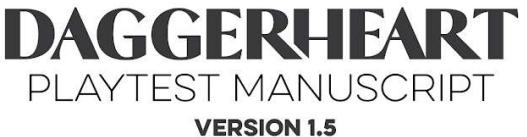
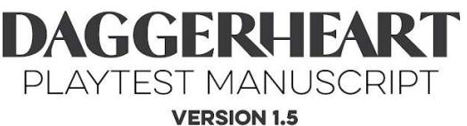
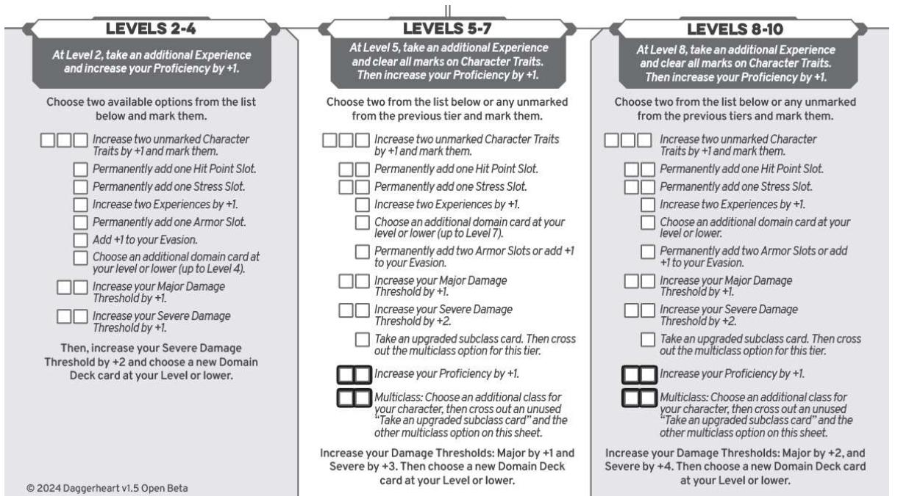
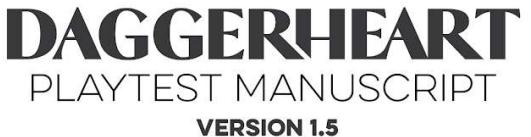

# 阅读领域卡牌 ((阅读领域卡牌))

在角色创建的第8步以及角色升级时，你将获得越来越强大的领域卡牌，它们提供你可以在冒险中使用的能力和法术。

一些领域卡牌提供你可以执行的动作（参见第2章中的“轮到你时”），例如独特的攻击或你施放的法术。另一些则提供被动增益（只要你持有该卡牌就始终生效）、在休整期或社交遭遇中的新能力，甚至是一次性增益。

每张卡牌包含五个要素：

等级和领域。卡牌左上角标明卡牌的等级，其后是其领域符号。你只能选择等于或低于你等级的领域卡牌。

- 召回消耗。卡牌右上角列出一个数字，旁边是一个闪电符号。这是卡牌的召回消耗。这在角色创建时不会影响你，但一旦你达到5级，你的卡牌数量将超过你的配置栏（你的一组激活卡牌）空间。当你想将一张非激活卡牌从你的储藏室移至你的配置栏时，你要么需要在休整期进行，要么标记卡牌上标明的压力值以立即交换。有关使用配置栏和储藏室的更多详细信息，请参见第2章中的“领域卡牌”。
- 类型。在卡牌标题的正上方，卡牌中央说明了其类型。领域卡牌有三种类型：能力、法术和魔典。能力通常本质上是平凡的，而法术本质上是魔法的。魔典是法典领域的专属，是捆绑在一起的较小法术的集合。某些游戏机制仅适用于这些卡牌类型中的一种。

效果。卡牌下半部分的文本描述了其效果，包括使用该卡牌时需要遵循的任何特殊规则。

我预见它的到来 当你成为来自近战范围之外的攻击的目标时，标记一点压力以投掷一个d4骰子，并使你对此攻击的闪避值增加其结果。

[美术师名字待定

有关使用领域卡牌的详细信息，请参见第2章的“领域卡牌”部分。

# 职业 ((职业))

在角色创建期间，你将选择本节中的一个职业，以及其子职业之一。你选择的职业将授予以下特性：

- 领域。每个职业都列出了作为其能力基础的两个领域。这决定了你在角色创建和升级时可以从哪些领域牌组中选择卡牌。
- 初始闪避值。每个职业都有其自己的初始闪避值。当GM对你进行攻击检定时，这是他们需要达到或超过才能命中的数字。
- 伤害阈值。每个职业都有一个独特的伤害阈值（参见第2章中的“伤害阈值和生命值”）。这些决定了你的职业对抗来袭攻击的强度。

职业物品。每个职业都有一套独特的游戏开始时拥有的物品。

职业特性。每个职业都有一个独特的动作（或一组动作），你可以在游戏中使用。

独特希望特性。每个职业都有一个特殊的动作，可以通过花费三点希望来使用。这些动作以职业命名，例如“诗人的希望”。

你选择的子职业将授予以下特性：

施法特质。如果你是施法者，这是你的子职业在任何需要进行施法检定时使用的角色特质。

基础特性。此特性是你从子职业的基础卡牌中获得的独特动作。

专精特性。随着等级的提升，你将有机会选择子职业的专精卡牌，从中获得一个独特的动作（或一组动作）。

掌控特性。随着等级的提升，你将有机会选择子职业的掌控卡牌，从中获得一个独特的动作（或一组动作）。

31

#### 诗人 ((+++诗人))

成为诗人的人是这个职业中最具魅力的一员，他们是吸引注意力的艺术大师，并且可以专精于各种表演类型，包括：唱歌、演奏乐器、编织故事或讲笑话。无论是对观众表演还是与个人交谈，诗人都会表现出色。有许多学校和行会，这个职业的成员聚集在一起建立联系和进行培训，但在那些具有诗人气质的人中，自负情绪也相当普遍。虽然他们最有可能将人们聚集在一起，但一个脾气暴躁的诗人同样容易拆散一个团队。

领域

优雅与法典

初始闪避值

9

伤害阈值

主要 6，严重 12

职业物品

一本浪漫小说或一封从未打开的信

#### 诗人的希望 ((+++诗人的希望))

当你或你附近的一名盟友进行一次风度检定并且成功但带有恐惧，或失败时，花费三点希望通过介入来抵消该检定的后果。

#### 职业特性 ((+++职业特性))

#### 集结 ((+++集结))

每场战役一次，当你的队伍准备进入危险或困难的境地时，描述你如何集结他们，并给你自己和你每个盟友一个d6的集结骰。他们可以花费它来投掷，将结果添加到行动检定、反应检定或伤害检定中，或者清除等同于集结骰结果的压力。

每场战役结束时，所有未花费的集结骰都会被清除。你分发的集结骰在5级时增加到1d8。

### 诗人子职业 ((++诗人子职业))

如果你正在创建一个诗人，选择巧言者或游吟诗人子职业。

#### 巧言者 ((+++巧言者))

如果你想通过巧妙的言辞变得有说服力和强大，就扮演巧言者。施法特质：风度

#### 基础特性 ((+++基础特性))

诗人之心：当你与一个你试图打动、说服或冒犯的人交谈时，你可以花费希望并向针对他们的行动检定增加1d4。

鼓舞人心的演讲：每次长休一次，你可以采取一个行动来进行一次发自内心、鼓舞人心的演讲。所有能听到你演讲的盟友清除两点压力。

32

#### 专精特性 ((+++专精特性))

你知道你动人的言辞可以提升团队的士气。每场战役一次，当你运用你作为语言学家的技能来鼓励或劝告一位盟友时，你可以执行以下操作之一：

- •
- · 在不花费希望的情况下帮助一位盟友。
- 在休息期间给予他们一个额外的休整期动作。

#### 掌控特性 ((+++掌控特性))

你分发的集结骰增加到d10。

此外，每当你帮助一位盟友时，如果你像在回忆录中书写他们英雄事迹那样叙述那个时刻，你帮助他们的优势骰将是d10。

#### 游吟诗人 ((+++游吟诗人))

如果你想演奏音乐来鼓舞你的盟友，就扮演游吟诗人。施法特质：风度

#### 基础特性 ((+++基础特性))

当你获得此基础特性时，描述你擅长演奏的乐器。你可以使用一个动作来演奏每首歌曲，每首歌曲每次长休可演奏一次：

- 当你演奏一首轻松的歌曲时，你和你所有附近的盟友恢复1点生命值。
- · 当你演奏一首史诗般的歌曲时，使一个附近的目标暂时易伤。
- · 当你演奏一首令人心碎的歌曲时，你和你所有附近的盟友获得一点希望。

### 专精特性 ((++专精特性))

你振奋人心的歌曲也能帮助听者坚定勇气。任何通过你的集结能力从你这里获得集结骰的人也可以选择获得一点希望或清除一点压力。

### 掌控特性 ((++掌控特性))

你的技艺可与大师媲美，你的技巧和创造力无限。你的每首基础歌曲在每次长休后都可以额外演奏一次。

## 背景问题 ((+背景问题))

回答以下背景问题或自己编造。

- · 你的社区中是谁教会了你要如此自信？
- 你曾经爱过。那是谁，他们又是如何伤害你的？
- · 你一直很敬佩另一位诗人。他们是谁，你为什么崇拜他们？

### 人脉关系 ((++人脉关系))

- · 是什么让你意识到我们会成为这么好的朋友？
- 我做的什么事会惹恼你？
- 你为什么在晚上抓住我的手？

#### 升级选项 ((+++升级选项))

#### 德鲁伊 ((+++德鲁伊))

成为德鲁伊不仅仅是一种职业，它更是对那些希望学习并保护荒野魔法之人的召唤。那些从事通常是默默无闻的引导植物力量的德鲁伊很可能被低估；而那些引导动物残暴力量的德鲁伊则可能令人望而生畏。众所周知，德鲁伊以小团体形式修行，通常由特定的理念或地域联系在一起。通过多年的学习和奉献，德鲁伊可以学会变形为野兽，并塑造大地及其所有生物。

领域

贤者与奥秘

初始闪避值

8

伤害阈值

主要 7，严重 14

职业物品

一小袋石头和骨头 或 在泥土中发现的奇怪吊坠

德鲁伊的希望

在野兽形态下花费三点希望，使你的伤害阈值增加+3，直到你解除该形态。

