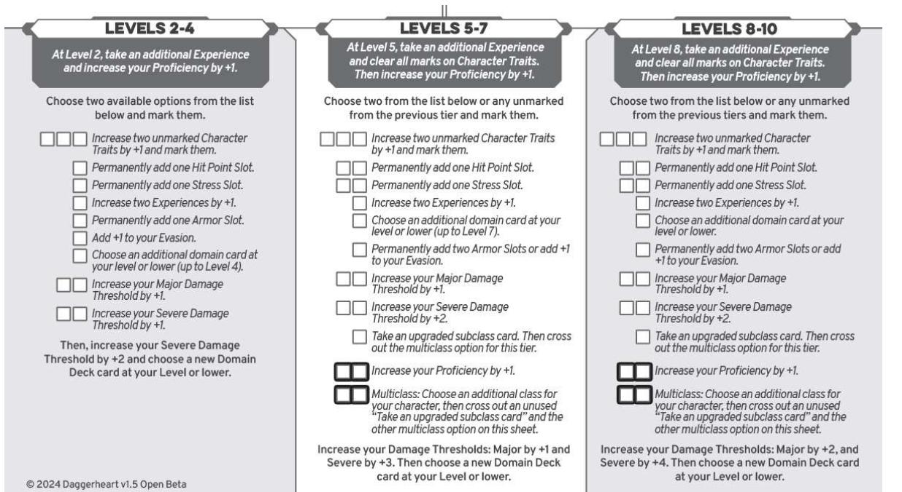

# Reading Domain Cards

During step 8 of character creation and as your character levels up, you'll gain increasingly powerful domain cards, which provide abilities and spells you can utilize during your adventures.

Some domain cards provide moves you can make (see "On your Turn" in chapter 2), like a unique attack or a spell you cast. Others offer passive benefits (which always apply while you hold that card), new abilities during downtime or social encounters, or even one-time benefits.

Each card includes five elements:

Level and Domain. The top left of the card indicates the card's level, followed by its domain symbol. You can only choose domain cards of your level or lower.

- Recall Cost. The top right of the card lists a number next to a lightning bolt symbol. This is the card's Recall Cost. This won't affect you at character creation, but once you reach level 5, you'll have more cards than you do space in your loadout (your set of active cards). When you want to move an inactive card from your vault to your loadout, you'll either need to do so during downtime, or mark the number of Stress indicated on the card to swap it immediately. See "Domain Cards" in chapter 2 for more details on using your loadout and vault.
- Type. Right above the card's title, the center of the card states its type. . There are three types of domain cards: abilities, spells, and grimoires. Abilities are typically mundane in nature, while Spells are magical in nature. Grimoires are unique to the Codex domain and are a collection of smaller spells bundled together. Some game mechanics only apply to one of these types of cards.

Effect. The text on the bottom half of the card describes its effect, including any special rules you need to follow when you use that card.

I SEE IT COMING When you are targeted by an attack coming from beyond melee range, mark a Stress to roll a d4
and increase your Evasion against this attack by its value.

[Artist Name TK

For details on using domain cards, see the "Domain Cards" section of chapter 2.

# Class

During character creation, you'll choose one of this section, along with one of its subclasses. Your chosen class grants the following features:

- Domains. Each class lists which two domains serve as the basis for its abilities. This determines which domain decks you can choose cards from during character creation and when leveling up.
- Starting Evasion Score. Each class has its own starting Evasion"). When the GM makes an attack roll against you, this is the number they need to meet or beat in order to hit.
- Damage Threshold. Each class has a unique Damage Threshold (see "Damage Thresholds and Hit Points" in chapter 2). These determine how strong your class is against incoming attacks.

Class Items. Each class has a unique set of items they begin the game with.

Class Feature. Each class has a unique move (or set of moves) you can utilize during play.

Unique Hope Feature. Each class has a special move they can use by spending three Hope. These are named for the class, a la "Bard's Hope".

Your chosen subclass grants the following features:

Spellcast Trait. If you're a spellcaster, this is the character trait your subclass uses any time you're required to make a spellcast roll.

Foundation Feature. This feature is the unique move you gain from your subclass's Foundation card.

Specialization Feature. As you gain levels, you'll have a chance to choose your subclass's Specialization card, gaining a unique move (or set of moves) from it.

Mastery Feature. As you gain levels, you'll have a chance to choose your subclass's Mastery card, gaining a unique move (or set of moves) from it.

31

#### Bard

Those who become bards are truly the most charismatic members of this class are masters of captivation and may specialize in any of a variety of performance types, including: singing, playing musical instruments, weaving tales, or telling jokes. Whether performing to an audience or speaking to an individual, bards will excel. There are many schools and guilds where members of this profession come together to bond and train, but there is a fair amount of ego within those of the bardic persuasion. While they may be the most likely to bring people together, a bard of ill temper can just as easily tear a party apart.

DOMAINS

Grace & Codex

STARTING EVASION SCORE

g

DAMAGE THRESHOLDS

Major 6, Severe 12

CLASS ITEMS

A Romance Novel or a Letter Never Opened

#### BARD'S HOPE

When you or an ally Close to you makes a Presence roll and either succeeds with Fear or fails, spend three Hope to negate that roll's consequences by intervening.

#### CLASS FEATURE

#### Rally

Once per session as your party prepares to enter a dangerous or difficult situation, describe how you rally them and give yourself and each of your allies a d6 Rally die can spend it to roll it, adding the result to an action roll, reaction roll, or damage roll, or clearing Stress equal to the Rally die result.

At the end of each session, all unspent Rally dice are cleared. The Rally die you distribute increases to 1d8 at level 5.

### BARD SUBCLASSES

If you're creating a bard, choose either the Wordsmith or Troubadour subclass.

#### Wordsmith

Play the Wordsmith if you want to be persuasive and powerful using clever wordplay. Spellcast Trait: Presence

#### Foundation Features

Heart of a Poet: When speaking to a person you're trying to impress, persuade, or offend, you can spend Hope and add 1d4 to the action roll against them.

Rousing Speech: Once per long rest, you can action to give a heartfelt, inspiring speech. All allies who can hear you clear two Stress.

32

#### Specialization Feature

You know your moving words can boost the morale of the group. Once per session, when you use your skills as a linguist to encourage or exhort an ally, you can do one of the following:

- •
- · Help an Ally without spending Hope.
- Give them an additional downtime move during a rest.

#### Mastery Feature

The Rally die you distribute increases to a d10.

In addition, whenever you Help an Ally, if you narrate the moment as if you were writing the tale of their heroism in a memoir, your advantage die to help them is a d10.

#### Troubadour

Play the Troubadour if you want to play music to bolster your allies. Spellcast Trait: Presence

#### Foundation Feature

When you take this Foundation, describe what instrument you are practiced in. You can use an action to perform each song once per long rest:

- When you play a relaxing song, you and any Close allies heal 1 Hit Point.
- · When you play an epic song, make a Close target temporarily Vulnerable.
- · When you play a heartbreaking song, you and any Close allies take a Hope.

### Specialization Feature

Your rallying songs also help steel the courage of those who listen. Anybody who receives a Rally die from you via your Rally ability can also choose to either gain a Hope or clear a Stress.

### Mastery Feature

Your craft rivals the greats, your skill and creativity unbounded. You can perform each of your Foundation songs an additional time per long rest.

## BACKGROUND QUESTIONS

Answer the following background questions or make your own.

- · Who from your community taught you to have such confidence in yourself?
- You were in love once. Who was it with, and how did they hurt you?
- · You've always looked up to another bard. Who are they and why do you idolize them?

### CONNECTIONS

- · What made you realize we were going to be such good friends?
- What do I do that annoys you?
- Why do you grab my hand at night?

#### LEVEL UP OPTIONS

#### Druid

Becoming a druid is more than an occupation, it's a calling to those who wish to learn from and protect the magic of the wilderness. Those druids who practice the often quiet work of channeling flora are likely to be underestimated; while those who channel the brutal forces of animals may be a terrifying thing to behold. Druids are known to cultivate in small groups, often connected by a specific ethos or locale. Through years of study and dedication, druids can learn to transform into beasts and shape the earth and all its organisms.

DOMAINS

Sage & Arcana

STARTING EVASION SCORE

8

DAMAGE THRESHOLDS

Major 7, Severe 14

CLASS ITEMS

A Small Bag of Rocks & Bones OR a Strange Pendant Found in the Dirt

DRUID'S HOPE

Spend three Hope while in Beastform to increase your damage thresholds by +3 until you drop the form.

